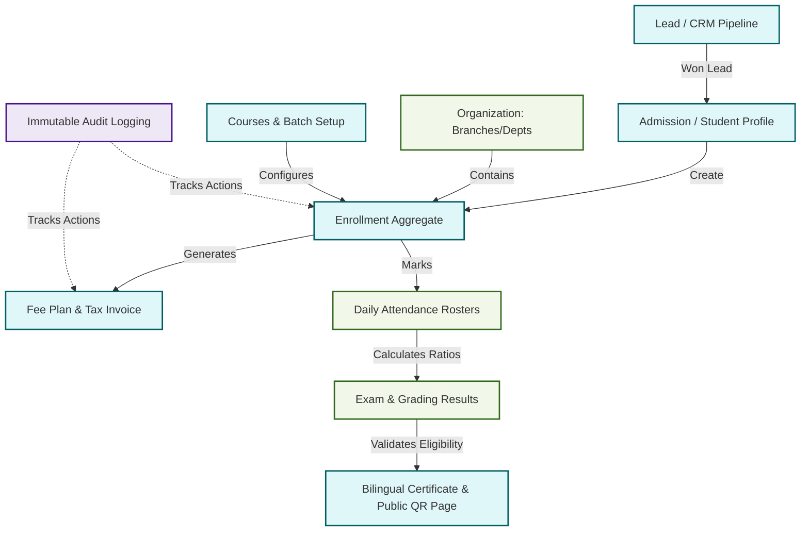

# ASTI Institute Management System (IMS) 
## Client-Facing Implementation & Delivery Roadmap

This document provides a clear, high-level roadmap of how the **Institute Management System (IMS)** is delivered phase-by-phase. It translates the technical Domain-Driven Design (DDD) contexts and Entity Relationship models into a business-focused roll-out plan.

---

## 💡 The Core Design Concept: "Unified Enrollment"

Before looking at the timeline, it is important to understand the heart of the system. In older platforms, regular students, walk-in students, and corporate groups were managed in separate databases. 

In **IMS **, everything revolves around a single, highly robust concept: **Enrollment**.

```
  ┌─────────────────────────────────────────────────────────────┐
  │                     ENROLLMENT (The Heart)                  │
  ├──────────────────────────────┬──────────────────────────────┤
  │    WHO: Student Profile      │    WHAT: Course & Batch      │
  ├──────────────────────────────┼──────────────────────────────┤
  │    FINANCE: Fee & Invoice    │    PROGRESS: Attendance      │
  ├──────────────────────────────┼──────────────────────────────┤
  │    ASSESSMENT: Exams         │    OUTCOME: Certificate      │
  └──────────────────────────────┴──────────────────────────────┘
```

By putting **Enrollment** at the center, we ensure that:
1. **No Data Duplication:** Individual students, walk-ins, and corporate employees share the same course completion rules, certificate templates, and tax invoice systems.
2. **Clean Admissions:** An **Admission** means registering someone as a customer of ASTI. An **Enrollment** means registering them for a specific course or batch. A single student can have multiple enrollments over time without messing up their profile history.
3. **Auditability:** Every financial invoice, attendance correction, and certificate issue is tracked directly under its respective Enrollment.

---

## 🗺️ High-Level Delivery Blueprint

Here is how the modules flow together from the moment a student inquires about a course to the moment their certificate is verified:



---

## 📅 Phase-by-Phase Roll-out Plan

To ensure the fastest possible return on investment (ROI) and minimize operational disruption, the delivery is divided into **four logical phases**:

| Phase | Milestone Name | Key Capabilities Delivered | Business Objective & ROI |
| :--- | :--- | :--- | :--- |
| **Phase 1** | **Core Operations & Manual Finance** | User Access control, Branch setup, Lead CRM, Student Admission, Course/Batch scheduling, Attendance marking, Manual fee receipts (Oman-VAT ready), Exams, and Bilingual Certificate issuance. | **Go-Live Baseline:** Eliminates spreadsheets. All standard training center operations can now be conducted digitally inside the system. |
| **Phase 2** | **Engagement & Analytics** | Automated WhatsApp/SMS alerts, Corporate contract management, Trainer contract hourly payouts, and management reporting dashboards. | **Operational Efficiency:** Saves administrative staff hours via automation and opens up structured B2B corporate billing. |
| **Phase 3** | **Enterprise Business Operations** | Fast-Track Walk-in onboarding, public course calendar, HRMS, Employee Self-Service (ESS), and statutory GCC Payroll. | **Enterprise Integration:** Unifies front-office training with back-office HR/Payroll so employees work in one unified dashboard. |
| **Phase 4** | **Hardware & AI Automation** | Online Payment Gateway integrations, Biometric/RFID attendance sync, Tally ERP sync, and AI conflict prediction/lead scoring. | **Automated Optimization:** Minimizes manual entry, enables online self-payments, and uses AI to prevent booking conflicts. |

---

### 🔍 Detailed Phase Breakdown

#### Phase 1: Core Operations & Manual Finance (Current Focus)
This phase builds the foundation. It handles the complete lifecycle of a student under a manual payment model.

* **Identity & Access Management:** Secure logins, failed login lockouts, password self-resets, and dynamic branch scopes (e.g., Muscat staff only access Muscat data).
* **Organization & Academics:** Configures ASTI branches, departments, classrooms, course catalogs, batch capacities, course pricing rules, and trainer assignments.
* **Lead CRM Pipeline:** Counselor dashboards to track inquiries, schedule follow-ups, assign leads, and convert won inquiries directly into admissions.
* **Student & Enrollment Lifecycle:** Document uploads (Civil ID, Passport copy), student profiles, digital ID card generation, and batch enrollment status tracking (Draft, Confirmed, Active, Completed, Dropped).
* **Scheduling & Attendance:** Daily timetables that prevent trainer or classroom double-bookings, plus trainer attendance registers that lock after marking.
* **Manual Finance:** Configures custom fee plans and installment schedules. Generates Oman-standard tax invoices and receipt vouchers. Tracks outstanding dues and handles manager-approved discounts and refunds.
* **Grading & Certification:** Manages exam grades, controls academic review workflows, generates bilingual (English/Arabic) certificates, and hosts a public-facing QR verification lookup route.
* **Audit Trail:** Append-only log of every financial transaction and grade change to prevent internal leaks or fraud.

---

#### Phase 2: Engagement & Analytics
Once core operations are stable, Phase 2 automates communication and expands B2B corporate operations.

* **Communication Engines:** Automatically triggers SMS, email, and WhatsApp notifications for installment dues, batch start schedules, and attendance warnings.
* **Corporate Training Portal:** Handles B2B accounts, contract value limits (e.g., corporate sponsors paying for 50 employees), corporate program configurations, and bulk participant uploads.
* **Trainer Payouts:** Calculates trainer hours, class weights, and assigns trainer payment milestones before salary runs.
* **Management Dashboards:** Custom analytics widgets showing counselor conversion rates, fee collection performance, and branch capacity reports.

---

#### Phase 3: Enterprise Business Operations
Phase 3 expands the system from an academic training tool into a full corporate platform.

* **Walk-In Fast Track:** A highly specialized wizard that registers, collects payment, assigns to a batch, and issues a receipt for drop-in learners in a single 2-minute flow.
* **HRMS & Employee Profiles:** Manages ASTI employee files, contract terms, document expiries (visas/IDs), leave balances, and shift timings.
* **Employee Self-Service (ESS):** Portal for staff to check payslips, view attendance, request leave, and apply for salary certificates.
* **Statutory GCC Payroll:** Automatically processes monthly salaries, calculates absences/overtimes, tracks End of Service Benefits (EOSB) accruals, and exports bank transfer files.

---

#### Phase 4: Hardware & AI Automation (Final Optimization)
This phase introduces hardware syncing, external software connections, and smart automation.

* **Online Payment Integration:** Links with local GCC merchant gateways and international payment systems (e.g., Stripe, Checkout) to allow online installment self-payment.
* **Biometric Hardware Sync:** Direct integration with biometric/RFID card scanners to log student and employee attendance automatically.
* **Tally ERP Integration:** Syncs daily financial journal entries, tax receipts, and refunds directly into Tally for the corporate accounting team.
* **AI Intelligence:** Smart scheduler suggests optimal batch timings based on classroom availability; AI lead scorer flags high-value inquiries; automated approval predictions flag potential delays.

---

## 🛠️ Verification & Quality Assurance Standards

To guarantee that each phase is delivered in a production-ready, stable state:

1. **Relational Constraints:** Databases strictly enforce that two students cannot have the same Student ID, and receipt numbers can never duplicate.
2. **Branch Scoping Checks:** Checked during every release to ensure branch isolation rules are never bypassed (e.g. Branch A counselor cannot edit Branch B leads).
3. **Automated Test Coverage:** Run before any delivery milestone:
   * **Unit Tests:** Validate business invariants (e.g., "Cannot issue certificate if fees are outstanding").
   * **API Contract Checks:** Validate request payloads and server responses.
   * **End-to-End Workflows:** Automated browser tests mimicking the actual steps a user takes (Lead ➔ Admission ➔ Payment ➔ Attendance ➔ Certificate).

---

## 📊 Summary Checklist of Delivery Contexts

```
[Phase 1] ──────────────────────────────────────────► [Phase 2] ──────────────────────────► [Phase 3] ──────────────────► [Phase 4]
✔ Identity & Access       ☐ CRM Lead Conversion       ☐ Communication Logs         ☐ Walk-In Fast Track        ☐ Online Payments
✔ Organization Core       ☐ Course & Batch Pricing    ☐ Corporate Contracts        ☐ HRMS Employee Master      ☐ Biometric RFID Sync
☐ Student Admissions      ☐ Attendance Marking        ☐ Trainer Payments Log       ☐ Employee Self Service     ☐ Tally ERP Integration
☐ Enrollment Aggregate    ☐ Manual VAT Receipts       ☐ Advanced Reporting         ☐ GCC Payroll Engine        ☐ AI Smart Scheduling
☐ Scheduling Engine       ☐ Exam Completion Rules                                                              ☐ AI Lead Scoring
☐ Certificate QR Lookup   ☐ Document Intake Checks
```
*(Items marked ✔ are foundationally in place; others are scheduled chronologically as per active implementation priorities.)*
