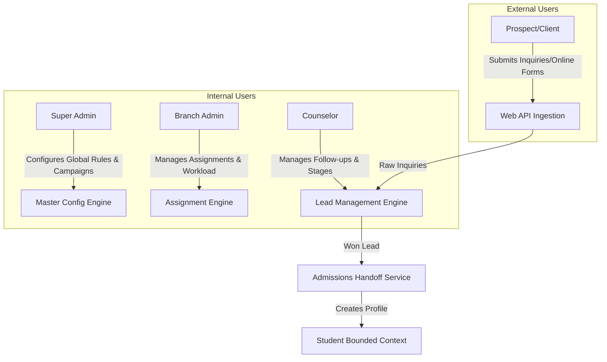

# ASTI IMS: Functional Requirement Document
## Module 03: Lead & Inquiry Management

**Version:** 1.0  
**Module Code:** LEAD  
**Phase:** Phase 1  
**Owned Bounded Context:** Lead, Enquiry & CRM Management  

---

## 1. Purpose and Objective

The **Lead & Inquiry Management** module serves as the primary system of record for capturing, qualifying, assigning, and tracking prospective students and corporate entities before they are admitted to the Al Saud Training Institute (ASTI). 

Its objective is to optimize counselor productivity, ensure timely follow-ups, attribution of lead sources, prevent duplicate records, and enforce strict branch-level isolation, culminating in a seamless handoff of qualified prospects to the **Admission & Enrollment Management** context.

---

## 2. Business Goals

| Goal ID | Title | Description | Metric/KPI |
| :--- | :--- | :--- | :--- |
| **BO-LEAD-001** | Optimize Lead Response Time | Reduce the time elapsed between inquiry ingestion (e.g., website form submission) and first counselor contact. | Target average response time < 4 hours. |
| **BO-LEAD-002** | Prevent Lead Loss/Leakage | Ensure every active lead has an upcoming scheduled follow-up. | zero (0) active leads with overdue or missing follow-ups. |
| **BO-LEAD-003** | Increase Conversion Rates | Streamline CRM processes to identify high-intent leads and convert them to students. | Increase Lead-to-Admission conversion by 15%. |
| **BO-LEAD-004** | Enforce Branch Security | Prevent unauthorized counselor cross-access or data theft between different branches. | Zero unauthorized cross-branch read/write incidents. |
| **BO-LEAD-005** | Maintain Lead Attribution | Accurately trace leads to their source of origin (organic web, social campaign, walk-in). | 100% of leads categorized with a valid, active lead source. |

---

## 3. Scope

### 3.1 Included in Phase 1
* **Inquiry Ingestion**: Capturing initial contact records from walk-ins, phone inquiries, social media channels, and public website API inputs.
* **Lead Ingestion & Qualification**: Converting basic raw inquiries into detailed leads upon qualification by counselor or administrator.
* **Counselor Assignment**: Assigning inquiries and leads to specific counselors manually or via branch-scoped automated allocation.
* **Lead Source & Stage Management**: Branch-scoped configuration of active stages and sources.
* **Follow-up Tracking**: Scheduling follow-up tasks, logging follow-up types (Call, Email, WhatsApp, Visit), capturing outcome notes, and calculating next follow-up dates.
* **Duplicate Detection Warning**: Checking civil ID, email, and phone number against existing Leads and Students, flagging duplicates without locking out creation (unless forced by branch policy).
* **Campaign Attribution**: Mapping inquiries and leads to UTM marketing campaigns to calculate cost-per-lead and source effectiveness.
* **Admissions Handoff (Conversion)**: Exporting lead profiles, civil ID documents, and qualification metadata directly into the Admissions context once a lead is marked "Won".
* **Lead Activity Timeline**: Auto-generating a chronological audit list of status updates, assignment shifts, and follow-ups.

### 3.2 Excluded from Phase 1 (Deferred to Phase 2/3)
* Full CRM marketing automation (e.g., automated email drip sequences or SMS campaigns directly from the system).
* AI lead scoring or predictive demand algorithms.
* Public external candidate portals.
* Direct sync or native API integrations with Facebook Ads, Google Ads, or Snapchat Ads dashboards (stored as static campaign parameters).

---

## 4. Stakeholders & Actors

### 4.1 Human Actors
* **Super Admin**: Has global read/write access to all lead configurations, stages, sources, campaign budgets, and consolidated reporting across all branches.
* **Branch Admin / Academic Coordinator**: Oversees branch operations, assigns counselor workloads, monitors follow-up compliance within their assigned branch, and configures branch-level rules.
* **Counselor**: Manages their assigned portfolio of leads. Captures inquiries, creates follow-up logs, updates lead stages, and initiates the "Won" or "Lost" outcomes for their allocated leads.
* **Prospect (Student / Corporate Contact)**: External actor who initiates contact via website forms or walk-ins, requesting course details.

### 4.2 System Actors
* **Public Web Ingestion Engine**: An API client that parses public website inquiries and registers them into the `WebsiteInquiry` and `OnlineRegistration` tables.
* **Background Scheduler Service**: Checks lead follow-up calendars daily, flagging overdue follow-ups, updating lead scores, and generating alerts for counselors.
* **Downstream Admission System**: Receives the conversion command and consumes the lead data to seed a new `Student` and `Admission` record.

---

## 5. Functional Overview

```text
Lead & Inquiry Bounded Context
 ├── Inquiry Intake Management
 │    ├── Manual Inquiry Capture
 │    ├── Public Web API Ingestion
 │    └── Lead Source Mapping
 ├── Lead Qualification & Management
 │    ├── Duplicate Verification Engine
 │    ├── Inquiry-to-Lead Qualification
 │    └── Stage Transition Policy Guard
 ├── Counselor Portfolio Management
 │    ├── Assignment Engine (Manual & Workload-based)
 │    ├── Assigned Branch Isolation Rules
 │    └── Counselor Load Dashboard
 ├── Follow-Up Tracking System
 │    ├── Action Scheduler (Call, WhatsApp, Email, Visit)
 │    ├── Outcome Logger
 │    └── Overdue Follow-up Notification Engine
 ├── Marketing Campaign Tracker
 │    ├── Campaign Budget & Time Config
 │    └── UTM Parameter Attribution
 └── Admissions Hand-off
      ├── Lead "Won" Status Transition Check
      └── Seed Party, Person, and Student Profile
```

---

## 6. Business Capabilities & User Types



---

## 7. Functional Requirements Checklist

| Requirement ID | Title | Summary | Priority |
| :--- | :--- | :--- | :--- |
| **FR-LEAD-001** | Manual Inquiry Ingestion | Capture walk-in or telephone inquiries with branch association. | Must Have |
| **FR-LEAD-002** | Public Web API Ingestion | Ingest online requests from external website forms. | Must Have |
| **FR-LEAD-003** | Configurable Lead Sources | Configure lead attribution channels (Walk-In, Web, Campaign, Referral, Phone, WhatsApp, Facebook, Instagram, Google Ads, Corporate Referral). | Must Have |
| **FR-LEAD-004** | Configurable Lead Stages | Configure sequence pipelines (New, Contacted, Follow-Up, Qualified, Won, Lost, Converted). | Must Have |
| **FR-LEAD-005** | Duplicate Verification Engine | Search database for matching email, phone, or civil ID and return warning. | Must Have |
| **FR-LEAD-006** | Inquiry Qualification | Promote raw inquiries to managed leads. | Must Have |
| **FR-LEAD-007** | Manual Lead Creation | Direct counselor registration of hot prospects bypassing raw inquiries. | Must Have |
| **FR-LEAD-008** | Counselor Manual Assignment | Reassign leads manually to authorized counselors within the branch. | Must Have |
| **FR-LEAD-009** | Counselor Auto-Assignment | Auto-allocate incoming inquiries/leads using workload-based logic. | Should Have |
| **FR-LEAD-010** | Follow-Up Scheduling | Set follow-up date, time, and type (Call, Visit, WhatsApp, Email). | Must Have |
| **FR-LEAD-011** | Follow-Up Outcome Logging | Record outcomes and notes for completed follow-up interactions. | Must Have |
| **FR-LEAD-012** | Overdue Follow-up Notification | Generate alerts and flag leads with past-due scheduled touchpoints. | Must Have |
| **FR-LEAD-013** | Lost Outcome Mandate | Enforce capture of standard lost reason code and notes when closing a lead. | Must Have |
| **FR-LEAD-014** | Won Outcome Mandate | Validate contact details, Civil ID uploads, and birthdate before marking Won. | Must Have |
| **FR-LEAD-015** | Decoupled Admissions Handoff | Call Admissions Context API to spawn Student Profile and Admission record. | Must Have |
| **FR-LEAD-016** | Lead Activity Timeline | Compile a chronological vertical feed of assignments, stages, and notes. | Must Have |

---

## 8. Permission Model Overview

The module uses Role-Based Access Control (RBAC) mapped directly to fine-grained scopes. No roles are hardcoded; permissions are evaluated server-side.

* **Lead & Inquiry Actions**:
  * `lead.create`: Ability to manually add a lead.
  * `lead.read`: Access to lead details (scoped by branch).
  * `lead.update`: Ability to edit profile details and stages.
  * `lead.assign`: Ability to change assigned counselor.
  * `lead.qualify`: Promote inquiry to lead.
  * `lead.won`: Transition lead to won and trigger admissions.
  * `lead.lost`: Transition lead to lost (requires reason).
  * `lead.config`: Edit lead sources and stage parameters.
  * `lead.export`: Export lead lists (restricted permission).
  * `report.leads`: Access to consolidated lead analytics dashboards.

* **Branch Scoping**:
  * Counselors can only read and update leads assigned to them within their assigned branch.
  * Branch Admins can view and assign all leads within their branch context.
  * Users with the explicit `consolidatedVisibility` flag on their branch access policy can run cross-branch reports.

---

## 9. Security & Audit Requirements Summary

1. **PII Data Security**: Mobile phone numbers and email addresses must be encrypted at rest or strictly audited. Civil IDs must be stored and masked on screen (except for authorized admission staff).
2. **State Transition Auditing**: Any change to `stage` or `status` must write a record to `AuditLog` containing:
   * `performedBy`: User ID
   * `entityType`: `Lead`
   * `entityId`: Lead UUID
   * `oldValue`: JSON of old stage & status
   * `newValue`: JSON of new stage & status
   * `reason`: Input text (mandatory for Won/Lost/Reassigned transitions).
3. **Data Isolation Security**: API route handlers must validate that `branchId` supplied in query filters or mutation payloads exists in the user's `UserBranchAccess` permission list.

---

## 10. Non-Functional Requirements Summary

1. **Performance**: Lead listing screens (with filter criteria applied) must render in under **400ms** for active branch portfolios containing up to 100,000 records.
2. **Availability**: The Web Ingestion API endpoint must maintain **99.9% uptime** to ensure online inquiries are never dropped.
3. **Usability**: Responsive bidi dashboard layout allowing clean Arabic (RTL) views for counselors operating on mobile phones or tablets in field campaigns.
4. **Data Integrity**: Concurrency protection on stage updates via Prisma version tracking (`version` increment check).
