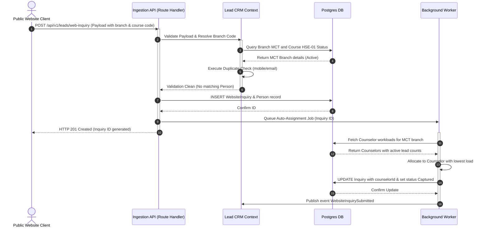
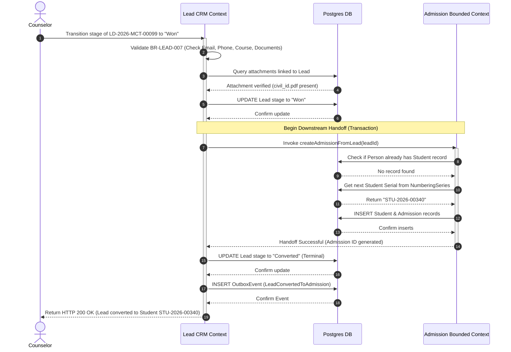
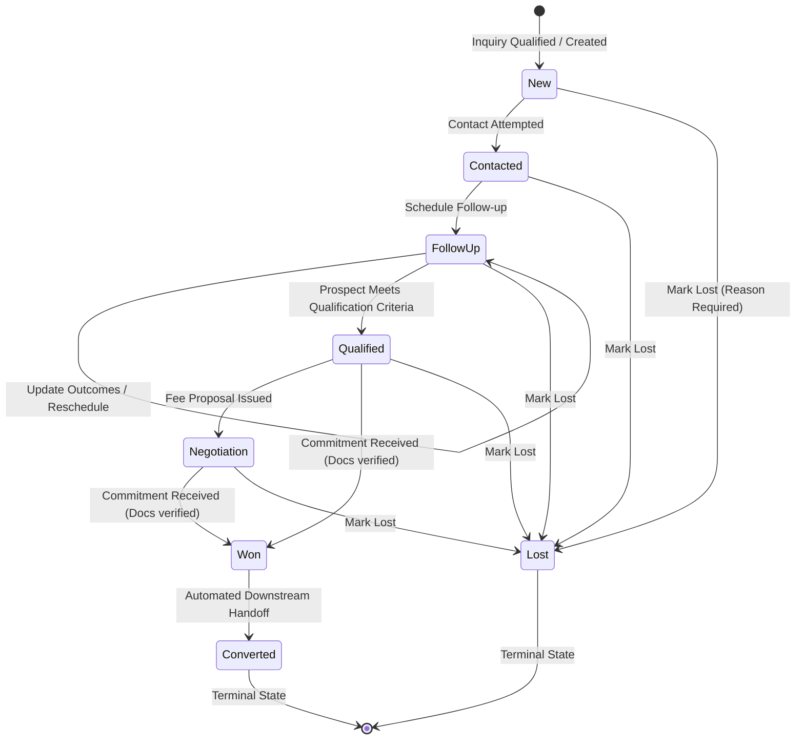

# ASTI IMS: Functional Requirement Document
## Module 03: Lead & Inquiry Management
### Part 2 – User Stories, Use Cases, Workflows, State Machines

---

## 1. User Stories

### US-LEAD-001: Manual Inquiry Ingestion (Must Have)
**As a** Receptionist or Counselor  
**I want to** manually enter walk-in or phone-in inquiry details  
**So that** I can capture the contact details and interest before qualification  

```gherkin
Feature: Manual Inquiry Ingestion
  Scenario: Successfully capture walk-in inquiry with mobile phone
    Given the Receptionist is logged in to the Muscat branch
    And the Receptionist has "lead.create" permission
    When the Receptionist enters "Ahmed" as first name, "Al-Balushi" as last name
    And the Receptionist selects lead source "WalkIn"
    And the Receptionist enters phone number "+96891234567"
    And the Receptionist saves the inquiry
    Then the system generates inquiry number with prefix "INQ-2026-MCT-"
    And the inquiry status is set to "Captured"
    And the system logs the "InquiryCreated" audit event
```

---

### US-LEAD-002: Web Inquiry Auto-Ingestion (Must Have)
**As a** Marketing Team Member  
**I want** inquiries submitted via the ASTI public website to automatically create inquiry records  
**So that** counselors can view and respond to them without delay  

```gherkin
Feature: Web Inquiry Ingestion
  Scenario: Ingest website contact form with UTM parameters
    Given the Web API client is authenticated with a valid API token
    When the website submits an inquiry payload with:
      | Field          | Value                   |
      | firstName      | Fatima                  |
      | lastName       | Al-Riyami               |
      | phone          | +96899887766            |
      | email          | fatima.riyami@gmail.com  |
      | courseCode     | HSE-01                  |
      | branchCode     | MCT                     |
      | utmSource      | facebook                |
      | utmMedium      | cpc                     |
      | utmCampaign    | safety_summer_2026      |
    Then the system creates a new inquiry record
    And sets the lead source to "Website"
    And links the UTM campaign parameters
    And transitions the inquiry status to "Captured"
```

---

### US-LEAD-003: Duplicate Ingestion Verification Warning (Must Have)
**As a** Counselor  
**I want to** see a warning if I enter an inquiry with a phone number or email that already exists in the system  
**So that** I do not create duplicate leads for the same prospect  

```gherkin
Feature: Duplicate Inquiry Check
  Scenario: Warning displayed when entering duplicate mobile number
    Given the Counselor is logged in to the Muscat branch
    And an active lead exists for "Salim Al-Harthy" with phone "+96895551212"
    When the Counselor attempts to save a new inquiry with phone "+96895551212"
    Then the system halts the transaction
    And returns a duplicate warning listing Lead Number "LD-2026-MCT-00045"
    And prompts the Counselor to choose "Confirm and Merge" or "Proceed Anyway as Duplicate"
```

---

### US-LEAD-004: Inquiry Qualification (Must Have)
**As a** Counselor  
**I want to** qualify a raw inquiry and promote it to a lead  
**So that** I can start tracking negotiation stages and schedule follow-ups  

```gherkin
Feature: Inquiry Qualification
  Scenario: Successfully qualify inquiry into a lead
    Given the Counselor is logged in to the Muscat branch
    And has "lead.qualify" permission
    And an inquiry exists with number "INQ-2026-MCT-00102" in "Captured" status
    When the Counselor clicks "Qualify" and selects interested course "HSE-01"
    Then the system changes the inquiry status to "Qualified"
    And creates a new Lead record with stage "New"
    And generates a unique Lead number starting with "LD-2026-MCT-"
    And logs "InquiryQualified" and "LeadCreated" in the audit tables
```

---

### US-LEAD-005: Counselor Workload Assignment (Must Have)
**As a** Branch Admin  
**I want to** manually assign or reassign leads to counselors in my branch  
**So that** I can balance the branch workload and match prospects to the right counselor  

```gherkin
Feature: Counselor Assignment
  Scenario: Reassign a lead to a counselor
    Given the Branch Admin is logged in to the Muscat branch
    And has "lead.assign" permission
    And a lead "LD-2026-MCT-00056" is assigned to counselor "Said Al-Masri"
    When the Branch Admin reassigns the lead to counselor "Hilal Al-Kindi"
    Then the system updates the lead's "counselorId" field
    And inserts a system-generated timeline event "Lead reassigned from Said Al-Masri to Hilal Al-Kindi"
    And logs the "LeadAssigned" audit event
```

---

### US-LEAD-006: Follow-up Scheduling & Completion Logging (Must Have)
**As a** Counselor  
**I want to** schedule a future follow-up date and record outcome notes for past follow-ups  
**So that** I can track prospect communication history and never miss a scheduled call  

```gherkin
Feature: Follow-up Scheduling & Logs
  Scenario: Schedule and log a call follow-up
    Given the Counselor is logged in and assigned to lead "LD-2026-MCT-00088"
    When the Counselor logs a call follow-up outcome as "Answered"
    And inputs notes "Prospect interested but requested discount details"
    And schedules the next follow-up for "2026-07-05 10:00:00"
    Then the system updates the current follow-up status to "Completed"
    And inserts a new follow-up record with status "Scheduled" for "2026-07-05 10:00:00"
    And updates the lead's next follow-up date reference to "2026-07-05 10:00:00"
```

---

### US-LEAD-007: Terminal Won Transition & Handoff (Must Have)
**As a** Counselor or Academic Coordinator  
**I want to** mark a lead as Won when they commit to enrollment  
**So that** the system automatically generates a Student Profile and Admission record in the database  

```gherkin
Feature: Lead Won Conversion
  Scenario: Transition lead to Won with mandatory fields satisfied
    Given the Counselor is logged in and assigned to lead "LD-2026-MCT-00099"
    And the lead has mobile "+96891112222" and email "prospect.won@gmail.com"
    And the lead has an uploaded Civil ID document link "docs/civil_ids/prospect_won_id.pdf"
    When the Counselor transitions the stage to "Won"
    Then the system updates the lead stage to "Won"
    And triggers the Admissions handoff transaction
    And creates a new Student record in "students"
    And creates a new Admission record in "admissions"
    And transitions the lead stage to "Converted"
    And logs the "LeadConvertedToAdmission" audit event
```

---

### US-LEAD-008: Terminal Lost Transition & Reason Capture (Must Have)
**As a** Counselor  
**I want to** record a categorized reason and detailed notes when marking a lead as Lost  
**So that** the marketing team can analyze loss trends and drop sources  

```gherkin
Feature: Lead Lost Logging
  Scenario: Transition lead to Lost requires reason code
    Given the Counselor is logged in and assigned to lead "LD-2026-MCT-00104"
    When the Counselor transitions the stage to "Lost"
    And selects reason code "PriceTooHigh"
    And writes note "Prospect chose competitor due to 20% lower price point"
    Then the system sets the lead stage to "Lost"
    And cancels all pending "Scheduled" follow-ups for this lead
    And logs the "LeadLost" audit event with reason metadata
```

---

## 2. Primary Use Cases

### UC-LEAD-001: Capture and Qualify Inquiry
* **Primary Actor**: Receptionist or Public Website Integration API
* **Preconditions**: Actor is authenticated and possesses write permissions for inquiries.
* **Main Success Scenario**:
  1. Actor submits the inquiry form with first name, last name, phone number, branch selection, and lead source.
  2. The system checks for active branch status (`BranchStatus == Active`).
  3. The system executes duplicate checks against the database; no matching phone or email is found.
  4. The system auto-resolves the numbering series prefix for the branch and assigns `INQ-{YYYY}-{BRANCH_CODE}-{5_DIGIT_SERIAL}`.
  5. The system saves the inquiry record in `Captured` status.
  6. The Counselor reviews the inquiry list, selects the captured inquiry, clicks "Qualify", validates the interest, and links the targeted course.
  7. The system creates a `Person` profile and a `Lead` record, setting the stage to `New`.
  8. The system transitions the inquiry status to `Qualified`.
* **Alternative Flows**:
  * **Alternative Flow A (Duplicate Detected)**:
    * At step 3, the system finds matching contact details.
    * The system flags a warning to the manual user: "Duplicate candidate found: [Student/Lead ID]".
    * The user selects "Force Create" to proceed, or "Cancel" to abort. If "Force Create" is chosen, the system creates the inquiry and links the `duplicateRefId`.
  * **Alternative Flow B (Branch Inactive)**:
    * At step 2, the branch status is `Closed` or `Suspended`.
    * The system halts execution and throws `ERR_CRM_BRANCH_INACTIVE` error code.
* **Postconditions**:
  * Inquiry status is `Qualified` (read-only).
  * A new `Lead` record is initialized.

---

### UC-LEAD-002: Schedule and Execute Counselor Follow-up
* **Primary Actor**: Counselor
* **Preconditions**: Counselor has branch access rights. Lead is in an active pipeline stage (New, Contacted, FollowUp, Qualified, Negotiation).
* **Main Success Scenario**:
  1. Counselor selects the assigned Lead, clicks "Schedule Follow-up".
  2. Counselor inputs the future Date-Time, Follow-up Type (Call, WhatsApp, Email, Visit), and optional agenda.
  3. The system saves the task as `Scheduled` and updates the lead's `nextFollowUpDate` field.
  4. At the scheduled time, the Counselor contacts the prospect, opens the follow-up panel, and selects "Log Outcome".
  5. Counselor inputs outcome code (e.g. `Answered`), logs details of the conversation, and toggles "Schedule Next" to false.
  6. The system changes the follow-up task status to `Completed` and clears the lead's `nextFollowUpDate` field.
* **Alternative Flows**:
  * **Alternative Flow A (Follow-up scheduled in the past)**:
    * At step 2, Counselor sets a timestamp earlier than current system clock + 5 minutes.
    * The system displays verification error `ERR_CRM_PAST_FOLLOWUP_DATE` and blocks saving.
  * **Alternative Flow B (Next follow-up required)**:
    * At step 5, Counselor toggles "Schedule Next" to true and enters a future date.
    * The system updates current follow-up to `Completed` and automatically inserts a new `Scheduled` follow-up record.
* **Postconditions**:
  * Historical follow-up is archived.
  * Timeline shows follow-up activity.

---

### UC-LEAD-003: Concluding Lead Won & Admission Handoff
* **Primary Actor**: Counselor or Academic Coordinator
* **Preconditions**: Lead is in active stage. User has `lead.won` and `lead.qualify` permissions.
* **Inputs**:
  * `leadId` (UUID)
* **Main Success Scenario**:
  1. User changes the lead stage to `Won`.
  2. The system checks terminal won validation invariants (BR-LEAD-007):
     * Phone, email, interested course are set.
     * Document attachments (civil ID or passport scan) are linked.
  3. The system changes lead stage to `Won`.
  4. The system opens a database transaction:
     * Generates a new Student profile from the `Person` record and assigns a unique Student Number via the `NumberingSeries`.
     * Generates an `Admission` record linked to the student and the target course.
     * Sets Lead stage to `Converted`.
  5. The system commits the transaction.
  6. The system emits a `LeadConvertedToAdmission` domain event to trigger automated setup of default installment fee plans.
* **Alternative Flows**:
  * **Alternative Flow A (Missing Mandatory Fields/Documents)**:
    * At step 2, the email field is null or no files are attached.
    * The system aborts the transition, displays error code `ERR_CRM_WON_PRECONDITIONS_MISSED`, and lists missing fields.
  * **Alternative Flow B (Transaction Failure)**:
    * At step 4, database write fails (e.g. unique constraint collision on Student Number).
    * The system rolls back the transaction, reverts Lead stage to `Qualified`, logs the error, and alerts the administrator.
* **Postconditions**:
  * Lead record is in terminal read-only stage `Converted`.
  * Student and Admission profiles are created.

---

## 3. Business Workflows

### 3.1 Web Lead Auto-Ingestion & Assignment Flow



### 3.2 Lead Qualification and Admissions Conversion Flow



---

## 4. State Machines

### 4.1 Lead Stage Transition State Diagram



### 4.2 Lead Stage Transition Matrix & Permissions

| From Stage | To Stage | Allowed? | Triggering Action / Event | Permission Required |
| :--- | :--- | :---: | :--- | :--- |
| **New** | Contacted | Yes | Log call attempt. | `lead.update` |
| **New** | Lost | Yes | Prospect rejects interest immediately. | `lead.lost` |
| **Contacted** | FollowUp | Yes | Save future follow-up task. | `lead.update` |
| **Contacted** | Lost | Yes | Lead marked lost. | `lead.lost` |
| **FollowUp** | FollowUp | Yes | Log completed outcome and schedule next. | `lead.update` |
| **FollowUp** | Qualified | Yes | Link to interested course and mark qualified. | `lead.update` |
| **FollowUp** | Lost | Yes | Lead marked lost. | `lead.lost` |
| **Qualified** | Negotiation | Yes | Generate fee proposal summary. | `lead.update` |
| **Qualified** | Won | Yes | Change stage to Won (Validates documents). | `lead.won` |
| **Qualified** | Lost | Yes | Lead marked lost. | `lead.lost` |
| **Negotiation** | Won | Yes | Change stage to Won (Validates documents). | `lead.won` |
| **Negotiation** | Lost | Yes | Lead marked lost. | `lead.lost` |
| **Won** | Converted | Yes | Automated step: Admission creation success. | *System Only* |
| **Converted** | *Any Stage* | No | Blocked. Converted leads are read-only. | *None (Prohibited)* |
| **Lost** | New | Yes | Re-engage lost lead (Academic Coord override). | `lead.config` |

Every stage transition executed via the table above MUST write a record to the dedicated `LeadStageHistory` table, registering the old stage, new stage, performer UUID, timestamp, and optional lost reason values.

