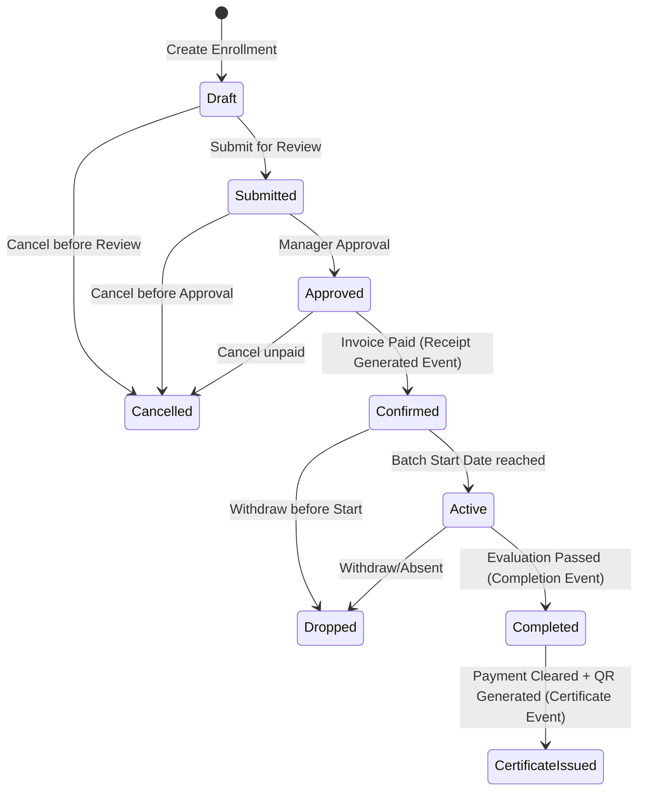
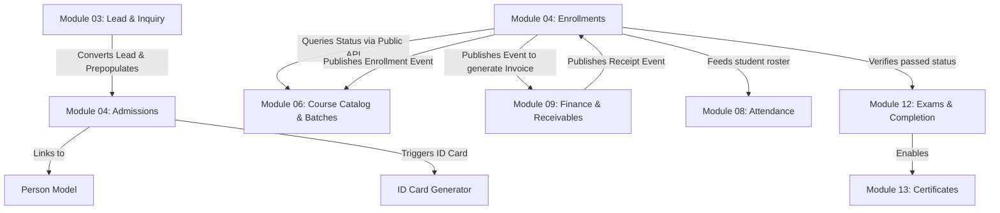

# Functional Requirement Document (Part 1)
## Module 04: Admission & Enrollment Management – Business Specifications & Rules

---

## 1. Introduction and Business Benefits

The Admission & Enrollment Management module acts as the core intake engine of the Al Saud Training Institute (ASTI) Integrated Institute Management System (IMS). By decoupling **Admission** (establishing a student's legal and administrative profile at the institute) from **Enrollment** (scheduling a student into a specific course and batch), the system achieves maximum operational flexibility.

### Key Business Benefits:
1.  **Deduplicated Biological Records:** Linking every Student profile to a single physical `Person` record eliminates redundant data entries and ensures clean communication channels.
2.  **Enforced Branch Isolation:** Operates under strict server-side tenant scoping, preventing unauthorized staff from accessing or leakage of learner information across ASTI branches.
3.  **Strict Audit Trails:** Records all historical state changes of admissions and enrollments, preserving corporate auditing history.
4.  **Optimized Batch Planning:** Real-time capacity checks prevent trainer double-bookings and batch over-enrollment, improving training delivery metrics.
5.  **Multi-Intake Adaptability:** A single database entity (`Enrollment`) handles standard retail learners, corporate nominations, online self-paced participants, and fast-track walk-ins.

---

## 2. Detailed Functional Requirements

### FR-ADM-001: Create Student Profile with Person Link
*   **Description & Actors:** Creates a system `StudentProfile` for a customer. The Registrar or Counselor performs this action. The student profile is linked directly to a master `Person` record.
*   **Preconditions:** 
    *   The user must have the `ADMISSION_CREATE` permission.
    *   The target `Person` record must already exist (or be created in the same transaction) and not be soft-deleted.
*   **Inputs:**
    *   `personId` (UUID)
    *   `branchId` (UUID)
*   **Processing Steps:**
    1.  Validate that the user's session has write access to the targeted `branchId`.
    2.  Check if a `StudentProfile` record already exists linking to the given `personId`. If yes, throw a `DuplicateStudentDetected` exception.
    3.  Generate a unique, non-repeating `studentNumber` using the configured numbering series pattern (e.g., `STU-YYYY-XXXXX`).
    4.  Create the `StudentProfile` database record with status `Active` and soft-delete flags initialized (`isDeleted = false`, `deletedAt = null`).
    5.  Publish `StudentProfileCreated` via the transaction outbox table.
*   **Outputs & Postconditions:**
    *   A new `StudentProfile` record is persisted in the database.
    *   Return the generated `studentNumber` and `studentProfileId` to the client.
*   **Priority:** Must Have (MoSCoW).

---

### FR-ADM-002: Create Admission
*   **Description & Actors:** Registers an official admission application for a student to study at ASTI. Handled by the Counselor or Registrar.
*   **Preconditions:**
    *   The `StudentProfile` record must exist and be active.
    *   The `Branch` (logical reference) must be active.
*   **Inputs:**
    *   `studentProfileId` (UUID)
    *   `branchId` (UUID)
    *   `admissionDate` (Date)
    *   `leadId` (UUID, Nullable)
*   **Processing Steps:**
    1.  Verify the student profile is active in the database.
    2.  Validate branch status by calling a read-only query service in the Organization Management context.
    3.  Generate a unique `admissionNumber` using the configuration numbering series (e.g. `ADM-YYYY-XXXXX`).
    4.  Create the `Admission` record in the `Draft` state with the generated `admissionNumber`.
    5.  If `leadId` is provided, verify it is in a qualified stage and write an audit log entry documenting lead conversion.
    6.  Save default metadata: `createdAt`, `createdBy` set to active user, `isDeleted = false`.
    7.  Write a record to the `AuditLog` table capturing the creation of the admission application in `Draft` state under the active branch.
    8.  Publish `AdmissionCreated` to the outbox.
*   **Outputs & Postconditions:**
    *   Persists a new `Admission` record linked to the student profile and branch, containing a unique `admissionNumber`.
*   **Priority:** Must Have (MoSCoW).

---

### FR-ADM-003: Soft-Delete Student Profile or Admission
*   **Description & Actors:** Performs a logical soft delete on a Student profile or Admission record to withdraw them from active registries while retaining auditing history. Handled by the Super Admin or Branch Manager.
*   **Preconditions:**
    *   The user must have the `ADMISSION_DELETE` or `STUDENT_DELETE` permission.
    *   The record to be deleted must not be already soft-deleted.
*   **Inputs:**
    *   `targetId` (UUID)
    *   `entityType` (Enum: StudentProfile, Admission)
    *   `reasonCode` (String)
*   **Processing Steps:**
    1.  Validate that the user's session has write access to the targeted record's `branchId` (or global access for Super Admin).
    2.  Check for active dependencies:
        *   If `entityType = StudentProfile`, verify that the student profile does not have any active or confirmed `Enrollment` records. If they do, block deletion and throw `ERR_STUDENT_HAS_ACTIVE_ENROLLMENTS`.
        *   If `entityType = Admission`, verify no active `Enrollment` is linked to this admission. If there is, block deletion.
    3.  Perform the soft delete: update the target record setting `isDeleted = true`, `deletedAt = now()`, and `deletedBy = activeUserId`.
    4.  Write a record to the `AuditLog` table capturing the soft deletion event, the entity type, the record ID, and the `reasonCode` under the target branch.
    5.  Publish `StudentProfileDeleted` or `AdmissionDeleted` to the outbox.
*   **Outputs & Postconditions:**
    *   The record is marked as deleted (`isDeleted = true`) in the database.
*   **Priority:** Must Have (MoSCoW).

---

### FR-ENR-001: Create Enrollment Draft
*   **Description & Actors:** Initiates a course enrollment request for an admitted student. Initiated by the Registrar, Counselor, or via online API for online registrations.
*   **Preconditions:**
    *   An approved `Admission` record must exist for the student profile.
    *   The target `Course` and `Batch` must be active (verified via Course Catalog & Training Delivery query services).
*   **Inputs:**
    *   `studentProfileId` (UUID)
    *   `admissionId` (UUID)
    *   `courseId` (UUID)
    *   `batchId` (UUID)
    *   `branchId` (UUID)
    *   `enrollmentType` (Enum: Regular, Corporate, WalkIn, Online)
    *   `corporateParticipantId` (UUID, Nullable)
*   **Processing Steps:**
    1.  Verify the `Admission` status is `Approved` (except for Walk-In flows which bypass this).
    2.  Validate course and batch status by querying the Course Catalog and Training Delivery modules respectively.
    3.  Assert that `enrollmentType = Corporate` requires a non-null `corporateParticipantId`.
    4.  Generate a unique `enrollmentNumber`.
    5.  Initialize `enrollmentStatus = Draft`.
    6.  Trigger automated pricing resolution (see `FR-ENR-002`).
    7.  Save and persist the aggregate root.
*   **Outputs & Postconditions:**
    *   Persists an `Enrollment` record in `Draft` state with computed base prices.
*   **Priority:** Must Have (MoSCoW).

---

### FR-ENR-002: Resolve Pricing and Apply Discounts
*   **Description & Actors:** Computes the financial amounts for the enrollment based on the institute's pricing rules. Executed automatically by the system pricing engine.
*   **Preconditions:**
    *   An `Enrollment` record is being created or modified in `Draft` status.
*   **Inputs:**
    *   `courseId`, `batchId`, `branchId` (UUIDs)
    *   `discountCode` (String, Optional)
    *   `manualDiscountAmount` (Decimal, Optional)
*   **Processing Steps:**
    1.  **Resolve Base Price:**
        *   Query the Course Catalog module's pricing service. It resolves base pricing using the hierarchy: Batch Level Override $\rightarrow$ Branch Level Override $\rightarrow$ Global Default.
    2.  Set `resolvedPrice` equal to the resolved base price.
    3.  **Apply Discounts:**
        *   If `discountCode` is provided, validate it against the master configurations rules.
        *   Apply `resolvedDiscount` (computed from active campaigns or verified manual overrides).
        *   If `manualDiscountAmount` is specified, verify the current user has permission to grant manual discounts above the branch threshold limit.
    4.  **Compute Final Amount:**
        *   Calculate final amount: $$\text{finalAmount} = \max(0, \text{resolvedPrice} - \text{resolvedDiscount})$$
    5.  Save resolved pricing details directly on the enrollment record as an immutable historical copy.
*   **Outputs & Postconditions:**
    *   `pricingSource`, `resolvedPrice`, `resolvedDiscount`, and `finalAmount` fields are updated.
*   **Priority:** Must Have (MoSCoW).

---

### FR-ENR-003: Approve Enrollment
*   **Description & Actors:** Reviews the enrollment draft, checks limits, and transitions it to the approved stage. Completed by the Branch Manager or Registrar.
*   **Preconditions:**
    *   `Enrollment` status must be `Draft` or `Submitted`.
    *   The user must possess `ENROLLMENT_APPROVE` permission.
*   **Inputs:**
    *   `enrollmentId` (UUID)
    *   `approvalRemarks` (String)
*   **Processing Steps:**
    1.  Invoke the capacity verification API in the `Training Delivery` context to check if the batch is full. Training Delivery manages atomic reservation locks internally.
    2.  If capacity is full:
        *   If waitlisting is enabled for the batch (queried from Training Delivery), prompt user to route to the waitlist (notifying Training Delivery to create a waitlist entry, while setting enrollment status to `Draft`).
        *   If waitlisting is disabled, throw `EnrollmentCapacityExceeded` error.
    3.  If `enrollmentType = Corporate`, execute B2B credit validation by calling the public verification service in the `Corporate Sales` context:
        *   If credit validation fails:
            *   If `blockEnrollment = true`, abort the transaction and throw `ERR_ENR_CREDIT_EXCEEDED` error.
            *   If `blockEnrollment = false`, generate a warning log and proceed.
    4.  Transition `enrollmentStatus` to `Approved`.
    5.  Flag billing flag: if `finalAmount > 0`, set `paymentValidationRequired = true`; else `paymentValidationRequired = false`.
    6.  Save changes and write a record to the `AuditLog` table capturing the transition to `Approved`.
    7.  Publish `EnrollmentApproved` to the outbox to notify the Finance context to generate an invoice.
*   **Outputs & Postconditions:**
    *   Enrollment state is set to `Approved`.
    *   Transactional Outbox contains event dispatch for down-stream finance invoicing.
*   **Priority:** Must Have (MoSCoW).

---

### FR-ENR-004: Confirm Enrollment
*   **Description & Actors:** Finalizes the enrollment once financial obligations are met. Handled reactively by subscribing to the payment events from the Finance context.
*   **Preconditions:**
    *   Enrollment status must be `Approved`.
*   **Inputs:**
    *   `enrollmentId` (UUID)
*   **Processing Steps:**
    1.  Upon receiving the `ReceiptGenerated` event from Finance, retrieve the cleared ledger balance for the enrollment's invoice.
    2.  Verify that the sum of cleared payments equals or exceeds `finalAmount` (or complies with the installment configuration rule).
    3.  If payment validation passes, set `confirmedAt = now()`.
    4.  Transition `enrollmentStatus` to `Confirmed`.
    5.  Publish `EnrollmentConfirmed` to the transactional outbox. The `Training Delivery` context subscribes to this event to atomically decrement its available batch capacity.
    6.  Write a record to the `AuditLog` table capturing the transition to `Confirmed`.
*   **Outputs & Postconditions:**
    *   Enrollment transitions to `Confirmed`. Student is legally committed to the class schedule.
*   **Priority:** Must Have (MoSCoW).

---

### FR-ENR-005: Drop/Cancel Enrollment
*   **Description & Actors:** Terminates an enrollment due to student withdrawal, absenteeism, or non-payment. Executed by the Branch Manager or Registrar.
*   **Preconditions:**
    *   The enrollment must be in a state prior to `Completed` (e.g., `Active`, `Confirmed`, `Submitted`).
*   **Inputs:**
    *   `enrollmentId` (UUID)
    *   `actionType` (Enum: Cancel, Drop)
    *   `reasonCode` (String)
*   **Processing Steps:**
    1.  Validate that the target enrollment is not already `Completed`.
    2.  If `actionType = Cancel`:
        *   Transition status to `Cancelled`.
        *   Publish `EnrollmentCancelled` via the transactional outbox. The `Training Delivery` context subscribes to this event to increment available batch capacity (+1 seat).
    3.  If `actionType = Drop`:
        *   Transition status to `Dropped`.
        *   Publish `EnrollmentDropped` via the transactional outbox. The `Training Delivery` context subscribes to this event to increment available batch capacity (+1 seat).
    4.  Audit change: write a record to the `AuditLog` table capturing the transition, user ID, timestamp, pre-state, post-state, and `reasonCode` under the target branch.
    5.  The Finance context will asynchronously subscribe to `EnrollmentDropped` or `EnrollmentCancelled` to evaluate credit refunds or invoice voiding rules, removing direct synchronous logic from this module.
*   **Outputs & Postconditions:**
    *   The enrollment is marked as `Cancelled` or `Dropped`.
*   **Priority:** Must Have (MoSCoW).

---

## 3. Business Rules Engine Specifications

The system enforces the following declarative constraints. Any operational handler breaching these rules must rollback the transaction.

| Rule Code | Rule Title | Targeted Model / Fields | Business Logic / Invariant Constraint |
| :--- | :--- | :--- | :--- |
| **BR-ADM-001** | Person Link Constraint | `StudentProfile.personId` | A student profile cannot exist without pointing to a valid record in the `Person` table. Names, phones, and emails are resolved via this relation. |
| **BR-ADM-002** | Branch Scoping | All Read/Write Operations | Every admission and enrollment record must have a valid `branchId`. Operations are restricted based on user branch permission contexts. |
| **BR-ADM-003** | Soft Delete Protection | `deletedAt`, `isDeleted` | No entity (StudentProfile, Admission, Enrollment) is hard-deleted from the database. A delete call sets `isDeleted = true` and logs `deletedAt` and `deletedBy`. |
| **BR-ENR-001** | Structure Integrity | `courseId`, `batchId` | An enrollment cannot be created or saved in the database without both a valid `courseId` and a scheduled `batchId` (logical UUIDs). |
| **BR-ENR-002** | Pricing Resolution Hierarchy | `resolvedPrice`, `pricingSource` | Resolution must proceed in Course Catalog:  1. Check `BatchPricingOverride`  2. Check `BranchCoursePricingOverride`  3. Read Global `CoursePricing`. |
| **BR-ENR-003** | Batch Capacity Check | `Batch.maxCapacity` | Checked via public api call to `Training Delivery`. Enrollment cannot transition to `Approved` if the batch reaches capacity unless overridden. |
| **BR-ENR-004** | B2B Corporate Credit Rule | `CorporateAccount` credit limit | Checked via service call to `Corporate Sales`. Blocks approval if credits are exceeded and block flag is set, otherwise issues warnings. |
| **BR-ENR-005** | Certificate Eligibility Guard | `certificateStatus` | Transition to `CertificateIssued` is prohibited unless:  1. `completionStatus = Passed`  2. `paymentValidationRequired = false` or outstanding invoice balance is zero (projections matched). |
| **BR-ENR-006** | Inactive Master Constraints | `Course.status`, `Batch.status` | Checked via Catalog/Delivery queries. Creating admissions or enrollments against inactive records is blocked. |

---

## 4. State Machine Transition Rules

The status of `Enrollment` must transition strictly according to the matrix below. Any unauthorized transition throws `InvalidStateTransitionException`.

### Transition Guards:
*   `Draft` $\rightarrow$ `Submitted`: Validates all required inputs are present.
*   `Submitted` $\rightarrow$ `Approved`: Evaluates batch capacity and corporate credit limits via cross-context service queries.
*   `Approved` $\rightarrow$ `Confirmed`: Validates receipt generation from the finance ledger package (triggered asynchronously on `ReceiptGenerated` event).
*   `Confirmed` $\rightarrow$ `Active`: Auto-triggered by scheduler runner when current server date matches batch start date.

---

## 5. Cross-Module Integration Map

To maintain clean DDD boundaries inside our TypeScript monorepo, Module 04 communicates with other contexts via published public APIs and event schemas:

### Dependency Specifics:
1.  **Lead & CRM (Module 03):** Provides `leadId` metadata to automatically pull contact names, national ID numbers, and course preferences during admissions.
2.  **Course Catalog (Module 06):** Provides pricing rules and batch schedules. Receives capacity reservation updates from Module 04 via asynchronous event subscription.
3.  **Finance & Receivables (Module 09):** Receives billing commands upon enrollment approval to generate invoices. Feeds back paid receipts (via `ReceiptGenerated` event) to confirm enrollments.
4.  **Exams & Course Completion (Module 12):** Receives the active roster logically. Reports back the academic grade and completion validation state.
5.  **Certificate Management (Module 13):** Reads finalized enrollment details to print correct credentials on issued certificates.
