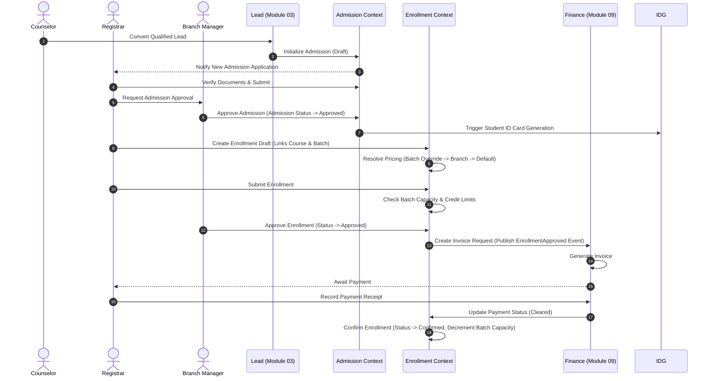
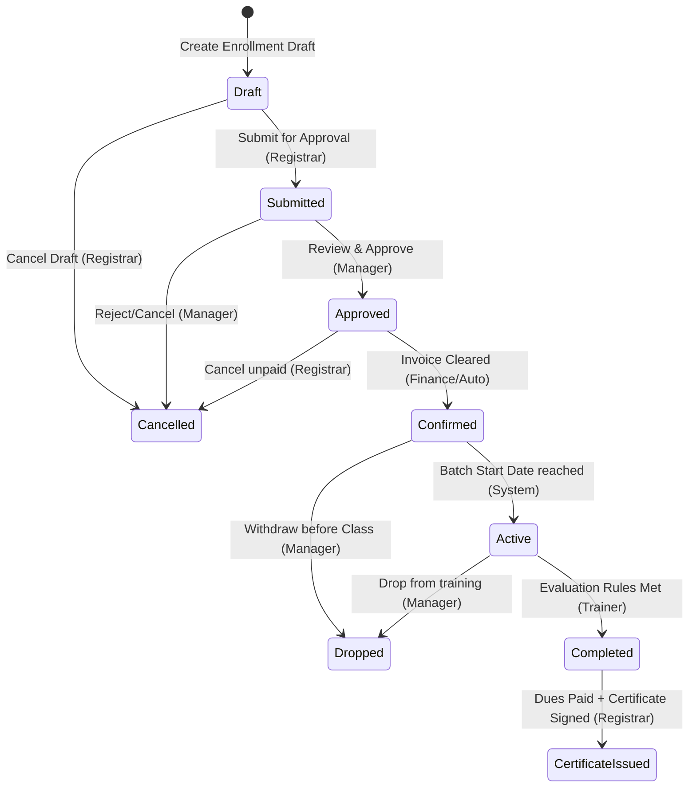

# Functional Requirement Document (Part 2)
## Module 04: Admission & Enrollment Management – Stories, Use Cases, Workflows, & State Machines

---

## 1. User Stories and BDD Acceptance Criteria

### US-04-001: Register Student & Link Person (Must Have)
*   **User Story:**  
    As a **Registrar**,  
    I want to register a new student profile by linking it to a validated master Person record,  
    So that I can avoid duplicate contact details and maintain a single person registry across the institute.
*   **Acceptance Criteria (Gherkin format):**
    ```gherkin
    Scenario: Successfully register a student with a unique Person link
      Given the Registrar is logged in and authorized with "ADMISSION_CREATE" permission
      And a Person record exists with mobile "+96899123456" and email "ahmed@example.om"
      And no Student profile is currently linked to this Person record
      When the Registrar submits a request to register a student for this Person ID
      Then the system should create a Student profile with status "Active"
      And auto-generate a unique studentNumber matching the format "STU-\d{4}-\d{5}"
      And publish a "StudentProfileCreated" event to the outbox
      And return the newly created student record

    Scenario: Prevent registration of a student duplicate
      Given the Registrar is logged in
      And a Person record exists with mobile "+96899123456"
      And a Student profile already exists linked to this Person record
      When the Registrar attempts to create a new Student profile for this Person ID
      Then the system should reject the request with a "DuplicateStudentDetected" error
      And make no changes to the database
    ```

---

### US-04-002: Convert Lead to Active Admission (Must Have)
*   **User Story:**  
    As a **Counselor**,  
    I want to convert a qualified sales Lead into an Admission record,  
    So that the student registration can be officially initiated and reviewed by the Branch Manager.
*   **Acceptance Criteria:**
    ```gherkin
    Scenario: Successfully convert a qualified CRM lead to admission
      Given the Counselor has converted a Lead in Module 03
      And the Lead contains first name "Fatima", mobile "+96899887766", and courseId "crs-111"
      When the Counselor initiates the "Convert Lead to Admission" command
      Then the system should verify the person record exists or create one
      And initialize an Admission record in the Counselor's branch with status "Draft"
      And link the Admission to the original leadId
      And publish a "LeadConvertedToAdmission" event to the outbox
    ```

---

### US-04-003: Create Enrollment Draft (Must Have)
*   **User Story:**  
    As a **Registrar**,  
    I want to initialize a course enrollment request for an admitted student in a specific batch,  
    So that the system can resolve default course prices and set up installment plans before payment.
*   **Acceptance Criteria:**
    ```gherkin
    Scenario: Create enrollment draft under a valid admission context
      Given an Admission record exists for student "STU-2026-00101" with status "Approved"
      And the course "IELTS Preparation" has an active batch "IELTS-B05" in Muscat branch
      When the Registrar creates an enrollment draft for this student, course, and batch
      Then the system should create an Enrollment record with status "Draft"
      And set "pricingSource" based on the override hierarchy
      And calculate "resolvedPrice" and "finalAmount"
      And set "paymentValidationRequired" to true
    ```

---

### US-04-004: Validate Batch Capacity and Handle Waitlist (Must Have)
*   **User Story:**  
    As the **System Pricing and capacity engine**,  
    I want to evaluate batch capacity limits before allowing an enrollment approval,  
    So that the system automatically redirects students to a waitlist or blocks registration if a batch is full.
*   **Acceptance Criteria:**
    ```gherkin
    Scenario: Automatically route student to waitlist when batch is full and waitlisting is enabled
      Given the batch "Python-101" has maxCapacity "15" and registered count "15"
      And the batch has waitlist enabled
      When a Registrar attempts to approve an enrollment for student "STU-2026-00102" in batch "Python-101"
      Then the system should block the enrollment approval
      And create a "WaitingListEntry" with status "Pending"
      And log the request order timestamp
      And publish a "StudentAddedToWaitingList" event

    Scenario: Reject enrollment approval when batch is full and waitlist is disabled
      Given the batch "Excel-Pro" has maxCapacity "10" and registered count "10"
      And the batch has waitlist disabled
      When a Registrar attempts to approve an enrollment for student "STU-2026-00103" in batch "Excel-Pro"
      Then the system should reject the transition with "EnrollmentCapacityExceeded" error
    ```

---

### US-04-005: Nominate Corporate Participants (Should Have)
*   **User Story:**  
    As a **Corporate Coordinator**,  
    I want to nominate multiple corporate employees into a scheduled training batch,  
    So that they can attend classes under the corporate account billing contract.
*   **Acceptance Criteria:**
    ```gherkin
    Scenario: Nominate corporate employees within credit limit parameters
      Given corporate account "Petroleum Development Oman (PDO)" has an active credit limit of OMR 5,000
      And their outstanding unpaid invoices total OMR 2,000
      When the Coordinator nominates employee "Salim Al-Harthy" for batch "Safety-02" (costing OMR 500)
      Then the system should validate that outstanding balance + new cost (OMR 2,500) is less than the credit limit (OMR 5,000)
      And create a "CorporateParticipant" record
      And initialize an Enrollment in "Approved" state with "enrollmentType" as "Corporate"
      And skip payment validation checks
    ```

---

### US-04-006: Execute Walk-In Fast Track (Should Have)
*   **User Story:**  
    As a **Registrar**,  
    I want to execute a walk-in registration and training delivery sequence in a single step,  
    So that same-day short-duration certificate course learners do not experience administrative delays.
*   **Acceptance Criteria:**
    ```gherkin
    Scenario: Walk-in enrollment auto-confirms in a single transaction
      Given the course "First Aid Certificate" explicitly allows walk-in completions
      When the Registrar submits a Walk-in Registration form for a new person
      Then the system should create a Person record
      And create an active Student profile
      And create an Enrollment in status "Confirmed" in a single transaction
      And trigger instant invoice and payment clearance records in Finance
    ```

---

### US-04-007: Drop or Withdraw Enrollment (Must Have)
*   **User Story:**  
    As a **Branch Manager**,  
    I want to drop or withdraw a student from an active enrollment,  
    So that their seat is returned to the batch capacity pool and down-stream attendance registers are updated.
*   **Acceptance Criteria:**
    ```gherkin
    Scenario: Drop active enrollment and restore batch capacity
      Given student "STU-2026-00105" has an enrollment in status "Active" for batch "React-09"
      And batch "React-09" has seatsAvailable equal to "2"
      When the Branch Manager processes a drop request with reason "Medical Leave"
      Then the system should transition enrollmentStatus to "Dropped"
      And increment the batch seatsAvailable to "3"
      And publish a "EnrollmentDropped" event to update attendance rosters
    ```

---

### US-04-008: Validate Certificate Eligibility (Must Have)
*   **User Story:**  
    As the **System Registrar**,  
    I want the system to check course completion and financial clearance status before changing an enrollment state to CertificateIssued,  
    So that certificates are never issued to students who failed academic rules or have unpaid balances.
*   **Acceptance Criteria:**
    ```gherkin
    Scenario: Disallow certificate issuance if student has unpaid invoice balance
      Given an enrollment has completionStatus "Passed"
      And the enrollment has paymentValidationRequired as true
      And the outstanding balance on the enrollment invoice is OMR 150
      When the user attempts to transition the status to "CertificateIssued"
      Then the system should block the action with a "PaymentVerificationFailed" error
    ```

---

## 2. Core Use Cases

### Use Case 1: Convert CRM Lead to Student Admission
*   **Primary Actor:** Counselor
*   **Preconditions:**
    *   Lead exists in CRM (Module 03) in status "Qualified" or "Pre-Registered".
    *   Counselor is authenticated and assigned to the same branch context as the Lead.
*   **Main Success Scenario:**
    1.  Counselor clicks "Convert to Student" on the Lead Detail view.
    2.  System calls the CRM service to retrieve contact details (Name, Civil ID, Mobile, Email, Course Interest).
    3.  System checks the master Person directory using Civil ID and mobile number to detect duplicates. No match is found.
    4.  System creates a new `Person` record in the database.
    5.  System generates a `Student` profile, auto-generating a unique `studentNumber` (e.g. `STU-2026-00342`).
    6.  System creates a new `Admission` record linked to the student and lead in the status `Draft`.
    7.  System triggers a `LeadConvertedToAdmission` event.
*   **Alternative Flows:**
    *   *A1: Person Already Exists:* In step 3, if the Person is found (matching Civil ID or Mobile), the system skips `Person` creation and links the new `Student` profile to the existing `Person` record.
    *   *A2: Student Profile Already Links to Person:* In step 3, if a `Student` profile is already linked to the found Person, the system blocks the creation and redirects the counselor to the existing Student profile.
*   **Postconditions:**
    *   Student and Admission records are successfully written. Lead status in CRM updates to "Converted".

---

### Use Case 2: Register Walk-In Fast Track Enrollment
*   **Primary Actor:** Registrar
*   **Preconditions:**
    *   Target Course is designated as a "Walk-In / One-Day Seminar" in the Course Catalog.
    *   Batch is open, active, and has available capacity.
*   **Main Success Scenario:**
    1.  Registrar opens the Walk-In Form and enters the learner's personal details, target course, and batch.
    2.  Registrar inputs the cash/card payment amount received.
    3.  System creates the `Person` and `Student` records.
    4.  System creates the `Enrollment` record, bypasses the "Draft" and "Submitted" states, and sets status to `Confirmed`.
    5.  System registers a cash invoice and payment transaction receipt in Module 09 in the same transaction block.
    6.  System decrements the Batch capacity.
    7.  System dispatches the `WalkInEnrollmentCreated` event.
*   **Alternative Flows:**
    *   *A1: Batch Capacity Reached:* If batch is full, system checks for waitlist. If waitlist is available, student is placed in waitlist and cannot proceed as confirmed. If no waitlist, transaction aborts.
*   **Postconditions:**
    *   Learner is registered, invoice is cleared, and batch seat is allocated in one atomic operation.

---

### Use Case 3: Drop Course Enrollment
*   **Primary Actor:** Branch Manager
*   **Preconditions:**
    *   Enrollment record exists in status `Active` or `Confirmed`.
*   **Main Success Scenario:**
    1.  Branch Manager searches for the student's enrollment and selects the "Drop Course" action.
    2.  Manager inputs a mandatory drop reason and date of withdrawal.
    3.  System checks the attendance record of the student.
    4.  System changes the enrollment status to `Dropped` and records the withdrawal date.
    5.  System increments the batch availability count:
        $$\text{seatsAvailable} = \text{seatsAvailable} + 1$$
    6.  System dispatches `EnrollmentDropped` outbox event.
*   **Alternative Flows:**
    *   *A1: Refund Processing:* If the withdrawal date is within the refund eligibility window, the system triggers a request to Module 09 (Finance) to calculate refund amounts and issue a credit note draft.
*   **Postconditions:**
    *   Student is deactivated from the class roster, and the batch capacity seat is released.

---

## 3. Business Workflows

The following sequence diagram outlines the end-to-end workflow from a converted lead in CRM down to invoice triggering and enrollment confirmation:



---

## 4. State Machine Specification

### 4.1 Enrollment Status Lifecycle Diagram
The diagram below shows the strict state transitions allowed for the `Enrollment` aggregate root.



### 4.2 Status Transition Rules Matrix

Transitions must be governed by the following permission constraints:

| From Status | To Status | Required Action / Event | Authorized Permission | Guard Conditions / Rules |
| :--- | :--- | :--- | :--- | :--- |
| `None` | `Draft` | Create Draft command | `ENROLLMENT_CREATE` | Validates `studentId`, `courseId`, and `batchId` exist and are active. |
| `Draft` | `Submitted` | Submit for Review | `ENROLLMENT_CREATE` | All mandatory details inputted; pricing calculation completed. |
| `Draft` | `Cancelled` | Cancel Application | `ENROLLMENT_CREATE` | Marks enrollment as cancelled; no financial obligations. |
| `Submitted` | `Approved` | Manager Review Approval | `ENROLLMENT_APPROVE` | Checks batch capacity under transactional isolation; validates corporate credit limits. |
| `Submitted` | `Cancelled` | Rejection by Manager | `ENROLLMENT_APPROVE` | Requires input of rejection reason code. |
| `Approved` | `Confirmed` | Record payment receipt | `ENROLLMENT_CONFIRM` | Bypassed if `paymentValidationRequired = false` (Corporate or 0 price). |
| `Confirmed` | `Active` | Batch Start Event | `System Runner` | Automatically runs on batch start date. |
| `Confirmed` | `Dropped` | Pre-course withdrawal | `ENROLLMENT_DROP` | Restores batch capacity (+1 seat). |
| `Active` | `Completed` | Submit course evaluation | `COURSE_COMPLETE` | Verified by Module 12 (Exams & Completion). |
| `Active` | `Dropped` | Active drop / Absenteeism | `ENROLLMENT_DROP` | Restores batch capacity (+1 seat). |
| `Completed`| `CertificateIssued` | Print Certificate | `CERTIFICATE_ISSUE` | Outstanding invoice balance must be zero. |
