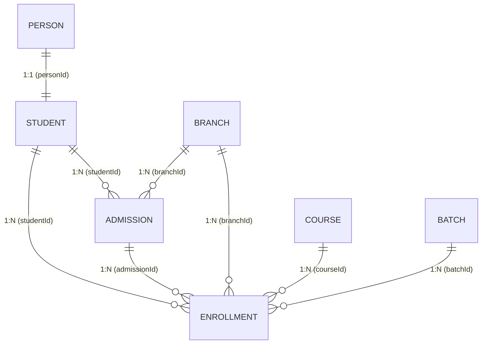

# Functional Requirement Document (Part 4)
## Module 04: Admission & Enrollment Management – Database Schema & CRUD Matrix

---

## 1. Entity Specifications & Target Database Models

This section defines the database structure for the Admission & Enrollment Bounded Context. It highlights the refactoring of the legacy `Student` model (substituting inline names with a link to `Person`) and introduces the new `Enrollment` model and associated constraints.

### 1.1 `Person` (Shared Kernel / Reference Model)
*   **Description:** Represents physical human beings across ASTI (shared with CRM, Trainer, and Admin User contexts).
*   **Prisma Model Definition:**
    ```prisma
    model Person {
      id          String    @id @default(uuid()) @db.Uuid
      firstName   String    @db.VarChar(100)
      lastName    String    @db.VarChar(100)
      mobile      String    @unique @db.VarChar(30)
      email       String?   @unique @db.VarChar(255)
      nationalId  String?   @db.VarChar(50)
      nationality String?   @db.VarChar(50)
      dateOfBirth DateTime? @db.Date
      gender      String?   @db.VarChar(20)

      student     Student?
      user        User?
      leads       Lead[]

      createdAt DateTime  @default(now()) @db.Timestamptz(6)
      createdBy String?   @db.Uuid
      updatedAt DateTime? @db.Timestamptz(6)
      updatedBy String?   @db.Uuid
      deletedAt DateTime? @db.Timestamptz(6)
      deletedBy String?   @db.Uuid
      isDeleted Boolean   @default(false)

      @@map("persons")
    }
    ```
*   **PostgreSQL Column Specifications:**
    *   `id`: `UUID` Primary Key.
    *   `firstName` / `lastName`: `VARCHAR(100)` Not Null.
    *   `mobile`: `VARCHAR(30)` Unique, Not Null. Index applied.
    *   `email`: `VARCHAR(255)` Unique, Nullable.
    *   `nationalId`: `VARCHAR(50)` Nullable. Stores Omani Civil ID / Passport numbers.

---

### 1.2 `Student` (Refactored Profile Model)
*   **Description:** Represents the student profile linked directly to a verified `Person` record. Legacy names and contact fields are removed.
*   **Prisma Model Definition:**
    ```prisma
    model Student {
      id            String       @id @default(uuid()) @db.Uuid
      personId      String       @unique @db.Uuid
      studentNumber String       @unique @db.VarChar(50)
      status        RecordStatus @default(Active)
      
      // Student ID card status fields from ER Model
      idCardIssued  Boolean      @default(false)
      idCardNumber  String?      @unique @db.VarChar(50)
      joinedAt      DateTime     @default(now()) @db.Timestamptz(6)

      person        Person       @relation(fields: [personId], references: [id], onDelete: Restrict)
      admissions    Admission[]
      enrollments   Enrollment[]

      createdAt DateTime  @default(now()) @db.Timestamptz(6)
      createdBy String?   @db.Uuid
      updatedAt DateTime? @db.Timestamptz(6)
      updatedBy String?   @db.Uuid
      deletedAt DateTime? @db.Timestamptz(6)
      deletedBy String?   @db.Uuid
      isDeleted Boolean   @default(false)

      @@index([personId])
      @@index([studentNumber])
      @@map("students")
    }
    ```
*   **PostgreSQL Column Specifications:**
    *   `id`: `UUID` Primary Key.
    *   `personId`: `UUID` Foreign Key. Unique Constraint ensures 1:1 mapping between `Person` and `Student`.
    *   `studentNumber`: `VARCHAR(50)` Unique. Index applied.
    *   `status`: `RecordStatus` Enum (values: `Active`, `Suspended`, `Inactive`).

---

### 1.3 `Admission` (Administrative Record Model)
*   **Description:** Tracks the administrative application of a student to study at a branch.
*   **Prisma Model Definition:**
    ```prisma
    model Admission {
      id              String       @id @default(uuid()) @db.Uuid
      admissionNumber String       @unique @db.VarChar(50)
      studentId       String       @db.Uuid
      branchId        String       @db.Uuid
      leadId          String?      @db.Uuid
      admissionDate   DateTime     @default(now()) @db.Timestamptz(6)
      status          RecordStatus @default(Active)
      remarks         String?      @db.Text
      
      // Approval audit metadata
      submittedAt   DateTime?    @db.Timestamptz(6)
      approvedAt    DateTime?    @db.Timestamptz(6)
      approvedBy    String?      @db.Uuid

      student     Student      @relation(fields: [studentId], references: [id], onDelete: Restrict)
      branch      Branch       @relation(fields: [branchId], references: [id], onDelete: Restrict)
      enrollments Enrollment[]

      createdAt DateTime  @default(now()) @db.Timestamptz(6)
      createdBy String?   @db.Uuid
      updatedAt DateTime? @db.Timestamptz(6)
      updatedBy String?   @db.Uuid
      deletedAt DateTime? @db.Timestamptz(6)
      deletedBy String?   @db.Uuid
      isDeleted Boolean   @default(false)

      @@index([studentId])
      @@index([branchId])
      @@index([leadId])
      @@index([admissionNumber])
      @@map("admissions")
    }
    ```
*   **PostgreSQL Column Specifications:**
    *   `id`: `UUID` Primary Key.
    *   `studentId`: `UUID` Foreign Key. Relates 1:N to `Student`.
    *   `branchId`: `UUID` Foreign Key. Index applied for isolation filters.
    *   `leadId`: `UUID` Nullable. References original CRM lead.
    *   `approvedBy`: `UUID` Nullable. References User ID of the Branch Manager who signed the approval.

---

### 1.4 `Enrollment` (New Central Aggregate Model)
*   **Description:** The central aggregate root mapping the learner lifecycle to courses, batches, billing, and progress.
*   **Prisma Model Definition:**
    ```prisma
    model Enrollment {
      id                       String           @id @default(uuid()) @db.Uuid
      enrollmentNumber         String           @unique @db.VarChar(50)
      studentId                String           @db.Uuid
      corporateParticipantId   String?          @db.Uuid
      admissionId              String           @db.Uuid
      courseId                 String           @db.Uuid
      batchId                  String           @db.Uuid
      branchId                 String           @db.Uuid
      enrollmentType           EnrollmentType   @default(Regular)
      enrollmentStatus         EnrollmentStatus @default(Draft)
      pricingSource            PricingSource    @default(GlobalDefault)
      resolvedPrice            Decimal          @db.Decimal(12, 3)
      resolvedDiscount         Decimal          @db.Decimal(12, 3) @default(0.000)
      finalAmount              Decimal          @db.Decimal(12, 3)
      paymentValidationRequired Boolean          @default(true)
      completionStatus         String           @default("Pending") @db.VarChar(50)
      certificateStatus        String           @default("NotEligible") @db.VarChar(50)
      
      confirmedAt              DateTime?        @db.Timestamptz(6)
      completedAt              DateTime?        @db.Timestamptz(6)

      student     Student      @relation(fields: [studentId], references: [id], onDelete: Restrict)
      admission   Admission    @relation(fields: [admissionId], references: [id], onDelete: Restrict)
      course      Course       @relation(fields: [courseId], references: [id], onDelete: Restrict)
      batch       Batch        @relation(fields: [batchId], references: [id], onDelete: Restrict)
      branch      Branch       @relation(fields: [branchId], references: [id], onDelete: Restrict)
      
      walkInEnrollment WalkInEnrollment?

      createdAt DateTime  @default(now()) @db.Timestamptz(6)
      createdBy String?   @db.Uuid
      updatedAt DateTime? @db.Timestamptz(6)
      updatedBy String?   @db.Uuid
      deletedAt DateTime? @db.Timestamptz(6)
      deletedBy String?   @db.Uuid
      isDeleted Boolean   @default(false)

      @@index([studentId])
      @@index([batchId])
      @@index([branchId])
      @@index([enrollmentNumber])
      @@map("enrollments")
    }

    enum EnrollmentType {
      Regular
      Corporate
      WalkIn
      Online
    }

    enum EnrollmentStatus {
      Draft
      Submitted
      Approved
      Confirmed
      Active
      Completed
      Cancelled
      Dropped
      CertificateIssued
    }

    enum PricingSource {
      BatchLevel
      BranchLevel
      GlobalDefault
    }

    model WalkInEnrollment {
      id                 String             @id @default(uuid()) @db.Uuid
      enrollmentId       String             @unique @db.Uuid
      walkInDate         DateTime           @default(now()) @db.Timestamptz(6)
      counterUserId      String             @db.Uuid
      paymentCollected   Decimal            @db.Decimal(12, 3)
      confirmationIssued Boolean            @default(false)
      remarks            String?            @db.Text

      enrollment         Enrollment         @relation(fields: [enrollmentId], references: [id], onDelete: Restrict)
      confirmation       WalkInConfirmation?

      createdAt DateTime  @default(now()) @db.Timestamptz(6)
      createdBy String?   @db.Uuid
      updatedAt DateTime? @db.Timestamptz(6)
      updatedBy String?   @db.Uuid
      deletedAt DateTime? @db.Timestamptz(6)
      deletedBy String?   @db.Uuid
      isDeleted Boolean   @default(false)

      @@index([enrollmentId])
      @@map("walk_in_enrollments")
    }

    model WalkInConfirmation {
      id                 String           @id @default(uuid()) @db.Uuid
      walkInEnrollmentId String           @unique @db.Uuid
      confirmationNumber String           @unique @db.VarChar(50)
      issuedAt           DateTime         @default(now()) @db.Timestamptz(6)
      issuedBy           String           @db.Uuid
      documentUrl        String           @db.VarChar(255)

      walkInEnrollment   WalkInEnrollment @relation(fields: [walkInEnrollmentId], references: [id], onDelete: Restrict)

      createdAt DateTime  @default(now()) @db.Timestamptz(6)
      createdBy String?   @db.Uuid
      updatedAt DateTime? @db.Timestamptz(6)
      updatedBy String?   @db.Uuid
      deletedAt DateTime? @db.Timestamptz(6)
      deletedBy String?   @db.Uuid
      isDeleted Boolean   @default(false)

      @@index([walkInEnrollmentId])
      @@map("walk_in_confirmations")
    }
    ```
*   **PostgreSQL Column Specifications:**
    *   `id`: `UUID` Primary Key.
    *   `enrollmentNumber`: `VARCHAR(50)` Unique.
    *   `resolvedPrice`, `resolvedDiscount`, `finalAmount`: `NUMERIC(12, 3)` (stores Omani Rial amounts with high precision, mapping OMR currency with three decimal fractions).
    *   `paymentValidationRequired`: `BOOLEAN` Not Null.
    *   `completionStatus` / `certificateStatus`: `VARCHAR(50)` Not Null. Used by completion and certificate modules.

---

## 2. Table Relationships and Constraints



### Relationship Constraints Rules:
1.  **`Person` to `Student` (1:1):**
    *   **Rule:** A physical `Person` record can map to exactly zero or one `Student` profile.
    *   **OnDelete:** `RESTRICT`. If a user attempts to delete a `Person` who has an active `Student` profile, the action is blocked. Soft delete must be handled via the aggregate service.
2.  **`Student` to `Enrollment` (1:N):**
    *   **Rule:** One student may register for multiple enrollments over time.
    *   **OnDelete:** `RESTRICT`. An active student record cannot be deleted if referenced in enrollment history.
3.  **`Enrollment` to `Course` and `Batch` (N:1):**
    *   **Rule:** Every enrollment must point to a valid course catalog page and a scheduled batch.
    *   **OnDelete:** `RESTRICT` on course/batch. A batch cannot be deleted from master data if it contains active or completed enrollment rows.
4.  **`Admission` to `Enrollment` (1:N):**
    *   **Rule:** Every enrollment must link back to the administrative Admission record under which the learner was accepted to study at ASTI.

---

## 3. CRUD Matrix and Scoped Access Policies

The following matrix maps database access operations to system actors. All operations must evaluate `branchId` context checks at the database layer (or via Prisma application middlewares/row-level security schemas).

| Actor | Entity | Allowed Actions | Scoping / Context Logic |
| :--- | :--- | :--- | :--- |
| **Super Admin** | All Entities | `Create`, `Read`, `Update`, `Delete`, `Audit` | **Global.** Accesses all branch rows. Can perform physical soft-delete recoveries. |
| **Branch Manager** | `Admission` | `Read`, `Update` (Approve/Reject) | **Branch Scoped.** Restricts read/writes to `Admission.branchId == User.branchAccessList`. |
| **Branch Manager** | `Enrollment` | `Read`, `Update` (Approve, Cancel, Drop) | **Branch Scoped.** Restricts write operations to local batch catalogs. |
| **Registrar** | `Person` | `Create`, `Read`, `Update` | **Global directory search.** Allows cross-branch deduplication lookups by ID/phone. |
| **Registrar** | `Student` | `Create`, `Read`, `Update` | **Branch Scoped.** Restricts student registry additions to local home branch. |
| **Registrar** | `Enrollment` | `Create`, `Read`, `Update` (Draft status) | **Branch Scoped.** Restricts edits to `Draft` and `Submitted` lifecycle states. |
| **Counselor** | `Admission` | `Create`, `Read` | **Counselor Scoped.** By default, reads only admissions where `createdBy == User.id` or `Admission.leadId` is assigned to them. |
| **Student (API)** | `Person` | `Read` (Self), `Update` (Self) | **Self Scoped.** Restricted to editing their own profile fields via active JWT profile matching. |
| **Student (API)** | `Enrollment` | `Read` (Self) | **Self Scoped.** Reads status information for their own classes. No write access. |
| **Outbox Publisher**| `Enrollment` | `Read` | **System Scoped.** Scans outbox table asynchronously. |
