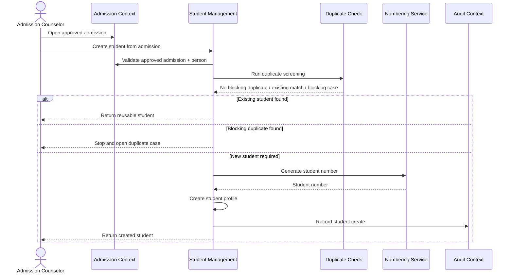
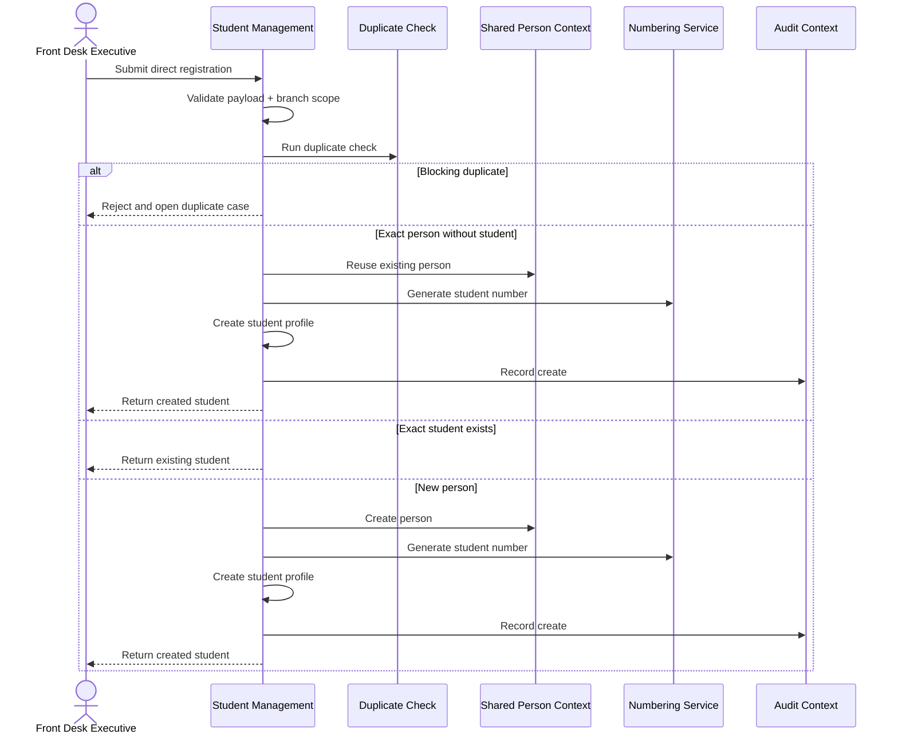
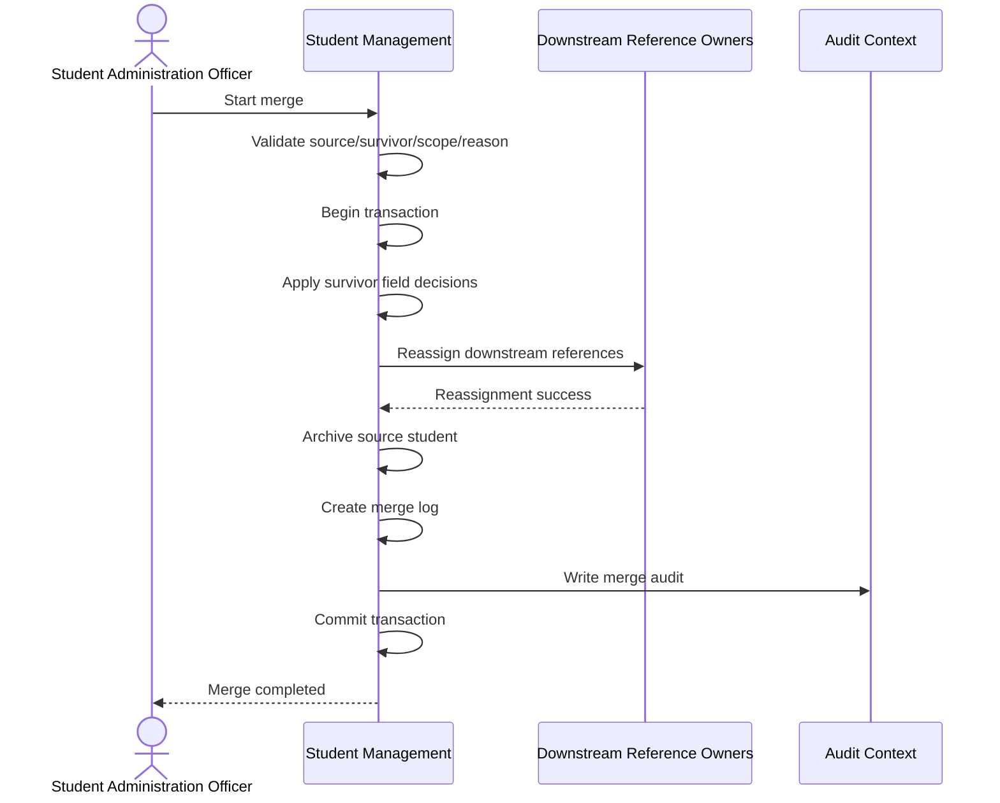
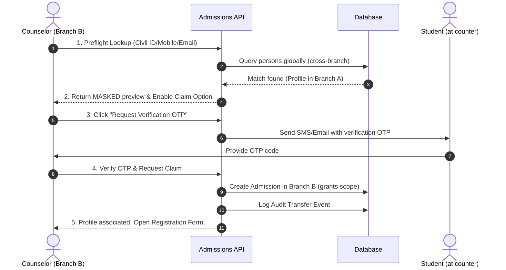
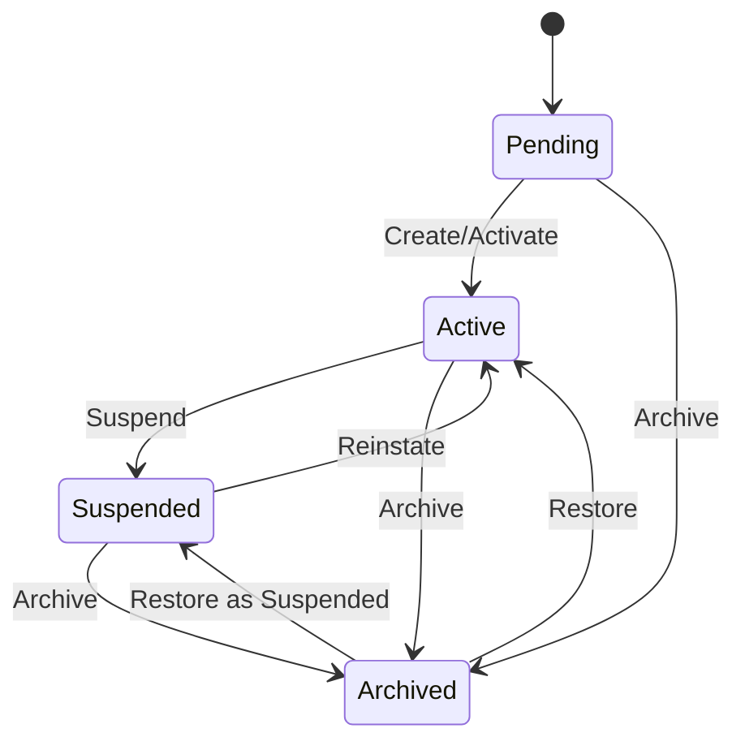
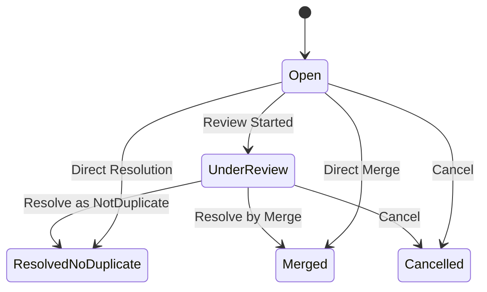
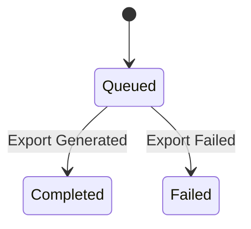
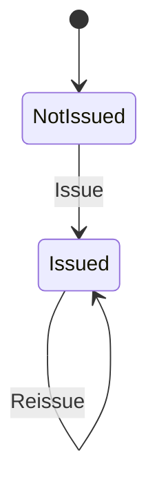

# Part 2 – User Stories, Use Cases, Workflows, State Machines

## Module 5 – Student Management

## 1. Purpose

This document defines the user stories, use cases, business workflows, and state machines for **Module 5 – Student Management** in the ASTI Integrated Institute Management System (IMS).

This part is aligned with the previously established module boundary:

- Student Management owns the institutional **StudentProfile** and related student-master workflows.
- It reuses the shared **Party / Person** model and does not duplicate learner identity.
- It does not own Admission, Enrollment, Finance, Attendance, Completion, Certificate, or Document workflows, but it references those contexts where needed.
- It enforces branch-scoped access, soft delete, audit, duplicate control, and identity-safe merge behavior.

---

## 2. User Stories

The following user stories are prioritized using **MoSCoW**:

- **Must**: required for go-live
- **Should**: strongly recommended for near-term operational completeness
- **Could**: useful enhancement
- **Won’t (for now)**: explicitly deferred from current module scope

---

## 2.1 User Story US-SM-001 — Create Student from Approved Admission

**Story**  
As an **Admission Counselor**, I want to create or reuse a student profile from an approved admission, so that the learner can proceed into enrollment without duplicate student creation.

**Priority**  
Must

**Business Value**  
Prevents duplicate identities and ensures admission handoff creates a reusable student master.

**Acceptance Criteria**

```gherkin
Feature: Create student from approved admission

  Scenario: Create a new student when no student exists for the admission person
    Given an approved admission exists for a person in my branch
    And no student profile exists for that person
    When I create a student from the approved admission
    Then the system should create a new student profile
    And assign a generated student number
    And link the profile to the existing person
    And record an audit entry

  Scenario: Reuse an existing student when a student already exists for the same person
    Given an approved admission exists for a person in my branch
    And a student profile already exists for that person
    When I create a student from the approved admission
    Then the system should not create a second student profile
    And should return the existing student profile

  Scenario: Block creation when the admission is not approved
    Given an admission exists but is not approved
    When I attempt to create a student from that admission
    Then the request should fail
    And no student profile should be created
```

---

## 2.2 User Story US-SM-002 — Direct Student Registration

**Story**  
As a **Front Desk Executive**, I want to register a student directly when authorized, so that walk-in or exceptional registration cases can be captured quickly.

**Priority**  
Must

**Business Value**  
Supports operational speed without bypassing duplicate checks or branch controls.

**Acceptance Criteria**

```gherkin
Feature: Direct student registration

  Scenario: Create a student through direct registration with valid identity inputs
    Given I am authorized to create students in my branch
    When I submit a valid direct registration request
    Then the system should create a student profile
    And assign a student number
    And mark the creation source as DirectRegistration

  Scenario: Block direct registration when mandatory data is missing
    Given I am on the direct registration form
    When I submit the form without mandatory name, nationality, phone, or joined date
    Then the system should reject the submission
    And show validation errors for the missing fields

  Scenario: Block direct registration when a blocking duplicate is found
    Given an existing student matches the submitted identity data
    When I submit the direct registration form
    Then the system should block creation
    And open or reference a duplicate review case
```

---

## 2.3 User Story US-SM-003 — Convert Corporate Participant into Student

**Story**  
As a **Corporate Coordinator**, I want to convert a corporate participant into a student profile, so that nominated corporate learners can join training without losing corporate linkage.

**Priority**  
Must

**Business Value**  
Preserves corporate billing lineage while unifying learner lifecycle into student/enrollment flow.

**Acceptance Criteria**

```gherkin
Feature: Convert corporate participant into student

  Scenario: Create a student for a corporate participant with no existing student
    Given a corporate participant exists and is active
    And no student profile exists for the linked person
    When I convert the participant into a student
    Then the system should create a student profile
    And link the corporate participant to the student profile

  Scenario: Reuse an existing student for a corporate participant
    Given a corporate participant exists
    And the linked person already has a student profile
    When I convert the participant into a student
    Then the system should reuse the existing student profile
    And preserve the corporate linkage
```

---

## 2.4 User Story US-SM-004 — Search and Reuse Existing Student

**Story**  
As a **Student Administration Officer**, I want to search students quickly by number, name, phone, email, or identity fields, so that I can reuse existing records and avoid creating duplicates.

**Priority**  
Must

**Business Value**  
Improves operational efficiency and reduces duplicate records.

**Acceptance Criteria**

```gherkin
Feature: Search and reuse student records

  Scenario: Find an existing student using student number
    Given a student profile exists in my allowed branch scope
    When I search by the student number
    Then the matching student profile should appear in the results

  Scenario: Restrict results to my branch scope
    Given students exist in multiple branches
    And I only have access to one branch
    When I search students
    Then I should only see students from my allowed branch scope
```

---

## 2.5 User Story US-SM-005 — Update Student Profile Safely

**Story**  
As a **Student Administration Officer**, I want to update student profile details safely, so that contact and identity data remains current without breaking uniqueness or auditability.

**Priority**  
Must

**Business Value**  
Keeps student master data accurate and operationally usable.

**Acceptance Criteria**

```gherkin
Feature: Update student profile

  Scenario: Update student contact details successfully
    Given an active student exists in my branch
    When I update the student's email or phone with valid values
    Then the system should save the changes
    And increment the record version
    And record an audit entry

  Scenario: Reject update when a duplicate identity conflict is introduced
    Given an active student exists
    And another student already uses the same identity signal
    When I update the student to use the conflicting value
    Then the system should reject the update
    And return the appropriate duplicate or identity conflict error
```

---

## 2.6 User Story US-SM-006 — Change Student Status

**Story**  
As a **Branch Manager**, I want to change a student’s lifecycle status with reason and effective date, so that the student’s institutional standing is accurately controlled and auditable.

**Priority**  
Must

**Business Value**  
Supports governance, compliance, and operational lifecycle control.

**Acceptance Criteria**

```gherkin
Feature: Change student status

  Scenario: Suspend an active student with valid reason
    Given an active student exists in my branch
    And I have permission to change status
    When I change the student's status to Suspended with a valid reason
    Then the system should update the current status
    And create a status history record
    And record an audit entry

  Scenario: Reject an invalid status transition
    Given a student exists in Archived status
    When I try to move the student to Pending
    Then the system should reject the transition
```

---

## 2.7 User Story US-SM-007 — Resolve Duplicate Cases

**Story**  
As a **Compliance Officer**, I want to review and resolve duplicate cases, so that false positives are cleared and true duplicates are safely handled.

**Priority**  
Must

**Business Value**  
Improves data quality and reduces operational blocking.

**Acceptance Criteria**

```gherkin
Feature: Resolve duplicate cases

  Scenario: Mark a duplicate case as not duplicate
    Given an open duplicate case exists in my allowed scope
    And I have duplicate resolution permission
    When I resolve the case as NotDuplicate with a valid reason
    Then the system should mark the case as resolved
    And remove it from the open duplicate backlog

  Scenario: Reject resolution of an already resolved case
    Given a duplicate case is already resolved
    When I attempt to resolve it again
    Then the system should reject the action
```

---

## 2.8 User Story US-SM-008 — Merge Duplicate Students

**Story**  
As a **Student Administration Officer**, I want to merge duplicate student profiles into one survivor record, so that the system preserves a clean single student identity without losing history.

**Priority**  
Must

**Business Value**  
Maintains long-term identity integrity across branch and workflow histories.

**Acceptance Criteria**

```gherkin
Feature: Merge duplicate students

  Scenario: Merge a source student into a survivor successfully
    Given two student profiles are confirmed duplicates
    And I have permission to merge students
    When I merge the source profile into the survivor profile with a valid reason
    Then the source student should be archived
    And downstream references should be reassigned
    And a merge log should be created
    And the operation should be fully auditable

  Scenario: Reject merge when source and survivor are the same record
    Given a student profile exists
    When I submit a merge using the same record as source and survivor
    Then the system should reject the merge
```

---

## 2.9 User Story US-SM-009 — Manage Student ID Card

**Story**  
As a **Student Administration Officer**, I want to issue and reissue student ID cards, so that student identity artifacts remain current and traceable.

**Priority**  
Should

**Business Value**  
Supports branch operations and identity administration.

**Acceptance Criteria**

```gherkin
Feature: Issue and reissue student ID cards

  Scenario: Issue an ID card to a student
    Given a student exists with no ID card issued
    And I have permission to manage ID cards
    When I issue an ID card with a unique number
    Then the student should be marked as ID card issued
    And an ID card history row should be created

  Scenario: Reissue an ID card with a new number
    Given a student already has an issued ID card
    When I reissue the card with a different number and valid reason
    Then the current card number should be updated
    And the previous and new numbers should be stored in history
```

---

## 2.10 User Story US-SM-010 — Archive and Restore Student

**Story**  
As a **Branch Manager**, I want to archive or restore a student profile when policy allows, so that inactive or incorrect records can be controlled without hard deletion.

**Priority**  
Must

**Business Value**  
Supports soft delete governance and recovery from operational errors.

**Acceptance Criteria**

```gherkin
Feature: Archive and restore student

  Scenario: Archive a student successfully
    Given an active student exists
    And I have archive permission
    When I archive the student with a valid reason
    Then the student should be marked archived
    And soft delete flags should be set
    And the action should be audited

  Scenario: Restore an archived student successfully
    Given an archived student exists
    And I have restore permission
    When I restore the student with a valid reason
    Then the student should become active or suspended according to the selected restore target
    And the restore should be audited
```

---

## 2.11 User Story US-SM-011 — Export Student Report Safely

**Story**  
As a **Reporting User**, I want to export filtered student data within my permission scope, so that I can prepare operational reports without exposing unauthorized data.

**Priority**  
Should

**Business Value**  
Supports reporting and operational follow-up with privacy controls.

**Acceptance Criteria**

```gherkin
Feature: Export student data

  Scenario: Export filtered student data successfully
    Given I have export permission
    And I am within my assigned branch reporting scope
    When I export the student register in CSV format
    Then the system should create an export log
    And produce a downloadable export result

  Scenario: Reject sensitive export without elevated permission
    Given I have export permission but not sensitive identity permission
    When I request an export including sensitive identity data
    Then the system should reject the request
```

---

## 2.12 User Story US-SM-012 — View Own Student Profile

**Story**  
As a **Student Portal User**, I want to view my own student profile and summary information, so that I can confirm my identity and institutional status.

**Priority**  
Could

**Business Value**  
Supports future self-service visibility without transferring master-data edit ownership.

**Acceptance Criteria**

```gherkin
Feature: Student self-view profile

  Scenario: View own linked student profile
    Given my portal account is linked to a student profile
    And I have self-view permission
    When I open My Student Profile
    Then the system should show only my own student profile data

  Scenario: Deny access to another student's profile
    Given my portal account is linked to one student profile
    When I attempt to access another student's profile
    Then the system should deny or conceal access
```

---

## 3. Use Cases

---

## 3.1 Use Case UC-SM-001 — Create Student from Approved Admission

**Primary Actor**  
Admission Counselor

**Supporting Actors**  
Student Administration Officer, System, Numbering Series Service, Audit Service

**Preconditions**

1. User is authenticated.
2. User has `student.create`.
3. User has write access to the admission branch.
4. Admission exists and is in `Approved` status.
5. Admission is linked to a valid Person.

**Main Success Scenario**

1. Actor opens the approved admission.
2. Actor selects the action to create student.
3. System loads admission and linked person.
4. System validates admission status and branch scope.
5. System searches for an existing student by person ID.
6. System runs duplicate screening using identity/contact signals.
7. System determines no blocking duplicate exists.
8. System generates a new student number.
9. System creates the student profile.
10. System records audit information.
11. System returns created student profile details.

**Alternative Flows**

- 5A. Existing student already exists for the same person:
  1. System stops new creation.
  2. System returns existing student as reusable result.
- 6A. Blocking duplicate is found:
  1. System opens or references duplicate case.
  2. System stops creation.
- 4A. Admission is not approved:
  1. System rejects the request.
- 4B. Actor lacks branch permission:
  1. System denies or conceals access.

**Postconditions**

- Either:
  - a new student profile exists, or
  - the existing student is returned and no duplicate is created.
- Audit trail is preserved.

---

## 3.2 Use Case UC-SM-002 — Create Student by Direct Registration

**Primary Actor**  
Front Desk Executive

**Supporting Actors**  
Student Administration Officer, System, Duplicate Detection Service

**Preconditions**

1. User is authenticated.
2. User has `student.create`.
3. Direct registration is allowed in the actor’s branch.
4. Branch write access is granted.

**Main Success Scenario**

1. Actor opens direct registration form.
2. Actor enters student identity and contact data.
3. System validates required fields and formats.
4. System normalizes phone and email.
5. System runs duplicate screening.
6. System finds no blocking duplicate.
7. System reuses existing Person if exact person exists without student profile; otherwise creates new Party/Person.
8. System generates student number.
9. System creates student profile.
10. System records audit data.
11. System returns created student summary.

**Alternative Flows**

- 3A. Mandatory fields missing:
  1. System returns validation errors.
- 5A. Blocking duplicate found:
  1. System stops creation.
  2. System opens duplicate case.
- 7A. Existing student already exists:
  1. System returns existing student instead of creating a new one.
- 8A. Numbering series missing:
  1. System fails with configuration error.

**Postconditions**

- Student profile exists or user is redirected to an existing reusable profile.
- No unsafe duplicate is created.

---

## 3.3 Use Case UC-SM-003 — Convert Corporate Participant into Student

**Primary Actor**  
Corporate Coordinator

**Supporting Actors**  
Corporate Training context, System

**Preconditions**

1. Corporate participant exists.
2. Actor has `student.create`.
3. Target branch is known and writable.
4. Corporate participant data is active and valid.

**Main Success Scenario**

1. Actor opens corporate participant record.
2. Actor initiates student conversion.
3. System loads participant and linked person.
4. System checks whether a student already exists for the person.
5. System runs duplicate screening if needed.
6. System generates student number if new creation is required.
7. System creates student profile.
8. System links corporate participant to the student profile.
9. System records audit data.
10. System returns conversion result.

**Alternative Flows**

- 4A. Existing student already exists:
  1. System reuses existing student.
- 5A. Blocking duplicate found:
  1. System stops conversion.
- 2A. Participant already linked to student:
  1. System returns existing linkage.

**Postconditions**

- Corporate participant is linked to a student profile.
- Corporate lineage is preserved.

---

## 3.4 Use Case UC-SM-004 — Update Student Profile

**Primary Actor**  
Student Administration Officer

**Supporting Actors**  
System, Audit Service

**Preconditions**

1. User has `student.update`.
2. Student exists in scope.
3. Student is not archived or locked by policy.
4. User holds the latest version or update is conflict-free.

**Main Success Scenario**

1. Actor opens student detail.
2. Actor edits allowed personal/contact fields.
3. System validates formats and required values.
4. System reruns duplicate checks for identity-affecting changes.
5. System verifies optimistic version.
6. System persists changes.
7. System increments version.
8. System writes audit entry.
9. System returns updated profile.

**Alternative Flows**

- 4A. Duplicate blocking match found:
  1. System rejects the update.
- 5A. Version mismatch:
  1. System rejects with concurrency error.
- 1A. Student out of branch scope:
  1. System denies or conceals.

**Postconditions**

- Student data is updated or safely rejected.
- Audit trail is preserved.

---

## 3.5 Use Case UC-SM-005 — Change Student Status

**Primary Actor**  
Branch Manager

**Supporting Actors**  
Student Administration Officer, Audit Service

**Preconditions**

1. User has `student.status.change`.
2. Student exists in scope.
3. Requested transition is allowed.
4. Reason and effective date are supplied.

**Main Success Scenario**

1. Actor opens status change action.
2. Actor selects target status and enters reason.
3. System validates transition rules.
4. System validates effective dates.
5. System checks policy blockers.
6. System updates current student status.
7. System inserts status history row.
8. System writes audit entry.
9. System returns success.

**Alternative Flows**

- 3A. Transition not allowed:
  1. System rejects request.
- 5A. Archive blocked by active enrollment policy:
  1. System rejects request.
- 4A. Effective dates invalid:
  1. System rejects request.

**Postconditions**

- Student status and status history reflect the transition if successful.

---

## 3.6 Use Case UC-SM-006 — Resolve Duplicate Case

**Primary Actor**  
Compliance Officer

**Supporting Actors**  
Student Administration Officer, System

**Preconditions**

1. Duplicate case exists and is open.
2. Actor has `student.duplicate.resolve`.
3. Duplicate case is within branch/reporting scope.

**Main Success Scenario**

1. Actor opens duplicate case.
2. Actor reviews candidate records and match reasons.
3. Actor selects a resolution type.
4. Actor enters mandatory resolution reason.
5. System validates case is unresolved.
6. System stores resolution type and reason.
7. System updates case status to resolved.
8. System writes audit entry.
9. System removes case from open backlog.

**Alternative Flows**

- 5A. Case already resolved:
  1. System rejects request.
- 2A. Candidate analysis insufficient:
  1. Actor leaves case open for later review.

**Postconditions**

- Duplicate case is resolved or remains open without partial corruption.

---

## 3.7 Use Case UC-SM-007 — Merge Duplicate Students

**Primary Actor**  
Student Administration Officer

**Supporting Actors**  
Compliance Officer, System, Downstream reference owners

**Preconditions**

1. Source and survivor students exist.
2. Actor has `student.merge`.
3. Both records are in allowed scope.
4. Merge reason is provided.
5. Source and survivor are different.
6. Source has not already been merged.
7. Downstream reassignment path is available.

**Main Success Scenario**

1. Actor opens merge wizard from duplicate workbench.
2. Actor selects survivor and source records.
3. Actor chooses field-level survivor values where required.
4. Actor enters merge reason and confirms.
5. System validates scope, status, and uniqueness.
6. System begins transaction.
7. System updates survivor with selected winning values.
8. System reassigns downstream references to survivor.
9. System archives source student.
10. System creates merge log.
11. System resolves duplicate case if linked.
12. System writes audit entries.
13. System commits transaction.
14. System returns success.

**Alternative Flows**

- 5A. Scope invalid across branches:
  1. System rejects merge.
- 8A. Downstream reassignment fails:
  1. System rolls back transaction.
- 5B. Source already merged:
  1. System rejects merge.

**Postconditions**

- Exactly one surviving institutional student identity remains active.
- Source is archived.
- Merge lineage is preserved.

---

## 3.8 Use Case UC-SM-008 — Archive or Restore Student

**Primary Actor**  
Branch Manager

**Supporting Actors**  
Student Administration Officer, System

**Preconditions**

1. Actor has `student.archive` or `student.restore`.
2. Student exists in scope.
3. Policy blockers are clear.

**Main Success Scenario — Archive**

1. Actor opens archive action.
2. Actor enters archive reason.
3. System validates archive policy.
4. System marks student archived and soft-deleted.
5. System writes status history and audit.
6. System returns success.

**Main Success Scenario — Restore**

1. Actor opens restore action on archived record.
2. Actor selects restore target status and enters reason.
3. System validates restore rules.
4. System clears soft delete markers.
5. System updates current status.
6. System writes status history and audit.
7. System returns success.

**Alternative Flows**

- Archive blocked due to active enrollment policy.
- Restore attempted on non-archived record.
- Actor lacks scope or permission.

**Postconditions**

- Student is archived or restored safely.
- Hard deletion never occurs.

---

## 4. Business Workflows

---

## 4.1 Workflow WF-SM-001 — Approved Admission to Student Creation

### Structured Workflow

1. Admission is approved in Admission context.
2. User initiates Create Student from Approved Admission.
3. Student Management loads Admission and Person.
4. Student Management checks branch access.
5. Student Management checks for existing StudentProfile by Person.
6. Student Management runs duplicate screening.
7. If duplicate blocking match exists, stop and open duplicate case.
8. If existing student exists, reuse it.
9. Else generate student number and create StudentProfile.
10. Audit event is written.
11. Student becomes available for Enrollment context.

### Mermaid Sequence Diagram



---

## 4.2 Workflow WF-SM-002 — Direct Registration Workflow

### Structured Workflow

1. Front Desk or Student Ops opens direct registration.
2. User enters identity and contact fields.
3. System validates required values and formats.
4. System normalizes phone/email.
5. System checks branch scope.
6. System runs duplicate detection.
7. If exact student exists, return reusable student.
8. If blocking duplicate exists, create/open duplicate case and stop.
9. Else create or reuse Person.
10. Generate student number.
11. Create StudentProfile.
12. Write audit event.
13. Return student detail.

### Mermaid Sequence Diagram



---

## 4.3 Workflow WF-SM-003 — Duplicate Resolution Workflow

### Structured Workflow

1. System creates duplicate case from create/update attempt or batch scan.
2. Duplicate case is visible in duplicate workbench.
3. Authorized user reviews candidate items.
4. User decides:
   - Keep existing student
   - Create new with exception resolution
   - Mark not duplicate
   - Merge
5. If merge selected, transition to merge workflow.
6. Else case is resolved with reason.
7. Audit and notification events are created as configured.

### ASCII Workflow

```text
Student Create/Update
      |
      v
Duplicate Screening
      |
      +--> No Match ----------------------> Continue main workflow
      |
      +--> Review Required / Blocking ---> Duplicate Case Open
                                              |
                                              v
                                     Duplicate Workbench Review
                                              |
                       +----------------------+----------------------+
                       |                      |                      |
                       v                      v                      v
                Not Duplicate          Keep Existing            Merge Required
                       |                      |                      |
                       v                      v                      v
                Resolve Case           Resolve Case           Merge Workflow
```

---

## 4.4 Workflow WF-SM-004 — Student Merge Workflow

### Structured Workflow

1. User opens merge wizard from duplicate workbench.
2. User selects survivor and source.
3. User confirms field-level winner values.
4. User enters merge reason.
5. System validates merge preconditions.
6. System begins transaction.
7. System updates survivor values.
8. System reassigns downstream references.
9. System archives source student.
10. System writes merge log, status changes, duplicate-case resolution, and audit.
11. System commits.
12. Notifications are sent if configured.

### Mermaid Sequence Diagram



---

## 4.5 Workflow WF-SM-005 — Archive and Restore Workflow

### Structured Workflow

1. User requests archive or restore action.
2. System validates permission and branch scope.
3. System validates policy blockers.
4. For archive:
   - mark student archived,
   - set soft delete,
   - write history and audit.
5. For restore:
   - clear soft delete,
   - set valid target status,
   - write history and audit.
6. Return success.
7. Trigger notifications if configured.

### ASCII Workflow

```text
Open Student Detail
      |
      v
Select Archive / Restore
      |
      v
Permission + Branch Check
      |
      v
Policy Validation
      |
      +--> Fail ------------------> Reject with reason/error
      |
      +--> Pass
             |
             +--> Archive -----> Set Archived + Soft Delete + Audit
             |
             +--> Restore -----> Clear Soft Delete + Set Status + Audit
```

---

## 4.6 Workflow WF-SM-006 — ID Card Issue / Reissue Workflow

### Structured Workflow

1. Authorized user opens ID Card Management.
2. For first issue:
   - provide card number and issue date.
3. For reissue:
   - provide new number, date, and reason.
4. System validates uniqueness and state.
5. System updates current student profile ID card fields.
6. System inserts history row.
7. System writes audit event.
8. System returns updated state.

4.7 Workflow WF-SM-007 — Multi-Branch Student Preflight and OTP Claim

### Structured Workflow

1. Counselor in Branch B initiates student registration and enters identity keys (Civil ID, Mobile, or Email).
2. System performs global lookup:
   - If no match: Proceed to normal registration.
   - If match in another branch (e.g. Branch A): System displays masked preview to protect student PII.
3. Counselor requests verification OTP.
4. System generates and sends OTP to student's registered mobile/email.
5. Counselor submits the student's OTP.
6. System verifies OTP:
   - If correct: System creates a new Admission record for the student in Branch B.
   - Access to the student profile is dynamically granted to Branch B based on the new Admission relation.
   - Source branch (Branch A) retains full historical access via its own Admission/Enrollment records.

### Mermaid Sequence Diagram



---

## 5. State Machines

Only entities owned by or operationally controlled by Student Management are documented here.

### Entities with State Transitions in this Module

1. **StudentProfile.current lifecycle status**
2. **StudentDuplicateCase**
3. **StudentExportLog**
4. **Student ID Card lifecycle event progression** (operational state pattern, history-driven)
5. **StudentStatusHistory** is event/history based and not a mutable state machine itself

Downstream entities like Lead, Enrollment, Invoice, Certificate are not owned by this module and are therefore not defined here.

---

## 5.1 State Machine SM-STATE-001 — StudentProfile Lifecycle

### States

- `Pending`
- `Active`
- `Suspended`
- `Archived`

### Mermaid State Diagram



### Transition Rules Matrix

| From Status | To Status | Allowed     | Permission Required                          | Notes                                                |
| ----------- | --------- | ----------- | -------------------------------------------- | ---------------------------------------------------- |
| Pending     | Active    | Yes         | `student.create` or `student.status.change`  | Creation completion or activation                    |
| Pending     | Suspended | No          | n/a                                          | Not allowed                                          |
| Pending     | Archived  | Yes         | `student.archive` or `student.status.change` | Only if created record is rejected before activation |
| Active      | Suspended | Yes         | `student.status.change`                      | Reason required                                      |
| Active      | Archived  | Yes         | `student.archive` or `student.status.change` | Policy blockers may apply                            |
| Suspended   | Active    | Yes         | `student.status.change`                      | Reinstate                                            |
| Suspended   | Archived  | Yes         | `student.archive` or `student.status.change` | Reason required                                      |
| Suspended   | Pending   | No          | n/a                                          | Not allowed                                          |
| Archived    | Active    | Yes         | `student.restore`                            | Restore required                                     |
| Archived    | Suspended | Conditional | `student.restore`                            | Allowed when restore-to-suspended policy exists      |
| Archived    | Pending   | No          | n/a                                          | Not allowed                                          |

### State Invariants

- `Archived` implies `isDeleted = true`
- `Archived` records are read-only until restored
- Every non-creation transition requires reason
- Every successful transition writes status history and audit

---

## 5.2 State Machine SM-STATE-002 — StudentDuplicateCase Lifecycle

### States

- `Open`
- `UnderReview`
- `Merged`
- `ResolvedNoDuplicate`
- `Cancelled`

### Mermaid State Diagram



### Transition Rules Matrix

| From Status         | To Status           | Allowed | Permission Required                           | Notes                                  |
| ------------------- | ------------------- | ------- | --------------------------------------------- | -------------------------------------- |
| Open                | UnderReview         | Yes     | `student.duplicate.read`                      | Optional work-state change             |
| Open                | ResolvedNoDuplicate | Yes     | `student.duplicate.resolve`                   | Resolution reason required             |
| Open                | Merged              | Yes     | `student.merge` + `student.duplicate.resolve` | Merge must complete successfully       |
| Open                | Cancelled           | Yes     | `student.duplicate.resolve`                   | Reason required                        |
| UnderReview         | ResolvedNoDuplicate | Yes     | `student.duplicate.resolve`                   | Resolution reason required             |
| UnderReview         | Merged              | Yes     | `student.merge` + `student.duplicate.resolve` | Merge-driven closure                   |
| UnderReview         | Cancelled           | Yes     | `student.duplicate.resolve`                   | Reason required                        |
| ResolvedNoDuplicate | Open                | No      | n/a                                           | Reopen not supported in current module |
| Merged              | Open                | No      | n/a                                           | Final                                  |
| Cancelled           | Open                | No      | n/a                                           | Final                                  |

### State Invariants

- Resolved states require:
  - `resolutionType`
  - `resolutionReason`
  - `resolvedAt`
  - `resolvedBy`
- `Merged` requires a successful merge log or equivalent merge outcome
- Blocking duplicate cases in open states can prevent create/update workflows

---

## 5.3 State Machine SM-STATE-003 — Student Export Lifecycle

### States

- `Queued`
- `Completed`
- `Failed`

### Mermaid State Diagram



### Transition Rules Matrix

| From Status | To Status | Allowed                   | Permission Required      | Notes                                             |
| ----------- | --------- | ------------------------- | ------------------------ | ------------------------------------------------- |
| Queued      | Completed | Yes                       | Internal system / worker | Export file created successfully                  |
| Queued      | Failed    | Yes                       | Internal system / worker | Generation failed                                 |
| Completed   | Queued    | No                        | n/a                      | Not reopened in-place                             |
| Failed      | Queued    | No (new request required) | n/a                      | Retry should create or log new attempt per policy |

### State Invariants

- Every export request creates an export log
- `Completed` may include a file reference
- `Failed` must capture failure reason in logs/ops telemetry
- Sensitive export remains governed even in queued mode

---

## 5.4 State Machine SM-STATE-004 — Student ID Card Operational State

This is represented partly by current student profile fields and partly by immutable history.

### Current Operational States

- `NotIssued`
- `Issued`

### Events

- `Issue`
- `Reissue`
- `Revoke` (only if future policy adds explicit revoke path)
- `Correct`

### Mermaid State Diagram



### Transition Rules Matrix

| Current State | Event              | Result State  | Allowed     | Permission Required     | Notes                                             |
| ------------- | ------------------ | ------------- | ----------- | ----------------------- | ------------------------------------------------- |
| NotIssued     | Issue              | Issued        | Yes         | `student.idcard.manage` | Unique card number required                       |
| NotIssued     | Reissue            | No transition | No          | n/a                     | Cannot reissue before initial issue               |
| Issued        | Reissue            | Issued        | Yes         | `student.idcard.manage` | New number must differ                            |
| Issued        | Issue (correction) | Issued        | Conditional | `student.idcard.manage` | Should be treated as correction/reissue by policy |

### State Invariants

- `Issued` requires current card number
- current card number must be unique among active student profiles
- every issue/reissue event writes history and audit
- raw card number should be masked in broad read surfaces

---

## 6. Cross-Workflow Relationship Summary

### Student Creation Sources

- Approved Admission → Create or reuse student
- Direct Registration → Create or reuse student
- Corporate Participant Conversion → Create or reuse student
- Online / Walk-In Handoff → Create or reuse student (if enabled)

### Student Master Downstream Consumers

- Admission & Enrollment
- Finance (reference only)
- Attendance (reference only)
- Exam / Completion (reference only)
- Certificate (reference only)
- Reporting & Dashboards
- Communication / Notifications
- Audit & Compliance

---

## 7. Final Notes

1. The dominant lifecycle state machine in this module is the **StudentProfile lifecycle**.
2. Duplicate cases, export jobs, and ID card actions also have controlled operational state transitions.
3. Lead, Enrollment, Invoice, and Certificate states are intentionally not modeled here because they belong to other contexts.
4. Every state-changing workflow in this module must enforce:
   - permission check,
   - branch-scope check,
   - validation rules,
   - audit creation,
   - soft-delete-safe behavior where applicable.
