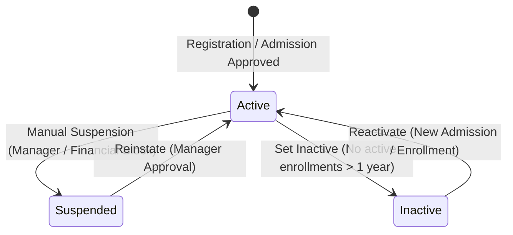
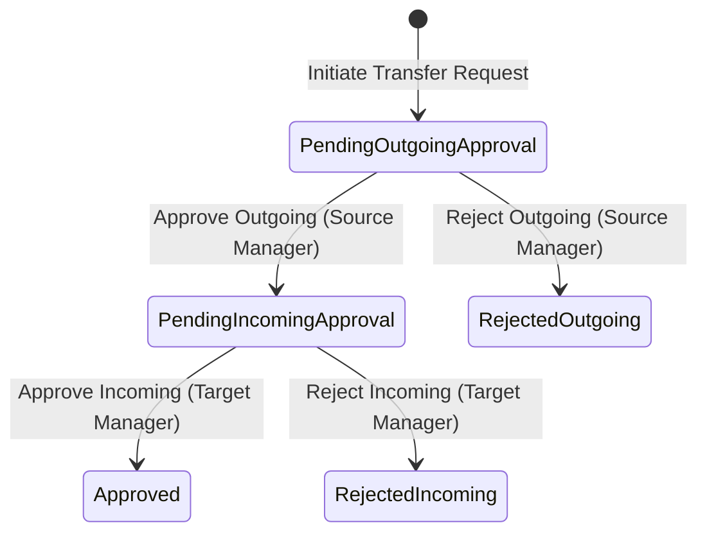
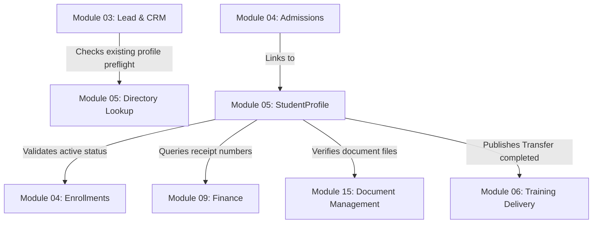

# Functional Requirement Document (Part 1)
## Module 05: Student Management – Business Specifications & Rules

---

## 1. Introduction and Business Benefits

The **Student Management** module represents the primary registry and data custody layer for learners within the Al Saud Training Institute (ASTI) Integrated Institute Management System (IMS). Under a Modular Monolith architecture, this module isolates student profile management, demographic records, compliance files, branch transfer workflows, and personal data privacy from the transactional lifecycles of CRM leads (Module 03) and class enrollments (Module 04).

### Key Business Benefits:
1.  **Strict Data Scoping and Multi-Branch Security:** Implements a strict server-side scoping policy. A branch registrar or manager can search for and manipulate student profiles only if those profiles have history or active presence in their designated branch context, preventing cross-branch data leaks.
2.  **Bilingual Legal Compliance:** Enforces double-field input validation (English and Arabic) for core identity names and descriptions to comply with Omani Ministry of Higher Education, Research and Innovation (MoHERI) training registry requirements.
3.  **Auditable Data Protection:** Sensitive PII columns are masked by default. Any disclosure of unmasked data is strictly gated behind an authentication challenge and a mandatory business justification, logged to a secure audit trail.
4.  **Operational Flexibility via Inter-Branch Transfers:** Allows student history to transition between branches (e.g., Muscat to Sohar) using a coordinated two-phase manager approval transfer workflow, ensuring data custody and records remain correct.
5.  **Proactive Risk Management:** Automated cron sweeps detect expiring student residency visas, civil IDs, and mandatory documents, flagging compliance alerts before licensing audits occur.

---

## 2. Detailed Functional Requirements

### FR-STU-001: Global Duplicate Preflight Check (person-lookup)
*   **Description & Actors:** Check if a physical person already exists globally in the institute's unified registry using a unique index. Preflight is called before counselor registration or admission creations to prevent redundant profile records. Actors: **Counselor**, **Registrar**, **System**.
*   **Preconditions:**
    *   The user session is authenticated.
*   **Inputs:**
    *   `mobile` (String, E.164 phone format, e.g. "+96899123456")
    *   `email` (String, Optional, valid email format)
    *   `nationalId` (String, Optional, alphanumeric Civil ID format)
*   **Processing Steps:**
    1.  Validate inputs using Zod parser filters.
    2.  Perform a read-only query on the `Person` database table to find a matching unique record:
        $$\text{match} = \text{find}(\text{Person.mobile} = \text{mobile} \lor \text{Person.email} = \text{email} \lor \text{Person.nationalId} = \text{nationalId})$$
    3.  If a match is found:
        *   Read the linked `StudentProfile` records.
        *   Check for active `Admission` records linked to that `StudentProfile` in the user's active branch where `admissionStatus \in \{Draft, Submitted, Approved\}` and `isDeleted = false`.
        *   If an active admission exists, flag the metadata with code `ERR_ADM_ACTIVE_ADMISSION_EXISTS`.
        *   Compile the response DTO containing a boolean flag `exists = true`, masked contact fields (e.g., `ah***@ex***.om`), and the existing `studentProfileId`.
    4.  If no match is found, return `exists = false`.
*   **Outputs & Postconditions:**
    *   Return lookup payload mapping matching indicators, masked PII, and active conflicts.
*   **Priority:** Must Have.

---

### FR-STU-002: Local Branch-Scoped Directory (student-profile-lookup)
*   **Description & Actors:** Retrieve a list of student profiles who have registered history or current active presence in the logged-in staff member's branch context. Actors: **Registrar**, **Branch Manager**, **Academic Coordinator**.
*   **Preconditions:**
    *   User session has the `student.read` permission.
    *   The target query `branchId` matches the branch context resolved from the user's session.
*   **Inputs:**
    *   `branchId` (UUID, resolved from session context)
    *   `searchQuery` (String, Optional, matches on name, mobile, email, or studentNumber)
    *   `page` (Integer, default = 1)
    *   `limit` (Integer, default = 25)
*   **Processing Steps:**
    1.  Reject the query if the user does not possess global reporting permissions and the requested `branchId` does not match the active session branch context.
    2.  Query the database for `StudentProfile` records where:
        *   `isDeleted = false`
        *   The profile is associated with at least one `Admission` record scoped to `branchId` (regardless of admission status) **OR** at least one `Enrollment` record scoped to `branchId`.
    3.  If `searchQuery` is provided, apply bilingual contains filters:
        *   `Person.firstName` contains `searchQuery` (Case Insensitive) OR
        *   `Person.lastName` contains `searchQuery` (Case Insensitive) OR
        *   `StudentProfile.studentNumber` contains `searchQuery` OR
        *   `Person.mobile` contains `searchQuery`
    4.  Apply pagination offset and page limit parameters.
    5.  For each matching record, mask contact details:
        *   `mobile` $\rightarrow$ mask middle digits (e.g., `+968 991*****`)
        *   `email` $\rightarrow$ mask prefix characters (e.g., `a****d@domain.om`)
        *   `nationalId` $\rightarrow$ mask all but last 4 characters (e.g., `******1234`)
    6.  Sort results by `joinedAt` DESC.
*   **Outputs & Postconditions:**
    *   Return a paginated collection of masked student profile DTOs.
*   **Priority:** Must Have.

---

### FR-STU-003: Audited Sensitive PII Reveal (student-pii-reveal)
*   **Description & Actors:** Temporarily decrypts and reveals raw PII values (mobile, email, national ID) for a student profile. The request is strictly conditional on log tracking. Actors: **Branch Manager**, **Super Admin**.
*   **Preconditions:**
    *   User possesses `student.reveal_pii` permission.
    *   The student profile must belong to the user's branch scope.
*   **Inputs:**
    *   `studentProfileId` (UUID)
    *   `justificationReason` (String, minimum 10 characters length)
*   **Processing Steps:**
    1.  Validate that `justificationReason` is present and satisfies length boundaries.
    2.  Enforce the branch scope: check if the student profile is associated with an active/historical admission or enrollment in the user's active branch. If not, block query and return `ERR_STU_OUT_OF_SCOPE`.
    3.  Load the target `StudentProfile` and join its `Person` details.
    4.  Write a record to the `AuditLog` table containing:
        *   `id` = UUID
        *   `performedBy` = active user ID
        *   `action` = "RevealPII"
        *   `entityType` = "StudentProfile"
        *   `entityId` = `studentProfileId`
        *   `branchId` = user's active branch context ID
        *   `reason` = `justificationReason`
        *   `timestamp` = now()
    5.  Return the unmasked values of `mobile`, `email`, and `nationalId` to the client.
*   **Outputs & Postconditions:**
    *   Returns decrypted details payload. Persists audit logging records synchronously inside the transaction boundary.
*   **Priority:** Must Have.

---

### FR-STU-004: Bilingual Profile Editing
*   **Description & Actors:** Updates the core profile details of a student. Requires dual-field inputs for name fields to comply with bilingual administrative records. Actors: **Registrar**, **Super Admin**.
*   **Preconditions:**
    *   User has `student.write` permission.
    *   The student profile belongs to the user's branch scope.
*   **Inputs:**
    *   `studentProfileId` (UUID)
    *   `firstNameEn` (String, English letters only)
    *   `lastNameEn` (String, English letters only)
    *   `firstNameAr` (String, Arabic script only)
    *   `lastNameAr` (String, Arabic script only)
    *   `dateOfBirth` (DateTime)
    *   `nationality` (String)
    *   `gender` (String)
*   **Processing Steps:**
    1.  Retrieve the `StudentProfile` record under a write lock:
        $$\text{profile} = \text{queryForUpdate}(\text{StudentProfile.id} = \text{studentProfileId} \land \text{isDeleted} = \text{false})$$
        If not found or status is not Active, throw `ERR_STU_PROFILE_INACTIVE`.
    2.  Validate names:
        *   Ensure `firstNameEn` and `lastNameEn` pass the regular expression: `^[a-zA-Z\s]+$`
        *   Ensure `firstNameAr` and `lastNameAr` pass the Arabic script regular expression: `^[\u0621-\u064A\u0660-\u0669\s]+$`
    3.  Compute age at registration date:
        $$\text{age} = \text{year}(\text{now}()) - \text{year}(\text{dateOfBirth})$$
        If $\text{age} < 14$, reject the edit with code `ERR_STU_AGE_RESTRICTION`.
    4.  Update the linked `Person` record fields.
    5.  Save modified entities in a single database transaction.
    6.  Log the field differences to the `AuditLog` table.
*   **Outputs & Postconditions:**
    *   Database entities are updated. Emits `StudentProfileUpdated` event to the outbox.
*   **Priority:** Must Have.

---

### FR-STU-005: Emergency Contact and Family Mapping
*   **Description & Actors:** Map emergency contact information (Name, Relationship, Contact Number) linked to the profile. Actors: **Registrar**.
*   **Preconditions:**
    *   User has `student.write` permission.
    *   Target student profile is active and in scope.
*   **Inputs:**
    *   `studentProfileId` (UUID)
    *   `contactName` (String)
    *   `relationship` (String)
    *   `contactNumber` (String, E.164 phone format)
    *   `isPrimary` (Boolean)
*   **Processing Steps:**
    1.  Verify the student profile belongs to the user's branch scope.
    2.  If `isPrimary` is `true`:
        *   Unset the `isPrimary` flag on all existing emergency contacts linked to this student profile in the database.
    3.  Create or update the `EmergencyContact` database record.
    4.  Save changes.
    5.  Write history record to the `AuditLog` table.
*   **Outputs & Postconditions:**
    *   Emergency contacts are saved, ensuring exactly one primary contact is designated.
*   **Priority:** Must Have.

---

### FR-STU-006: Student Profile Suspension and Reinstatement
*   **Description & Actors:** Manually change the active operational state of a student profile to suspended or active. Status changes are evaluated by business rules before execution. Actors: **Branch Manager**, **Super Admin**.
*   **Preconditions:**
    *   User has the `student.suspend` permission in the active branch.
*   **Inputs:**
    *   `studentProfileId` (UUID)
    *   `targetStatus` (Enum: Active, Suspended)
    *   `reasonCode` (String, e.g., "DISCIPLINARY", "FINANCIAL_ARREARS")
    *   `remarks` (String)
*   **Processing Steps:**
    1.  Retrieve the `StudentProfile` and lock the row using `FOR UPDATE`.
    2.  Verify the current status:
        *   If `targetStatus = Suspended`, ensure current status is `Active`.
        *   If `targetStatus = Active`, ensure current status is `Suspended`.
    3.  If transition to `Suspended` is requested:
        *   Check for active `Enrollment` records in the branch:
            *   If active enrollments exist, set advisory blocks on student classroom portals, but do not automatically drop the student from the class roster (requires manual manager intervention).
    4.  Update the `studentStatus` field to the `targetStatus` value.
    5.  Insert a transition log to the `StudentStatusHistory` table containing the user ID, targetStatus, reasonCode, and remarks.
    6.  Publish `StudentStatusChanged` event to the outbox.
*   **Outputs & Postconditions:**
    *   The student's status is modified. Access policies for downstream portals are updated.
*   **Priority:** Must Have.

---

### FR-STU-007: Branch-to-Branch Profile Transfer Initiation
*   **Description & Actors:** Initiates a transfer request to migrate a student's profile context and files from the source branch to a new target branch. Actors: **Registrar**, **Super Admin**.
*   **Preconditions:**
    *   User has `student.transfer_initiate` permission in the student's source branch.
*   **Inputs:**
    *   `studentProfileId` (UUID)
    *   `targetBranchId` (UUID)
    *   `reason` (String)
*   **Processing Steps:**
    1.  Verify the target branch exists and is in `Active` status.
    2.  Check for active transfer requests for this student profile:
        *   If a record exists in `PendingOutgoingApproval` or `PendingIncomingApproval` states, throw `ERR_STU_TRANSFER_IN_PROGRESS`.
    3.  Check active enrollments:
        *   If the student has active enrollments in the source branch, throw `ERR_STU_ACTIVE_ENROLLMENTS_EXIST` (enrollments must be Completed, Cancelled, or Dropped before starting a branch transfer).
    4.  Create a `StudentTransferRequest` table record with status `PendingOutgoingApproval`.
    5.  Publish `StudentTransferInitiated` to the outbox.
*   **Outputs & Postconditions:**
    *   A transfer request is written to the database.
*   **Priority:** Should Have.

---

### FR-STU-008: Outgoing Transfer Approval
*   **Description & Actors:** Approves or rejects the outgoing student transfer from the source branch. Actors: **Source Branch Manager**, **Super Admin**.
*   **Preconditions:**
    *   User has `student.transfer_approve` permission in the source branch.
*   **Inputs:**
    *   `transferRequestId` (UUID)
    *   `action` (Enum: APPROVE, REJECT)
    *   `remarks` (String, required if action is REJECT)
*   **Processing Steps:**
    1.  Retrieve the `StudentTransferRequest` matching the ID. Validate status is `PendingOutgoingApproval`.
    2.  If `action = REJECT`:
        *   Update request status to `RejectedOutgoing` and save remarks.
    3.  If `action = APPROVE`:
        *   Update request status to `PendingIncomingApproval`.
        *   Record approving user ID and timestamp.
    4.  Commit the transaction and log the transition to the audit log.
*   **Outputs & Postconditions:**
    *   Request state is updated. The target branch manager is notified.
*   **Priority:** Should Have.

---

### FR-STU-009: Incoming Transfer Approval and Migration
*   **Description & Actors:** Finalizes the transfer request at the target branch, creating the active branch scope links and migrating access keys. Actors: **Target Branch Manager**, **Super Admin**.
*   **Preconditions:**
    *   User has `student.transfer_approve` permission in the target branch.
*   **Inputs:**
    *   `transferRequestId` (UUID)
    *   `action` (Enum: APPROVE, REJECT)
    *   `remarks` (String, required if action is REJECT)
*   **Processing Steps:**
    1.  Retrieve the `StudentTransferRequest`. Validate status is `PendingIncomingApproval`.
    2.  If `action = REJECT`:
        *   Update request status to `RejectedIncoming` and save remarks.
    3.  If `action = APPROVE`:
        *   Update request status to `Approved`.
        *   Generate a new `Admission` record in the target branch in status `Approved` with a newly generated target branch admission number.
        *   Update default branch assignment metadata for the student profile (if configured).
        *   Publish `StudentTransferCompleted` to the outbox.
    4.  Log the final migration to the `AuditLog` table.
*   **Outputs & Postconditions:**
    *   Transfer request is completed. The student becomes visible in the target branch directory search.
*   **Priority:** Should Have.

---

### FR-STU-010: Student ID Card Print Audit
*   **Description & Actors:** Audit the physical printing of student ID cards to track replacements and verify payment receipt compliance. Actors: **Registrar**.
*   **Preconditions:**
    *   User has `student.write` permission.
*   **Inputs:**
    *   `studentProfileId` (UUID)
    *   `isReplacement` (Boolean)
    *   `receiptNumber` (String, required if `isReplacement` is true)
*   **Processing Steps:**
    1.  Retrieve `StudentProfile` in branch scope.
    2.  If `isReplacement` is `true`:
        *   Query the Finance context to verify that the provided `receiptNumber` exists, is cleared, and maps to the "ID Card Replacement Fee" (configured default fee, e.g. OMR 5.000).
        *   If the receipt is invalid or unpaid, throw `ERR_STU_PAYMENT_REQUIRED`.
    3.  Create an entry in the `StudentIDCardPrintLog` table.
    4.  Increment the profile's print sequence count.
    5.  Save changes.
*   **Outputs & Postconditions:**
    *   Print event is saved. ID Card print sequence is updated.
*   **Priority:** Should Have.

---

### FR-STU-011: Mandatory Documents Verification Tracking
*   **Description & Actors:** Validates and flags uploaded student identification files (Passport, Civil ID, and sponsor letters) as verified. Actors: **Registrar**, **Branch Manager**.
*   **Preconditions:**
    *   User has `student.document_verify` permission.
*   **Inputs:**
    *   `studentProfileId` (UUID)
    *   `documentId` (UUID)
    *   `action` (Enum: VERIFY, REJECT)
    *   `rejectionReason` (String, required if action is REJECT)
*   **Processing Steps:**
    1.  Query the Document Management context for the `Document` matching `documentId` and verify it is linked to `studentProfileId`.
    2.  If `action = VERIFY`:
        *   Set document verification status to `Verified`.
        *   Set `verifiedAt = now()` and `verifiedBy = activeUserId`.
        *   Publish `StudentDocumentVerified` to the outbox.
    3.  If `action = REJECT`:
        *   Set document verification status to `Rejected`.
        *   Save the `rejectionReason`.
        *   Publish `StudentDocumentRejected` to the outbox.
    4.  Commit the transaction and record the log entry to the `AuditLog` table.
*   **Outputs & Postconditions:**
    *   The database document verification state is persisted.
*   **Priority:** Must Have.

---

### FR-STU-012: Expiring Document Cron Sweeping
*   **Description & Actors:** Sweeps student documents daily to detect files approaching expiration and triggers registrar dashboard alerts. Actors: **System**.
*   **Preconditions:**
    *   Automated nightly trigger.
*   **Inputs:**
    *   `expiryDaysThreshold` (Integer, default = 30)
*   **Processing Steps:**
    1.  Daily at 00:05 GST (Oman Time, UTC+4), the background job runner invokes the document sweep task.
    2.  Query all `Document` database records where:
        *   `isDeleted = false`
        *   `status = Verified`
        *   `expiryDate` falls between `now()` and `now() + 30 days`.
    3.  Join the corresponding `StudentProfile` and active `Admission` records to resolve the student's branch ownership.
    4.  For each expiring document, generate a compliance notification:
        *   Create a task record in the `SystemTask` table scoped to the target branch registrars.
        *   Publish `StudentDocumentExpiring` event to the outbox.
*   **Outputs & Postconditions:**
    *   Creates active task logs and dispatches outbox notifications.
*   **Priority:** Should Have.

---

## 3. Business Rules Engine Specifications

The system enforces the following declarative constraints. Any operational handler breaching these rules must roll back the database transaction:

| Rule Code | Rule Title | Target Model / Field | Invariant Constraint / Business Logic |
| :--- | :--- | :--- | :--- |
| **BR-STU-001** | Person Link Constraint | `StudentProfile.personId` | A student profile must always reference a valid, existing, and non-deleted record in the `Person` table. Profile demographic queries must resolve via this relationship. |
| **BR-STU-002** | Branch Scoping | All Read/Write Operations | A user cannot read, search, or update student profiles unless the student has an active/historical admission or enrollment in the user's active branch scope. Super Admin roles bypass this check. |
| **BR-STU-003** | Soft Delete Protection | All Models | No record in `StudentProfile`, `EmergencyContact`, `StudentIDCardPrintLog`, or `StudentTransferRequest` may be hard-deleted. A delete call sets `isDeleted = true` and updates `deletedAt` and `deletedBy`. |
| **BR-STU-004** | PII Encryption & Masking | `Person` PII Columns | Mobile, email, and national ID fields must be encrypted at rest. Query responses mask middle digits unless decrypted via `FR-STU-003` which enforces audit logging. |
| **BR-STU-005** | Suspension Enrollment Block | `StudentProfile.status` | If a student status is `Suspended`, any attempt to create a new enrollment draft or transition an existing enrollment to `Submitted` or `Approved` must be blocked by the system with `ERR_STU_PROFILE_SUSPENDED`. |
| **BR-STU-006** | Transfer Enrollment Lock | `StudentTransferRequest` | An inter-branch transfer cannot be initiated or approved if the student has active or confirmed enrollments in the source branch. |
| **BR-STU-007** | ID Card Print Receipt Rule | `StudentIDCardPrintLog` | If `isReplacement = true`, print command validation must verify a paid, cleared receipt for card replacement fees from the Finance context. |
| **BR-STU-008** | Age Boundary Constraint | `Person.dateOfBirth` | A student profile cannot be created or updated if the calculated age of the person is less than 14 years on the day of update. |

---

## 4. State Machine Transition Rules

The status of the `StudentProfile` and `StudentTransferRequest` entities must transition strictly according to the matrices below.

### 4.1 StudentProfile Status Transitions

| From Status | To Status | Allowed Action / Event | Required Permission |
| :--- | :--- | :--- | :--- |
| `Active` | `Suspended` | Suspend Profile | `student.suspend` |
| `Suspended` | `Active` | Reinstate Profile | `student.suspend` |
| `Active` | `Inactive` | Auto-deactivation sweep | System Cron |
| `Inactive` | `Active` | Create Admission / Enrollment | `admission.create` |

***

### 4.2 StudentTransferRequest Status Transitions

| From Status | To Status | Allowed Action / Event | Required Permission |
| :--- | :--- | :--- | :--- |
| `[*]` | `PendingOutgoingApproval` | Submit Transfer Request | `student.transfer_initiate` |
| `PendingOutgoingApproval` | `PendingIncomingApproval` | Approve Outgoing Transfer | `student.transfer_approve` (Source Branch) |
| `PendingOutgoingApproval` | `RejectedOutgoing` | Reject Outgoing Transfer | `student.transfer_approve` (Source Branch) |
| `PendingIncomingApproval` | `Approved` | Approve Incoming Transfer (Migrates admission) | `student.transfer_approve` (Target Branch) |
| `PendingIncomingApproval` | `RejectedIncoming` | Reject Incoming Transfer | `student.transfer_approve` (Target Branch) |

---

## 5. Cross-Module Integration Map

To maintain clean Domain-Driven Design boundaries inside the TypeScript monorepo, Module 05 integrates with other bounded contexts via published contracts and events:

### Dependency Specifics:
1.  **Lead & CRM (Module 03):** Queries `DIR` (`person-lookup`) to check if a prospect already has an active record or student ID, avoiding duplicate data entries.
2.  **Admissions & Enrollments (Module 04):** Creation of a Student Profile occurs synchronously during Lead-to-Admission conversion. Downstream enrollments query the profile status, rejecting transaction steps if the profile is `Suspended`.
3.  **Finance & Receivables (Module 09):** Provides receipt verification details for ID replacement logs. Reads student profile active statuses to block student portal access for outstanding fees.
4.  **Document Management (Module 15):** Owns physical file uploads and signed URLs. Student Management maps document validation status and expiry metadata over these references.
5.  **Training Delivery (Module 06):** Listens to `StudentTransferCompleted` events to update batch waitlist configurations if a student changes branch context.
