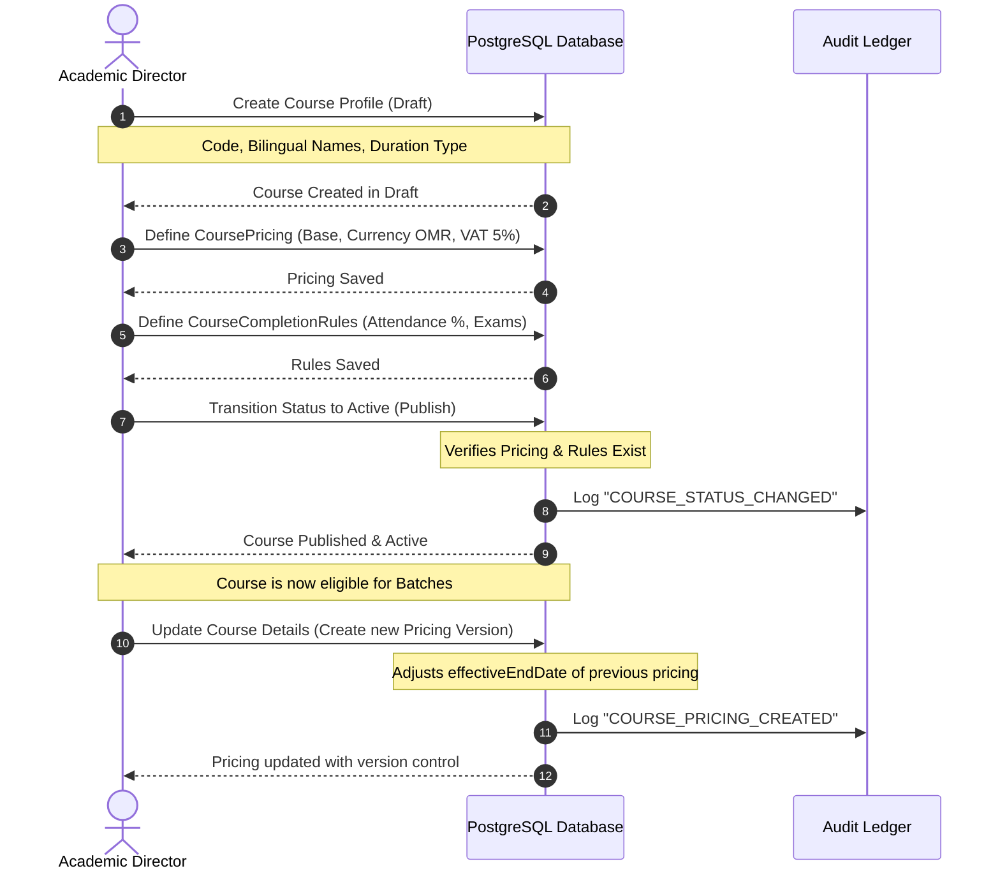
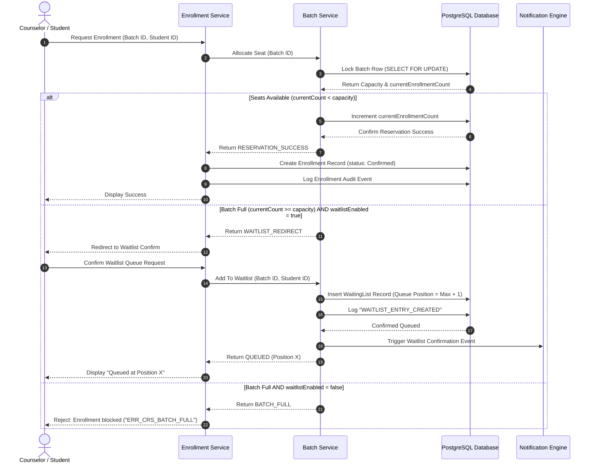
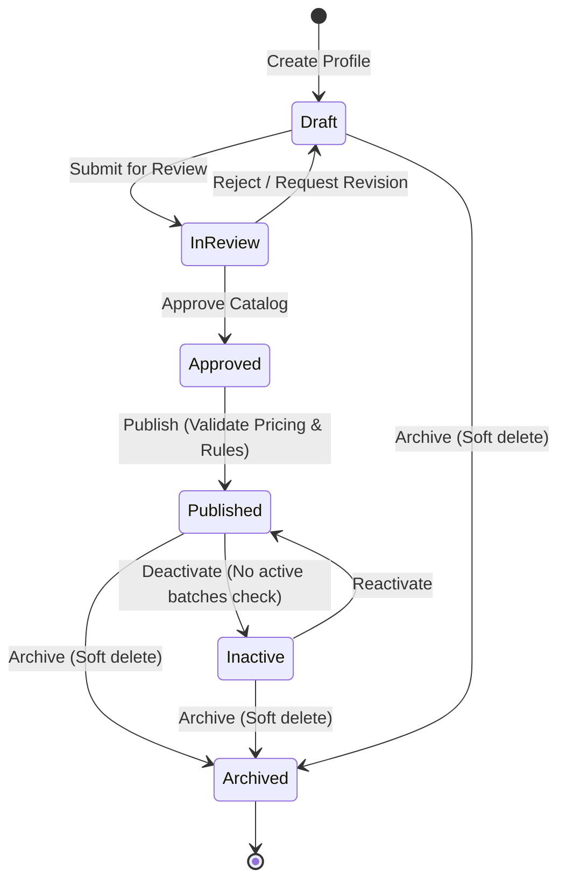
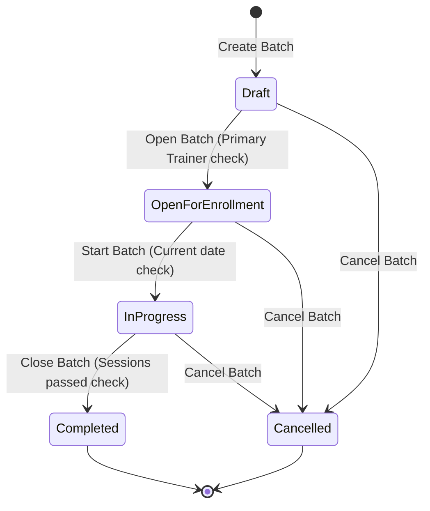
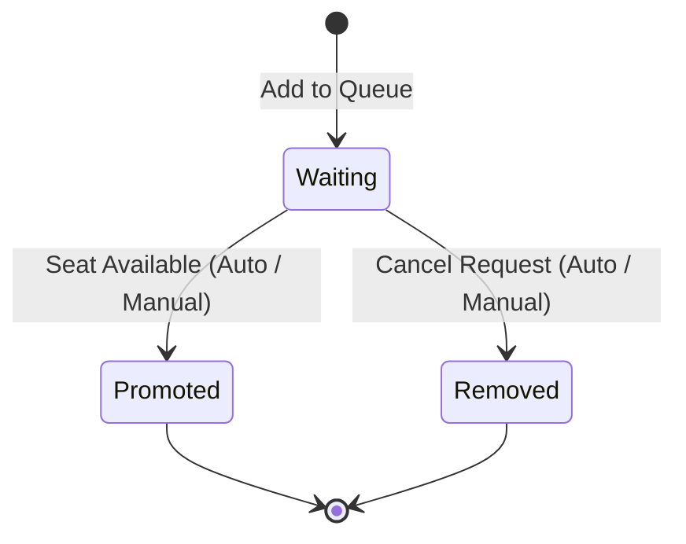

# Module 06 — Course Catalog & Training Delivery (Batch) Management

## Part 2 — User Stories, Use Cases, Workflows, State Machines

**Version:** 3.0  
**Status:** Draft  
**Domain:** Course Catalog & Training Delivery  
**Module Code:** CRS  

---

# 1. User Stories

The following user stories define the functional requirements from the perspective of various actors. Each story is prioritized using the MoSCoW methodology and includes complete, concrete Gherkin BDD test scenarios.

---

### US-CRS-001: Define Course Profile
*   **As an** Academic Director  
*   **I want to** define and register a new training course with code, bilingual names, and duration  
*   **So that** it can be added to ASTI's curriculum catalog and made available for branch scheduling.  
*   **Priority:** Must Have  
*   **Acceptance Criteria:**  
    ```gherkin
    Scenario: Successfully create a course profile in draft status
      Given the Academic Director is authenticated in the Admin Portal
      And has the "course.catalog.create" permission
      When the Academic Director submits the course details:
        | Field                | Value                               |
        | courseCode           | HS-NEBOSH-01                        |
        | nameEnglish          | NEBOSH International General Cert   |
        | nameArabic           | شهادة نيبوش العامة الدولية          |
        | departmentId         | 89f4b007-4235-46b0-bb82-f54228da3542|
        | branchId             | 35428da6-c66d-4ea1-bb85-74c203bfd11f|
        | courseClassification | Individual                          |
        | durationType         | HoursBased                          |
        | durationValue        | 40                                  |
        | effectiveStartDate   | 2026-07-01                          |
      Then the system validates that "HS-NEBOSH-01" is globally unique
      And the system creates the Course record
      And sets the Course status to "Draft"
      And records a "COURSE_CREATED" audit log event

    Scenario: Prevent creation when the course code already exists
      Given the Academic Director is authenticated in the Admin Portal
      And a course with code "HS-NEBOSH-01" already exists in the database
      When the Academic Director attempts to create a course with code "HS-NEBOSH-01"
      Then the system blocks the creation
      And returns the error "ERR_CRS_DUPLICATE_CODE"
    ```

---

### US-CRS-002: Publish Course to Catalog
*   **As an** Academic Director  
*   **I want to** transition a course from Draft to Active status once pricing and completion rules are attached  
*   **So that** the course becomes visible on portals and eligible for batch scheduling.  
*   **Priority:** Must Have  
*   **Acceptance Criteria:**  
    ```gherkin
    Scenario: Successfully publish a course with active pricing and completion rules
      Given the Academic Director is authenticated
      And has the "course.catalog.publish" permission
      And a course with ID "5ccb702d-aa2a-49a9-a20f-39a58ea485b6" exists in "Draft" status
      And the course has an active "CoursePricing" record
      And the course has an active "CourseCompletionRule" record
      When the Academic Director requests to transition the course to "Active"
      Then the system updates the Course status to "Active"
      And records a "COURSE_STATUS_CHANGED" audit log event

    Scenario: Block publishing when course is missing completion rules
      Given the Academic Director is authenticated
      And a course with ID "5ccb702d-aa2a-49a9-a20f-39a58ea485b6" exists in "Draft" status
      And the course is missing associated "CourseCompletionRule" records
      When the Academic Director requests to transition the course to "Active"
      Then the system blocks the transition
      And returns the error "ERR_CRS_MISSING_PRICING_OR_RULES"
    ```

---

### US-CRS-003: Override Base Pricing at Branch Level
*   **As a** Branch Manager  
*   **I want to** establish specific course pricing for my branch that overrides the global default  
*   **So that** the price aligns with regional market structures.  
*   **Priority:** Should Have  
*   **Acceptance Criteria:**  
    ```gherkin
    Scenario: Successfully configure a branch-specific pricing override
      Given the Branch Manager is authenticated
      And has the "course.pricing.override" permission for Branch "Muscat-HQ" (ID: "35428da6-c66d-4ea1-bb85-74c203bfd11f")
      And a course "HS-NEBOSH-01" has global pricing of OMR 150.000
      When the Branch Manager configures pricing:
        | Field              | Value      |
        | courseId           | HS-NEBOSH-1|
        | branchId           | Muscat-HQ  |
        | customerType       | Individual |
        | basePrice          | 135.000    |
        | taxPercentage      | 5.000      |
        | effectiveStartDate | 2026-07-01 |
      Then the system registers the "CoursePricing" record linked to Branch "Muscat-HQ"
      And does not modify the global pricing record
      And records a "COURSE_PRICING_CREATED" audit log event
    ```

---

### US-CRS-004: Create a Batch Delivery
*   **As a** Branch Manager  
*   **I want to** instantiate a training delivery batch for an active course with dates, branch, and capacity parameters  
*   **So that** counselors can begin registering students.  
*   **Priority:** Must Have  
*   **Acceptance Criteria:**  
    ```gherkin
    Scenario: Successfully instantiate a batch in draft status
      Given the Branch Manager is authenticated
      And has the "batch.delivery.create" permission
      And a course "HS-NEBOSH-01" exists in "Active" status
      When the Branch Manager creates a batch:
        | Field              | Value                   |
        | batchCode          | B-NEB-2026-001          |
        | batchName          | NEBOSH Class A - Q3     |
        | courseId           | HS-NEBOSH-01            |
        | branchId           | Muscat-HQ               |
        | startDate          | 2026-07-15              |
        | endDate            | 2026-08-30              |
        | capacity           | 25                      |
        | waitingListEnabled | true                    |
      Then the system verifies "B-NEB-2026-001" is unique
      And checks that the batch dates reside within course effective dates
      And creates the Batch record in "Draft" status
      And records a "BATCH_CREATED" audit log event
    ```

---

### US-CRS-005: Assign Trainer and Validate Overlaps
*   **As an** Academic Coordinator  
*   **I want to** assign a trainer to a batch and verify they do not have overlapping sessions in other batches  
*   **So that** scheduling conflicts and double-bookings are avoided.  
*   **Priority:** Must Have  
*   **Acceptance Criteria:**  
    ```gherkin
    Scenario: Successfully assign trainer with no conflicts
      Given the Academic Coordinator is authenticated
      And has the "batch.delivery.assign" permission
      And a batch "B-NEB-2026-001" is in "Draft" status
      And Trainer "Dr. Ahmed" is in "Active" status with no overlapping timetabled sessions
      When the Academic Coordinator assigns "Dr. Ahmed" as "Primary" from "2026-07-15" to "2026-08-30"
      Then the system creates the BatchTrainer record
      And records a "TRAINER_ASSIGNED_TO_BATCH" audit log event

    Scenario: Reject assignment due to timetable overlap
      Given the Academic Coordinator is authenticated
      And a batch "B-NEB-2026-001" has sessions scheduled on Mon/Wed 18:00-20:00
      And Trainer "Dr. Ahmed" is already assigned to batch "B-NEB-2026-002" with sessions Mon/Wed 19:00-21:00
      When the Academic Coordinator attempts to assign "Dr. Ahmed" to "B-NEB-2026-001"
      Then the system blocks the assignment
      And returns the error "ERR_CRS_TRAINER_SCHEDULE_CONFLICT"
    ```

---

### US-CRS-006: Auto-Promote Waitlist Entry
*   **As the** System  
*   **I want to** automatically promote the first student on the waiting list when a confirmed seat is cancelled  
*   **So that** the batch capacity remains optimized without manual coordination.  
*   **Priority:** Should Have  
*   **Acceptance Criteria:**  
    ```gherkin
    Scenario: Promote first waitlisted student on seat cancellation
      Given a batch "B-NEB-2026-001" has capacity 20 and current enrollment count 20
      And Student "Salem" is on the waiting list for "B-NEB-2026-001" at position 1
      And Student "Muna" is on the waiting list for "B-NEB-2026-001" at position 2
      When an active enrollment in batch "B-NEB-2026-001" is cancelled
      Then the system transitions Student "Salem"'s waitlist status to "Promoted"
      And publishes the domain event "WaitlistStudentPromoted" for "Salem"
      And updates batch "currentEnrollmentCount" to 20
      And shifts Student "Muna"'s position to 1
      And records a "WAITLIST_ENTRY_PROMOTED" audit log event
    ```

---

### US-CRS-007: Register Student into Walk-in Fast-Track Batch
*   **As a** Counselor  
*   **I want to** register a walk-in student directly into a fast-track single-day batch and instantly mark it eligible for evaluation  
*   **So that** the student can complete their training and receive their certificate on the same day.  
*   **Priority:** Must Have  
*   **Acceptance Criteria:**  
    ```gherkin
    Scenario: Enroll walk-in student in a walk-in configured batch
      Given the Counselor is authenticated
      And has the "batch.waitlist.manage" permission
      And a batch "B-WALK-99" is configured with "isWalkIn = true"
      When the Counselor enrolls Student "Talal" in batch "B-WALK-99"
      Then the system skips the waiting list checks
      And adds "Talal" to the batch roster
      And flags the student profile for same-day evaluation
    ```

---

### US-CRS-008: Transition Batch to Completed and Evaluate Graduates
*   **As an** Academic Coordinator  
*   **I want to** mark a batch as completed  
*   **So that** the system evaluates all students against the completion rules to authorize certificates.  
*   **Priority:** Must Have  
*   **Acceptance Criteria:**  
    ```gherkin
    Scenario: Complete batch and trigger completion evaluations
      Given the Academic Coordinator is authenticated
      And has the "batch.delivery.transition" permission
      And batch "B-NEB-2026-001" is in "InProgress" status
      When the Academic Coordinator transitions the batch status to "Completed"
      Then the system updates the batch status to "Completed"
      And publishes a "BatchCompleted" outbox event
      And the system initiates the completion evaluation process for all enrolled students
      And records a "BATCH_STATUS_CHANGED" audit log event
    ```

---

# 2. Use Cases

---

## UC-CRS-001: Publish a New Training Course
*   **Primary Actor:** Academic Director
*   **Preconditions:**
    1.  Academic Director is authenticated in the Admin Portal.
    2.  Course profile has been created in `Draft` status.
*   **Main Success Scenario:**
    1.  The Academic Director navigates to the Course Catalog and selects the target Draft Course.
    2.  The Academic Director accesses the "Pricing Settings" panel and defines the global default base pricing in OMR and VAT settings.
    3.  The Academic Director accesses the "Completion Rules" panel and defines attendance thresholds, exam mandates, and approval flags.
    4.  The Academic Director clicks "Publish Course".
    5.  The system validates that the course code is unique, pricing has no date overlaps, and completion rules exist.
    6.  The system updates the Course status to `Active` and registers the pricing and rules as `Active`.
    7.  The system writes a `COURSE_STATUS_CHANGED` audit record.
*   **Alternative Flows:**
    *   *A1: Validation Failure (Missing Rules):* If the course has no pricing or completion rules defined, the system highlights the missing sections, blocks publishing, and displays `ERR_CRS_MISSING_PRICING_OR_RULES`.
    *   *A2: Date Overlap Check:* If a new pricing record overlaps with an existing active version, the system prompts the user: "This will terminate the previous pricing version. Proceed?". If confirmed, the system sets `effectiveEndDate` of the old pricing to `newStartDate - 1 day` and saves.
*   **Postconditions:** The Course is marked `Active` and is available for batch scheduling.

---

## UC-CRS-002: Instantiate a Course Delivery Batch
*   **Primary Actor:** Branch Manager
*   **Preconditions:**
    1.  Branch Manager is authenticated.
    2.  The course exists in `Active` status.
*   **Main Success Scenario:**
    1.  The Branch Manager selects "Create Batch" from the Branch Portal.
    2.  The Branch Manager selects the Course and the Branch context.
    3.  The Branch Manager inputs the Batch Code, Batch Name, start date, end date, and maximum seat capacity.
    4.  The Branch Manager configures waitlist settings (`waitingListEnabled = true`).
    5.  The system validates that the Batch Code is globally unique, the dates fall within the Course's effective date range, and the capacity is greater than zero.
    6.  The system saves the Batch record in `Draft` status.
    7.  The system logs the `BATCH_CREATED` audit event.
*   **Alternative Flows:**
    *   *A1: Date Range Violation:* If the batch dates fall outside the course's `effectiveStartDate` and `effectiveEndDate`, the system blocks saving and returns `ERR_CRS_INVALID_DATE_RANGE`.
    *   *A2: Duplicate Batch Code:* If the batch code already exists, the system flags the field and returns `ERR_CRS_DUPLICATE_BATCH_CODE`.
*   **Postconditions:** The Batch is initialized in `Draft` status.

---

## UC-CRS-003: Assign a Trainer with Schedule Validation
*   **Primary Actor:** Academic Coordinator
*   **Preconditions:**
    1.  The Batch exists in `Draft` or `OpenForEnrollment` status.
    2.  The Trainer profile is active in the database.
*   **Main Success Scenario:**
    1.  The Academic Coordinator opens the Batch details page and navigates to the "Trainer Allocations" tab.
    2.  The Academic Coordinator selects "Add Trainer Assignment".
    3.  The Academic Coordinator inputs the Trainer UUID, sets the role to `Primary`, and specifies the assignment start and end dates.
    4.  The system checks the Trainer's existing batch assignments for date-range overlaps.
    5.  The system resolves the timetabled session slots (days, start/end hours) for the overlapping batches and confirms no day/time collisions exist.
    6.  The system saves the `BatchTrainer` record.
    7.  The system logs the `TRAINER_ASSIGNED_TO_BATCH` event.
*   **Alternative Flows:**
    *   *A1: Double Booking Intercepted:* If the system finds a session time collision (e.g., Trainer is already scheduled in Batch B on Mondays at 18:00), the system displays `ERR_CRS_TRAINER_SCHEDULE_CONFLICT` with conflict details (Batch Code, Day, Time) and blocks the assignment.
    *   *A2: Primary Trainer Conflict:* If another trainer is already flagged as `Primary` for overlapping dates in this batch, the system returns `ERR_CRS_PRIMARY_TRAINER_ALREADY_ASSIGNED` and asks the user to demote or adjust the role.
*   **Postconditions:** The Trainer is mapped to the Batch delivery context.

---

## UC-CRS-004: Process Waitlist Promotion
*   **Primary Actor:** Automated System / Registrar
*   **Preconditions:**
    1.  A student is cancelled from a full batch, or the Branch Manager increases the batch capacity.
*   **Main Success Scenario:**
    1.  The system captures a seat release trigger on the batch.
    2.  The system executes a database lock on the batch's `WaitingList` entries.
    3.  The system identifies the student at `queuePosition = 1` with status `Waiting`.
    4.  The system calls the Batch application service to promote the waitlist student.
    5.  The system updates the student's waitlist status to `Promoted` and decrements all remaining waiting entries' `queuePosition` fields by 1.
    6.  The system increments the batch's `currentEnrollmentCount` by 1.
    7.  The system publishes a `WaitlistStudentPromoted` domain event (containing `studentId`, `leadId`, and `batchId`) to the transactional outbox. Downstream, the Admission & Enrollment context subscribes to this event to create the student's enrollment record.
    8.  The system dispatches a notification via the Communication module to alert the student of their promotion.
    9.  The system records `WAITLIST_ENTRY_PROMOTED`.
*   **Alternative Flows:**
    *   *A1: Enrollment Creation Fails:* Downstream, if the enrollment service fails to create the enrollment (e.g., student documents expired, or finance block), it publishes an `EnrollmentCreationFailed` event. The Batch context subscribes to this event to revert the promotion: marking the candidate's waitlist status as `Held` or `Suspended`, decrementing the batch's `currentEnrollmentCount` by 1, and triggering a new promotion check.
*   **Postconditions:** The seat is refilled, and the waitlist queue is shifted.

---

# 3. Business Workflows

## 3.1 Course Catalog Lifecycle Workflow
The following workflow diagram illustrates the sequence of steps required to define, publish, update, and eventually archive a course.



---

## 3.2 Automated Capacity Check & Waitlist Workflow
This workflow shows the transaction sequence when an enrollment is attempted on a batch that has reached its capacity limit, showing delegation across Bounded Context boundaries.



---

# 4. State Machines

This section defines the states, allowed transitions, and permission validations for the primary entities in this module.

## 4.1 Course State Machine



### Course Transition Matrix

| From Status | To Status | Allowed Trigger | Required Permission | Invariant Checks / Validations |
| --- | --- | --- | --- | --- |
| `None` | `Draft` | Course Creation API | `course.catalog.create` | Code uniqueness check; mandatory field validation. |
| `Draft` | `InReview` | Submit for Review API | `course.catalog.submit` | Verifies course configuration completion. |
| `InReview` | `Approved` | Approve Course API | `course.catalog.approve` | Validation of syllabus, categories, and tags. |
| `InReview` | `Draft` | Reject/Revise API | `course.catalog.approve` | Requires explanation notes. |
| `Approved` | `Published` | Publish Course API | `course.catalog.publish` | Verifies at least one active pricing and completion rule exists. |
| `Published` | `Inactive` | Deactivate Course API | `course.catalog.publish` | Verifies no batches are in `OpenForEnrollment` or `InProgress` state. |
| `Inactive` | `Published` | Reactivate Course API | `course.catalog.publish` | Verifies date ranges. |
| `Published` | `Archived` | Archive Course API | `course.catalog.archive` | Soft delete check: toggles `isDeleted = true`. Completes or cancels current batches. |
| `Inactive` | `Archived` | Archive Course API | `course.catalog.archive` | Soft delete check: toggles `isDeleted = true`. |
| `Draft` | `Archived` | Archive Course API | `course.catalog.archive` | Soft delete check: toggles `isDeleted = true`. |

---

## 4.2 Batch State Machine



### Batch Transition Matrix

| From Status | To Status | Allowed Trigger | Required Permission | Invariant Checks / Validations |
| --- | --- | --- | --- | --- |
| `None` | `Draft` | Create Batch API | `batch.delivery.create` | Unique batch code; dates fall within course effective dates. |
| `Draft` | `OpenForEnrollment` | Open Enrollment API | `batch.delivery.transition` | Checks that at least one `Primary` Trainer is assigned. |
| `OpenForEnrollment` | `InProgress` | Start Batch (Manual/Cron) | `batch.delivery.transition` | Checks that current date `>= startDate`. Block default registrations if capacity full. |
| `InProgress` | `Completed` | Complete Batch API | `batch.delivery.transition` | Verifies all scheduled timetable sessions are in past. Publishes `BatchCompleted` domain event. |
| `Draft` | `Cancelled` | Cancel Batch API | `batch.delivery.transition` | None. |
| `OpenForEnrollment` | `Cancelled` | Cancel Batch API | `batch.delivery.transition` | Publishes `BatchCancelled` domain event. Downstream, Admission context cancels enrollments and Finance triggers refund evaluations. |
| `InProgress` | `Cancelled` | Cancel Batch API | `batch.delivery.transition` | Publishes `BatchCancelled` domain event. Downstream, Admission context cancels active enrollments and Finance triggers refund/billing adjustments. |

---

## 4.3 Waiting List State Machine



### Waiting List Transition Matrix

| From Status | To Status | Allowed Trigger | Required Permission | Invariant Checks / Validations |
| --- | --- | --- | --- | --- |
| `None` | `Waiting` | Add to Waitlist API | `batch.waitlist.manage` | Batch capacity is full; student/lead is not already active on roster. |
| `Waiting` | `Promoted` | Promotion Event | `System` / `batch.waitlist.manage` | Verified seat vacancy; publishes `WaitlistStudentPromoted` domain event (which downstream context listens to for creating enrollment). |
| `Waiting` | `Removed` | Remove/Cancel API | `batch.waitlist.manage` / `Student` | Sets waitlist state to `Removed`. Remaining queue positions shifted. |
