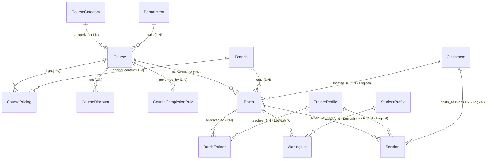

# Module 06 — Course Catalog & Training Delivery (Batch) Management

## Part 4 — Database Entities and CRUD Matrix

**Version:** 3.0  
**Status:** Draft  
**Domain:** Course Catalog & Training Delivery  
**Module Code:** CRS  

---

# 1. Entity Specifications

All entities defined below are structured for a PostgreSQL database and modeled using Prisma ORM. In alignment with project rules, all operational entities include standard audit fields and soft-delete controls, while configuration/pricing entities include effective dating properties.

---

## 1.1 CourseCategory (`course_categories`)
Represents the hierarchical categorization of training courses (e.g., Health & Safety, Business Administration).

| Field Name | Prisma Type | PostgreSQL Type | Nullability | Keys & Constraints | Description / Defaults |
| --- | --- | --- | --- | --- | --- |
| `id` | `String` | `UUID` | NOT NULL | PK | Auto-generated UUID |
| `code` | `String` | `VARCHAR(50)` | NOT NULL | Unique | Short alphanumeric identifier (e.g., "HS") |
| `nameEnglish` | `String` | `VARCHAR(150)` | NOT NULL | - | Category title in English |
| `nameArabic` | `String` | `VARCHAR(150)` | NOT NULL | - | Category title in Arabic |
| `description` | `String` | `TEXT` | NULL | - | Detailed description |
| `parentCategoryId`| `String` | `UUID` | NULL | FK | Self-relation to `course_categories.id` |
| `status` | `RecordStatus` | `VARCHAR(50)` | NOT NULL | - | Enum: `Draft`, `Active`, `Inactive`, `Archived` |
| **Audit Fields** | | | | | |
| `createdAt` | `DateTime` | `TIMESTAMPTZ(6)`| NOT NULL | - | `DEFAULT now()` |
| `createdBy` | `String` | `UUID` | NULL | FK | Reference to `users.id` |
| `updatedAt` | `DateTime` | `TIMESTAMPTZ(6)`| NULL | - | Automatically updated |
| `updatedBy` | `String` | `UUID` | NULL | FK | Reference to `users.id` |
| `deletedAt` | `DateTime` | `TIMESTAMPTZ(6)`| NULL | - | Timestamp of soft-delete |
| `isDeleted` | `Boolean` | `BOOLEAN` | NOT NULL | - | `DEFAULT false` |
| `version` | `Int` | `INTEGER` | NOT NULL | - | `DEFAULT 1` (Optimistic locking) |

---

## 1.2 Course (`courses`)
Represents the course definitions catalog (extends the existing database model).

| Field Name | Prisma Type | PostgreSQL Type | Nullability | Keys & Constraints | Description / Defaults |
| --- | --- | --- | --- | --- | --- |
| `id` | `String` | `UUID` | NOT NULL | PK | Auto-generated UUID |
| `courseCode` | `String` | `VARCHAR(50)` | NOT NULL | Unique | Alphanumeric course code (e.g., "HS-NEBOSH-01") |
| `nameEnglish` | `String` | `VARCHAR(150)` | NOT NULL | - | Course title in English |
| `nameArabic` | `String` | `VARCHAR(150)` | NOT NULL | - | Course title in Arabic |
| `descriptionEnglish`| `String`| `TEXT` | NULL | - | Detailed description in English |
| `descriptionArabic`| `String` | `TEXT` | NULL | - | Detailed description in Arabic |
| `departmentId` | `String` | `UUID` | NOT NULL | FK | Reference to `departments.id` |
| `categoryId` | `String` | `UUID` | NOT NULL | FK | Reference to `course_categories.id` |
| `courseClassification`| `String`| `VARCHAR(50)` | NOT NULL | - | Enum: `Individual`, `Corporate`, `WalkIn`, `Online` |
| `durationType` | `String` | `VARCHAR(50)` | NOT NULL | - | Enum: `FixedDays`, `HoursBased`, `SessionsBased` |
| `durationValue` | `Int` | `INTEGER` | NOT NULL | Check: `> 0` | Numerical duration length |
| `allowWalkInCompletion`|`Boolean`| `BOOLEAN` | NOT NULL | - | `DEFAULT false` (Bypasses timetable checks) |
| `status` | `String` | `VARCHAR(50)` | NOT NULL | - | Enum: `Draft`, `InReview`, `Approved`, `Published`, `Archived` |
| `effectiveStartDate`| `DateTime`| `DATE` | NOT NULL | - | Pricing/rules validation start date |
| `effectiveEndDate` | `DateTime` | `DATE` | NULL | - | pricing/rules validation end date |
| **Audit Fields** | | | | | |
| `createdAt` | `DateTime` | `TIMESTAMPTZ(6)`| NOT NULL | - | `DEFAULT now()` |
| `createdBy` | `String` | `UUID` | NULL | FK | Reference to `users.id` |
| `updatedAt` | `DateTime` | `TIMESTAMPTZ(6)`| NULL | - | - |
| `updatedBy` | `String` | `UUID` | NULL | FK | Reference to `users.id` |
| `deletedAt` | `DateTime` | `TIMESTAMPTZ(6)`| NULL | - | - |
| `isDeleted` | `Boolean` | `BOOLEAN` | NOT NULL | - | `DEFAULT false` |
| `version` | `Int` | `INTEGER` | NOT NULL | - | `DEFAULT 1` |

---

## 1.3 CoursePricing (`course_pricings`)
Handles versioned, dimensioned price structures.

| Field Name | Prisma Type | PostgreSQL Type | Nullability | Keys & Constraints | Description / Defaults |
| --- | --- | --- | --- | --- | --- |
| `id` | `String` | `UUID` | NOT NULL | PK | Auto-generated UUID |
| `courseId` | `String` | `UUID` | NOT NULL | FK | Reference to `courses.id` |
| `branchId` | `String` | `UUID` | NULL | FK | Reference to `branches.id` (NULL = Global) |
| `batchId` | `String` | `UUID` | NULL | FK | Reference to `batches.id` (NULL = Global/Branch) |
| `customerType` | `String` | `VARCHAR(50)` | NOT NULL | - | Enum: `Individual`, `Corporate`, `WalkIn` |
| `batchType` | `String` | `VARCHAR(50)` | NOT NULL | - | Enum: `Regular`, `FastTrack`, `Weekend` |
| `currency` | `String` | `VARCHAR(10)` | NOT NULL | Check: `OMR` | Currency type (restricted to OMR in Oman) |
| `basePrice` | `Decimal` | `NUMERIC(12,3)` | NOT NULL | Check: `>= 0` | Net amount before tax |
| `taxPercentage` | `Decimal` | `NUMERIC(5,3)` | NOT NULL | `DEFAULT 5.000`| VAT percentage (Oman standard = 5.000%) |
| `effectiveStartDate`| `DateTime`| `DATE` | NOT NULL | - | Pricing activation date |
| `effectiveEndDate` | `DateTime` | `DATE` | NULL | - | Pricing expiry date |
| `status` | `String` | `VARCHAR(50)` | NOT NULL | - | Enum: `Draft`, `Active`, `Inactive` |
| **Audit Fields** | | | | | |
| `createdAt` | `DateTime` | `TIMESTAMPTZ(6)`| NOT NULL | - | `DEFAULT now()` |
| `createdBy` | `String` | `UUID` | NULL | FK | Reference to `users.id` |
| `updatedAt` | `DateTime` | `TIMESTAMPTZ(6)`| NULL | - | - |
| `updatedBy` | `String` | `UUID` | NULL | FK | Reference to `users.id` |
| `deletedAt` | `DateTime` | `TIMESTAMPTZ(6)`| NULL | - | - |
| `isDeleted` | `Boolean` | `BOOLEAN` | NOT NULL | - | `DEFAULT false` |
| `version` | `Int` | `INTEGER` | NOT NULL | - | `DEFAULT 1` |

---

## 1.4 CourseDiscount (`course_discounts`)
Defines the discounts applicable across courses and branches.

| Field Name | Prisma Type | PostgreSQL Type | Nullability | Keys & Constraints | Description / Defaults |
| --- | --- | --- | --- | --- | --- |
| `id` | `String` | `UUID` | NOT NULL | PK | Auto-generated UUID |
| `courseId` | `String` | `UUID` | NOT NULL | FK | Reference to `courses.id` |
| `branchId` | `String` | `UUID` | NULL | FK | Reference to `branches.id` (NULL = Global) |
| `batchId` | `String` | `UUID` | NULL | FK | Reference to `batches.id` (NULL = Global/Branch) |
| `discountType` | `String` | `VARCHAR(50)` | NOT NULL | - | Enum: `Individual`, `Corporate`, `EarlyBird` |
| `discountMode` | `String` | `VARCHAR(50)` | NOT NULL | - | Enum: `Percentage`, `FixedAmount` |
| `discountValue` | `Decimal` | `NUMERIC(12,3)` | NOT NULL | Check: `> 0` | Percent value or flat OMR value |
| `requiresApproval` | `Boolean` | `BOOLEAN` | NOT NULL | `DEFAULT false`| If true, flags supervisor authorization |
| `effectiveStartDate`| `DateTime`| `DATE` | NOT NULL | - | Discount start date |
| `effectiveEndDate` | `DateTime` | `DATE` | NULL | - | Discount expiry date |
| `status` | `String` | `VARCHAR(50)` | NOT NULL | - | Enum: `Draft`, `Active`, `Inactive` |
| **Audit Fields** | | | | | |
| `createdAt` | `DateTime` | `TIMESTAMPTZ(6)`| NOT NULL | - | `DEFAULT now()` |
| `createdBy` | `String` | `UUID` | NULL | FK | Reference to `users.id` |
| `updatedAt` | `DateTime` | `TIMESTAMPTZ(6)`| NULL | - | - |
| `updatedBy` | `String` | `UUID` | NULL | FK | Reference to `users.id` |
| `deletedAt` | `DateTime` | `TIMESTAMPTZ(6)`| NULL | - | - |
| `isDeleted` | `Boolean` | `BOOLEAN` | NOT NULL | - | `DEFAULT false` |

---

## 1.5 CourseCompletionRule (`course_completion_rules`)
Defines the metrics required for a student to graduate from a course.

| Field Name | Prisma Type | PostgreSQL Type | Nullability | Keys & Constraints | Description / Defaults |
| --- | --- | --- | --- | --- | --- |
| `id` | `String` | `UUID` | NOT NULL | PK | Auto-generated UUID |
| `courseId` | `String` | `UUID` | NOT NULL | FK | Reference to `courses.id` |
| `minimumAttendancePercent` | `Int` | `INTEGER` | NOT NULL | Check: `0-100` | Minimum attendance % required (e.g. 80) |
| `examRequired` | `Boolean` | `BOOLEAN` | NOT NULL | `DEFAULT false`| If exam score validation is mandatory |
| `feeClearanceRequired` | `Boolean`| `BOOLEAN` | NOT NULL | `DEFAULT true` | If fully paid invoices are required |
| `manualApprovalRequired`| `Boolean`| `BOOLEAN` | NOT NULL | `DEFAULT false`| If Academic Director sign-off is needed |
| `effectiveStartDate`| `DateTime`| `DATE` | NOT NULL | - | Rule validation start date |
| `effectiveEndDate` | `DateTime` | `DATE` | NULL | - | Rule validation end date |
| `status` | `String` | `VARCHAR(50)` | NOT NULL | - | Enum: `Active`, `Inactive` |
| **Audit Fields** | | | | | |
| `createdAt` | `DateTime` | `TIMESTAMPTZ(6)`| NOT NULL | - | `DEFAULT now()` |
| `createdBy` | `String` | `UUID` | NULL | FK | Reference to `users.id` |
| `updatedAt` | `DateTime` | `TIMESTAMPTZ(6)`| NULL | - | - |
| `updatedBy` | `String` | `UUID` | NULL | FK | Reference to `users.id` |
| `deletedAt` | `DateTime` | `TIMESTAMPTZ(6)`| NULL | - | - |
| `isDeleted` | `Boolean` | `BOOLEAN` | NOT NULL | - | `DEFAULT false` |

---

## 1.6 Batch (`batches`)
Models physical batch instances.

| Field Name | Prisma Type | PostgreSQL Type | Nullability | Keys & Constraints | Description / Defaults |
| --- | --- | --- | --- | --- | --- |
| `id` | `String` | `UUID` | NOT NULL | PK | Auto-generated UUID |
| `courseId` | `String` | `UUID` | NOT NULL | FK | Reference to `courses.id` |
| `branchId` | `String` | `UUID` | NOT NULL | FK | Reference to `branches.id` |
| `classroomId` | `String` | `UUID` | NULL | Logical Key | Ref to `classrooms.id` (Logical only, no database FK) |
| `batchCode` | `String` | `VARCHAR(50)` | NOT NULL | Unique | Alphanumeric batch code |
| `batchNameEnglish`| `String`| `VARCHAR(150)` | NOT NULL | - | Name/Label of the class in English |
| `batchNameArabic` | `String`| `VARCHAR(150)` | NOT NULL | - | Name/Label of the class in Arabic |
| `startDate` | `DateTime` | `DATE` | NOT NULL | - | Training start date |
| `endDate` | `DateTime` | `DATE` | NOT NULL | - | Training end date |
| `capacity` | `Int` | `INTEGER` | NOT NULL | Check: `> 0` | Max seats allowed |
| `currentEnrollmentCount`| `Int` | `INTEGER` | NOT NULL | `DEFAULT 0` | Active roster count (Updated via Batch Service) |
| `waitingListEnabled`| `Boolean` | `BOOLEAN` | NOT NULL | `DEFAULT true` | Allows waitlisting if batch is full |
| `allowOverbooking` | `Boolean` | `BOOLEAN` | NOT NULL | `DEFAULT false`| Permits supervisor overbooking |
| `isWalkIn` | `Boolean` | `BOOLEAN` | NOT NULL | `DEFAULT false`| Toggle for walk-in rapid track |
| `corporateAccountId`| `String` | `UUID` | NULL | Logical Key | Ref to `corporate_accounts.id` (Logical only, no database FK) |
| `status` | `String` | `VARCHAR(50)` | NOT NULL | - | Enum: `Draft`, `OpenForEnrollment`, `InProgress`, `Completed`, `Cancelled` |
| **Audit Fields** | | | | | |
| `createdAt` | `DateTime` | `TIMESTAMPTZ(6)`| NOT NULL | - | `DEFAULT now()` |
| `createdBy` | `String` | `UUID` | NULL | FK | Reference to `users.id` |
| `updatedAt` | `DateTime` | `TIMESTAMPTZ(6)`| NULL | - | - |
| `updatedBy` | `String` | `UUID` | NULL | FK | Reference to `users.id` |
| `deletedAt` | `DateTime` | `TIMESTAMPTZ(6)`| NULL | - | - |
| `isDeleted` | `Boolean` | `BOOLEAN` | NOT NULL | - | `DEFAULT false` |
| `version` | `Int` | `INTEGER` | NOT NULL | - | `DEFAULT 1` |

*   **Database Indexes:**
    *   `@@index([courseId])`
    *   `@@index([branchId])`
    *   `@@index([classroomId])`
    *   `@@index([corporateAccountId])`

---

## 1.7 BatchTrainer (`batch_trainers`)
Maps trainers to batches with scheduling and role constraints.

| Field Name | Prisma Type | PostgreSQL Type | Nullability | Keys & Constraints | Description / Defaults |
| --- | --- | --- | --- | --- | --- |
| `id` | `String` | `UUID` | NOT NULL | PK | Auto-generated UUID |
| `batchId` | `String` | `UUID` | NOT NULL | FK | Reference to `batches.id` |
| `trainerId` | `String` | `UUID` | NOT NULL | Logical Key | Ref to `TrainerProfile.id` (Logical only, no database FK) |
| `role` | `String` | `VARCHAR(50)` | NOT NULL | - | Enum: `Primary`, `Assistant`, `Observer` |
| `assignedFrom` | `DateTime` | `DATE` | NOT NULL | - | Assignment start date |
| `assignedTo` | `DateTime` | `DATE` | NOT NULL | - | Assignment end date |
| `status` | `String` | `VARCHAR(50)` | NOT NULL | `DEFAULT 'Active'`| Enum: `Active`, `Inactive` |
| **Audit Fields** | | | | | |
| `createdAt` | `DateTime` | `TIMESTAMPTZ(6)`| NOT NULL | - | `DEFAULT now()` |
| `createdBy` | `String` | `UUID` | NULL | FK | Reference to `users.id` |
| `updatedAt` | `DateTime` | `TIMESTAMPTZ(6)`| NULL | - | - |
| `updatedBy` | `String` | `UUID` | NULL | FK | Reference to `users.id` |
| `deletedAt` | `DateTime` | `TIMESTAMPTZ(6)`| NULL | - | - |
| `isDeleted` | `Boolean` | `BOOLEAN` | NOT NULL | - | `DEFAULT false` |

*   **Database Indexes:**
    *   `@@index([batchId])`
    *   `@@index([trainerId])`

---

## 1.8 WaitingList (`waiting_list`)
Manages waitlisted students or leads when batches reach capacity limits.

| Field Name | Prisma Type | PostgreSQL Type | Nullability | Keys & Constraints | Description / Defaults |
| --- | --- | --- | --- | --- | --- |
| `id` | `String` | `UUID` | NOT NULL | PK | Auto-generated UUID |
| `courseId` | `String` | `UUID` | NOT NULL | FK | Reference to `courses.id` |
| `batchId` | `String` | `UUID` | NOT NULL | FK | Reference to `batches.id` |
| `studentId` | `String` | `UUID` | NULL | Logical Key | Ref to `StudentProfile.id` (Logical reference only, no database FK; Null if leadId is set) |
| `leadId` | `String` | `UUID` | NULL | Logical Key | Ref to `leads.id` (Logical reference only, no database FK; Null if studentId is set) |
| `queuePosition` | `Int` | `INTEGER` | NOT NULL | Check: `> 0` | Chronological placement count (1, 2...) |
| `status` | `String` | `VARCHAR(50)` | NOT NULL | - | Enum: `Waiting`, `Promoted`, `Removed` |
| **Audit Fields** | | | | | |
| `createdAt` | `DateTime` | `TIMESTAMPTZ(6)`| NOT NULL | - | `DEFAULT now()` (maps to requestedAt) |
| `createdBy` | `String` | `UUID` | NULL | FK | Reference to `users.id` |
| `updatedAt` | `DateTime` | `TIMESTAMPTZ(6)`| NULL | - | - |
| `updatedBy` | `String` | `UUID` | NULL | FK | Reference to `users.id` |
| `deletedAt` | `DateTime` | `TIMESTAMPTZ(6)`| NULL | - | - |
| `isDeleted` | `Boolean` | `BOOLEAN` | NOT NULL | - | `DEFAULT false` |

*   **Database Indexes:**
    *   `@@index([courseId])`
    *   `@@index([batchId])`
    *   `@@index([studentId])`
    *   `@@index([leadId])`
    *   `@@unique([studentId, batchId, status])` (Filtered unique index for active status `Waiting` to prevent student duplicates)
    *   `@@unique([leadId, batchId, status])` (Filtered unique index for active status `Waiting` to prevent lead duplicates)

---

## 1.9 Session (`sessions`)
Represents individual scheduled class sessions within a batch.

| Field Name | Prisma Type | PostgreSQL Type | Nullability | Keys & Constraints | Description / Defaults |
| --- | --- | --- | --- | --- | --- |
| `id` | `String` | `UUID` | NOT NULL | PK | Auto-generated UUID |
| `batchId` | `String` | `UUID` | NOT NULL | FK | Reference to `batches.id` |
| `sessionNumber` | `Int` | `INTEGER` | NOT NULL | - | Sequential session count |
| `titleEnglish` | `String` | `VARCHAR(150)` | NOT NULL | - | Class topic in English |
| `titleArabic` | `String` | `VARCHAR(150)` | NOT NULL | - | Class topic in Arabic |
| `sessionDate` | `DateTime` | `DATE` | NOT NULL | - | Scheduled date of class |
| `startTime` | `String` | `VARCHAR(10)` | NOT NULL | - | Class start hour (e.g. "18:00") |
| `endTime` | `String` | `VARCHAR(10)` | NOT NULL | - | Class end hour (e.g. "20:00") |
| `trainerId` | `String` | `UUID` | NULL | Logical Key | Ref to `TrainerProfile.id` (Logical reference only, no database FK) |
| `classroomId` | `String` | `UUID` | NULL | Logical Key | Ref to `classrooms.id` (Logical reference only, no database FK) |
| `status` | `String` | `VARCHAR(50)` | NOT NULL | - | Enum: `Scheduled`, `Completed`, `Cancelled`, `Rescheduled` |
| **Audit Fields** | | | | | |
| `createdAt` | `DateTime` | `TIMESTAMPTZ(6)`| NOT NULL | - | `DEFAULT now()` |
| `createdBy` | `String` | `UUID` | NULL | FK | Reference to `users.id` |
| `updatedAt` | `DateTime` | `TIMESTAMPTZ(6)`| NULL | - | - |
| `updatedBy` | `String` | `UUID` | NULL | FK | Reference to `users.id` |
| `deletedAt` | `DateTime` | `TIMESTAMPTZ(6)`| NULL | - | - |
| `isDeleted` | `Boolean` | `BOOLEAN` | NOT NULL | - | `DEFAULT false` |
| `version` | `Int` | `INTEGER` | NOT NULL | - | `DEFAULT 1` |

*   **Database Indexes:**
    *   `@@index([batchId])`
    *   `@@index([trainerId])`
    *   `@@index([classroomId])`
    *   `@@index([sessionDate])`

---# 2. Database Relationships

The following entity-relationship diagram shows the cardinality and logical/physical relationships:

### Context Boundary Decoupling Rules:
To align with clean Modular Monolith boundaries, cross-context relationships are modeled as **logical references (IDs)** in the database schema, with no physical database foreign keys (`ON DELETE` database cascade or restrict rules). Relational checks and operations are handled programmatically.

### Logical Cascade and Restrict Policies (Application-Enforced):
1.  **`CourseCategory` ── `Course` (1:N):**
    *   *Constraint:* `ON DELETE RESTRICT` (physical). You cannot delete a category if active courses refer to it.
2.  **`Course` ── `CoursePricing` / `CourseCompletionRule` / `CourseDiscount` (1:N):**
    *   *Constraint:* `ON DELETE RESTRICT` (physical, soft delete required). If logically archived, child structures remain in database with historical data integrity.
3.  **`Course` ── `Batch` (1:N):**
    *   *Constraint:* `ON DELETE RESTRICT` (physical). A course cannot be archived or soft-deleted if it contains active or in-progress batches.
4.  **`Batch` ── `BatchTrainer` (1:N):**
    *   *Constraint:* `ON DELETE CASCADE` (logical soft-delete cascade). Managed programmatically: when a batch is soft-deleted, the application layer updates associated trainer assignment rows to `isDeleted = true` inside the same transaction.
5.  **`Batch` ── `WaitingList` (1:N):**
    *   *Constraint:* `ON DELETE CASCADE` (logical soft-delete cascade). Managed programmatically: when a batch is cancelled or archived, the application layer updates waitlist statuses to `Removed` and flags `isDeleted = true`.
6.  **`Batch` ── `Session` (1:N):**
    *   *Constraint:* `ON DELETE CASCADE` (logical soft-delete cascade). Managed programmatically: when a batch is deleted or cancelled, all its scheduled class sessions are updated to `isDeleted = true` inside the same transaction.
7.  **`StudentProfile` ── `WaitingList` (1:N):**
    *   *Constraint:* `ON DELETE RESTRICT` (logical). Verified programmatically inside the Student/Admission context: a student profile cannot be soft-deleted or deactivated if the Batch context queries show they are in an active `Waiting` status.

### Recommended Indexes for Performance:
*   **`Course`:** `@@index([categoryId])`, `@@index([departmentId])`
*   **`CoursePricing`:** `@@index([courseId])`, `@@index([branchId])`, `@@index([batchId])`, and composite index `@@index([courseId, branchId, customerType, batchType, status])` for price resolution.
*   **`CourseDiscount`:** `@@index([courseId])`, `@@index([branchId])`, `@@index([batchId])`
*   **`CourseCompletionRule`:** `@@index([courseId])`
*   **`Batch`:** `@@index([courseId])`, `@@index([branchId])`, `@@index([classroomId])`, `@@index([corporateAccountId])`
*   **`BatchTrainer`:** `@@index([batchId])`, `@@index([trainerId])`
*   **`WaitingList`:** `@@index([courseId])`, `@@index([batchId])`, `@@index([studentId])`, `@@index([leadId])`, and composite unique indexes `@@unique([studentId, batchId, status])` and `@@unique([leadId, batchId, status])` for queue duplicates checks.
*   **`Session`:** `@@index([batchId])`, `@@index([trainerId])`, `@@index([classroomId])`, `@@index([sessionDate])`

---

# 3. CRUD Matrix

The following matrix maps internal/external human and system actors against the database entities. It details allowed CRUD operations alongside the strict branch-scoping isolation rules. To preserve audit history, active pricing and completion rules are immutable and cannot be updated directly; changes require versioned effective date increments.

| Actor | Entity | C | R | U | D | Audit | Branch-Scoping Isolation Logic |
| --- | --- | --- | --- | --- | --- | --- | --- |
| **Academic Director** | CourseCategory | Yes | Yes | Yes | No | Yes | **Global Scope:** Can configure categories system-wide. |
| **Academic Director** | Course | Yes | Yes | Yes | No | Yes | **Global Scope:** Can configure courses system-wide. |
| **Academic Director** | CoursePricing | Yes | Yes | Draft Only | No | Yes | **Global Scope:** Can define global default pricing. Active pricing is immutable. |
| **Academic Director** | CourseDiscount | Yes | Yes | Draft Only | No | Yes | **Global Scope:** Can define global default discounts. Active discounts are immutable. |
| **Academic Director** | CourseCompletionRule| Yes | Yes | Draft Only | No | Yes | **Global Scope:** Can define global completion rules. Active rules are immutable. |
| **Academic Director** | Batch | No | Yes | No | No | Yes | **Global Scope:** Read-only view for all branches. |
| **Academic Director** | BatchTrainer | No | Yes | No | No | Yes | **Global Scope:** Read-only view. |
| **Academic Director** | WaitingList | No | Yes | No | No | Yes | **Global Scope:** Read-only view. |
| **Academic Director** | Session | No | Yes | No | No | Yes | **Global Scope:** Read-only view. |
| **Branch Manager** | CourseCategory | No | Yes | No | No | No | **Global Scope:** Read-only view. |
| **Branch Manager** | Course | No | Yes | No | No | No | **Global Scope:** Read-only view. |
| **Branch Manager** | CoursePricing | Yes | Yes | Draft Only | No | Yes | **Branch Scope:** Can create overrides only for assigned branches (`UserBranchAccess`). Active overrides immutable. |
| **Branch Manager** | CourseDiscount | Yes | Yes | Draft Only | No | Yes | **Branch Scope:** Can create overrides only for assigned branches. Active overrides immutable. |
| **Branch Manager** | CourseCompletionRule| No | Yes | No | No | No | **Global Scope:** Read-only view. |
| **Branch Manager** | Batch | Yes | Yes | Yes | No | Yes | **Branch Scope:** Restricted to creating/editing batches inside their active `branchId` context. |
| **Branch Manager** | BatchTrainer | Yes | Yes | Yes | No | Yes | **Branch Scope:** Can assign trainers only to batches owned by their active branch. |
| **Branch Manager** | WaitingList | Yes | Yes | Yes | No | Yes | **Branch Scope:** Can manage waitlists only for branch batches. |
| **Branch Manager** | Session | Yes | Yes | Yes | No | Yes | **Branch Scope:** Restricted to managing sessions for batches owned by assigned branch. |
| **Counselor** | Course / Pricing | No | Yes | No | No | No | **Consolidated Branch Scope:** Can read courses/prices across all branches to coordinate sales. |
| **Counselor** | Batch | No | Yes | No | No | No | **Consolidated Branch Scope:** Can query batch rosters/schedules. |
| **Counselor** | WaitingList | Yes | Yes | Yes | No | Yes | **Branch Scope:** Can add students to waitlists for their active branch only. |
| **Counselor** | Session | No | Yes | No | No | No | **Consolidated Branch Scope:** Read-only view of scheduled sessions to assist student inquiries. |
| **Trainer** | Batch / BatchTrainer | No | Yes | No | No | No | **Trainer Scope:** Can only read batch roster details where they are mapped in `BatchTrainer`. |
| **Trainer** | WaitingList | No | No | No | No | No | **No Access.** |
| **Trainer** | Session | No | Yes | No | No | No | **Trainer Scope:** Read-only calendar schedules for their assigned batch sessions. |
| **Student** | Course / Pricing | No | Yes | No | No | No | **Global Scope:** Public view of active catalog courses and individual base pricing. |
| **Student** | Batch | No | Yes | No | No | No | **Student Scope:** Can read schedule dates for batches they are enrolled in or querying. |
| **Student** | WaitingList | No | Yes | No | No | Yes | **Student Scope:** Can read their own position status on a waitlist. |
| **Student** | Session | No | Yes | No | No | No | **Student Scope:** Read-only view of class schedules they are enrolled in. |
| **Billing Engine (System)**| CoursePricing / Discount | No | Yes | No | No | Yes | **System Context:** Resolves pricing hierarchy matching the student's branch and customer type. |
| **Completion Evaluator**| CourseCompletionRule| No | Yes | No | No | Yes | **System Context:** Reads rules to run against student marks. |run against student marks. |
