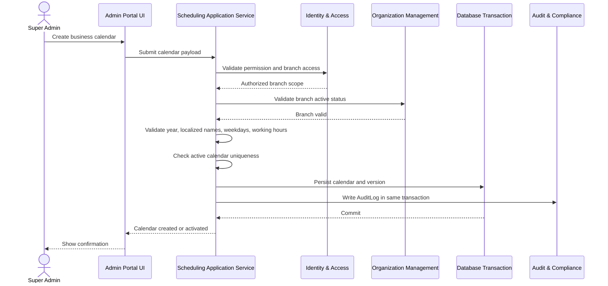
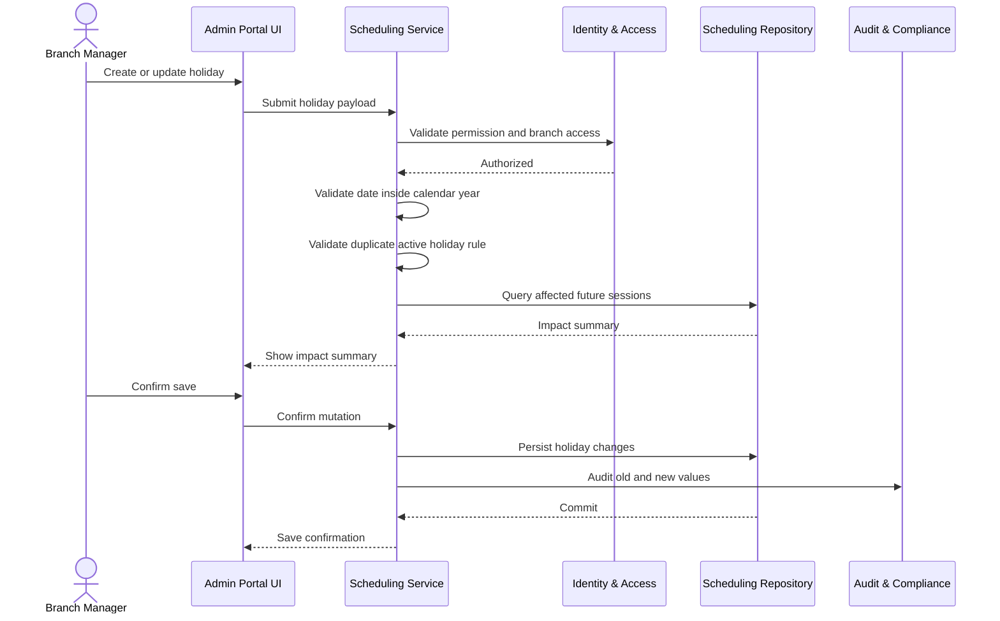
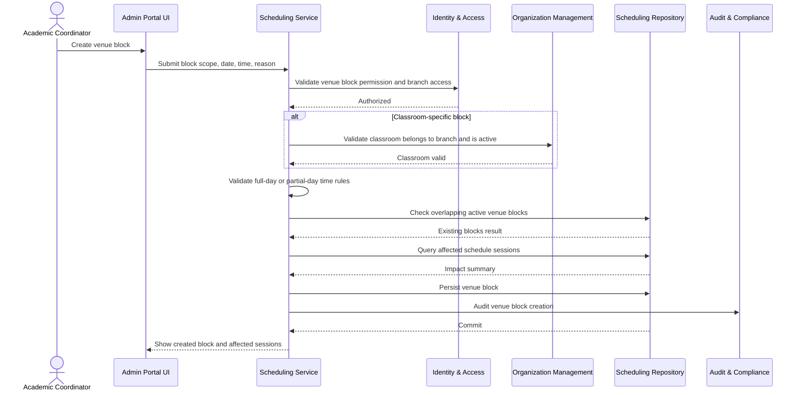
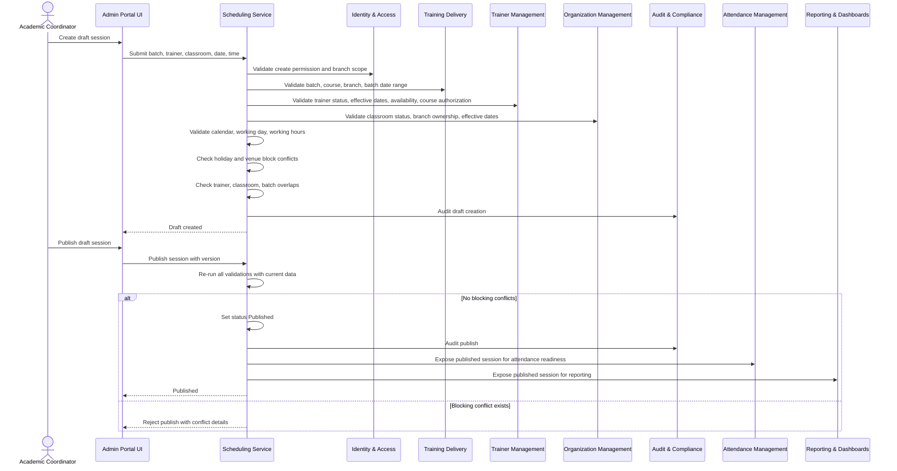
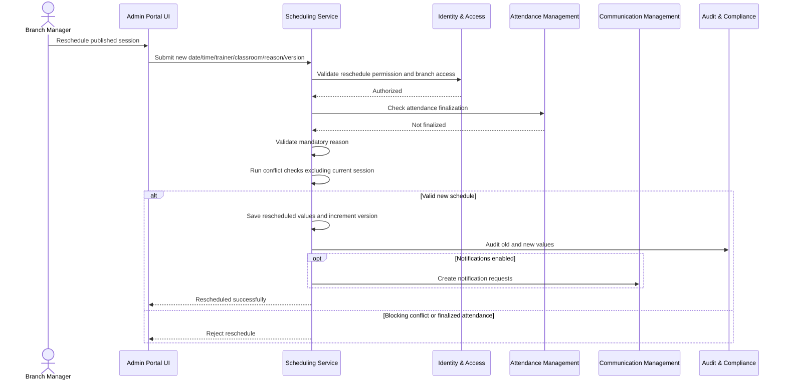
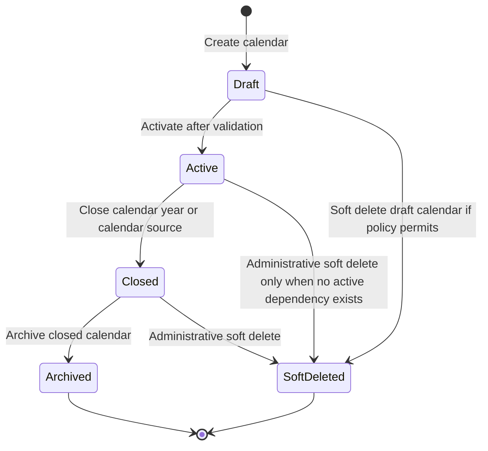
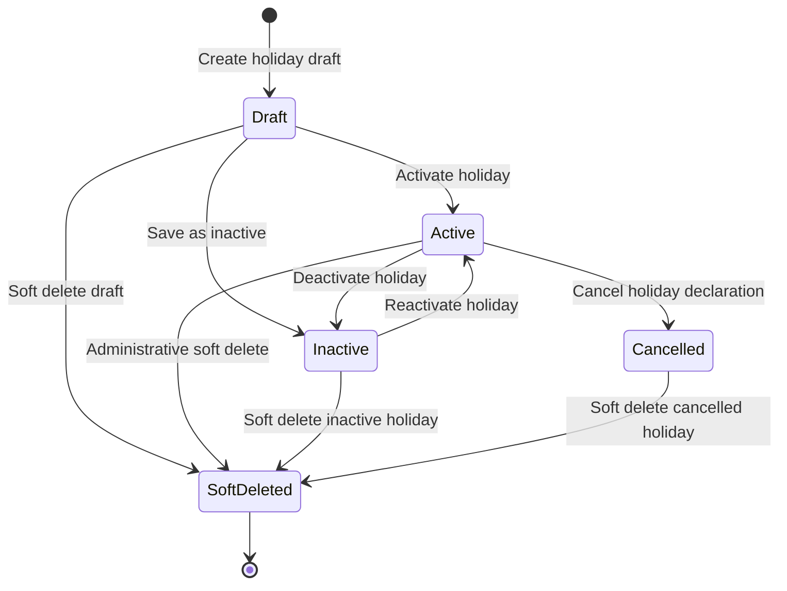
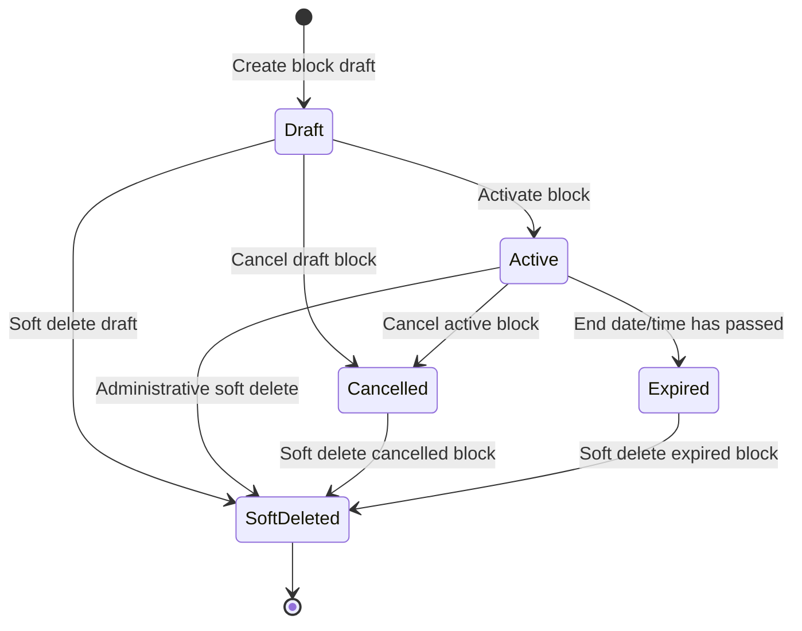
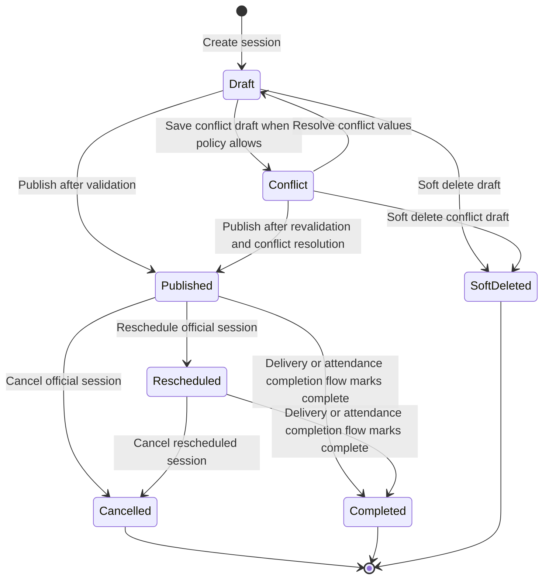

# Part 2 – User Stories, Use Cases, Workflows, State Machines

## Module 07 – Scheduling, Calendar & Holiday Management

## Document Control

| Field                  | Value                                                                                                                  |
| ---------------------- | ---------------------------------------------------------------------------------------------------------------------- |
| Product                | Al Saud Training Institute Integrated Institute Management System                                                      |
| Module                 | Module 07 – Scheduling, Calendar & Holiday Management                                                                  |
| Module Code            | SCH                                                                                                                    |
| Part                   | Part 2 – User Stories, Use Cases, Workflows, State Machines                                                            |
| Version                | 1.0                                                                                                                    |
| Architecture Style     | Next.js modular monolith, single admin portal first                                                                    |
| Primary Owning Context | Scheduling, Calendar & Holiday Management                                                                              |
| Related Part           | Part 1 – Business Overview, Functional Requirements, Business Rules                                                    |
| Default Timezone       | Oman GST, UTC+04:00                                                                                                    |
| Localization           | English and Arabic display support for calendar, holiday, venue block, schedule labels, messages, exports, and reports |
| Security Baseline      | Server-side branch isolation, dynamic permissions, soft delete, optimistic locking, and audit logging                  |

---

# 1. Purpose of This Part

This document translates the Module 07 business requirements into user-centered stories, executable use cases, operational workflows, and state machines. It defines how ASTI staff plan calendars, protect holidays, block classrooms, create timetables, validate conflicts, publish sessions, reschedule sessions, cancel sessions, and expose schedule data to downstream modules.

The module follows the IMS project principles:

1. Scheduling is implemented inside the modular monolith and does not require microservices, external brokers, CQRS, or event sourcing.
2. Scheduling does not own learner lifecycle. Learners continue to flow through the central `Enrollment` aggregate.
3. Scheduling references `Batch`, `Course`, `TrainerProfile`, `Classroom`, `Branch`, and `AttendanceSession`, but does not duplicate their master data.
4. Every sensitive scheduling action is branch-scoped, audited, version-checked, and soft-delete compliant where deletion is allowed.
5. Oman GST, UTC+04:00 is the default date and time interpretation for calendar, recurrence, validation, display, and export.
6. English and Arabic labels are supported for calendar names, holiday names, venue block reasons, and user-facing messages.

---

# 2. User Stories

## US-SCH-001 – Create and Activate the Institute Business Calendar

| Field                | Specification                                                                                                                                                                                                          |
| -------------------- | ---------------------------------------------------------------------------------------------------------------------------------------------------------------------------------------------------------------------- |
| User Story           | As a Super Admin, I want to create and activate the institute business calendar, and allow branch/year overrides where needed, so that scheduling users can create sessions only against a valid operational calendar. |
| Priority             | Must                                                                                                                                                                                                                   |
| Primary Actors       | Super Admin                                                                                                                                                                                                            |
| Supporting Actors    | Branch Manager, Identity & Access Module, Organization Management Module, Audit & Compliance Module                                                                                                                    |
| Related Requirements | FR-SCH-001, FR-SCH-002, FR-SCH-003, FR-SCH-004, FR-SCH-036, FR-SCH-037, FR-SCH-038, FR-SCH-039, FR-SCH-040                                                                                                             |
| Business Value       | Prevents schedule creation without an official institute calendar and enforces branch-specific exceptions in a controlled way.                                                                                         |

```gherkin
Feature: Institute business calendar setup
  Scenario: Super Admin activates the institute calendar
    Given the Super Admin is authenticated
    And the Super Admin has permission "scheduling.calendar.create"
    And no active institute calendar overlaps the effective period "2026-01-01" to "2026-12-31"
    When the Super Admin creates an institute business calendar for year "2026"
    And provides English name "ASTI Institute Calendar 2026"
    And provides Arabic name "تقويم المعهد 2026"
    And configures all seven weekdays with valid operating rules
    And activates the calendar
    Then the system must save the calendar with status "Active"
    And the system must set timezone to "Asia/Muscat" or equivalent UTC+04:00 display behavior
    And the system must reject any second active institute calendar for the same effective period
    And the system must create an AuditLog entry with old value, new value, actor, timestamp, branch, and IP address
```

## US-SCH-002 – Configure Operating Days and Working Hours

| Field                | Specification                                                                                                                                                                                   |
| -------------------- | ----------------------------------------------------------------------------------------------------------------------------------------------------------------------------------------------- |
| User Story           | As a Branch Manager, I want to define branch/year working day and working hour overrides on top of the institute calendar, so that sessions are scheduled only during permitted training hours. |
| Priority             | Must                                                                                                                                                                                            |
| Primary Actors       | Branch Manager                                                                                                                                                                                  |
| Supporting Actors    | Academic Coordinator, Identity & Access Module, Audit & Compliance Module                                                                                                                       |
| Related Requirements | FR-SCH-002, FR-SCH-003, FR-SCH-008, FR-SCH-013, FR-SCH-014, FR-SCH-039, FR-SCH-040                                                                                                              |
| Business Value       | Reduces accidental scheduling outside ASTI business hours and avoids branch-level operational confusion.                                                                                        |

```gherkin
Feature: Calendar operating hours
  Scenario: Branch Manager updates operating hours without overlap
    Given the Branch Manager is authenticated
    And the Branch Manager has permission "scheduling.calendar.update"
    And an active institute calendar exists for the selected branch and year
    When the Branch Manager marks Sunday as open
    And adds working hour window "09:00" to "13:00"
    And adds working hour window "14:00" to "18:00"
    Then the system must save both windows because they do not overlap
    And future published sessions on Sunday must fit inside one configured working window unless an authorized override is captured
    And the system must audit the calendar update

  Scenario: Branch Manager attempts overlapping working hour windows
    Given the Branch Manager is editing a branch override
    When the Branch Manager adds working hour window "09:00" to "13:00"
    And adds working hour window "12:30" to "16:00"
    Then the system must reject the second window
    And the system must show a validation message in English and Arabic
    And the calendar version must remain unchanged
```

## US-SCH-003 – Maintain Official Holidays and Closure Days

| Field                | Specification                                                                                                                                                                                         |
| -------------------- | ----------------------------------------------------------------------------------------------------------------------------------------------------------------------------------------------------- |
| User Story           | As a Branch Manager, I want to create institute holidays and branch-specific closure overrides, so that schedule publishing is blocked on non-training days unless a controlled override is approved. |
| Priority             | Must                                                                                                                                                                                                  |
| Primary Actors       | Branch Manager                                                                                                                                                                                        |
| Supporting Actors    | Super Admin, Academic Coordinator, Audit & Compliance Module                                                                                                                                          |
| Related Requirements | FR-SCH-005, FR-SCH-006, FR-SCH-007, FR-SCH-008, FR-SCH-036, FR-SCH-037, FR-SCH-038                                                                                                                    |
| Business Value       | Protects public holidays, branch closures, and special non-training days from accidental training activity.                                                                                           |

```gherkin
Feature: Holiday management
  Scenario: Branch Manager creates an active branch holiday
    Given the Branch Manager is authenticated
    And the Branch Manager has permission "scheduling.holiday.create"
    And the active institute calendar contains date "2026-09-23"
    When the Branch Manager creates a holiday named "National Day Closure"
    And provides Arabic localized name "إغلاق اليوم الوطني"
    And sets holiday type "BranchClosure"
    And sets status "Active"
    Then the system must save the holiday for the selected branch
    And the holiday must participate in schedule conflict validation
    And future published sessions on that date must be blocked unless a user has "scheduling.override.holiday"
    And the system must audit the holiday creation
```

## US-SCH-004 – Create Classroom or Branch Venue Blocks

| Field                | Specification                                                                                                                                                                                               |
| -------------------- | ----------------------------------------------------------------------------------------------------------------------------------------------------------------------------------------------------------- |
| User Story           | As an Academic Coordinator, I want to block a classroom or an entire branch for a date and time range, so that maintenance, exams, inspections, and special events are protected from scheduling conflicts. |
| Priority             | Must                                                                                                                                                                                                        |
| Primary Actors       | Academic Coordinator                                                                                                                                                                                        |
| Supporting Actors    | Branch Manager, Training Coordinator, Organization Management Module, Audit & Compliance Module                                                                                                             |
| Related Requirements | FR-SCH-009, FR-SCH-010, FR-SCH-011, FR-SCH-012, FR-SCH-036, FR-SCH-037, FR-SCH-040                                                                                                                          |
| Business Value       | Prevents classroom and branch facilities from being scheduled when they are unavailable.                                                                                                                    |

```gherkin
Feature: Venue block management
  Scenario: Academic Coordinator creates an active classroom venue block
    Given the Academic Coordinator is authenticated
    And the Academic Coordinator has permission "scheduling.venueBlock.create"
    And classroom "CR-MCT-101" belongs to the active branch context
    When the Academic Coordinator creates a venue block for classroom "CR-MCT-101"
    And selects date "2026-08-18"
    And selects time "09:00" to "12:00"
    And enters reason "Projector maintenance and room inspection"
    Then the system must save the venue block with status "Active"
    And the system must block published schedule sessions in that classroom for the blocked interval
    And the system must audit the venue block creation

  Scenario: Academic Coordinator creates a branch-wide block
    Given the Academic Coordinator is creating a venue block
    When the Academic Coordinator selects branch-wide scope without a classroom
    Then the system must apply the block to all classrooms in the branch
    And conflict validation must consider the branch-wide block for every session in the branch
```

## US-SCH-005 – Create a Draft Single Schedule Session

| Field                | Specification                                                                                                                                                                     |
| -------------------- | --------------------------------------------------------------------------------------------------------------------------------------------------------------------------------- |
| User Story           | As an Academic Coordinator, I want to create a draft schedule session for a batch with a trainer and classroom, so that the timetable can be reviewed before it becomes official. |
| Priority             | Must                                                                                                                                                                              |
| Primary Actors       | Academic Coordinator                                                                                                                                                              |
| Supporting Actors    | Training Coordinator, Training Delivery Module, Trainer Management Module, Organization Management Module                                                                         |
| Related Requirements | FR-SCH-013, FR-SCH-019, FR-SCH-020, FR-SCH-021, FR-SCH-022, FR-SCH-023, FR-SCH-024, FR-SCH-036, FR-SCH-039, FR-SCH-040                                                            |
| Business Value       | Enables safe timetable preparation without exposing unapproved schedules as official sessions.                                                                                    |

```gherkin
Feature: Draft schedule session creation
  Scenario: Academic Coordinator creates a valid draft session
    Given the Academic Coordinator is authenticated
    And the Academic Coordinator has permission "scheduling.session.create"
    And batch "BAT-HSE-2026-001" belongs to the active branch context
    And the selected trainer is active and available
    And the selected classroom is active and belongs to the same branch
    When the Academic Coordinator creates session number "1"
    And schedules it on "2026-08-15" from "09:00" to "12:00"
    Then the system must validate trainer, classroom, batch, calendar, holiday, and venue block conflicts
    And the system must save the session with status "Draft" when validation passes
    And the session must not be treated as official timetable until published
    And the system must create an audit entry for draft creation
```

## US-SCH-006 – Bulk Generate Recurring Batch Sessions

| Field                | Specification                                                                                                                                                               |
| -------------------- | --------------------------------------------------------------------------------------------------------------------------------------------------------------------------- |
| User Story           | As an Academic Coordinator, I want to bulk-generate recurring sessions for a batch, so that weekly or multi-day training schedules can be created quickly and consistently. |
| Priority             | Must                                                                                                                                                                        |
| Primary Actors       | Academic Coordinator                                                                                                                                                        |
| Supporting Actors    | Training Coordinator, Trainer Management Module, Organization Management Module, Audit & Compliance Module                                                                  |
| Related Requirements | FR-SCH-015, FR-SCH-019, FR-SCH-020, FR-SCH-021, FR-SCH-022, FR-SCH-023, FR-SCH-024, FR-SCH-037, FR-SCH-039, FR-SCH-040                                                      |
| Business Value       | Saves planning time and reduces manual session entry errors.                                                                                                                |

```gherkin
Feature: Recurring schedule generation
  Scenario: Academic Coordinator generates valid recurring draft sessions
    Given the Academic Coordinator is authenticated
    And the Academic Coordinator has permission "scheduling.session.create"
    And the selected batch is in status "Planned" or "Active"
    When the Academic Coordinator selects recurrence from "2026-08-01" to "2026-08-31"
    And selects weekdays "Sunday" and "Tuesday"
    And selects time "09:00" to "12:00"
    And selects "Skip holidays"
    Then the system must generate candidate dates only for selected weekdays
    And the system must skip active holiday dates and record the skipped reason
    And the system must validate every candidate session independently
    And the system must create only selected valid draft sessions in a single transaction
    And the system must audit the generation summary including created, skipped, rejected, and conflict counts

  Scenario: Recurrence exceeds supported limit
    Given the Academic Coordinator is configuring recurring sessions
    When the generated candidate count exceeds "120"
    Then the system must reject the generation request
    And no sessions must be created
    And the user must narrow the date range or selected weekdays
```

## US-SCH-007 – Publish a Validated Schedule Session

| Field                | Specification                                                                                                                                                                                 |
| -------------------- | --------------------------------------------------------------------------------------------------------------------------------------------------------------------------------------------- |
| User Story           | As an Academic Coordinator, I want to publish a validated draft schedule session, so that the session becomes part of the official timetable and can be consumed by attendance and reporting. |
| Priority             | Must                                                                                                                                                                                          |
| Primary Actors       | Academic Coordinator                                                                                                                                                                          |
| Supporting Actors    | Branch Manager, Attendance Management Module, Reporting & Dashboards Module, Audit & Compliance Module                                                                                        |
| Related Requirements | FR-SCH-014, FR-SCH-019, FR-SCH-020, FR-SCH-021, FR-SCH-022, FR-SCH-023, FR-SCH-024, FR-SCH-035, FR-SCH-036, FR-SCH-037, FR-SCH-040                                                            |
| Business Value       | Creates the official source of schedule truth for daily operations and downstream attendance readiness.                                                                                       |

```gherkin
Feature: Schedule publishing
  Scenario: Academic Coordinator publishes a conflict-free draft session
    Given a draft schedule session exists in the active branch
    And the Academic Coordinator has permission "scheduling.session.publish"
    And the submitted version matches the stored version
    When the Academic Coordinator clicks "Publish"
    Then the system must re-run all conflict validations using current data
    And the system must publish the session only when all blocking checks pass
    And the system must set status to "Published"
    And the system must set "conflictChecked" to true
    And the system must expose the session to Attendance and Reporting through in-process module contracts
    And the system must audit the publish action
```

## US-SCH-008 – Reschedule a Published Session

| Field                | Specification                                                                                                                                                |
| -------------------- | ------------------------------------------------------------------------------------------------------------------------------------------------------------ |
| User Story           | As a Branch Manager, I want to reschedule a published session with a mandatory reason, so that operational changes are controlled, validated, and auditable. |
| Priority             | Must                                                                                                                                                         |
| Primary Actors       | Branch Manager                                                                                                                                               |
| Supporting Actors    | Academic Coordinator, Training Coordinator, Attendance Management Module, Communication Module, Audit & Compliance Module                                    |
| Related Requirements | FR-SCH-016, FR-SCH-019, FR-SCH-020, FR-SCH-021, FR-SCH-022, FR-SCH-023, FR-SCH-024, FR-SCH-035, FR-SCH-036, FR-SCH-037, FR-SCH-040                           |
| Business Value       | Allows real-world operational changes while preserving schedule integrity and auditability.                                                                  |

```gherkin
Feature: Published session rescheduling
  Scenario: Branch Manager reschedules a published session without conflicts
    Given a published schedule session exists
    And attendance has not been finalized for the session
    And the Branch Manager has permission "scheduling.session.reschedule"
    When the Branch Manager changes the session date from "2026-08-15" to "2026-08-16"
    And provides reason "Trainer unavailable due to approved emergency leave"
    Then the system must validate the new trainer, classroom, batch, holiday, calendar, and venue block conditions
    And the system must reject the change if trainer, classroom, or batch overlap exists
    And the system must save the new schedule when validations pass
    And the system must preserve old and new values in AuditLog
    And the system must request schedule change notifications if notification is enabled
```

## US-SCH-009 – Cancel a Published Session

| Field                | Specification                                                                                                                                                                   |
| -------------------- | ------------------------------------------------------------------------------------------------------------------------------------------------------------------------------- |
| User Story           | As an Academic Coordinator, I want to cancel a published session with a reason code and notes, so that learners and trainers are not expected to attend an unavailable session. |
| Priority             | Must                                                                                                                                                                            |
| Primary Actors       | Academic Coordinator                                                                                                                                                            |
| Supporting Actors    | Branch Manager, Attendance Management Module, Communication Module, Audit & Compliance Module                                                                                   |
| Related Requirements | FR-SCH-017, FR-SCH-035, FR-SCH-036, FR-SCH-037, FR-SCH-040                                                                                                                      |
| Business Value       | Prevents cancelled sessions from being used for attendance while maintaining historical traceability.                                                                           |

```gherkin
Feature: Published session cancellation
  Scenario: Academic Coordinator cancels a published session before attendance finalization
    Given a published schedule session exists
    And attendance is not finalized for that session
    And the Academic Coordinator has permission "scheduling.session.cancel"
    When the Academic Coordinator selects cancellation reason "TrainerUnavailable"
    And enters notes "Trainer medical emergency reported by branch manager"
    Then the system must set the session status to "Cancelled"
    And the session must remain visible in historical views
    And the session must be excluded from active timetable views by default
    And Attendance must not allow new attendance marking for the cancelled session
    And the system must audit the cancellation
```

## US-SCH-010 – View Branch Timetable and Conflict Reports

| Field                | Specification                                                                                                                                                       |
| -------------------- | ------------------------------------------------------------------------------------------------------------------------------------------------------------------- |
| User Story           | As a Training Coordinator, I want to view daily, weekly, classroom, trainer, batch, and conflict views, so that I can coordinate training operations for my branch. |
| Priority             | Must                                                                                                                                                                |
| Primary Actors       | Training Coordinator                                                                                                                                                |
| Supporting Actors    | Reception User, Trainer, Branch Manager, Reporting User, Identity & Access Module                                                                                   |
| Related Requirements | FR-SCH-025, FR-SCH-026, FR-SCH-027, FR-SCH-028, FR-SCH-029, FR-SCH-030, FR-SCH-031, FR-SCH-032, FR-SCH-033, FR-SCH-034, FR-SCH-036                                  |
| Business Value       | Improves visibility into classroom occupancy, trainer workload, and operational conflicts.                                                                          |

```gherkin
Feature: Schedule views and conflict reporting
  Scenario: Training Coordinator views branch weekly timetable
    Given the Training Coordinator is authenticated
    And the Training Coordinator has permission "scheduling.session.read"
    And the Training Coordinator has branch access to "BR-MCT-001"
    When the Training Coordinator opens the weekly schedule from "2026-08-16" to "2026-08-22"
    Then the system must display only sessions from authorized branch scope
    And the system must show date, time, batch, course, trainer, classroom, and status
    And the system must not reveal any unauthorized branch records

  Scenario: Training Coordinator opens conflict report without permission
    Given the Training Coordinator is authenticated
    And the Training Coordinator does not have permission "scheduling.conflict.read"
    When the Training Coordinator opens the conflict report
    Then the system must deny access
    And the system must not reveal conflict details from any branch
```

---

# 3. Primary Use Cases

## UC-SCH-001 – Create and Activate Branch Business Calendar

| Field             | Specification                                                                                                                                                              |
| ----------------- | -------------------------------------------------------------------------------------------------------------------------------------------------------------------------- |
| Primary Actor     | Super Admin                                                                                                                                                                |
| Supporting Actors | Branch Manager, Identity & Access Module, Organization Management Module, Audit & Compliance Module                                                                        |
| Trigger           | A new calendar year or branch requires an official operational calendar.                                                                                                   |
| Preconditions     | User is authenticated; user has `scheduling.calendar.create`; branch exists, is active, and is accessible; no active calendar exists for the same branch and year.         |
| Postconditions    | A business calendar is saved in Draft or Active state; all operating days are defined; the action is audited; the calendar can be used by schedule validation once Active. |

### Main Success Scenario

1. Super Admin opens Scheduling → Business Calendars.
2. System resolves active branch context and allowed branches from IAM.
3. Super Admin selects a branch and calendar year.
4. System validates that the branch is active and accessible.
5. Super Admin enters English and Arabic calendar names.
6. Super Admin configures all seven weekdays as Open or Closed.
7. For every Open day, Super Admin enters one or more non-overlapping working hour windows.
8. System validates the date range, timezone, localized labels, and working hour windows.
9. Super Admin saves the calendar as Draft.
10. Super Admin activates the calendar.
11. System checks that no other Active calendar exists for the same branch and year.
12. System sets status to Active, increments version, and writes AuditLog.
13. System displays confirmation and the calendar becomes eligible for scheduling validation.

### Alternative Flows

| Flow ID       | Condition                                          | System Behavior                                                                               |
| ------------- | -------------------------------------------------- | --------------------------------------------------------------------------------------------- |
| UC-SCH-001-A1 | User lacks calendar create permission              | Reject request with authorization error and do not reveal calendar details.                   |
| UC-SCH-001-A2 | Branch is outside user access scope                | Return not found or access denied according to security policy; do not leak branch existence. |
| UC-SCH-001-A3 | Active calendar already exists for branch and year | Reject activation and show existing active calendar reference if user can access it.          |
| UC-SCH-001-A4 | Weekday configuration is incomplete                | Reject save and identify missing weekday rules.                                               |
| UC-SCH-001-A5 | Working hour windows overlap                       | Reject affected day configuration and preserve previous version.                              |
| UC-SCH-001-A6 | Stale version is submitted during update           | Reject with optimistic locking error and ask user to reload latest record.                    |

## UC-SCH-002 – Create and Maintain Holiday

| Field             | Specification                                                                                                                                                                          |
| ----------------- | -------------------------------------------------------------------------------------------------------------------------------------------------------------------------------------- |
| Primary Actor     | Branch Manager                                                                                                                                                                         |
| Supporting Actors | Super Admin, Academic Coordinator, Audit & Compliance Module                                                                                                                           |
| Trigger           | ASTI needs to mark a public holiday, branch closure, special event day, or non-training day.                                                                                           |
| Preconditions     | User is authenticated; user has `scheduling.holiday.create` or `scheduling.holiday.update`; a resolved calendar exists and is accessible; holiday date falls inside the calendar year. |
| Postconditions    | Holiday is saved, activated, deactivated, cancelled, or soft deleted; schedule conflict validation uses active holidays; impacted sessions are identified.                             |

### Main Success Scenario

1. Branch Manager opens Scheduling → Holidays.
2. System filters holidays by active branch context.
3. Branch Manager selects active calendar and date.
4. Branch Manager enters English and Arabic holiday names.
5. Branch Manager selects holiday type such as PublicHoliday, BranchClosure, SpecialEvent, ExamDay, or NonTrainingDay.
6. Branch Manager selects status Draft or Active.
7. System validates duplicate active holiday rules for branch, calendar, date, and type.
8. System scans future Draft, Conflict, Published, and Rescheduled sessions on the holiday date.
9. System displays impact summary with session counts and affected batches if relevant.
10. Branch Manager confirms save.
11. System persists the holiday with version and audit fields.
12. System writes AuditLog with user, branch, old value, new value, timestamp, IP address, and reason when required.

### Alternative Flows

| Flow ID       | Condition                                              | System Behavior                                                                         |
| ------------- | ------------------------------------------------------ | --------------------------------------------------------------------------------------- |
| UC-SCH-002-A1 | Holiday date is outside calendar year                  | Reject the request and show date-range validation.                                      |
| UC-SCH-002-A2 | Duplicate active holiday exists                        | Reject activation and display duplicate holiday if branch access allows.                |
| UC-SCH-002-A3 | Holiday activation impacts published sessions          | Require authorized decision to reschedule sessions or capture allowed holiday override. |
| UC-SCH-002-A4 | User attempts hard delete                              | Reject operation because holidays must be soft deleted only.                            |
| UC-SCH-002-A5 | User lacks `scheduling.holiday.delete` for soft delete | Reject soft delete and keep holiday unchanged.                                          |

## UC-SCH-003 – Create Venue Block

| Field             | Specification                                                                                                                                                |
| ----------------- | ------------------------------------------------------------------------------------------------------------------------------------------------------------ |
| Primary Actor     | Academic Coordinator                                                                                                                                         |
| Supporting Actors | Branch Manager, Training Coordinator, Organization Management Module, Audit & Compliance Module                                                              |
| Trigger           | A classroom or branch is unavailable due to maintenance, inspection, internal event, exam, emergency closure, or administrative block.                       |
| Preconditions     | User is authenticated; user has `scheduling.venueBlock.create`; branch is accessible; classroom belongs to branch when classroom-specific block is selected. |
| Postconditions    | Venue block is created; future schedule validations consider the block; audit is written.                                                                    |

### Main Success Scenario

1. Academic Coordinator opens Scheduling → Venue Blocks.
2. System applies active branch scope.
3. Academic Coordinator selects block scope: BranchWide or ClassroomSpecific.
4. If ClassroomSpecific, Academic Coordinator selects a classroom from the accessible branch.
5. Academic Coordinator selects block date.
6. Academic Coordinator selects FullDay or PartialDay.
7. For PartialDay, Academic Coordinator enters start time and end time.
8. Academic Coordinator selects a reason code and enters notes.
9. System validates classroom ownership, date, time, and overlap with existing active venue blocks.
10. System scans affected future sessions and returns impact summary.
11. Academic Coordinator confirms creation.
12. System creates venue block with status Active or Draft.
13. System audits the creation and displays confirmation.

### Alternative Flows

| Flow ID       | Condition                                         | System Behavior                                                               |
| ------------- | ------------------------------------------------- | ----------------------------------------------------------------------------- |
| UC-SCH-003-A1 | Partial-day block has missing start or end time   | Reject request and require both times.                                        |
| UC-SCH-003-A2 | Start time is not earlier than end time           | Reject request and show time validation.                                      |
| UC-SCH-003-A3 | Classroom belongs to another branch               | Reject request and do not reveal unauthorized classroom details.              |
| UC-SCH-003-A4 | Block overlaps another active block in same scope | Reject or require status adjustment; duplicate active blocks are not allowed. |
| UC-SCH-003-A5 | Block impacts published sessions                  | Show impacted sessions and require rescheduling or allowed override policy.   |

## UC-SCH-004 – Create Draft Single Schedule Session

| Field             | Specification                                                                                                                                                                        |
| ----------------- | ------------------------------------------------------------------------------------------------------------------------------------------------------------------------------------ |
| Primary Actor     | Academic Coordinator                                                                                                                                                                 |
| Supporting Actors | Training Coordinator, Training Delivery Module, Organization Module, Trainer Management Module, Audit Module                                                                         |
| Trigger           | A batch requires a planned session in the timetable.                                                                                                                                 |
| Preconditions     | User is authenticated; user has `scheduling.session.create`; batch exists and is schedulable; active institute calendar or branch override exists; trainer and classroom are active. |
| Postconditions    | Draft or Conflict schedule session is created according to validation result and module policy; action is audited.                                                                   |

### Main Success Scenario

1. Academic Coordinator opens a batch schedule screen.
2. System loads batch, course, branch, existing sessions, trainers, and classrooms under branch scope.
3. Academic Coordinator enters session number, title, scheduled date, start time, end time, trainer, classroom, and notes.
4. System validates session number uniqueness inside the batch.
5. System validates time range and duration limits.
6. System verifies scheduled date is within batch date range.
7. System resolves active business calendar for branch and date.
8. System validates operating day and working hours.
9. System validates selected classroom branch ownership, active status, and effective date.
10. System validates selected trainer active status, effective date, availability, and course authorization where configured.
11. System checks trainer double booking, classroom double booking, and batch overlap using strict interval comparison.
12. System checks active holidays and venue blocks.
13. If validations pass, system saves session as Draft with `conflictChecked = true`.
14. System writes AuditLog and displays draft session.

### Alternative Flows

| Flow ID       | Condition                                                | System Behavior                                                                                                         |
| ------------- | -------------------------------------------------------- | ----------------------------------------------------------------------------------------------------------------------- |
| UC-SCH-004-A1 | Batch is Cancelled, Completed, or Archived               | Reject scheduling because batch is not schedulable.                                                                     |
| UC-SCH-004-A2 | Trainer has overlapping Published session                | Reject save or mark Conflict draft only if conflict draft policy includes trainer conflicts. Normal publish is blocked. |
| UC-SCH-004-A3 | Classroom has overlapping Published session              | Reject save or mark Conflict draft only if policy allows conflict drafts. Normal publish is blocked.                    |
| UC-SCH-004-A4 | Date is active holiday                                   | Save as Draft with warning or reject publish unless holiday override permission and reason are supplied.                |
| UC-SCH-004-A5 | Venue block exists                                       | Save as Draft with warning or reject publish unless venue block override permission and reason are supplied.            |
| UC-SCH-004-A6 | User tries trainer or classroom from unauthorized branch | Reject request and do not reveal unauthorized entity details.                                                           |

## UC-SCH-005 – Bulk Generate Recurring Sessions

| Field             | Specification                                                                                                                                                |
| ----------------- | ------------------------------------------------------------------------------------------------------------------------------------------------------------ |
| Primary Actor     | Academic Coordinator                                                                                                                                         |
| Supporting Actors | Training Coordinator, Trainer Management, Organization Management, Audit Module                                                                              |
| Trigger           | A batch requires multiple repeated sessions across a date range.                                                                                             |
| Preconditions     | User has `scheduling.session.create`; selected batch, trainer, and classroom are accessible; recurrence range is valid; candidate count does not exceed 120. |
| Postconditions    | Selected valid draft sessions are created; conflicts, skipped holidays, and rejected candidates are reported; generation summary is audited.                 |

### Main Success Scenario

1. Academic Coordinator opens recurring schedule generator from a batch.
2. System loads batch branch, date range, course, eligible trainers, and branch classrooms.
3. Academic Coordinator enters recurrence start date and end date.
4. Academic Coordinator selects one or more weekdays.
5. Academic Coordinator enters start time and end time.
6. Academic Coordinator selects trainer and classroom.
7. Academic Coordinator enters title pattern and starting session number.
8. Academic Coordinator chooses whether to skip holidays.
9. System generates candidate dates matching selected weekdays.
10. System rejects request if candidate count exceeds 120.
11. System validates every candidate using the single session validation algorithm.
12. System classifies candidates as Valid, Warning, Conflict, Skipped, or Rejected.
13. Academic Coordinator selects Save Valid Only or Save Valid and Conflict Drafts according to policy.
14. System persists selected sessions in one transaction.
15. System writes generation audit summary.
16. System displays created, skipped, rejected, and conflict counts.

### Alternative Flows

| Flow ID       | Condition                                         | System Behavior                                                              |
| ------------- | ------------------------------------------------- | ---------------------------------------------------------------------------- |
| UC-SCH-005-A1 | No weekdays selected                              | Reject request and require at least one day.                                 |
| UC-SCH-005-A2 | Recurrence end date precedes start date           | Reject request and show range validation.                                    |
| UC-SCH-005-A3 | Candidate count exceeds 120                       | Reject request before validation and persistence.                            |
| UC-SCH-005-A4 | Session numbers duplicate existing batch sessions | Mark candidates Rejected and prevent persistence for duplicates.             |
| UC-SCH-005-A5 | Some dates are holidays and skipHolidays is true  | Exclude those dates and record skipped output.                               |
| UC-SCH-005-A6 | Transaction fails after validation                | Roll back all created sessions and show failure without partial persistence. |

## UC-SCH-006 – Publish Schedule Session

| Field             | Specification                                                                                                                                        |
| ----------------- | ---------------------------------------------------------------------------------------------------------------------------------------------------- |
| Primary Actor     | Academic Coordinator                                                                                                                                 |
| Supporting Actors | Branch Manager, Attendance Module, Reporting Module, Communication Module, Audit Module                                                              |
| Trigger           | A draft or conflict-resolved session is ready to become official.                                                                                    |
| Preconditions     | User has `scheduling.session.publish`; session is Draft or Conflict-resolved; version matches; active calendar exists; no blocking conflicts remain. |
| Postconditions    | Session status becomes Published; official timetable is updated; downstream modules can consume the session; audit is written.                       |

### Main Success Scenario

1. Academic Coordinator opens draft session.
2. System loads session by branch scope and verifies version.
3. Academic Coordinator selects Publish.
4. System revalidates batch, course, branch, trainer, classroom, calendar, working hours, holiday, venue block, and overlap conditions.
5. System validates no finalized attendance exists for the session.
6. System sets status to Published.
7. System stores `publishedAt`, `publishedBy`, `conflictChecked`, and `conflictCheckedAt`.
8. System increments version.
9. System writes AuditLog.
10. System exposes session to Attendance and Reporting through internal module APIs.
11. If notification setting is enabled, system creates NotificationRequest through Communication module.

### Alternative Flows

| Flow ID       | Condition                                | System Behavior                                                                                |
| ------------- | ---------------------------------------- | ---------------------------------------------------------------------------------------------- |
| UC-SCH-006-A1 | Draft became stale due to another update | Reject publish with optimistic locking error.                                                  |
| UC-SCH-006-A2 | Trainer is now booked by another session | Reject publish and show conflict details if user has access.                                   |
| UC-SCH-006-A3 | Classroom is now blocked                 | Reject publish unless authorized venue block override is allowed and provided.                 |
| UC-SCH-006-A4 | Holiday was added after draft creation   | Reject publish unless authorized holiday override is allowed and provided.                     |
| UC-SCH-006-A5 | Communication request fails              | Keep session Published and log notification failure because schedule state is source of truth. |

## UC-SCH-007 – Reschedule Published Session

| Field             | Specification                                                                                                                                              |
| ----------------- | ---------------------------------------------------------------------------------------------------------------------------------------------------------- |
| Primary Actor     | Branch Manager                                                                                                                                             |
| Supporting Actors | Academic Coordinator, Attendance Module, Communication Module, Audit Module                                                                                |
| Trigger           | An official session requires a change in date, time, trainer, or classroom.                                                                                |
| Preconditions     | User has `scheduling.session.reschedule`; session is Published or Rescheduled; attendance is not finalized; submitted version matches; reason is provided. |
| Postconditions    | Session reflects new schedule details or replacement linkage; old values are retained in audit; affected users can be notified.                            |

### Main Success Scenario

1. Branch Manager opens published session.
2. System loads session with branch scope.
3. Branch Manager selects Reschedule.
4. Branch Manager changes date, time, trainer, and/or classroom.
5. Branch Manager enters mandatory reschedule reason.
6. System checks attendance finalization status.
7. System runs complete validation using new values and excluding current session from overlap checks.
8. System rejects non-overridable conflicts.
9. System saves rescheduled values and sets status to Rescheduled where applicable.
10. System increments version.
11. System writes AuditLog with old and new values.
12. System requests notifications if selected.

### Alternative Flows

| Flow ID       | Condition                                   | System Behavior                                                                            |
| ------------- | ------------------------------------------- | ------------------------------------------------------------------------------------------ |
| UC-SCH-007-A1 | Attendance is finalized                     | Reject normal reschedule and require higher governance outside normal scheduling workflow. |
| UC-SCH-007-A2 | Reason is missing                           | Reject request and require a reason.                                                       |
| UC-SCH-007-A3 | New trainer overlaps with another session   | Reject request because trainer double booking cannot be overridden in normal policy.       |
| UC-SCH-007-A4 | New classroom overlaps with another session | Reject request because classroom double booking cannot be overridden in normal policy.     |
| UC-SCH-007-A5 | New date is outside batch date range        | Reject unless explicit exception policy and permission are configured.                     |

## UC-SCH-008 – Cancel Published Session

| Field             | Specification                                                                                                                                                                                |
| ----------------- | -------------------------------------------------------------------------------------------------------------------------------------------------------------------------------------------- |
| Primary Actor     | Academic Coordinator                                                                                                                                                                         |
| Supporting Actors | Branch Manager, Attendance Module, Communication Module, Audit Module                                                                                                                        |
| Trigger           | A session cannot be delivered and must be removed from active timetable.                                                                                                                     |
| Preconditions     | User has `scheduling.session.cancel`; session is Published or Rescheduled; attendance is not finalized unless manager exception is defined; cancellation reason code and notes are supplied. |
| Postconditions    | Session status becomes Cancelled; it remains historically visible; Attendance cannot create new records for it; audit is written.                                                            |

### Main Success Scenario

1. Academic Coordinator opens published session.
2. System loads session by branch scope and validates version.
3. Academic Coordinator selects Cancel.
4. Academic Coordinator selects cancellation reason code.
5. Academic Coordinator enters notes.
6. System checks Attendance for finalized records.
7. System sets status to Cancelled.
8. System sets cancelledAt, cancelledBy, cancellationReasonCode, and cancellationNotes.
9. System increments version.
10. System writes AuditLog.
11. System requests notifications if selected.
12. System removes the session from active default timetable views while keeping it in history.

### Alternative Flows

| Flow ID       | Condition                      | System Behavior                                         |
| ------------- | ------------------------------ | ------------------------------------------------------- |
| UC-SCH-008-A1 | Cancellation reason is missing | Reject request.                                         |
| UC-SCH-008-A2 | Session is already Completed   | Reject cancellation through Scheduling.                 |
| UC-SCH-008-A3 | User lacks cancel permission   | Reject request.                                         |
| UC-SCH-008-A4 | Attendance is finalized        | Reject normal cancellation and show governance message. |
| UC-SCH-008-A5 | Notification request fails     | Keep session Cancelled and log communication failure.   |

## UC-SCH-009 – View and Export Schedule Data

| Field             | Specification                                                                                                                 |
| ----------------- | ----------------------------------------------------------------------------------------------------------------------------- |
| Primary Actor     | Branch Manager                                                                                                                |
| Supporting Actors | Training Coordinator, Reception User, Trainer, Reporting User, IAM, Audit Module                                              |
| Trigger           | A user needs operational or reporting visibility into schedules.                                                              |
| Preconditions     | User is authenticated; user has appropriate read or export permission; branch access is valid; requested date range is valid. |
| Postconditions    | User sees only permitted data; exports are audited; unauthorized records are never disclosed.                                 |

### Main Success Scenario

1. Branch Manager opens Scheduling → Timetable.
2. System resolves branch context and permissions.
3. Branch Manager selects date range, view type, status filters, trainer, classroom, batch, course, and export option if needed.
4. System validates date range and branch access.
5. System returns daily, weekly, monthly, trainer, classroom, or batch view.
6. If export is requested, system validates `scheduling.export` and max export range of 366 days.
7. System produces export containing branch-scoped schedule fields only.
8. System audits export with filters, branch scope, actor, timestamp, and IP address.

### Alternative Flows

| Flow ID       | Condition                          | System Behavior                                                         |
| ------------- | ---------------------------------- | ----------------------------------------------------------------------- |
| UC-SCH-009-A1 | User requests unauthorized branch  | Treat records as not found or deny access according to security policy. |
| UC-SCH-009-A2 | User lacks export permission       | Allow view if read permission exists but deny export.                   |
| UC-SCH-009-A3 | Date range exceeds 366 days        | Reject export and ask for narrower range.                               |
| UC-SCH-009-A4 | User lacks consolidated permission | Restrict results to active assigned branch only.                        |

---

# 4. Business Workflows

## 4.1 Calendar Setup Workflow



### Workflow Rules

1. Calendar creation must be branch-scoped.
2. All seven weekdays must be configured.
3. A calendar may be saved as Draft before activation.
4. Active calendar uniqueness is checked per branch and year.
5. Calendar activation is audited.
6. Archived calendars are read-only and cannot be used for new schedule validation.

## 4.2 Holiday Maintenance Workflow



### Workflow Rules

1. Holidays can be Draft, Active, Inactive, Cancelled, or Soft Deleted.
2. Active holidays block Published schedule sessions unless a permitted override is captured.
3. A holiday update that impacts Published sessions must show impact before confirmation.
4. Holiday hard delete is prohibited.

## 4.3 Venue Block Workflow



### Workflow Rules

1. `classroomId = null` means the block applies to the whole branch.
2. A classroom-specific block applies to that classroom and is evaluated together with branch-wide blocks.
3. Full-day blocks cover the entire operating day.
4. Partial-day blocks require start time and end time.
5. Active overlapping blocks in the same scope are not allowed.

## 4.4 Single Session Create and Publish Workflow



### Workflow Rules

1. Draft creation and publish are separate decisions.
2. Publish always re-runs validation using current data.
3. Trainer, classroom, and batch double booking are blocking and cannot be normally overridden.
4. Holiday and venue block conflicts may be overridden only with specific permission, reason, and audit.
5. Published schedule sessions become official timetable records for Attendance and Reporting.

## 4.5 Recurring Session Generation Workflow

```text
1. User selects batch.
2. System resolves branch, course, batch date range, active calendar, existing sessions, eligible trainers, and classrooms.
3. User enters recurrence start date, recurrence end date, weekdays, time range, trainer, classroom, starting session number, title pattern, and skip holiday choice.
4. System validates recurrence date range and weekday selection.
5. System generates candidate dates in ascending order.
6. System stops and rejects if candidate count exceeds 120.
7. System optionally removes active holiday dates when skipHolidays is true and records each skipped date.
8. System assigns sequential session numbers.
9. System validates every candidate using the single session validation algorithm.
10. System classifies each candidate as Valid, Warning, Conflict, Skipped, or Rejected.
11. User reviews results and selects allowed persistence option.
12. System persists selected candidates in one transaction.
13. System writes AuditLog with recurrence definition and created/skipped/rejected/conflict counts.
14. System displays summary and created draft sessions.
```

## 4.6 Reschedule Workflow



## 4.7 Cancel Workflow

```text
1. User opens a Published or Rescheduled session.
2. System validates `scheduling.session.cancel` and branch scope.
3. User selects Cancel.
4. User selects cancellation reason code and enters notes.
5. System validates optimistic locking version.
6. System asks Attendance whether attendance is finalized for the session.
7. If attendance is finalized, system rejects normal cancellation.
8. If session is Completed, system rejects cancellation.
9. System sets session status to Cancelled.
10. System stores cancelledAt, cancelledBy, cancellationReasonCode, and cancellationNotes.
11. System writes AuditLog with old value and new value.
12. System requests notifications when enabled.
13. Default active timetable views exclude the cancelled session.
14. Historical and audit views continue to show the cancelled session.
```

## 4.8 Schedule View and Export Workflow

```text
1. User opens daily, weekly, monthly, trainer, classroom, batch, conflict, utilization, or export view.
2. System authenticates the user and resolves active branch context.
3. System validates required permission for selected view.
4. System builds branch scope from assigned branches, child branch permission, and consolidated reporting permission.
5. System validates date range.
6. System applies filters for status, course, batch, trainer, classroom, branch, and date.
7. System queries only authorized branch records.
8. System formats results in Oman GST date/time display.
9. System returns localized labels based on user language preference.
10. For export, system validates `scheduling.export`, restricts date range to 366 days, generates export file, and audits filters and branch scope.
```

---

# 5. State Machines

Scheduling, Calendar & Holiday Management owns state transitions for the following entities:

1. `BusinessCalendar`
2. `Holiday`
3. `VenueBlock`
4. `ScheduleSession`

It references states from other modules but does not own them:

1. `Batch.status` from Training Delivery Management.
2. `TrainerProfile.status` from Faculty / Trainer Management.
3. `Classroom.status` from Organization Management.
4. `AttendanceSession.status` from Attendance Management.
5. `Enrollment.enrollmentStatus` from Admission & Enrollment Management.

## 5.1 BusinessCalendar State Machine



### BusinessCalendar Transition Matrix

| From Status | To Status        | Allowed    | Required Permission                                           | Required Validation                                                                                         | Required Reason | Audit Required |
| ----------- | ---------------- | ---------- | ------------------------------------------------------------- | ----------------------------------------------------------------------------------------------------------- | --------------- | -------------- |
| None        | Draft            | Yes        | `scheduling.calendar.create`                                  | Branch active; year valid; localized names valid; seven weekdays configured                                 | No              | Yes            |
| Draft       | Active           | Yes        | `scheduling.calendar.update`                                  | No other Active calendar for same branch and year; operating days valid                                     | No              | Yes            |
| Draft       | SoftDeleted      | Yes        | `scheduling.calendar.archive` or administrative delete policy | No published sessions depend on the calendar                                                                | Yes             | Yes            |
| Active      | Closed           | Yes        | `scheduling.calendar.update`                                  | No future published sessions require new scheduling against the calendar or manager confirms closure impact | Yes             | Yes            |
| Active      | SoftDeleted      | Restricted | `scheduling.calendar.archive` plus administrative policy      | Must not have active scheduling dependency unless legal archival process is approved                        | Yes             | Yes            |
| Closed      | Archived         | Yes        | `scheduling.calendar.archive`                                 | Calendar is closed; no pending schedule mutations exist                                                     | Yes             | Yes            |
| Closed      | SoftDeleted      | Restricted | `scheduling.calendar.archive`                                 | Audit retention policy permits soft deletion                                                                | Yes             | Yes            |
| Archived    | Active           | No         | Not applicable                                                | Archived calendar is terminal for normal workflow                                                           | Not applicable  | No             |
| Archived    | Closed           | No         | Not applicable                                                | Archived calendar is terminal for normal workflow                                                           | Not applicable  | No             |
| SoftDeleted | Any active state | No         | Not applicable                                                | Soft-deleted records cannot be restored through normal scheduling workflow                                  | Not applicable  | No             |

## 5.2 Holiday State Machine



### Holiday Transition Matrix

| From Status | To Status   | Allowed    | Required Permission         | Required Validation                                                                    | Required Reason | Audit Required |
| ----------- | ----------- | ---------- | --------------------------- | -------------------------------------------------------------------------------------- | --------------- | -------------- |
| None        | Draft       | Yes        | `scheduling.holiday.create` | Calendar exists; date inside calendar year; localized name valid                       | No              | Yes            |
| None        | Active      | Yes        | `scheduling.holiday.create` | No duplicate active holiday for branch, calendar, date, and type; impact scan complete | No              | Yes            |
| Draft       | Active      | Yes        | `scheduling.holiday.update` | Duplicate active holiday check; future session impact scan                             | No              | Yes            |
| Draft       | Inactive    | Yes        | `scheduling.holiday.update` | Holiday is not soft deleted                                                            | No              | Yes            |
| Draft       | SoftDeleted | Yes        | `scheduling.holiday.delete` | No required active override dependency                                                 | Yes             | Yes            |
| Active      | Inactive    | Yes        | `scheduling.holiday.update` | User confirms scheduling impact                                                        | Yes             | Yes            |
| Active      | Cancelled   | Yes        | `scheduling.holiday.update` | User confirms cancellation; affected sessions analyzed                                 | Yes             | Yes            |
| Active      | SoftDeleted | Restricted | `scheduling.holiday.delete` | No unresolved published-session dependency or compliance hold                          | Yes             | Yes            |
| Inactive    | Active      | Yes        | `scheduling.holiday.update` | Duplicate active holiday check; future session impact scan                             | No              | Yes            |
| Inactive    | SoftDeleted | Yes        | `scheduling.holiday.delete` | No active dependency                                                                   | Yes             | Yes            |
| Cancelled   | SoftDeleted | Yes        | `scheduling.holiday.delete` | No active dependency                                                                   | Yes             | Yes            |
| SoftDeleted | Active      | No         | Not applicable              | Soft-deleted holiday cannot be reactivated through normal workflow                     | Not applicable  | No             |

## 5.3 VenueBlock State Machine



### VenueBlock Transition Matrix

| From Status | To Status   | Allowed    | Required Permission                                       | Required Validation                                                             | Required Reason | Audit Required                                  |
| ----------- | ----------- | ---------- | --------------------------------------------------------- | ------------------------------------------------------------------------------- | --------------- | ----------------------------------------------- |
| None        | Draft       | Yes        | `scheduling.venueBlock.create`                            | Branch valid; classroom valid when supplied; date/time valid                    | No              | Yes                                             |
| None        | Active      | Yes        | `scheduling.venueBlock.create`                            | No overlapping active venue block in same scope; impact scan complete           | Yes             | Yes                                             |
| Draft       | Active      | Yes        | `scheduling.venueBlock.update`                            | No overlapping active venue block in same scope; affected session scan complete | Yes             | Yes                                             |
| Draft       | Cancelled   | Yes        | `scheduling.venueBlock.cancel`                            | Block has not been used in active override record                               | Yes             | Yes                                             |
| Draft       | SoftDeleted | Yes        | `scheduling.venueBlock.cancel`                            | No active dependency                                                            | Yes             | Yes                                             |
| Active      | Cancelled   | Yes        | `scheduling.venueBlock.cancel`                            | User confirms impact on future scheduling validation                            | Yes             | Yes                                             |
| Active      | Expired     | Yes        | System scheduled evaluation or read-time derived status   | Current Oman date/time is later than block end                                  | No              | Optional system audit according to audit policy |
| Active      | SoftDeleted | Restricted | `scheduling.venueBlock.cancel` plus administrative policy | No unresolved published-session dependency or compliance hold                   | Yes             | Yes                                             |
| Cancelled   | SoftDeleted | Yes        | `scheduling.venueBlock.cancel`                            | No active dependency                                                            | Yes             | Yes                                             |
| Expired     | SoftDeleted | Yes        | `scheduling.venueBlock.cancel`                            | No active dependency                                                            | Yes             | Yes                                             |
| SoftDeleted | Active      | No         | Not applicable                                            | Soft-deleted block cannot be reactivated through normal workflow                | Not applicable  | No                                              |

## 5.4 ScheduleSession State Machine



### ScheduleSession Transition Matrix

| From Status | To Status   | Allowed     | Required Permission                                          | Required Validation                                                                     | Required Reason                                                | Audit Required |
| ----------- | ----------- | ----------- | ------------------------------------------------------------ | --------------------------------------------------------------------------------------- | -------------------------------------------------------------- | -------------- |
| None        | Draft       | Yes         | `scheduling.session.create`                                  | Batch, course, branch, trainer, classroom, calendar, time, and session number valid     | No                                                             | Yes            |
| None        | Conflict    | Conditional | `scheduling.session.create`                                  | Conflict draft policy enabled; conflict details stored; branch scope valid              | No for draft warning; Yes when saving known conflict by policy | Yes            |
| Draft       | Conflict    | Yes         | `scheduling.session.update`                                  | New values create warning or conflict and conflict draft policy permits retention       | No                                                             | Yes            |
| Conflict    | Draft       | Yes         | `scheduling.session.update`                                  | Conflicting values are corrected and validation passes for draft level                  | No                                                             | Yes            |
| Draft       | Published   | Yes         | `scheduling.session.publish`                                 | Full revalidation passes; no blocking trainer/classroom/batch conflict; version matches | No                                                             | Yes            |
| Conflict    | Published   | Yes         | `scheduling.session.publish`                                 | Full revalidation passes and conflicts are resolved or allowed override is captured     | Yes when override used                                         | Yes            |
| Draft       | SoftDeleted | Yes         | `scheduling.session.deleteDraft`                             | Session is not Published, Rescheduled, Cancelled, or Completed; version matches         | Yes                                                            | Yes            |
| Conflict    | SoftDeleted | Yes         | `scheduling.session.deleteDraft`                             | Session is not official; version matches                                                | Yes                                                            | Yes            |
| Published   | Rescheduled | Yes         | `scheduling.session.reschedule`                              | Attendance not finalized; complete validation passes for new values; version matches    | Yes                                                            | Yes            |
| Published   | Cancelled   | Yes         | `scheduling.session.cancel`                                  | Attendance not finalized; session not completed; version matches                        | Yes                                                            | Yes            |
| Published   | Completed   | Yes         | Training Delivery or Attendance-owned completion integration | Delivery/attendance completion criteria satisfied                                       | No                                                             | Yes            |
| Rescheduled | Cancelled   | Yes         | `scheduling.session.cancel`                                  | Attendance not finalized; session not completed; version matches                        | Yes                                                            | Yes            |
| Rescheduled | Completed   | Yes         | Training Delivery or Attendance-owned completion integration | Delivery/attendance completion criteria satisfied                                       | No                                                             | Yes            |
| Cancelled   | Published   | No          | Not applicable                                               | Cancelled is terminal for normal workflow; create replacement session if needed         | Not applicable                                                 | No             |
| Cancelled   | Rescheduled | No          | Not applicable                                               | Cancelled is terminal for normal workflow                                               | Not applicable                                                 | No             |
| Completed   | Rescheduled | No          | Not applicable                                               | Completed sessions cannot be changed by normal Scheduling workflow                      | Not applicable                                                 | No             |
| Completed   | Cancelled   | No          | Not applicable                                               | Completed sessions cannot be cancelled by normal Scheduling workflow                    | Not applicable                                                 | No             |
| SoftDeleted | Draft       | No          | Not applicable                                               | Soft-deleted sessions cannot be restored through normal workflow                        | Not applicable                                                 | No             |

## 5.5 Referenced External State Awareness

| External Entity   | Owning Module                     | Scheduling Dependency                                                       | Scheduling Rule                                                                                               |
| ----------------- | --------------------------------- | --------------------------------------------------------------------------- | ------------------------------------------------------------------------------------------------------------- |
| Batch             | Training Delivery Management      | Batch status, date range, branch, course, capacity display                  | Scheduling can create sessions only for schedulable batches and must not own enrollment capacity rules.       |
| TrainerProfile    | Faculty / Trainer Management      | Trainer status, branch, effective dates, availability, course authorization | Scheduling validates trainer eligibility before save, publish, and reschedule.                                |
| Classroom         | Organization Management           | Classroom branch, capacity, status, effective dates                         | Scheduling validates classroom branch ownership and active availability before save, publish, and reschedule. |
| AttendanceSession | Attendance Management             | Attendance finalization status                                              | Scheduling cannot normally reschedule or cancel a session with finalized attendance.                          |
| Enrollment        | Admission & Enrollment Management | Batch enrollment visibility only                                            | Scheduling does not create, update, complete, cancel, or duplicate enrollment lifecycle.                      |

---

# 6. Cross-Workflow Validation Matrix

| Validation ID |                    Validation |                  Create Draft |                      Publish |                  Recurring Generate |                      Reschedule |                      Cancel | View/Export                                     |
| ------------- | ----------------------------: | ----------------------------: | ---------------------------: | ----------------------------------: | ------------------------------: | --------------------------: | ----------------------------------------------- |
| VAL-SCH-001   |   Authenticated user required |                      Required |                     Required |                            Required |                        Required |                    Required | Required                                        |
| VAL-SCH-002   |              Permission check |   `scheduling.session.create` | `scheduling.session.publish` |         `scheduling.session.create` | `scheduling.session.reschedule` | `scheduling.session.cancel` | `scheduling.session.read` / `scheduling.export` |
| VAL-SCH-003   |                 Branch access |                      Required |                     Required |                            Required |                        Required |                    Required | Required                                        |
| VAL-SCH-004   |            Optimistic locking | Not applicable for new record |                     Required |      Not applicable for new records |                        Required |                    Required | Not applicable                                  |
| VAL-SCH-005   |      Active resolved calendar |                      Required |                     Required |                            Required |                        Required |              Not applicable | Optional filter context                         |
| VAL-SCH-006   | Working day and working hours | Warning or required by policy |                     Required |              Required per candidate |                        Required |              Not applicable | Not applicable                                  |
| VAL-SCH-007   |              Batch date range |                      Required |                     Required |              Required per candidate |                        Required |              Not applicable | Not applicable                                  |
| VAL-SCH-008   |           Trainer eligibility |                      Required |                     Required |              Required per candidate |                        Required |              Not applicable | Filter only                                     |
| VAL-SCH-009   |         Classroom eligibility |                      Required |                     Required |              Required per candidate |                        Required |              Not applicable | Filter only                                     |
| VAL-SCH-010   |               Trainer overlap |                      Required |                     Blocking |              Required per candidate |                        Blocking |              Not applicable | Not applicable                                  |
| VAL-SCH-011   |             Classroom overlap |                      Required |                     Blocking |              Required per candidate |                        Blocking |              Not applicable | Not applicable                                  |
| VAL-SCH-012   |                 Batch overlap |                      Required |                     Blocking |              Required per candidate |                        Blocking |              Not applicable | Not applicable                                  |
| VAL-SCH-013   |              Holiday conflict | Warning or blocking by policy |     Blocking unless override |         Skip or validate per option |        Blocking unless override |              Not applicable | Display only                                    |
| VAL-SCH-014   |          Venue block conflict | Warning or blocking by policy |     Blocking unless override |              Validate per candidate |        Blocking unless override |              Not applicable | Display only                                    |
| VAL-SCH-015   |    Attendance finalized check |                Not applicable |               Optional check |                      Not applicable |                        Required |                    Required | Display only                                    |
| VAL-SCH-016   |              Mandatory reason |                   Conditional |     Conditional for override | Conditional for conflict draft save |                        Required |                    Required | Export audit only                               |
| VAL-SCH-017   |                      AuditLog |                      Required |                     Required |                            Required |                        Required |                    Required | Required for export                             |

---

# 7. Permission-to-Workflow Mapping

| Workflow                      | Permission Codes Required        | Branch Scope Required |         Consolidated Permission Accepted |   Audit Required |
| ----------------------------- | -------------------------------- | --------------------: | ---------------------------------------: | ---------------: |
| Create calendar               | `scheduling.calendar.create`     |                   Yes |                                       No |              Yes |
| Update calendar               | `scheduling.calendar.update`     |                   Yes |                                       No |              Yes |
| Archive calendar              | `scheduling.calendar.archive`    |                   Yes |                                       No |              Yes |
| Create holiday                | `scheduling.holiday.create`      |                   Yes |                                       No |              Yes |
| Update holiday                | `scheduling.holiday.update`      |                   Yes |                                       No |              Yes |
| Soft delete holiday           | `scheduling.holiday.delete`      |                   Yes |                                       No |              Yes |
| Create venue block            | `scheduling.venueBlock.create`   |                   Yes |                                       No |              Yes |
| Update venue block            | `scheduling.venueBlock.update`   |                   Yes |                                       No |              Yes |
| Cancel venue block            | `scheduling.venueBlock.cancel`   |                   Yes |                                       No |              Yes |
| Create draft session          | `scheduling.session.create`      |                   Yes |                                       No |              Yes |
| Publish session               | `scheduling.session.publish`     |                   Yes |                                       No |              Yes |
| Update draft session          | `scheduling.session.update`      |                   Yes |                                       No |              Yes |
| Reschedule published session  | `scheduling.session.reschedule`  |                   Yes |                                       No |              Yes |
| Cancel published session      | `scheduling.session.cancel`      |                   Yes |                                       No |              Yes |
| Soft delete draft session     | `scheduling.session.deleteDraft` |                   Yes |                                       No |              Yes |
| View timetable                | `scheduling.session.read`        |                   Yes | Yes, with `scheduling.consolidated.read` | No unless export |
| View conflict report          | `scheduling.conflict.read`       |                   Yes | Yes, with `scheduling.consolidated.read` | No unless export |
| Override holiday conflict     | `scheduling.override.holiday`    |                   Yes |                                       No |              Yes |
| Override venue block conflict | `scheduling.override.venueBlock` |                   Yes |                                       No |              Yes |
| Export schedule data          | `scheduling.export`              |                   Yes | Yes, with `scheduling.consolidated.read` |              Yes |

---

# 8. Acceptance Governance Summary

A Module 07 workflow is considered functionally acceptable only when all of the following are true:

1. The workflow validates authentication, permission, and branch scope server-side.
2. Unauthorized branch data is never returned in direct reads, conflict messages, reports, exports, or validation errors.
3. Mutating workflows validate optimistic locking using `version`.
4. Schedule publish and reschedule workflows re-run all conflict checks at the time of mutation.
5. Trainer double booking, classroom double booking, and batch overlap are blocked using the overlap formula `newStart < existingEnd AND newEnd > existingStart`.
6. Back-to-back sessions where one session ends exactly when another begins are allowed.
7. Holiday and venue block overrides require specific permission, reason, and audit.
8. Soft deletion is used instead of hard deletion for calendars, holidays, venue blocks, and draft schedule sessions where deletion is permitted.
9. Published, Rescheduled, Cancelled, and Completed schedule history remains traceable for audit and reporting.
10. Oman GST, UTC+04:00 is used for recurrence generation, validation, display, and export.
11. English and Arabic localized labels are available for user-facing calendar, holiday, venue block, and message content.
12. Scheduling never creates or duplicates `Enrollment`; it only exposes batch timetable data to enrollment-related flows.
