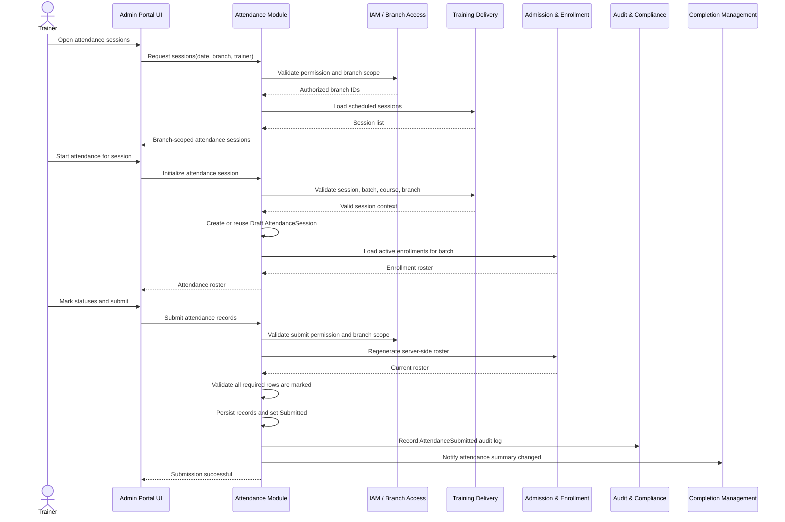
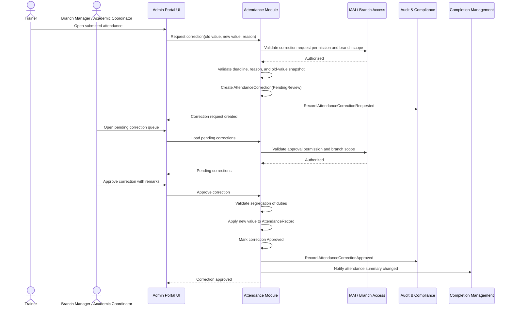
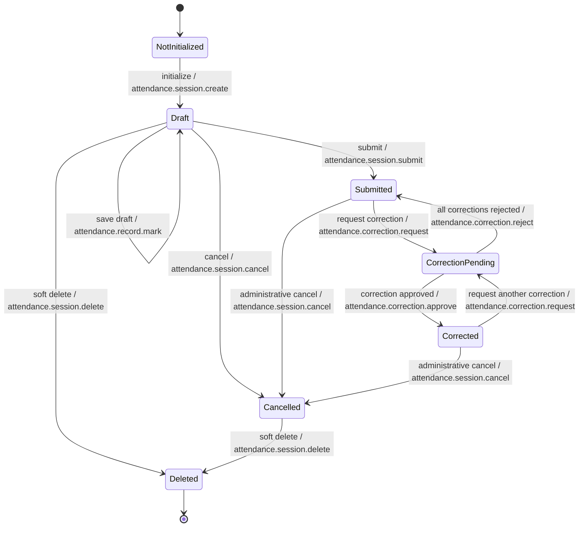
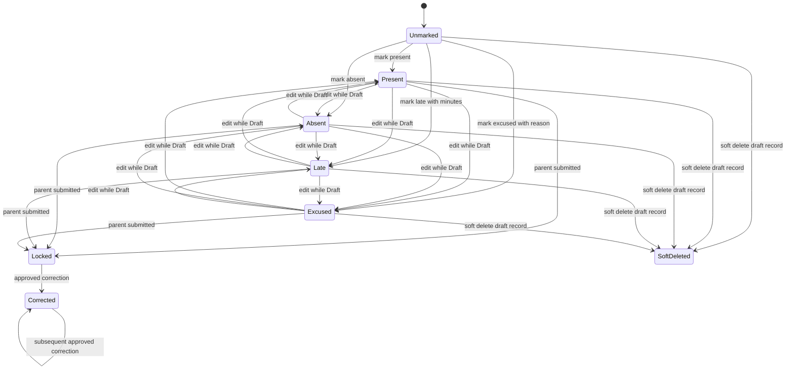
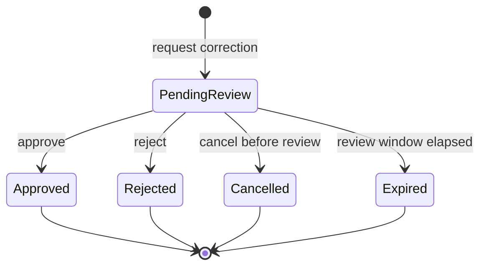
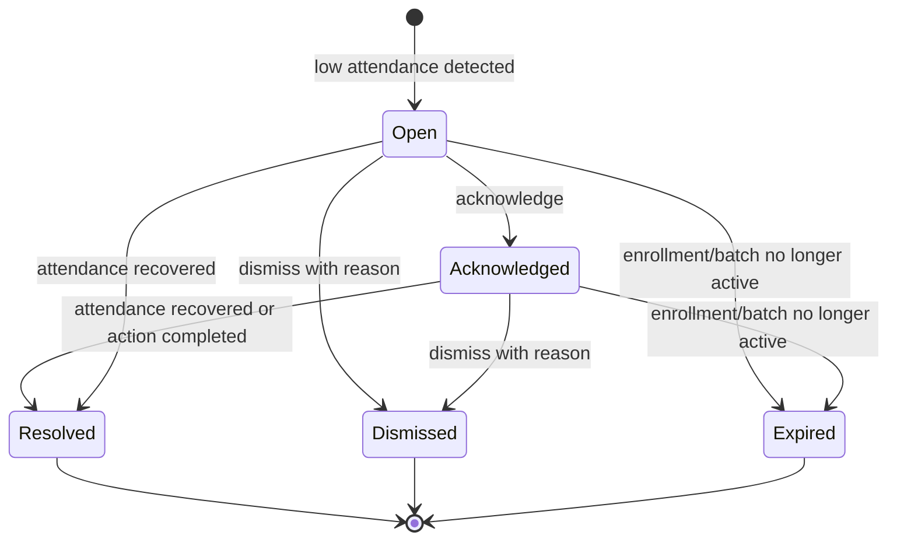
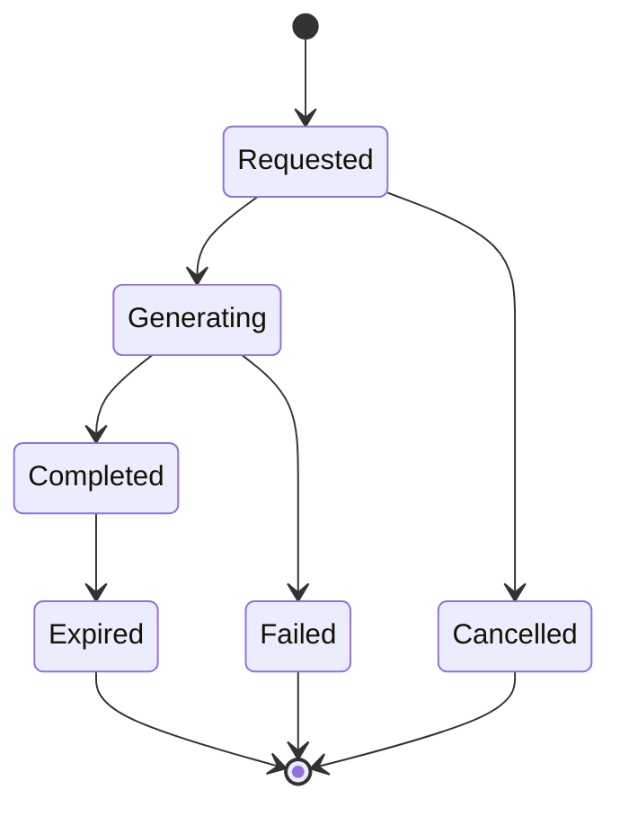

# Part 2 – User Stories, Use Cases, Workflows, State Machines

## Module 08 – Attendance Management

| Attribute       | Value                                                             |
| --------------- | ----------------------------------------------------------------- |
| Product         | ASTI Integrated Institute Management System (IMS)                 |
| Module          | Module 08 – Attendance Management                                 |
| Module Code     | M08-ATT                                                           |
| Bounded Context | Attendance Management                                             |
| Application     | Admin Portal                                                      |
| Architecture    | Next.js TypeScript modular monolith                               |
| Primary Package | `packages/attendance`                                             |
| Primary Actors  | Trainer, Academic Coordinator, Branch Manager, Registrar, Auditor |
| Timezone        | Oman GST, UTC+4                                                   |
| Version         | 1.0                                                               |

---

## 1. Purpose of This Document

This document defines the behavioral requirements for Module 08 – Attendance Management. It translates the functional requirements and business rules into user stories, use cases, workflows, and entity state machines that can guide UI design, API implementation, automated testing, and business validation.

Attendance Management is responsible for creating attendance sessions from scheduled training sessions, generating attendance rosters from active enrollments, marking attendance, submitting final attendance, handling corrections through approvals, calculating attendance percentages, detecting low attendance, and exposing attendance evidence to Completion, Certificate, Reporting, and Audit contexts.

The module must remain aligned with the ASTI IMS domain principles:

- Attendance is recorded against `Enrollment`, not against isolated learner names.
- Every attendance record must trace to `StudentProfile`, `Enrollment`, `Course`, `Batch`, `Session`, and `Branch`.
- Manual attendance is the Phase 1 source of truth.
- Submitted attendance is immutable except through correction workflow.
- Branch isolation is enforced server-side for all reads, writes, exports, corrections, and reports.
- Sensitive actions are audited.
- Soft delete is used; hard delete is not allowed.
- Completion Management consumes attendance percentage and attendance evidence.
- Certificate Management must not compute attendance eligibility directly.

---

## 2. User Stories

### US-M08-ATT-001 – View Sessions Requiring Attendance

**Priority:** Must

**As a** Trainer or Academic Coordinator,  
**I want to** view the sessions for which attendance must be marked within my assigned branch and training responsibility,  
**So that** I can quickly identify pending attendance work without seeing unauthorized branch data.

**Linked Requirements:** FR-M08-ATT-001, FR-M08-ATT-002, FR-M08-ATT-017, FR-M08-ATT-020

**Business Value:** Ensures attendance marking starts from scheduled sessions and respects branch-scoped operational control.

**Acceptance Criteria:**

```gherkin
Feature: Branch-scoped attendance session listing

  Scenario: Trainer views assigned sessions requiring attendance
    Given I am authenticated as a trainer
    And I have the permission "attendance.session.read"
    And I am assigned to Branch B01
    And I am assigned as trainer for Batch BT-001
    When I open the Attendance Sessions list for today
    Then I should see sessions for Batch BT-001 in Branch B01
    And I should see attendance status for each session
    And I should not see sessions from another branch

  Scenario: User attempts to view sessions outside assigned branch
    Given I am authenticated as a trainer
    And I have access only to Branch B01
    When I request attendance sessions for Branch B02
    Then the system should deny the request
    And the system should not return any session data from Branch B02

  Scenario: Branch manager views sessions for managed branch
    Given I am authenticated as a branch manager
    And I have the permission "attendance.session.read"
    And I have access to Branch B01
    When I filter attendance sessions by course and batch
    Then the system should return only matching sessions in Branch B01
```

---

### US-M08-ATT-002 – Initialize Attendance Session

**Priority:** Must

**As a** Trainer or Academic Coordinator,  
**I want to** initialize attendance for a valid scheduled session,  
**So that** attendance can be captured against the correct course, batch, trainer, classroom, and branch.

**Linked Requirements:** FR-M08-ATT-001, FR-M08-ATT-003, FR-M08-ATT-006

**Business Value:** Prevents duplicate or orphan attendance sessions and ensures every attendance entry has a valid scheduled session reference.

**Acceptance Criteria:**

```gherkin
Feature: Attendance session initialization

  Scenario: Initialize attendance for a valid scheduled session
    Given I am authenticated as an academic coordinator
    And I have the permission "attendance.session.create"
    And Session S-001 belongs to an active batch in my branch
    And no active attendance session exists for Session S-001
    When I initialize attendance for Session S-001
    Then the system should create an AttendanceSession in "Draft" status
    And the AttendanceSession should reference the same session, batch, and branch
    And the system should audit "AttendanceSessionCreated"

  Scenario: Prevent duplicate attendance session initialization
    Given an active AttendanceSession already exists for Session S-001
    When I initialize attendance for Session S-001 again
    Then the system should return the existing AttendanceSession
    And the system should not create a duplicate AttendanceSession

  Scenario: Reject initialization for cancelled session
    Given Session S-001 has status "Cancelled"
    When I initialize attendance for Session S-001
    Then the system should reject the request
    And no AttendanceSession should be created
```

---

### US-M08-ATT-003 – Generate Attendance Roster from Enrollment

**Priority:** Must

**As a** Trainer,  
**I want to** see a roster generated from active enrollments in the batch,  
**So that** I mark attendance only for learners who are validly enrolled in the course and batch.

**Linked Requirements:** FR-M08-ATT-003, FR-M08-ATT-004, FR-M08-ATT-016

**Business Value:** Keeps attendance enrollment-centric and avoids manual spreadsheet-based learner lists.

**Acceptance Criteria:**

```gherkin
Feature: Attendance roster generation

  Scenario: Generate roster from active batch enrollments
    Given AttendanceSession AS-001 belongs to Batch BT-001
    And Batch BT-001 has active and confirmed enrollments
    When I open the attendance marking screen
    Then the system should show enrolled students from Batch BT-001
    And each roster row should include student number, student name, enrollment number, attendance status, and remarks
    And cancelled or dropped enrollments should not appear

  Scenario: Include corporate participant after enrollment conversion
    Given a corporate participant has been linked to a StudentProfile
    And the participant has an active Enrollment in Batch BT-001
    When the roster is generated for Batch BT-001
    Then the corporate participant should appear as an enrolled learner
    And the corporate account linkage should remain available for reporting

  Scenario: Prevent manually adding non-enrolled learner to attendance
    Given Person P-001 is not enrolled in Batch BT-001
    When I try to add P-001 to the attendance roster
    Then the system should reject the action
    And the person should not be added to AttendanceRecord
```

---

### US-M08-ATT-004 – Mark Individual Attendance

**Priority:** Must

**As a** Trainer,  
**I want to** mark each learner as Present, Absent, Late, or Excused,  
**So that** ASTI has accurate participation evidence for every training session.

**Linked Requirements:** FR-M08-ATT-004, FR-M08-ATT-006, FR-M08-ATT-007

**Business Value:** Captures session-level learner participation with status-specific validation.

**Acceptance Criteria:**

```gherkin
Feature: Individual attendance marking

  Scenario: Mark learner as present
    Given AttendanceSession AS-001 is in "Draft" status
    And Enrollment ENR-001 belongs to the roster
    When I mark ENR-001 as "Present"
    Then the system should save an AttendanceRecord with status "Present"
    And the record should store markedBy and markedAt

  Scenario: Mark learner as late with late minutes
    Given AttendanceSession AS-001 is in "Draft" status
    And Enrollment ENR-001 belongs to the roster
    When I mark ENR-001 as "Late" with 15 late minutes
    Then the system should save status "Late"
    And the late minutes should be stored as 15

  Scenario: Reject late status without late minutes
    Given AttendanceSession AS-001 is in "Draft" status
    When I mark ENR-001 as "Late" without late minutes
    Then the system should reject the record
    And the system should show that late minutes are required

  Scenario: Reject excused status without reason
    Given AttendanceSession AS-001 is in "Draft" status
    When I mark ENR-001 as "Excused" without an excuse reason
    Then the system should reject the record
    And the system should show that an excuse reason is required
```

---

### US-M08-ATT-005 – Bulk Mark Attendance

**Priority:** Should

**As a** Trainer,  
**I want to** bulk mark multiple students as Present or Absent,  
**So that** I can complete attendance faster for large batches while still applying validations.

**Linked Requirements:** FR-M08-ATT-005, FR-M08-ATT-006

**Business Value:** Reduces repetitive effort and improves speed for common attendance situations.

**Acceptance Criteria:**

```gherkin
Feature: Bulk attendance marking

  Scenario: Bulk mark selected students as present
    Given AttendanceSession AS-001 is in "Draft" status
    And I have selected 20 unmarked roster rows
    When I choose "Mark selected as Present"
    Then the system should mark the selected roster rows as "Present"
    And the system should show the count of updated records

  Scenario: Bulk mark all unmarked students as absent
    Given AttendanceSession AS-001 has 5 unmarked roster rows
    When I choose "Mark unmarked as Absent"
    Then the system should mark the 5 unmarked rows as "Absent"
    And previously marked rows should remain unchanged

  Scenario: Prevent generic bulk late marking
    Given AttendanceSession AS-001 is editable
    When I attempt to bulk mark selected students as "Late" without individual late minutes
    Then the system should reject the bulk action
    And the system should explain that late minutes are required per learner
```

---

### US-M08-ATT-006 – Save Attendance Draft

**Priority:** Must

**As a** Trainer,  
**I want to** save attendance as a draft before final submission,  
**So that** I can continue later without prematurely affecting completion calculations.

**Linked Requirements:** FR-M08-ATT-006, FR-M08-ATT-008

**Business Value:** Supports realistic trainer workflows while keeping final attendance evidence controlled.

**Acceptance Criteria:**

```gherkin
Feature: Save draft attendance

  Scenario: Save incomplete attendance draft
    Given AttendanceSession AS-001 is in "Draft" status
    And I have marked some but not all roster rows
    When I click "Save Draft"
    Then the system should save the marked rows
    And the AttendanceSession should remain in "Draft" status
    And completion calculations should not consume the draft as final attendance

  Scenario: Reopen saved draft
    Given AttendanceSession AS-001 has saved draft records
    When I reopen the attendance screen
    Then the previously saved draft statuses should be displayed
    And I should be able to continue marking remaining rows

  Scenario: Reject draft save with stale version
    Given AttendanceSession AS-001 was updated by another user
    When I submit a draft save using an old version
    Then the system should reject the save
    And the system should instruct me to reload the latest attendance data
```

---

### US-M08-ATT-007 – Submit Final Attendance

**Priority:** Must

**As a** Trainer or Academic Coordinator,  
**I want to** submit final attendance for a session after all required learners are marked,  
**So that** attendance becomes official evidence for completion and reporting.

**Linked Requirements:** FR-M08-ATT-007, FR-M08-ATT-008, FR-M08-ATT-016

**Business Value:** Establishes final, locked attendance evidence and triggers downstream calculations.

**Acceptance Criteria:**

```gherkin
Feature: Final attendance submission

  Scenario: Submit fully marked attendance
    Given AttendanceSession AS-001 is in "Draft" status
    And every required roster learner has a valid attendance status
    When I submit final attendance
    Then the AttendanceSession should move to "Submitted" status
    And attendance records should be locked from direct edit
    And the system should audit "AttendanceSubmitted"

  Scenario: Reject submission when roster row is unmarked
    Given AttendanceSession AS-001 is in "Draft" status
    And one required roster learner has no attendance status
    When I submit final attendance
    Then the system should reject the submission
    And the system should identify the unmarked learner

  Scenario: Detect roster changed before submission
    Given AttendanceSession AS-001 was opened with 10 learners
    And a new enrollment became active for the batch before submission
    When I submit final attendance with only the original 10 learners
    Then the system should reject the submission
    And the system should require the roster to be refreshed
```

---

### US-M08-ATT-008 – Request Attendance Correction

**Priority:** Must

**As a** Trainer or Academic Coordinator,  
**I want to** request a correction to submitted attendance with a reason,  
**So that** mistakes can be corrected without allowing silent edits to official records.

**Linked Requirements:** FR-M08-ATT-009, FR-M08-ATT-010, FR-M08-ATT-015

**Business Value:** Preserves auditability while supporting legitimate correction needs.

**Acceptance Criteria:**

```gherkin
Feature: Attendance correction request

  Scenario: Request correction for submitted attendance
    Given AttendanceSession AS-001 is in "Submitted" status
    And AttendanceRecord AR-001 has status "Absent"
    And I have the permission "attendance.correction.request"
    When I request correction of AR-001 from "Absent" to "Present" with a reason
    Then the system should create an AttendanceCorrection in "PendingReview" status
    And the original AttendanceRecord should remain "Absent"
    And AttendanceSession AS-001 should move to "CorrectionPending"

  Scenario: Reject correction request without reason
    Given AttendanceRecord AR-001 belongs to a submitted attendance session
    When I request a correction without reason code or reason notes
    Then the system should reject the correction request

  Scenario: Reject correction after deadline without override permission
    Given the correction deadline for AttendanceSession AS-001 has expired
    And I do not have "attendance.correction.overrideDeadline"
    When I request an attendance correction
    Then the system should reject the request
```

---

### US-M08-ATT-009 – Approve or Reject Attendance Correction

**Priority:** Must

**As a** Branch Manager or authorized Academic Coordinator,  
**I want to** approve or reject attendance correction requests,  
**So that** official attendance remains accurate and controlled through segregation of duties.

**Linked Requirements:** FR-M08-ATT-010, FR-M08-ATT-015, FR-M08-ATT-018

**Business Value:** Provides management oversight for sensitive post-submission changes.

**Acceptance Criteria:**

```gherkin
Feature: Attendance correction approval

  Scenario: Approve correction request
    Given AttendanceCorrection AC-001 is in "PendingReview" status
    And I have the permission "attendance.correction.approve"
    And I am not the requester of AC-001
    When I approve AC-001 with reviewer remarks
    Then the system should update the related AttendanceRecord to the requested new status
    And AC-001 should move to "Approved"
    And the system should audit "AttendanceCorrectionApproved"

  Scenario: Reject correction request
    Given AttendanceCorrection AC-001 is in "PendingReview" status
    And I have the permission "attendance.correction.reject"
    When I reject AC-001 with reviewer remarks
    Then AC-001 should move to "Rejected"
    And the related AttendanceRecord should remain unchanged

  Scenario: Prevent requester from approving own correction
    Given I requested AttendanceCorrection AC-001
    And segregation of duties is enabled
    When I attempt to approve AC-001
    Then the system should reject the approval
```

---

### US-M08-ATT-010 – View Attendance Percentage and Low Attendance Alerts

**Priority:** Should

**As an** Academic Coordinator or Branch Manager,  
**I want to** view attendance percentages and low attendance indicators per enrollment,  
**So that** I can intervene before learners fail completion criteria.

**Linked Requirements:** FR-M08-ATT-011, FR-M08-ATT-012, FR-M08-ATT-016

**Business Value:** Supports proactive learner management and reduces certificate eligibility disputes.

**Acceptance Criteria:**

```gherkin
Feature: Attendance percentage and low attendance alerts

  Scenario: Calculate attendance percentage from submitted sessions
    Given Enrollment ENR-001 has 10 completed sessions
    And 8 submitted attendance records count as attended
    When I view attendance summary for ENR-001
    Then the system should show attendance percentage as 80.00%

  Scenario: Show low attendance alert
    Given the course completion rule requires minimum attendance of 75.00%
    And Enrollment ENR-001 has calculated attendance of 60.00%
    When I open the batch attendance dashboard
    Then ENR-001 should be flagged as low attendance

  Scenario: Exclude draft attendance from percentage
    Given AttendanceSession AS-001 is still in "Draft" status
    When the system calculates attendance percentage
    Then records from AS-001 should not be counted as final attendance evidence
```

---

### US-M08-ATT-011 – Export Attendance Register

**Priority:** Should

**As a** Branch Manager or Auditor,  
**I want to** export attendance registers and summaries for permitted branches,  
**So that** ASTI can support internal reviews, corporate evidence, and compliance checks.

**Linked Requirements:** FR-M08-ATT-013, FR-M08-ATT-015, FR-M08-ATT-020

**Business Value:** Provides controlled evidence sharing and operational reporting.

**Acceptance Criteria:**

```gherkin
Feature: Attendance export

  Scenario: Export attendance register for one batch
    Given I have the permission "attendance.export"
    And I have access to Branch B01
    When I export attendance for Batch BT-001 in Branch B01
    Then the system should generate the attendance register
    And the export should include student number, enrollment number, session date, status, marked by, and submitted time
    And the export action should be audited

  Scenario: Reject export outside branch access
    Given I have access only to Branch B01
    When I request attendance export for Branch B02
    Then the system should reject the export request

  Scenario: Export corporate attendance evidence
    Given Batch BT-001 includes corporate participants
    When I export corporate attendance evidence
    Then the export should include corporate account reference where available
    And it should not expose unrelated learner PII
```

---

### US-M08-ATT-012 – Audit Attendance Actions

**Priority:** Must

**As an** Auditor or Compliance Officer,  
**I want to** review sensitive attendance actions and changes,  
**So that** ASTI can prove who changed attendance data, what changed, when it changed, and why.

**Linked Requirements:** FR-M08-ATT-015, FR-M08-ATT-018, FR-M08-ATT-021

**Business Value:** Supports compliance, accountability, and dispute resolution.

**Acceptance Criteria:**

```gherkin
Feature: Attendance audit trail

  Scenario: Audit final attendance submission
    Given AttendanceSession AS-001 was submitted by Trainer T-001
    When an auditor views the audit trail for AS-001
    Then the audit trail should show action "AttendanceSubmitted"
    And it should include performedBy, performedAt, entityType, entityId, oldValue, and newValue

  Scenario: Audit correction approval
    Given AttendanceCorrection AC-001 was approved
    When an auditor views the audit trail for the related AttendanceRecord
    Then the audit trail should show old attendance value and new attendance value
    And it should show the approval reason and approving user

  Scenario: Prevent audit record modification
    Given an audit log exists for AttendanceRecord AR-001
    When any user attempts to edit the audit log
    Then the system should reject the modification
```

---

## 3. Use Cases

### UC-M08-ATT-001 – Initialize Attendance Session

| Field             | Description                                                                                                                                                                                                      |
| ----------------- | ---------------------------------------------------------------------------------------------------------------------------------------------------------------------------------------------------------------- |
| Primary Actor     | Trainer or Academic Coordinator                                                                                                                                                                                  |
| Supporting Actors | IAM, Training Delivery, Audit                                                                                                                                                                                    |
| Trigger           | User opens a scheduled session and starts attendance.                                                                                                                                                            |
| Preconditions     | User is authenticated; user has `attendance.session.create`; selected `Session` exists; session is not deleted or cancelled; session belongs to user’s authorized branch; batch and course references are valid. |
| Postconditions    | One active `AttendanceSession` exists for the selected session; status is `Draft`; audit log is created.                                                                                                         |

**Main Success Scenario:**

1. User opens the Attendance Sessions page.
2. System loads sessions using server-side branch scoping.
3. User selects a valid session.
4. System verifies session, batch, course, trainer, classroom, and branch references.
5. System checks whether an active attendance session already exists for the session.
6. If no attendance session exists, system creates `AttendanceSession` with status `Draft`.
7. System stores `createdAt`, `createdBy`, `branchId`, `batchId`, `sessionId`, `version = 1`, `isDeleted = false`.
8. System writes audit action `AttendanceSessionCreated`.
9. System displays attendance marking screen.

**Alternative Flows:**

- **A1 – Existing Attendance Session:** If an active attendance session already exists, system returns the existing session instead of creating a duplicate.
- **A2 – Unauthorized Branch:** If the session branch is outside user branch access, system rejects the request with authorization error.
- **A3 – Cancelled Session:** If the session status is `Cancelled`, system rejects initialization.
- **A4 – Missing Batch or Course:** If session has invalid batch or course reference, system rejects initialization and logs a validation failure.
- **A5 – Soft-Deleted Session:** If the session is soft-deleted, system rejects initialization.

---

### UC-M08-ATT-002 – Generate Attendance Roster

| Field             | Description                                                                                                                                                                 |
| ----------------- | --------------------------------------------------------------------------------------------------------------------------------------------------------------------------- |
| Primary Actor     | Trainer                                                                                                                                                                     |
| Supporting Actors | Admission & Enrollment, Training Delivery, Corporate Training                                                                                                               |
| Trigger           | User opens the attendance marking screen for an attendance session.                                                                                                         |
| Preconditions     | Attendance session exists in `Draft`, `ReturnedForCorrection`, `Submitted`, `CorrectionPending`, or `Corrected`; user has `attendance.record.read`; branch access is valid. |
| Postconditions    | User sees a roster generated from active enrollments and existing attendance records.                                                                                       |

**Main Success Scenario:**

1. User opens attendance session `AS-001`.
2. System loads linked `Session`, `Batch`, `Course`, `Branch`, and `AttendanceSession`.
3. System validates branch access.
4. System queries enrollments for the linked batch and branch.
5. System includes enrollments with status `Confirmed`, `Active`, or qualifying `Completed` records where the session date is before completion date.
6. System excludes `Draft`, `Submitted`, `Cancelled`, `Dropped`, and transferred-out enrollments not effective on the session date.
7. System links each enrollment to `StudentProfile` and `Person` display data.
8. System includes corporate participant linkage where enrollment is corporate.
9. System joins any existing `AttendanceRecord` for each enrollment.
10. System returns roster rows sorted by student number or learner name.

**Alternative Flows:**

- **A1 – Empty Roster:** If no active enrollments exist, system displays empty roster with reason and prevents final submission unless authorized no-roster submission is allowed.
- **A2 – Unauthorized Trainer:** If trainer is not assigned to the session and lacks elevated permission, system denies access.
- **A3 – Enrollment Mismatch:** If existing attendance record references enrollment outside the batch, system flags data integrity issue and excludes the row from editable roster.
- **A4 – Corporate Link Missing:** If corporate participant exists but linked `StudentProfile` is missing, system flags enrollment data issue and prevents marking until corrected by Enrollment Management.

---

### UC-M08-ATT-003 – Mark Individual Attendance Record

| Field             | Description                                                                                                                              |
| ----------------- | ---------------------------------------------------------------------------------------------------------------------------------------- |
| Primary Actor     | Trainer                                                                                                                                  |
| Supporting Actors | Academic Coordinator, Audit                                                                                                              |
| Trigger           | User selects an attendance status for a roster row.                                                                                      |
| Preconditions     | Attendance session is editable; user has `attendance.record.mark`; target enrollment belongs to attendance roster; record is not locked. |
| Postconditions    | Attendance record is saved in draft with status-specific fields validated.                                                               |

**Main Success Scenario:**

1. User selects a roster learner.
2. User chooses attendance status `Present`, `Absent`, `Late`, or `Excused`.
3. If status is `Late`, user enters late minutes.
4. If status is `Excused`, user selects excuse reason and optionally uploads or references evidence.
5. System validates attendance session status is `Draft` or `ReturnedForCorrection`.
6. System validates enrollment belongs to session batch and branch.
7. System validates status-specific fields.
8. System creates or updates `AttendanceRecord` for `attendanceSessionId + enrollmentId`.
9. System stores `studentProfileId`, `status`, `remarks`, `markedAt`, `markedBy`, `version`, `updatedAt`, and `updatedBy`.
10. System displays saved row state.

**Alternative Flows:**

- **A1 – Submitted Session:** If session is already submitted, system rejects direct marking and directs user to correction workflow.
- **A2 – Invalid Status:** If status is not configured active value, system rejects the record.
- **A3 – Late Minutes Missing:** If status is `Late` and late minutes are missing or outside valid bounds, system rejects the row.
- **A4 – Excuse Reason Missing:** If status is `Excused` and reason is missing, system rejects the row.
- **A5 – Optimistic Lock Conflict:** If record version is stale, system rejects update and requests reload.

---

### UC-M08-ATT-004 – Bulk Mark Attendance Records

| Field             | Description                                                                                                     |
| ----------------- | --------------------------------------------------------------------------------------------------------------- |
| Primary Actor     | Trainer                                                                                                         |
| Supporting Actors | Academic Coordinator                                                                                            |
| Trigger           | User selects multiple roster rows and applies a common attendance status.                                       |
| Preconditions     | Attendance session is editable; user has `attendance.record.bulkMark`; selected learners are valid roster rows. |
| Postconditions    | Selected eligible rows are updated; summary of updated, skipped, and failed rows is returned.                   |

**Main Success Scenario:**

1. User selects multiple roster rows or chooses all unmarked rows.
2. User selects bulk action `Mark Present` or `Mark Absent`.
3. System validates user permission and session editability.
4. System resolves selected enrollment IDs from server-side roster.
5. System filters out locked, ineligible, or unauthorized rows.
6. System upserts attendance records in a transaction.
7. System returns result summary.
8. System keeps attendance session in `Draft` until final submission.

**Alternative Flows:**

- **A1 – Bulk Late Without Per-Student Minutes:** System rejects generic bulk late action unless each selected row has late minutes.
- **A2 – Bulk Excused Without Reasons:** System rejects generic bulk excused action unless each selected row has reason values.
- **A3 – Partial Failure:** System applies valid rows and returns failed row details only if transaction mode is configured as partial; otherwise rolls back all changes.
- **A4 – Unauthorized Row:** System skips or rejects records outside branch access.

---

### UC-M08-ATT-005 – Save Draft Attendance

| Field             | Description                                                                                |
| ----------------- | ------------------------------------------------------------------------------------------ |
| Primary Actor     | Trainer                                                                                    |
| Supporting Actors | Academic Coordinator, Audit                                                                |
| Trigger           | User clicks `Save Draft` from attendance marking screen.                                   |
| Preconditions     | Attendance session is in `Draft`; user has marking permission; branch access is valid.     |
| Postconditions    | Draft attendance records are persisted; attendance session remains editable and not final. |

**Main Success Scenario:**

1. User marks one or more roster rows.
2. User clicks `Save Draft`.
3. System validates session version and record versions.
4. System validates every provided row belongs to the roster.
5. System validates status-specific fields for all provided rows.
6. System upserts records in a transaction.
7. System updates attendance session `updatedAt`, `updatedBy`, and `version`.
8. System stores audit action `AttendanceDraftSaved` with changed count.
9. System confirms draft save.

**Alternative Flows:**

- **A1 – Stale Version:** System rejects save if session version has changed.
- **A2 – Invalid Enrollment:** System rejects any row whose enrollment is not in the roster.
- **A3 – Submitted Session:** System rejects draft save if session was submitted by another user.
- **A4 – Validation Failure:** System returns row-level validation errors and does not save invalid records.

---

### UC-M08-ATT-006 – Submit Final Attendance

| Field             | Description                                                                                                                                      |
| ----------------- | ------------------------------------------------------------------------------------------------------------------------------------------------ |
| Primary Actor     | Trainer or Academic Coordinator                                                                                                                  |
| Supporting Actors | Admission & Enrollment, Completion Management, Reporting, Audit                                                                                  |
| Trigger           | User clicks `Submit Attendance`.                                                                                                                 |
| Preconditions     | Attendance session is in `Draft`; user has `attendance.session.submit`; roster has required learners; all required learners have valid statuses. |
| Postconditions    | Attendance session is `Submitted`; records are locked from direct edit; completion/reporting can consume attendance evidence.                    |

**Main Success Scenario:**

1. User reviews all roster rows.
2. User clicks `Submit Attendance`.
3. System reloads attendance session and validates optimistic lock version.
4. System regenerates roster server-side.
5. System compares submitted record list with current required roster.
6. System requires every required roster learner to have a valid status.
7. System validates status-specific fields.
8. System saves final records.
9. System sets `AttendanceSession.status = Submitted`.
10. System stores `submittedAt`, `submittedBy`, `markedAt`, and `markedBy` values where needed.
11. System emits in-process domain event `AttendanceSubmitted`.
12. System writes audit log `AttendanceSubmitted`.
13. System updates attendance percentage projections or invalidates cached summary for recalculation.

**Alternative Flows:**

- **A1 – Unmarked Learner:** System rejects submission and identifies missing roster rows.
- **A2 – Roster Changed:** System rejects submission if server-side roster differs from client payload.
- **A3 – No Roster:** System rejects submission unless authorized no-roster closure is allowed.
- **A4 – Concurrent Submission:** System rejects if another user submitted first.
- **A5 – Invalid Excused Status:** System rejects if excused reason is missing.

---

### UC-M08-ATT-007 – Request Attendance Correction

| Field             | Description                                                                                                                                                        |
| ----------------- | ------------------------------------------------------------------------------------------------------------------------------------------------------------------ |
| Primary Actor     | Trainer or Academic Coordinator                                                                                                                                    |
| Supporting Actors | Branch Manager, Audit                                                                                                                                              |
| Trigger           | User identifies an error in submitted attendance.                                                                                                                  |
| Preconditions     | Attendance session is `Submitted` or `Corrected`; user has `attendance.correction.request`; correction deadline has not expired or override permission is present. |
| Postconditions    | Attendance correction request is created in `PendingReview`; original attendance record remains unchanged.                                                         |

**Main Success Scenario:**

1. User opens a submitted attendance session.
2. User selects an attendance record.
3. User clicks `Request Correction`.
4. User enters new status, reason code, reason notes, and evidence if required.
5. System validates current record value matches requested old value.
6. System validates branch access and correction permission.
7. System validates correction deadline.
8. System creates `AttendanceCorrection` with `PendingReview` status.
9. System stores old and requested new values.
10. System sets parent attendance session status to `CorrectionPending`.
11. System writes audit action `AttendanceCorrectionRequested`.

**Alternative Flows:**

- **A1 – Missing Reason:** System rejects request.
- **A2 – Deadline Expired:** System rejects request unless override permission exists.
- **A3 – Already Pending Correction:** System rejects duplicate pending correction for same record unless previous request is withdrawn or rejected.
- **A4 – Record Changed:** System rejects if old value snapshot does not match current record.
- **A5 – Unauthorized Branch:** System rejects request.

---

### UC-M08-ATT-008 – Approve Attendance Correction

| Field             | Description                                                                                                                                                 |
| ----------------- | ----------------------------------------------------------------------------------------------------------------------------------------------------------- |
| Primary Actor     | Branch Manager or authorized Academic Coordinator                                                                                                           |
| Supporting Actors | Audit, Completion Management, Reporting                                                                                                                     |
| Trigger           | Reviewer opens pending correction queue.                                                                                                                    |
| Preconditions     | Correction request is `PendingReview`; reviewer has `attendance.correction.approve`; reviewer has branch access; segregation of duties rule is satisfied.   |
| Postconditions    | Attendance record is updated; correction is `Approved`; session state is updated; attendance percentages are recalculated or invalidated for recalculation. |

**Main Success Scenario:**

1. Reviewer opens pending correction queue.
2. System lists correction requests in reviewer’s branch scope.
3. Reviewer opens correction details.
4. System displays old value, requested new value, requester, reason, and evidence.
5. Reviewer clicks `Approve` and enters remarks.
6. System validates reviewer permission and segregation-of-duty rule.
7. System validates attendance record still matches old value snapshot.
8. System updates `AttendanceRecord` to approved new value.
9. System sets correction status to `Approved`.
10. System stores `approvedBy`, `approvedAt`, and reviewer remarks.
11. System updates attendance session status to `Corrected` if no pending corrections remain.
12. System writes audit action `AttendanceCorrectionApproved`.
13. System emits recalculation notification inside modular monolith.

**Alternative Flows:**

- **A1 – Same User Approval Blocked:** System rejects approval if requester and approver are same and no override permission exists.
- **A2 – Record No Longer Matches:** System rejects approval if attendance record value changed after request.
- **A3 – Missing Reviewer Remarks:** System rejects approval if remarks are mandatory by configuration.
- **A4 – Unauthorized Branch:** System rejects approval.

---

### UC-M08-ATT-009 – Reject Attendance Correction

| Field             | Description                                                                                                 |
| ----------------- | ----------------------------------------------------------------------------------------------------------- |
| Primary Actor     | Branch Manager or authorized Academic Coordinator                                                           |
| Supporting Actors | Audit                                                                                                       |
| Trigger           | Reviewer decides requested correction is invalid or unsupported.                                            |
| Preconditions     | Correction request is `PendingReview`; reviewer has `attendance.correction.reject`; branch access is valid. |
| Postconditions    | Correction request is `Rejected`; attendance record remains unchanged.                                      |

**Main Success Scenario:**

1. Reviewer opens pending correction request.
2. Reviewer reviews old value, requested new value, reason, and evidence.
3. Reviewer clicks `Reject`.
4. Reviewer enters rejection remarks.
5. System validates permission and branch access.
6. System sets correction status to `Rejected`.
7. System stores `approvedBy`, `approvedAt`, and rejection remarks.
8. System keeps original attendance record unchanged.
9. System sets parent session status to `Submitted` if no pending corrections remain and no approved correction exists, or `Corrected` if prior approved correction exists.
10. System writes audit action `AttendanceCorrectionRejected`.

**Alternative Flows:**

- **A1 – Missing Rejection Remarks:** System rejects action.
- **A2 – Correction Already Reviewed:** System rejects action if correction is already approved, rejected, cancelled, or expired.
- **A3 – Unauthorized Reviewer:** System rejects action.

---

### UC-M08-ATT-010 – Calculate Attendance Percentage

| Field             | Description                                                                                                                            |
| ----------------- | -------------------------------------------------------------------------------------------------------------------------------------- |
| Primary Actor     | Academic Coordinator                                                                                                                   |
| Supporting Actors | Completion Management, Course Catalog, Reporting                                                                                       |
| Trigger           | User views attendance summary or downstream module requests attendance summary for enrollment.                                         |
| Preconditions     | Enrollment exists; user or requesting module has permission and branch access; attendance sessions exist or no sessions have occurred. |
| Postconditions    | Attendance percentage and low attendance indicator are returned.                                                                       |

**Main Success Scenario:**

1. System receives enrollment-level attendance summary request.
2. System validates requesting user or module boundary.
3. System loads enrollment, batch, course, and branch.
4. System loads submitted or corrected attendance records for the enrollment.
5. System excludes draft, cancelled, soft-deleted, and rejected correction records.
6. System determines denominator based on countable sessions.
7. System determines numerator based on statuses that count as attended.
8. System calculates percentage using two decimal precision.
9. System compares result against course completion rule minimum attendance percentage.
10. System returns total sessions, attended sessions, absent sessions, late sessions, excused sessions, percentage, and low attendance flag.

**Alternative Flows:**

- **A1 – No Countable Sessions:** System returns 0 countable sessions and percentage as not applicable or 0.00 based on configured display rule.
- **A2 – Course Rule Missing:** System returns percentage but cannot determine low-attendance threshold until Course Catalog rule is configured.
- **A3 – Unauthorized Access:** System rejects request.

---

### UC-M08-ATT-011 – Export Attendance Register

| Field             | Description                                                                                                                                  |
| ----------------- | -------------------------------------------------------------------------------------------------------------------------------------------- |
| Primary Actor     | Branch Manager, Academic Coordinator, Auditor                                                                                                |
| Supporting Actors | Reporting, Corporate Training, Audit                                                                                                         |
| Trigger           | User requests attendance export for batch, course, branch, student, enrollment, or corporate account.                                        |
| Preconditions     | User has `attendance.export`; requested scope is within branch access; export size is within configured limit or async export is configured. |
| Postconditions    | Export file or export dataset is generated; export action is audited.                                                                        |

**Main Success Scenario:**

1. User opens Attendance Reports.
2. User selects filters for date range, branch, course, batch, session, learner, status, or corporate account.
3. System validates permission and branch access.
4. System queries attendance records with enrollment, student, course, batch, and session details.
5. System excludes soft-deleted records unless audit export permission is present.
6. System generates export with English and Arabic labels where configured.
7. System records audit action `AttendanceExported` with filters and row count.
8. System returns export file to user.

**Alternative Flows:**

- **A1 – Export Too Large:** System rejects synchronous export and requests narrower filters or uses configured background export only if supported by current architecture.
- **A2 – Unauthorized Corporate Account:** System rejects corporate attendance export if account data falls outside branch or permission scope.
- **A3 – No Records:** System returns empty export with headers and audit log.

---

### UC-M08-ATT-012 – View Attendance Audit Trail

| Field             | Description                                                                                    |
| ----------------- | ---------------------------------------------------------------------------------------------- |
| Primary Actor     | Auditor                                                                                        |
| Supporting Actors | Branch Manager, Audit & Compliance                                                             |
| Trigger           | Auditor opens audit view for attendance session, record, correction, export, or user action.   |
| Preconditions     | User has `attendance.audit.read` or `audit.read`; branch access is valid; audit records exist. |
| Postconditions    | Audit trail is displayed without allowing modification.                                        |

**Main Success Scenario:**

1. Auditor searches for attendance session, attendance record, correction request, or learner enrollment.
2. System validates audit permission and branch scope.
3. System loads audit logs for matching attendance entities.
4. System displays action, entity type, entity ID, old value, new value, performed by, performed at, IP address, and reason.
5. System prevents edit or delete actions on audit records.

**Alternative Flows:**

- **A1 – No Audit Records:** System shows no records found.
- **A2 – Restricted Audit Detail:** System masks sensitive fields if user has limited audit permission.
- **A3 – Unauthorized Branch:** System rejects request.

---

## 4. Business Workflows

### 4.1 Workflow WF-M08-ATT-001 – Standard Manual Attendance Submission

**Goal:** Capture final attendance for a scheduled session.

**Structured Workflow:**

1. Training Delivery creates or maintains `Session` for a `Batch`.
2. Trainer or Academic Coordinator opens Attendance Sessions list.
3. System filters sessions by branch access, trainer assignment, date range, and session status.
4. User selects a valid session.
5. System initializes `AttendanceSession` in `Draft` status if it does not already exist.
6. System generates roster from active `Enrollment` records in the session batch.
7. User marks attendance individually or through bulk actions.
8. User saves draft one or more times if required.
9. User submits final attendance.
10. System validates full roster coverage and status-specific fields.
11. System locks attendance by moving session to `Submitted`.
12. System writes audit log.
13. System makes attendance available for attendance summary, completion evaluation, and reporting.

**Mermaid Sequence Diagram:**



---

### 4.2 Workflow WF-M08-ATT-002 – Draft Save and Resume

**Goal:** Allow trainer to save progress without making attendance final.

```text
Trainer opens session
        ↓
System initializes or loads Draft AttendanceSession
        ↓
System generates roster and joins existing draft records
        ↓
Trainer marks some rows
        ↓
Trainer clicks Save Draft
        ↓
System validates row-level data
        ↓
System saves draft records and keeps session status Draft
        ↓
Trainer later reopens the session
        ↓
System shows saved draft values
        ↓
Trainer completes and submits final attendance
```

**Validation Notes:**

- Draft records must not be consumed by Completion Management.
- Draft records must not be exposed as official attendance evidence in certificate readiness checks.
- Draft records may appear in operational pending attendance dashboards.
- Draft save must use optimistic locking to avoid accidental overwrite.

---

### 4.3 Workflow WF-M08-ATT-003 – Attendance Correction Approval

**Goal:** Correct submitted attendance while maintaining immutability and auditability.



---

### 4.4 Workflow WF-M08-ATT-004 – Attendance Percentage Calculation

**Goal:** Produce enrollment-level attendance percentage for operational views and completion evaluation.

**Algorithm:**

1. Accept `enrollmentId`, optional `courseId`, optional `batchId`, and requesting user or internal module context.
2. Load enrollment with branch, course, batch, and student profile.
3. Validate branch access for user-driven request.
4. Query attendance records where:
   - `AttendanceRecord.enrollmentId = enrollmentId`
   - `AttendanceRecord.isDeleted = false`
   - parent `AttendanceSession.status IN ('Submitted', 'Corrected')`
   - parent `AttendanceSession.isDeleted = false`
   - parent `Session.status` is countable for attendance reporting
5. Exclude records from cancelled attendance sessions.
6. Count denominator as all required submitted/corrected session records for the enrollment.
7. Count numerator using configured attendance-counting policy:
   - `Present` counts as attended.
   - `Late` counts as attended unless course or institute configuration defines late penalty.
   - `Excused` counts according to configured course/institute rule; default is count as not attended for percentage but report separately.
   - `Absent` does not count as attended.
8. Calculate:

```text
attendancePercentage = (attendedCount / countableSessionCount) * 100
```

9. Round to two decimal places using standard half-up rounding for display.
10. Compare result with `CourseCompletionRule.minAttendancePercentage`.
11. Return attendance summary object.

**Output Contract:**

```json
{
  "enrollmentId": "ENR-001",
  "studentProfileId": "STU-001",
  "courseId": "CRS-001",
  "batchId": "BAT-001",
  "countableSessionCount": 10,
  "presentCount": 7,
  "lateCount": 1,
  "excusedCount": 1,
  "absentCount": 1,
  "attendedCount": 8,
  "attendancePercentage": 80.0,
  "minimumRequiredPercentage": 75.0,
  "isLowAttendance": false,
  "calculatedAt": "2026-07-04T10:00:00+04:00"
}
```

---

### 4.5 Workflow WF-M08-ATT-005 – Low Attendance Monitoring

**Goal:** Identify students whose attendance is below course completion threshold.

```text
Submitted or corrected attendance changes
        ↓
System recalculates or invalidates attendance summary
        ↓
System loads CourseCompletionRule.minAttendancePercentage
        ↓
System compares calculated attendance percentage
        ↓
If percentage < required minimum
        ↓
Flag enrollment as low attendance in batch dashboard
        ↓
Expose indicator to Academic Coordinator and Branch Manager
        ↓
Completion module uses final value during completion evaluation
```

**Rules:**

- Low attendance is a warning, not an automatic enrollment cancellation.
- Low attendance does not directly block certificate generation; Completion Management evaluates completion eligibility and Certificate Management consumes approved eligibility.
- Draft attendance must not trigger low attendance final alerts.

---

### 4.6 Workflow WF-M08-ATT-006 – Attendance Export

**Goal:** Generate controlled attendance evidence.

```text
Authorized user selects export filters
        ↓
System validates permission attendance.export
        ↓
System validates branch scope server-side
        ↓
System queries attendance records and related enrollment/session metadata
        ↓
System applies PII minimization according to export type
        ↓
System generates file or dataset
        ↓
System records AttendanceExported audit log with filters and row count
        ↓
User downloads export
```

**Export Columns for Batch Attendance Register:**

| Column              | Description                                     |
| ------------------- | ----------------------------------------------- |
| Branch Code         | Branch owning the batch/session.                |
| Course Code         | Course identifier.                              |
| Course Name English | English course name.                            |
| Course Name Arabic  | Arabic course name where configured.            |
| Batch Code          | Batch identifier.                               |
| Session Number      | Session sequence number.                        |
| Session Date        | Oman local date.                                |
| Start Time          | Session start time.                             |
| End Time            | Session end time.                               |
| Student Number      | Student profile number.                         |
| Enrollment Number   | Enrollment identifier.                          |
| Learner Name        | Person full name.                               |
| Corporate Account   | Corporate account name/code where applicable.   |
| Attendance Status   | Present, Absent, Late, or Excused.              |
| Late Minutes        | Late duration when applicable.                  |
| Excuse Reason       | Reason when status is Excused.                  |
| Marked By           | User who marked the record.                     |
| Marked At           | Oman local timestamp.                           |
| Submitted By        | User who submitted attendance session.          |
| Submitted At        | Oman local timestamp.                           |
| Correction Status   | Approved correction indicator where applicable. |

---

## 5. State Machines

The following entities undergo state transitions in Module 08:

1. `AttendanceSession`
2. `AttendanceRecord`
3. `AttendanceCorrection`
4. `AttendanceAlert`
5. `AttendanceExportRequest` if export tracking is persisted

---

## 5.1 AttendanceSession State Machine

### Status Definitions

| Status              | Meaning                                                                  |        Editable |                            Final Evidence | Notes                                                        |
| ------------------- | ------------------------------------------------------------------------ | --------------: | ----------------------------------------: | ------------------------------------------------------------ |
| `NotInitialized`    | No active attendance session exists for the scheduled training session.  |              No |                                        No | Derived state, not necessarily persisted.                    |
| `Draft`             | Attendance session exists and records may be saved but not final.        |             Yes |                                        No | Used for draft save and resume.                              |
| `Submitted`         | Attendance has been validated and finalized.                             |              No |                                       Yes | Direct edits are blocked.                                    |
| `CorrectionPending` | One or more correction requests are pending review.                      | No direct edits | Yes, using current approved record values | Original records remain effective until correction approval. |
| `Corrected`         | One or more corrections were approved and no correction remains pending. |              No |                                       Yes | Corrected values are official.                               |
| `Cancelled`         | Attendance session was cancelled due to valid business reason.           |              No |                                        No | Requires elevated permission and audit reason.               |
| `Deleted`           | Soft-deleted record.                                                     |              No |                                        No | Technical lifecycle state represented by `isDeleted = true`. |

### Mermaid State Diagram



### Transition Rules Matrix – AttendanceSession

| From Status         | To Status           | Trigger                         | Required Permission                  | Guard Conditions                                                                                                            | Audit Action                    |
| ------------------- | ------------------- | ------------------------------- | ------------------------------------ | --------------------------------------------------------------------------------------------------------------------------- | ------------------------------- |
| `NotInitialized`    | `Draft`             | Initialize attendance           | `attendance.session.create`          | Session exists; session not cancelled; branch access valid; no active attendance session exists.                            | `AttendanceSessionCreated`      |
| `Draft`             | `Draft`             | Save draft                      | `attendance.record.mark`             | Session version valid; roster rows valid; status-specific validations pass.                                                 | `AttendanceDraftSaved`          |
| `Draft`             | `Submitted`         | Submit final attendance         | `attendance.session.submit`          | Required roster rows marked; status-specific validations pass; roster unchanged; branch access valid.                       | `AttendanceSubmitted`           |
| `Draft`             | `Cancelled`         | Cancel draft attendance         | `attendance.session.cancel`          | Cancellation reason required; no submitted final evidence exists.                                                           | `AttendanceSessionCancelled`    |
| `Submitted`         | `CorrectionPending` | Request correction              | `attendance.correction.request`      | Correction reason required; deadline valid or override permission present; no duplicate pending correction for same record. | `AttendanceCorrectionRequested` |
| `CorrectionPending` | `Submitted`         | Reject all pending corrections  | `attendance.correction.reject`       | No pending correction remains; no approved correction exists for session.                                                   | `AttendanceCorrectionRejected`  |
| `CorrectionPending` | `Corrected`         | Approve at least one correction | `attendance.correction.approve`      | Reviewer authorized; segregation-of-duty satisfied; old-value snapshot matches current record.                              | `AttendanceCorrectionApproved`  |
| `Corrected`         | `CorrectionPending` | Request additional correction   | `attendance.correction.request`      | Correction reason required; deadline valid or override permission present.                                                  | `AttendanceCorrectionRequested` |
| `Submitted`         | `Cancelled`         | Administrative cancellation     | `attendance.session.cancelSubmitted` | Elevated permission; mandatory reason; cancellation does not violate completion/certificate lock rules.                     | `AttendanceSessionCancelled`    |
| `Corrected`         | `Cancelled`         | Administrative cancellation     | `attendance.session.cancelSubmitted` | Elevated permission; mandatory reason; cancellation does not violate completion/certificate lock rules.                     | `AttendanceSessionCancelled`    |
| `Draft`             | `Deleted`           | Soft delete                     | `attendance.session.delete`          | Record not submitted; reason required.                                                                                      | `AttendanceSessionSoftDeleted`  |
| `Cancelled`         | `Deleted`           | Soft delete cancelled session   | `attendance.session.delete`          | Record already cancelled; reason required.                                                                                  | `AttendanceSessionSoftDeleted`  |

---

## 5.2 AttendanceRecord State Machine

### Status Definitions

| Status        | Meaning                                                                  |                          Counts Toward Attendance | Requires Additional Data                       |
| ------------- | ------------------------------------------------------------------------ | ------------------------------------------------: | ---------------------------------------------- |
| `Unmarked`    | No status selected yet.                                                  |                                                No | None                                           |
| `Present`     | Learner attended the session.                                            |                                               Yes | None                                           |
| `Absent`      | Learner did not attend.                                                  |                                                No | Optional remarks                               |
| `Late`        | Learner attended after start time.                                       |                                    Yes by default | `lateMinutes` required                         |
| `Excused`     | Learner absence or non-standard attendance has approved/recorded excuse. | Configurable; default not attended for percentage | `excuseReasonCode` required                    |
| `Locked`      | Submitted state for record-level editing.                                |                  Uses underlying attendance value | Derived from parent `AttendanceSession` status |
| `Corrected`   | Record value changed through approved correction.                        |                              Uses corrected value | Approved correction reference                  |
| `SoftDeleted` | Record is soft-deleted.                                                  |                                                No | Delete reason and audit                        |

### Mermaid State Diagram



### Transition Rules Matrix – AttendanceRecord

| From Status                               | To Status                 | Trigger                         | Required Permission                                      | Guard Conditions                                                              | Audit Action                                     |
| ----------------------------------------- | ------------------------- | ------------------------------- | -------------------------------------------------------- | ----------------------------------------------------------------------------- | ------------------------------------------------ |
| `Unmarked`                                | `Present`                 | Mark individual or bulk present | `attendance.record.mark` or `attendance.record.bulkMark` | Parent session is `Draft`; enrollment belongs to roster.                      | Optional draft audit or `AttendanceRecordMarked` |
| `Unmarked`                                | `Absent`                  | Mark individual or bulk absent  | `attendance.record.mark` or `attendance.record.bulkMark` | Parent session is `Draft`; enrollment belongs to roster.                      | Optional draft audit or `AttendanceRecordMarked` |
| `Unmarked`                                | `Late`                    | Mark late                       | `attendance.record.mark`                                 | Parent session is `Draft`; late minutes between 1 and session duration.       | Optional draft audit or `AttendanceRecordMarked` |
| `Unmarked`                                | `Excused`                 | Mark excused                    | `attendance.record.mark`                                 | Parent session is `Draft`; excuse reason required.                            | Optional draft audit or `AttendanceRecordMarked` |
| `Present` / `Absent` / `Late` / `Excused` | Another attendance status | Edit draft row                  | `attendance.record.mark`                                 | Parent session is `Draft`; optimistic lock valid; status-specific rules pass. | `AttendanceDraftRecordChanged`                   |
| `Present` / `Absent` / `Late` / `Excused` | `Locked`                  | Parent session submitted        | `attendance.session.submit`                              | All required roster rows valid.                                               | `AttendanceSubmitted`                            |
| `Locked`                                  | `Corrected`               | Approved correction             | `attendance.correction.approve`                          | Correction is pending; reviewer authorized; old-value snapshot matches.       | `AttendanceCorrectionApproved`                   |
| `Corrected`                               | `Corrected`               | Subsequent approved correction  | `attendance.correction.approve`                          | New correction approved; old-value snapshot matches current corrected value.  | `AttendanceCorrectionApproved`                   |
| Draft statuses                            | `SoftDeleted`             | Soft delete record              | `attendance.record.delete`                               | Parent session is `Draft`; reason required.                                   | `AttendanceRecordSoftDeleted`                    |

---

## 5.3 AttendanceCorrection State Machine

### Status Definitions

| Status          | Meaning                                                          |                      Editable | Terminal |
| --------------- | ---------------------------------------------------------------- | ----------------------------: | -------: |
| `PendingReview` | Correction request submitted and waiting for approval/rejection. | Limited reviewer remarks only |       No |
| `Approved`      | Correction accepted and applied to attendance record.            |                            No |      Yes |
| `Rejected`      | Correction denied and attendance record unchanged.               |                            No |      Yes |
| `Cancelled`     | Requester or authorized user cancelled request before review.    |                            No |      Yes |
| `Expired`       | Request was not reviewed within configured review window.        |                            No |      Yes |

### Mermaid State Diagram



### Transition Rules Matrix – AttendanceCorrection

| From Status     | To Status       | Trigger                | Required Permission                             | Guard Conditions                                                                                           | Audit Action                    |
| --------------- | --------------- | ---------------------- | ----------------------------------------------- | ---------------------------------------------------------------------------------------------------------- | ------------------------------- |
| None            | `PendingReview` | Request correction     | `attendance.correction.request`                 | Parent session is submitted/corrected; reason required; deadline valid; branch access valid.               | `AttendanceCorrectionRequested` |
| `PendingReview` | `Approved`      | Approve correction     | `attendance.correction.approve`                 | Reviewer authorized; reviewer is not requester unless override; old-value snapshot matches current record. | `AttendanceCorrectionApproved`  |
| `PendingReview` | `Rejected`      | Reject correction      | `attendance.correction.reject`                  | Reviewer authorized; rejection remarks required.                                                           | `AttendanceCorrectionRejected`  |
| `PendingReview` | `Cancelled`     | Cancel request         | `attendance.correction.cancel`                  | Requester or authorized manager; correction not yet reviewed.                                              | `AttendanceCorrectionCancelled` |
| `PendingReview` | `Expired`       | Expire pending request | `attendance.correction.expire` or system policy | Review window elapsed; no approval/rejection performed.                                                    | `AttendanceCorrectionExpired`   |

---

## 5.4 AttendanceAlert State Machine

### Status Definitions

| Status         | Meaning                                                                                  |
| -------------- | ---------------------------------------------------------------------------------------- |
| `Open`         | Low attendance condition detected and visible to authorized users.                       |
| `Acknowledged` | Coordinator or manager has acknowledged the alert.                                       |
| `Resolved`     | Attendance percentage recovered or issue is closed with valid reason.                    |
| `Dismissed`    | Alert intentionally dismissed by authorized user with reason.                            |
| `Expired`      | Alert no longer relevant because batch completed, enrollment cancelled, or rule changed. |

### Mermaid State Diagram



### Transition Rules Matrix – AttendanceAlert

| From Status             | To Status      | Trigger                              | Required Permission                            | Guard Conditions                                                             | Audit Action                  |
| ----------------------- | -------------- | ------------------------------------ | ---------------------------------------------- | ---------------------------------------------------------------------------- | ----------------------------- |
| None                    | `Open`         | Low attendance detected              | System internal or `attendance.alert.generate` | Submitted/corrected attendance percentage below configured threshold.        | `LowAttendanceDetected`       |
| `Open`                  | `Acknowledged` | Acknowledge alert                    | `attendance.alert.acknowledge`                 | User has branch access; alert is active.                                     | `AttendanceAlertAcknowledged` |
| `Open`                  | `Resolved`     | Attendance recovered                 | System internal                                | Percentage meets threshold or completion decision supersedes alert.          | `AttendanceAlertResolved`     |
| `Acknowledged`          | `Resolved`     | Resolve after intervention           | `attendance.alert.resolve`                     | Resolution remarks required.                                                 | `AttendanceAlertResolved`     |
| `Open`                  | `Dismissed`    | Dismiss alert                        | `attendance.alert.dismiss`                     | Dismissal reason required.                                                   | `AttendanceAlertDismissed`    |
| `Acknowledged`          | `Dismissed`    | Dismiss acknowledged alert           | `attendance.alert.dismiss`                     | Dismissal reason required.                                                   | `AttendanceAlertDismissed`    |
| `Open` / `Acknowledged` | `Expired`      | Enrollment or batch no longer active | System internal                                | Enrollment cancelled/dropped or batch closed and alert no longer actionable. | `AttendanceAlertExpired`      |

---

## 5.5 AttendanceExportRequest State Machine

This state machine applies only if export requests are persisted for audit and operational tracking. For small synchronous exports, the system may still record `AttendanceExported` directly in `AuditLog` without a separate export request table.

### Status Definitions

| Status       | Meaning                                                 |
| ------------ | ------------------------------------------------------- |
| `Requested`  | User requested an export and filters were accepted.     |
| `Generating` | Export file is being generated.                         |
| `Completed`  | Export file or dataset is ready.                        |
| `Failed`     | Export failed due to validation, system, or data issue. |
| `Expired`    | Generated export link has expired.                      |
| `Cancelled`  | Export was cancelled before completion.                 |

### Mermaid State Diagram



### Transition Rules Matrix – AttendanceExportRequest

| From Status  | To Status    | Trigger             | Required Permission        | Guard Conditions                                                        | Audit Action                 |
| ------------ | ------------ | ------------------- | -------------------------- | ----------------------------------------------------------------------- | ---------------------------- |
| None         | `Requested`  | Request export      | `attendance.export`        | Branch scope valid; filters valid; export purpose accepted if required. | `AttendanceExportRequested`  |
| `Requested`  | `Generating` | Start generation    | System internal            | Request accepted and user authorized.                                   | `AttendanceExportGenerating` |
| `Generating` | `Completed`  | Export generated    | System internal            | File generated successfully; row count available.                       | `AttendanceExported`         |
| `Generating` | `Failed`     | Generation failure  | System internal            | Validation, storage, or query error occurred.                           | `AttendanceExportFailed`     |
| `Requested`  | `Cancelled`  | Cancel request      | `attendance.export.cancel` | Request not completed.                                                  | `AttendanceExportCancelled`  |
| `Completed`  | `Expired`    | Link expiry reached | System internal            | Retention window elapsed.                                               | `AttendanceExportExpired`    |

---

## 6. Permission Summary for Workflows and State Transitions

| Permission Code                          | Purpose                                                      | Typical Roles                                                |
| ---------------------------------------- | ------------------------------------------------------------ | ------------------------------------------------------------ |
| `attendance.session.read`                | View attendance sessions.                                    | Trainer, Academic Coordinator, Branch Manager, Auditor       |
| `attendance.session.create`              | Initialize attendance session.                               | Trainer, Academic Coordinator                                |
| `attendance.session.submit`              | Submit final attendance.                                     | Trainer, Academic Coordinator                                |
| `attendance.session.cancel`              | Cancel draft attendance session.                             | Academic Coordinator, Branch Manager                         |
| `attendance.session.cancelSubmitted`     | Cancel submitted/corrected attendance with elevated control. | Branch Manager, System Admin                                 |
| `attendance.record.read`                 | View attendance roster and records.                          | Trainer, Academic Coordinator, Branch Manager, Auditor       |
| `attendance.record.mark`                 | Mark or edit draft attendance.                               | Trainer, Academic Coordinator                                |
| `attendance.record.bulkMark`             | Apply bulk present/absent marking.                           | Trainer, Academic Coordinator                                |
| `attendance.record.delete`               | Soft delete draft attendance record.                         | Academic Coordinator                                         |
| `attendance.correction.request`          | Request correction after submission.                         | Trainer, Academic Coordinator                                |
| `attendance.correction.approve`          | Approve correction request.                                  | Branch Manager, Academic Coordinator with approval authority |
| `attendance.correction.reject`           | Reject correction request.                                   | Branch Manager, Academic Coordinator with approval authority |
| `attendance.correction.cancel`           | Cancel own or managed correction request before review.      | Requester, Branch Manager                                    |
| `attendance.correction.overrideDeadline` | Request correction after configured deadline.                | Branch Manager, System Admin                                 |
| `attendance.alert.read`                  | View low attendance alerts.                                  | Academic Coordinator, Branch Manager                         |
| `attendance.alert.acknowledge`           | Acknowledge low attendance alert.                            | Academic Coordinator, Branch Manager                         |
| `attendance.alert.resolve`               | Resolve low attendance alert.                                | Academic Coordinator, Branch Manager                         |
| `attendance.alert.dismiss`               | Dismiss low attendance alert with reason.                    | Branch Manager                                               |
| `attendance.export`                      | Export attendance registers and summaries.                   | Academic Coordinator, Branch Manager, Auditor                |
| `attendance.export.cancel`               | Cancel pending export request.                               | Requester, Branch Manager                                    |
| `attendance.audit.read`                  | View attendance audit trail.                                 | Auditor, Branch Manager, System Admin                        |
| `attendance.consolidated.read`           | View attendance across multiple assigned branches.           | CEO Dashboard User, Authorized Management, Auditor           |

---

## 7. Cross-Workflow Validation Rules

| Rule ID        | Rule                                                                                                | Applies To                                     |
| -------------- | --------------------------------------------------------------------------------------------------- | ---------------------------------------------- |
| VW-M08-ATT-001 | All attendance reads and writes must validate server-side branch scope.                             | All workflows                                  |
| VW-M08-ATT-002 | Attendance roster must be generated from Enrollment records, not from manually typed learner names. | Roster, Marking, Submission                    |
| VW-M08-ATT-003 | Attendance cannot be submitted until every required roster learner has valid status.                | Submission                                     |
| VW-M08-ATT-004 | Submitted attendance cannot be directly edited.                                                     | Marking, Correction                            |
| VW-M08-ATT-005 | Corrections must store old value, requested new value, reason, requester, reviewer, and timestamps. | Correction                                     |
| VW-M08-ATT-006 | Draft attendance must not be consumed by Completion Management.                                     | Draft, Completion Summary                      |
| VW-M08-ATT-007 | Attendance percentage must be calculated only from submitted or corrected sessions.                 | Summary, Completion                            |
| VW-M08-ATT-008 | Correction approval must validate the old-value snapshot before applying change.                    | Correction Approval                            |
| VW-M08-ATT-009 | Sensitive actions must write immutable audit records.                                               | Submission, Correction, Export, Cancel, Delete |
| VW-M08-ATT-010 | Soft delete must not physically remove attendance records.                                          | Delete, Cancel                                 |
| VW-M08-ATT-011 | Oman timezone UTC+4 must be used for business dates and displayed timestamps.                       | All time-based workflows                       |
| VW-M08-ATT-012 | Bilingual labels must be displayed where configured for course, branch, status, and export headers. | UI, Export                                     |

---

## 8. UI Workflow Screens Implied by This Part

| Screen / View                    | Primary Users                                          | Key Actions                                                                   |
| -------------------------------- | ------------------------------------------------------ | ----------------------------------------------------------------------------- |
| Attendance Sessions List         | Trainer, Academic Coordinator, Branch Manager          | Filter sessions, see status, start attendance, open submitted records.        |
| Attendance Marking Screen        | Trainer, Academic Coordinator                          | Generate roster, mark individual status, bulk mark, save draft, submit final. |
| Attendance Session Detail        | Trainer, Academic Coordinator, Branch Manager, Auditor | View submitted records, session metadata, correction history, audit summary.  |
| Correction Request Dialog        | Trainer, Academic Coordinator                          | Select new status, enter reason, add evidence reference.                      |
| Correction Approval Queue        | Branch Manager, Academic Coordinator                   | Review pending corrections, approve, reject.                                  |
| Attendance Summary by Enrollment | Academic Coordinator, Branch Manager                   | View percentage, status counts, low attendance indicator.                     |
| Low Attendance Dashboard         | Academic Coordinator, Branch Manager                   | View alerts, acknowledge, resolve, dismiss.                                   |
| Attendance Export / Reports      | Branch Manager, Auditor                                | Select filters, export register, audit export action.                         |
| Attendance Audit Trail           | Auditor, Branch Manager                                | View immutable action history.                                                |

---

## 9. Traceability Matrix

| User Story     | Use Cases                      | Primary State Machines                  | Key Permissions                                                 |
| -------------- | ------------------------------ | --------------------------------------- | --------------------------------------------------------------- |
| US-M08-ATT-001 | UC-M08-ATT-001, UC-M08-ATT-002 | AttendanceSession                       | `attendance.session.read`                                       |
| US-M08-ATT-002 | UC-M08-ATT-001                 | AttendanceSession                       | `attendance.session.create`                                     |
| US-M08-ATT-003 | UC-M08-ATT-002                 | AttendanceRecord                        | `attendance.record.read`                                        |
| US-M08-ATT-004 | UC-M08-ATT-003                 | AttendanceRecord                        | `attendance.record.mark`                                        |
| US-M08-ATT-005 | UC-M08-ATT-004                 | AttendanceRecord                        | `attendance.record.bulkMark`                                    |
| US-M08-ATT-006 | UC-M08-ATT-005                 | AttendanceSession, AttendanceRecord     | `attendance.record.mark`                                        |
| US-M08-ATT-007 | UC-M08-ATT-006                 | AttendanceSession, AttendanceRecord     | `attendance.session.submit`                                     |
| US-M08-ATT-008 | UC-M08-ATT-007                 | AttendanceCorrection, AttendanceSession | `attendance.correction.request`                                 |
| US-M08-ATT-009 | UC-M08-ATT-008, UC-M08-ATT-009 | AttendanceCorrection, AttendanceRecord  | `attendance.correction.approve`, `attendance.correction.reject` |
| US-M08-ATT-010 | UC-M08-ATT-010                 | AttendanceAlert                         | `attendance.alert.read`                                         |
| US-M08-ATT-011 | UC-M08-ATT-011                 | AttendanceExportRequest                 | `attendance.export`                                             |
| US-M08-ATT-012 | UC-M08-ATT-012                 | All attendance entities                 | `attendance.audit.read`                                         |

---

## 10. Acceptance Readiness Checklist

| Checklist ID   | Validation Item                                                                | Expected Result                                                        |
| -------------- | ------------------------------------------------------------------------------ | ---------------------------------------------------------------------- |
| AR-M08-ATT-001 | Trainer with branch access can view assigned sessions.                         | Only permitted branch sessions are visible.                            |
| AR-M08-ATT-002 | User without branch access requests another branch.                            | Request is denied server-side.                                         |
| AR-M08-ATT-003 | Attendance initialization is repeated for same session.                        | Existing attendance session is reused; no duplicate is created.        |
| AR-M08-ATT-004 | Roster is generated for a batch with active enrollments.                       | Active enrolled learners appear; cancelled/dropped learners do not.    |
| AR-M08-ATT-005 | Late status is saved without late minutes.                                     | Validation error is returned.                                          |
| AR-M08-ATT-006 | Excused status is saved without reason.                                        | Validation error is returned.                                          |
| AR-M08-ATT-007 | Draft attendance is saved and reopened.                                        | Saved draft values are displayed and remain editable.                  |
| AR-M08-ATT-008 | Final submission is attempted with unmarked roster row.                        | Submission is rejected with row-level message.                         |
| AR-M08-ATT-009 | Submitted record is directly edited.                                           | Direct edit is blocked; correction workflow is required.               |
| AR-M08-ATT-010 | Correction request is submitted with reason.                                   | Correction becomes `PendingReview`; original record remains unchanged. |
| AR-M08-ATT-011 | Correction is approved by authorized reviewer.                                 | Attendance record is updated; audit log is created.                    |
| AR-M08-ATT-012 | Requester attempts to approve own correction when segregation rule is enabled. | Approval is rejected.                                                  |
| AR-M08-ATT-013 | Attendance percentage is calculated.                                           | Only submitted/corrected records are counted.                          |
| AR-M08-ATT-014 | Attendance export is generated.                                                | Export includes branch-scoped rows and audit record.                   |
| AR-M08-ATT-015 | Audit trail is viewed.                                                         | Immutable action history is displayed.                                 |

---

## 11. Implementation Notes for Clean Architecture Alignment

The implementation should keep use cases inside the Attendance application layer and avoid placing business rules directly in React components or database queries.

Recommended package organization:

```text
packages/attendance
 ├── domain
 │   ├── entities
 │   │   ├── AttendanceSession.ts
 │   │   ├── AttendanceRecord.ts
 │   │   ├── AttendanceCorrection.ts
 │   │   └── AttendanceAlert.ts
 │   ├── value-objects
 │   │   ├── AttendanceStatus.ts
 │   │   ├── LateMinutes.ts
 │   │   └── AttendancePercentage.ts
 │   ├── policies
 │   │   ├── AttendanceRosterPolicy.ts
 │   │   ├── AttendanceSubmissionPolicy.ts
 │   │   ├── AttendanceCorrectionPolicy.ts
 │   │   └── AttendancePercentagePolicy.ts
 │   └── events
 │       ├── AttendanceSubmitted.ts
 │       ├── AttendanceCorrectionRequested.ts
 │       ├── AttendanceCorrectionApproved.ts
 │       └── LowAttendanceDetected.ts
 ├── application
 │   ├── use-cases
 │   │   ├── InitializeAttendanceSessionUseCase.ts
 │   │   ├── GenerateAttendanceRosterUseCase.ts
 │   │   ├── MarkAttendanceUseCase.ts
 │   │   ├── SubmitAttendanceUseCase.ts
 │   │   ├── RequestAttendanceCorrectionUseCase.ts
 │   │   ├── ReviewAttendanceCorrectionUseCase.ts
 │   │   ├── CalculateAttendanceSummaryUseCase.ts
 │   │   └── ExportAttendanceRegisterUseCase.ts
 │   └── ports
 │       ├── AttendanceRepository.ts
 │       ├── EnrollmentRosterPort.ts
 │       ├── BranchAccessPort.ts
 │       ├── AuditPort.ts
 │       └── CompletionNotificationPort.ts
 ├── infrastructure
 │   ├── prisma
 │   └── mappers
 └── presentation
     ├── actions
     ├── api
     └── view-models
```

**Rules:**

- UI components call server actions or API routes; they must not perform authority decisions.
- Server-side use cases must enforce branch scope, permission checks, and state transition rules.
- Repositories must default to `isDeleted = false` unless an audit-specific query explicitly includes deleted records.
- Domain events remain in-process for modular monolith implementation.
- No external broker, microservice boundary, CQRS, or event sourcing is required for this module.
