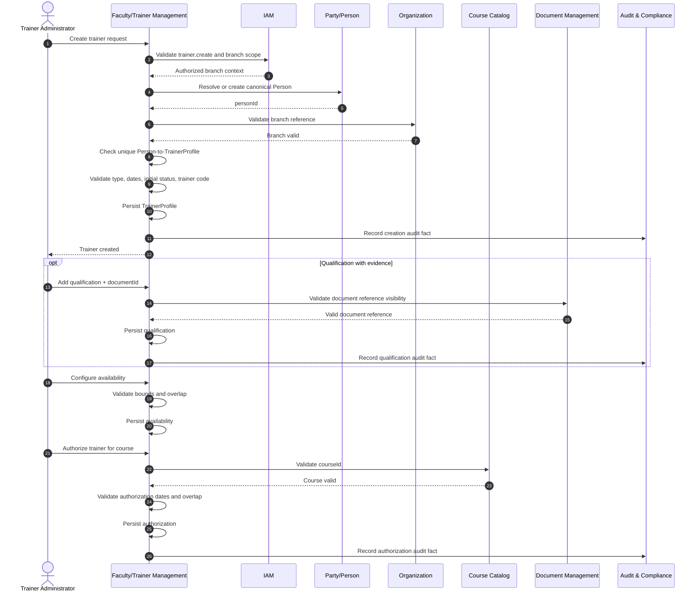
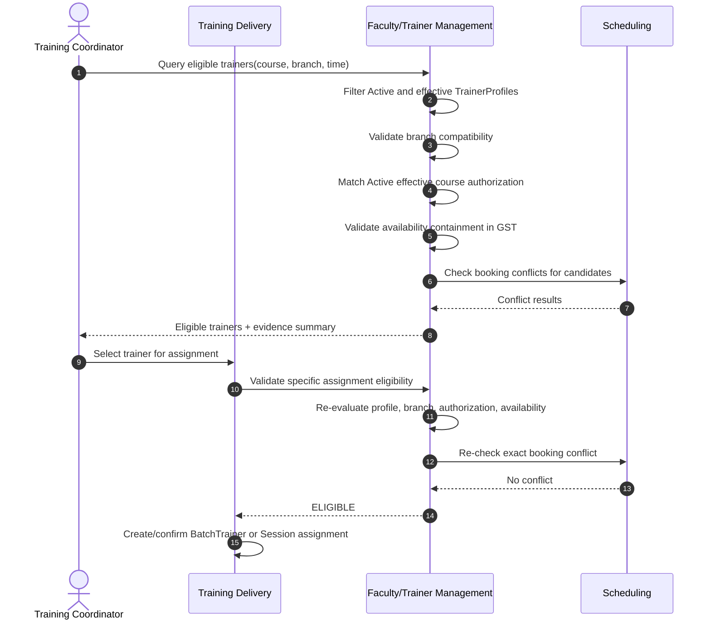
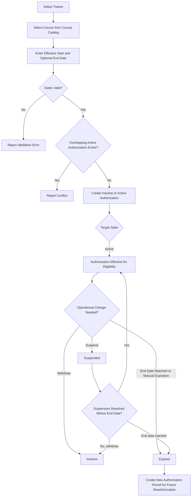
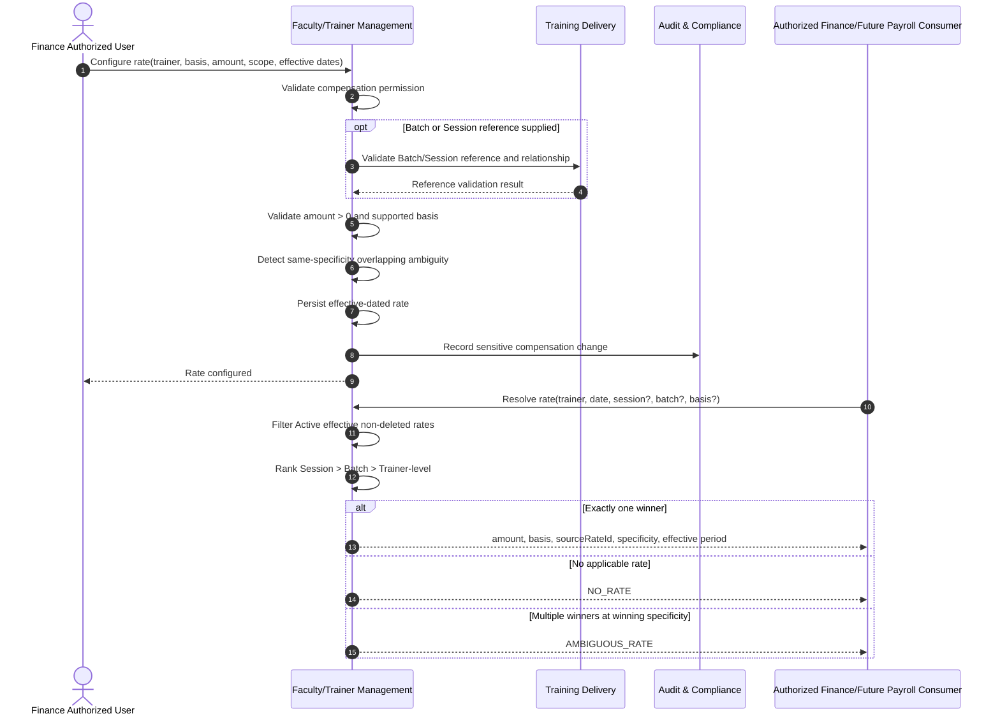
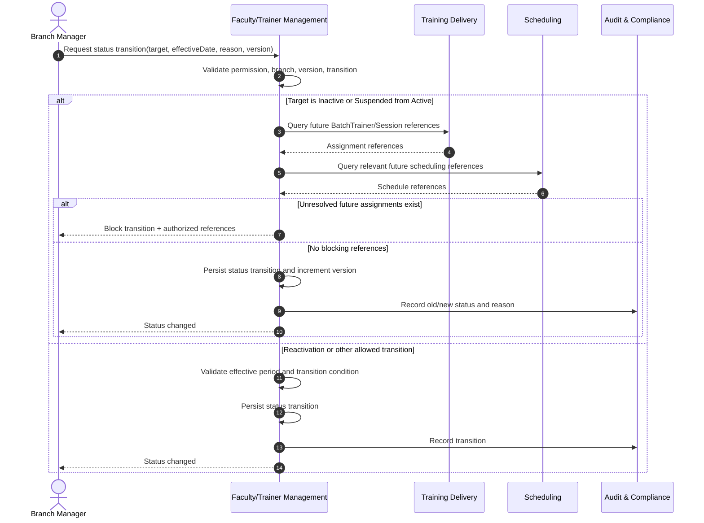
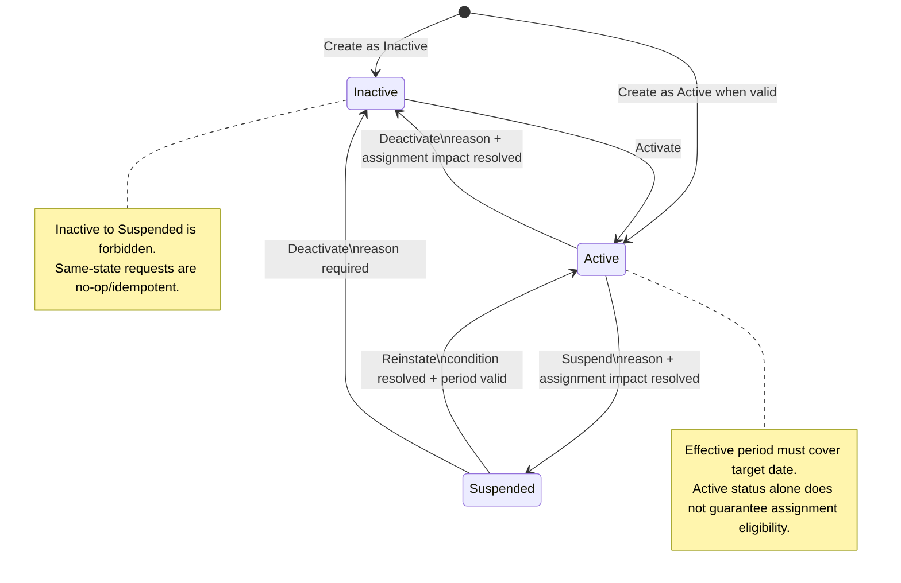
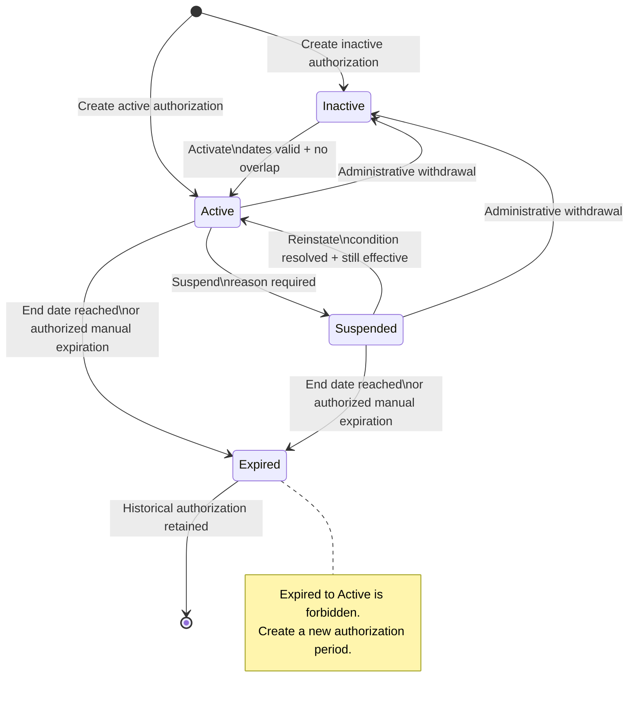

# Part 2 – User Stories, Use Cases, Workflows, State Machines

## Module 09 – Faculty / Trainer Management

**Module Code:** FTM  
**Bounded Context:** Faculty / Trainer Management  
**Architecture Style:** Modular Monolith  
**Primary Timezone:** Oman GST (UTC+4)  
**Identity Model:** Shared Party / Person model  
**Primary Owned Entities:** TrainerProfile, TrainerQualification, TrainerAvailability, TrainerCourseAuthorization, TrainerCompensationRate

---

# 1. Purpose of This Part

This document defines the behavioral requirements of Module 09 – Faculty / Trainer Management. It translates the functional requirements and business rules from Part 1 into user-centered stories, executable acceptance criteria, operational use cases, cross-context workflows, and explicit state transition models.

The module is the authoritative source for trainer operational profiles, qualifications, recurring availability, course authorization, and compensation rate configuration. It does not own Course, Batch, Session, timetable, payroll, Person identity, document verification, or attendance records. Those records remain owned by their respective bounded contexts and are accessed through defined modular-monolith boundaries.

The workflows in this document enforce the following principles:

1. A trainer is a role of a canonical Person and shall not duplicate Person identity data.
2. One Person may have at most one non-deleted TrainerProfile.
3. A trainer must be operationally active and effective on the target date before assignment eligibility can succeed.
4. A trainer must hold an active, effective course authorization before a course-specific assignment is confirmed.
5. Time-bound assignments must be contained within configured availability and pass Scheduling conflict checks.
6. Compensation configuration remains separate from payroll calculation and payment.
7. Every read and write is server-side branch scoped.
8. Sensitive status, authorization, qualification, availability, compensation, export, and deletion actions are auditable.
9. No hard delete is permitted for trainer-owned business records.
10. User-visible dates and times default to Oman GST (UTC+4).

---

# 2. User Stories

## US-FTM-001 – Create a Canonical Trainer Profile

**Priority:** Must  
**Related Requirements:** FR-FTM-002, FR-FTM-018, FR-FTM-019, FR-FTM-020  
**Related Rules:** BR-FTM-001, BR-FTM-002, BR-FTM-003, BR-FTM-004, BR-FTM-007, BR-FTM-009, BR-FTM-033, BR-FTM-034, BR-FTM-038

**User Story**  
As a **Trainer Administrator**, I want to create a trainer profile linked to an existing or newly created canonical Person so that ASTI maintains one authoritative trainer record without duplicating identity information.

### Acceptance Criteria

```gherkin
Feature: Create trainer profile

  Scenario: Create a trainer profile for an existing Person
    Given I am authenticated with the trainer.create permission
    And the target branch is within my writable branch scope
    And the Person exists and is not already linked to a non-deleted TrainerProfile
    When I submit a valid trainer type, branch, specialization, effective start date, and optional effective end date
    Then the system shall create exactly one TrainerProfile linked to that Person
    And the trainer code shall be unique
    And the initial status shall be Active or Inactive
    And the system shall create an audit record
    And the TrainerCreated event shall be published only after the transaction commits successfully

  Scenario: Reject a duplicate trainer profile for the same Person
    Given the Person is already linked to a non-deleted TrainerProfile
    When I attempt to create another TrainerProfile for the same Person
    Then the system shall reject the request with a duplicate trainer profile business error
    And no TrainerProfile shall be created
    And no TrainerCreated event shall be published

  Scenario: Reject creation outside branch scope
    Given I have trainer.create permission
    But the target branch is outside my authorized write scope
    When I submit the trainer creation request
    Then the server shall reject the request
    And no trainer data shall be created or exposed
```

---

## US-FTM-002 – Search and View Trainers Within Authorized Branch Scope

**Priority:** Must  
**Related Requirements:** FR-FTM-001, FR-FTM-003, FR-FTM-015, FR-FTM-019  
**Related Rules:** BR-FTM-026, BR-FTM-032, BR-FTM-034, BR-FTM-035, BR-FTM-036, BR-FTM-044

**User Story**  
As an **Academic Coordinator**, I want to search and view trainer information within my authorized branches so that I can evaluate trainer capacity and suitability without seeing restricted financial or branch-confidential information.

### Acceptance Criteria

```gherkin
Feature: Search and view trainers

  Scenario: Search trainers within authorized branch scope
    Given I am authenticated with trainer.read permission
    And my current branch context is valid
    When I search by trainer code, Person display name, trainer type, status, specialization, or branch
    Then the server shall apply my authorized branch predicates before returning results
    And soft-deleted trainers shall not appear
    And results shall be paginated
    And compensation data shall not be returned unless I also have trainer.compensation.read permission

  Scenario: View a complete trainer profile with section-level permissions
    Given I have trainer.read permission for the trainer's branch
    When I open the trainer detail view
    Then I shall see the trainer profile and authorized Person display fields
    And qualifications shall be shown only when I have trainer.qualification.read
    And availability shall be shown only when I have trainer.availability.read
    And course authorizations shall be shown only when I have trainer.authorization.read
    And compensation rate data shall be shown only when I have trainer.compensation.read

  Scenario: Prevent branch scope expansion through request parameters
    Given my permitted branch set does not include Branch B
    When I submit Branch B as a query parameter or route parameter
    Then the server shall not expand my branch scope
    And no Branch B trainer data shall be returned
```

---

## US-FTM-003 – Maintain Trainer Qualifications and Evidence References

**Priority:** Must  
**Related Requirements:** FR-FTM-006, FR-FTM-016, FR-FTM-018  
**Related Rules:** BR-FTM-011, BR-FTM-012, BR-FTM-031, BR-FTM-033, BR-FTM-041

**User Story**  
As a **Trainer Administrator**, I want to maintain structured trainer qualifications and link them to evidence documents so that ASTI can verify trainer competence and preserve compliance evidence.

### Acceptance Criteria

```gherkin
Feature: Manage trainer qualifications

  Scenario: Add a qualification with evidence reference
    Given I have trainer.qualification.manage permission
    And the trainer is within my authorized branch scope
    And the referenced document exists in Document Management and is visible to me
    When I submit qualification name, institution, completion year, and document reference
    Then the qualification shall be linked to the trainer
    And the document shall remain owned by Document Management
    And an audit record shall be created
    And TrainerQualificationAdded shall be published after commit

  Scenario: Reject a future completion year
    Given the current Oman business calendar year is known by the system
    When I enter a yearCompleted later than that year
    Then the system shall reject the qualification
    And no qualification record shall be created or updated

  Scenario: Remove a qualification without hard deletion
    Given I have trainer.qualification.manage permission
    And the qualification exists
    When I remove the qualification with a valid reason
    Then the system shall soft delete the record
    And deletedAt shall be populated
    And the record shall be excluded from normal qualification queries
    And historical audit evidence shall remain available to authorized auditors
```

---

## US-FTM-004 – Configure Effective Trainer Availability

**Priority:** Must  
**Related Requirements:** FR-FTM-007, FR-FTM-008, FR-FTM-014  
**Related Rules:** BR-FTM-013, BR-FTM-014, BR-FTM-015, BR-FTM-016, BR-FTM-017

**User Story**  
As a **Trainer Administrator**, I want to configure recurring weekly trainer availability by branch and effective period so that Scheduling can determine whether a trainer is available for a proposed session.

### Acceptance Criteria

```gherkin
Feature: Configure trainer availability

  Scenario: Create a valid recurring availability window
    Given I have trainer.availability.manage permission
    And the trainer and target branch are within my authorized scope
    When I create an Active Monday availability from 09:00 to 13:00 effective from 2026-08-01
    Then the system shall store the recurring weekly window
    And weekday evaluation shall use Oman GST
    And TrainerAvailabilityUpdated shall be published after successful commit

  Scenario: Reject an overlapping active availability window
    Given the trainer already has an Active Monday window from 09:00 to 13:00 for the same branch and intersecting effective dates
    When I create another Active Monday window from 12:00 to 15:00 for an intersecting effective period
    Then the system shall reject the request
    And the response shall identify the conflicting availability record

  Scenario: Reject a cross-midnight recurring window
    Given I am creating a recurring availability window
    When I submit startTime 22:00 and endTime 02:00 for one weekday record
    Then the system shall reject the interval because startTime is not earlier than endTime
    And I shall represent the availability using two day-specific records

  Scenario: Validate a proposed schedule interval
    Given an effective Active availability window contains the requested interval
    And the trainer profile is Active and effective for the date
    When Scheduling requests availability validation
    Then the module shall return AVAILABLE with the applicable availability record identifier
    And this module shall not create or change the schedule
```

---

## US-FTM-005 – Authorize a Trainer for a Course

**Priority:** Must  
**Related Requirements:** FR-FTM-009, FR-FTM-010, FR-FTM-013  
**Related Rules:** BR-FTM-018, BR-FTM-019, BR-FTM-020, BR-FTM-021, BR-FTM-022, BR-FTM-040

**User Story**  
As an **Academic Coordinator**, I want to authorize a trainer for a specific course and effective period so that only approved trainers can be assigned to deliver that course.

### Acceptance Criteria

```gherkin
Feature: Manage trainer course authorization

  Scenario: Activate a valid course authorization
    Given I have trainer.authorization.manage permission
    And the trainer is accessible and not soft-deleted
    And the course exists in Course Catalog
    And there is no overlapping Active authorization for the same trainer and course
    When I activate the authorization with a valid effective period
    Then the authorization status shall become Active
    And the authorization shall be immediately usable by eligibility queries after commit
    And TrainerCourseAuthorized shall be published after commit

  Scenario: Reject overlapping active authorization periods
    Given an Active authorization already exists for the trainer and course from 2026-01-01 to 2026-12-31
    When I attempt to create another Active authorization from 2026-06-01 to 2027-05-31
    Then the system shall reject the request because the active effective periods overlap

  Scenario: Treat an authorization as ineffective after its end date
    Given an authorization status field remains Active
    But its effectiveEndDate is before the requested assignment date
    When eligibility is evaluated
    Then the authorization shall be treated as ineffective
    And eligibility shall fail with AUTHORIZATION_EXPIRED

  Scenario: Prevent an expired authorization from being reactivated by rewriting history
    Given the authorization status is Expired
    When I attempt to transition it directly to Active
    Then the system shall reject the transition
    And I shall create a new authorization effective period instead
```

---

## US-FTM-006 – Find Eligible Trainers for a Delivery Slot

**Priority:** Must  
**Related Requirements:** FR-FTM-010, FR-FTM-013, FR-FTM-014  
**Related Rules:** BR-FTM-008, BR-FTM-010, BR-FTM-016, BR-FTM-019, BR-FTM-023, BR-FTM-034

**User Story**  
As a **Training Coordinator**, I want to find trainers who are active, course-authorized, available, branch-compatible, and free from scheduling conflicts so that I can select a valid trainer for a delivery slot.

### Acceptance Criteria

```gherkin
Feature: Query eligible trainers

  Scenario: Return only trainers passing all eligibility checks
    Given I have trainer.eligibility.read permission
    And I request eligible trainers for a valid course, branch, start time, and end time
    When the eligibility query runs
    Then the system shall include only non-deleted trainers with Active effective profiles
    And the trainer shall be branch-compatible
    And the trainer shall have an Active effective authorization for the course
    And the requested interval shall be fully contained within an effective Active availability window
    And Scheduling shall report no trainer booking conflict

  Scenario: Exclude a trainer with a schedule conflict
    Given a trainer passes profile, branch, authorization, and availability checks
    But Scheduling reports an overlapping confirmed booking
    When eligible trainers are queried
    Then that trainer shall not appear in the eligible result set

  Scenario: Return structured ineligibility reasons for direct validation
    Given a specific trainer assignment is being validated
    When multiple eligibility checks fail
    Then the system shall return all safe applicable reason codes
    And the reason codes may include TRAINER_INACTIVE, PROFILE_NOT_EFFECTIVE, BRANCH_MISMATCH, COURSE_NOT_AUTHORIZED, AUTHORIZATION_EXPIRED, NOT_AVAILABLE, and SCHEDULE_CONFLICT
```

---

## US-FTM-007 – Control Trainer Operational Status

**Priority:** Must  
**Related Requirements:** FR-FTM-005, FR-FTM-015, FR-FTM-018  
**Related Rules:** BR-FTM-006, BR-FTM-007, BR-FTM-008, BR-FTM-030, BR-FTM-033

**User Story**  
As a **Branch Manager**, I want to activate, inactivate, or suspend trainers through controlled transitions so that operational assignments never silently depend on trainers who are no longer eligible to deliver training.

### Acceptance Criteria

```gherkin
Feature: Change trainer operational status

  Scenario: Suspend an Active trainer after assignment impact is resolved
    Given I have trainer.status.manage permission
    And the trainer is Active
    And all future confirmed assignments from the suspension effective date have been reassigned or otherwise resolved
    When I suspend the trainer with an effective date and mandatory reason
    Then the trainer status shall become Suspended
    And the reason shall be retained in audit evidence
    And TrainerSuspended and TrainerStatusChanged shall be published after commit

  Scenario: Block suspension when future assignments remain unresolved
    Given the trainer is Active
    And future confirmed assignment references exist on or after the requested effective date
    When I request suspension
    Then the status change shall be blocked
    And the response shall include the blocking assignment references that I am authorized to see

  Scenario: Reject Inactive to Suspended transition
    Given the trainer status is Inactive
    When I request a transition directly to Suspended
    Then the system shall reject the transition
    And the trainer status shall remain Inactive

  Scenario: Reactivate a Suspended trainer
    Given the trainer is Suspended
    And the suspension condition is resolved
    And the profile effective period includes the activation date
    When I activate the trainer
    Then the status shall become Active
    And TrainerActivated and TrainerStatusChanged shall be published after commit
```

---

## US-FTM-008 – Configure Effective-Dated Compensation Rates

**Priority:** Must  
**Related Requirements:** FR-FTM-011, FR-FTM-012, FR-FTM-018  
**Related Rules:** BR-FTM-024, BR-FTM-025, BR-FTM-026, BR-FTM-027, BR-FTM-028, BR-FTM-029

**User Story**  
As a **Finance Authorized User**, I want to configure effective-dated trainer compensation rates at trainer, batch, or session specificity so that downstream finance or future payroll processes can resolve a deterministic remuneration input without performing payroll inside this module.

### Acceptance Criteria

```gherkin
Feature: Configure and resolve compensation rates

  Scenario: Configure a valid batch-specific rate
    Given I have trainer.compensation.manage permission
    And the trainer and referenced batch are valid within permitted scope
    When I submit a positive amount, supported payment basis, valid effective period, and Active status
    Then the rate shall be stored as a batch-specific compensation rate
    And a sensitive audit record shall be created
    And TrainerCompensationRateConfigured shall be published after commit

  Scenario: Reject a non-positive rate
    Given I have compensation management permission
    When I submit an amount equal to or less than zero
    Then the system shall reject the rate
    And no compensation record shall be created or updated

  Scenario: Reject ambiguous overlapping rates at the same specificity
    Given an Active batch-specific Per Session rate already covers the target effective date
    When I create another Active rate for the same trainer, batch, payment basis, and overlapping effective period
    Then the system shall reject the configuration as ambiguous

  Scenario: Resolve the most specific rate
    Given Active effective trainer-level, batch-specific, and session-specific rates exist for the target date
    When an authorized consumer requests rate resolution for that session and batch
    Then the session-specific rate shall be returned
    And the response shall identify the source rate and specificity level
    And no payroll calculation shall occur
```

---

## US-FTM-009 – Validate a Trainer Before Training Delivery Assignment

**Priority:** Must  
**Related Requirements:** FR-FTM-013, FR-FTM-014  
**Related Rules:** BR-FTM-010, BR-FTM-019, BR-FTM-023, BR-FTM-039

**User Story**  
As the **Training Delivery Management system**, I want to validate a trainer before creating or confirming a BatchTrainer or Session assignment so that invalid trainer assignments are prevented without transferring assignment ownership to Trainer Management.

### Acceptance Criteria

```gherkin
Feature: Validate assignment eligibility

  Scenario: Validate an exact time-bound session assignment
    Given a trusted internal Training Delivery call supplies trainer, course, batch, branch, assignment start, and assignment end
    When Trainer Management validates the request
    Then it shall verify profile status and effective period
    And it shall verify branch compatibility
    And it shall verify course authorization
    And it shall verify availability coverage
    And Scheduling shall verify booking conflict
    And the module shall return ELIGIBLE only when every required check passes

  Scenario: Validate a batch-level assignment without an exact time window
    Given Training Delivery requests validation for a batch-level trainer assignment without session timestamps
    When validation runs
    Then profile, branch, and course authorization shall be evaluated
    And availability shall be returned as NOT_EVALUATED
    And Trainer Management shall not create the BatchTrainer record
```

---

## US-FTM-010 – Review Assignment References Before Sensitive Changes

**Priority:** Should  
**Related Requirements:** FR-FTM-005, FR-FTM-015, FR-FTM-016  
**Related Rules:** BR-FTM-030, BR-FTM-039

**User Story**  
As a **Trainer Administrator**, I want to review current and future batch and session references before changing status or deleting a trainer profile so that I can resolve operational dependencies safely.

### Acceptance Criteria

```gherkin
Feature: View assignment references

  Scenario: View trainer assignment references
    Given I have trainer.read permission
    And the trainer is within branch scope
    When I request assignment references for a date range
    Then the module shall query Training Delivery read interfaces
    And return authorized batch and session references
    And it shall not copy or own those assignment records

  Scenario: Block soft deletion with active or future references
    Given a TrainerProfile has active or future BatchTrainer or Session references
    When an authorized user requests TrainerProfile soft deletion
    Then the system shall reject the deletion
    And the TrainerProfile shall remain non-deleted
    And the response shall explain that assignment references must be resolved first
```

---

## US-FTM-011 – Produce Branch-Scoped Trainer Operational Reports

**Priority:** Should  
**Related Requirements:** FR-FTM-017, FR-FTM-019  
**Related Rules:** BR-FTM-026, BR-FTM-034, BR-FTM-036, BR-FTM-044, BR-FTM-045

**User Story**  
As a **Reporting User**, I want to view and export trainer operational reports within my authorized branch scope so that management can analyze trainer roster, qualification coverage, authorization coverage, availability, and utilization safely.

### Acceptance Criteria

```gherkin
Feature: Trainer operational reports

  Scenario: View a branch-scoped authorization coverage report
    Given I have trainer.report.view permission
    When I request authorization coverage for my authorized branch and date range
    Then the server shall restrict data to my permitted branch set
    And the report shall include applied scope and filter metadata
    And English and Arabic Person display values shall be shown when available

  Scenario: Export a consolidated report
    Given I have trainer.report.export permission
    And I have trainer.report.consolidated.view permission
    And I have visibility to the requested branches
    When I export a consolidated trainer report
    Then only authorized branches shall be included
    And the export action shall be audited when the report is classified as sensitive

  Scenario: Protect compensation fields
    Given I can view or export trainer reports
    But I do not have trainer.compensation.read permission
    When the report includes compensation configuration coverage
    Then compensation amounts and protected rate details shall be removed from the result
```

---

## US-FTM-012 – Audit Sensitive Trainer Administration

**Priority:** Must  
**Related Requirements:** FR-FTM-018, FR-FTM-020  
**Related Rules:** BR-FTM-033, BR-FTM-042, BR-FTM-043

**User Story**  
As a **Compliance Auditor**, I want sensitive trainer actions to produce immutable audit evidence so that ASTI can establish who changed what, when, from which branch context, and for what reason.

### Acceptance Criteria

```gherkin
Feature: Audit trainer management actions

  Scenario: Record a successful sensitive change
    Given an authorized user successfully changes a trainer status, authorization, qualification, availability, or compensation record
    When the transaction commits
    Then Audit & Compliance shall receive an audit fact containing entity, action, actor, timestamp, old value, new value, branch context, and reason where required
    And ordinary module users shall not be able to modify the audit record

  Scenario: Do not create false business audit state for a failed authorization attempt
    Given a user is not authorized to perform a sensitive trainer action
    When the action is rejected before business-state mutation
    Then no successful business-change audit entry shall be created
    And the failed access attempt shall be available to security logging according to the security architecture

  Scenario: Publish events only after commit
    Given a trainer state-changing transaction fails and rolls back
    When event dispatch is evaluated
    Then no successful domain event representing the rolled-back change shall be published
```

---

# 3. Use Cases

## UC-FTM-001 – Create Trainer Profile

**Related Requirements:** FR-FTM-002, FR-FTM-018, FR-FTM-019, FR-FTM-020

### Primary Actor
Trainer Administrator

### Supporting System Actors
- Identity & Access Management
- Party / Person capability
- Organization Management
- Configuration / Master Data
- Audit & Compliance

### Preconditions
1. The actor is authenticated.
2. The actor has `trainer.create`.
3. The target branch is within the actor's write-authorized branch scope.
4. An existing Person is selected or valid Person creation data is supplied through the Person-owning boundary.
5. The target Person is not already linked to a non-deleted TrainerProfile.

### Main Success Scenario
1. The actor opens the Create Trainer workflow.
2. The system resolves the authenticated user's writable branch scope.
3. The actor searches for an existing Person or starts canonical Person creation through the shared Party / Person capability.
4. The actor selects the operational branch.
5. The actor enters trainer type, specialization, qualification summary, effective start date, optional effective end date, and desired initial status.
6. The system validates that trainer type is FullTime, PartTime, or Freelance.
7. The system validates that the effective end date is absent or is on or after the effective start date.
8. The system validates that the initial status is Active or Inactive.
9. The system checks the Person-to-TrainerProfile uniqueness rule.
10. The system generates a trainer code from NumberingSeries when configured, or validates a permitted manually supplied code.
11. The system creates TrainerProfile with audit metadata and optimistic version information.
12. Audit & Compliance records the creation action.
13. After successful commit, the module publishes `TrainerCreated` through the in-process modular-monolith integration mechanism.
14. The system returns the created trainer identifier, trainer code, branch, and current operational status.

### Alternative Flows

**A1 – Person already has a TrainerProfile**
1. At Step 9, the uniqueness check finds a non-deleted TrainerProfile.
2. The system rejects creation.
3. The system returns the existing trainer reference when disclosure is allowed by branch authorization; otherwise it returns a non-leaking conflict response.
4. No new trainer is created.

**A2 – Branch outside user scope**
1. At Step 4 or server validation, the target branch is not writable by the actor.
2. The system rejects the request.
3. No data is created and no domain event is published.

**A3 – Invalid effective period**
1. The effective end date precedes the start date.
2. The system returns a field validation error.
3. The actor corrects the dates and resubmits.

**A4 – Duplicate trainer code**
1. The generated or manually submitted trainer code conflicts with an existing non-deleted trainer.
2. For generated codes, the numbering mechanism retries according to its transaction-safe numbering implementation.
3. For manual codes, the request is rejected and the actor must provide a unique permitted code.

**A5 – Concurrent duplicate creation**
1. Two concurrent requests attempt to create profiles for the same Person.
2. The database/application uniqueness constraint permits one successful create.
3. The other request returns a duplicate trainer conflict response.

### Postconditions
1. Exactly one TrainerProfile exists for the Person.
2. The TrainerProfile is linked to the selected branch.
3. Trainer code uniqueness is preserved.
4. Audit evidence exists.
5. `TrainerCreated` is available to in-process consumers only after successful commit.

---

## UC-FTM-002 – Maintain Trainer Qualification

**Related Requirements:** FR-FTM-006, FR-FTM-016, FR-FTM-018

### Primary Actor
Trainer Administrator

### Supporting System Actors
- Document Management
- Audit & Compliance

### Preconditions
1. The actor has `trainer.qualification.manage` for writes.
2. The trainer is within the actor's authorized branch scope.
3. The TrainerProfile is not soft-deleted.

### Main Success Scenario
1. The actor opens the Qualifications section of a trainer profile.
2. The system verifies branch scope and qualification permission.
3. The actor selects Add Qualification.
4. The actor enters qualification name, institution, and year completed.
5. The actor optionally selects an accessible Document Management record as evidence.
6. The system validates non-empty qualification name and institution.
7. The system validates that yearCompleted is a four-digit year not later than the current Oman business calendar year.
8. If documentId is present, the system verifies that the document exists and is visible through the Document Management boundary.
9. The system creates the TrainerQualification record.
10. The system records an audit entry.
11. After successful commit, the module publishes `TrainerQualificationAdded`.
12. The updated qualification list is returned.

### Alternative Flows

**A1 – Future completion year**
1. At Step 7, yearCompleted is later than the current Oman business calendar year.
2. The system rejects the request with a specific year validation error.

**A2 – Invalid or inaccessible document**
1. At Step 8, the document does not exist or is outside permitted access.
2. The system rejects the link operation.
3. No qualification is created with an invalid evidence reference.

**A3 – Update existing qualification**
1. The actor selects an existing qualification.
2. The same validation rules are applied.
3. Version or equivalent concurrency protection is checked where supported.
4. The record is updated, audited, and `TrainerQualificationUpdated` is published after commit.

**A4 – Remove qualification**
1. The actor requests removal with a reason.
2. The system performs a soft delete instead of a physical delete.
3. `isDeleted` is set to true and `deletedAt` is populated.
4. The record is excluded from normal queries but remains available for authorized audit reconstruction.

### Postconditions
1. Qualification information is current and structured.
2. Evidence is referenced, not owned, by Module 09.
3. No hard deletion occurs.
4. All successful write actions are auditable.

---

## UC-FTM-003 – Configure Trainer Availability

**Related Requirements:** FR-FTM-007, FR-FTM-008, FR-FTM-014

### Primary Actor
Trainer Administrator

### Supporting System Actors
- Organization Management
- Audit & Compliance

### Preconditions
1. The actor has `trainer.availability.manage`.
2. The trainer and target branch are within authorized scope.
3. The TrainerProfile is not soft-deleted.

### Main Success Scenario
1. The actor opens the trainer Availability section.
2. The actor selects a weekday from Monday through Sunday.
3. The actor enters start time and end time in Oman GST business-time semantics.
4. The actor selects the branch.
5. The actor enters effective start date and optional effective end date.
6. The actor selects Active status.
7. The system verifies `startTime < endTime`.
8. The system verifies the effective date range.
9. The system finds Active, non-deleted windows for the same trainer, branch, weekday, and intersecting effective period.
10. The system checks whether the proposed time interval duplicates or overlaps any record selected in Step 9.
11. When no conflict exists, the system stores the availability window.
12. The change is audited.
13. After commit, `TrainerAvailabilityUpdated` is published.

### Alternative Flows

**A1 – Invalid daily interval**
1. Start time is equal to or later than end time.
2. The request is rejected.
3. Cross-midnight availability must be represented as two day-specific records.

**A2 – Overlapping active window**
1. The proposed interval overlaps an Active window for the same trainer, branch, weekday, and effective-date intersection.
2. The system rejects the request.
3. The response returns authorized conflict record identifiers and interval information.

**A3 – Exact duplicate**
1. The proposed record exactly duplicates an existing Active window.
2. The system rejects the duplicate rather than creating redundant state.

**A4 – Inactive historical record**
1. An overlapping record exists but is Inactive or outside the effective period.
2. It does not block the new Active availability unless another applicable Active record conflicts.

### Postconditions
1. No ambiguous overlapping Active availability exists for the same trainer, branch, weekday, and effective-period intersection.
2. Scheduling can consume the window for future availability validation.
3. Historical inactive and end-dated records remain available for audit and historical interpretation.

---

## UC-FTM-004 – Manage Course Authorization

**Related Requirements:** FR-FTM-009, FR-FTM-010, FR-FTM-013

### Primary Actor
Academic Coordinator

### Supporting System Actors
- Course Catalog Management
- Audit & Compliance

### Preconditions
1. The actor has `trainer.authorization.manage`.
2. The trainer is accessible and not soft-deleted.
3. The Course reference exists in Course Catalog.

### Main Success Scenario
1. The actor opens the trainer Course Authorizations section.
2. The actor selects an existing Course from the Course Catalog read boundary.
3. The actor enters effective start date and optional effective end date.
4. The actor selects Active status.
5. The system validates the Course reference.
6. The system validates the effective date range.
7. The system searches for overlapping Active authorization periods for the same trainer and course.
8. When no overlap exists, the system persists the authorization.
9. The system records old and new values in audit evidence.
10. After commit, the module publishes `TrainerCourseAuthorized`.
11. Eligibility queries may use the authorization immediately after commit.

### Alternative Flows

**A1 – Course does not exist**
1. Course validation fails at Step 5.
2. The request is rejected without creating a local Course copy.

**A2 – Overlapping Active authorization**
1. Step 7 finds an intersecting Active authorization.
2. The request is rejected with a conflict error.

**A3 – Suspend authorization**
1. The authorization is Active.
2. The actor requests Suspended status and supplies a mandatory reason.
3. The system validates the transition, persists it, and audits the reason.
4. The authorization becomes ineffective for eligibility checks.

**A4 – Authorization reaches end date**
1. The target assignment date is later than effectiveEndDate.
2. The authorization is treated as ineffective even if status normalization has not yet set Expired.
3. Eligibility returns AUTHORIZATION_EXPIRED.

**A5 – Attempt to reactivate Expired authorization**
1. The actor attempts Expired → Active.
2. The system rejects the transition.
3. A new authorization effective period must be created.

### Postconditions
1. The trainer-course authorization history remains temporally interpretable.
2. Eligibility uses only Active, effective authorization periods.
3. Course ownership remains with Course Catalog.

---

## UC-FTM-005 – Query Eligible Trainers for Course and Time Slot

**Related Requirements:** FR-FTM-010, FR-FTM-014

### Primary Actor
Training Coordinator

### Supporting System Actors
- Course Catalog Management
- Scheduling, Calendar & Holiday Management
- Identity & Access Management

### Preconditions
1. The actor has `trainer.eligibility.read`.
2. Course and branch references are valid.
3. Start date-time is earlier than end date-time.
4. The requested branch is within authorized scope.

### Main Success Scenario
1. The actor selects a Course, Branch, start date-time, and end date-time.
2. The system validates branch scope and interval bounds.
3. The system selects non-deleted trainers whose profile status is Active.
4. The system filters trainers whose profile effective period contains the target date.
5. The system applies branch compatibility rules.
6. The system filters to trainers with Active course authorization effective for the target date.
7. The system converts weekday evaluation to Oman GST.
8. The system checks that the full requested interval is contained within an applicable Active availability window.
9. For candidates passing Module 09 checks, the system asks Scheduling to evaluate trainer booking overlap.
10. The system excludes candidates with Scheduling conflicts.
11. The result is sorted by exact branch match and then trainerCode unless a separately approved ranking rule exists.
12. The system returns eligible trainers with authorization and availability evidence summaries.

### Alternative Flows

**A1 – Invalid interval**
1. End date-time is not later than start date-time.
2. The query is rejected with INVALID_INTERVAL.

**A2 – No eligible trainers**
1. Every candidate fails one or more checks.
2. The system returns an empty eligible list.
3. It may return aggregate exclusion reason counts without exposing unauthorized personal data.

**A3 – Scheduling boundary unavailable**
1. The Scheduling conflict check cannot produce a reliable answer.
2. The system shall not represent unchecked candidates as fully ELIGIBLE for a time-bound slot.
3. The response returns a dependency/validation-unavailable outcome according to application error handling standards.

### Postconditions
1. The result is read-only.
2. No trainer reservation, BatchTrainer assignment, or Session assignment is created.
3. No out-of-scope trainer is returned.

---

## UC-FTM-006 – Validate Specific Trainer Assignment

**Related Requirements:** FR-FTM-013, FR-FTM-014

### Primary Actor
Training Delivery Management system

### Supporting System Actors
- Scheduling, Calendar & Holiday Management

### Preconditions
1. The request originates from a trusted internal module boundary or an authorized user flow.
2. Training Delivery supplies trainerId, courseId, batchId, branchId, assignment start/end when known, and assignment role.

### Main Success Scenario
1. Training Delivery submits the assignment validation request.
2. Module 09 verifies that the TrainerProfile exists and is not soft-deleted.
3. Module 09 verifies that status is Active.
4. Module 09 verifies that the profile effective period covers the assignment date.
5. Module 09 verifies branch compatibility.
6. Module 09 verifies Active course authorization across the required assignment period.
7. For a time-bound assignment, Module 09 verifies availability containment.
8. For a time-bound assignment, Scheduling verifies no trainer booking conflict.
9. Module 09 aggregates all safe failed checks.
10. When no required check fails, Module 09 returns `ELIGIBLE`.
11. Training Delivery may then create or confirm its own BatchTrainer or Session assignment record.

### Alternative Flows

**A1 – Batch-level assignment without exact session time**
1. No exact assignment start/end interval is supplied.
2. Module 09 validates profile, effective period, branch compatibility, and course authorization.
3. Availability is returned as `NOT_EVALUATED`.
4. Session-level time validation is deferred until session scheduling.

**A2 – Multiple failed checks**
1. The trainer is Inactive and lacks valid authorization.
2. The response includes both `TRAINER_INACTIVE` and the applicable authorization reason.
3. No assignment mutation occurs in Module 09.

**A3 – Scheduling conflict**
1. All Module 09-owned checks pass.
2. Scheduling reports a conflict.
3. The result is `NOT_ELIGIBLE` with `SCHEDULE_CONFLICT`.

### Postconditions
1. Trainer Management has not created or changed BatchTrainer or Session records.
2. Training Delivery receives a deterministic eligibility result and reason set.

---

## UC-FTM-007 – Change Trainer Operational Status

**Related Requirements:** FR-FTM-005, FR-FTM-015, FR-FTM-018, FR-FTM-020

### Primary Actor
Branch Manager

### Supporting System Actors
- Training Delivery Management
- Scheduling, Calendar & Holiday Management
- Audit & Compliance

### Preconditions
1. The actor has `trainer.status.manage`.
2. The trainer is within writable branch scope.
3. The actor supplies the current optimistic version.
4. The requested transition is listed as allowed in the TrainerProfile state machine.

### Main Success Scenario – Active to Suspended
1. The actor opens the trainer status action.
2. The actor selects Suspended.
3. The actor provides effective date and mandatory reason.
4. The server verifies branch access and current version.
5. The domain verifies Active → Suspended is allowed.
6. The module queries Training Delivery and Scheduling read boundaries for future confirmed assignment references from the effective date onward.
7. No unresolved future assignment blocks the transition.
8. The status is changed to Suspended.
9. Version and audit metadata are updated.
10. Audit & Compliance records old status, new status, actor, effective date, and reason.
11. After commit, `TrainerSuspended` and `TrainerStatusChanged` are published.

### Alternative Flows

**A1 – Blocking future assignments**
1. At Step 6, future confirmed assignments exist.
2. The transition is rejected.
3. Authorized assignment references are returned for resolution.

**A2 – Stale version**
1. The supplied version does not match the persisted version.
2. The request is rejected as a concurrency conflict.
3. The actor must reload current state before resubmission.

**A3 – Invalid transition**
1. The current status is Inactive and target is Suspended.
2. The transition is rejected.
3. State remains unchanged.

**A4 – Reactivation outside effective period**
1. Current status is Suspended and target is Active.
2. The activation date is outside the TrainerProfile effective period.
3. The transition is rejected until valid temporal data is provided.

### Postconditions
1. Status changes only through valid state transitions.
2. Operational impact is checked before deactivation or suspension.
3. Successful transitions are audited and evented after commit.

---

## UC-FTM-008 – Configure Compensation Rate

**Related Requirements:** FR-FTM-011, FR-FTM-012, FR-FTM-018

### Primary Actor
Finance Authorized User

### Supporting System Actors
- Training Delivery Management
- Audit & Compliance

### Preconditions
1. The actor has `trainer.compensation.manage`.
2. The trainer is accessible within permitted branch scope.
3. Referenced Batch or Session exists when supplied.

### Main Success Scenario
1. The actor opens Compensation Rates for the trainer.
2. The system performs separate compensation permission authorization.
3. The actor selects payment basis: Per Hour, Per Session, Per Student, or Fixed.
4. The actor enters an amount greater than zero.
5. The actor optionally selects Batch and/or Session specificity.
6. The actor enters effective start date, optional effective end date, status, and remarks.
7. The system validates the referenced Session and Batch relationship when both are supplied.
8. The system validates the amount and supported payment basis.
9. The system validates the effective date range.
10. The system checks for ambiguous overlapping Active rates at the same specificity for the same trainer and payment basis.
11. With no ambiguity, the system stores the rate.
12. A sensitive audit entry is recorded.
13. After commit, `TrainerCompensationRateConfigured` is published.

### Alternative Flows

**A1 – Invalid amount**
1. Amount is zero, negative, or outside configured financial precision bounds.
2. The request is rejected.

**A2 – Invalid session/batch relation**
1. sessionId does not belong to batchId when both are supplied.
2. The request is rejected.

**A3 – Same-specificity ambiguity**
1. An overlapping Active rate already exists at the same specificity and payment basis.
2. The request is rejected with an ambiguity conflict.

**A4 – Different specificity exists**
1. A trainer-level rate exists and a valid non-overlapping or more-specific batch/session rate is configured.
2. The configuration may be accepted because resolution precedence is deterministic.

### Postconditions
1. The compensation configuration is effective-dated and auditable.
2. No payroll amount is calculated or paid by this module.
3. Compensation data remains protected by separate read/manage permissions.

---

## UC-FTM-009 – Resolve Applicable Compensation Rate

**Related Requirements:** FR-FTM-012

### Primary Actor
Authorized internal Finance consumer

### Preconditions
1. The caller has `trainer.compensation.read` or trusted internal finance authorization.
2. Trainer and target date are valid.

### Main Success Scenario
1. The caller provides trainerId, targetDate, optional sessionId, optional batchId, and optional paymentBasis.
2. The module selects Active, non-deleted rates effective on targetDate.
3. The module filters by trainerId.
4. The module applies paymentBasis filter when supplied.
5. The module ranks exact session-specific matches first.
6. When no session-specific winner exists, it ranks exact batch-specific matches second.
7. When no batch-specific winner exists, it evaluates trainer-level rates where both batchId and sessionId are null.
8. Exactly one winning rate is found.
9. The module returns amount, payment basis, source rate identifier, specificity level, and effective period.

### Alternative Flows

**A1 – No rate**
1. No applicable rate exists at any supported specificity.
2. The module returns `NO_RATE`.

**A2 – Ambiguous winning specificity**
1. More than one Active applicable rate exists at the winning specificity for the same payment basis and target date.
2. The module returns `AMBIGUOUS_RATE`.
3. The module does not select a rate nondeterministically.

### Postconditions
1. Resolution is deterministic.
2. No payroll calculation, payroll approval, payslip generation, or payment occurs.

---

## UC-FTM-010 – Soft Delete or Deactivate Trainer-Owned Record

**Related Requirements:** FR-FTM-016, FR-FTM-018

### Primary Actor
Trainer Administrator or entity-specific authorized manager

### Supporting System Actors
- Training Delivery Management
- Audit & Compliance

### Preconditions
1. The actor has the manage permission required for the target entity type.
2. The target record is within authorized branch scope.
3. A deletion or deactivation reason is supplied where required.

### Main Success Scenario
1. The actor requests removal or deactivation of a trainer-owned record.
2. The system resolves entity type and applicable management permission.
3. The system checks branch scope.
4. The system checks active references and historical interpretation requirements.
5. For effective-dated child records where history must remain operationally meaningful, the system prefers Inactive status or end dating.
6. When soft deletion is allowed, the system sets `isDeleted=true` and populates `deletedAt`.
7. The system retains the physical row.
8. The system records actor, action, old/new values, and reason in audit evidence.
9. The record is excluded from normal search, eligibility, and resolution queries.

### Alternative Flows

**A1 – TrainerProfile has active or future assignments**
1. Training Delivery reports active or future BatchTrainer or Session references.
2. TrainerProfile soft deletion is blocked.
3. The actor must resolve the references before retrying.

**A2 – Unauthorized entity-specific delete**
1. The actor has generic trainer read access but lacks the manage permission for the target child entity.
2. The request is rejected.

**A3 – Record already soft-deleted**
1. The record is already soft-deleted.
2. The system returns an idempotent or already-deleted outcome according to application API conventions.
3. No duplicate business-state event is created.

### Postconditions
1. No hard deletion has occurred.
2. Historical evidence remains available to authorized audit processes.
3. Normal operational queries exclude soft-deleted records.

---

# 4. Business Workflows

## WF-FTM-001 – Trainer Onboarding and Readiness Workflow

### Objective
Create a trainer from the canonical Person model and progressively establish the operational data required for assignment readiness.

### Structured Workflow

```text
Authorized Trainer Administrator
        |
        v
Search Canonical Person
        |
        +---- Person exists ----> Reuse Person
        |
        +---- Person absent ----> Create Person through Party/Person boundary
                                      |
                                      v
                              Canonical Person Created
        |
        v
Check Existing TrainerProfile
        |
        +---- Exists ----> Stop duplicate creation; open existing trainer
        |
        +---- Does not exist
                    |
                    v
            Create TrainerProfile
                    |
                    v
            Add Qualifications
                    |
                    +---- Optional evidence ----> Link Document reference
                    |
                    v
            Configure Availability
                    |
                    v
            Configure Course Authorizations
                    |
                    v
            Configure Compensation Rate, when authorized and applicable
                    |
                    v
            Activate TrainerProfile when readiness and effective-date rules pass
                    |
                    v
            Trainer can participate in eligibility queries
```

### Mermaid Sequence Diagram



### Workflow Invariants
1. Person identity is resolved before TrainerProfile creation.
2. TrainerProfile creation fails if a non-deleted profile already exists for the Person.
3. Course authorization stores a Course reference only.
4. Qualification evidence stores a Document reference only.
5. Activation does not bypass effective date checks.

---

## WF-FTM-002 – Trainer Eligibility Search and Assignment Validation Workflow

### Objective
Return eligible trainers for a proposed delivery slot and validate a selected trainer before Training Delivery creates its assignment.



### Validation Order
1. Authentication/internal trust and branch authorization.
2. Trainer exists and is not soft-deleted.
3. TrainerProfile status is Active.
4. TrainerProfile effective period covers the target assignment date.
5. Branch compatibility passes.
6. Active course authorization covers the required date or assignment period.
7. For exact time-bound assignment, availability fully contains the requested interval.
8. Scheduling reports no overlapping booking conflict.
9. Only then is the result `ELIGIBLE`.

### Important Boundary Rule
Module 09 returns eligibility evidence but never creates `BatchTrainer` or `Session` assignments. Training Delivery owns those records.

---

## WF-FTM-003 – Availability Configuration and Scheduling Validation Workflow

### Objective
Maintain recurring availability while allowing Scheduling to validate a concrete proposed session.

```text
Trainer Administrator
        |
        v
Submit weekday + startTime + endTime + branch + effective dates
        |
        v
Validate branch scope
        |
        v
Validate weekday enum
        |
        v
Validate startTime < endTime
        |
        v
Validate effectiveStartDate <= effectiveEndDate, when end exists
        |
        v
Find same trainer + branch + weekday records with intersecting effective periods
        |
        v
Check Active window time overlap
        |
        +---- Conflict ----> Reject and return conflict reference
        |
        +---- No conflict
                   |
                   v
             Save Availability
                   |
                   v
             Audit Change
                   |
                   v
             Publish TrainerAvailabilityUpdated after commit

Later: Scheduling proposes exact session
        |
        v
FTM converts date/day evaluation to Oman GST
        |
        v
Find Active effective window matching branch and weekday
        |
        v
Check requested interval fully contained in window
        |
        +---- No ----> NOT_AVAILABLE / NO_WINDOW / OUTSIDE_WINDOW
        |
        +---- Yes ---> AVAILABLE + availabilityRecordId
        |
        v
Scheduling separately checks double-booking and timetable conflicts
```

### Availability Decision Codes

| Code | Meaning |
|---|---|
| AVAILABLE | A valid effective Active availability window fully contains the requested interval. |
| NO_WINDOW | No applicable availability window exists for the branch, weekday, and effective date. |
| OUTSIDE_WINDOW | An applicable window exists, but the requested interval is not fully contained within it. |
| INACTIVE_TRAINER | TrainerProfile is not Active for the requested date. |
| BRANCH_MISMATCH | Trainer is not compatible with the requested branch under branch policy. |
| INVALID_INTERVAL | Requested end is not later than requested start. |

---

## WF-FTM-004 – Course Authorization Lifecycle Workflow

### Objective
Create and manage time-bounded trainer authorization to deliver a Course.



### Workflow Rules
1. Active authorization periods for the same trainer and Course may not overlap.
2. Expired authorization history is immutable as history; future authorization requires a new effective period.
3. Course authorization does not grant application access.
4. Course definitions remain owned by Course Catalog.
5. Effective-date evaluation overrides a stale Active status after effectiveEndDate.

---

## WF-FTM-005 – Compensation Rate Configuration and Resolution Workflow

### Objective
Maintain non-ambiguous effective compensation inputs and resolve the most specific rate.



### Resolution Algorithm

```text
Input: trainerId, targetDate, optional sessionId, optional batchId, optional paymentBasis

1. Select TrainerCompensationRate rows where:
   - trainerId matches;
   - status = Active;
   - isDeleted = false;
   - effectiveStartDate <= targetDate;
   - effectiveEndDate is null or targetDate <= effectiveEndDate.

2. If paymentBasis is supplied, retain only matching basis rows.

3. Build specificity groups:
   A. SESSION_SPECIFIC: sessionId exactly matches the requested session.
   B. BATCH_SPECIFIC: batchId exactly matches requested batch and sessionId is null.
   C. TRAINER_LEVEL: batchId is null and sessionId is null.

4. Evaluate groups in order A, then B, then C.

5. At the first group containing applicable rows:
   - one applicable row for the requested basis => return it;
   - multiple applicable rows at the winning specificity for the same basis/date => AMBIGUOUS_RATE.

6. If no group contains an applicable row => NO_RATE.
```

### Boundary Rule
The resolved rate is an input for downstream authorized processes. Module 09 does not calculate payroll, approve payroll, generate payslips, create bank files, or make payments.

---

## WF-FTM-006 – Trainer Status Change with Operational Impact Check

### Objective
Prevent status changes from silently invalidating future training delivery.



### Operational Impact Rules
1. Active → Suspended requires a reason and resolution of future assignments.
2. Active → Inactive requires a reason and resolution of future assignments.
3. Suspended → Active requires the suspension condition to be resolved and profile effective period to be valid.
4. Suspended → Inactive requires a reason.
5. Inactive → Suspended is not allowed.
6. Same-state requests are treated as idempotent/no-op state changes and do not emit duplicate status-change events.

---

## WF-FTM-007 – Soft Delete and Deactivation Workflow

### Objective
Preserve historical integrity while removing records from normal operational use.

```text
Authorized User Requests Removal
        |
        v
Resolve Entity Type and Required Manage Permission
        |
        v
Enforce Branch Scope
        |
        v
Check Active References and Historical Interpretation Needs
        |
        +---- TrainerProfile has active/future assignments
        |           |
        |           v
        |      BLOCK SOFT DELETE
        |      Return resolvable references
        |
        +---- Effective-dated child record should remain interpretable
        |           |
        |           v
        |      Prefer Inactive status or effective end dating
        |
        +---- Soft delete allowed
                    |
                    v
           Set isDeleted = true
           Set deletedAt
           Preserve physical row
                    |
                    v
           Record Audit Evidence
                    |
                    v
           Exclude from Normal Search, Eligibility, and Resolution Queries
```

### Entity Handling Guidance

| Entity | Preferred Removal Behavior |
|---|---|
| TrainerProfile | Inactivate when operationally appropriate; soft delete only when no active/future assignment references exist and business rules permit. |
| TrainerQualification | Soft delete when removal is required; preserve audit evidence. |
| TrainerAvailability | Prefer Inactive status or end dating for historical interpretation; soft delete where explicitly allowed. |
| TrainerCourseAuthorization | Prefer Inactive, Suspended, or Expired state according to business reason; preserve authorization history. |
| TrainerCompensationRate | Prefer Inactive status or end dating; compensation history remains restricted and auditable. |

---

# 5. State Machines

## 5.1 TrainerProfile Operational Status State Machine

### States

| State | Meaning |
|---|---|
| Inactive | The trainer profile exists but the trainer is not currently eligible for operational assignment. |
| Active | The trainer may participate in assignment eligibility evaluation, subject to effective dates, branch compatibility, course authorization, availability, and Scheduling checks. |
| Suspended | The trainer is temporarily prohibited from operational assignment until the suspension condition is resolved or the profile is moved to Inactive. |

### Mermaid State Diagram



### Transition Rules Matrix

| From | To | Allowed | Permission Required | Mandatory Conditions | Failure Result |
|---|---|---:|---|---|---|
| Initial | Inactive | Yes | `trainer.create` | Valid branch, Person uniqueness, valid type, valid effective period. | Creation rejected. |
| Initial | Active | Yes | `trainer.create` | Valid branch, Person uniqueness, valid type, effective period supports activation date. | Creation rejected. |
| Initial | Suspended | No | Not applicable | Suspended is not a valid initial state. | `INVALID_INITIAL_STATUS` |
| Inactive | Active | Yes | `trainer.status.manage` | Effective period valid; no blocking integrity issue. | `TRANSITION_PRECONDITION_FAILED` |
| Inactive | Suspended | No | Not applicable | Trainer must first become Active. | `INVALID_STATUS_TRANSITION` |
| Active | Inactive | Yes | `trainer.status.manage` | Reason required; future assignments from effective date onward must be resolved. | `BLOCKING_FUTURE_ASSIGNMENTS` or `REASON_REQUIRED` |
| Active | Suspended | Yes | `trainer.status.manage` | Reason required; future assignments from effective date onward must be resolved. | `BLOCKING_FUTURE_ASSIGNMENTS` or `REASON_REQUIRED` |
| Suspended | Active | Yes | `trainer.status.manage` | Suspension condition resolved; effective period valid. | `TRANSITION_PRECONDITION_FAILED` |
| Suspended | Inactive | Yes | `trainer.status.manage` | Reason required. | `REASON_REQUIRED` |
| Active | Active | No state change | `trainer.status.manage` | Treated as idempotent/no-op if no other mutable data changes. | Current state returned; no duplicate status event. |
| Inactive | Inactive | No state change | `trainer.status.manage` | Treated as idempotent/no-op. | Current state returned; no duplicate status event. |
| Suspended | Suspended | No state change | `trainer.status.manage` | Treated as idempotent/no-op. | Current state returned; no duplicate status event. |

### Additional Effective-State Rules
1. `Active` status is necessary but not sufficient for assignment eligibility.
2. A trainer cannot be considered active before `effectiveStartDate`.
3. A trainer cannot be considered effective after `effectiveEndDate` when an end date exists.
4. Soft-deleted TrainerProfiles are excluded from operational eligibility regardless of stored status.
5. Status change writes use optimistic concurrency control.
6. Successful status changes are audited with old value, new value, actor, timestamp, branch context, and reason where required.

---

## 5.2 TrainerCourseAuthorization State Machine

### States

| State | Meaning |
|---|---|
| Inactive | Authorization record exists but does not currently permit course-specific assignment. |
| Active | Trainer is authorized for the Course during the applicable effective period. |
| Suspended | Authorization is temporarily withheld and cannot satisfy assignment eligibility. |
| Expired | Authorization has ended and is historical; future authorization requires a new effective period. |

### Mermaid State Diagram



### Transition Rules Matrix

| From | To | Allowed | Permission Required | Mandatory Conditions | Eligibility Effect |
|---|---|---:|---|---|---|
| Initial | Inactive | Yes | `trainer.authorization.manage` | Valid trainer, valid Course reference, valid dates. | Not eligible through this authorization. |
| Initial | Active | Yes | `trainer.authorization.manage` | Valid trainer, valid Course, valid dates, no overlapping Active authorization. | Eligible when target date is within effective period and other trainer checks pass. |
| Inactive | Active | Yes | `trainer.authorization.manage` | Effective dates valid; no overlapping Active authorization for same trainer/Course. | Becomes usable after successful commit. |
| Active | Suspended | Yes | `trainer.authorization.manage` | Reason required. | Immediately ineffective for eligibility. |
| Active | Inactive | Yes | `trainer.authorization.manage` | Administrative withdrawal decision. | Ineffective for eligibility. |
| Active | Expired | Yes | `trainer.authorization.manage` for manual expiration; automatic temporal evaluation requires no user permission | Effective end reached or authorized manual expiration; reason required for manual expiration. | Ineffective for eligibility. |
| Suspended | Active | Yes | `trainer.authorization.manage` | Suspension condition resolved and effective period still includes target activation date. | Usable for eligibility again. |
| Suspended | Inactive | Yes | `trainer.authorization.manage` | Administrative withdrawal. | Ineffective for eligibility. |
| Suspended | Expired | Yes | `trainer.authorization.manage` for manual expiration; automatic temporal evaluation requires no user permission | End date reached or authorized manual expiration. | Ineffective for eligibility. |
| Expired | Active | No | Not applicable | Historical authorization may not be rewritten into a new active period. | New authorization record required. |

### Effective-State Evaluation Rules

```text
Authorization is effective for assignment only when all are true:

1. record.isDeleted = false;
2. status = Active;
3. effectiveStartDate <= assignmentDate;
4. effectiveEndDate is null OR assignmentDate <= effectiveEndDate;
5. TrainerProfile is Active and effective;
6. requested courseId matches authorization.courseId;
7. branch and availability checks pass where applicable;
8. Scheduling conflict validation passes for exact time-bound assignment.
```

An authorization whose `effectiveEndDate` has passed is ineffective even when the persisted status has not yet been normalized from Active to Expired.

---

# 6. Effective-Dated Activation Controls for Non-State-Machine Records

TrainerAvailability and TrainerCompensationRate use `Active` / `Inactive` controls together with effective dates. Part 1 does not define broader domain lifecycle transitions for these records, so this document does not invent additional lifecycle states.

## 6.1 TrainerAvailability Operational Effectiveness

An availability record participates in validation only when:

```text
isDeleted = false
AND status = Active
AND effectiveStartDate <= targetDate
AND (effectiveEndDate is null OR targetDate <= effectiveEndDate)
AND branchId matches required branch
AND dayOfWeek matches target day in Oman GST
AND requestedStart >= startTime
AND requestedEnd <= endTime
```

Changing availability from Active to Inactive, or end-dating it, requires `trainer.availability.manage` and produces an auditable change. Availability deactivation does not cancel or modify Schedule records; Scheduling owns timetable records.

## 6.2 TrainerCompensationRate Operational Effectiveness

A compensation rate participates in resolution only when:

```text
isDeleted = false
AND status = Active
AND effectiveStartDate <= targetDate
AND (effectiveEndDate is null OR targetDate <= effectiveEndDate)
AND trainerId matches
AND optional paymentBasis filter matches
```

Compensation rate activation/deactivation requires `trainer.compensation.manage`. Rate amounts remain protected by `trainer.compensation.read`, and deactivation does not perform payroll recalculation.

---

# 7. Use Case to Requirement Traceability Matrix

| Use Case | Primary FR Coverage | Primary Business Rules |
|---|---|---|
| UC-FTM-001 Create Trainer Profile | FR-FTM-002, FR-FTM-018, FR-FTM-019, FR-FTM-020 | BR-FTM-001–010, BR-FTM-033–038 |
| UC-FTM-002 Maintain Trainer Qualification | FR-FTM-006, FR-FTM-016, FR-FTM-018 | BR-FTM-011, BR-FTM-012, BR-FTM-031–033, BR-FTM-041 |
| UC-FTM-003 Configure Trainer Availability | FR-FTM-007, FR-FTM-008, FR-FTM-014 | BR-FTM-013–017, BR-FTM-023 |
| UC-FTM-004 Manage Course Authorization | FR-FTM-009, FR-FTM-010, FR-FTM-013 | BR-FTM-018–023, BR-FTM-040 |
| UC-FTM-005 Query Eligible Trainers | FR-FTM-010, FR-FTM-014, FR-FTM-019 | BR-FTM-008, BR-FTM-010, BR-FTM-016–023, BR-FTM-034–036 |
| UC-FTM-006 Validate Specific Assignment | FR-FTM-013, FR-FTM-014 | BR-FTM-010, BR-FTM-016, BR-FTM-019, BR-FTM-023, BR-FTM-039 |
| UC-FTM-007 Change Trainer Status | FR-FTM-005, FR-FTM-015, FR-FTM-018, FR-FTM-020 | BR-FTM-006–010, BR-FTM-030, BR-FTM-033, BR-FTM-037, BR-FTM-042 |
| UC-FTM-008 Configure Compensation Rate | FR-FTM-011, FR-FTM-018 | BR-FTM-024–029, BR-FTM-033 |
| UC-FTM-009 Resolve Compensation Rate | FR-FTM-012 | BR-FTM-026–029, BR-FTM-032 |
| UC-FTM-010 Soft Delete or Deactivate Record | FR-FTM-016, FR-FTM-018 | BR-FTM-030–033 |

---

# 8. Workflow Ownership and Cross-Context Interaction Summary

| Workflow Concern | Module 09 Responsibility | Other Owning Context Responsibility |
|---|---|---|
| Trainer identity | Reference canonical Person; prevent duplicate TrainerProfile per Person. | Party / Person owns identity lifecycle and localized names. |
| Branch authorization | Apply server-side branch predicates to every read/write. | IAM owns UserBranchAccess; Organization owns Branch hierarchy. |
| Course authorization | Own TrainerCourseAuthorization and its lifecycle. | Course Catalog owns Course definitions. |
| Trainer assignment | Validate eligibility and expose reference views. | Training Delivery owns BatchTrainer and Session assignment records. |
| Time availability | Own recurring TrainerAvailability and containment validation. | Scheduling owns double-booking, timetable, classroom, holiday, and venue-block conflict rules. |
| Qualification evidence | Own structured qualification and document reference. | Document Management owns document metadata, verification, and expiry workflow. |
| Compensation configuration | Own effective rate structures and deterministic rate resolution. | Future Payroll owns payroll calculation and payment; Finance owns financial transactions within its domain. |
| Completion recommendation reference | Provide valid trainer reference. | Exam & Completion owns recommendation, result, completion evaluation, and approval. |
| Reporting source data | Provide governed trainer data and read contracts. | Reporting & Dashboards owns dashboard/report definitions and presentation. |
| Audit facts | Produce sensitive change facts. | Audit & Compliance owns immutable audit records and approval history capability. |

---

# 9. Final Behavioral Invariants

1. No workflow may create a second non-deleted TrainerProfile for the same Person.
2. No workflow may use generic `trainer.read` permission to expose compensation amounts.
3. No workflow may trust client-supplied branchId as authorization evidence.
4. No time-bound assignment may be declared fully eligible without exact availability containment and Scheduling conflict validation.
5. No course-specific assignment may be confirmed without Active effective TrainerCourseAuthorization.
6. No expired authorization may be reactivated by modifying historical state; a new effective period is required.
7. No TrainerProfile may be soft-deleted while active or future BatchTrainer or Session references exist.
8. No trainer-owned business record may be physically hard deleted.
9. No compensation rate resolver may choose nondeterministically when multiple winning rates exist at the same specificity.
10. No successful state-change event may be published before the corresponding business transaction commits.
11. No Module 09 workflow may create or mutate Course, Batch, Session, timetable, Document verification, Attendance, payroll, or Certificate records.
12. All user-visible trainer dates and times default to Oman GST (UTC+4), and weekday availability evaluation is performed in that business timezone.
