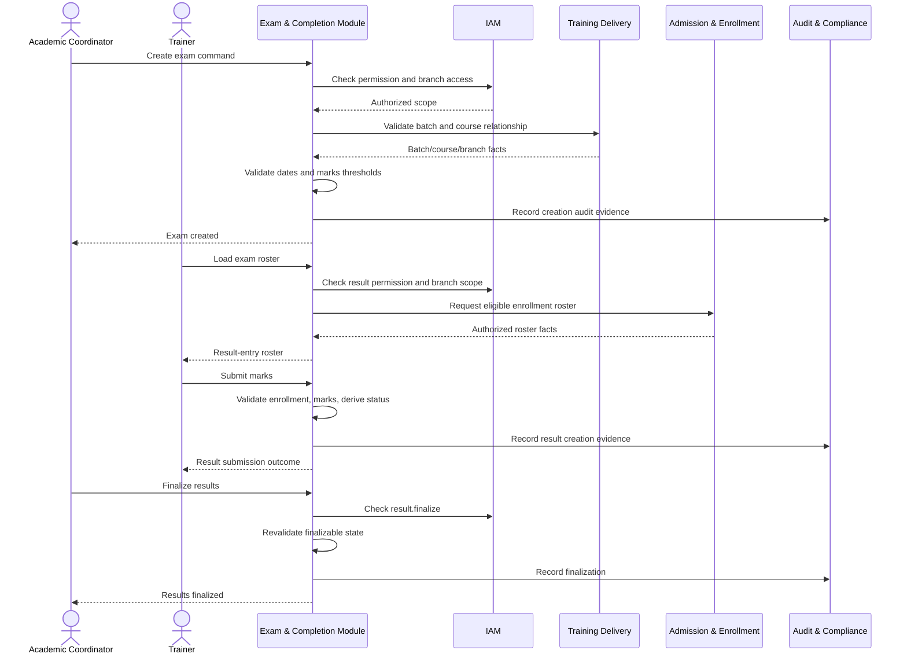
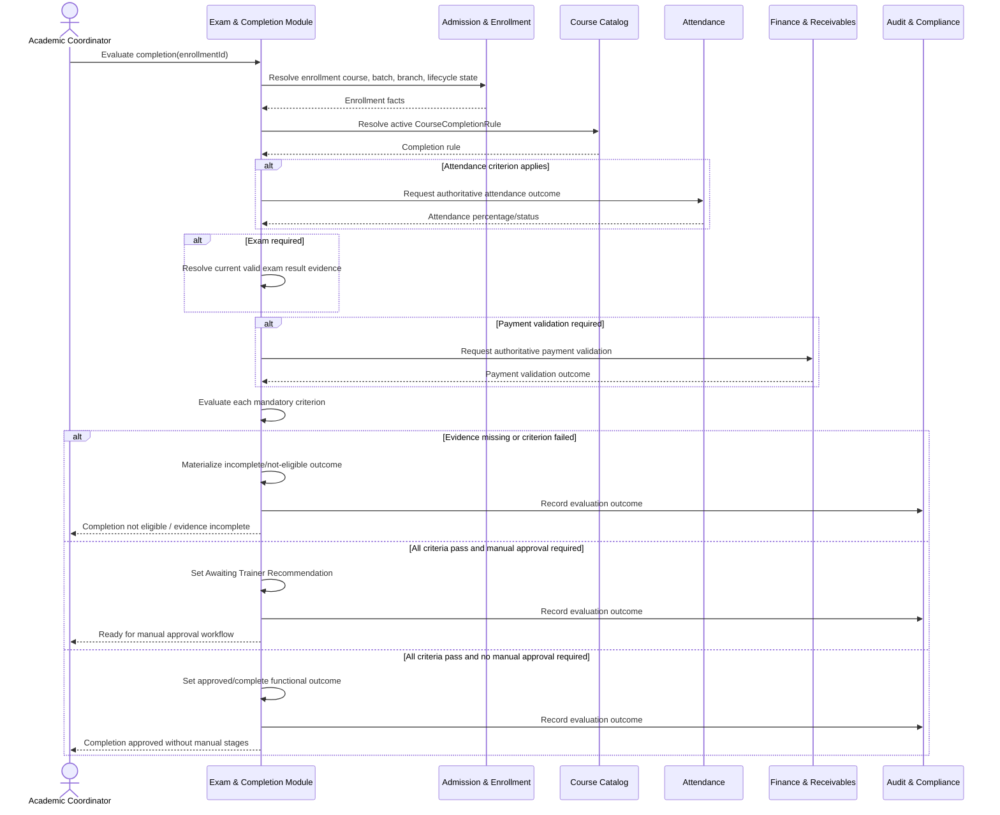
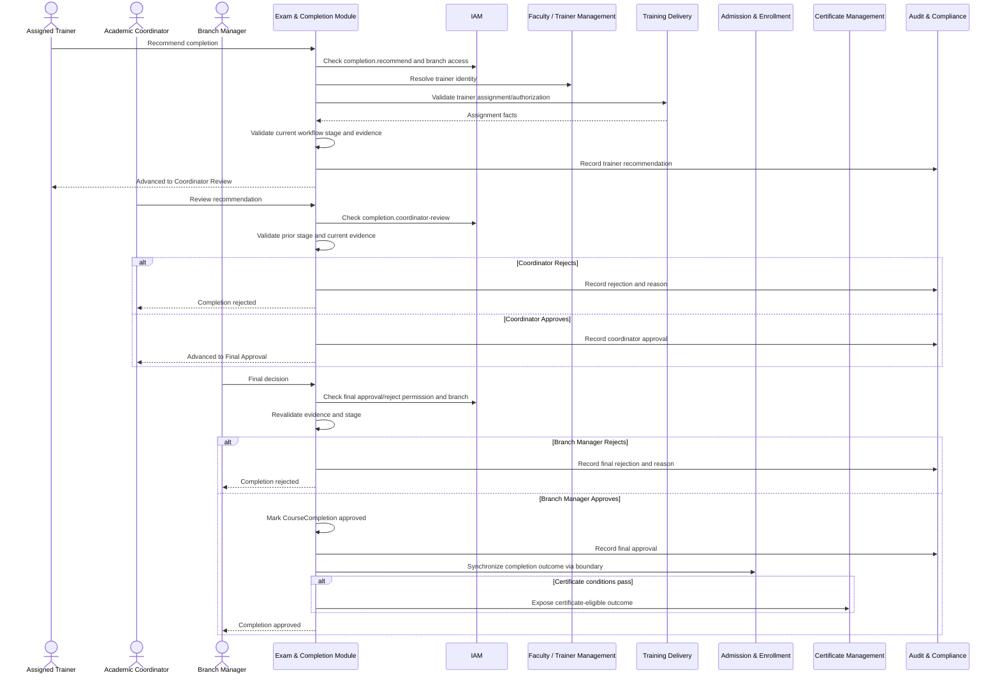
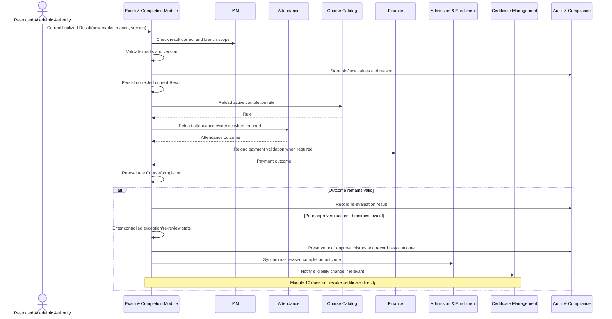
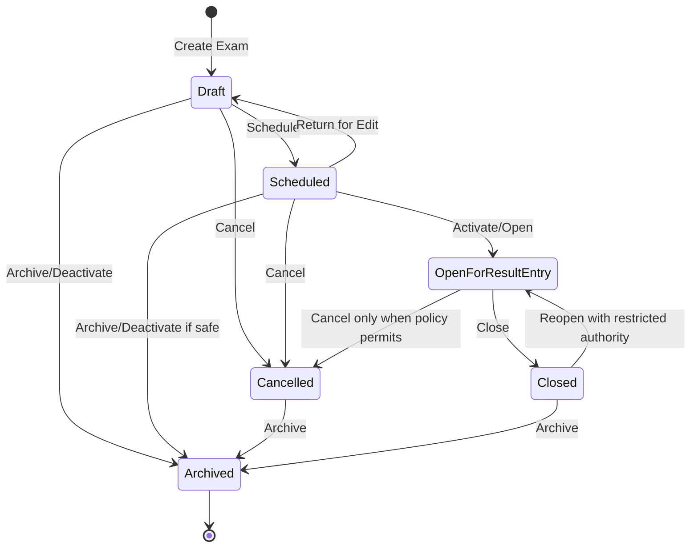
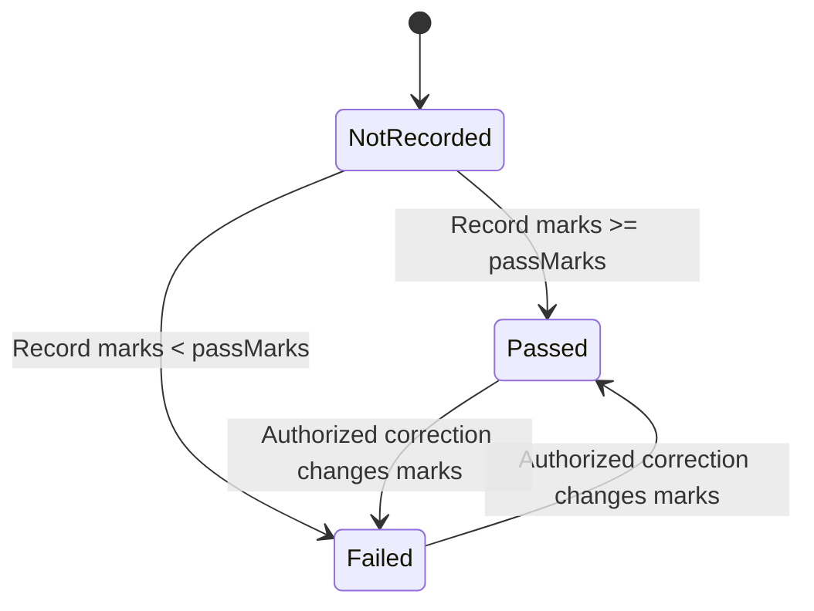
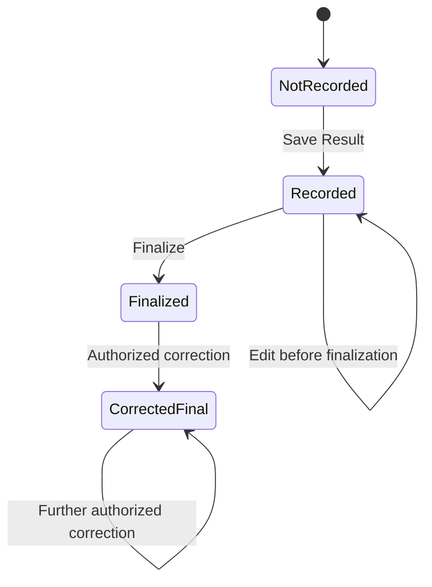
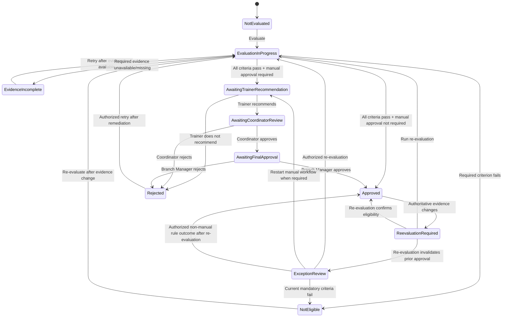
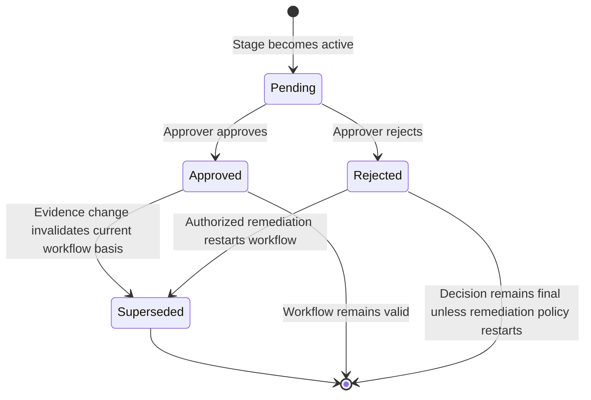

# Part 2 – User Stories, Use Cases, Workflows, State Machines

## Module 10 – Exam, Result & Completion Management

## 1. Purpose of This Part

This document translates the business requirements and rules defined in Part 1 into user-centered behavior, operational use cases, end-to-end workflows, and explicit lifecycle state models for Module 10 – Exam, Result & Completion Management.

The module remains bounded by the following architectural responsibilities:

- Course Catalog Management owns `CourseCompletionRule`.
- Training Delivery Management owns `Batch`, `Session`, and trainer-to-batch assignment data.
- Admission & Enrollment Management owns `Enrollment` and the central learner training lifecycle.
- Attendance Management owns attendance evidence and attendance percentage source data.
- Fee, Billing & Receivables Management owns payment truth and financial validation.
- Exam, Result & Completion Management owns `Exam`, `Result`, completion evaluation behavior, `CourseCompletion`, and `CompletionApproval`.
- Certificate Management owns certificate generation, numbering, issue, reissue, revocation, and verification.
- Identity & Access Management owns users, permissions, and branch access.
- Audit & Compliance owns platform audit conventions and shared approval-history conventions.

The current persisted ER baseline contains:

```text
Exam
Result
CourseCompletion
CompletionApproval
```

DDD concepts `Assessment`, `Grade`, and `CompletionRuleEvaluation` are not separate persisted entities in the current ER model. Therefore:

- current assessment persistence is represented by `Exam`;
- grade is stored in `Result.grade`;
- rule evaluation is domain/application behavior whose materialized outcome is stored in `CourseCompletion`;
- no additional entity is introduced in this FRD;
- retakes, multiple attempts, weighted assessments, moderation, and grade-scale master data remain outside current scope unless the architecture and ER model are amended.

---

# 2. User Stories

## US-EXC-001 — Create and Schedule an Exam

**Priority:** Must  
**Primary Actor:** Academic Coordinator  
**Mapped Requirements:** FR-EXC-001, FR-EXC-002, FR-EXC-018, FR-EXC-019, FR-EXC-022  
**Mapped Rules:** BR-EXC-001 to BR-EXC-004, BR-EXC-033 to BR-EXC-038

**Story**

> As an Academic Coordinator, I want to create and schedule an exam for a valid course and batch so that learner results can be recorded against the correct training delivery context.

### Acceptance Criteria

```gherkin
Feature: Create and schedule an exam

  Background:
    Given an authenticated academic coordinator has the "exam.create" permission
    And the academic coordinator has mutation access to branch "BR-001"
    And course "CRS-101" exists
    And batch "BAT-2026-001" exists in branch "BR-001"
    And batch "BAT-2026-001" belongs to course "CRS-101"

  Scenario: Create a valid exam
    When the coordinator creates an exam with:
      | examName  | Final Assessment |
      | examDate  | 2026-08-20       |
      | maxMarks  | 100              |
      | passMarks | 50               |
    Then the exam shall be created for course "CRS-101"
    And the exam shall be linked to batch "BAT-2026-001"
    And the exam shall be created in a non-final operational state
    And an audit record shall identify the creator and creation time
    And no Result record shall be created automatically

  Scenario: Reject a mismatched course and batch
    Given batch "BAT-2026-002" belongs to course "CRS-202"
    When the coordinator tries to create an exam for course "CRS-101" and batch "BAT-2026-002"
    Then the request shall be rejected
    And no Exam record shall be created

  Scenario Outline: Reject invalid marks thresholds
    When the coordinator submits maxMarks "<maxMarks>" and passMarks "<passMarks>"
    Then the request shall be rejected with a validation error

    Examples:
      | maxMarks | passMarks |
      | 0        | 0         |
      | -1       | 0         |
      | 100      | -1        |
      | 100      | 101       |

  Scenario: Reject creation outside authorized branch scope
    Given batch "BAT-OTHER-001" belongs to a branch not accessible to the coordinator
    When the coordinator attempts to create an exam for that batch
    Then the request shall be denied
    And the response shall not disclose unrelated branch data
    And no Exam record shall be created
```

---

## US-EXC-002 — Manage the Exam Lifecycle

**Priority:** Must  
**Primary Actor:** Academic Coordinator / Academic Administrator  
**Mapped Requirements:** FR-EXC-002, FR-EXC-023  
**Mapped Rules:** BR-EXC-003, BR-EXC-004, BR-EXC-010, BR-EXC-036 to BR-EXC-038

**Story**

> As an authorized academic user, I want to reschedule, activate, close, or cancel an exam through controlled state transitions so that exam operations remain accurate without invalidating result history.

### Acceptance Criteria

```gherkin
Feature: Manage exam lifecycle

  Scenario: Reschedule an exam before results are finalized
    Given an exam is in "Scheduled" state
    And no result for the exam is finalized
    And the user has "exam.schedule"
    When the user changes the exam date to a valid date
    Then the exam date shall be updated
    And the old and new values shall be auditable

  Scenario: Close an exam after result entry
    Given an exam is open for result entry
    And the user has "exam.close"
    When the user closes the exam
    Then normal result entry shall become unavailable
    And the exam shall enter the closed operational state

  Scenario: Prevent structural change that would invalidate finalized evidence
    Given an exam has finalized results
    When a user attempts to change maximum marks using the standard edit flow
    Then the request shall be rejected
    And the finalized result evidence shall remain unchanged

  Scenario: Cancel an exam with a reason
    Given the user has "exam.cancel"
    And the exam is in a cancellable state
    When the user cancels the exam with reason "Batch delivery rescheduled"
    Then the exam shall become cancelled
    And the cancellation reason and actor shall be auditable
    And no hard delete shall occur

  Scenario: Reject stale update
    Given user A and user B loaded version 4 of the same exam
    And user A successfully updates the exam to version 5
    When user B submits an update based on version 4
    Then the update shall be rejected as a concurrency conflict
```

---

## US-EXC-003 — Record an Individual Result

**Priority:** Must  
**Primary Actor:** Trainer / Authorized Academic User  
**Mapped Requirements:** FR-EXC-004, FR-EXC-005  
**Mapped Rules:** BR-EXC-005 to BR-EXC-009, BR-EXC-033, BR-EXC-035, BR-EXC-041, BR-EXC-044

**Story**

> As a Trainer, I want to record marks for an eligible enrolled learner so that the learner's pass or fail result is derived consistently from the exam threshold.

### Acceptance Criteria

```gherkin
Feature: Record an individual result

  Background:
    Given the user has "result.record"
    And the exam is open for result entry
    And the user can access the exam branch

  Scenario: Record a passing result
    Given exam "EX-001" has maximum marks 100 and pass marks 50
    And enrollment "ENR-001" belongs to the exam course and batch
    When the trainer records 78 marks for enrollment "ENR-001"
    Then one Result shall exist for exam "EX-001" and enrollment "ENR-001"
    And marksObtained shall be 78
    And resultStatus shall be derived as "Passed"
    And recordedBy and recordedAt shall be stored

  Scenario: Record a failing result
    Given exam "EX-001" has maximum marks 100 and pass marks 50
    And enrollment "ENR-002" belongs to the exam course and batch
    When the trainer records 49 marks
    Then resultStatus shall be derived as "Failed"

  Scenario Outline: Reject out-of-range marks
    Given exam "EX-001" has maximum marks 100
    When the trainer records "<marks>" marks
    Then the result shall be rejected

    Examples:
      | marks |
      | -1    |
      | 101   |

  Scenario: Reject an enrollment from another batch
    Given enrollment "ENR-OTHER" does not belong to the exam batch
    When the trainer attempts to record marks for "ENR-OTHER"
    Then the request shall be rejected
    And no Result shall be created

  Scenario: Prevent contradictory manually supplied status
    Given exam "EX-001" has pass marks 50
    When the trainer records 70 marks and attempts to submit resultStatus "Failed"
    Then the server shall derive the result status from the marks
    And contradictory client-supplied status shall not be persisted
```

---

## US-EXC-004 — Enter Results in Bulk

**Priority:** Must  
**Primary Actor:** Trainer / Academic Coordinator  
**Mapped Requirements:** FR-EXC-004, FR-EXC-006  
**Mapped Rules:** BR-EXC-005 to BR-EXC-009, BR-EXC-039, BR-EXC-040

**Story**

> As a Trainer, I want to enter results for the full authorized exam roster in one controlled operation so that large batches can be processed efficiently without silent partial saves.

### Acceptance Criteria

```gherkin
Feature: Bulk result entry

  Scenario: Save a valid bulk result submission
    Given the trainer has "result.bulk-record"
    And the exam is open for result entry
    And all submitted enrollments belong to the exam course, batch, and authorized branch
    And all marks are within the allowed range
    When the trainer confirms the bulk submission
    Then all confirmed rows shall be saved according to the transaction policy
    And each Result shall contain recordedBy and recordedAt
    And the UI shall receive a clear success summary

  Scenario: Return deterministic row-level validation errors
    Given a bulk submission contains:
      | row | enrollment | marks |
      | 1   | ENR-001    | 80    |
      | 2   | ENR-002    | 110   |
      | 3   | ENR-003    | -2    |
    When the submission is validated
    Then row 2 shall show an over-maximum validation error
    And row 3 shall show a negative-marks validation error
    And the system shall not silently report the submission as fully successful

  Scenario: Reject duplicate enrollment rows
    Given enrollment "ENR-001" appears twice in the same submitted payload
    When the payload is validated
    Then the duplicate rows shall be identified
    And conflicting duplicate data shall not be silently accepted

  Scenario: Do not leak cross-branch enrollment existence
    Given the submitted payload contains an enrollment identifier outside the user's branch scope
    When the payload is validated
    Then the row shall be treated as unauthorized or invalid
    And the response shall not reveal unrelated student or branch details
```

---

## US-EXC-005 — Finalize and Correct Results

**Priority:** Must  
**Primary Actor:** Academic Coordinator / Restricted Academic Authority  
**Mapped Requirements:** FR-EXC-007, FR-EXC-008, FR-EXC-015, FR-EXC-022  
**Mapped Rules:** BR-EXC-010 to BR-EXC-012, BR-EXC-037, BR-EXC-038, BR-EXC-048

**Story**

> As an authorized academic authority, I want to finalize results and use a separately controlled correction process when an error is proven so that academic records are protected while legitimate corrections remain traceable.

### Acceptance Criteria

```gherkin
Feature: Finalize and correct results

  Scenario: Finalize a valid result
    Given a Result is recorded and valid
    And the user has "result.finalize"
    When the user finalizes the Result
    Then the Result shall become read-only through the normal entry flow
    And the finalization action shall be auditable

  Scenario: Prevent ordinary edit after finalization
    Given a Result is finalized
    When a user with only "result.record" attempts to change marks
    Then the request shall be denied
    And the stored marks shall remain unchanged

  Scenario: Correct a finalized result with required authority and reason
    Given a Result is finalized with 45 marks and status "Failed"
    And the user has "result.correct"
    And the expected version is current
    When the user corrects the marks to 65 with reason "Verified transcription error"
    Then marksObtained shall become 65
    And resultStatus shall be re-derived as "Passed"
    And old value, new value, actor, timestamp, and reason shall be auditable
    And any affected CourseCompletion shall require controlled re-evaluation

  Scenario: Reject correction without a reason
    Given a Result is finalized
    And the user has "result.correct"
    When the user submits corrected marks without a business reason
    Then the correction shall be rejected
```

---

## US-EXC-006 — Evaluate Completion Eligibility

**Priority:** Must  
**Primary Actor:** Academic Coordinator / Academic Administrator  
**Mapped Requirements:** FR-EXC-009, FR-EXC-010, FR-EXC-011  
**Mapped Rules:** BR-EXC-013 to BR-EXC-023, BR-EXC-046

**Story**

> As an Academic Coordinator, I want the system to evaluate completion using the active course rule and authoritative attendance, exam, and payment evidence so that completion decisions are consistent and evidence-based.

### Acceptance Criteria

```gherkin
Feature: Evaluate completion eligibility

  Scenario: All mandatory criteria pass
    Given enrollment "ENR-001" has a valid course and batch
    And the active course completion rule requires:
      | minimumAttendance | 75 percent |
      | examRequired      | true       |
      | paymentRequired   | true       |
    And Attendance Management reports 90 percent attendance
    And the required exam evidence is passed
    And Finance reports payment validation passed
    When an authorized user evaluates completion
    Then CourseCompletion for "ENR-001" shall record the current evidence outcome
    And the completion evaluation shall indicate that all mandatory criteria passed
    And no Certificate shall be issued by this module

  Scenario: Required exam evidence is missing
    Given the active rule has examRequired true
    And no valid passing result exists for the required exam evidence
    When completion is evaluated
    Then completion shall not be approved
    And the missing exam criterion shall be visible in the evaluation outcome

  Scenario: Exam is not required
    Given the active rule has examRequired false
    And all other required criteria pass
    And there is no Result
    When completion is evaluated
    Then absence of a Result alone shall not block completion

  Scenario: Required payment validation fails
    Given the active rule requires payment validation
    And Finance reports validation failed
    When completion is evaluated
    Then completion shall not become certificate eligible

  Scenario: Preserve one CourseCompletion per Enrollment
    Given enrollment "ENR-001" already has a CourseCompletion record
    When the evaluation is run again
    Then the current CourseCompletion outcome shall be re-evaluated using concurrency protection
    And no duplicate active CourseCompletion shall be created
```

---

## US-EXC-007 — Recommend Completion as Trainer

**Priority:** Must  
**Primary Actor:** Assigned Trainer  
**Mapped Requirements:** FR-EXC-012  
**Mapped Rules:** BR-EXC-019, BR-EXC-024, BR-EXC-025, BR-EXC-027, BR-EXC-028

**Story**

> As an assigned Trainer, I want to recommend an evaluated learner for completion so that the formal approval workflow can begin with evidence from the trainer responsible for delivery.

### Acceptance Criteria

```gherkin
Feature: Trainer recommendation

  Scenario: Assigned trainer recommends an eligible completion
    Given manual approval is required
    And CourseCompletion has been evaluated
    And all mandatory evidence passes
    And the authenticated trainer is assigned to the enrollment batch
    And the trainer has "completion.recommend"
    When the trainer recommends completion
    Then recommendedByTrainerId shall reference the trainer profile
    And the workflow shall advance to Academic Coordinator Review
    And recommendation evidence shall be auditable

  Scenario: Prevent unauthorized trainer recommendation
    Given the authenticated trainer is not assigned or explicitly authorized for the batch
    When the trainer attempts to recommend completion
    Then the action shall be denied

  Scenario: Reject recommendation from an invalid workflow state
    Given the completion is already awaiting Branch Manager Approval
    When a trainer attempts another standard recommendation action
    Then the transition shall be rejected

  Scenario: Record a non-recommendation with reason
    Given the workflow permits a trainer decision
    When the trainer records a non-recommendation with required remarks
    Then the negative decision and remarks shall remain traceable
    And the workflow shall not advance to coordinator approval
```

---

## US-EXC-008 — Review Completion as Academic Coordinator

**Priority:** Must  
**Primary Actor:** Academic Coordinator  
**Mapped Requirements:** FR-EXC-013  
**Mapped Rules:** BR-EXC-019, BR-EXC-025, BR-EXC-027, BR-EXC-028

**Story**

> As an Academic Coordinator, I want to review the trainer recommendation and supporting evidence so that only academically valid completion cases proceed to final branch approval.

### Acceptance Criteria

```gherkin
Feature: Academic coordinator review

  Scenario: Approve trainer-recommended completion
    Given manual approval is required
    And the trainer recommendation is complete
    And the current stage is Coordinator Review
    And the coordinator has "completion.coordinator-review"
    When the coordinator approves the review
    Then a coordinator-level CompletionApproval decision shall be recorded
    And the workflow shall advance to Branch Manager Approval

  Scenario: Reject completion at coordinator stage
    Given the current stage is Coordinator Review
    When the coordinator rejects the completion with reason "Required evidence requires verification"
    Then the rejection shall be recorded
    And the workflow shall stop from advancing
    And the reason shall remain visible and auditable

  Scenario: Reject coordinator approval without prior trainer recommendation
    Given manual approval is required
    And no valid trainer recommendation exists
    When the coordinator attempts to approve
    Then the request shall be rejected
    And no coordinator approval shall be recorded
```

---

## US-EXC-009 — Make Final Completion Decision

**Priority:** Must  
**Primary Actor:** Branch Manager / Delegated Permission Holder  
**Mapped Requirements:** FR-EXC-014, FR-EXC-016, FR-EXC-017  
**Mapped Rules:** BR-EXC-019, BR-EXC-026 to BR-EXC-032

**Story**

> As a Branch Manager, I want to approve or reject a coordinator-reviewed completion case so that the institute has a controlled final completion decision before downstream certificate processing.

### Acceptance Criteria

```gherkin
Feature: Branch manager final completion decision

  Scenario: Final approval after all mandatory stages
    Given Trainer Recommendation is approved
    And Academic Coordinator Review is approved
    And current evidence remains valid
    And the manager has "completion.final-approve"
    And the manager has access to the enrollment branch
    When the manager grants final approval
    Then the final CompletionApproval shall be stored
    And CourseCompletion shall record approvedBy and approvedAt
    And the completion status shall become approved according to the implementation enum mapping
    And the Enrollment boundary shall receive the completion outcome through the defined application boundary
    And Certificate Management may consume an eligible outcome when all certificate conditions pass
    And this module shall not issue a Certificate

  Scenario: Reject at final approval stage
    Given the completion is awaiting final approval
    And the manager has "completion.reject"
    When the manager rejects with a mandatory reason
    Then the completion shall become rejected according to the functional workflow state
    And the rejection reason shall be stored in approval history
    And no certificate-eligible outcome shall be exposed

  Scenario: Prevent final approval before coordinator approval
    Given coordinator approval is not complete
    When the manager attempts final approval
    Then the transition shall be rejected
```

---

## US-EXC-010 — Re-evaluate After Evidence Changes

**Priority:** Must  
**Primary Actor:** Authorized Academic User / System Workflow  
**Mapped Requirements:** FR-EXC-008, FR-EXC-015, FR-EXC-016, FR-EXC-017  
**Mapped Rules:** BR-EXC-012, BR-EXC-030 to BR-EXC-032, BR-EXC-048, BR-EXC-049

**Story**

> As an Academic Administrator, I want completion to be re-evaluated after an authoritative result, attendance, or payment change so that stale completion eligibility does not remain trusted.

### Acceptance Criteria

```gherkin
Feature: Completion re-evaluation after evidence change

  Scenario: Corrected result changes failed evidence to passing
    Given a CourseCompletion was previously not eligible because exam evidence failed
    And an authorized result correction changes the Result from failed to passed
    When completion is re-evaluated
    Then the current rule and all authoritative evidence shall be reloaded
    And the completion criteria shall be recalculated
    And previous audit and approval history shall not be deleted

  Scenario: Approved completion becomes invalid after authoritative correction
    Given CourseCompletion is already approved
    And an authorized evidence correction makes a mandatory criterion fail
    When re-evaluation occurs
    Then the system shall not silently delete prior approval history
    And the completion shall enter the controlled exception or re-review path supported by the implementation status mapping
    And downstream eligibility shall no longer be treated as unquestioned current truth

  Scenario: Issued certificate is affected by later invalidation
    Given Certificate Management has already issued a certificate
    And later completion evidence becomes invalid
    When Module 10 re-evaluates completion
    Then Module 10 shall communicate the eligibility change through the defined boundary
    And Module 10 shall not directly revoke or delete the Certificate
```

---

## US-EXC-011 — Work from Pending Action Queues

**Priority:** Should  
**Primary Actor:** Trainer / Academic Coordinator / Branch Manager / Academic Administrator  
**Mapped Requirements:** FR-EXC-009, FR-EXC-020  
**Mapped Rules:** BR-EXC-033 to BR-EXC-035, BR-EXC-042

**Story**

> As an academic user, I want to see only the pending exam, result, evaluation, or approval work relevant to my permissions and branch scope so that I can act on backlogs efficiently.

### Acceptance Criteria

```gherkin
Feature: Pending work queues

  Scenario Outline: Show role-capability relevant work queue
    Given the user has permission "<permission>"
    And the user can access branch "BR-001"
    When the user opens queue "<queue>"
    Then only records from authorized scope shall be returned

    Examples:
      | permission                    | queue                       |
      | result.record                 | Missing Results             |
      | completion.evaluate           | Pending Evaluation          |
      | completion.recommend          | Pending Recommendation      |
      | completion.coordinator-review | Pending Coordinator Review  |
      | completion.final-approve      | Pending Final Approval      |

  Scenario: Consolidated read does not grant consolidated mutation
    Given the user may view consolidated child-branch data
    And the user lacks mutation access to branch "BR-CHILD-02"
    When the user views a consolidated queue
    Then records from permitted read scope may appear
    But mutation actions for unauthorized branches shall remain server-side denied
```

---

## US-EXC-012 — Export and Audit Academic Outcomes

**Priority:** Should  
**Primary Actor:** Academic Administrator / Auditor  
**Mapped Requirements:** FR-EXC-021, FR-EXC-022, FR-EXC-024  
**Mapped Rules:** BR-EXC-033, BR-EXC-037, BR-EXC-041, BR-EXC-050

**Story**

> As an authorized academic administrator or auditor, I want to export branch-scoped academic outcome data and inspect audit history so that operational review and compliance checks can be performed without exposing unrelated personal information.

### Acceptance Criteria

```gherkin
Feature: Export and audit academic outcomes

  Scenario: Export authorized completion outcomes
    Given the user has "completion.export"
    And the user can access branch "BR-001"
    When the user exports completion outcomes filtered for "BR-001"
    Then the export shall contain only authorized branch records
    And the selected columns shall avoid unrelated Civil ID, passport, or visa data
    And the export action shall be audited where security policy requires it

  Scenario: Localized export presentation
    Given the user selects Arabic presentation language
    When the export is generated
    Then supported headers and status labels shall use configured localized labels
    And core domain ownership shall remain unchanged

  Scenario: Read correction audit history
    Given the user has "completion.audit.read"
    When the user opens the audit history for a corrected Result
    Then the history shall show actor, action, time, old value, new value, and correction reason
```

---

# 3. Primary Use Cases

## UC-EXC-001 — Create Exam

**Primary Actor:** Academic Coordinator  
**Supporting Systems/Contexts:** IAM, Organization, Course Catalog, Training Delivery, Audit & Compliance  
**Related Requirements:** FR-EXC-001, FR-EXC-018, FR-EXC-019, FR-EXC-022

### Preconditions

1. Actor is authenticated.
2. Actor has `exam.create`.
3. Actor has mutation access to the Batch branch.
4. Course exists and is valid for academic operations.
5. Batch exists and references the selected Course.
6. Input marks thresholds satisfy business rules.

### Main Success Scenario

1. Actor opens the Create Exam action.
2. System resolves courses and batches available within authorized branch scope.
3. Actor selects Course and Batch.
4. Actor enters exam name, exam date, maximum marks, and pass marks.
5. System validates Course–Batch relationship.
6. System validates marks thresholds.
7. System validates exam date against applicable operational constraints.
8. System checks for semantic duplication according to repository policy.
9. System creates the Exam in a non-final initial state.
10. System writes creation audit evidence.
11. System returns the created exam detail.

### Alternative Flows

**A1 – Course and Batch mismatch**
1. Batch does not belong to selected Course.
2. System rejects the command.
3. No Exam is created.

**A2 – Invalid marks thresholds**
1. `maxMarks <= 0`, `passMarks < 0`, or `passMarks > maxMarks`.
2. System returns field-level validation errors.
3. No Exam is created.

**A3 – Unauthorized branch**
1. Actor selects or submits a Batch outside mutation scope.
2. Server denies the request.
3. No cross-branch data is disclosed beyond safe error handling.

**A4 – Concurrent duplicate**
1. A semantically duplicate exam is created by another request before commit.
2. Database/application uniqueness policy rejects duplication.
3. Actor receives a conflict response.

### Postconditions

- One valid Exam is persisted.
- Exam is linked to Course and Batch.
- Audit evidence exists.
- No Results are automatically created.

---

## UC-EXC-002 — Manage Exam Lifecycle

**Primary Actor:** Academic Coordinator / Academic Administrator  
**Supporting Systems/Contexts:** IAM, Training Delivery, Audit & Compliance  
**Related Requirements:** FR-EXC-002, FR-EXC-023

### Preconditions

1. Exam exists and is not soft-deleted.
2. Actor has action-specific permission.
3. Actor can mutate the Exam branch.
4. Requested state transition is valid.
5. Actor provides current version.

### Main Success Scenario

1. Actor opens Exam detail.
2. System loads current Exam state and version.
3. Actor selects one supported action: schedule/reschedule, activate/open, close, or cancel.
4. System checks permission and branch scope.
5. System validates transition from current state.
6. System validates changed date or marks fields where applicable.
7. System rejects structural edits that would silently invalidate finalized evidence.
8. System commits the valid transition using optimistic concurrency.
9. System records old value, new value, actor, timestamp, and reason where applicable.
10. Updated state is returned.

### Alternative Flows

- Invalid transition: reject without mutation.
- Stale version: reject with concurrency conflict.
- Finalized evidence would be invalidated: require correction/exception process instead of standard edit.
- Cancellation reason required but missing: reject.
- Unauthorized branch/action: deny.

### Postconditions

- Exam is in a valid state.
- Historical evidence remains intact.
- Transition is auditable.
- No hard delete occurs.

---

## UC-EXC-003 — Record Results

**Primary Actor:** Trainer / Academic Coordinator  
**Supporting Systems/Contexts:** IAM, Admission & Enrollment, Training Delivery, Person/Party, Audit & Compliance  
**Related Requirements:** FR-EXC-004 to FR-EXC-006

### Preconditions

1. Actor has individual or bulk result permission.
2. Exam exists and is open for result entry.
3. Actor has branch access.
4. Enrollment roster is resolved from Admission & Enrollment.
5. Enrollment belongs to Exam Course and Batch.

### Main Success Scenario

1. Actor opens the Exam result-entry page.
2. System resolves authorized exam roster.
3. System displays enrollment number, student display identity, enrollment status, current result, and editability.
4. Actor enters marks.
5. System validates each enrollment relationship.
6. System validates `0 <= marksObtained <= maxMarks`.
7. System derives pass/fail result status from `passMarks`.
8. System applies approved grade-field mapping where available.
9. Actor confirms submission.
10. System persists results using the defined transaction policy.
11. System records `recordedBy` and `recordedAt`.
12. System returns row-level outcome summary.

### Alternative Flows

- Marks out of range: row validation error.
- Enrollment not in Exam Course/Batch: reject row/request.
- Cross-branch identifier: generic unauthorized/invalid handling without leakage.
- Duplicate enrollment row: validation error.
- Finalized Result exists: route to correction flow if actor has permission; otherwise deny.
- Concurrent update: reject stale rows/transaction according to transaction policy.

### Postconditions

- Valid Results are linked to Exam and Enrollment.
- Pass/fail state is derived consistently.
- No duplicate current Result exists for Exam + Enrollment.
- Result actor and time are preserved.

---

## UC-EXC-004 — Finalize Result Set

**Primary Actor:** Academic Coordinator / Academic Administrator  
**Supporting Systems/Contexts:** IAM, Audit & Compliance  
**Related Requirements:** FR-EXC-007

### Preconditions

1. Actor has `result.finalize`.
2. Exam/Result is finalizable.
3. Actor has branch access.
4. Required result data is valid.

### Main Success Scenario

1. Actor reviews result completeness and validation summary.
2. Actor selects finalize action.
3. System revalidates marks and result derivation.
4. System validates finalization state.
5. Actor confirms finalization.
6. System finalizes the supported Result scope.
7. System makes standard result-entry path read-only.
8. System records finalization audit evidence.

### Alternative Flows

- Invalid or incomplete required result data: finalization blocked.
- Stale version: conflict.
- Unauthorized actor or branch: denied.

### Postconditions

- Finalized evidence cannot be silently edited.
- Corrections require UC-EXC-005.

---

## UC-EXC-005 — Correct Finalized Result

**Primary Actor:** Restricted Academic Authority  
**Supporting Systems/Contexts:** IAM, Audit & Compliance, Completion Evaluation  
**Related Requirements:** FR-EXC-008, FR-EXC-015

### Preconditions

1. Result is finalized.
2. Actor has `result.correct`.
3. Actor has branch mutation access.
4. Mandatory correction reason is supplied.
5. Expected version is current.

### Main Success Scenario

1. Actor opens finalized Result.
2. Actor invokes Correct Result.
3. System verifies separate correction permission.
4. Actor enters corrected marks and reason.
5. System validates marks range.
6. System re-derives result status.
7. System checks optimistic version.
8. System persists corrected current value.
9. System creates audit evidence containing old/new values and reason.
10. System identifies impacted CourseCompletion.
11. System triggers or marks controlled completion re-evaluation.
12. Actor receives correction and re-evaluation status.

### Alternative Flows

- No reason: reject.
- Invalid marks: reject.
- Stale version: reject.
- No correction permission: deny.
- Re-evaluation dependency temporarily unavailable: correction transaction follows repository transaction boundary and integration failure is surfaced/recoverable according to architecture policy.

### Postconditions

- Corrected result is current.
- Prior history remains reconstructable.
- Completion eligibility is not left silently stale.

---

## UC-EXC-006 — Evaluate Completion

**Primary Actor:** Academic Coordinator / Academic Administrator / Authorized System Workflow  
**Supporting Systems/Contexts:** Course Catalog, Admission & Enrollment, Attendance, Finance & Receivables, Training Delivery, IAM, Audit & Compliance  
**Related Requirements:** FR-EXC-009 to FR-EXC-011, FR-EXC-015

### Preconditions

1. Enrollment exists and is eligible for evaluation.
2. Enrollment has Course and Batch.
3. Active CourseCompletionRule can be resolved.
4. Actor/system has evaluation authority.
5. Branch scope is valid.

### Main Success Scenario

1. Evaluation request identifies Enrollment.
2. System loads Enrollment Course, Batch, and Branch through approved boundary.
3. System resolves active CourseCompletionRule from Course Catalog.
4. When attendance criteria apply, system obtains authoritative attendance percentage/outcome.
5. When exam evidence is required, system loads relevant Result evidence from this context.
6. When payment validation is required, system obtains Finance-owned validation outcome.
7. System evaluates each criterion independently.
8. System creates CourseCompletion when absent or updates the existing record when present.
9. System stores materialized outcome fields supported by ER: attendancePercentage, examPassed, paymentCompleted, completionStatus, and remarks as applicable.
10. If all criteria pass and manual approval is not required, system transitions to the approved/complete functional outcome mapped to the actual schema enum.
11. If manual approval is required, system transitions to Awaiting Trainer Recommendation.
12. If required evidence fails or is missing, system remains Not Eligible / Evidence Incomplete according to functional state mapping.
13. System records evaluation audit/operational evidence.

### Alternative Flows

- No active rule: evaluation fails safely and is surfaced as configuration gap.
- Attendance dependency unavailable: no false approval; evaluation remains pending/error.
- Finance validation unavailable when required: no false approval.
- Required Result missing: not eligible/incomplete.
- Duplicate CourseCompletion create attempt: use existing record; preserve one-per-enrollment invariant.
- Stale CourseCompletion version: reject/retry according to concurrency policy.

### Postconditions

- Exactly one current CourseCompletion exists per Enrollment.
- Outcome reflects available authoritative evidence.
- No Certificate is issued.
- Manual workflow starts only when required.

---

## UC-EXC-007 — Execute Manual Completion Approval

**Primary Actor:** Trainer, Academic Coordinator, Branch Manager  
**Supporting Systems/Contexts:** IAM, Faculty/Trainer, Training Delivery, Audit & Compliance  
**Related Requirements:** FR-EXC-012 to FR-EXC-014

### Preconditions

1. `manualApprovalRequired = true`.
2. CourseCompletion evaluation exists.
3. Mandatory evidence state allows the requested stage action.
4. Actor has stage-specific permission.
5. Actor satisfies branch and domain eligibility.

### Main Success Scenario

1. Assigned Trainer reviews completion evidence.
2. Trainer recommends completion.
3. System stores recommendation evidence and advances to Coordinator Review.
4. Academic Coordinator reviews evidence and Trainer recommendation.
5. Coordinator approves.
6. System creates coordinator-level CompletionApproval and advances to Final Approval.
7. Branch Manager reviews current evidence and prior decisions.
8. Branch Manager approves.
9. System creates final CompletionApproval.
10. System updates CourseCompletion final approved fields.
11. System publishes/synchronizes Enrollment completion outcome.
12. System evaluates whether certificate eligibility conditions are met.
13. Eligible outcome is exposed to Certificate Management.
14. All stage actions remain auditable.

### Alternative Flows

**A1 – Trainer does not recommend**
- Record negative recommendation/remarks.
- Workflow does not advance.

**A2 – Coordinator rejects**
- Remarks mandatory.
- Workflow enters rejected outcome.
- Final approval does not become available.

**A3 – Branch Manager rejects**
- Remarks mandatory.
- Completion becomes rejected outcome.
- No eligibility is exposed.

**A4 – Actor attempts stage skipping**
- Reject transition.
- No approval row/action is created.

**A5 – Evidence changed before final decision**
- Re-evaluate current evidence.
- Prevent approval based on stale truth.
- Route to appropriate re-review state.

### Postconditions

- Final decision is traceable through ordered stage history.
- No stage is skipped.
- Approved Completion may produce certificate eligibility but not certificate issuance.

---

## UC-EXC-008 — Re-evaluate Completion After Evidence Change

**Primary Actor:** Authorized Academic User / System Workflow  
**Supporting Systems/Contexts:** Attendance, Finance, Result, Enrollment, Certificate Management  
**Related Requirements:** FR-EXC-015 to FR-EXC-017

### Preconditions

1. CourseCompletion exists.
2. An authoritative evidence change has occurred.
3. Trigger reference is traceable.
4. Re-evaluation permission/system authority is valid.

### Main Success Scenario

1. System receives evidence-change trigger.
2. System identifies affected Enrollment and CourseCompletion.
3. System reloads the active CourseCompletionRule.
4. System reloads current authoritative attendance, result, and payment evidence as required.
5. System recomputes completion criteria.
6. System compares previous and current outcome.
7. System updates current CourseCompletion outcome with concurrency protection.
8. System preserves prior audit and CompletionApproval history.
9. If prior approved eligibility is invalidated, system enters controlled exception/re-review functional state.
10. System synchronizes revised completion outcome to Enrollment boundary.
11. System communicates eligibility change to Certificate Management when relevant.
12. System does not revoke a Certificate directly.

### Alternative Flows

- No meaningful outcome change: record idempotent/re-evaluation completion and retain current state.
- Dependency unavailable: do not assume pass; retry/recovery follows architecture/runbook design.
- Certificate already issued: communicate exception to Certificate context; no direct revocation.

### Postconditions

- Current completion truth reflects current authoritative evidence.
- Decision history is preserved.
- Downstream contexts receive appropriate revised outcome.

---

## UC-EXC-009 — View Pending Work Queue

**Primary Actor:** Trainer / Academic Coordinator / Branch Manager / Academic Administrator  
**Supporting Systems/Contexts:** IAM, Admission & Enrollment, Reporting read models where applicable  
**Related Requirements:** FR-EXC-009, FR-EXC-020

### Preconditions

1. Actor is authenticated.
2. Actor has appropriate read/action permission.
3. IAM branch policy can be resolved.

### Main Success Scenario

1. Actor opens Module 10 work queue.
2. System derives allowed branches.
3. Actor chooses queue type.
4. System resolves queue-specific filters:
   - missing results;
   - pending completion evaluation;
   - pending trainer recommendation;
   - pending coordinator review;
   - pending final approval;
   - re-evaluation exceptions.
5. System applies branch intersection and permission scope.
6. System returns counts and paginated records.
7. Action buttons are shown based on user experience rules.
8. Server independently rechecks authorization on every action.

### Alternative Flows

- No permission for queue: deny.
- Consolidated read allowed but mutation denied for child branch: show read data but server rejects unauthorized command.
- Dependency/read model temporarily stale: display freshness metadata where architecture supports it; transaction truth remains with owning context.

### Postconditions

- Actor sees only authorized workload.
- No business transaction is mutated by viewing the queue.

---

## UC-EXC-010 — Export Exam, Result, or Completion Data

**Primary Actor:** Academic Administrator / Auditor  
**Supporting Systems/Contexts:** IAM, Audit & Compliance  
**Related Requirements:** FR-EXC-021, FR-EXC-022, FR-EXC-024

### Preconditions

1. Actor has export permission.
2. Actor has authorized branch scope.
3. Filters are valid.

### Main Success Scenario

1. Actor selects export type and filters.
2. System derives authorized branch set.
3. System reapplies all filters server-side.
4. System selects approved export columns.
5. System localizes headers and display labels when requested.
6. System generates supported export format.
7. System records export audit where required.
8. System returns the export artifact.

### Alternative Flows

- Requested branch outside scope: excluded or denied according to request semantics.
- No rows: return valid empty export with headers or clear no-data response.
- Unsupported format: validation error.
- Export too large for synchronous policy: handling must follow architecture/NFR design without changing domain ownership.

### Postconditions

- Export contains only authorized, approved data.
- Unrelated sensitive Person fields are excluded.
- Audit evidence exists where required.

---

# 4. Business Workflows

## 4.1 Workflow A — Exam Creation to Result Finalization

### Structured Flow

```text
Academic Coordinator
        |
        | Create Exam
        v
Exam Validation
  - Permission
  - Branch Scope
  - Course/Batch Match
  - Marks Thresholds
  - Date Constraints
        |
        v
Exam Scheduled
        |
        | Activate/Open for Result Entry
        v
Result Entry Open
        |
        +-------------------------------+
        |                               |
        v                               v
Individual Result Entry          Bulk Result Entry
        |                               |
        +---------------+---------------+
                        |
                        v
                Row/Domain Validation
                  - Enrollment match
                  - Marks range
                  - Derived pass/fail
                  - Duplicate check
                  - Branch scope
                        |
                        v
                  Results Recorded
                        |
                        v
                 Finalization Review
                        |
                        v
                  Results Finalized
                        |
                        v
          Standard Editing Becomes Read-only
                        |
                        v
          Completion Evaluation Can Consume
                 Final Evidence
```

### Mermaid Sequence Diagram



---

## 4.2 Workflow B — Completion Evaluation



### Evaluation Decision Table

| Attendance Requirement | Exam Requirement | Payment Requirement | Evidence Outcome | Manual Approval | Functional Outcome |
|---|---|---|---|---|---|
| Not configured | Not required | Not required | No mandatory criterion fails | No | Approved/Completed using implementation enum mapping |
| Pass | Pass | Pass | All required criteria pass | Yes | Awaiting Trainer Recommendation |
| Fail | Any | Any | Required attendance fails | Any | Not Eligible |
| Missing | Any | Any | Required attendance evidence missing | Any | Evidence Incomplete / Pending Evaluation |
| Pass | Fail | Any | Required exam fails | Any | Not Eligible |
| Pass | Missing | Any | Required exam result missing | Any | Evidence Incomplete / Not Eligible according to final policy mapping |
| Pass | Pass | Fail | Required payment fails | Any | Not Eligible |
| Pass | Pass | Unavailable | Required Finance validation unavailable | Any | Evaluation Pending/Error; never false-approved |

**Schema note:** The exact persisted `completionStatus` enum values must be mapped to the actual Prisma schema. The table defines required functional behavior, not a new persistence enum.

---

## 4.3 Workflow C — Manual Completion Approval



---

## 4.4 Workflow D — Finalized Result Correction and Completion Re-evaluation



---

## 4.5 Workflow E — Missing Result Monitoring

```text
Start
  |
  v
Resolve authorized branch scope
  |
  v
Resolve courses/enrollments where active rule has examRequired = true
  |
  v
Resolve relevant Exams for Course + Batch
  |
  v
Compare eligible Enrollment roster against current valid Result evidence
  |
  +-------------------+-------------------+
  |                   |                   |
  v                   v                   v
Result Exists       Result Missing      Result Exists but
and Valid           / Not Final        Invalid for policy
  |                   |                   |
  v                   +--------+----------+
No Queue Item                  |
                               v
                       Missing Result Queue
                               |
                               v
                 Authorized user records/finalizes result
                               |
                               v
                      Completion Evaluation
```

---

## 4.6 Workflow F — Certificate Eligibility Handoff

```text
CourseCompletion Final Decision
              |
              v
       Is completion approved?
          /             \
        No               Yes
        |                 |
        v                 v
  No eligibility    Read CourseCompletionRule
                          |
                          v
                Is certificateAllowed = true?
                    /                \
                  No                  Yes
                  |                    |
                  v                    v
          No eligibility      Is required payment
                              validation passed?
                                /           \
                              No             Yes
                              |               |
                              v               v
                       No eligibility   Expose idempotent
                                        eligibility outcome
                                               |
                                               v
                                     Certificate Management
                                     owns issue workflow
```

Boundary rules:

1. Module 10 must not create `Certificate`.
2. Module 10 must not generate certificate number, QR code, URL, or verification code.
3. Certificate Management must not recompute completion rules.
4. Eligibility exposure must be idempotent.
5. Later eligibility invalidation must be communicated, but certificate revocation remains Certificate Management responsibility.

---

# 5. State Machines

## 5.1 State Vocabulary and Persistence Mapping Rule

The DDD and ER baselines provide lifecycle responsibilities and the three-stage completion workflow, but they do not enumerate all concrete status enum values for `Exam.status`, `Result.resultStatus`, `CourseCompletion.completionStatus`, or `CompletionApproval.status`.

Therefore, this Part defines **functional states required by behavior**. Implementation must:

1. map these states to existing Prisma enums where semantically equivalent;
2. not create additional database entities merely to implement this document;
3. amend DDD/ER/Prisma deliberately if required states cannot be represented safely;
4. preserve audit history for corrections and re-evaluations;
5. never infer authorization from state alone.

---

## 5.2 Exam State Machine

### Functional States

```text
Draft
Scheduled
OpenForResultEntry
Closed
Cancelled
Archived
```

`Archived` is a logical terminal/deactivated state following repository soft-delete/archive conventions. Exact persistence mapping must follow the schema.

### Mermaid State Diagram



### Exam Transition Rules Matrix

| From | To | Trigger | Required Permission | Additional Guards |
|---|---|---|---|---|
| New | Draft | Create | `exam.create` | Valid Course, Batch, branch, marks thresholds |
| Draft | Scheduled | Schedule | `exam.schedule` or `exam.update` per final permission design | Valid exam date and branch mutation access |
| Draft | Cancelled | Cancel | `exam.cancel` | Reason required according to policy |
| Scheduled | Draft | Return for Edit | `exam.update` | No incompatible finalized evidence |
| Scheduled | OpenForResultEntry | Activate/Open | `exam.activate` | Exam ready for result entry |
| Scheduled | Cancelled | Cancel | `exam.cancel` | Reason required; preserve audit |
| OpenForResultEntry | Closed | Close | `exam.close` | Finalization/completeness policy satisfied as applicable |
| OpenForResultEntry | Cancelled | Cancel | `exam.cancel` | Must not silently invalidate finalized evidence; exception handling may be required |
| Closed | OpenForResultEntry | Reopen | Restricted action; exact permission must be defined in IAM permission catalog | Mandatory reason, audit, no unsafe evidence invalidation |
| Draft/Scheduled/Closed/Cancelled | Archived | Archive/deactivate | Repository-defined administration permission; no new permission invented here | Soft delete/deactivation only; no hard delete |

**Gap note:** `exam.reopen` and an archive-specific permission are not present in Part 1's recommended permission list. If reopening/archive is required in implementation, either map it to an existing restricted capability or amend the permission catalog explicitly. It must not be granted implicitly by role name.

---

## 5.3 Result Lifecycle State Machine

The ER model contains `resultStatus`, but Part 1 requires two distinct concerns:

1. academic outcome: Passed / Failed;
2. edit lifecycle: Recorded / Finalized / Corrected.

A single `resultStatus` field may not safely represent both dimensions. The implementation must verify the Prisma schema before coding. This FRD therefore models the behavior as two orthogonal functional state dimensions.

### A. Academic Outcome State



| From | To | Trigger | Required Permission | Guards |
|---|---|---|---|---|
| NotRecorded | Passed | Record valid marks | `result.record` or `result.bulk-record` | Enrollment matches Exam Course/Batch; marks within range |
| NotRecorded | Failed | Record valid marks | `result.record` or `result.bulk-record` | Same guards |
| Failed | Passed | Correct finalized result | `result.correct` | Mandatory reason, version match, audit, completion re-evaluation |
| Passed | Failed | Correct finalized result | `result.correct` | Mandatory reason, version match, audit, completion re-evaluation |

### B. Edit Lifecycle State



| From | To | Trigger | Required Permission | Guards |
|---|---|---|---|---|
| NotRecorded | Recorded | Save Result | `result.record` / `result.bulk-record` | Exam open; valid roster member |
| Recorded | Recorded | Edit | `result.record` | Exam open; not finalized; version valid |
| Recorded | Finalized | Finalize | `result.finalize` | Valid result; finalization policy satisfied |
| Finalized | CorrectedFinal | Correct | `result.correct` | Reason mandatory; audit; version check |
| CorrectedFinal | CorrectedFinal | Correct again | `result.correct` | Same restricted correction controls |

**Model gap:** The ER definition shown in the source material does not include a dedicated `isFinalized`, `finalizedAt`, `finalizedBy`, or correction-history entity. Finalization and correction behavior therefore requires validation against the actual Prisma schema and repository audit convention. Do not overload pass/fail semantics with lifecycle semantics without an explicit design decision.

---

## 5.4 CourseCompletion State Machine

### Functional States

```text
NotEvaluated
EvaluationInProgress
EvidenceIncomplete
NotEligible
AwaitingTrainerRecommendation
AwaitingCoordinatorReview
AwaitingFinalApproval
Approved
Rejected
ReevaluationRequired
ExceptionReview
```

These are functional workflow states. The exact mapping into `CourseCompletion.completionStatus` must be verified against Prisma.

### Mermaid State Diagram



### CourseCompletion Transition Rules Matrix

| From | To | Trigger | Required Permission / Authority | Guards |
|---|---|---|---|---|
| NotEvaluated | EvaluationInProgress | Start evaluation | `completion.evaluate` or authorized system workflow | Enrollment valid; Course/Batch present; branch scope |
| EvidenceIncomplete | EvaluationInProgress | Retry | `completion.evaluate` / `completion.reevaluate` | Missing dependency/evidence now available |
| NotEligible | EvaluationInProgress | Re-evaluate | `completion.reevaluate` | Authoritative evidence changed or remediation completed |
| EvaluationInProgress | EvidenceIncomplete | Evaluation outcome | System domain logic | Required evidence missing/unavailable; must not false-approve |
| EvaluationInProgress | NotEligible | Evaluation outcome | System domain logic | At least one mandatory criterion fails |
| EvaluationInProgress | AwaitingTrainerRecommendation | Evaluation outcome | System domain logic | All criteria pass and manual approval required |
| EvaluationInProgress | Approved | Evaluation outcome | System domain logic | All criteria pass and manual approval not required |
| AwaitingTrainerRecommendation | AwaitingCoordinatorReview | Recommend | `completion.recommend` | Assigned/authorized trainer; evidence valid; version current |
| AwaitingTrainerRecommendation | Rejected | Do not recommend | `completion.recommend` | Remarks where policy requires; audit |
| AwaitingCoordinatorReview | AwaitingFinalApproval | Approve review | `completion.coordinator-review` | Valid trainer recommendation; branch access |
| AwaitingCoordinatorReview | Rejected | Reject review | `completion.coordinator-review` or `completion.reject` according to command design | Mandatory rejection remarks |
| AwaitingFinalApproval | Approved | Final approve | `completion.final-approve` | Coordinator approved; evidence revalidated; branch access |
| AwaitingFinalApproval | Rejected | Reject | `completion.reject` | Mandatory rejection remarks |
| Approved | ReevaluationRequired | Evidence change trigger | Authorized system workflow / `completion.reevaluate` | Traceable authoritative change |
| ReevaluationRequired | EvaluationInProgress | Start re-evaluation | `completion.reevaluate` / system | Current rule and evidence reloaded |
| EvaluationInProgress after prior approval | ExceptionReview | Current evidence invalidates approval | System + restricted review process | Preserve prior approval history |
| ExceptionReview | AwaitingTrainerRecommendation | Restart manual workflow | `completion.reevaluate` plus stage permissions for later actions | Manual approval still required |
| ExceptionReview | Approved | Re-evaluation completes | Authorized system outcome | Manual approval not required and all criteria pass |
| ExceptionReview | NotEligible | Re-evaluation completes | System domain logic | Mandatory criteria fail |
| Rejected | EvaluationInProgress | Retry after remediation | `completion.reevaluate` | Business policy allows retry; no history deletion |

---

## 5.5 CompletionApproval State Machine

`CompletionApproval` represents stage-level approval evidence. The ER model fields are:

```text
courseCompletionId
approvalLevel
approverUserId
status
remarks
approvedAt
```

### Functional Approval Statuses

```text
Pending
Approved
Rejected
Superseded
```

`Superseded` is a functional audit concept for a prior decision made obsolete by controlled re-evaluation. If the persistence enum cannot represent it, the system must preserve the historical record through existing audit/approval conventions rather than deleting or overwriting it.

### Mermaid State Diagram



### CompletionApproval Transition Rules Matrix

| Approval Level | From | To | Trigger | Required Permission | Guards |
|---|---|---|---|---|---|
| Trainer Recommendation | Pending | Approved | Recommend | `completion.recommend` | Actor is assigned/authorized trainer; evidence ready |
| Trainer Recommendation | Pending | Rejected | Do not recommend | `completion.recommend` | Reason/remarks as required |
| Coordinator Review | Pending | Approved | Approve | `completion.coordinator-review` | Trainer recommendation approved |
| Coordinator Review | Pending | Rejected | Reject | `completion.coordinator-review` or mapped reject command | Mandatory remarks |
| Final Approval | Pending | Approved | Final approve | `completion.final-approve` | Coordinator approval exists; evidence still valid |
| Final Approval | Pending | Rejected | Final reject | `completion.reject` | Mandatory remarks |
| Any completed level | Approved/Rejected | Superseded | Controlled re-evaluation invalidates workflow basis | System authority plus auditable re-evaluation process | Old history preserved; never hard-deleted |

---

# 6. Actor-to-Workflow Responsibility Matrix

| Actor | Create/Manage Exam | Record Result | Finalize Result | Correct Finalized Result | Evaluate Completion | Recommend | Coordinator Review | Final Approve/Reject | Export/Audit |
|---|---:|---:|---:|---:|---:|---:|---:|---:|---:|
| Trainer | No by default | Yes when permitted | No by default | No | Read outcome as permitted | Yes when assigned and permitted | No | No | Limited/read only as permitted |
| Academic Coordinator | Yes | Yes when permitted | Yes | Only if separately granted | Yes | Not as substitute for trainer stage | Yes | No by default | Yes when permitted |
| Academic Administrator | Yes | Yes | Yes | Yes when separately granted | Yes | Only if domain policy explicitly delegates | May review if granted | Only if final permission explicitly granted | Yes |
| Branch Manager | Read/manage only when permission granted | No by default | No by default | No by default | Read | No | No by default | Yes | Yes when permitted |
| Auditor | No mutation | Read | Read | No | Read | Read history | Read history | Read history | Audit read/export when granted |
| System Workflow | No human exam authoring | No manual marks invention | No | No autonomous correction | May run authorized re-evaluation | No | No | No | Operational metrics only |

**Authorization rule:** This table describes expected business usage, not hardcoded roles. Server authorization must use permission codes, branch policy, domain eligibility, entity state, and concurrency checks.

---

# 7. Cross-Context Workflow Contract Summary

| Workflow Step | Data/Decision | Owner | Module 10 Usage | Prohibited Behavior |
|---|---|---|---|---|
| Resolve user permission | User permissions | IAM | Authorize command/query | Hardcode role-name checks |
| Resolve branch access | UserBranchAccess / branch policy | IAM | Filter and authorize resources | Trust client branchId alone |
| Resolve Course rule | CourseCompletionRule | Course Catalog | Read active rule and evaluate | Copy or edit rule in Module 10 |
| Resolve batch roster | Enrollment + Batch relationship | Admission & Enrollment / Training Delivery | Build result-entry roster | Create parallel student-course record |
| Resolve trainer assignment | BatchTrainer / TrainerProfile | Training Delivery / Trainer Management | Validate recommendation actor | Duplicate trainer identity |
| Resolve attendance | Attendance evidence | Attendance | Consume percentage/outcome | Own or directly mutate attendance |
| Resolve payment validation | Finance evidence | Finance & Receivables | Consume pass/fail validation | Recompute from copied payment data |
| Persist exam result | Exam, Result | Module 10 | Own create/update/finalization/correction behavior | Store result in Enrollment context |
| Persist completion decision | CourseCompletion, CompletionApproval | Module 10 | Own evaluation and ordered approval | Let Certificate recompute eligibility |
| Sync completion status | Enrollment lifecycle outcome | Admission & Enrollment | Publish/call boundary | Direct cross-package repository mutation |
| Expose eligibility | Certificate-ready decision | Module 10 | Publish/query idempotent eligibility | Create Certificate |
| Issue/revoke certificate | Certificate aggregate | Certificate Management | Consume outcome only | Revoke Certificate from Module 10 |
| Preserve sensitive history | AuditLog / shared conventions | Audit & Compliance | Emit/write according to convention | Unaudited override path |

---

# 8. Traceability Summary

## 8.1 User Story to Functional Requirement Mapping

| User Story | Main FR Coverage |
|---|---|
| US-EXC-001 | FR-EXC-001, 018, 019, 022 |
| US-EXC-002 | FR-EXC-002, 023 |
| US-EXC-003 | FR-EXC-004, 005 |
| US-EXC-004 | FR-EXC-004, 006 |
| US-EXC-005 | FR-EXC-007, 008, 015, 022 |
| US-EXC-006 | FR-EXC-009, 010, 011 |
| US-EXC-007 | FR-EXC-012 |
| US-EXC-008 | FR-EXC-013 |
| US-EXC-009 | FR-EXC-014, 016, 017 |
| US-EXC-010 | FR-EXC-008, 015, 016, 017 |
| US-EXC-011 | FR-EXC-009, 020 |
| US-EXC-012 | FR-EXC-021, 022, 024 |

## 8.2 Use Case to Aggregate Mapping

| Use Case | Aggregate / Entity Ownership |
|---|---|
| UC-EXC-001 Create Exam | `Exam` |
| UC-EXC-002 Manage Exam Lifecycle | `Exam` |
| UC-EXC-003 Record Results | `Exam`, `Result` |
| UC-EXC-004 Finalize Result Set | `Result` lifecycle behavior; persistence mapping requires Prisma validation |
| UC-EXC-005 Correct Finalized Result | `Result` + Audit evidence + re-evaluation trigger |
| UC-EXC-006 Evaluate Completion | `CourseCompletion` using external evidence contracts |
| UC-EXC-007 Manual Completion Approval | `CourseCompletion`, `CompletionApproval` |
| UC-EXC-008 Re-evaluate Completion | `CourseCompletion`, preserved `CompletionApproval` history |
| UC-EXC-009 Pending Work Queue | Module-owned query/read model; Reporting may consume read-only |
| UC-EXC-010 Export Data | Read-only query/export behavior |

---

# 9. DDD and ER Alignment Notes for Part 2

## 9.1 Directly Aligned

1. `Exam` is owned by Exam, Result & Completion Management and references Course and Batch.
2. `Result` belongs to an Exam and Enrollment.
3. Completion evaluation is performed by this context.
4. Course Catalog defines completion rules.
5. `CourseCompletion` belongs to Enrollment and remains one-per-enrollment in the ER cardinality.
6. `CompletionApproval` supports the explicit ordered workflow:
   - Trainer Recommendation;
   - Academic Coordinator Review;
   - Branch Manager Approval.
7. Certificate Management consumes completion eligibility and owns issuance.
8. Person/Party identity is reused through StudentProfile, TrainerProfile, User, and related context references.
9. Branch scope and permissions are IAM concerns applied server-side.
10. Sensitive changes and approval actions require audit evidence.

## 9.2 Known Gaps That Must Not Be Silently Invented

### Gap G-EXC-001 — Concrete Status Enums

The DDD and ER documents identify status fields and workflow order but do not define full enum vocabularies. This Part defines functional states needed to express behavior. Prisma mapping must be validated before implementation.

### Gap G-EXC-002 — Result Finalization Persistence

Part 1 requires result finalization and correction controls, but the ER excerpt for `Result` contains:

```text
id
examId
enrollmentId
marksObtained
grade
resultStatus
recordedBy
recordedAt
```

It does not explicitly contain `finalizedAt`, `finalizedBy`, a revision number, or correction-history entity. The actual Prisma schema and audit conventions must be checked before choosing persistence mechanics.

### Gap G-EXC-003 — Assessment Model

DDD names `Assessment`, but ER contains only `Exam`. Current workflows therefore use Exam as the persisted assessment form. Weighted components, assignments, practical assessments as separate persisted types, and multi-component calculations are not introduced.

### Gap G-EXC-004 — Grade Master

DDD names `Grade`, but ER stores `grade` directly on Result. No Grade aggregate or grade-scale configuration is introduced.

### Gap G-EXC-005 — Persisted Completion Evaluation Snapshot

DDD names `CompletionRuleEvaluation`, but ER does not define that entity. Current behavior evaluates the rule and materializes outcome fields in `CourseCompletion`. Historical rule-version snapshots require a deliberate model amendment if needed.

### Gap G-EXC-006 — Retakes and Multiple Attempts

Current ER does not define attempt number, retake relation, best-attempt policy, or weighted attempt selection. This Part does not invent those behaviors.

### Gap G-EXC-007 — Approved Completion Invalidation Status

Business correctness requires controlled handling when authoritative evidence invalidates an already approved completion. Exact persistence status and process must be mapped to actual schema enums and Certificate exception handling; prior approval history must remain intact.

---

# 10. Completion Criteria for Part 2

Part 2 is considered functionally complete when implementation and testing can trace:

1. every core actor journey to one or more `FR-EXC-xxx` requirements;
2. every state mutation to a permitted transition;
3. every transition to permission, branch, domain eligibility, and concurrency guards;
4. every completion decision to current rule and authoritative evidence;
5. every manual approval to the ordered three-stage workflow;
6. every sensitive correction or rejection to audit evidence;
7. every downstream completion outcome to an explicit bounded-context boundary;
8. every certificate action to Certificate Management rather than Module 10;
9. every unresolved persistence mismatch to a documented gap rather than an invented model.
