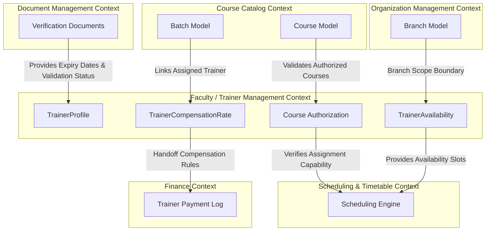

# Part 1 – Business Overview, Functional Requirements, Business Rules

## 1. Business Overview & Value Proposition
For a training institute operating across multiple branches with a mix of full-time staff, part-time instructors, and freelance domain experts, faculty management is the cornerstone of operational quality and compliance. 

The **Faculty / Trainer Management (TRN)** module addresses several critical operational pain points:
* **Cost Efficiency & Resource Utilization:** By centralizing trainer availability profiles, academic schedulers can search for under-utilized resources or view schedules across branches to optimize course delivery costs.
* **Academic Integrity:** Enforcing trainer-to-course authorization ensures that only trainers verified to hold the necessary certifications or academic degrees are assigned to deliver advanced technical courses.
* **Audit & Legal Compliance:** ASTI operates under specific local regulations in Oman. The system must verify that trainers possess valid visas, civil IDs, and ministry licenses before they can be scheduled. Automated expiry warnings prevent compliance violations.
* **Financial Clarity:** Predefining batch-specific payment metrics (hourly, session-based, student-count, or fixed) eliminates manual spreadsheets and errors in trainer fee computation, ensuring smooth downstream financial processing.

---

## 2. Detailed Functional Requirements

### FR-TRN-001: Create Trainer Profile with Person Link
* **Description & Actors:** Allows a Branch Admin or Super Admin to register a trainer in the system. The profile must link to a central `Person` record to reuse core identity variables.
* **Preconditions:**
  1. The target `Person` record must exist in the database (or be created concurrently).
  2. The executing user must possess the `trainer:create` permission.
* **Inputs:**
  * `personId` (UUID, Required)
  * `branchId` (UUID, Required - Home branch assignment)
  * `trainerType` (Enum: `FullTime`, `PartTime`, `Freelance`)
  * `specialization` (String, Max 200 chars, Required)
  * `qualificationSummary` (Text, Max 2000 chars, Optional)
  * `effectiveStartDate` (Date, Defaults to current local date)
  * `effectiveEndDate` (Date, Nullable)
* **Processing Steps:**
  1. **Branch Scoping Check:** Ensure the executing user is authorized to perform mutations in the active branch context, and that the active branch matches `branchId`.
  2. **Duplicate Link Validation:** Query the `TrainerProfile` table to verify no active or soft-deleted trainer profile is already linked to the specified `personId`. If found, throw `ERR_TRN_PERSON_ALREADY_LINKED`.
  3. **Auto-Generate Trainer Code:** Auto-generate a unique `TrainerCode` using the naming series: `TRN-YYYY-[Seq]` (where `YYYY` is the current year and `Seq` is a 4-digit sequential counter).
  4. **Active Dating Check:** Ensure `effectiveStartDate` is less than or equal to `effectiveEndDate` (if provided).
  5. **Persistence:** Write to the `TrainerProfile` table, setting `branchId` to the provided home branch (as a logical UUID reference), `status` to `Draft`, `isDeleted` to `false`, and recording audit columns.
  6. **Audit Event Trigger:** Publish the `TrainerCreated` domain event to the transactional outbox. The Audit Bounded Context will asynchronously subscribe to this event to log the entry in the centralized audit log.
* **Outputs & Postconditions:**
  * Returns the created `TrainerProfile` record with its auto-generated `trainerCode` and `id` (UUID).
  * A logical link is established between `Person` and `TrainerProfile` via `personId`.
* **Priority:** Must Have

---

### FR-TRN-002: Add Qualification & Verification Documents
* **Description & Actors:** Allows Branch Admins or Trainers (via request) to upload qualifications (degrees, professional certs) and link them to Document Management records for validation.
* **Preconditions:**
  1. The `TrainerProfile` record must exist and be active.
  2. Executing user must possess the `trainer:write` permission.
* **Inputs:**
  * `trainerId` (UUID, Required)
  * `qualificationName` (String, Max 150 chars, Required)
  * `institution` (String, Max 150 chars, Required)
  * `yearCompleted` (Int, Range: 1950 to current year, Required)
  * `documentId` (UUID, Nullable, logical reference to a valid document record in the Document Management context)
* **Processing Steps:**
  1. **Profile Validity Check:** Verify the `TrainerProfile` exists and is not soft-deleted. If not found, throw `ERR_TRN_PROFILE_NOT_FOUND`.
  2. **Year Validity Check:** Verify `yearCompleted` is not in the future. If in the future, throw `ERR_TRN_INVALID_COMPLETION_YEAR`.
  3. **Document Reference Check:** If `documentId` is provided, query the Document Management Bounded Context API to verify the document exists, is linked to the same person, has not expired, and has a verification status of `Approved`. If unverified or rejected, throw `ERR_TRN_QUALIFICATION_EXPIRED`.
  4. **Persistence:** Write record to `TrainerQualification` table with logical document references, soft delete defaults, and auditing columns.
  5. **Audit Event Trigger:** Publish `TrainerQualificationAdded` domain event to the transactional outbox.
* **Outputs & Postconditions:**
  * A new `TrainerQualification` record is saved and linked to the `TrainerProfile`.
* **Priority:** Must Have

---

### FR-TRN-003: Define Availability Windows
* **Description & Actors:** Allows a Branch Admin to define recurring weekly availability windows for a trainer, mapped to specific branches.
* **Preconditions:**
  1. The `TrainerProfile` record must exist and be active.
  2. The target `Branch` must be active (verified logically via Organization Management API).
  3. Executing user must possess the `trainer:availability-manage` permission.
* **Inputs:**
  * `trainerId` (UUID, Required)
  * `dayOfWeek` (Int, Range: 0 to 6, where 0 = Sunday, 6 = Saturday)
  * `startTime` (String, Format "HH:MM", Required)
  * `endTime` (String, Format "HH:MM", Required)
  * `branchId` (UUID, Required - logical reference)
  * `effectiveStartDate` (Date, Required)
  * `effectiveEndDate` (Date, Nullable)
* **Processing Steps:**
  1. **Branch Validity Check:** Call the Organization Management Bounded Context API to verify the target `Branch` is active. If inactive, throw `ERR_TRN_BRANCH_INACTIVE`.
  2. **Active Dating Checks:** Ensure `effectiveStartDate` is valid and `effectiveStartDate <= effectiveEndDate`.
  3. **Collision / Overlap Check:**
     * Enforce overlap check inside the Trainer Bounded Context Domain Service layer.
     * Query the `TrainerAvailability` table for the same `trainerId` and `dayOfWeek`.
     * For any overlapping effective date range (where `StartDate1 <= EndDate2` and `EndDate1 >= StartDate2`), verify that the time windows do not overlap.
     * The overlap formula: `StartTime1 < EndTime2 AND EndTime1 > StartTime2`.
     * If an overlap is detected within the same day of the week, throw `ERR_TRN_AVAILABILITY_OVERLAP`.
  4. **Persistence:** Write the availability block to `TrainerAvailability` setting status to `Active`.
  5. **Audit Event Trigger:** Publish `TrainerAvailabilityUpdated` domain event to the transactional outbox.
* **Outputs & Postconditions:**
  * The availability window is recorded, defining bounds for Scheduling sessions.
* **Priority:** Must Have

---

### FR-TRN-004: Map Authorized Courses
* **Description & Actors:** Allows the Academic Coordinator or Branch Admin to authorize a trainer to deliver specific courses, indicating their competence levels.
* **Preconditions:**
  1. Both `TrainerProfile` and the target `Course` must exist and be active (Course is verified logically).
* **Inputs:**
  * `trainerId` (UUID, Required)
  * `courseId` (UUID, Required - logical reference)
  * `effectiveStartDate` (Date, Required)
  * `effectiveEndDate` (Date, Nullable)
* **Processing Steps:**
  1. **Course Validity Check:** Query the Course Catalog Bounded Context API to check if the Course is active. If not found or status is not active, throw `ERR_TRN_COURSE_INACTIVE`.
  2. **Duplicate Authorization Check:** Check if an active authorization already exists for the same `trainerId` and `courseId` overlapping the requested date range. If yes, throw `ERR_TRN_DUPLICATE_COURSE_AUTHORIZATION`.
  3. **Persistence:** Write record to `TrainerCourseAuthorization` table with logical `courseId` reference, status tracking, and audit metrics.
  4. **Audit Event Trigger:** Publish `TrainerCourseAuthorized` domain event to the transactional outbox.
* **Outputs & Postconditions:**
  * The trainer is authorized to teach the course during the specified date range.
* **Priority:** Must Have

---

### FR-TRN-005: Track Delivery Compensation Rate
* **Description & Actors:** Allows a Branch Admin or Accountant to record the contract payment parameters for a trainer on a specific batch assignment.
* **Preconditions:**
  1. The `TrainerProfile` exists and is active.
  2. The target `Batch` is verified as active via the Training Delivery API.
  3. Executing user must have the `trainer:write` permission.
* **Inputs:**
  * `trainerId` (UUID, Required)
  * `batchId` (UUID, Required - logical reference)
  * `sessionId` (UUID, Nullable - logical reference)
  * `paymentBasis` (Enum: `PerHour`, `PerSession`, `PerStudent`, `Fixed`)
  * `amount` (Decimal, 3 decimal places, Required)
  * `remarks` (Text, Optional)
* **Processing Steps:**
  1. **Batch Validation:** Query Training Delivery Bounded Context API to verify the batch exists and is active. If not active or closed, throw `ERR_TRN_BATCH_INACTIVE`.
  2. **Decimal Check:** Ensure `amount` is positive and does not exceed scale limitations (formatted to 3 decimal places for Omani Rial precision). If negative, throw `ERR_TRN_INVALID_COMPENSATION_RATE`.
  3. **Trainer Assignment Check:** Query Training Delivery Bounded Context API to ensure the trainer is actively assigned to the target batch. If not assigned, throw `ERR_TRN_TRAINER_NOT_ASSIGNED_TO_BATCH`.
  4. **Persistence:** Save the records inside the `TrainerCompensationRate` model setting status to `Draft`. Approved compensation parameters are immutable (BR-TRN-010); any rate adjustments require creating a new rate configuration with updated effective dates.
  5. **Audit Event Trigger:** Publish `TrainerCompensationRateConfigured` domain event to the transactional outbox.
* **Outputs & Postconditions:**
  * Core compensation parameters are established for the trainer's batch delivery, ready for Finance queries.
* **Priority:** Must Have

---

### FR-TRN-006: Document Expiry Compliance Updates
* **Description & Actors:** System updates compliance status and triggers notifications when a trainer's document (civil ID, passport, visa, ministry license) is expiring or has expired.
* **Preconditions:**
  1. The Document Management Bounded Context has identified an expiring/expired document and published the corresponding event (`DocumentExpiring` or `DocumentExpired`).
  2. The target `TrainerProfile` exists and is active.
* **Inputs:**
  * Domain Event: `DocumentExpiring` or `DocumentExpired` containing `ownerId` (matching `TrainerProfile.id`), `documentType`, `expiryDate`, and `daysRemaining`.
* **Processing Steps:**
  1. **Event Reception & Context Validation:** The Trainer Bounded Context event handler receives the event and verifies that the `ownerId` corresponds to an active, non-deleted `TrainerProfile`.
  2. **Compliance State Resolution:**
     * **Warning Level (Expiry between 16 and 30 days):** Record compliance alert status on the trainer's dashboard read model, and emit `TrainerDocumentExpiring` to notify the branch manager.
     * **Critical Level (Expiry between 6 and 15 days):** Raise priority of compliance alerts.
     * **Immediate Block Level (Expiry <= 5 days or already expired):**
       * Delegate to the Trainer Application Service, which loads the `TrainerProfile` Aggregate Root and invokes its domain command method (e.g. `trainerProfile.suspend(reason)`) to update the compliance status flag to `Blocked` or transition profile status to `Suspended`.
       * The aggregate root method automatically publishes the `TrainerStatusChanged` domain event to the outbox.
       * Trigger scheduling input blocks for this trainer (preventing new session allocations).
  3. **Event Notification Handoff:** For warning and critical levels, emit the `TrainerDocumentExpiring` event to trigger branch administrator and trainer email notifications (handled by the Communication Bounded Context).
* **Outputs & Postconditions:**
  * Trainer profile scheduling flags updated; compliance status transitioned; outbox event dispatched for downstream actions.
* **Priority:** Must Have

---

## 3. Business Rules (BR-TRN)

| Rule ID | Rule Category | Description / Business Logic | System Enforcement Action |
| :--- | :--- | :--- | :--- |
| **BR-TRN-001** | Profile Lifecycle | A trainer profile must have one of these statuses: `Draft`, `Active`, `Inactive`, `Suspended`, `Archived`. | Prevent scheduling assignments if status is not `Active`. |
| **BR-TRN-002** | Person Identity | A trainer profile must link to exactly one `Person` record. A `Person` can have at most one active `TrainerProfile`. | Throw `ERR_TRN_PERSON_ALREADY_LINKED` on duplicate mapping attempts. |
| **BR-TRN-003** | Time Overlap | Availability start and end times must be defined in Gulf Standard Time (GST). `startTime` must be strictly earlier than `endTime`. | Form validation block; error code `ERR_TRN_INVALID_TIME_RANGE`. |
| **BR-TRN-004** | Collisions | Recurring branch availability slots for a single trainer must not overlap in time on the same day. | Database unique composite check or pre-write validation query checks for overlaps, throwing `ERR_TRN_AVAILABILITY_OVERLAP`. |
| **BR-TRN-005** | Document Expiry & Verification | If a trainer has expired or unverified (not `Approved` status) mandatory identification documents (Civil ID or Visa), they cannot be scheduled for new sessions. | Disable trainer select inputs in Scheduling context unless overridden by Super Admin permission `trainer:override-schedule`. |
| **BR-TRN-006** | Course Verification | A trainer cannot be assigned as the Primary Trainer for a batch unless they have an active authorization for that course. | Scheduling engine check: query `TrainerCourseAuthorization` and block assignment, throwing `ERR_TRN_COURSE_NOT_AUTHORIZED`. |
| **BR-TRN-007** | Branch Scoping | A Branch Admin can only view and modify availability records for their active branch context. | Enforce database query filtering on `branchId` using current session metadata. |
| **BR-TRN-008** | Soft Delete | Any delete operation on `TrainerProfile`, `TrainerQualification`, `TrainerAvailability`, or `TrainerCourseAuthorization` must write to `deletedAt`, `deletedBy` and set `isDeleted` to `true`. | Enforce logical soft deletes and write audit logs on all entities. |
| **BR-TRN-009** | Payment Precision | All compensation values recorded in `TrainerCompensationRate` must use exactly three decimal places (e.g. `OMR 15.000` / hour). | Reject payment entries matching scale other than 3. |
| **BR-TRN-010** | Rate Immutability | Compensation rates in `TrainerCompensationRate` are immutable once approved or disbursed. | Edits to approved rates are blocked; requires setting an end-date on the current rate and creating a new rate entry. |

---

## 4. Cross-Module Dependencies

### Detailed Dependency Explanations:
1. **Scheduling & Timetable Management (SCH):**
   * **Dependency Type:** Consumer of TRN.
   * **Logic:** When creating timetable sessions or assigning trainers to batches, the Scheduling Engine queries `TrainerAvailability` and `TrainerCourseAuthorization` inside the TRN context to verify the trainer has both the open slot and the course permission.
2. **Course Catalog Management (CAT):**
   * **Dependency Type:** Provider to TRN.
   * **Logic:** The authorization matrix (`TrainerCourseAuthorization`) references courses from the Course Catalog. Active dating checks in TRN verify that the course is currently published and active before permitting authorizations.
3. **Document Management (DOC):**
   * **Dependency Type:** Bidirectional.
   * **Logic:** Document records representing trainer visas, passports, or ministry approvals reside in the Document Management context. TRN holds foreign keys (`documentId`) to these entities, consuming their expiry dates and approval state to restrict trainer assignments.
4. **Finance & Receivables Management (FIN):**
   * **Dependency Type:** Consumer of TRN.
   * **Logic:** Downstream billing and payout tools run calculations based on the payment terms defined in `TrainerCompensationRate` records. If a trainer is hour-based, the session duration logged by scheduling is multiplied by the hourly rate from the TRN context.
