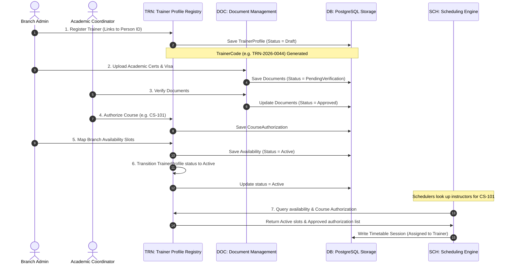
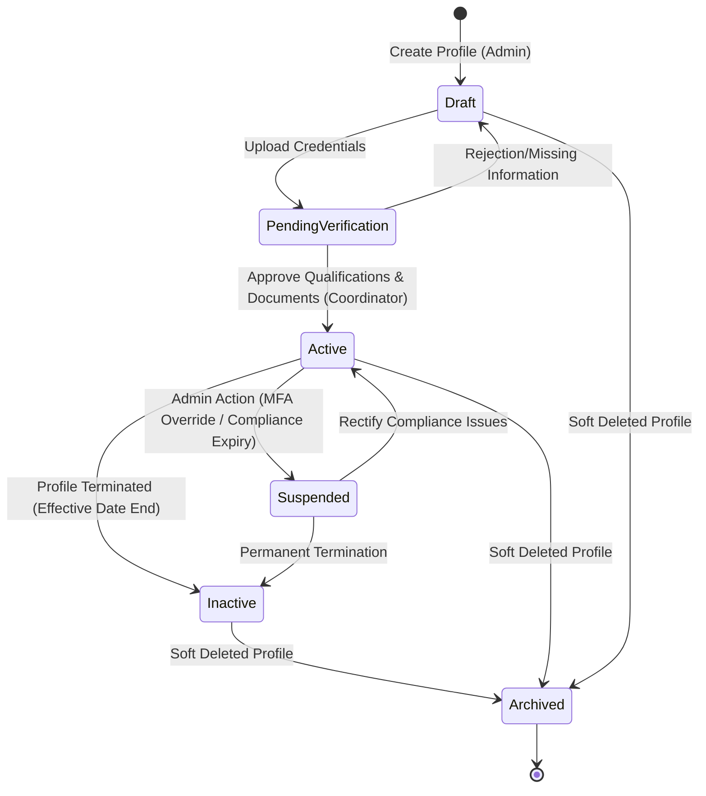

# Part 2 – User Stories, Use Cases, Workflows, State Machines

## 1. User Stories & Acceptance Criteria (BDD/Gherkin)

### US-TRN-001: Register Trainer Profile and Link to Person Record
* **User Story:** As a Branch Admin, I want to register a new trainer profile by linking it to an existing or new Person record, so that we avoid duplicate contact profiles in the system database.
* **Priority:** Must Have (MoSCoW)
* **BDD Scenario:**
  ```gherkin
  Feature: Trainer Profile Registration
    Scenario: Successfully register a trainer linked to a Person record
      Given the Branch Admin is authenticated with "trainer:create" permission
      And the active branch context is set to "ASTI Muscat"
      And a Person record exists with Mobile "+96891234567" and ID "p-8888-8888"
      And the Person "p-8888-8888" has no existing trainer profile
      When the Branch Admin registers a trainer profile with:
        | personId           | p-8888-8888 |
        | trainerType         | Freelance   |
        | specialization      | Cyber Security |
        | effectiveStartDate | 2026-07-01  |
      Then the system should generate a unique TrainerCode matching format "TRN-2026-[0-9]{4}"
      And the TrainerProfile status should be set to "Draft"
      And an audit entry "TrainerCreated" should be recorded in the AuditLog
  ```

---

### US-TRN-002: Query Trainer Availability Slots
* **User Story:** As an Academic Scheduler, I want to query a trainer's branch-specific availability slots, so that I can construct a timetable without creating schedule collisions.
* **Priority:** Must Have (MoSCoW)
* **BDD Scenario:**
  ```gherkin
  Feature: Availability Lookup
    Scenario: Fetch availability for scheduling eligibility
      Given the Scheduler is authenticated with "schedule:read" permission
      And the Trainer "TRN-2026-0012" has active availability on "Monday" from "09:00" to "13:00" at branch "ASTI Muscat"
      When the Scheduler queries availability for "TRN-2026-0012" on "Monday" for branch "ASTI Muscat"
      Then the system should return a JSON array containing the slot "09:00 - 13:00"
      And the slot status should be "Active"
  ```

---

### US-TRN-003: Review Qualifications and Authorize Course
* **User Story:** As an Academic Coordinator, I want to review a trainer's qualifications and authorize them to deliver a specific course, so that we guarantee qualification compliance.
* **Priority:** Must Have (MoSCoW)
* **BDD Scenario:**
  ```gherkin
  Feature: Course Authorization Mapping
    Scenario: Authorize course delivery for verified trainer
      Given the Academic Coordinator is authenticated with "trainer:write" permission
      And the Trainer "TRN-2026-0012" has a verified qualification "M.Sc. in Computer Science"
      And the Course "CS-101" exists and is active
      When the Academic Coordinator maps Trainer "TRN-2026-0012" to Course "CS-101" with:
        | effectiveStartDate | 2026-07-01 |
        | effectiveEndDate   | 2027-07-01 |
      Then the Course-Trainer authorization matrix should be updated
      And the trainer should be eligible for assignment to "CS-101" batches starting after "2026-07-01"
  ```

---

### US-TRN-004: Document Expiry Alert Generation
* **User Story:** As a Branch Manager, I want to receive automated warnings when a trainer's mandatory teaching license or visa is within 30 days of expiry, so that we can renew it before scheduling violations occur.
* **Priority:** Must Have (MoSCoW)
* **BDD Scenario:**
  ```gherkin
  Feature: Automated Expiry Warnings
    Scenario: Trigger alert for document expiring in 15 days
      Given the Expiry Alert Worker is scheduled to run daily
      And Trainer "TRN-2026-0045" has a Visa document expiring on "2026-07-16" (15 days from local time 2026-07-01)
      When the Expiry Alert Worker execution runs
      Then a notification with level "Critical" should be written to the Notification table for Branch Manager
      And the system should send an email to the trainer warning them of visa expiration
  ```

---

### US-TRN-005: Setup Trainer Batch Compensation Rules
* **User Story:** As an Accountant, I want to define the payment basis and compensation rates for a trainer assigned to a batch, so that we can automate payroll metrics.
* **Priority:** Must Have (MoSCoW)
* **BDD Scenario:**
  ```gherkin
  Feature: Batch Payment Mapping
    Scenario: Establish hourly payment rate for freelance trainer
      Given the Accountant is authenticated with "trainer:write" permission
      And the Trainer "TRN-2026-0012" is assigned to Batch "BATCH-SEO-09"
      When the Accountant records the payment basis details:
        | paymentBasis | PerHour |
        | amount       | 25.000  |
        | remarks      | Certified AWS Course Rate |
      Then the system should save the payment terms to the TrainerPayment table
      And the currency format must hold 3 decimal places as "OMR 25.000"
  ```

---

### US-TRN-006: Self-Service Portal Timetable Access
* **User Story:** As an ASTI Trainer, I want to access my read-only portal dashboard, so that I can view my assigned classes and upcoming schedule without admin assistance.
* **Priority:** Should Have (MoSCoW)
* **BDD Scenario:**
  ```gherkin
  Feature: Trainer Portal Dashboard
    Scenario: Trainer views their own schedule
      Given the Trainer "TRN-2026-0088" is logged into the Trainer Portal
      And the trainer is assigned to a session for "Batch A" on "2026-07-02" at "10:00"
      When the Trainer navigates to the portal schedule screen
      Then the system should display the "2026-07-02 10:00" session
      And the portal must restrict visibility so the trainer cannot view another trainer's schedule
  ```

---

### US-TRN-007: Override Scheduling Guard for Urgent Assignments
* **User Story:** As a Super Admin, I want to override a scheduling warning for an expired trainer certificate, so that we can handle emergency delivery assignments in extreme circumstances.
* **Priority:** Should Have (MoSCoW)
* **BDD Scenario:**
  ```gherkin
  Feature: Scheduling Override
    Scenario: Force schedule trainer despite document expiry
      Given the Super Admin is authenticated with "trainer:override-schedule" permission
      And the Trainer "TRN-2026-0012" has an expired teaching license
      And the system blocks standard scheduler assignment
      When the Super Admin forces the trainer assignment to Batch "BATCH-X"
      Then the system should permit the assignment
      And save the override audit details to the AuditLog with the reason "Emergency Coverage"
  ```

---

### US-TRN-008: Soft Delete Availability Windows
* **User Story:** As a Branch Admin, I want to remove an availability slot from a trainer's profile without losing historical logs of past assignments, so that reporting statistics remain clean.
* **Priority:** Must Have (MoSCoW)
* **BDD Scenario:**
  ```gherkin
  Feature: Soft Deletion of Availability
    Scenario: Soft delete a weekly availability slot
      Given the Branch Admin is authenticated with "trainer:availability-manage" permission
      And an availability slot "ID-AV-999" exists for Trainer "TRN-2026-0012"
      When the Branch Admin deletes the availability slot "ID-AV-999"
      Then the record should persist in the database with:
        | isDeleted | true |
        | deletedAt | 2026-07-01T15:19:24 |
      And the scheduling engine must ignore this slot for future calculations
  ```

---

## 2. Primary Use Cases

### Use Case 1: Register Trainer Profile
* **Primary Actor:** Branch Admin
* **Preconditions:** Executing user holds the `trainer:create` permission. The active branch context must be initialized.
* **Main Success Scenario:**
  1. The Admin opens the "Register Trainer" form.
  2. The Admin searches for an existing `Person` record using the mobile number or email.
  3. The system finds the `Person` record and auto-populates the contact details.
  4. The Admin selects the `Trainer Type` (FullTime, PartTime, Freelance), inputs specializations, and sets the effective start date.
  5. The Admin submits the form.
  6. The system checks for existing links to prevent duplicates, generates a unique `TrainerCode` (e.g. `TRN-2026-0051`), and creates the `TrainerProfile` in `Draft` state.
  7. The system registers a profile creation event in the `AuditLog` table.
* **Alternative Flows:**
  * *Alternative A: Person record not found*
    1. At Step 3, if the Person record is not found, the Admin inputs first name, last name, mobile (unique), and email (unique) to register the `Person` and `TrainerProfile` concurrently.
  * *Alternative B: Duplicate trainer mapping*
    1. At Step 6, if the selected `personId` is already linked to an active `TrainerProfile`, the system aborts the write, displays `ERR_TRN_PERSON_ALREADY_LINKED`, and returns the Admin to the edit screen.
* **Postconditions:** A new `TrainerProfile` record is saved, linked to a valid `Person` ID, in `Draft` state.

---

### Use Case 2: Update Trainer Availability
* **Primary Actor:** Branch Admin
* **Preconditions:** Executing user holds the `trainer:availability-manage` permission. The target `TrainerProfile` is in `Active` status.
* **Main Success Scenario:**
  1. The Admin navigates to the "Availability Settings" tab of the trainer's profile page.
  2. The Admin selects a Branch, Day of the Week, Start Time, End Time, and Effective Start/End dates.
  3. The Admin clicks "Save Slot".
  4. The system validates the date boundaries and checks for overlapping blocks for the same day and branch.
  5. Finding no overlaps, the system saves the record in the `TrainerAvailability` table and sets the status to `Active`.
  6. The system logs the change event in the `AuditLog` table.
* **Alternative Flows:**
  * *Alternative A: Time Slot Collision*
    1. At Step 4, if the system finds a pre-existing availability slot for the same trainer at the same branch that overlaps the new time bounds, the system rejects the transaction.
    2. The system outputs `ERR_TRN_AVAILABILITY_OVERLAP` and highlights the conflicting slot.
* **Postconditions:** A new availability window is persisted in the database and is immediately discoverable by the Scheduling Engine.

---

### Use Case 3: Authorize Course
* **Primary Actor:** Academic Coordinator
* **Preconditions:** The coordinator holds `trainer:write` permission. The course catalog contains the target course in `Published` status.
* **Main Success Scenario:**
  1. The Coordinator searches for the trainer profile.
  2. The Coordinator selects "Manage Course Authorizations".
  3. The Coordinator selects a course from the dropdown and sets the effective date ranges.
  4. The system checks that the trainer's qualifications are verified and that no duplicate authorizations overlap.
  5. The system persists the authorization configuration.
  6. The Coordinator receives a success toast notification.
* **Alternative Flows:**
  * *Alternative A: Missing / Expired Qualifications*
    1. At Step 4, if the trainer has no verified qualification or their certificate has expired, the system shows a compliance warning.
    2. If the user does not possess `trainer:override-schedule`, the save button is disabled with error `ERR_TRN_QUALIFICATION_EXPIRED`.
* **Postconditions:** The trainer is authorized to teach the selected course, enabling their selection during batch assignment.

---

### Use Case 4: Record Delivery Payment Terms
* **Primary Actor:** Accountant
* **Preconditions:** Accountant holds `trainer:write` permission. Trainer is assigned to the target batch.
* **Main Success Scenario:**
  1. The Accountant navigates to the "Trainer Fees" settings on the Batch configuration screen.
  2. The Accountant selects the assigned trainer.
  3. The Accountant chooses the payment basis (e.g. `PerHour`) and enters the amount (e.g., `20.000` OMR).
  4. The system checks that the rate formats to exactly three decimal places.
  5. The system writes the terms to the `TrainerPayment` table.
* **Alternative Flows:**
  * *Alternative A: Trainer not assigned to batch*
    1. At Step 3, if the selected trainer is not registered as an instructor for this batch, the system blocks options and displays `ERR_TRN_TRAINER_NOT_ASSIGNED_TO_BATCH`.
* **Postconditions:** Payment parameters are saved, establishing rate boundaries for future class completion pay logs.

---

## 3. Business Workflows

### Trainer Onboarding & Scheduling Eligibility Workflow
This sequence diagram shows the progress of a trainer from initial registration to scheduling availability.



---

## 4. Entity State Machines

### 4.1 Trainer Profile Status Lifecycle
The `TrainerProfile` progresses through specific workflow states:



### 4.2 Status Transition Rules Matrix

The table below outlines permitted state changes and the permissions required to trigger them:

| From Status | To Status | Trigger Action | Required Permission | Audit Event emitted |
| :--- | :--- | :--- | :--- | :--- |
| `None` | `Draft` | Initial creation / registration | `trainer:create` | `TrainerCreated` |
| `Draft` | `PendingVerification` | Qualifications and identification documents uploaded | `trainer:write` | `TrainerStatusChanged` |
| `PendingVerification` | `Active` | Verify and approve qualifications/identity docs | `trainer:write` | `TrainerStatusChanged` |
| `PendingVerification` | `Draft` | Reject verification (flag missing documents) | `trainer:write` | `TrainerStatusChanged` |
| `Active` | `Suspended` | Mandatory documents expire or disciplinary action | `trainer:suspend` | `TrainerStatusChanged` |
| `Active` | `Inactive` | Exceed effective end date or mutual contract end | `trainer:write` | `TrainerStatusChanged` |
| `Suspended` | `Active` | Resolve documentation or clearance upload | `trainer:write` | `TrainerStatusChanged` |
| `Suspended` | `Inactive` | Conclude contract while under suspension | `trainer:write` | `TrainerStatusChanged` |
| `Draft` | `Archived` | Soft-delete draft record | `trainer:write` | `TrainerStatusChanged` |
| `Active` | `Archived` | Soft-delete active record | `trainer:write` | `TrainerStatusChanged` |
| `Inactive` | `Archived` | Soft-delete inactive record | `trainer:write` | `TrainerStatusChanged` |
