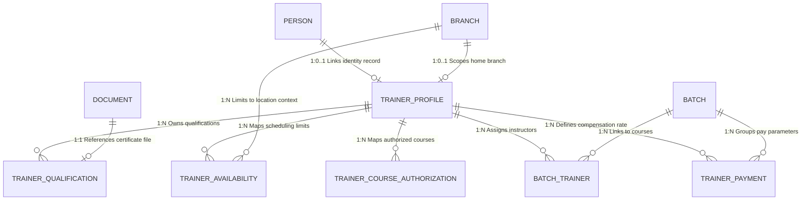

# Part 4 – Database Entities and CRUD Matrix

## 1. Entity Specifications (Prisma & PostgreSQL Models)

Below are the exact database schema declarations and configuration rules for the models owned by the Faculty / Trainer Management context.
### 1.1 Model `TrainerProfile`
* **Purpose:** Stores professional metadata for trainers. Links 1:1 to a `Person` profile.
* **Prisma Schema Definition:**
```prisma
enum TrainerType {
  FullTime
  PartTime
  Freelance
}

enum TrainerStatus {
  Draft
  PendingVerification
  Active
  Suspended
  Inactive
  Archived
}

model TrainerProfile {
  id                   String        @id @default(uuid()) @db.Uuid
  personId             String        @unique @db.Uuid
  branchId             String        @db.Uuid // Home/Primary Branch Scoping Link
  trainerCode          String        @unique @db.VarChar(50)
  trainerType          TrainerType   @default(Freelance)
  specialization       String        @db.Text
  qualificationSummary String?       @db.Text
  status               TrainerStatus @default(Draft)
  
  // Active dating
  effectiveStartDate   DateTime      @default(now()) @db.Date
  effectiveEndDate     DateTime?     @db.Date
  
  // Relations
  person               Person        @relation(fields: [personId], references: [id], onDelete: Restrict)
  branch               Branch        @relation(fields: [branchId], references: [id], onDelete: Restrict)
  qualifications       TrainerQualification[]
  availabilities       TrainerAvailability[]
  courseAuthorizations TrainerCourseAuthorization[]
  batchAssignments     BatchTrainer[]
  payments             TrainerPayment[]

  // Audit columns
  createdAt            DateTime      @default(now()) @db.Timestamptz(6)
  createdBy            String?       @db.Uuid
  updatedAt            DateTime?     @db.Timestamptz(6)
  updatedBy            String?       @db.Uuid
  deletedAt            DateTime?     @db.Timestamptz(6)
  deletedBy            String?       @db.Uuid
  isDeleted            Boolean       @default(false)

  @@index([status])
  @@index([personId])
  @@index([branchId])
  @@map("trainer_profiles")
}
```

---

### 1.2 Model `TrainerQualification`
* **Purpose:** Logs verified degrees and professional certificates. Links to file attachments.
* **Prisma Schema Definition:**
```prisma
model TrainerQualification {
  id                String         @id @default(uuid()) @db.Uuid
  trainerId         String         @db.Uuid
  qualificationName String         @db.VarChar(150)
  institution       String         @db.VarChar(150)
  yearCompleted     Int            @db.Integer
  documentId        String?        @db.Uuid // Nullable FK to Document Management context

  // Relations
  trainer           TrainerProfile @relation(fields: [trainerId], references: [id], onDelete: Restrict)

  // Audit columns
  createdAt         DateTime       @default(now()) @db.Timestamptz(6)
  createdBy         String?        @db.Uuid
  updatedAt         DateTime?      @db.Timestamptz(6)
  updatedBy         String?        @db.Uuid
  deletedAt         DateTime?      @db.Timestamptz(6)
  deletedBy         String?        @db.Uuid
  isDeleted         Boolean        @default(false)

  @@index([trainerId])
  @@map("trainer_qualifications")
}
```

---

### 1.3 Model `TrainerAvailability`
* **Purpose:** Sets weekly availability windows by branch and day-of-week.
* **Prisma Schema Definition:**
```prisma
model TrainerAvailability {
  id                 String         @id @default(uuid()) @db.Uuid
  trainerId          String         @db.Uuid
  dayOfWeek          Int            @db.Integer // 0 = Sunday, 6 = Saturday
  startTime          String         @db.VarChar(5) // Format: "HH:MM" (24h)
  endTime            String         @db.VarChar(5) // Format: "HH:MM" (24h)
  branchId           String         @db.Uuid
  status             RecordStatus   @default(Active)
  
  // Active dating
  effectiveStartDate DateTime       @default(now()) @db.Date
  effectiveEndDate   DateTime?      @db.Date

  // Relations
  trainer            TrainerProfile @relation(fields: [trainerId], references: [id], onDelete: Restrict)
  branch             Branch         @relation(fields: [branchId], references: [id], onDelete: Restrict)

  // Audit columns
  createdAt          DateTime       @default(now()) @db.Timestamptz(6)
  createdBy          String?        @db.Uuid
  updatedAt          DateTime?      @db.Timestamptz(6)
  updatedBy          String?        @db.Uuid
  deletedAt          DateTime?      @db.Timestamptz(6)
  deletedBy          String?        @db.Uuid
  isDeleted          Boolean        @default(false)

  @@index([trainerId])
  @@index([branchId])
  @@index([dayOfWeek])
  @@map("trainer_availabilities")
}
```

---

### 1.4 Model `TrainerCourseAuthorization`
* **Purpose:** Maps specific courses that a trainer is authorized to deliver.
* **Prisma Schema Definition:**
```prisma
model TrainerCourseAuthorization {
  id                 String         @id @default(uuid()) @db.Uuid
  trainerId          String         @db.Uuid
  courseId           String         @db.Uuid // FK to Course model in Course Catalog
  status             RecordStatus   @default(Active)

  // Active dating
  effectiveStartDate DateTime       @default(now()) @db.Date
  effectiveEndDate   DateTime?      @db.Date

  // Relations
  trainer            TrainerProfile @relation(fields: [trainerId], references: [id], onDelete: Restrict)

  // Audit columns
  createdAt          DateTime       @default(now()) @db.Timestamptz(6)
  createdBy          String?        @db.Uuid
  updatedAt          DateTime?      @db.Timestamptz(6)
  updatedBy          String?        @db.Uuid
  deletedAt          DateTime?      @db.Timestamptz(6)
  deletedBy          String?        @db.Uuid
  isDeleted          Boolean        @default(false)

  @@index([trainerId])
  @@index([courseId])
  @@map("trainer_course_authorizations")
}
```

---

### 1.5 Model `BatchTrainer`
* **Purpose:** Resolution table mapping primary and assistant trainer assignments to batches.
* **Prisma Schema Definition:**
```prisma
model BatchTrainer {
  id                 String         @id @default(uuid()) @db.Uuid
  batchId            String         @db.Uuid // FK to Batch model in Course Catalog
  trainerId          String         @db.Uuid
  isPrimary          Boolean        @default(true)
  
  // Active dating
  effectiveStartDate DateTime       @default(now()) @db.Date
  effectiveEndDate   DateTime?      @db.Date

  // Relations
  trainer            TrainerProfile @relation(fields: [trainerId], references: [id], onDelete: Restrict)
  // batch           Batch          @relation(fields: [batchId], references: [id], onDelete: Restrict)

  // Audit columns
  createdAt          DateTime       @default(now()) @db.Timestamptz(6)
  createdBy          String?        @db.Uuid
  updatedAt          DateTime?      @db.Timestamptz(6)
  updatedBy          String?        @db.Uuid
  deletedAt          DateTime?      @db.Timestamptz(6)
  deletedBy          String?        @db.Uuid
  isDeleted          Boolean        @default(false)

  @@unique([batchId, trainerId])
  @@index([trainerId])
  @@index([batchId])
  @@map("batch_trainers")
}
```

---

### 1.6 Model `TrainerPayment`
* **Purpose:** Configures compensation rates on a per-batch/session assignment basis.
* **Prisma Schema Definition:**
```prisma
enum PaymentBasis {
  PerHour
  PerSession
  PerStudent
  Fixed
}

enum TrainerPaymentStatus {
  Draft
  Pending
  Approved
  Disbursed
  Cancelled
}

model TrainerPayment {
  id            String               @id @default(uuid()) @db.Uuid
  trainerId     String               @db.Uuid
  batchId       String               @db.Uuid // FK to Batch model
  sessionId     String?              @db.Uuid // Nullable FK to Session model in Scheduling
  paymentBasis  PaymentBasis         @default(PerHour)
  amount        Decimal              @db.Decimal(12, 3) // Oman OMR decimal format (3 decimals)
  status        TrainerPaymentStatus @default(Draft)
  remarks       String?              @db.Text

  // Relations
  trainer       TrainerProfile @relation(fields: [trainerId], references: [id], onDelete: Restrict)

  // Audit columns
  createdAt     DateTime       @default(now()) @db.Timestamptz(6)
  createdBy     String?        @db.Uuid
  updatedAt     DateTime?      @db.Timestamptz(6)
  updatedBy     String?        @db.Uuid
  deletedAt     DateTime?      @db.Timestamptz(6)
  deletedBy     String?        @db.Uuid
  isDeleted     Boolean        @default(false)

  @@index([trainerId])
  @@index([batchId])
  @@index([status])
  @@map("trainer_payments")
}
```

---

## 2. Entity Relationships (ERD Mapping)



### Relationship Constraints Summary:
1. **`Person` to `TrainerProfile` (1:1):** 
   * **Foreign Key:** `TrainerProfile.personId` references `Person.id`.
   * **Behavior:** `onDelete: Restrict`. To delete a `Person`, any active/linked `TrainerProfile` must first be archived or unlinked.
2. **`Branch` to `TrainerProfile` (1:1):**
   * **Foreign Key:** `TrainerProfile.branchId` references `Branch.id`.
   * **Behavior:** `onDelete: Restrict`. A branch cannot be deleted if active trainer profiles are scoped to it.
3. **`TrainerProfile` to `TrainerAvailability` (1:N):**
   * **Foreign Key:** `TrainerAvailability.trainerId` references `TrainerProfile.id`.
   * **Behavior:** `onDelete: Restrict`. A trainer profile cannot be hard-deleted or unlinked if availability records exist; the application layer handles cascading soft-deletion logically.
4. **`TrainerProfile` to `TrainerCourseAuthorization` (1:N):**
   * **Foreign Key:** `TrainerCourseAuthorization.trainerId` references `TrainerProfile.id`.
   * **Behavior:** `onDelete: Restrict`. Cleaned up via logical soft-deletion.
5. **`Branch` to `TrainerAvailability` (1:N):**
   * **Foreign Key:** `TrainerAvailability.branchId` references `Branch.id`.
   * **Behavior:** `onDelete: Restrict`. Active branches containing mapped slots cannot be deleted until those blocks are soft-deleted or migrated.

---

## 3. CRUD & Branch-Scoping Security Matrix

This matrix outlines user access controls scoped to active branches. Branch isolation ensures that non-super admin users can only view or modify records belonging to their active branch context.

| Entity | Super Admin | Branch Admin | Academic Coordinator | Trainer (Portal Access) | System Worker |
| :--- | :--- | :--- | :--- | :--- | :--- |
| **TrainerProfile** | **CRUD**<br>No Scoping Limits. | **CRU**<br>Only if Trainer is assigned to Admin's active branch (`TrainerProfile.branchId`). | **R**<br>Only if Trainer is assigned to Coordinator's active branch (`TrainerProfile.branchId`). | **R**<br>Only reads their own profile. | **RU**<br>Logs background status updates. |
| **TrainerQualification** | **CRUD**<br>No Scoping Limits. | **CRU**<br>Only if Trainer is assigned to Admin's active branch. | **R**<br>Only reads qualifications of local branch trainers. | **CR**<br>Allows uploading certs to their own profile. | **R**<br>Reads document attachments. |
| **TrainerAvailability** | **CRUD**<br>No Scoping Limits. | **CRUD**<br>Restricted to Admin's active branch settings. | **R**<br>Queries slots of local branch trainers. | **R**<br>Reads their own schedules. | **R**<br>Provides data to Scheduling engine. |
| **TrainerCourseAuthorization** | **CRUD**<br>No Scoping Limits. | **CRUD**<br>Restricted to Admin's active branch settings. | **CR**<br>Allows coordinating authorized courses for active branch. | **R**<br>Reads their own authorizations. | **R**<br>Provides data to Scheduling engine. |
| **BatchTrainer** | **CRUD**<br>No Scoping Limits. | **CRUD**<br>Restricted to batches running at active branch. | **CRUD**<br>Restricted to batches running at active branch. | **R**<br>Reads their own batch assignments. | **R**<br>Verifies classroom bookings. |
| **TrainerPayment** | **CRUD**<br>No Scoping Limits. | **CRU**<br>Restricted to rates running at active branch. | **No Access**<br>Hidden entirely. | **No Access**<br>Hidden entirely. | **R**<br>Calculates downstream invoice logs. |

### CRUD Terminology Reference:
* **C (Create):** Write new records.
* **R (Read):** Query and display records.
* **U (Update):** Modify existing records.
* **D (Delete):** Trigger soft deletion (`isDeleted = true`).
* **Audit (Scope Rule):** All mutation attempts execute security filters mapping `session.activeBranchId` against the table's `branchId` column server-side. If a validation failure occurs, the database transaction is rolled back with error `ERR_TRN_BRANCH_ACCESS_DENIED`.

---

## 4. Note on Compliance Document Mapping
The Faculty / Trainer Management module does not own general compliance or identification document tables (Civil ID, Passport, Visa, Ministry Licenses). Instead, these files are stored in the shared `Document` table owned by the **Document Management Context** where:
* `ownerType` = `'Trainer'`
* `ownerId` = `TrainerProfile.id`

These documents are integrated into the compliance engine via cross-context queries. Every document query and mutation checks verification status (`Approved` in Document Management) and validity (`expiryDate > current_date`) to enforce business rules.
