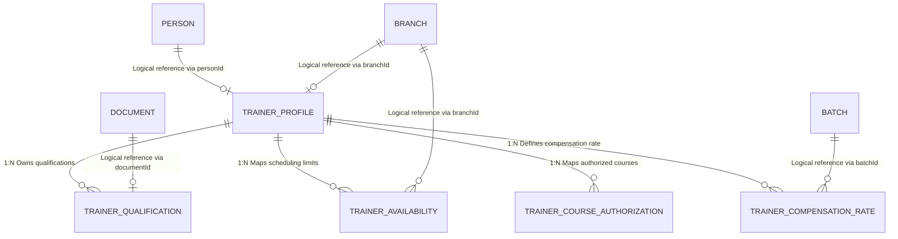

# Part 4 – Database Entities and CRUD Matrix

## 1. Entity Specifications (Prisma & PostgreSQL Models)

Below are the exact database schema declarations and configuration rules for the models owned by the Faculty / Trainer Management context.
### 1.1 Model `TrainerProfile`
* **Purpose:** Stores professional metadata for trainers. Links 1:1 to a `Person` profile.
* **Prisma Schema Definition:**
```prisma
enum TrainerType {
  FullTime
  PartTime
  Freelance
}

enum TrainerStatus {
  Draft
  PendingVerification
  Active
  Suspended
  Inactive
  Archived
}

enum RecordStatus {
  Active
  Inactive
}

enum TrainerCompensationRateStatus {
  Draft
  Approved
  Cancelled
}

model TrainerProfile {
  id                   String        @id @default(uuid()) @db.Uuid
  personId             String        @db.Uuid // Logical reference to Person in Identity / Access Bounded Context
  branchId             String        @db.Uuid // Logical reference to home Branch scoping context in Organization Bounded Context
  trainerCode          String        @unique @db.VarChar(50)
  trainerType          TrainerType   @default(Freelance)
  specialization       String        @db.Text
  qualificationSummary String?       @db.Text
  status               TrainerStatus @default(Draft)
  
  // Active dating
  effectiveStartDate   DateTime      @default(now()) @db.Date
  effectiveEndDate     DateTime?     @db.Date
  
  // Relations (Local Context Only)
  qualifications       TrainerQualification[]
  availabilities       TrainerAvailability[]
  courseAuthorizations TrainerCourseAuthorization[]
  compensationRates    TrainerCompensationRate[]

  // Audit columns
  createdAt            DateTime      @default(now()) @db.Timestamptz(6)
  createdBy            String?       @db.Uuid
  updatedAt            DateTime?     @db.Timestamptz(6)
  updatedBy            String?       @db.Uuid
  deletedAt            DateTime?     @db.Timestamptz(6)
  deletedBy            String?       @db.Uuid
  isDeleted            Boolean       @default(false)

  @@index([status])
  @@index([branchId])
  @@unique([personId, deletedAt])
  @@map("trainer_profiles")
}
```

---

### 1.2 Model `TrainerQualification`
* **Purpose:** Logs verified degrees and professional certificates. Links to file attachments.
* **Prisma Schema Definition:**
```prisma
model TrainerQualification {
  id                String         @id @default(uuid()) @db.Uuid
  trainerId         String         @db.Uuid
  qualificationName String         @db.VarChar(150)
  institution       String         @db.VarChar(150)
  yearCompleted     Int            @db.Integer
  documentId        String?        @db.Uuid // Logical reference to Document model in Document Bounded Context

  // Relations
  trainer           TrainerProfile @relation(fields: [trainerId], references: [id], onDelete: Restrict)

  // Audit columns
  createdAt         DateTime       @default(now()) @db.Timestamptz(6)
  createdBy         String?        @db.Uuid
  updatedAt         DateTime?      @db.Timestamptz(6)
  updatedBy         String?        @db.Uuid
  deletedAt         DateTime?      @db.Timestamptz(6)
  deletedBy         String?        @db.Uuid
  isDeleted         Boolean        @default(false)

  @@index([trainerId])
  @@index([documentId])
  @@map("trainer_qualifications")
}
```

---

### 1.3 Model `TrainerAvailability`
* **Purpose:** Sets weekly availability windows by branch and day-of-week.
* **Prisma Schema Definition:**
```prisma
model TrainerAvailability {
  id                 String         @id @default(uuid()) @db.Uuid
  trainerId          String         @db.Uuid
  dayOfWeek          Int            @db.Integer // 0 = Sunday, 6 = Saturday
  startTime          String         @db.VarChar(5) // Format: "HH:MM" (24h)
  endTime            String         @db.VarChar(5) // Format: "HH:MM" (24h)
  branchId           String         @db.Uuid // Logical reference to Branch in Organization Bounded Context
  status             RecordStatus   @default(Active)
  
  // Active dating
  effectiveStartDate DateTime       @default(now()) @db.Date
  effectiveEndDate   DateTime?      @db.Date

  // Relations
  trainer            TrainerProfile @relation(fields: [trainerId], references: [id], onDelete: Restrict)

  // Audit columns
  createdAt          DateTime       @default(now()) @db.Timestamptz(6)
  createdBy          String?        @db.Uuid
  updatedAt          DateTime?      @db.Timestamptz(6)
  updatedBy          String?        @db.Uuid
  deletedAt          DateTime?      @db.Timestamptz(6)
  deletedBy          String?        @db.Uuid
  isDeleted          Boolean        @default(false)

  @@index([trainerId])
  @@index([branchId])
  @@index([dayOfWeek])
  @@index([trainerId, dayOfWeek]) // Optimized lookup for availability collision detection
  @@map("trainer_availabilities")
}
```

---

### 1.4 Model `TrainerCourseAuthorization`
* **Purpose:** Maps specific courses that a trainer is authorized to deliver.
* **Prisma Schema Definition:**
```prisma
model TrainerCourseAuthorization {
  id                 String         @id @default(uuid()) @db.Uuid
  trainerId          String         @db.Uuid
  courseId           String         @db.Uuid // Logical reference to Course model in Course Catalog Bounded Context
  status             RecordStatus   @default(Active)

  // Active dating
  effectiveStartDate DateTime       @default(now()) @db.Date
  effectiveEndDate   DateTime?      @db.Date

  // Relations
  trainer            TrainerProfile @relation(fields: [trainerId], references: [id], onDelete: Restrict)

  // Audit columns
  createdAt          DateTime       @default(now()) @db.Timestamptz(6)
  createdBy          String?        @db.Uuid
  updatedAt          DateTime?      @db.Timestamptz(6)
  updatedBy          String?        @db.Uuid
  deletedAt          DateTime?      @db.Timestamptz(6)
  deletedBy          String?        @db.Uuid
  isDeleted          Boolean        @default(false)

  @@index([trainerId])
  @@index([courseId])
  @@index([trainerId, courseId]) // Optimized lookup for course authorization checks
  @@map("trainer_course_authorizations")
}
```

---

### 1.5 Model `TrainerCompensationRate`
* **Purpose:** Configures compensation rates on a per-batch/session assignment basis.
* **Prisma Schema Definition:**
```prisma
enum PaymentBasis {
  PerHour
  PerSession
  PerStudent
  Fixed
}

model TrainerCompensationRate {
  id            String                        @id @default(uuid()) @db.Uuid
  trainerId     String                        @db.Uuid
  batchId       String                        @db.Uuid // Logical reference to Batch model in Course Catalog
  sessionId     String?                       @db.Uuid // Logical reference to Session model in Scheduling
  paymentBasis  PaymentBasis                  @default(PerHour)
  amount        Decimal                       @db.Decimal(12, 3) // Oman OMR decimal format (3 decimals)
  status        TrainerCompensationRateStatus @default(Draft)
  remarks       String?                       @db.Text

  // Active dating
  effectiveStartDate DateTime      @default(now()) @db.Date
  effectiveEndDate   DateTime?     @db.Date

  // Relations
  trainer       TrainerProfile @relation(fields: [trainerId], references: [id], onDelete: Restrict)

  // Audit columns
  createdAt     DateTime       @default(now()) @db.Timestamptz(6)
  createdBy     String?        @db.Uuid
  updatedAt     DateTime?      @db.Timestamptz(6)
  updatedBy     String?        @db.Uuid
  approvedAt    DateTime?      @db.Timestamptz(6) // Payout audit status date
  approvedBy    String?        @db.Uuid
  deletedAt     DateTime?      @db.Timestamptz(6)
  deletedBy     String?        @db.Uuid
  isDeleted     Boolean        @default(false)

  @@index([trainerId])
  @@index([batchId])
  @@index([sessionId])
  @@index([status])
  @@map("trainer_compensation_rates")
}
```

---
## 2. Entity Relationships (ERD Mapping)



### Relationship Constraints Summary (Logical Boundaries):
1. **`Person` to `TrainerProfile` (Logical Link):** 
   * **Foreign Key:** `TrainerProfile.personId` is a logical UUID reference to `Person.id` owned by the Identity & Access context.
   * **Behavior:** Handled in the application service layer. To delete or archive a `Person`, the identity context publishes an event which is subscribed to by the Trainer context to handle corresponding profile archiving. No physical database cascade constraints exist.
2. **`Branch` to `TrainerProfile` (Logical Link):**
   * **Foreign Key:** `TrainerProfile.branchId` is a logical UUID reference to `Branch.id` in the Organization context.
   * **Behavior:** Verification of branch existence is handled logically during trainer profile creation.
3. **`TrainerProfile` to `TrainerAvailability` (Local Context 1:N):**
   * **Foreign Key:** `TrainerAvailability.trainerId` references `TrainerProfile.id` with a physical database relation (`onDelete: Restrict`). Since both belong to the same Bounded Context (TRN), physical constraints are permitted.
4. **`TrainerProfile` to `TrainerCourseAuthorization` (Local Context 1:N):**
   * **Foreign Key:** `TrainerCourseAuthorization.trainerId` references `TrainerProfile.id` physically. Cleaned up via logical soft-deletion.
5. **`Branch` to `TrainerAvailability` (Logical Link):**
   * **Foreign Key:** `TrainerAvailability.branchId` is a logical reference to `Branch.id` in the Organization context. No physical constraint exists.
6. **`TrainerProfile` to `TrainerCompensationRate` (Local Context 1:N):**
   * **Foreign Key:** `TrainerCompensationRate.trainerId` references `TrainerProfile.id` physically. Cleaned up via logical soft-deletion.


---

## 3. CRUD & Branch-Scoping Security Matrix

This matrix outlines user access controls scoped to active branches. Branch isolation ensures that non-super admin users can only view or modify records belonging to their active branch context.

| Entity | Super Admin | Branch Admin | Academic Coordinator | Trainer (Portal Access) | System Worker |
| :--- | :--- | :--- | :--- | :--- | :--- |
| **TrainerProfile** | **CRUD**<br>No Scoping Limits. | **CRU**<br>Only if Trainer is assigned to Admin's active branch (`TrainerProfile.branchId`). | **R**<br>Only if Trainer is assigned to Coordinator's active branch (`TrainerProfile.branchId`). | **R**<br>Only reads their own profile. | **RU**<br>Logs background status updates. |
| **TrainerQualification** | **CRUD**<br>No Scoping Limits. | **CRU**<br>Only if Trainer is assigned to Admin's active branch. | **R**<br>Only reads qualifications of local branch trainers. | **CR**<br>Allows uploading certs to their own profile. | **R**<br>Reads document attachments. |
| **TrainerAvailability** | **CRUD**<br>No Scoping Limits. | **CRUD**<br>Restricted to Admin's active branch settings. | **R**<br>Queries slots of local branch trainers. | **R**<br>Reads their own schedules. | **R**<br>Provides data to Scheduling engine. |
| **TrainerCourseAuthorization** | **CRUD**<br>No Scoping Limits. | **CRUD**<br>Restricted to Admin's active branch settings. | **CR**<br>Allows coordinating authorized courses for active branch. | **R**<br>Reads their own authorizations. | **R**<br>Provides data to Scheduling engine. |
| **TrainerCompensationRate** | **CRUD**<br>No Scoping Limits (Rates are temporal/immutable once approved). | **CRU**<br>Restricted to rates running at active branch (Rates are temporal/immutable once approved). | **No Access**<br>Hidden entirely. | **No Access**<br>Hidden entirely. | **R**<br>Calculates downstream invoice logs. |

### CRUD Terminology Reference:
* **C (Create):** Write new records.
* **R (Read):** Query and display records.
* **U (Update):** Modify existing records. Approved rates in `TrainerCompensationRate` and active authorizations in `TrainerCourseAuthorization` are immutable or temporal configuration data. In-place overwrites of financial/dating fields are strictly blocked; updates must be executed by setting `effectiveEndDate` and `status` to Cancelled/Inactive on the active record and creating a new record (versioning). No other fields (like `amount`, `paymentBasis`, `trainerId`, or `batchId`) are mutable on approved records.
* **D (Delete):** Trigger soft deletion (`isDeleted = true`).
* **Audit (Scope Rule):** All mutation attempts execute security filters mapping `session.activeBranchId` against the table's `branchId` column server-side. If a validation failure occurs, the database transaction is rolled back with error `ERR_TRN_BRANCH_ACCESS_DENIED`.

---

## 4. Note on Compliance Document Mapping
The Faculty / Trainer Management module does not own general compliance or identification document tables (Civil ID, Passport, Visa, Ministry Licenses). Instead, these files are stored in the shared `Document` table owned by the **Document Management Context** where:
* `ownerType` = `'Trainer'`
* `ownerId` = `TrainerProfile.id`

These documents are integrated into the compliance engine via cross-context queries. Every document query and mutation checks verification status (`Approved` in Document Management) and validity (`expiryDate > current_date`) to enforce business rules. Logical reference checks are enforced in the Application/Domain layer.
