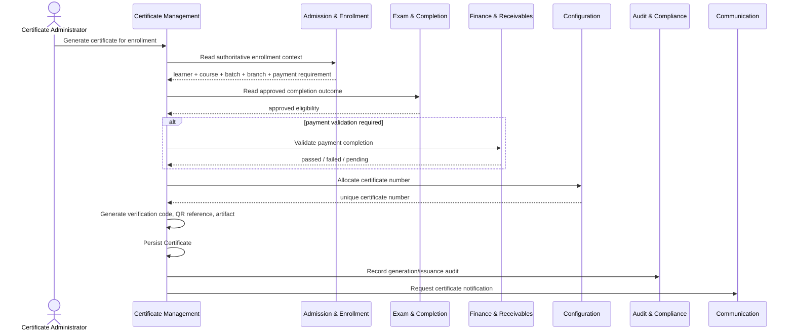
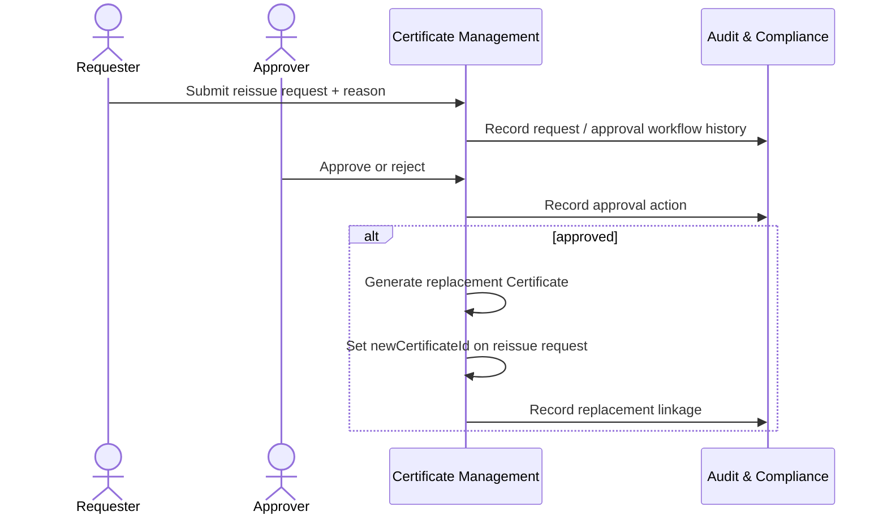

# Part 1 – Business Overview, Functional Requirements, Business Rules

## Module 11 – Certificate Management

## 1. Introduction

Certificate Management is the terminal credentialing capability in the ASTI learner journey. A learner may arrive through regular admission, online registration, walk-in fast track, or corporate nomination, but every valid learning journey must resolve to the central `Enrollment` aggregate. Certificate issuance therefore begins from a valid enrollment and consumes the results of upstream completion and finance validation; it does not bypass or replace those domains.

The module provides a controlled registry of certificates and supports generation, issuance, bilingual language selection, unique numbering, QR-based public verification, reissue processing, revocation, audit integration, notification requests, and reporting consumption.

The governing ownership chain is:

```text
Course Catalog
    owns completion rules
        ↓
Exam, Result & Completion
    evaluates rules and approves completion
        ↓
Finance & Receivables
    supplies payment validation where required
        ↓
Certificate Management
    generates, issues, verifies, reissues, and revokes certificates
```

The Certificate aggregate must link to an `Enrollment`. The current ER model stores certificate references to the enrollment, student profile, course, and batch, while the enrollment remains the central transaction that establishes the learner-course-batch relationship.

### 1.1 Business Benefits

1. **Integrity of credentials:** certificates cannot be issued merely because a student exists or has attended training; issuance requires approved completion eligibility and payment validation where configured.
2. **Reduced fraud risk:** unique certificate numbers and verification codes support authenticity checks.
3. **Faster verification:** employers, corporate clients, learners, and other public verifiers can confirm certificate status without manual calls to ASTI.
4. **Operational consistency:** all branches use the same controlled issuance workflow and permission model.
5. **Traceable reissue handling:** replacement certificates require reason, approval, and linkage to the original request.
6. **Historical preservation:** revocation and replacement do not destroy the original record.
7. **DDD integrity:** certificate logic remains in its bounded context while completion, finance, enrollment, identity, audit, communication, and reporting responsibilities remain with their owners.
8. **Bilingual readiness:** certificate language can be recorded as English or Arabic where required.
9. **Audit readiness:** sensitive lifecycle changes are attributable to a user and reason through the audit subsystem.
10. **Branch confidentiality:** users cannot access certificate transactions outside effective server-side branch scope.

---

## 2. Domain Boundary and Core Data Model

### 2.1 Certificate-Owned ER Entities

#### Certificate

```text
id
certificateNumber
enrollmentId
studentProfileId
courseId
batchId
issuedDate
issuedBy
certificateStatus
certificateUrl
verificationCode
qrCodeUrl
language
```

#### CertificateVerification

```text
id
certificateId
verificationCode
verifiedAt
verifiedByIp
verificationStatus
```

#### CertificateReissueRequest

```text
id
certificateId
requestedBy
reason
status
approvedBy
approvedAt
newCertificateId
```

### 2.2 Upstream Read Dependencies

- `Enrollment` for enrollment identity, learner, course, batch, branch, payment validation requirement, and summary states.
- `CourseCompletion` / `CompletionApproval` for approved completion outcome.
- Finance-owned invoice/payment/receivable data or an application-level payment validation decision.
- `StudentProfile` and `Person` for certificate display data.
- `Course` for course name and language-specific rendering data.
- `Batch` for batch reference data.
- `NumberingSeries` for certificate-number allocation.
- `UserBranchAccess` for effective branch scope.

### 2.3 Downstream Integration Dependencies

- Audit events to Audit & Compliance.
- Notification requests to Communication & Notification.
- Read-only facts/read models to Reporting & Executive Dashboards.

---

## 3. Detailed Functional Requirements

### FR-CERT-001 – List Certificate-Ready Enrollments

**Description & Actors**  
The system shall provide authorized Certificate Administrators and managers with a branch-scoped list of enrollments whose completion outcome is approved and that have not already resulted in an active issued certificate.

**Preconditions**

- Actor is authenticated.
- Actor has `certificate.read` or equivalent permission.
- Actor has effective access to the enrollment branch.
- Upstream completion data is available.

**Inputs**

- Branch scope derived from authenticated user access.
- Optional course ID.
- Optional batch ID.
- Optional completion approval date range.
- Optional learner/enrollment search term.
- Pagination and sorting parameters.

**Processing Steps**

1. Resolve effective branch scope server-side.
2. Query approved completion outcomes.
3. Join/read enrollment identity and course/batch/student display references.
4. Exclude enrollments with an active issued certificate.
5. Apply filters and pagination.
6. Return readiness status and blockers without recalculating completion rules.

**Outputs & Postconditions**

- Paginated list of certificate-ready enrollment projections.
- No certificate transaction is created or changed.

**Priority:** Must

---

### FR-CERT-002 – Resolve Certificate Source Context

**Description & Actors**  
Before generation, the system shall resolve and display the authoritative enrollment, student, course, batch, and branch context for the selected enrollment.

**Preconditions**

- Enrollment ID exists.
- Actor has branch-scoped read access.

**Inputs**

- `enrollmentId`.

**Processing Steps**

1. Read the Enrollment aggregate reference data.
2. Resolve student profile/person display data.
3. Resolve course display data.
4. Resolve batch display data.
5. Resolve branch context.
6. Reject the operation if references are missing or inconsistent.

**Outputs & Postconditions**

- A validated certificate-source projection.
- No duplicated person/student/course/batch data is created.

**Priority:** Must

---

### FR-CERT-003 – Validate Approved Completion Eligibility

**Description & Actors**  
The system shall require an approved completion outcome before allowing certificate generation.

**Actors:** Certificate Administrator; Exam/Completion application contract as upstream system actor.

**Preconditions**

- Valid enrollment exists.
- Completion evaluation and approval workflow belong to Exam, Result & Completion.

**Inputs**

- `enrollmentId`.

**Processing Steps**

1. Read the authoritative course completion record for the enrollment.
2. Verify the completion status represents approved completion eligibility.
3. Verify required approval workflow outcome is complete.
4. Do not independently calculate attendance percentage, exam pass result, or completion rules.
5. Block generation with an explicit reason when completion is not approved.

**Outputs & Postconditions**

- `eligible=true` for approved completion, or a controlled blocker result.
- No mutation of completion records.

**Priority:** Must

---

### FR-CERT-004 – Validate Payment Requirement and Payment Completion

**Description & Actors**  
The system shall enforce payment validation only where the enrollment/course completion configuration requires it, using Finance-owned payment truth.

**Actors:** Certificate Administrator; Finance application contract.

**Preconditions**

- Completion eligibility is approved.
- Enrollment is valid.

**Inputs**

- `enrollmentId`.
- Enrollment `paymentValidationRequired` flag and/or authoritative completion/payment-required policy result.

**Processing Steps**

1. Determine whether payment validation is required from authoritative source data.
2. If not required, mark the payment gate as satisfied.
3. If required, request/read a Finance-owned payment validation decision.
4. Do not calculate invoice balances inside Certificate Management.
5. Block certificate generation when validation is failed or unresolved.

**Outputs & Postconditions**

- Payment gate result: not required, passed, failed, or pending/unavailable.
- No Finance record is changed.

**Priority:** Must

---

### FR-CERT-005 – Prevent Duplicate Active Certificate

**Description & Actors**  
The system shall prevent more than one active issued certificate for the same enrollment except through a controlled reissue lifecycle.

**Actors:** Certificate Administrator; Reissue Approver.

**Preconditions**

- Valid enrollment ID.

**Inputs**

- `enrollmentId`.

**Processing Steps**

1. Search Certificate records for the enrollment.
2. Identify active/generated/issued state according to lifecycle policy.
3. Reject normal generation if an active issued certificate exists.
4. Direct replacement needs to the reissue workflow.
5. Enforce database/application idempotency and uniqueness strategy under concurrent requests.

**Outputs & Postconditions**

- Generation proceeds only when the invariant is satisfied.
- Duplicate certificate issuance is prevented.

**Priority:** Must

---

### FR-CERT-006 – Allocate Certificate Number

**Description & Actors**  
The system shall allocate a unique certificate number using the Configuration / Master Data `NumberingSeries` capability.

**Actors:** Certificate generation application service; Configuration application contract.

**Preconditions**

- All eligibility gates pass.
- Certificate numbering series is active and valid for applicable scope.

**Inputs**

- Entity type `Certificate`.
- Applicable branch ID where numbering is branch-scoped.
- Current business date/year as required by the series format.

**Processing Steps**

1. Resolve active numbering series.
2. Allocate the next number atomically.
3. Apply prefix, suffix, year format, and padding rules.
4. Validate uniqueness.
5. Fail safely if no valid series is configured.

**Outputs & Postconditions**

- Unique `certificateNumber` reserved/assigned to the new Certificate.

**Priority:** Must

---

### FR-CERT-007 – Generate Unique Verification Code

**Description & Actors**  
The system shall generate a cryptographically strong, non-guessable, unique verification code for public certificate verification.

**Actors:** Certificate generation service.

**Preconditions**

- Certificate generation transaction is valid.

**Inputs**

- System entropy source; no learner PII is used as the public secret.

**Processing Steps**

1. Generate an opaque verification code.
2. Check/enforce uniqueness.
3. Persist the code with the Certificate.
4. Retry safely on uniqueness collision without creating duplicate certificates.

**Outputs & Postconditions**

- Unique `verificationCode` associated with exactly one Certificate.

**Priority:** Must

---

### FR-CERT-008 – Generate QR Verification Reference

**Description & Actors**  
The system shall generate a QR code reference/URL that directs a verifier to the public certificate verification flow.

**Actors:** Certificate generation service; Public Verifier.

**Preconditions**

- Unique verification code exists.

**Inputs**

- Verification route base configuration.
- Opaque verification code or equivalent safe reference.

**Processing Steps**

1. Construct public verification target.
2. Ensure target contains no unnecessary PII.
3. Generate QR artifact/reference.
4. Persist `qrCodeUrl` or approved QR reference on the Certificate according to the ER model.

**Outputs & Postconditions**

- QR code reference suitable for rendering into the certificate template.

**Priority:** Must

---

### FR-CERT-009 – Render Certificate from Approved Current Template

**Description & Actors**  
The system shall render the certificate using the single hardcoded certificate template approved for the current implementation.

**Actors:** Certificate Administrator; certificate rendering service.

**Preconditions**

- Eligibility and payment gates pass.
- Certificate number, verification code, and QR reference are available.
- Source learner/course data is resolvable.

**Inputs**

- Certificate number.
- Learner display name.
- Course display name.
- Issue-related data.
- Verification QR reference.
- Selected language.

**Processing Steps**

1. Select the current hardcoded certificate template.
2. Resolve language-specific fields.
3. Render learner name and course data according to approved presentation rules.
4. Render certificate number and QR verification element.
5. Generate the artifact.
6. Store through infrastructure storage adapter.
7. Capture durable `certificateUrl` reference.

**Outputs & Postconditions**

- Generated certificate artifact.
- Certificate metadata contains artifact reference.

**Priority:** Must

---

### FR-CERT-010 – Support English and Arabic Certificate Language

**Description & Actors**  
The system shall support certificate generation in English or Arabic where required and persist the selected language.

**Actors:** Certificate Administrator.

**Preconditions**

- Required localized source data is available or approved fallback policy applies.

**Inputs**

- `language`: English or Arabic.

**Processing Steps**

1. Validate language against supported values.
2. Resolve matching localized course/person display text according to source model and presentation policy.
3. Render correct template language direction and labels.
4. Persist selected language on the Certificate.

**Outputs & Postconditions**

- Certificate artifact and metadata reflect selected language.

**Priority:** Must

---

### FR-CERT-011 – Create Certificate Record

**Description & Actors**  
The system shall persist a Certificate record only after all mandatory invariants are satisfied.

**Actors:** Certificate Administrator; generation service.

**Preconditions**

- Completion approved.
- Payment validation passed when required.
- No duplicate active certificate exists.
- Numbering and verification code allocation succeeded.
- Artifact generation/storage succeeded or approved transactional compensation strategy is followed.

**Inputs**

- `certificateNumber`.
- `enrollmentId`.
- `studentProfileId`.
- `courseId`.
- `batchId`.
- `certificateStatus` initial lifecycle value.
- `certificateUrl`.
- `verificationCode`.
- `qrCodeUrl`.
- `language`.

**Processing Steps**

1. Revalidate authoritative enrollment linkage.
2. Revalidate duplicate protection in the command transaction.
3. Persist Certificate.
4. Record audit event.
5. Return certificate identity and current state.

**Outputs & Postconditions**

- One Certificate record exists and links to the enrollment.
- Audit record is requested/recorded.

**Priority:** Must

---

### FR-CERT-012 – Issue Certificate

**Description & Actors**  
The system shall allow an explicitly authorized user to transition a generated/ready certificate into issued state.

**Actors:** Certificate Administrator or authorized management user.

**Preconditions**

- Actor has `certificate.issue`.
- Certificate is in an issuable state.
- Certificate is within effective branch scope.
- Required artifact exists.
- Source eligibility has not been invalidated by an approved business process.

**Inputs**

- `certificateId`.
- Optional issuance remarks where policy requires.

**Processing Steps**

1. Load Certificate under branch scope.
2. Validate current status transition.
3. Validate source references and mandatory gates.
4. Set `issuedDate` to authoritative business timestamp.
5. Set `issuedBy` to authenticated user.
6. Set certificate status to issued.
7. Record audit event.
8. Raise in-process `CertificateGenerated`/issuance lifecycle event as modeled.
9. Request notification through Communication context if configured.

**Outputs & Postconditions**

- Certificate is issued and immutable for core identity/number fields except controlled correction/reissue policy.
- Issuer and issue timestamp are recorded.

**Priority:** Must

---

### FR-CERT-013 – Maintain Certificate Lifecycle Status

**Description & Actors**  
The system shall represent certificate lifecycle changes through controlled status transitions rather than hard deletion.

**Actors:** Certificate Administrator; Reissue Approver; Revocation Approver.

**Preconditions**

- Certificate exists.
- Actor has action-specific permission.

**Inputs**

- Certificate ID.
- Requested transition.
- Reason where required.

**Processing Steps**

1. Load current state.
2. Validate allowed transition.
3. Apply action-specific authorization and business rules.
4. Persist status change.
5. Record old/new value and reason in Audit & Compliance.

**Outputs & Postconditions**

- Certificate status reflects valid lifecycle state.
- Historical record remains preserved.

**Priority:** Must

---

### FR-CERT-014 – Search and Filter Certificate Registry

**Description & Actors**  
Authorized internal users shall search certificates using indexed, branch-scoped criteria.

**Actors:** Certificate Administrator, Branch Manager, Audit/Compliance user.

**Preconditions**

- Actor has `certificate.read`.

**Inputs**

- Certificate number.
- Learner name/student number search term.
- Enrollment number.
- Course ID.
- Batch ID.
- Certificate status.
- Language.
- Issue date range.
- Branch selection within allowed scope.
- Pagination/sort.

**Processing Steps**

1. Resolve allowed branch IDs.
2. Apply authorization scope before business filters.
3. Query certificate records/read projection.
4. Apply pagination and stable sorting.
5. Return only permitted columns.

**Outputs & Postconditions**

- Paginated certificate registry result.
- No cross-branch leakage.

**Priority:** Must

---

### FR-CERT-015 – View Certificate Detail

**Description & Actors**  
Authorized users shall view certificate metadata, source references, verification state summary, and reissue lineage within branch scope.

**Actors:** Certificate Administrator, Branch Manager, Audit/Compliance user.

**Preconditions**

- `certificate.read` permission.
- Certificate branch is accessible.

**Inputs**

- `certificateId`.

**Processing Steps**

1. Load certificate under branch scope.
2. Resolve display-only enrollment, learner, course, and batch projection.
3. Load reissue request/replacement links where present.
4. Load audit timeline only when actor has audit permission.

**Outputs & Postconditions**

- Detailed certificate view.
- No source context mutation.

**Priority:** Must

---

### FR-CERT-016 – Download Certificate Artifact

**Description & Actors**  
Authorized internal users shall retrieve the certificate artifact through a secure access path.

**Actors:** Certificate Administrator, authorized operational user.

**Preconditions**

- `certificate.download` permission.
- Branch access.
- Artifact reference exists.

**Inputs**

- `certificateId`.

**Processing Steps**

1. Authorize permission and branch scope.
2. Resolve artifact reference.
3. Generate/return repository-approved secure access response.
4. Optionally record privileged access audit according to policy.

**Outputs & Postconditions**

- Certificate artifact is retrievable by authorized actor.

**Priority:** Must

---

### FR-CERT-017 – Public Verification by Code

**Description & Actors**  
The public verification endpoint shall verify a certificate using its unique verification code without requiring an internal user session.

**Actors:** Public Verifier.

**Preconditions**

- Verification code supplied.

**Inputs**

- `verificationCode`.

**Processing Steps**

1. Normalize and validate code format.
2. Apply rate limiting/abuse control.
3. Lookup Certificate by exact verification code.
4. Determine public validity result from certificate status.
5. Return minimal approved certificate information.
6. Record verification attempt if enabled/required.

**Outputs & Postconditions**

- Result: Valid, Revoked, Replaced/Superseded if lifecycle policy exposes it, or Not Found/Invalid.
- No internal identifiers, finance details, civil ID, passport, phone, email, or branch authorization data is exposed.

**Priority:** Must

---

### FR-CERT-018 – Public Verification through QR

**Description & Actors**  
Scanning the certificate QR shall open the public verification flow for the associated certificate.

**Actors:** Public Verifier.

**Preconditions**

- QR reference is valid and readable.

**Inputs**

- QR target containing opaque verification reference.

**Processing Steps**

1. Resolve public verification route.
2. Apply the same verification and abuse controls as FR-CERT-017.
3. Return public verification result.

**Outputs & Postconditions**

- Human-readable verification page/result.

**Priority:** Must

---

### FR-CERT-019 – Minimize Public Verification Data

**Description & Actors**  
The public verification response shall expose only fields required to establish certificate authenticity.

**Actors:** Public Verifier; Security/Compliance stakeholders.

**Preconditions**

- Valid or known certificate state resolved.

**Inputs**

- Certificate verification result.

**Processing Steps**

1. Map internal record to public DTO.
2. Include approved fields only.
3. Exclude sensitive identity and financial fields.
4. Avoid exposing predictable internal record IDs.

**Outputs & Postconditions**

- Minimal public verification DTO/page.

**Priority:** Must

---

### FR-CERT-020 – Record Verification Attempt

**Description & Actors**  
The system should persist a CertificateVerification record for verification attempts according to retention and privacy policy.

**Actors:** Public Verifier as initiating actor; Certificate Management system.

**Preconditions**

- Verification request processed.

**Inputs**

- `certificateId` when resolved.
- `verificationCode`.
- Verification timestamp.
- Request IP address where lawful and allowed.
- Verification result/status.

**Processing Steps**

1. Determine resolved certificate where possible.
2. Create `CertificateVerification` record consistent with ER constraints.
3. Avoid storing unnecessary request payload.

**Outputs & Postconditions**

- Verification history is available for permitted operational/security analysis.

**Priority:** Should

---

### FR-CERT-021 – Submit Reissue Request

**Description & Actors**  
Authorized users shall create a reissue request for an existing certificate with a mandatory reason.

**Actors:** Certificate Administrator; authorized service desk/management user.

**Preconditions**

- Original Certificate exists.
- Actor has `certificate.reissue.request`.
- Actor has branch access.
- No conflicting open reissue request exists according to workflow policy.

**Inputs**

- `certificateId`.
- `reason`.

**Processing Steps**

1. Authorize actor and branch.
2. Validate certificate is eligible for reissue consideration.
3. Require non-empty meaningful reason.
4. Create `CertificateReissueRequest` with requester and initial status.
5. Create/request approval audit workflow as required by Audit & Compliance integration.
6. Record audit event.

**Outputs & Postconditions**

- Reissue request exists and is pending review.

**Priority:** Must

---

### FR-CERT-022 – Review Reissue Requests

**Description & Actors**  
Authorized users shall list and inspect reissue requests within branch scope.

**Actors:** Reissue Approver, Audit/Compliance user.

**Preconditions**

- Appropriate read permission.

**Inputs**

- Status filter.
- Date range.
- Branch scope.
- Certificate number/search term.

**Processing Steps**

1. Apply branch scope.
2. Query reissue requests.
3. Resolve original certificate summary.
4. Resolve requester/approver display identity through IAM read model as allowed.
5. Return request reason, state, approval metadata, and replacement link if present.

**Outputs & Postconditions**

- Branch-safe review list/detail.

**Priority:** Must

---

### FR-CERT-023 – Approve Reissue Request

**Description & Actors**  
An explicitly authorized management approver shall approve a pending reissue request.

**Actors:** Reissue Approver.

**Preconditions**

- `certificate.reissue.approve` permission.
- Branch access.
- Request status is pending/reviewable.

**Inputs**

- Reissue request ID.
- Approval remarks if required.

**Processing Steps**

1. Load request and certificate under branch scope.
2. Validate current request state.
3. Validate approver authorization.
4. Change request status to approved.
5. Set `approvedBy` and `approvedAt`.
6. Record approval history through Audit & Compliance contract.
7. Record audit event.

**Outputs & Postconditions**

- Request is approved and eligible for replacement generation.
- No replacement certificate is implicitly issued unless a deliberate combined command is explicitly implemented and remains transactionally safe.

**Priority:** Must

---

### FR-CERT-024 – Reject Reissue Request

**Description & Actors**  
An authorized approver shall reject a pending reissue request with a reason/remarks captured in approval history.

**Actors:** Reissue Approver.

**Preconditions**

- Same authorization/state prerequisites as approval.

**Inputs**

- Reissue request ID.
- Rejection remarks/reason.

**Processing Steps**

1. Authorize and load request.
2. Require rejection reason.
3. Set request status to rejected.
4. Record approval history and audit event.

**Outputs & Postconditions**

- Request is closed as rejected.
- No replacement certificate may be generated from the rejected request.

**Priority:** Must

---

### FR-CERT-025 – Generate Replacement Certificate from Approved Reissue

**Description & Actors**  
The system shall generate a replacement certificate only when linked to an approved reissue request.

**Actors:** Certificate Administrator with reissue generation permission.

**Preconditions**

- Reissue request approved.
- No replacement is already linked in `newCertificateId`.
- Source certificate and enrollment remain resolvable.
- Reissue generation permission and branch access pass.

**Inputs**

- Reissue request ID.
- Supported language choice where replacement language policy permits.

**Processing Steps**

1. Load approved request and original Certificate.
2. Verify `newCertificateId` is empty.
3. Resolve source enrollment and authoritative eligibility references.
4. Allocate new certificate number.
5. Generate new verification code and QR reference.
6. Render replacement artifact.
7. Create replacement Certificate.
8. Link `CertificateReissueRequest.newCertificateId` to replacement.
9. Apply lifecycle status policy to original certificate without deleting it.
10. Audit replacement creation and linkage.

**Outputs & Postconditions**

- Replacement Certificate exists.
- Reissue request links original certificate and new certificate.
- Original remains historically traceable.

**Priority:** Must

---

### FR-CERT-026 – Preserve Reissue Lineage

**Description & Actors**  
The system shall provide traceability between original certificate, reissue request, and replacement certificate.

**Actors:** Certificate Administrator; Audit/Compliance user; Public Verifier where public policy exposes replacement status.

**Preconditions**

- Reissue replacement exists.

**Inputs**

- Original certificate ID or replacement certificate ID.

**Processing Steps**

1. Read CertificateReissueRequest relationship.
2. Resolve original `certificateId` and `newCertificateId`.
3. Display lineage internally.
4. Public response should reveal only approved status wording, not internal IDs.

**Outputs & Postconditions**

- Full internal traceability; minimal external disclosure.

**Priority:** Must

---

### FR-CERT-027 – Revoke Certificate

**Description & Actors**  
An explicitly authorized user shall revoke an issued certificate through a controlled state change.

**Actors:** Authorized Branch Manager/Institute Administrator or other user granted `certificate.revoke`.

**Preconditions**

- Certificate exists and is in a revocable state.
- Actor has revoke permission and branch access.

**Inputs**

- Certificate ID.
- Mandatory revocation reason.

**Processing Steps**

1. Load certificate under effective branch scope.
2. Validate state is revocable.
3. Require reason.
4. Change `certificateStatus` to revoked according to lifecycle enum.
5. Preserve certificate artifact/reference and record.
6. Record old/new status and reason in AuditLog.
7. Ensure public verification returns Revoked.

**Outputs & Postconditions**

- Certificate is revoked, remains historically preserved, and cannot verify as valid.

**Priority:** Must

---

### FR-CERT-028 – Enforce Server-Side Permissions

**Description & Actors**  
All internal certificate commands and queries shall be protected by IAM permissions.

**Actors:** All internal users; IAM authorization guard.

**Preconditions**

- Authenticated session.

**Inputs**

- Authenticated user identity.
- Requested action.

**Processing Steps**

1. Resolve required permission.
2. Resolve user permissions dynamically.
3. Deny action when permission is absent.
4. Do not rely on UI menu visibility or role name.
5. Security-log denial with safe metadata.

**Outputs & Postconditions**

- Authorized request proceeds; unauthorized request receives controlled denial.

**Priority:** Must

---

### FR-CERT-029 – Enforce Branch Data Isolation

**Description & Actors**  
Every internal certificate query and command shall enforce branch scope server-side.

**Actors:** All internal users; IAM branch-access guard.

**Preconditions**

- Authenticated user.

**Inputs**

- Effective `UserBranchAccess` records.
- Certificate/enrollment branch context.

**Processing Steps**

1. Resolve assigned branches.
2. Apply parent-child visibility only when allowed.
3. Apply consolidated access only when allowed.
4. Add branch predicates to reads.
5. Verify branch membership for direct-ID commands.
6. Ignore or validate client-supplied branch filters against effective scope.

**Outputs & Postconditions**

- No unauthorized branch data can be read or mutated.

**Priority:** Must

---

### FR-CERT-030 – Audit Sensitive Actions

**Description & Actors**  
The system shall send critical certificate lifecycle actions to the Audit & Compliance context.

**Actors:** Certificate application services; Audit/Compliance Officer.

**Preconditions**

- Sensitive action occurs.

**Inputs**

- Entity type and ID.
- Action.
- Old/new values.
- Actor.
- Timestamp.
- IP address where available.
- Reason where applicable.

**Processing Steps**

1. Build audit payload consistent with AuditLog model.
2. Record audit action through in-process context boundary.
3. Correlate audit event with the business transaction/request.
4. Prevent business users from editing audit history.

**Outputs & Postconditions**

- Immutable audit record available to authorized audit users.

**Priority:** Must

---

### FR-CERT-031 – Request Certificate Notification

**Description & Actors**  
After successful issuance, the module should request a certificate notification through Communication & Notification Management.

**Actors:** Certificate application service; Communication context.

**Preconditions**

- Certificate issuance succeeded.
- Applicable recipient contact and template configuration are available to Communication context.

**Inputs**

- Template/event code.
- Recipient person reference.
- Certificate-safe payload/reference.
- Preferred/selected channel and language where defined.

**Processing Steps**

1. Create/send an in-process notification request contract/event.
2. Communication context resolves template and delivery.
3. Certificate Management does not persist provider delivery status.

**Outputs & Postconditions**

- Notification request accepted or failure recorded for retry/operations according to Communication architecture.
- Certificate issuance remains the Certificate context transaction; delivery history remains Communication-owned.

**Priority:** Should

---

### FR-CERT-032 – Expose Certificate Facts to Reporting

**Description & Actors**  
The module should expose certificate lifecycle facts for reporting consumption without permitting reporting components to mutate Certificate records.

**Actors:** Reporting & Dashboard read model builder.

**Preconditions**

- Certificate transaction exists or lifecycle event occurs.

**Inputs**

- Certificate ID/reference.
- Branch reference derived through enrollment/batch context.
- Course/batch reference.
- Status.
- Issued date.
- Language.
- Reissue/revocation indicators derived from authoritative records.

**Processing Steps**

1. Publish/read certificate facts through approved modular-monolith integration boundary.
2. Reporting builds read models/snapshots.
3. Reporting queries do not update Certificate aggregate.

**Outputs & Postconditions**

- Reporting data available without changing Certificate ownership.

**Priority:** Should

---

### FR-CERT-033 – Enforce Idempotent Generation and Issuance

**Description & Actors**  
Repeated requests caused by retries or double-clicks shall not create duplicate certificates or duplicate issuance transitions.

**Actors:** Certificate Administrator; application service.

**Preconditions**

- A generate or issue command is submitted.

**Inputs**

- Enrollment ID / certificate ID.
- Request idempotency identifier where repository pattern supports it.

**Processing Steps**

1. Check current aggregate state and duplicate invariant.
2. Use transactional uniqueness/locking/optimistic concurrency strategy.
3. Return existing successful outcome for safe duplicate retries where possible.
4. Reject conflicting concurrent commands deterministically.

**Outputs & Postconditions**

- Exactly one valid business outcome for the same logical command.

**Priority:** Must

---

### FR-CERT-034 – Validate Source State at Command Time

**Description & Actors**  
Mutating commands shall revalidate critical source decisions at execution time rather than relying solely on stale UI data.

**Actors:** Certificate Administrator; application service.

**Preconditions**

- Generate, issue, reissue, or revoke command is being processed.

**Inputs**

- Relevant aggregate identifiers.

**Processing Steps**

1. Reload authoritative Certificate state.
2. Recheck branch authorization.
3. For generation/issue, recheck completion eligibility and payment gate as required.
4. Recheck duplicate/reissue status constraints.
5. Apply optimistic concurrency/version check where supported.

**Outputs & Postconditions**

- Commands operate on current state and reject stale/conflicting operations.

**Priority:** Must

---

### FR-CERT-035 – Preserve Soft-Delete and Historical Records

**Description & Actors**  
Certificate business records shall not be hard-deleted.

**Actors:** Certificate Administrator; Database/Application layer.

**Preconditions**

- A request attempts to retire, invalidate, replace, or revoke a certificate.

**Inputs**

- Certificate or reissue request identifier.
- Intended lifecycle action.

**Processing Steps**

1. Map the business intent to status transition, reissue, revocation, or repository-approved soft delete where administrative cleanup is legitimately defined.
2. Preserve issuance and replacement history.
3. Audit sensitive transitions.
4. Exclude soft-deleted records from default operational queries while retaining authorized audit access according to repository convention.

**Outputs & Postconditions**

- Historical integrity is preserved.

**Priority:** Must

---

### FR-CERT-036 – Publish Certificate Lifecycle Facts for Reporting Read Models

**Description & Actors**  
The system shall make certificate lifecycle facts available to Reporting & Executive Dashboards through approved in-process contracts or read-model refresh mechanisms without transferring transaction ownership.

**Actors:** Certificate application service; Reporting read-model builder.

**Preconditions**

- A Certificate record exists or a certificate lifecycle action has completed successfully.

**Inputs**

- Certificate identity/reference.
- Enrollment, course, batch, and branch references.
- Certificate status.
- Issue date.
- Language.
- Reissue or revocation state indicators derived from authoritative Certificate-owned records.

**Processing Steps**

1. Produce an approved certificate fact projection after successful transaction completion.
2. Exclude unnecessary PII from reporting contracts.
3. Allow Reporting to build dashboards, snapshots, and exports from read-only data.
4. Reject any attempt by Reporting components to mutate Certificate-owned state.

**Outputs & Postconditions**

- Reporting read model can reflect certificate lifecycle facts.
- Certificate aggregate remains the source of truth for certificate transactions.

**Priority:** Should

---

### FR-CERT-037 – Apply Optimistic Concurrency to Lifecycle Mutations

**Description & Actors**  
Where supported by repository conventions and the physical schema, conflicting certificate lifecycle mutations shall use optimistic concurrency/version checks or an equivalent transactional concurrency control.

**Actors:** Certificate Administrator; Reissue Approver; Revocation Approver; application service.

**Preconditions**

- A certificate/reissue state-changing command is submitted.

**Inputs**

- Aggregate identifier.
- Expected version or equivalent current-state condition.
- Requested transition.

**Processing Steps**

1. Load current state and concurrency token where available.
2. Validate action against current lifecycle state.
3. Persist change only if expected state/version still matches.
4. Return a conflict response when another successful command changed the state first.
5. Require the caller to reload current state before retrying a conflicting business action.

**Outputs & Postconditions**

- Lost updates and contradictory lifecycle transitions are prevented.

**Priority:** Should

---

### FR-CERT-038 – Protect Generate and Issue Commands Against Duplicate Retries

**Description & Actors**  
The system shall prevent repeated client retries, double submissions, or concurrent requests from creating duplicate certificate records or duplicate issue transitions.

**Actors:** Certificate Administrator; application service.

**Preconditions**

- Generate or issue command is received.

**Inputs**

- Enrollment ID or Certificate ID.
- Request correlation/idempotency token where the repository pattern supports one.

**Processing Steps**

1. Check current Certificate state and enrollment-level duplicate invariant.
2. Apply transaction, unique constraint, lock, or optimistic concurrency pattern consistent with repository conventions.
3. Return the already-successful result for an exact safe retry when identifiable.
4. Reject conflicting duplicate commands deterministically.

**Outputs & Postconditions**

- One logical business action produces one certificate generation/issuance outcome.

**Priority:** Must

---

### FR-CERT-039 – Revalidate Authoritative References Before State Change

**Description & Actors**  
Before each sensitive certificate state change, the system shall verify that the Certificate, Enrollment, completion decision, payment gate where applicable, and reissue state remain authoritative and valid for the requested action.

**Actors:** Certificate Administrator; Reissue Approver; Revocation Approver; application service.

**Preconditions**

- A generate, issue, reissue-generation, or revocation command is submitted.

**Inputs**

- Relevant certificate, enrollment, or reissue request identifier.

**Processing Steps**

1. Reload authoritative Certificate/reissue state.
2. Re-resolve branch authorization.
3. For generation and issuance, recheck completion approval and payment gate where required.
4. Recheck duplicate certificate and replacement-link constraints.
5. Apply concurrency validation where supported.
6. Reject stale or conflicting state transitions with a controlled business error.

**Outputs & Postconditions**

- Sensitive commands execute only against current valid source state.

**Priority:** Must

---

### FR-CERT-040 – Retain Certificate Records Under Soft-Delete and Audit Conventions

**Description & Actors**  
The system shall preserve certificate and reissue history and shall not hard-delete business records.

**Actors:** Certificate Administrator; Audit/Compliance Officer; application repository layer.

**Preconditions**

- A business action attempts to invalidate, replace, revoke, or administratively retire a certificate-related record.

**Inputs**

- Certificate/reissue identifier.
- Intended lifecycle action and reason.

**Processing Steps**

1. Prefer explicit business status transitions for revocation, rejection, replacement, and other lifecycle outcomes.
2. Where repository-approved soft deletion is applicable, set the repository-standard soft-delete fields instead of deleting rows.
3. Preserve original Certificate, verification, and reissue lineage records for authorized history access.
4. Record sensitive state changes through Audit & Compliance.
5. Exclude soft-deleted records from default operational queries according to repository convention.

**Outputs & Postconditions**

- Historical and compliance traceability is preserved without hard deletion.

**Priority:** Must

---

## 4. Comprehensive Business Rules

| Rule ID     | Business Rule                                                                                                                                                   | Owner / Source Alignment                                                               |
| ----------- | --------------------------------------------------------------------------------------------------------------------------------------------------------------- | -------------------------------------------------------------------------------------- |
| BR-CERT-001 | Every certificate must link to exactly one valid Enrollment.                                                                                                    | DDD Certificate aggregate invariant; ER Certificate.enrollmentId.                      |
| BR-CERT-002 | Certificate Management must not issue a certificate for an enrollment without approved completion eligibility.                                                  | DDD Completion-to-Certificate rule; ER Certificate validation.                         |
| BR-CERT-003 | Certificate Management must not calculate attendance percentage, exam pass/fail, or completion rules.                                                           | DDD ownership: Course Catalog defines rules; Exam & Completion evaluates them.         |
| BR-CERT-004 | When payment validation is required, issuance is blocked until Finance-owned validation passes.                                                                 | DDD Certificate aggregate invariant; ER Certificate validation.                        |
| BR-CERT-005 | Certificate Management must not calculate invoice outstanding amount or modify payment records.                                                                 | Finance data ownership rule.                                                           |
| BR-CERT-006 | A normal issuance flow must not create a second active issued certificate for the same enrollment.                                                              | ER Certificate Validation: certificate not already issued; DDD aggregate integrity.    |
| BR-CERT-007 | Replacement certificates are created only through an approved reissue request.                                                                                  | DDD reissue responsibility and management approval rule; ER CertificateReissueRequest. |
| BR-CERT-008 | Every certificate number must be unique and allocated through the configured NumberingSeries capability.                                                        | ER NumberingSeries used for Certificate Number.                                        |
| BR-CERT-009 | Every verification code must uniquely identify one Certificate.                                                                                                 | DDD Certificate aggregate invariant; ER Certificate.verificationCode.                  |
| BR-CERT-010 | Verification codes must be opaque and non-guessable; they must not be derived directly from learner PII.                                                        | Security requirement supporting unique verification invariant.                         |
| BR-CERT-011 | QR verification data must not embed Civil ID, passport number, phone number, email, or other unnecessary PII.                                                   | Security/privacy rule; consistent with Party/Person separation.                        |
| BR-CERT-012 | The current implementation uses one hardcoded certificate template.                                                                                             | DDD and ER explicit rule.                                                              |
| BR-CERT-013 | Configurable certificate template management is outside current scope.                                                                                          | DDD current decision; ER workbook mapping marks future template capability.            |
| BR-CERT-014 | Certificates may be generated in English or Arabic where required, and selected language is persisted.                                                          | DDD bilingual certificate rule; ER Certificate.language.                               |
| BR-CERT-015 | Certificate core source references must correspond to the same enrollment learning journey: student, course, and batch.                                         | Enrollment-centric model; ER Certificate references and Enrollment constraints.        |
| BR-CERT-016 | Corporate and walk-in learners still receive certificates through Enrollment; no separate certificate ownership model exists by enrollment type.                | DDD enrollment-centric and walk-in strategy rules.                                     |
| BR-CERT-017 | Public verification must return certificate validity/status without exposing finance data or unnecessary identity data.                                         | Context ownership and security principle.                                              |
| BR-CERT-018 | Public verification by QR must resolve through the same authoritative Certificate verification logic as direct code verification.                               | Certificate context owns QR verification.                                              |
| BR-CERT-019 | Verification attempts should be stored in CertificateVerification according to privacy/retention policy.                                                        | ER CertificateVerification.                                                            |
| BR-CERT-020 | A reissue request must reference an existing Certificate.                                                                                                       | ER CertificateReissueRequest.certificateId.                                            |
| BR-CERT-021 | A reissue request must capture requester and mandatory reason.                                                                                                  | ER fields requestedBy/reason; DDD approval requirement.                                |
| BR-CERT-022 | Reissue approval requires explicit management authorization; role names must not be hardcoded.                                                                  | DDD reissue management approval + IAM dynamic RBAC.                                    |
| BR-CERT-023 | Approved reissue records must capture approver and approval timestamp.                                                                                          | ER approvedBy/approvedAt.                                                              |
| BR-CERT-024 | A replacement certificate must be linked from the approved reissue request through newCertificateId.                                                            | ER CertificateReissueRequest.newCertificateId.                                         |
| BR-CERT-025 | Original certificate and replacement lineage must remain queryable; neither record may be hard-deleted as part of reissue.                                      | Soft-delete/audit principle and ER linkage.                                            |
| BR-CERT-026 | A rejected reissue request cannot create a replacement certificate.                                                                                             | Reissue state invariant inferred from approved workflow.                               |
| BR-CERT-027 | An open reissue request must not create multiple replacement certificates.                                                                                      | ER newCertificateId cardinality intent and aggregate integrity.                        |
| BR-CERT-028 | Revocation must be a status transition; original certificate metadata and artifact history must be preserved.                                                   | DDD revocation responsibility + soft-delete principle.                                 |
| BR-CERT-029 | Revocation requires explicit permission and a reason captured in audit history.                                                                                 | Audit requirement; ER lacks dedicated revocation fields, so AuditLog carries reason.   |
| BR-CERT-030 | A revoked certificate must never be reported as valid by public verification.                                                                                   | Certificate verification lifecycle rule.                                               |
| BR-CERT-031 | Internal certificate access must require appropriate dynamic permission.                                                                                        | DDD IAM rule.                                                                          |
| BR-CERT-032 | Internal certificate operations must enforce effective branch scope on the server.                                                                              | DDD/ER branch access rules.                                                            |
| BR-CERT-033 | Parent branch access to child certificate data is allowed only when IAM grants child-branch visibility.                                                         | DDD IAM branch rule.                                                                   |
| BR-CERT-034 | Child branch users cannot access parent branch certificate data unless explicitly assigned.                                                                     | DDD IAM branch rule.                                                                   |
| BR-CERT-035 | Consolidated certificate views require consolidated branch access plus the relevant functional permission.                                                      | ER UserBranchAccess.canViewConsolidated and DDD permission rule.                       |
| BR-CERT-036 | Client-supplied branchId cannot expand the user's authorization scope.                                                                                          | Server-side branch isolation principle.                                                |
| BR-CERT-037 | Certificate issuance, reissue approval/rejection, replacement generation, revocation, and sensitive state changes must be audited.                              | DDD Audit & Compliance requirements.                                                   |
| BR-CERT-038 | AuditLog must record who, what, when, old value, new value, and reason where applicable.                                                                        | DDD Audit rules; ER AuditLog.                                                          |
| BR-CERT-039 | Certificate Management requests notifications but does not own CommunicationTemplate, NotificationRequest delivery status, or NotificationLog.                  | DDD context ownership.                                                                 |
| BR-CERT-040 | Reporting may consume certificate data but cannot mutate Certificate transactions.                                                                              | DDD Reporting ownership rule.                                                          |
| BR-CERT-041 | Generated certificate artifact references must be stored in Certificate.certificateUrl.                                                                         | ER Certificate.                                                                        |
| BR-CERT-042 | Issuance records issuedDate and issuedBy on Certificate.                                                                                                        | ER Certificate.                                                                        |
| BR-CERT-043 | Repeated generation/issuance commands must be idempotent or deterministically rejected to avoid duplicates.                                                     | Production integrity requirement consistent with aggregate invariant.                  |
| BR-CERT-044 | Command execution must use current authoritative state, not stale UI eligibility alone.                                                                         | Aggregate integrity and cross-context validation requirement.                          |
| BR-CERT-045 | Certificate registry queries must be paginated and branch-scoped.                                                                                               | Security and NFR requirement.                                                          |
| BR-CERT-046 | Public verification must be rate-limited and monitored for abuse.                                                                                               | Security NFR.                                                                          |
| BR-CERT-047 | Certificate number and verification code lookups must be indexed/uniqueness-enforced at persistence level where schema supports it.                             | Integrity and performance requirement; Prisma verification pending.                    |
| BR-CERT-048 | Business timestamps are displayed using ASTI/Oman default timezone `Asia/Muscat` unless approved policy states otherwise.                                       | Oman localization requirement.                                                         |
| BR-CERT-049 | Certificate transactions must not create duplicate Person or StudentProfile records.                                                                            | Shared Party/Person and enrollment-centric principles.                                 |
| BR-CERT-050 | Certificate context must not directly change Enrollment, CourseCompletion, Invoice, Payment, Person, Course, Batch, IAM, or Reporting-owned transactional data. | DDD data ownership matrix.                                                             |
| BR-CERT-051 | A certificate can be generated only when required source references are resolvable and internally consistent.                                                   | ER relationship integrity.                                                             |
| BR-CERT-052 | If numbering configuration is missing or inactive, certificate generation must fail safely without inventing an ad hoc number.                                  | Configuration ownership and NumberingSeries rule.                                      |
| BR-CERT-053 | Certificate verification status/history remains Certificate-owned even though aggregate-wide security logs may also be captured by Audit & Compliance.          | DDD CertificateVerification ownership + Audit cross-cutting ownership.                 |
| BR-CERT-054 | Approval history for certificate reissue belongs to Audit & Compliance, while the reissue request transaction remains Certificate-owned.                        | DDD data ownership and ER ApprovalRequest type `CertificateReissue`.                   |
| BR-CERT-055 | The module must not introduce microservices, external brokers, CQRS, or event sourcing for this workflow.                                                       | Project modular-monolith principle.                                                    |

---

## 5. Cross-Module Dependencies Mapping

| Dependency Context                    | Direction                                         | Contract / Data Consumed or Produced                                                                                  | Certificate Module Rule                                                                                 |
| ------------------------------------- | ------------------------------------------------- | --------------------------------------------------------------------------------------------------------------------- | ------------------------------------------------------------------------------------------------------- |
| Admission & Enrollment Management     | Inbound read                                      | Enrollment ID, studentProfileId, courseId, batchId, branchId, paymentValidationRequired, enrollment status references | Enrollment remains central aggregate; Certificate never creates an alternative learning-journey record. |
| Exam, Result & Completion Management  | Inbound decision                                  | Approved completion eligibility; CourseCompletion/CompletionApproval references                                       | Certificate consumes approval; never computes eligibility.                                              |
| Course Catalog Management             | Indirect inbound                                  | Course display data; completion rule is consumed by Completion, not Certificate                                       | Certificate may display course data but does not evaluate rules.                                        |
| Attendance Management                 | Indirect inbound through Completion               | Attendance contribution to completion                                                                                 | No direct certificate calculation of attendance percentage.                                             |
| Fee, Billing & Receivables Management | Inbound decision                                  | Payment validation passed/failed/not required                                                                         | Certificate never owns balance calculation or payments.                                                 |
| Configuration / Master Data           | Inbound service/read                              | NumberingSeries for certificate number                                                                                | Generation fails safely if numbering configuration is invalid.                                          |
| Identity & Access Management          | Inbound authorization                             | User identity, permissions, branch access, consolidated/child branch capabilities                                     | Mandatory for every internal operation.                                                                 |
| Organization Management               | Inbound read                                      | Branch metadata for display/reporting                                                                                 | Branch ownership remains Organization.                                                                  |
| Training Delivery Management          | Inbound read                                      | Batch display/reference data                                                                                          | Certificate does not mutate batch.                                                                      |
| Party/Person shared model             | Inbound read                                      | Learner display name and localized identity data                                                                      | No duplicate identity storage.                                                                          |
| Audit & Compliance                    | Outbound command/event; inbound read for audit UI | AuditLog, ApprovalRequest/ApprovalHistory integration for reissue approval history                                    | Audit owns history; Certificate owns reissue request transaction.                                       |
| Communication & Notification          | Outbound request                                  | Certificate-issued notification request and safe payload                                                              | Communication owns template and delivery log.                                                           |
| Reporting & Executive Dashboards      | Outbound facts/read consumption                   | Issuance, status, language, course/batch/branch references, reissue/revocation indicators                             | Reporting builds read models only.                                                                      |
| Walk-In Fast Track Enrollment         | Indirect through Enrollment                       | Walk-in journey ends in Enrollment and completion/payment gates                                                       | No separate WalkInCertificate model is introduced.                                                      |
| Corporate Training Management         | Indirect through Enrollment                       | Corporate participant/student linkage and Enrollment                                                                  | Corporate linkage remains available for reporting/billing but Certificate links to Enrollment.          |

### 5.1 Dependency Sequence – Standard Issuance



### 5.2 Dependency Sequence – Reissue



---

## 6. Explicit DDD and ER Alignment Comparison

| FRD Topic                       | DDD Context Map Alignment                                                                             | ER Model Alignment                                                                                                  | Result / Gap Note                                                                                                |
| ------------------------------- | ----------------------------------------------------------------------------------------------------- | ------------------------------------------------------------------------------------------------------------------- | ---------------------------------------------------------------------------------------------------------------- |
| Certificate aggregate ownership | Certificate Management owns Certificate, QR verification, reissue, revocation, verification.          | Certificate, CertificateVerification, CertificateReissueRequest exist.                                              | Aligned.                                                                                                         |
| Enrollment linkage              | Certificate aggregate must link to Enrollment; all journeys are enrollment-centric.                   | Certificate.enrollmentId; Enrollment has 0..1 Certificate relationship.                                             | Aligned; duplicate-active prevention required.                                                                   |
| Course and batch linkage        | Certificate follows Enrollment learning journey.                                                      | Certificate has courseId and batchId.                                                                               | Aligned; references must match Enrollment.                                                                       |
| Completion eligibility          | Completion context evaluates rules and approves completion; Certificate does not compute eligibility. | CourseCompletion and CompletionApproval exist; Certificate Validation requires completion approved.                 | Aligned.                                                                                                         |
| Payment validation              | Certificate requires payment validation where configured.                                             | Enrollment.paymentValidationRequired and Certificate Validation rule exist; finance entities own payment truth.     | Aligned, but application contract shape must be defined in later API/integration parts.                          |
| Certificate generation          | Certificate Management responsibility.                                                                | Certificate entity includes artifact URL and issuance metadata.                                                     | Aligned.                                                                                                         |
| Certificate numbering           | DDD configuration owns numbering/master data.                                                         | NumberingSeries explicitly supports Certificate Number.                                                             | Aligned.                                                                                                         |
| Verification code uniqueness    | DDD invariant requires unique verification code.                                                      | Certificate.verificationCode and CertificateVerification.verificationCode exist.                                    | Aligned; physical unique constraint must be verified in Prisma.                                                  |
| QR code                         | DDD lists CertificateQRCode child concept.                                                            | ER stores qrCodeUrl directly on Certificate.                                                                        | Modeling difference; follow ER storage field, do not invent table.                                               |
| CertificateIssueLog             | DDD lists CertificateIssueLog.                                                                        | No CertificateIssueLog entity in ER.                                                                                | ER gap. Use Certificate fields + AuditLog until model is formally extended.                                      |
| Reissue workflow                | DDD requires management approval.                                                                     | CertificateReissueRequest stores request and approval fields; ApprovalRequest type includes CertificateReissue.     | Aligned with cross-context approval-history ownership.                                                           |
| Revocation                      | DDD explicitly owns revocation.                                                                       | Certificate has certificateStatus but no revokedAt/revokedBy/revocationReason fields.                               | Partial alignment. Use status + AuditLog; ER extension may be needed for richer structured revocation reporting. |
| Public verification history     | Certificate context owns verification.                                                                | CertificateVerification exists with verifiedAt, verifiedByIp, status.                                               | Aligned.                                                                                                         |
| Bilingual certificate           | DDD says English and Arabic where required.                                                           | Certificate.language exists; Person/Course have localized or bilingual fields.                                      | Aligned.                                                                                                         |
| Single hardcoded template       | Explicit DDD decision.                                                                                | ER Certificate rule confirms single hardcoded template; configurable template future.                               | Aligned.                                                                                                         |
| IAM permission model            | Dynamic permissions and branch access belong to IAM.                                                  | UserBranchAccess and Permission entities exist.                                                                     | Aligned. Proposed permission codes are FRD-level configuration values, not hardcoded roles.                      |
| Branch isolation                | DDD defines assigned branches, parent-child rule, consolidated permission.                            | UserBranchAccess fields exist.                                                                                      | Aligned.                                                                                                         |
| Audit                           | All critical actions flow to Audit & Compliance.                                                      | AuditLog, ApprovalRequest, ApprovalHistory exist.                                                                   | Aligned.                                                                                                         |
| Notification                    | Communication owns templates and logs.                                                                | CommunicationTemplate, NotificationRequest, NotificationLog exist.                                                  | Aligned.                                                                                                         |
| Reporting                       | Reporting consumes data and does not own transactions.                                                | DashboardDefinition, DashboardWidget, MetricSnapshot exist.                                                         | Aligned.                                                                                                         |
| Soft delete/base fields         | Project principle requires soft deletes/audit conventions.                                            | ER recommends common base fields for most operational tables, but individual Certificate entity listing omits them. | Repository/Prisma convention must be verified before implementation.                                             |
| Prisma implementation           | Input list references schema.prisma.                                                                  | Not present in current uploaded inputs.                                                                             | Not verified; physical constraints and indexes remain implementation-validation work.                            |

---

## 7. Rule-to-Requirement Traceability Highlights

| Requirement Group                  | Primary Business Rules                                 |
| ---------------------------------- | ------------------------------------------------------ |
| Eligibility and issuance gates     | BR-CERT-001 to BR-CERT-007                             |
| Numbering, verification, QR        | BR-CERT-008 to BR-CERT-011                             |
| Template and bilingual rendering   | BR-CERT-012 to BR-CERT-015                             |
| Enrollment strategy neutrality     | BR-CERT-016                                            |
| Public verification                | BR-CERT-017 to BR-CERT-019, BR-CERT-030, BR-CERT-046   |
| Reissue                            | BR-CERT-020 to BR-CERT-027, BR-CERT-054                |
| Revocation                         | BR-CERT-028 to BR-CERT-030                             |
| Authorization and branch isolation | BR-CERT-031 to BR-CERT-036                             |
| Audit                              | BR-CERT-037 to BR-CERT-038                             |
| Communication and reporting        | BR-CERT-039 to BR-CERT-040                             |
| Persistence/lifecycle integrity    | BR-CERT-041 to BR-CERT-047, BR-CERT-051 to BR-CERT-053 |
| Localization and identity reuse    | BR-CERT-048 to BR-CERT-050                             |
| Architecture constraint            | BR-CERT-055                                            |

---

## 8. Part 1 Consistency Conclusion

This Part 1 remains consistent with the source DDD and ER models in the following essential respects:

- `Enrollment` remains the central learning-journey transaction.
- Certificate Management owns certificate issuance, verification, reissue, and revocation lifecycle behavior.
- Course Catalog owns completion rules.
- Exam, Result & Completion owns completion evaluation and approval.
- Finance owns payment truth and Certificate only consumes payment validation.
- IAM owns authorization and branch access.
- Audit & Compliance owns audit/approval history.
- Communication owns notification delivery and logs.
- Reporting consumes certificate facts without transaction ownership.
- No separate certificate model is created for regular, walk-in, online, or corporate enrollment types.
- No new persistence entity is invented to resolve DDD/ER mismatches; known gaps are explicitly identified.

The unresolved implementation validation is the physical Prisma schema, which was listed as an input but is not present in the currently supplied files. Therefore, unique constraints, indexes, base audit fields, enum values, and soft-delete columns must be verified against `schema.prisma` before implementation approval.
