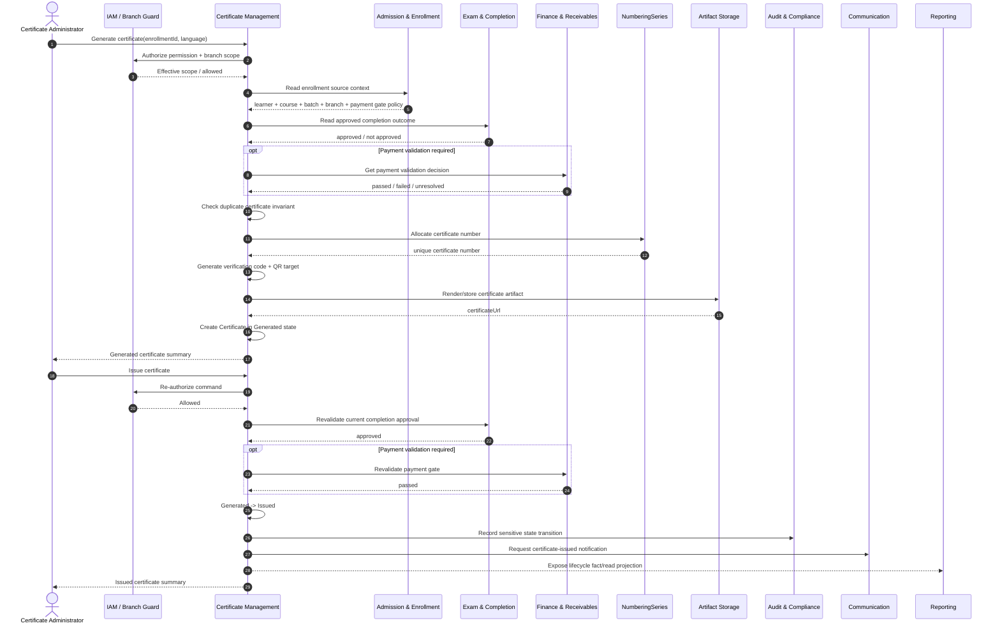
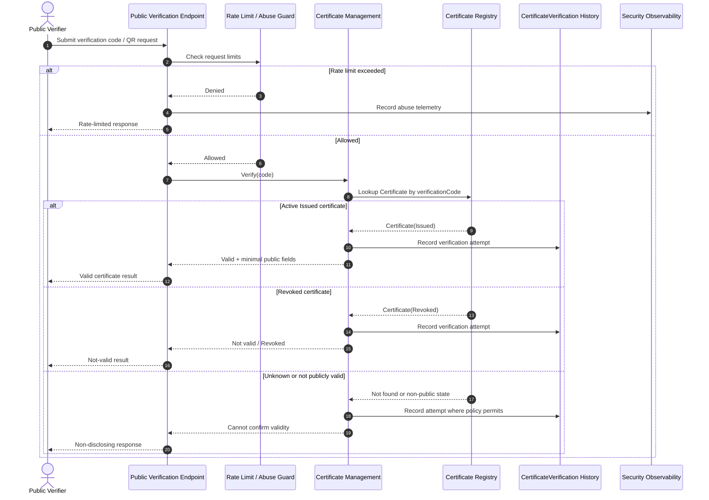
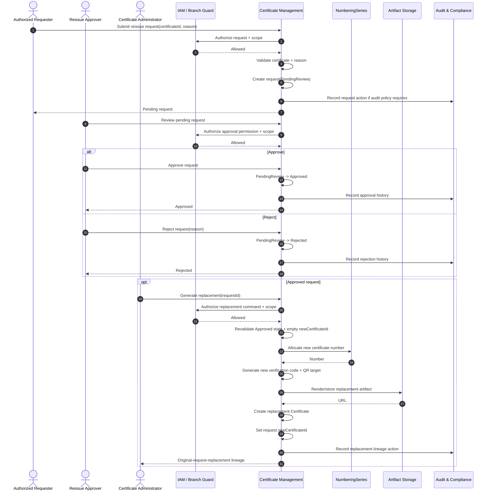
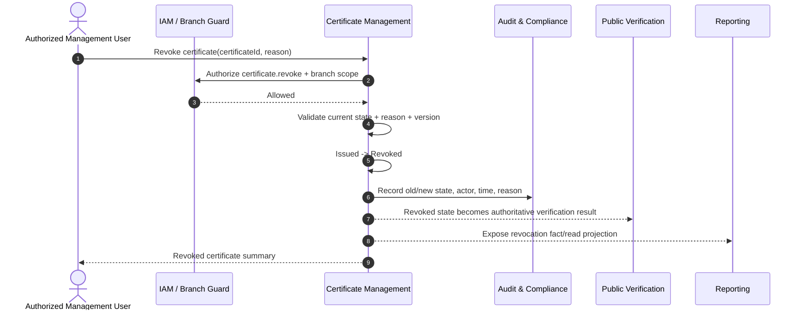
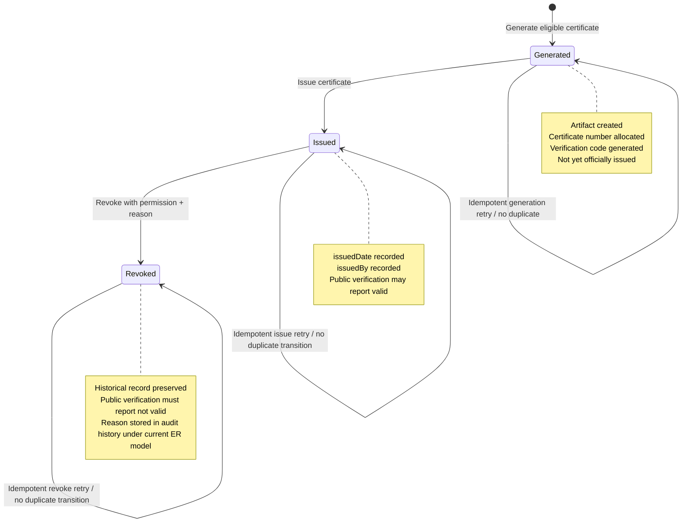
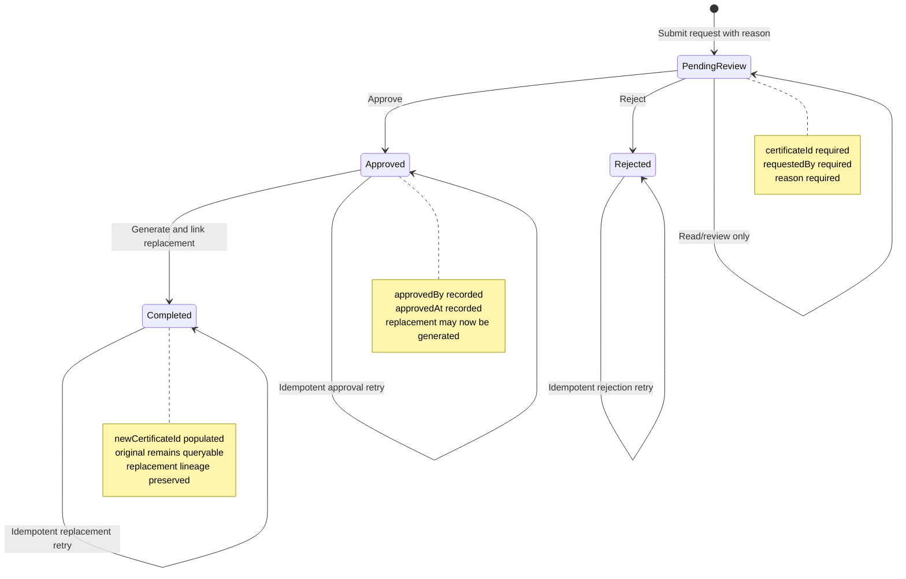

# Part 2 – User Stories, Use Cases, Workflows, State Machines

## Module 11 – Certificate Management

## 1. Purpose and Traceability

This document defines the behavioral requirements for the Certificate Management bounded context through user stories, use cases, operational workflows, and state machines. It extends the requirements defined in `Module 11 - Certificate Management.md` and `Part 1 – Business Overview, Functional Requirements, Business Rules.md` without changing domain ownership.

The governing ownership model is:

```text
Course Catalog Management
    owns CourseCompletionRule
            ↓
Attendance Management + Exam, Result & Completion Management
    supply learning evidence and approved completion outcome
            ↓
Finance & Receivables Management
    supplies payment validation where required
            ↓
Certificate Management
    owns Certificate generation, issue, verification,
    reissue transaction, replacement lineage, revocation,
    and certificate verification history
            ↓
Communication & Notification Management
    owns delivery requests and delivery history
            ↓
Reporting & Executive Dashboards
    consumes read-only certificate facts
```

Certificate Management must not recompute attendance, exam results, completion approval, invoice balances, or payment allocations. Every certificate lifecycle begins from a valid `Enrollment`, preserving the enrollment-centric model.

### 1.1 Primary Traceability Sources

| Behavior Area                      | Part 1 Requirements                                    | Primary Business Rules                                                           |
| ---------------------------------- | ------------------------------------------------------ | -------------------------------------------------------------------------------- |
| Readiness and eligibility          | FR-CERT-001 to FR-CERT-005                             | BR-CERT-001 to BR-CERT-007, BR-CERT-044, BR-CERT-051                             |
| Generation                         | FR-CERT-006 to FR-CERT-011                             | BR-CERT-008 to BR-CERT-016, BR-CERT-041, BR-CERT-052                             |
| Issuance and lifecycle             | FR-CERT-012 to FR-CERT-013, FR-CERT-033 to FR-CERT-040 | BR-CERT-028 to BR-CERT-030, BR-CERT-037 to BR-CERT-044                           |
| Registry and download              | FR-CERT-014 to FR-CERT-016                             | BR-CERT-031 to BR-CERT-036, BR-CERT-045                                          |
| Public verification                | FR-CERT-017 to FR-CERT-020                             | BR-CERT-009 to BR-CERT-011, BR-CERT-017 to BR-CERT-019, BR-CERT-030, BR-CERT-046 |
| Reissue                            | FR-CERT-021 to FR-CERT-026                             | BR-CERT-007, BR-CERT-020 to BR-CERT-027, BR-CERT-054                             |
| Revocation                         | FR-CERT-027                                            | BR-CERT-028 to BR-CERT-030, BR-CERT-037 to BR-CERT-038                           |
| Authorization and branch isolation | FR-CERT-028 to FR-CERT-030                             | BR-CERT-031 to BR-CERT-038                                                       |
| Cross-context side effects         | FR-CERT-031 to FR-CERT-032, FR-CERT-036                | BR-CERT-039 to BR-CERT-040, BR-CERT-050, BR-CERT-053 to BR-CERT-055              |

---

# 2. User Stories

## US-CERT-001 – View Certificate-Ready Enrollments

**Priority:** Must

**As a** Certificate Administrator  
**I want to** view a branch-scoped list of enrollments that are approved for completion and satisfy applicable certificate gates  
**So that** I can initiate certificate processing only for valid learning journeys.

**Traceability:** FR-CERT-001 to FR-CERT-004, FR-CERT-028, FR-CERT-029; BR-CERT-001 to BR-CERT-005, BR-CERT-032 to BR-CERT-036, BR-CERT-044.

### Acceptance Criteria

```gherkin
Feature: View certificate-ready enrollments

  Background:
    Given I am authenticated as an internal user
    And I have permission "certificate.read"
    And my effective branch scope has been resolved server-side

  Scenario: Display an eligible enrollment
    Given an enrollment belongs to a branch in my effective scope
    And the enrollment has an approved completion outcome
    And payment validation is not required or has passed
    And no active issued certificate exists for the enrollment
    When I open the certificate-ready enrollment list
    Then the enrollment is displayed
    And the response includes enrollment, learner, course, batch, branch, and readiness summary data
    And Certificate Management does not recalculate attendance or examination results

  Scenario: Hide enrollment outside effective branch scope
    Given an eligible enrollment belongs to a branch outside my effective scope
    When I request the certificate-ready enrollment list
    Then the enrollment is not returned
    And supplying its branch identifier as a client filter does not expand my scope

  Scenario: Show payment blocker without calculating finance balance
    Given an enrollment has approved completion
    And payment validation is required
    And Finance reports that payment validation has failed
    When I view readiness status
    Then the enrollment is marked as blocked for certificate generation
    And the blocker identifies payment validation as the reason
    And Certificate Management does not calculate invoice outstanding amount

  Scenario: Exclude enrollment with existing active issued certificate
    Given an enrollment already has an active issued certificate
    When I open the certificate-ready enrollment list
    Then the enrollment is not presented as available for normal generation
    And replacement processing is available only through the reissue workflow
```

---

## US-CERT-002 – Generate a Certificate from an Eligible Enrollment

**Priority:** Must

**As a** Certificate Administrator  
**I want to** generate a certificate from an eligible enrollment using the approved certificate template  
**So that** ASTI can create a consistent, uniquely identifiable credential without duplicating learner or course data.

**Traceability:** FR-CERT-002 to FR-CERT-011, FR-CERT-033, FR-CERT-034, FR-CERT-038, FR-CERT-039; BR-CERT-001 to BR-CERT-016, BR-CERT-041, BR-CERT-043 to BR-CERT-044, BR-CERT-049 to BR-CERT-052.

### Acceptance Criteria

```gherkin
Feature: Generate certificate

  Background:
    Given I am authenticated
    And I have permission "certificate.generate"
    And the target enrollment is in my effective branch scope

  Scenario: Generate an English certificate successfully
    Given the enrollment has approved completion eligibility
    And any required payment validation has passed
    And no active issued certificate exists for the enrollment
    And an active Certificate NumberingSeries is available
    And the authoritative source references are internally consistent
    When I select language "English" and generate the certificate
    Then the system allocates a unique certificate number
    And the system creates a unique opaque verification code
    And the system creates a QR verification reference
    And the system renders the approved current hardcoded certificate template
    And the system stores the artifact reference in Certificate.certificateUrl
    And the Certificate record is linked to the enrollment, student profile, course, and batch
    And the Certificate language is persisted as English

  Scenario: Generate an Arabic certificate successfully
    Given all generation gates are satisfied
    And authoritative Arabic display values required by the template are available
    When I select language "Arabic" and generate the certificate
    Then the generated artifact uses the Arabic rendering rules of the approved template
    And Certificate.language records Arabic

  Scenario: Reject generation when numbering configuration is unavailable
    Given the enrollment is otherwise eligible
    And no active Certificate NumberingSeries is available for the applicable configuration scope
    When I request certificate generation
    Then the command fails safely
    And no ad hoc certificate number is invented
    And no partial Certificate record is committed

  Scenario: Prevent duplicate generation under a retry
    Given a generation request has already completed successfully for the enrollment
    When the same command is retried due to client or network retry behavior
    Then the system returns the existing deterministic result or rejects the duplicate deterministically
    And a second active certificate is not created

  Scenario: Reject stale readiness state
    Given the browser previously displayed the enrollment as certificate-ready
    And the authoritative completion or payment gate has since become invalid or unavailable
    When I submit the generate command
    Then the server revalidates the current authoritative source state
    And generation is rejected
    And no Certificate record is created
```

---

## US-CERT-003 – Issue a Generated Certificate

**Priority:** Must

**As an** authorized Certificate Issuer  
**I want to** issue a generated certificate after command-time validation  
**So that** the official credential has a controlled issuance date, issuer identity, valid public verification state, and complete audit trail.

**Traceability:** FR-CERT-012, FR-CERT-013, FR-CERT-030, FR-CERT-031, FR-CERT-033, FR-CERT-034, FR-CERT-037 to FR-CERT-039; BR-CERT-002, BR-CERT-004, BR-CERT-037 to BR-CERT-044.

### Acceptance Criteria

```gherkin
Feature: Issue generated certificate

  Scenario: Issue certificate successfully
    Given I have permission "certificate.issue"
    And the Certificate is in Generated status
    And it belongs to my effective branch scope
    And approved completion eligibility remains valid
    And required payment validation remains satisfied
    When I issue the Certificate
    Then Certificate.certificateStatus becomes Issued
    And Certificate.issuedDate is recorded
    And Certificate.issuedBy identifies the authenticated issuing user
    And an audit record captures the state change
    And a certificate notification request is submitted to Communication Management

  Scenario: Reject issue command without permission
    Given I can read the Certificate but lack permission "certificate.issue"
    When I attempt to issue the Certificate
    Then the operation is denied
    And Certificate state remains unchanged

  Scenario: Reject issue for certificate outside branch scope
    Given I have permission "certificate.issue"
    But the Certificate belongs to a branch outside my effective scope
    When I attempt to issue it
    Then the operation is denied
    And no notification request is produced

  Scenario: Handle duplicate issue retry idempotently
    Given the Certificate is already Issued
    And the same issue command is retried
    When the server processes the retry
    Then a second issuance transition is not recorded
    And issuedDate and issuedBy are not incorrectly overwritten
    And duplicate notification side effects are prevented according to the application idempotency contract
```

---

## US-CERT-004 – Search, View, and Download Certificates

**Priority:** Must

**As an** authorized internal user  
**I want to** search, view, and download certificates within my permitted branch scope  
**So that** I can support learners, operational teams, and audit requests efficiently.

**Traceability:** FR-CERT-014 to FR-CERT-016, FR-CERT-028, FR-CERT-029; BR-CERT-031 to BR-CERT-036, BR-CERT-045.

### Acceptance Criteria

```gherkin
Feature: Certificate registry access

  Scenario: Search certificates with operational filters
    Given I have permission "certificate.read"
    When I filter by permitted branch, course, batch, certificate status, language, and issue date range
    Then the system returns a paginated result set
    And all rows belong to my effective branch scope
    And sorting is deterministic

  Scenario: View certificate detail
    Given a Certificate belongs to my effective branch scope
    And I have permission "certificate.read"
    When I open its details
    Then I can view certificate number, learner display name, course, batch, branch, issue state, issue date, language, and lifecycle references
    And finance-sensitive data is not included merely because Certificate Management depends on a payment gate

  Scenario: Download certificate artifact
    Given I have permission "certificate.download"
    And the Certificate belongs to my effective branch scope
    And a certificate artifact exists
    When I request the artifact
    Then the system authorizes the request server-side
    And returns or redirects through the approved protected artifact delivery mechanism

  Scenario: Deny unauthorized cross-branch direct object access
    Given I know the identifier of a Certificate outside my effective branch scope
    When I request its details or artifact directly
    Then the server denies access or returns a non-disclosing not-found response according to security policy
    And no metadata about the inaccessible certificate is exposed
```

---

## US-CERT-005 – Publicly Verify a Certificate

**Priority:** Must

**As a** Public Verifier  
**I want to** verify a certificate using its verification code or QR entry point  
**So that** I can confirm whether the credential is valid without receiving unnecessary personal or financial information.

**Traceability:** FR-CERT-017 to FR-CERT-020; BR-CERT-009 to BR-CERT-011, BR-CERT-017 to BR-CERT-019, BR-CERT-030, BR-CERT-046, BR-CERT-053.

### Acceptance Criteria

```gherkin
Feature: Public certificate verification

  Scenario: Verify an issued active certificate by code
    Given a Certificate is Issued and not revoked
    And I possess its valid verification code
    When I submit the code to the public verification endpoint
    Then the system returns a valid verification result
    And the response contains only approved minimal public verification fields
    And the system records a CertificateVerification attempt according to retention policy

  Scenario: Verify using QR entry point
    Given the QR target resolves to the Certificate verification flow
    When I follow the QR target
    Then the same authoritative verification logic used for direct code verification is executed
    And the result is semantically identical to verification by code

  Scenario: Verify a revoked certificate
    Given a Certificate has been revoked
    When I verify its code
    Then the result clearly indicates that the Certificate is not valid
    And it is never reported as active or valid

  Scenario: Verify an unknown code
    Given the submitted verification code does not identify a Certificate
    When I submit the code
    Then the response indicates that no valid certificate can be confirmed
    And the response does not reveal whether similar learner, course, or certificate data exists

  Scenario: Rate-limit abusive verification traffic
    Given a client exceeds the configured public verification abuse threshold
    When further verification requests are submitted
    Then the system applies the configured rate-limit response
    And security monitoring receives the relevant telemetry
```

---

## US-CERT-006 – Submit a Certificate Reissue Request

**Priority:** Must

**As an** authorized Certificate Administrator  
**I want to** submit a reissue request with a mandatory reason for an existing certificate  
**So that** damaged, lost, or legitimately corrected credentials can follow a controlled management approval process.

**Traceability:** FR-CERT-021, FR-CERT-022; BR-CERT-007, BR-CERT-020 to BR-CERT-022, BR-CERT-025.

### Acceptance Criteria

```gherkin
Feature: Submit certificate reissue request

  Scenario: Submit valid reissue request
    Given I have permission "certificate.reissue.request"
    And the Certificate exists
    And the Certificate is in my effective branch scope
    And I provide a non-empty reason satisfying validation rules
    When I submit the request
    Then a CertificateReissueRequest is created for that Certificate
    And requestedBy identifies the authenticated requester
    And status is PendingReview
    And no replacement Certificate is created yet

  Scenario: Reject request without reason
    Given I am authorized to request reissue
    When I submit a request with an empty or whitespace-only reason
    Then validation fails
    And no CertificateReissueRequest is created

  Scenario: Reject request for inaccessible certificate
    Given the Certificate belongs to a branch outside my effective scope
    When I submit a reissue request using its identifier
    Then the server denies the operation
    And no request is persisted
```

---

## US-CERT-007 – Approve or Reject a Reissue Request

**Priority:** Must

**As a** management approver  
**I want to** review and approve or reject certificate reissue requests  
**So that** replacement certificates are created only after explicit, auditable authorization.

**Traceability:** FR-CERT-022 to FR-CERT-024, FR-CERT-028 to FR-CERT-030; BR-CERT-022 to BR-CERT-027, BR-CERT-037 to BR-CERT-038, BR-CERT-054.

### Acceptance Criteria

```gherkin
Feature: Review certificate reissue request

  Scenario: Approve a pending request
    Given I have permission "certificate.reissue.approve"
    And the request is PendingReview
    And it belongs to my effective branch scope through its source Certificate
    When I approve the request
    Then the request status becomes Approved
    And approvedBy identifies me
    And approvedAt records the approval timestamp
    And the approval action is recorded through Audit and Compliance integration

  Scenario: Reject a pending request
    Given I have permission "certificate.reissue.approve"
    And the request is PendingReview
    When I reject it with required remarks or reason according to approval policy
    Then the request status becomes Rejected
    And a replacement Certificate cannot be generated from the rejected request
    And the decision is auditable

  Scenario: Reject repeated decision on terminal request
    Given the request is already Approved or Rejected
    When an approver attempts another decision transition
    Then the command is rejected as an invalid state transition
    And original decision metadata remains preserved

  Scenario: Do not authorize based on hardcoded role name
    Given my displayed role name is "Branch Manager"
    But I do not have permission "certificate.reissue.approve"
    When I attempt to approve the request
    Then authorization is denied
```

---

## US-CERT-008 – Generate and Link a Replacement Certificate

**Priority:** Must

**As a** Certificate Administrator  
**I want to** generate a replacement certificate only from an approved reissue request and link it to the request  
**So that** original and replacement credentials remain traceable without overwriting historical records.

**Traceability:** FR-CERT-025, FR-CERT-026, FR-CERT-033 to FR-CERT-040; BR-CERT-007, BR-CERT-023 to BR-CERT-027, BR-CERT-043 to BR-CERT-044.

### Acceptance Criteria

```gherkin
Feature: Generate replacement certificate

  Scenario: Generate replacement from approved request
    Given the CertificateReissueRequest is Approved
    And newCertificateId is empty
    And I have permission "certificate.reissue.generate"
    And the current source state still satisfies replacement policy
    When I generate the replacement Certificate
    Then a new Certificate record is created
    And the replacement has its own unique certificate number and verification code
    And the request.newCertificateId points to the replacement Certificate
    And the original Certificate remains queryable
    And the linkage is auditable

  Scenario: Reject replacement from pending request
    Given the request is PendingReview
    When I attempt replacement generation
    Then the command is rejected
    And newCertificateId remains empty

  Scenario: Reject replacement from rejected request
    Given the request is Rejected
    When I attempt replacement generation
    Then the command is rejected
    And no replacement Certificate is created

  Scenario: Prevent multiple replacements from one request
    Given an Approved request already has newCertificateId populated
    When the replacement generation command is retried
    Then a second replacement is not created
    And the existing replacement linkage remains unchanged
```

---

## US-CERT-009 – Revoke an Invalid Certificate

**Priority:** Must

**As an** explicitly authorized management user  
**I want to** revoke an issued certificate with a mandatory reason  
**So that** fraudulent, erroneous, or invalidated credentials cease to verify as valid while historical evidence is preserved.

**Traceability:** FR-CERT-027, FR-CERT-030, FR-CERT-037; BR-CERT-028 to BR-CERT-030, BR-CERT-037 to BR-CERT-038.

### Acceptance Criteria

```gherkin
Feature: Revoke certificate

  Scenario: Revoke an issued certificate
    Given I have permission "certificate.revoke"
    And the Certificate is Issued
    And it belongs to my effective branch scope
    And I provide a valid revocation reason
    When I revoke the Certificate
    Then certificateStatus becomes Revoked
    And the prior state and new state are captured in AuditLog
    And the reason is captured in audit history
    And the Certificate record and artifact history are preserved
    And future public verification reports the Certificate as not valid

  Scenario: Reject revocation without reason
    Given I have permission "certificate.revoke"
    And the Certificate is Issued
    When I submit a revocation command with no reason
    Then validation fails
    And certificateStatus remains Issued

  Scenario: Reject revocation without permission
    Given I can read the Certificate
    But I lack permission "certificate.revoke"
    When I attempt revocation
    Then the operation is denied
    And no certificate state change occurs
```

---

## US-CERT-010 – Receive Certificate Notification

**Priority:** Should

**As a** learner  
**I want to** receive a notification when my certificate is issued  
**So that** I know when my credential is available through the approved delivery channel.

**Traceability:** FR-CERT-031; BR-CERT-039.

### Acceptance Criteria

```gherkin
Feature: Request certificate-issued notification

  Scenario: Request notification after issuance
    Given a Certificate has transitioned successfully to Issued
    When the issuance transaction completes
    Then Certificate Management submits a NotificationRequest intent to Communication Management
    And the intent identifies the appropriate template code and recipient reference
    And Certificate Management does not own provider delivery status

  Scenario: Preserve issuance when downstream notification delivery fails
    Given the Certificate has been validly issued
    And Communication Management later reports delivery failure
    Then the Certificate remains Issued
    And the communication failure is handled in Communication Management
    And Certificate Management does not roll back the valid certificate lifecycle transaction
```

---

## US-CERT-011 – Audit Certificate Lifecycle Actions

**Priority:** Must

**As an** Audit or Compliance Officer  
**I want to** inspect auditable certificate lifecycle actions and approval history  
**So that** ASTI can demonstrate who performed sensitive actions, what changed, when, and why.

**Traceability:** FR-CERT-030, FR-CERT-035, FR-CERT-040; BR-CERT-025, BR-CERT-037 to BR-CERT-038, BR-CERT-054.

### Acceptance Criteria

```gherkin
Feature: Audit certificate lifecycle

  Scenario Outline: Record sensitive certificate actions
    Given an authorized user performs <action>
    When the action completes successfully
    Then the audit subsystem records entity type, entity identifier, action, old value, new value, performer, timestamp, and reason where applicable

    Examples:
      | action                         |
      | certificate issuance           |
      | reissue approval               |
      | reissue rejection              |
      | replacement certificate create |
      | certificate revocation         |
      | sensitive lifecycle state edit |

  Scenario: Preserve certificate history
    Given a Certificate has been replaced or revoked
    When an authorized auditor reviews lifecycle history
    Then the original record remains available under retention and soft-delete conventions
    And the historical chain is not reconstructed by overwriting the original Certificate
```

---

## US-CERT-012 – Consume Certificate Facts in Reporting

**Priority:** Should

**As a** Reporting User  
**I want to** view certificate issuance, verification, reissue, and revocation metrics through reporting read models  
**So that** operational and management teams can monitor certificate activity without placing reporting ownership in Certificate Management.

**Traceability:** FR-CERT-032, FR-CERT-036; BR-CERT-040.

### Acceptance Criteria

```gherkin
Feature: Certificate reporting consumption

  Scenario: Consume certificate facts read-only
    Given Certificate Management has valid certificate lifecycle data
    When Reporting builds or refreshes its certificate read model
    Then Reporting can consume approved certificate facts
    And Reporting cannot mutate Certificate, CertificateVerification, or CertificateReissueRequest transactions

  Scenario: Apply report permission and branch scope
    Given I open a certificate report
    When the report query is executed
    Then Reporting applies its own report permission rules
    And branch-scoped certificate facts do not expand beyond my effective access
```

---

# 3. Primary Use Cases

## UC-CERT-001 – Review Certificate Readiness

**Primary Actor:** Certificate Administrator

**Supporting System Actors:** IAM authorization guard, Admission & Enrollment context, Exam/Result/Completion context, Finance context where required.

### Preconditions

1. The actor is authenticated.
2. The actor has `certificate.read` or equivalent configured permission.
3. Effective branch scope is available from IAM.
4. Enrollment and completion source data are available.

### Main Success Scenario

1. Actor opens the Certificate Readiness screen.
2. System resolves effective branch scope server-side.
3. System reads approved completion outcomes from the owning context/read contract.
4. System resolves the associated Enrollment references.
5. System evaluates whether payment validation is required using authoritative source policy data.
6. Where required, system obtains the Finance-owned payment validation result.
7. System checks whether a current active issued Certificate already exists.
8. System returns a paginated readiness projection with explicit gate results.
9. Actor filters by branch within permitted scope, course, batch, completion date, or learner/enrollment search term.
10. System returns the filtered result without recalculating completion rules or finance balances.

### Alternative Flows

**A1 – Completion not approved**  
The enrollment is excluded from ready status or returned as blocked, according to screen design.

**A2 – Payment validation failed**  
The system marks payment as the blocker and prevents generation.

**A3 – Finance validation unavailable**  
The system reports payment gate as unresolved/pending and does not assume payment completion.

**A4 – Existing active issued certificate**  
The enrollment cannot enter normal generation. The existing certificate can be opened and, where appropriate, a controlled reissue request initiated.

**A5 – Unauthorized branch filter**  
The supplied branch filter is intersected with effective scope or rejected; it never expands authorization.

### Postconditions

- No owned transactional state changes.
- Actor has an authoritative readiness projection.
- Certificate Management has not mutated upstream data.

---

## UC-CERT-002 – Generate Certificate

**Primary Actor:** Certificate Administrator

**Supporting System Actors:** IAM, Enrollment application contract, Completion application contract, Finance validation contract, NumberingSeries capability, storage adapter, Audit integration where generation is configured as sensitive.

### Preconditions

1. Actor is authenticated and has `certificate.generate`.
2. Enrollment is in effective branch scope.
3. Enrollment exists and references course and batch.
4. Completion is approved.
5. Required payment validation has passed.
6. No conflicting active certificate exists under the normal issuance flow.
7. An active certificate numbering series is available.
8. Source references are internally consistent.

### Inputs

- `enrollmentId`
- certificate language: English or Arabic
- idempotency/command correlation key where supported by application convention

### Main Success Scenario

1. Actor selects an eligible enrollment.
2. System re-authorizes branch scope and functional permission.
3. System re-reads current Enrollment source references.
4. System revalidates completion approval.
5. System checks the payment gate and reads Finance validation when required.
6. System checks duplicate certificate invariant.
7. System validates current learner/course/batch source consistency.
8. System allocates the next certificate number through NumberingSeries.
9. System creates a unique opaque verification code.
10. System constructs the QR verification target/reference.
11. System resolves language-specific display values.
12. System renders the approved current hardcoded certificate template.
13. System stores the generated artifact through the approved storage adapter.
14. System creates the Certificate record with source references, language, number, verification code, QR reference, artifact URL, and initial generated lifecycle state.
15. System commits atomically according to repository transaction conventions.
16. System returns Certificate identity and generated state.

### Alternative Flows

**A1 – Stale completion eligibility**  
Generation stops; no Certificate is created.

**A2 – Payment failed or unavailable**  
Generation stops with an explicit gate result.

**A3 – Existing active certificate**  
Normal generation is denied and the actor is directed to the existing record/reissue workflow.

**A4 – Missing NumberingSeries**  
Generation fails safely; no ad hoc number is created.

**A5 – Duplicate verification code collision**  
System retries code generation according to bounded application policy before commit; uniqueness must ultimately be guaranteed by supported persistence constraints/application safeguards.

**A6 – Storage/render failure**  
No completed Certificate transaction may point to a non-existent artifact. Recovery follows transaction/compensation conventions defined in operational architecture.

**A7 – Command retry**  
System returns the existing deterministic outcome or rejects duplicate processing without producing a second active certificate.

### Postconditions

- A generated Certificate exists.
- It is linked to the valid Enrollment learning journey.
- Artifact reference, certificate number, verification code, QR reference, and language are persisted.
- No upstream owner data is mutated.

---

## UC-CERT-003 – Issue Certificate

**Primary Actor:** Authorized Certificate Issuer

### Preconditions

1. Actor has `certificate.issue`.
2. Certificate is in Generated state.
3. Certificate belongs to effective branch scope.
4. Current authoritative issuance gates remain satisfied.

### Main Success Scenario

1. Actor opens the generated Certificate.
2. Actor selects Issue.
3. Server authorizes permission and branch scope.
4. Server locks or concurrency-checks the Certificate lifecycle record according to repository convention.
5. Server revalidates completion eligibility.
6. Server revalidates payment gate where required.
7. Server transitions `certificateStatus` from Generated to Issued.
8. Server records `issuedDate` and `issuedBy`.
9. Server records the sensitive lifecycle transition through Audit integration.
10. Server publishes/dispatches the in-process modular application event or direct application integration needed for reporting/notification consumers, consistent with modular-monolith architecture.
11. Certificate Management requests an issuance notification from Communication Management.
12. System returns the issued Certificate summary.

### Alternative Flows

**A1 – Permission failure**  
Operation denied; no state change.

**A2 – Branch access failure**  
Operation denied; no object metadata leakage.

**A3 – Gate changed since generation**  
Issue is blocked and the Certificate remains Generated until authorized remediation or lifecycle policy action.

**A4 – Concurrent issue command**  
Only one transition succeeds; later commands return an idempotent result or optimistic concurrency conflict.

**A5 – Notification delivery failure**  
The valid issuance remains committed; Communication Management owns delivery retry/history.

### Postconditions

- Certificate is Issued.
- `issuedDate` and `issuedBy` are recorded.
- Audit history exists.
- Notification request has been handed to the owning context when configured.

---

## UC-CERT-004 – Verify Certificate Publicly

**Primary Actor:** Public Verifier

### Preconditions

1. Public verification endpoint is available.
2. Verifier has a verification code or QR verification entry point.
3. Request is within anti-abuse controls.

### Main Success Scenario

1. Verifier submits verification code or follows QR target.
2. System normalizes the verification request.
3. System looks up Certificate using authoritative verification logic.
4. System evaluates certificate lifecycle validity.
5. System returns minimal approved verification data and a status result.
6. System records a `CertificateVerification` attempt according to retention policy.
7. System emits monitoring telemetry without exposing unnecessary PII.

### Alternative Flows

**A1 – Unknown code**  
Return a non-confirmation response without data disclosure.

**A2 – Revoked certificate**  
Return not-valid/revoked outcome; never active-valid.

**A3 – Generated but not issued Certificate**  
Return not-valid/not-issued according to public response policy.

**A4 – Rate limit exceeded**  
Return configured anti-abuse response and record security telemetry.

### Postconditions

- Certificate transaction state is unchanged.
- Verification history may contain a new attempt record.

---

## UC-CERT-005 – Submit Reissue Request

**Primary Actor:** Certificate Administrator or other explicitly authorized requester

### Preconditions

1. Actor is authenticated.
2. Actor has `certificate.reissue.request`.
3. Source Certificate exists and is branch-accessible.
4. Requester supplies a valid reason.

### Main Success Scenario

1. Actor opens the Certificate record.
2. Actor selects Request Reissue.
3. Actor enters reason.
4. System validates permission and branch scope.
5. System validates that the source Certificate exists.
6. System validates reason.
7. System creates `CertificateReissueRequest` with source `certificateId`, `requestedBy`, reason, and PendingReview status.
8. System records required audit information.
9. System returns the pending request summary.

### Alternative Flows

- Missing reason: validation fails.
- Inaccessible Certificate: operation denied.
- Invalid/deleted historical reference under retention rules: request denied according to lifecycle policy.
- Duplicate open request: system prevents duplicates if current policy permits only one unresolved request per certificate; this constraint should be confirmed against Prisma/persistence implementation.

### Postconditions

- Pending reissue request exists.
- No replacement Certificate exists yet.

---

## UC-CERT-006 – Decide Reissue Request

**Primary Actor:** Reissue Approver

### Preconditions

1. Actor has `certificate.reissue.approve`.
2. Request is PendingReview.
3. Source Certificate is within effective branch scope.

### Main Success Scenario – Approval

1. Approver opens pending request.
2. System displays source certificate and request reason.
3. Approver chooses Approve.
4. System revalidates permission, scope, and request state.
5. System transitions request to Approved.
6. System writes `approvedBy` and `approvedAt`.
7. Audit/Compliance approval history is recorded through the appropriate application integration.
8. System returns Approved request.

### Alternative Flow – Rejection

1. Approver chooses Reject.
2. System validates rejection remarks/reason according to policy.
3. Request transitions to Rejected.
4. Decision is audited.
5. Request becomes ineligible for replacement generation.

### Other Alternative Flows

- Request already terminal: reject invalid transition.
- Missing permission: deny.
- Cross-branch request: deny.
- Concurrent decision: optimistic concurrency/version check permits only one terminal decision.

### Postconditions

- Request is Approved or Rejected.
- Approval/audit history is preserved.

---

## UC-CERT-007 – Generate Replacement Certificate

**Primary Actor:** Certificate Administrator

### Preconditions

1. Actor has `certificate.reissue.generate`.
2. Reissue request is Approved.
3. `newCertificateId` is not already populated.
4. Source Certificate and learning journey remain resolvable.
5. Numbering configuration is available.

### Main Success Scenario

1. Actor opens Approved reissue request.
2. Actor selects Generate Replacement.
3. Server authorizes permission and branch scope.
4. Server validates Approved request state and empty `newCertificateId`.
5. Server revalidates authoritative source references and any current replacement policy gates.
6. Server allocates a new certificate number.
7. Server generates a new verification code and QR target.
8. Server renders and stores the replacement artifact.
9. Server creates new Certificate record.
10. Server writes replacement Certificate ID into `CertificateReissueRequest.newCertificateId`.
11. Server transitions request to ReplacementGenerated/Completed according to the approved persisted enum strategy.
12. Server preserves the original Certificate.
13. Server records audit history.
14. System returns original/reissue/replacement lineage summary.

### Alternative Flows

- Request PendingReview or Rejected: deny.
- `newCertificateId` already populated: return existing replacement lineage or reject deterministic duplicate.
- Source inconsistency: block replacement generation.
- Numbering/render/storage failure: do not commit broken lineage.

### Postconditions

- Replacement Certificate exists.
- Approved request points to replacement via `newCertificateId`.
- Original Certificate remains queryable.
- Replacement still requires issuance if generation and issuance are modeled as separate states.

---

## UC-CERT-008 – Revoke Certificate

**Primary Actor:** Explicitly authorized management user

### Preconditions

1. Actor has `certificate.revoke`.
2. Certificate is accessible under effective branch scope.
3. Certificate is in a revocable state, normally Issued.
4. Revocation reason is supplied.

### Main Success Scenario

1. Actor opens Certificate detail.
2. Actor selects Revoke.
3. Actor enters mandatory reason.
4. System revalidates permission, branch scope, Certificate state, and concurrency version.
5. System transitions Certificate to Revoked.
6. System preserves Certificate data and artifact history.
7. System records who, what, when, old value, new value, and reason through AuditLog integration.
8. Public verification immediately/consistently treats the Certificate as not valid.
9. Reporting read models receive the lifecycle fact through approved modular integration.

### Alternative Flows

- Missing reason: validation failure.
- Already revoked: idempotent result or invalid transition response; no duplicate state mutation.
- Not issued: reject unless future lifecycle policy explicitly permits revocation from another state.
- Unauthorized or cross-branch actor: deny.

### Postconditions

- Certificate is Revoked.
- Historical record remains preserved.
- Public verification never reports it as valid.

---

# 4. Business Workflows

## 4.1 Workflow WF-CERT-001 – Standard Certificate Generation and Issuance

### Structured Flow

1. Completion context finishes its approval workflow.
2. Certificate operator views the certificate-ready list.
3. Certificate Management reads the approved completion decision; it does not evaluate attendance or exam rules.
4. Certificate Management resolves the central Enrollment and validates learner/course/batch references.
5. When payment validation is required, Certificate Management obtains the Finance-owned validation result.
6. Certificate Management checks that normal generation will not create a duplicate active certificate.
7. Certificate Administrator submits generation command and language.
8. Server repeats authorization, branch-scope, completion, payment, duplicate, and source-integrity checks at command time.
9. NumberingSeries allocates the certificate number.
10. Certificate Management creates a verification code and QR verification target.
11. Template renderer creates the English or Arabic artifact from authoritative display data.
12. Storage returns a durable artifact reference.
13. Certificate record enters Generated state.
14. Authorized issuer submits Issue command.
15. Server revalidates applicable source gates.
16. Certificate transitions to Issued; `issuedDate` and `issuedBy` are recorded.
17. Audit integration records the transition.
18. Notification request is sent to Communication Management.
19. Reporting consumes lifecycle facts through read-only integration.

### Mermaid Sequence Diagram



---

## 4.2 Workflow WF-CERT-002 – Public Verification



### Public Data Minimization Rule

The public response must not expose Civil ID, passport number, visa number, learner contact information, invoice/payment information, internal user identifiers, internal branch-access information, or audit details. The exact minimal response contract must be defined in the API contract part, but must remain within Certificate verification ownership and privacy rules.

---

## 4.3 Workflow WF-CERT-003 – Certificate Reissue



### Reissue Lineage Invariant

```text
Original Certificate
        |
        v
CertificateReissueRequest
        |
        +-- status = Approved
        |
        v
newCertificateId
        |
        v
Replacement Certificate
```

The original Certificate must not be overwritten. `newCertificateId` must identify the replacement created from the approved request. One approved request must not create multiple replacement certificates.

---

## 4.4 Workflow WF-CERT-004 – Certificate Revocation



### Revocation Rules

1. Revocation is a lifecycle transition, not deletion.
2. The original artifact/reference is preserved under retention policy.
3. Audit carries the reason because the current ER model does not define dedicated revocation metadata fields.
4. Public verification must not report a revoked Certificate as valid.
5. Certificate Management must not mutate completion or finance records as part of revocation.

---

## 4.5 Workflow WF-CERT-005 – Branch-Scoped Registry Access

```text
Authenticated Request
        |
        v
Check functional permission
        |
        +-- denied --> 403 / security-policy response
        |
        v
Resolve UserBranchAccess
        |
        +--> directly assigned branches
        +--> child branches only when canViewChildBranches permits
        +--> consolidated view only when canViewConsolidated permits
        |
        v
Intersect requested filters with effective scope
        |
        v
Query certificate projection
        |
        v
Return only authorized branch records
```

The browser-provided `branchId` is a filter, not an authorization grant.

---

# 5. State Machines

## 5.1 Certificate Lifecycle State Machine

### 5.1.1 FRD-Level State Vocabulary

The ER model contains `Certificate.certificateStatus` but does not enumerate its values. To make workflows testable, this FRD uses the following required semantic states:

- `Generated` – certificate record and artifact have been successfully created but official issuance has not completed.
- `Issued` – official credential has been issued and is eligible to verify as valid unless later revoked.
- `Revoked` – credential has been invalidated through an authorized audited transition and must not verify as valid.

A separate soft-delete/administrative-retirement marker may exist through repository base conventions, but it is not a substitute for business lifecycle status and must not erase certificate history.

**Schema validation note:** the exact Prisma enum names and values must be verified against `schema.prisma` before implementation acceptance. The semantic transitions below are required regardless of final enum naming.

### 5.1.2 Mermaid Diagram



### 5.1.3 Certificate Transition Rules Matrix

| From State | To State  | Trigger                    | Preconditions / Guards                                                                                                                                               | Required Permission    | Audit Requirement                                                                                | Invalid Examples                                                                              |
| ---------- | --------- | -------------------------- | -------------------------------------------------------------------------------------------------------------------------------------------------------------------- | ---------------------- | ------------------------------------------------------------------------------------------------ | --------------------------------------------------------------------------------------------- |
| None       | Generated | Generate certificate       | Valid Enrollment; approved completion; payment gate passed if required; source references consistent; no prohibited duplicate; active NumberingSeries; branch access | `certificate.generate` | Generation audit according to sensitive-action policy; all later sensitive transitions mandatory | Generate for missing batch, failed payment gate, unapproved completion, inaccessible branch   |
| Generated  | Issued    | Issue certificate          | Current gates revalidated; branch access; artifact/reference present; concurrency version valid                                                                      | `certificate.issue`    | Mandatory sensitive state-change audit                                                           | Issue without permission; issue outside scope; issue after authoritative gate becomes invalid |
| Issued     | Revoked   | Revoke certificate         | Branch access; mandatory reason; current state revocable; concurrency version valid                                                                                  | `certificate.revoke`   | Mandatory audit with old/new state and reason                                                    | Revoke without reason; revoke by read-only user                                               |
| Generated  | Generated | Duplicate generation retry | Same deterministic command already processed                                                                                                                         | `certificate.generate` | No duplicate business transition audit; technical retry telemetry allowed                        | Creating second active certificate                                                            |
| Issued     | Issued    | Duplicate issue retry      | Certificate already issued by completed command                                                                                                                      | `certificate.issue`    | Must not create duplicate issuance transition                                                    | Overwriting original issuedAt/issuedBy on retry                                               |
| Revoked    | Revoked   | Duplicate revoke retry     | Already revoked                                                                                                                                                      | `certificate.revoke`   | Must not create misleading duplicate business transition                                         | Restoring to Issued without an approved future domain rule                                    |

### 5.1.4 Explicitly Forbidden Certificate Transitions

| From      | To        | Reason                                                                                                                                                                                                  |
| --------- | --------- | ------------------------------------------------------------------------------------------------------------------------------------------------------------------------------------------------------- |
| None      | Issued    | Generation and artifact creation must precede issuance.                                                                                                                                                 |
| None      | Revoked   | There is no certificate transaction to revoke.                                                                                                                                                          |
| Generated | Revoked   | Current business workflow defines revocation for issued credentials; generated artifacts can be handled by controlled administrative lifecycle policy but must not be presented as issued certificates. |
| Revoked   | Issued    | DDD/ER sources provide no reinstatement workflow. A reinstatement capability would require an approved domain change.                                                                                   |
| Issued    | Generated | Issuance history cannot be reversed by moving backward to generated state.                                                                                                                              |
| Revoked   | Generated | Revocation is historical invalidation, not a reset operation.                                                                                                                                           |

---

## 5.2 Certificate Reissue Request State Machine

### 5.2.1 FRD-Level State Vocabulary

The ER model contains `CertificateReissueRequest.status` but does not list enum values. This FRD requires these semantic states:

- `PendingReview` – request submitted and awaiting an authorized decision.
- `Approved` – management approval completed; replacement generation is permitted.
- `Rejected` – request declined; replacement generation is prohibited.
- `Completed` – replacement Certificate has been generated and linked through `newCertificateId`.

`Completed` may be named `ReplacementGenerated` in the implementation, but the semantic terminal condition is that an approved request has exactly one linked replacement Certificate.

### 5.2.2 Mermaid Diagram



### 5.2.3 Reissue Transition Rules Matrix

| From State    | To State      | Trigger                     | Preconditions / Guards                                                                                   | Required Permission            | Audit / Approval Requirement                     | Postcondition                                            |
| ------------- | ------------- | --------------------------- | -------------------------------------------------------------------------------------------------------- | ------------------------------ | ------------------------------------------------ | -------------------------------------------------------- |
| None          | PendingReview | Submit reissue request      | Existing accessible Certificate; requester identity; mandatory reason                                    | `certificate.reissue.request`  | Request action auditable according to policy     | Request created; no replacement exists                   |
| PendingReview | Approved      | Approve request             | Pending state; approver permission; branch scope; concurrency version valid                              | `certificate.reissue.approve`  | Approval decision and history mandatory          | `approvedBy` and `approvedAt` recorded                   |
| PendingReview | Rejected      | Reject request              | Pending state; approver permission; branch scope; required decision remarks where policy requires        | `certificate.reissue.approve`  | Rejection decision and history mandatory         | Replacement prohibited                                   |
| Approved      | Completed     | Generate replacement        | Approved state; `newCertificateId` empty; source references valid; numbering config active; branch scope | `certificate.reissue.generate` | Replacement creation and lineage audit mandatory | New Certificate created and `newCertificateId` populated |
| Approved      | Approved      | Duplicate approval retry    | Decision already successfully committed                                                                  | `certificate.reissue.approve`  | No duplicate approval business action            | Existing approval metadata preserved                     |
| Rejected      | Rejected      | Duplicate rejection retry   | Decision already successfully committed                                                                  | `certificate.reissue.approve`  | No misleading duplicate business action          | Original rejection preserved                             |
| Completed     | Completed     | Duplicate replacement retry | `newCertificateId` already identifies replacement                                                        | `certificate.reissue.generate` | No duplicate replacement transaction             | Existing lineage returned/preserved                      |

### 5.2.4 Forbidden Reissue Transitions

| From          | To            | Reason                                                                                                                           |
| ------------- | ------------- | -------------------------------------------------------------------------------------------------------------------------------- |
| PendingReview | Completed     | Replacement requires explicit approval first.                                                                                    |
| Rejected      | Approved      | Current source model does not define reopen/appeal transition. A new request should be used unless DDD is extended.              |
| Rejected      | Completed     | BR-CERT-026 forbids replacement generation from rejected request.                                                                |
| Completed     | PendingReview | Completed lineage must not be reset.                                                                                             |
| Completed     | Approved      | Completion is terminal for that reissue request.                                                                                 |
| Approved      | Rejected      | Source requirements do not define post-approval reversal. Such capability would require explicit domain policy and audit design. |

---

## 5.3 Public Verification Outcome Model

`CertificateVerification.verificationStatus` is an ER field, but a verification attempt is not the same as the Certificate lifecycle. The following semantic outcomes are required for application behavior:

```text
Verification Request
        |
        +--> matching Issued, non-revoked Certificate --> VALID
        |
        +--> matching Revoked Certificate -----------> NOT_VALID / REVOKED
        |
        +--> matching non-public lifecycle state ----> NOT_VALID / NOT_ISSUED
        |
        +--> no matching code -----------------------> NOT_CONFIRMED
```

These outcomes must not mutate Certificate status. The precise persisted enum values for `verificationStatus` require Prisma-schema confirmation.

---

# 6. Authorization and State-Transition Permission Summary

| Capability           | Recommended Permission Code                                        |            Branch Scope Required |                   Public Access |                                      Sensitive Audit |
| -------------------- | ------------------------------------------------------------------ | -------------------------------: | ------------------------------: | ---------------------------------------------------: |
| View readiness       | `certificate.read`                                                 |                              Yes |                              No |                       No, normal read telemetry only |
| View registry/detail | `certificate.read`                                                 |                              Yes |                              No |     No, except sensitive-access policy if configured |
| Download artifact    | `certificate.download`                                             |                              Yes |                              No |                           Access logging recommended |
| Generate certificate | `certificate.generate`                                             |                              Yes |                              No | Yes according to certificate sensitive-action policy |
| Issue certificate    | `certificate.issue`                                                |                              Yes |                              No |                                                  Yes |
| Verify certificate   | None for public endpoint                                           | No internal branch scope exposed |                             Yes |               Verification history + abuse telemetry |
| Submit reissue       | `certificate.reissue.request`                                      |                              Yes | No in current admin-first scope |                              Yes according to policy |
| Decide reissue       | `certificate.reissue.approve`                                      |                              Yes |                              No |                                                  Yes |
| Generate replacement | `certificate.reissue.generate`                                     |                              Yes |                              No |                                                  Yes |
| Revoke certificate   | `certificate.revoke`                                               |                              Yes |                              No |                                Yes, reason mandatory |
| View lifecycle audit | `audit.read` and/or approved certificate-audit permission contract |              Audit context rules |                              No |                Read access governed by Audit context |
| View reporting       | Reporting/dashboard permission                                     |           Reporting branch scope |                              No |                             Reporting context policy |

Permission names are recommended capability codes and must be seeded/configured through IAM rather than inferred from hardcoded role names.

---

# 7. Cross-Context Workflow Responsibility Matrix

| Workflow Step                    | Owning Context                                            | Certificate Management Behavior                             | Forbidden Certificate Behavior                                               |
| -------------------------------- | --------------------------------------------------------- | ----------------------------------------------------------- | ---------------------------------------------------------------------------- |
| Define completion rule           | Course Catalog                                            | Read outcome indirectly through completion decision         | Do not create or edit `CourseCompletionRule`                                 |
| Calculate attendance             | Attendance                                                | Consume only via upstream completion evaluation             | Do not calculate attendance percentage                                       |
| Record exams/results             | Exam, Result & Completion                                 | Read approved completion result                             | Do not create `Exam` or `Result`                                             |
| Approve completion               | Exam, Result & Completion, with approval history in Audit | Require approved outcome                                    | Do not perform completion approval workflow                                  |
| Maintain Enrollment              | Admission & Enrollment                                    | Resolve central learning journey                            | Do not change learner/course/batch enrollment references                     |
| Validate payment                 | Finance & Receivables                                     | Consume validation decision when required                   | Do not calculate outstanding amount or post payment                          |
| Allocate certificate number      | Configuration / NumberingSeries capability                | Request/consume allocation according to repository boundary | Do not invent local ad hoc numbering                                         |
| Authorize user/branch            | IAM                                                       | Enforce permission and scope on every server command/query  | Do not trust client branch filters                                           |
| Issue/revoke/reissue certificate | Certificate Management                                    | Own transaction and lifecycle state                         | Do not delegate ownership to Reporting or Communication                      |
| Record critical audit            | Audit & Compliance                                        | Submit audit facts/integration call                         | Do not use certificate transaction tables as replacement for global AuditLog |
| Send notification                | Communication                                             | Submit request/intention                                    | Do not own provider delivery status/history                                  |
| Build reports                    | Reporting                                                 | Expose/read certificate facts                               | Do not allow reporting projection to mutate certificate transactions         |

---

# 8. DDD and ER Alignment Notes

## 8.1 Direct Alignment

1. **Enrollment-centric lifecycle:** Every Certificate use case starts from or remains linked to `Enrollment`. Certificate processing never creates a parallel learner-course relationship.
2. **Certificate ownership:** Generation, issuance, verification, reissue transaction, replacement lineage, and revocation remain within Certificate Management.
3. **Completion boundary:** Completion approval is consumed from Exam, Result & Completion. This document never assigns attendance, exam, grade, or completion-rule evaluation to Certificate Management.
4. **Finance boundary:** Payment validation is treated as a Finance-owned truth. Certificate Management consumes a decision and never derives receivable state.
5. **ER entity usage:** Workflows map to `Certificate`, `CertificateVerification`, and `CertificateReissueRequest`.
6. **Reissue lineage:** `CertificateReissueRequest.newCertificateId` is the explicit replacement link; original Certificate records are preserved.
7. **Public verification:** `Certificate.verificationCode`, `qrCodeUrl`, and `CertificateVerification` support code/QR verification and attempt history.
8. **IAM boundary:** Permissions and branch isolation are dynamic and server-enforced.
9. **Audit boundary:** Sensitive transitions are submitted to Audit & Compliance and must record who, what, when, old/new values, and reason where applicable.
10. **Modular monolith:** Sequence diagrams represent in-process module/application contracts and infrastructure adapters. They do not imply microservice extraction or an external message broker.

## 8.2 Known Source-Model Gaps Carried Forward

| Gap                        | DDD Position                                                           | ER Position                                                                                       | Part 2 Treatment                                                                                                 |
| -------------------------- | ---------------------------------------------------------------------- | ------------------------------------------------------------------------------------------------- | ---------------------------------------------------------------------------------------------------------------- |
| Certificate lifecycle enum | Lifecycle responsibilities imply issuance/revocation behavior          | `certificateStatus` exists, enum values unspecified                                               | Defines required semantic states Generated, Issued, Revoked; Prisma enum must be verified                        |
| Reissue status enum        | Reissue approval workflow required                                     | `status` field exists, values unspecified                                                         | Defines PendingReview, Approved, Rejected, Completed semantics; persisted names require schema confirmation      |
| CertificateIssueLog        | DDD names `CertificateIssueLog` as Certificate aggregate child concept | No dedicated entity                                                                               | Uses Certificate fields + AuditLog integration; does not invent new table                                        |
| CertificateQRCode          | DDD names QR code concept                                              | ER stores `qrCodeUrl` on Certificate                                                              | Uses `qrCodeUrl`/verification target; does not invent new QR entity                                              |
| Revocation metadata        | DDD requires revocation                                                | ER has `certificateStatus` but no `revokedAt`, `revokedBy`, `revocationReason`                    | Revocation state stored on Certificate status; actor/time/reason captured in AuditLog under current source model |
| Reissue approval history   | DDD requires management approval                                       | ER has request approval fields and Audit approval entities                                        | Request remains Certificate-owned; approval history remains Audit & Compliance-owned                             |
| Soft-delete base fields    | Project principle requires soft delete/auditing                        | ER recommends common base fields for most operational tables but per-entity listing may omit them | No hard delete workflow is introduced; exact Prisma fields require schema validation                             |

## 8.3 No-New-Model Confirmation

This document does not introduce a new aggregate or persistence entity. Terms such as `Certificate Administrator`, `Public Verification Endpoint`, `Finance validation contract`, `Artifact Storage`, and `Reporting read model` describe actors, application boundaries, or infrastructure/read contracts—not new domain entities.

---

# 9. Validation Checklist for Part 2

| Check                                                                   | Result                                                       |
| ----------------------------------------------------------------------- | ------------------------------------------------------------ |
| All learning journeys use Enrollment as the certificate source          | Aligned                                                      |
| Course and Batch remain mandatory through Enrollment/source consistency | Aligned                                                      |
| Certificate context does not compute completion eligibility             | Aligned                                                      |
| Certificate context does not own payment calculations                   | Aligned                                                      |
| Certificate generation uses NumberingSeries                             | Aligned                                                      |
| Public verification uses Certificate-owned verification data            | Aligned                                                      |
| Reissue request maps to ER entity and preserves original Certificate    | Aligned                                                      |
| Replacement maps through `newCertificateId`                             | Aligned                                                      |
| Revocation preserves history and uses status + audit under current ER   | Aligned with documented ER gap                               |
| Branch isolation enforced server-side in query and command workflows    | Aligned                                                      |
| Dynamic permissions used instead of role-name checks                    | Aligned                                                      |
| Sensitive actions have audit requirements                               | Aligned                                                      |
| Reporting remains read-only consumer                                    | Aligned                                                      |
| Communication owns message delivery history                             | Aligned                                                      |
| No microservice/broker/CQRS/Event Sourcing introduced                   | Aligned                                                      |
| Prisma enum/constraint validation completed                             | Not verified; Prisma schema not available in supplied inputs |

---

# 10. Completion Statement

Part 2 defines twelve detailed user stories, eight primary use cases, five core operational workflows, two transaction state machines, a public verification outcome model, authorization matrices, cross-context responsibility boundaries, and explicit DDD/ER alignment notes.

The behavior remains consistent with the central design rule: **Certificate Management owns the credential lifecycle, but it must consume—not duplicate or recompute—the authoritative decisions and data owned by Enrollment, Course Catalog, Exam/Completion, Finance, IAM, Audit, Communication, and Reporting contexts.**
