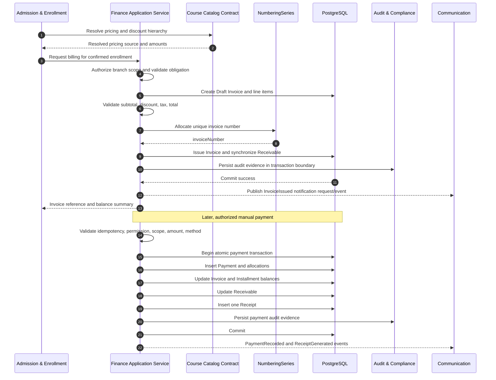
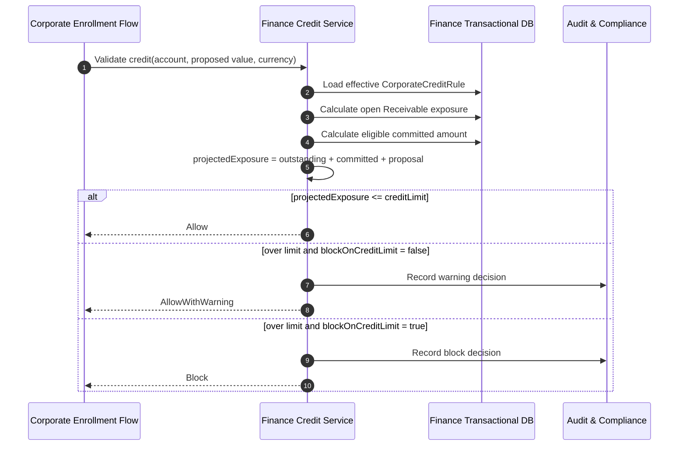
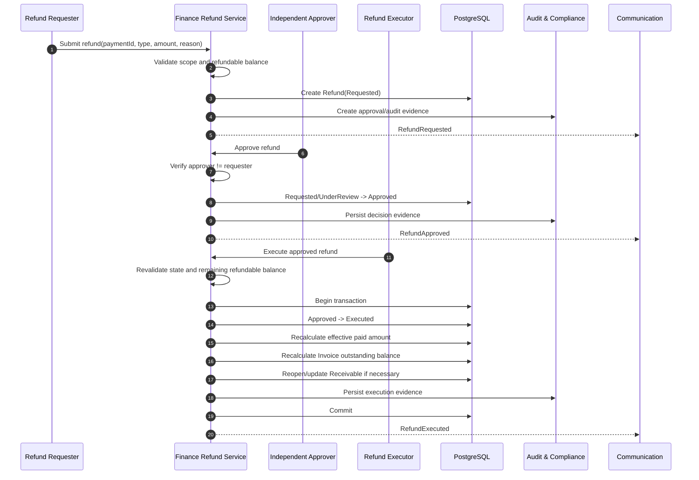
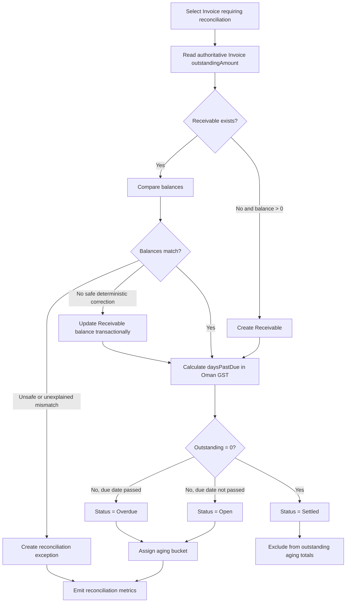
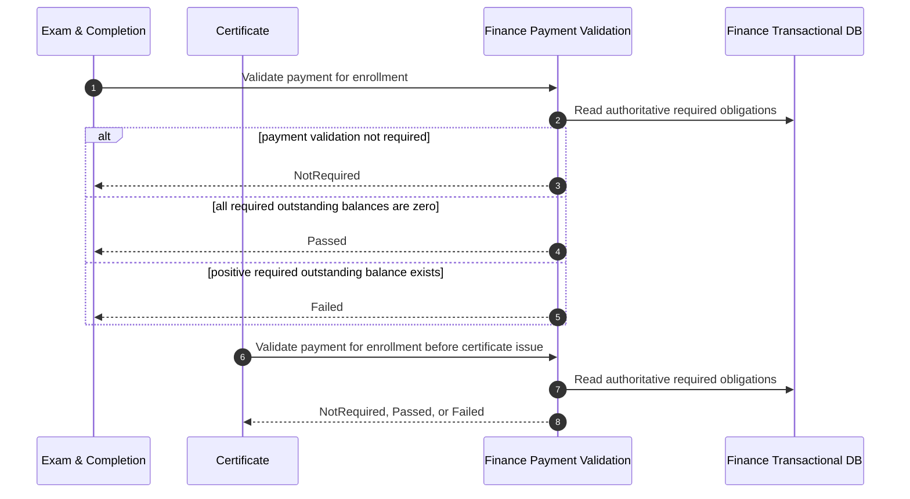
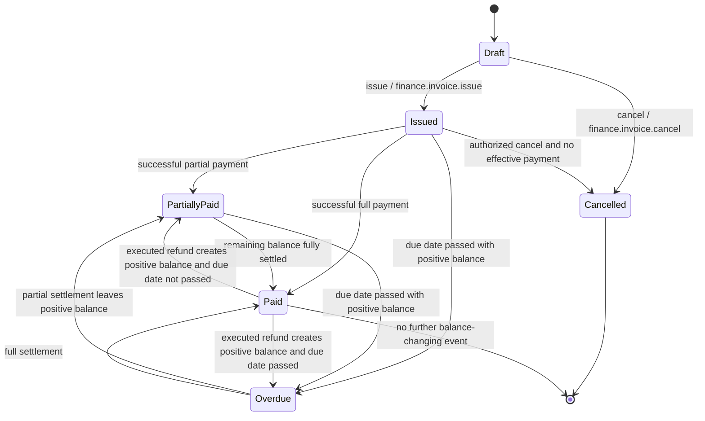
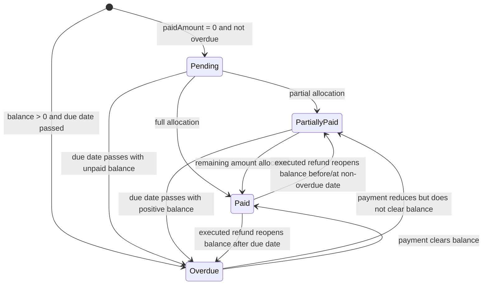
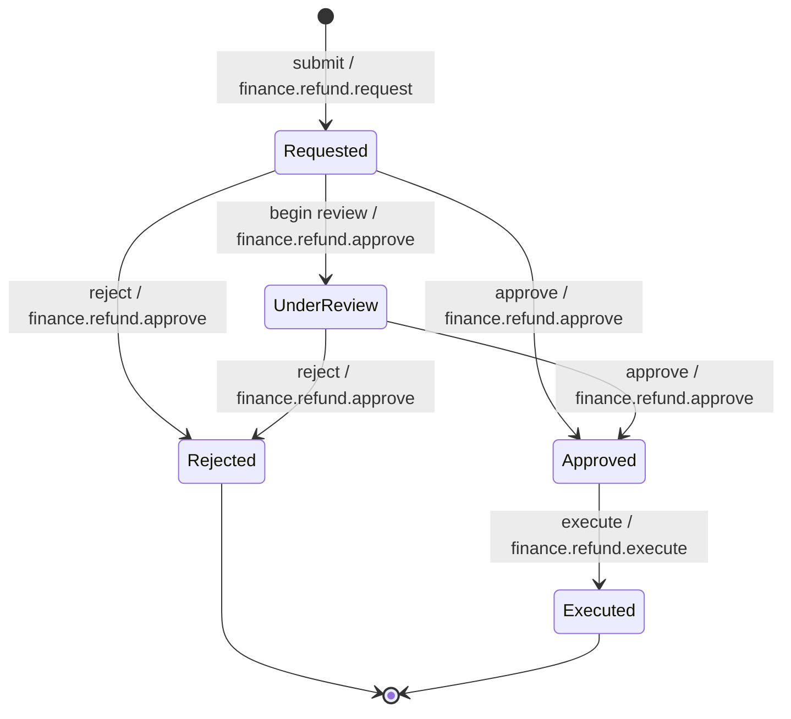
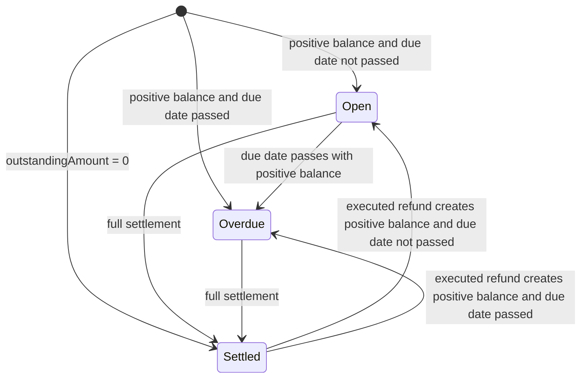

# Part 2 – User Stories, Use Cases, Workflows, State Machines

## Module 12 – Fee, Billing & Receivables Management

## 1. Purpose and Scope of This Part

This document translates the Module 12 business requirements into actor-oriented user stories, executable acceptance criteria, primary use cases, operational workflows, and explicit entity state machines.

The module is invoice-centric. Finance owns invoices, installment schedules, payments, payment allocations, receipts, refunds, receivables, and corporate credit rules. Enrollment remains the central learning transaction. Course Catalog owns pricing and discount rules, while Finance consumes resolved commercial values and validates monetary arithmetic. Completion and Certificate consume authoritative payment-validation results from Finance. Branch access is always enforced on the server.

The workflows in this document assume:

- modular-monolith deployment;
- PostgreSQL transactional persistence;
- TypeScript application services in the Finance bounded context;
- immutable posted financial history;
- no hard delete of posted finance records;
- Oman GST business time, UTC+4;
- OMR monetary precision of three decimal places where currency is OMR;
- bilingual English and Arabic document rendering;
- manual payment processing in the current phase;
- no online payment gateway authorization flow in the current phase;
- no Tally integration in the current phase.

---

# 2. User Stories

## US-FBR-001 – Create a Student Invoice from an Enrollment

**Priority:** Must Have

**As an** Accountant or Branch Admin  
**I want to** create and issue a student invoice from an eligible enrollment using the enrollment’s resolved price and discount values  
**So that** the student’s financial obligation is formally recorded, traceable to the course and batch, and available for payment and receivables tracking.

### Acceptance Criteria

```gherkin
Feature: Create student invoice from enrollment

  Scenario: Create and issue a valid student invoice
    Given I am authenticated with finance.invoice.create and finance.invoice.issue permissions
    And the enrollment belongs to a branch within my authorized branch scope
    And the enrollment has a valid student profile, course, batch, currency, resolved price, resolved discount, and final amount
    And the enrollment has not already been invoiced for the same obligation
    When I create a draft invoice from the enrollment
    And I review the line values
    And I issue the invoice
    Then the invoice shall receive a unique branch-aware invoice number
    And every invoice line shall retain enrollmentId and courseId traceability
    And totalAmount shall equal subtotal minus discountAmount plus taxAmount
    And outstandingAmount shall equal totalAmount
    And the invoice status shall be Issued
    And a receivable shall exist for the invoice when outstandingAmount is greater than zero
    And the action shall be audited
    And an InvoiceIssued domain event shall be published after transaction commit

  Scenario: Reject duplicate invoicing of the same enrollment obligation
    Given an active invoice already contains the enrollment obligation
    When I attempt to create another invoice for the same obligation without an authorized correction or additional-charge flow
    Then the request shall be rejected
    And no new invoice or receivable shall be persisted
    And the response shall use the configured duplicate-billing application error code

  Scenario: Reject invoice creation for a foreign branch
    Given the enrollment belongs to a branch outside my authorized scope
    When I attempt to create an invoice for the enrollment
    Then access shall be denied
    And no invoice shall be created
    And the authorization failure shall not reveal unrelated branch financial data
```

---

## US-FBR-002 – Create a Consolidated Corporate Invoice

**Priority:** Must Have

**As an** Accountant  
**I want to** create a corporate invoice containing eligible enrollment obligations for a corporate account  
**So that** corporate customers can be billed according to their agreed commercial arrangements while every participant enrollment remains traceable.

### Acceptance Criteria

```gherkin
Feature: Corporate consolidated invoicing

  Scenario: Create a valid corporate invoice
    Given I have finance.invoice.create permission
    And I can access the source branches of the selected obligations
    And all selected obligations belong to the same corporate account
    And all selected obligations use the same invoice currency
    And none of the obligations has already been invoiced
    When I create the corporate invoice
    Then one invoice shall be created for the corporate account
    And each invoice line shall preserve enrollmentId, courseId, source branch, quantity, unit price, discount, tax, and line total
    And the invoice totals shall reconcile to the sum of line totals
    And source branch attribution shall remain available for reporting and audit

  Scenario: Reject mixed-currency consolidation
    Given selected corporate obligations use more than one currency
    When I attempt to create one consolidated invoice
    Then the request shall be rejected
    And the obligations shall not be aggregated into a single invoice total

  Scenario: Reject unauthorized source branch inclusion
    Given one selected obligation belongs to a branch outside my authorized branch scope
    When I attempt to create the consolidated invoice
    Then the request shall be denied
    And no partial invoice shall be created
```

---

## US-FBR-003 – Configure an Installment Plan

**Priority:** Must Have

**As an** Accountant  
**I want to** configure an installment schedule for an eligible invoice  
**So that** agreed staged payments can be tracked against exact due dates and balances.

### Acceptance Criteria

```gherkin
Feature: Installment plan creation

  Scenario: Create a valid installment plan
    Given I have finance.installment.create permission
    And the invoice is within my authorized branch scope
    And the invoice is eligible for installment scheduling
    And the invoice outstanding amount is 300.000 OMR
    When I create three installments of 100.000 OMR each
    And the sequence numbers are 1, 2, and 3
    And the due dates are non-decreasing
    Then the installment plan shall be created
    And the sum of installment amounts shall equal 300.000 OMR
    And each installment shall initially derive Pending or Overdue status based on its due date and paid amount

  Scenario: Reject a schedule whose total does not equal the governed obligation
    Given the invoice obligation is 300.000 OMR
    When I submit installment amounts totaling 299.999 OMR
    Then the installment plan shall be rejected
    And no installment records shall be persisted

  Scenario: Reject non-contiguous installment sequences
    When I submit sequence numbers 1, 2, and 4
    Then the installment plan shall be rejected
    And the response shall identify the sequence-contiguity validation failure
```

---

## US-FBR-004 – Record a Manual Payment and Generate a Receipt

**Priority:** Must Have

**As an** Accountant or authorized Cashier  
**I want to** record a manual payment against an invoice and receive an authoritative receipt  
**So that** balances, installments, receivables, and the customer’s proof of payment are updated consistently.

### Acceptance Criteria

```gherkin
Feature: Record manual payment

  Scenario: Post a valid full payment
    Given I have finance.payment.record permission
    And the invoice is within my branch scope
    And the invoice is payable
    And the invoice outstanding amount is 150.000 OMR
    And I provide a unique idempotency key
    When I record a successful payment of 150.000 OMR with a valid active payment method
    Then exactly one Payment shall be persisted
    And the payment shall be linked to the invoice
    And payment allocation shall not exceed the payment amount
    And invoice paidAmount shall increase by 150.000 OMR
    And invoice outstandingAmount shall become 0.000 OMR
    And the invoice status shall become Paid
    And the receivable shall become Settled
    And exactly one Receipt shall be generated for the Payment
    And all financial changes and audit evidence shall commit atomically

  Scenario: Retry the same payment request
    Given a payment request with an idempotency key has already committed successfully
    When the identical request is retried with the same idempotency key
    Then the system shall return the original successful result
    And no duplicate Payment shall be created
    And no duplicate Receipt shall be created

  Scenario: Reject payment exceeding outstanding balance
    Given an invoice has an outstanding balance of 100.000 OMR
    When I attempt to post an ordinary payment of 100.001 OMR
    Then the payment shall be rejected
    And invoice, receivable, allocation, and receipt state shall remain unchanged
```

---

## US-FBR-005 – Record a Partial Payment and Allocate It to Installments

**Priority:** Must Have

**As an** Accountant  
**I want to** record a partial payment and allocate it to eligible installment balances  
**So that** installment status and the overall invoice balance remain accurate.

### Acceptance Criteria

```gherkin
Feature: Partial payment and installment allocation

  Scenario: Allocate partial payment to earliest unpaid installments
    Given an invoice has installments with remaining balances of 100.000, 100.000, and 100.000 OMR
    And the allocation policy is earliest due installment first
    When I post a payment of 150.000 OMR
    Then 100.000 OMR shall be allocated to the first installment
    And 50.000 OMR shall be allocated to the second installment
    And the first installment shall become Paid
    And the second installment shall become PartiallyPaid
    And the third installment shall remain Pending or Overdue according to due date
    And the invoice paidAmount shall increase by 150.000 OMR
    And the invoice outstandingAmount shall decrease by 150.000 OMR

  Scenario: Reject allocation exceeding payment balance
    Given a payment amount of 100.000 OMR
    When allocations totaling 100.001 OMR are submitted
    Then the transaction shall be rejected
    And no payment, allocation, receipt, invoice balance, or receivable change shall commit
```

---

## US-FBR-006 – Request, Approve, and Execute a Refund

**Priority:** Must Have

**As an** authorized Finance user  
**I want to** request, independently approve, and execute a refund against a valid payment  
**So that** customer refunds are controlled, auditable, and reflected in invoice and receivable balances without changing the original payment.

### Acceptance Criteria

```gherkin
Feature: Refund workflow

  Scenario: Complete refund maker-checker-executor workflow
    Given a payment has a remaining refundable balance of 100.000 OMR
    And a requester has finance.refund.request permission
    And a different approver has finance.refund.approve permission
    And an executor has finance.refund.execute permission
    When the requester submits a refund of 50.000 OMR with a valid reason
    Then the refund shall enter Requested status
    When the different approver approves the request
    Then the refund shall enter Approved status
    When the authorized executor records successful refund execution
    Then the refund shall enter Executed status
    And the original Payment amount shall remain unchanged
    And the effective paid amount of the obligation shall decrease by 50.000 OMR
    And the invoice outstanding amount shall be recalculated
    And a receivable shall reopen or increase if a positive balance results
    And each stage shall be audited

  Scenario: Prevent requester from approving own refund
    Given I submitted a refund request
    And I also hold finance.refund.approve permission
    When I attempt to approve my own refund request
    Then the approval shall be rejected by the maker-checker rule
    And the refund shall remain in its current decision state

  Scenario: Reject refund exceeding remaining refundable balance
    Given remaining refundable payment balance is 25.000 OMR
    When a refund request for 25.001 OMR is submitted
    Then the request shall be rejected
    And no refund record shall be created
```

---

## US-FBR-007 – Monitor Receivables and Aging

**Priority:** Must Have

**As a** Finance Manager or Accountant  
**I want to** view outstanding receivables by branch, customer, due date, and aging bucket  
**So that** collection actions can be prioritized and overdue exposure can be controlled.

### Acceptance Criteria

```gherkin
Feature: Receivables monitoring

  Scenario Outline: Derive aging bucket from Oman GST business date
    Given an open receivable with a positive outstanding amount
    And daysPastDue is <daysPastDue>
    When the aging service recalculates the receivable
    Then agingBucket shall be <bucket>

    Examples:
      | daysPastDue | bucket      |
      | -1          | Current     |
      | 0           | Current     |
      | 1           | 30 Days     |
      | 30          | 30 Days     |
      | 31          | 60 Days     |
      | 60          | 60 Days     |
      | 61          | 90 Days     |
      | 90          | 90 Days     |
      | 91          | 120+ Days   |
      | 120         | 120+ Days   |

  Scenario: Enforce branch-filtered receivables query
    Given I have finance.receivable.read permission for Branch A only
    When I open receivables aging
    Then the result set, totals, chart values, counts, and report denominator shall include only Branch A data
    And no Branch B record or aggregate contribution shall be exposed
```

---

## US-FBR-008 – Enforce Corporate Credit During Enrollment

**Priority:** Must Have

**As a** Corporate Enrollment operator  
**I want to** receive an authoritative corporate credit decision before confirming a corporate enrollment  
**So that** enrollment complies with the corporate account’s effective credit policy.

### Acceptance Criteria

```gherkin
Feature: Corporate credit validation

  Scenario: Block enrollment when projected exposure exceeds credit limit and blocking is enabled
    Given the effective credit rule has creditLimit 10000.000 OMR
    And currentOutstanding is 7000.000 OMR
    And committedAmount is 2000.000 OMR
    And proposedEnrollmentValue is 1500.000 OMR
    And blockOnCreditLimit is true
    When Enrollment requests credit validation
    Then projectedExposure shall be 10500.000 OMR
    And availableCredit before proposal shall be 1000.000 OMR
    And the decision shall be Block
    And the corporate enrollment confirmation shall not proceed
    And the failed credit validation shall be audited

  Scenario: Warn but allow when blocking is disabled
    Given projectedExposure exceeds creditLimit
    And blockOnCreditLimit is false
    When credit validation is requested
    Then the decision shall be AllowWithWarning
    And Enrollment may continue according to its own workflow
    And the over-limit warning evidence shall be preserved
```

---

## US-FBR-009 – Validate Payment Completion for Completion and Certificate

**Priority:** Must Have

**As the** Completion or Certificate module  
**I want to** query authoritative enrollment payment-validation status from Finance  
**So that** completion or certificate workflows do not infer settlement from receipt existence or stale reporting data.

### Acceptance Criteria

```gherkin
Feature: Authoritative enrollment payment validation

  Scenario: Payment validation is not required
    Given enrollment.paymentValidationRequired is false
    When the authorized internal application service requests payment validation
    Then Finance shall return NotRequired

  Scenario: Payment validation passes
    Given enrollment.paymentValidationRequired is true
    And every required valid financial obligation has zero outstanding balance
    When payment validation is requested
    Then Finance shall return Passed

  Scenario: Payment validation fails
    Given enrollment.paymentValidationRequired is true
    And at least one required valid obligation has a positive outstanding balance
    When payment validation is requested
    Then Finance shall return Failed
    And the result shall include authoritative outstanding summary data permitted by the internal contract
```

---

## US-FBR-010 – View Branch and Consolidated Finance Performance

**Priority:** Should Have

**As a** Branch Admin, Finance Manager, or Executive with appropriate access  
**I want to** view branch-level or authorized consolidated financial summaries  
**So that** collection performance, receivables exposure, overdue amounts, and refund activity can be monitored.

### Acceptance Criteria

```gherkin
Feature: Branch and consolidated finance summaries

  Scenario: View assigned branch summary
    Given I have finance.report.branch permission
    And Branch A is within my assigned branch scope
    When I request the Branch A finance dashboard
    Then the metrics shall be calculated only from authorized Branch A data
    And monetary totals shall be grouped by currency

  Scenario: Deny consolidated report with only Finance permission
    Given I have finance.report.consolidated permission
    But I do not have IAM consolidated branch entitlement
    When I request a cross-branch consolidated report
    Then access shall be denied

  Scenario: Allow consolidated report with both authorization keys
    Given I have finance.report.consolidated permission
    And IAM grants valid consolidated branch entitlement
    When I request the consolidated report
    Then the report shall include only branches covered by my effective consolidated scope
```

---

## US-FBR-011 – Access Student Self-Service Billing Information

**Priority:** Should Have

**As a** Student  
**I want to** view my own invoices, installment schedule, payment history, receipts, and refund status  
**So that** I can understand and verify my financial obligations and transactions without contacting Finance for routine information.

### Acceptance Criteria

```gherkin
Feature: Student self-service finance access

  Scenario: Student views own invoice
    Given I am authenticated as Student A
    And I have finance.self.invoice.read permission
    When I open my invoice list
    Then only invoices linked to Student A shall be returned

  Scenario: Student attempts to access another student's receipt
    Given I am authenticated as Student A
    And a receipt belongs to Student B
    When I request Student B's receipt by identifier
    Then access shall be denied or returned as not found according to the anti-enumeration policy
    And no financial data for Student B shall be disclosed
```

---

## US-FBR-012 – Audit Sensitive Financial Operations

**Priority:** Must Have

**As an** Auditor or authorized Finance Manager  
**I want to** inspect immutable audit evidence for sensitive financial actions  
**So that** invoice issuance, payments, refunds, credit-rule changes, exports, and financial adjustments are accountable and reviewable.

### Acceptance Criteria

```gherkin
Feature: Finance auditability

  Scenario: Record audit evidence for a payment posting
    Given an authorized payment transaction commits successfully
    When the audit record is inspected
    Then it shall identify the actor
    And the action
    And the affected entity type and entity identifier
    And the branch context
    And the performed timestamp
    And the relevant old and new values
    And the correlation or trace identifier

  Scenario: Audit an export
    Given an authorized user exports a finance dataset
    When the export completes
    Then an audit entry shall record actor, dataset, filters, branch scope, timestamp, export format, and row count

  Scenario: Prevent Auditor mutation
    Given I hold finance.audit.read but no finance mutation permission
    When I attempt a direct invoice, payment, refund, or credit-rule mutation endpoint
    Then the request shall be denied
```

---

# 3. Use Cases

## UC-FBR-001 – Create and Issue Student Invoice

### Primary Actor

Accountant.

### Supporting Actors and Systems

- Branch Admin with equivalent configured permissions;
- Admission & Enrollment application service;
- Course Catalog pricing-resolution contract;
- Configuration NumberingSeries service;
- Audit & Compliance service;
- Communication & Notification application port.

### Preconditions

1. Actor is authenticated.
2. Actor has `finance.invoice.create`; issuing additionally requires `finance.invoice.issue`.
3. Enrollment exists and is within effective branch scope.
4. Enrollment has valid student profile, course, batch, branch, currency, resolved pricing source, resolved price, resolved discount, and final amount.
5. Source pricing resolution is valid according to Batch → Branch → Global Course precedence.
6. The same financial obligation has not already been invoiced.
7. Invoice numbering configuration is active for the branch and entity type.

### Main Success Scenario

1. Actor opens the Create Invoice workflow from an eligible enrollment or invoice workspace.
2. UI retrieves enrollment billing context through the Finance application query contract.
3. Server independently authorizes permission and branch scope.
4. Finance validates source references and duplicate-billing constraints.
5. Finance creates a Draft Invoice and InvoiceLineItem records.
6. Each line records enrollment, course, description, quantity, unit price, discount amount, tax amount, and line total.
7. Finance calculates subtotal as the sum of line gross amounts.
8. Finance calculates invoice discountAmount from line and authorized invoice-level adjustments according to the configured model.
9. Finance calculates taxAmount from approved tax inputs.
10. Finance validates `totalAmount = subtotal - discountAmount + taxAmount`.
11. Finance initializes `paidAmount = 0` and `outstandingAmount = totalAmount`.
12. Actor reviews the draft.
13. Actor invokes Issue.
14. Server revalidates authorization, branch scope, optimistic version, source integrity, line count, arithmetic, and issue eligibility.
15. NumberingSeries atomically assigns a unique invoice number.
16. Invoice status changes from Draft to Issued.
17. If outstandingAmount is positive, Finance creates or synchronizes the Receivable.
18. Finance persists AuditLog evidence through the audit boundary.
19. Transaction commits.
20. Finance publishes `InvoiceGenerated` or `InvoiceIssued` internal domain event according to the module event naming contract.
21. Communication receives the minimum required notification payload.

### Alternative Flows

**A1 – Enrollment not billable:** Reject with business validation error; no invoice is persisted.

**A2 – Duplicate obligation detected:** Reject creation; return duplicate-billing conflict response.

**A3 – Arithmetic mismatch:** Keep Draft unchanged or reject issue; do not allocate invoice number.

**A4 – Numbering series unavailable:** Issue fails atomically; Draft remains Draft; no partial Receivable is created.

**A5 – Stale invoice version:** Return HTTP 409 with the configured version-conflict application code.

**A6 – Foreign branch:** Return authorization failure; do not disclose financial details.

### Postconditions

- One authoritative issued invoice exists.
- Invoice lines preserve enrollment and course traceability.
- Outstanding balance is authoritative.
- Receivable is synchronized.
- Issue action is audited.
- Notification/event publication occurs only after successful commit.

---

## UC-FBR-002 – Create Corporate Consolidated Invoice

### Primary Actor

Accountant.

### Preconditions

1. Actor has `finance.invoice.create`.
2. Actor has effective branch access to every selected source obligation.
3. Selected obligations belong to the same corporate account.
4. Selected obligations use one currency.
5. Obligations are billable and not already invoiced.
6. Corporate account is active for billing.

### Main Success Scenario

1. Actor selects a corporate account.
2. System lists eligible uninvoiced obligations within authorized branch scope.
3. Actor filters and selects obligations.
4. Finance validates corporate-account identity, currency consistency, source branch access, and duplicate billing.
5. Finance creates Draft corporate Invoice.
6. Finance creates one or more InvoiceLineItem records preserving source enrollment, course, and branch attribution.
7. Finance calculates and validates subtotal, discount, tax, and total.
8. Actor reviews and issues the invoice using UC-FBR-001 issue controls.
9. Finance creates/synchronizes Receivable.
10. Finance records audit evidence and publishes the committed invoice event.

### Alternative Flows

- Mixed corporate accounts: reject entire request.
- Mixed currencies: reject entire request.
- One unauthorized branch source: reject entire request; no partial invoice.
- Duplicate obligation: reject or omit only when the API contract explicitly supports pre-validation selection; command execution must never silently double bill.
- Concurrent source invoicing: optimistic/transactional conflict; actor refreshes eligible obligations.

### Postconditions

- Corporate invoice is traceable to every source enrollment and source branch.
- Corporate receivable exposure is updated from authoritative open balances.

---

## UC-FBR-003 – Create Installment Plan

### Primary Actor

Accountant.

### Preconditions

1. Actor has `finance.installment.create`.
2. Invoice is within branch scope.
3. Invoice is eligible for an installment plan.
4. Governed obligation is positive.
5. No conflicting active installment plan exists for the same obligation.

### Main Success Scenario

1. Actor opens eligible invoice detail.
2. Actor chooses Create Installment Plan.
3. Actor enters plan name and schedule rows.
4. Server validates sequence starts at 1 and is contiguous.
5. Server validates each installment amount is greater than zero.
6. Server validates due dates are non-decreasing.
7. Server validates schedule total equals the governed obligation.
8. Finance persists InstallmentPlan and Installment records in one transaction.
9. Each installment status is derived from paid amount, balance, due date, and Oman GST business date.
10. Audit evidence is recorded.

### Alternative Flows

- Amount sum mismatch: reject.
- Duplicate sequence: reject.
- Sequence gap: reject.
- Decreasing due date: reject.
- Invoice settled before commit: return conflict and require refresh.

### Postconditions

- One valid schedule exists.
- Installment records are available for payment allocation and delinquency reporting.

---

## UC-FBR-004 – Record Manual Payment

### Primary Actor

Accountant or authorized Cashier.

### Preconditions

1. Actor has `finance.payment.record`.
2. Invoice is within branch scope.
3. Invoice status is Issued, PartiallyPaid, or Overdue.
4. Outstanding amount is positive.
5. Payment method is active.
6. Method-specific reference requirements are satisfied.
7. Request contains an idempotency key.

### Main Success Scenario

1. Actor selects invoice.
2. Actor enters payment date, payment method, amount, reference number when required, and remarks.
3. Server validates permission and branch scope.
4. Server checks idempotency key.
5. Server locks or concurrency-protects the balance-sensitive invoice and related schedule state.
6. Finance validates amount is greater than zero and not greater than current outstanding.
7. Finance persists Payment.
8. Finance allocates payment to installment balances according to explicit request or configured allocation policy.
9. Finance updates installment paid amounts and derived statuses.
10. Finance recalculates invoice paid and outstanding amounts.
11. Finance derives Invoice status from balance and due-date rules.
12. Finance synchronizes Receivable outstanding amount, status, and aging inputs.
13. Finance creates exactly one Receipt linked to Payment.
14. Finance records audit evidence.
15. Entire transaction commits atomically.
16. Committed payment and receipt events are published.
17. Caller receives Payment and Receipt identifiers and updated balance summary.

### Alternative Flows

- Duplicate identical idempotency request: return original success response.
- Same key with different payload: reject idempotency conflict.
- Amount exceeds outstanding: reject before persistence.
- Inactive payment method: reject.
- Missing transfer/card/cheque reference: reject.
- Concurrent balance changed: conflict; roll back and require refresh.
- Database transaction failure: roll back all Payment, Allocation, Receipt, balance, Receivable, and audit changes.
- Client timeout after unknown outcome: client retries with same idempotency key; system returns committed original result or processes once.

### Postconditions

- Financial state is internally reconciled.
- Exactly one receipt exists per successful payment.
- Original request is safely replayable using idempotency key.

---

## UC-FBR-005 – Process Refund

### Primary Actor

Refund Requester, Refund Approver, and Refund Executor as separate authorized responsibilities.

### Preconditions

1. Payment and invoice exist and are within actor scope.
2. Remaining refundable balance is positive.
3. Requester has `finance.refund.request`.
4. Approver has `finance.refund.approve` and is not the requester.
5. Executor has `finance.refund.execute`.

### Main Success Scenario

1. Requester selects eligible Payment.
2. Requester enters refund type, amount, and reason.
3. Finance validates payment linkage and remaining refundable balance.
4. Refund is created in Requested status.
5. ApprovalRequest is created through the Audit & Compliance approval boundary when required by the system design.
6. RefundRequested event is published after commit.
7. Independent approver reviews request details and audit context.
8. Approver approves Refund; status becomes Approved.
9. RefundApproved event is published.
10. Executor confirms actual refund execution evidence.
11. Finance revalidates Approved state and remaining refundable balance.
12. Finance records execution transaction atomically.
13. Refund status becomes Executed.
14. Original Payment remains unchanged.
15. Effective paid amount is recalculated.
16. Invoice paid and outstanding amounts are recalculated.
17. Receivable is reopened or increased if a positive obligation exists.
18. Audit evidence is persisted.
19. RefundExecuted event is published after commit.

### Alternative Flows

- Request amount exceeds refundable balance: reject request.
- Full refund type with amount not equal to remaining refundable balance: reject.
- Requester tries self-approval: reject.
- Approver rejects: status becomes Rejected; execution is prohibited.
- Executor attempts Requested or UnderReview refund: reject.
- Concurrent refund reduces refundable balance before execution: execution fails with conflict and requires review.
- Execution transaction fails: remain Approved; no partial balance changes commit.

### Postconditions

- Executed refund is immutable as a posted finance record.
- Invoice and Receivable reflect effective economic balance.
- Complete maker-checker-executor history is available.

---

## UC-FBR-006 – Recalculate Receivables and Aging

### Primary Actor

Finance scheduled reconciliation job.

### Supporting Actor

Accountant or Finance Manager initiating an authorized reconciliation where supported.

### Preconditions

1. Authoritative Invoice data is available.
2. Oman GST business date service is available.
3. Job has internal application authorization.

### Main Success Scenario

1. Job selects invoices requiring receivable reconciliation.
2. For each invoice, it derives authoritative outstanding amount.
3. It compares Receivable outstandingAmount with Invoice outstandingAmount.
4. It creates or updates Receivable where required.
5. If outstandingAmount is zero, Receivable status becomes Settled.
6. If outstandingAmount is positive and due date is not passed, status becomes Open.
7. If outstandingAmount is positive and due date has passed, status becomes Overdue.
8. `daysPastDue` is calculated using Oman GST business date.
9. Aging bucket is assigned according to BR-FBR-031 through BR-FBR-035.
10. Reconciliation metrics and exceptions are emitted.
11. Material reporting projections may refresh independently after transactional reconciliation.

### Alternative Flows

- Transactional database unavailable: job fails without using stale reporting projection as source of truth.
- Reconciliation mismatch cannot be safely repaired automatically: create operational exception; do not directly overwrite posted financial history.
- One record processing conflict: retry according to bounded retry policy, then surface exception.

### Postconditions

- Receivable balances reconcile to Invoice outstanding balances or are explicitly flagged as exceptions.
- Aging reflects Oman GST business date.

---

## UC-FBR-007 – Validate Corporate Credit

### Primary Actor

Admission & Enrollment application service.

### Preconditions

1. Corporate account exists.
2. Proposed enrollment value is known in the applicable currency.
3. Finance transactional data is healthy and authoritative.
4. Effective credit rule selection can be performed for business date.

### Main Success Scenario

1. Enrollment sends corporateAccountId, proposedEnrollmentValue, currency, and enrollment context through the internal Finance application port.
2. Finance selects the single effective credit rule for the corporate account and business date.
3. Finance calculates currentOutstanding from open corporate receivables.
4. Finance calculates committedAmount from eligible uninvoiced corporate obligations exactly once.
5. Finance calculates `availableCredit = creditLimit - currentOutstanding - committedAmount`.
6. Finance calculates `projectedExposure = currentOutstanding + committedAmount + proposedEnrollmentValue`.
7. If projected exposure does not exceed limit, decision is Allow.
8. If exposure exceeds limit and `blockOnCreditLimit = false`, decision is AllowWithWarning.
9. If exposure exceeds limit and `blockOnCreditLimit = true`, decision is Block.
10. Finance returns decision and authoritative calculation summary.
11. Validation is audited when warning or block occurs.

### Alternative Flows

- Overlapping effective credit rules found: fail validation and raise configuration integrity error.
- Currency mismatch without approved conversion policy: reject calculation.
- Finance authoritative dependency unavailable: fail closed; do not use reporting read models.

### Postconditions

- Enrollment receives one authoritative decision.
- Finance does not create or mutate Enrollment.

---

## UC-FBR-008 – Query Enrollment Payment Validation

### Primary Actor

Exam & Completion application service or Certificate application service.

### Preconditions

1. Caller is an authorized internal module application service.
2. Enrollment exists.
3. Finance can resolve valid obligations linked to Enrollment.

### Main Success Scenario

1. Caller requests payment-validation status for Enrollment.
2. Finance reads `paymentValidationRequired` through the defined cross-context contract or supplied trusted enrollment context.
3. If false, Finance returns NotRequired.
4. If true, Finance selects required valid obligations.
5. Finance calculates authoritative outstanding balance from transactional data.
6. If all required balances are zero, Finance returns Passed.
7. Otherwise Finance returns Failed.
8. Caller uses the decision but does not recompute it from Receipt presence.

### Alternative Flows

- Transactional Finance unavailable: return dependency-unavailable failure; caller must not infer Passed.
- Invalid enrollment reference: return not found or contract validation error.

### Postconditions

- Completion/Certificate receives authoritative payment state.
- No Finance record is mutated by the query.

---

## UC-FBR-009 – View Branch or Consolidated Finance Dashboard

### Primary Actor

Branch Admin, Accountant, Finance Manager, Executive, or Auditor according to assigned permissions.

### Preconditions

1. User is authenticated.
2. Branch report requires `finance.report.branch`.
3. Consolidated report requires both `finance.report.consolidated` and valid IAM consolidated branch entitlement.
4. Reporting projection health/staleness is known.

### Main Success Scenario

1. Actor selects report period and authorized filters.
2. Server derives effective branch scope from IAM; client branch input is treated only as a requested subset.
3. Reporting query applies permission and branch predicate before aggregation.
4. Monetary values are grouped by currency.
5. Dashboard returns KPI summaries, charts, and exception tables.
6. Staleness metadata is displayed when a materialized projection is used.
7. Export requires separate `finance.export` permission.

### Alternative Flows

- Missing report permission: deny.
- Missing consolidated IAM entitlement: deny consolidated view.
- Requested branch outside scope: deny or constrain according to API contract; never broaden scope.
- Stale read model within allowed degraded threshold: display explicit stale timestamp.
- Staleness exceeds operational threshold: mark dashboard degraded and alert operations.

### Postconditions

- Actor sees only authorized aggregates and records.
- Reporting queries do not change transactional data.

---

## UC-FBR-010 – View Student Self-Service Billing

### Primary Actor

Student.

### Preconditions

1. Student is authenticated.
2. Student has the relevant `finance.self.*` permission.
3. Student identity is linked to the StudentProfile used by the financial record.

### Main Success Scenario

1. Student opens Finance section.
2. Server derives student identity from authenticated context.
3. Query filters invoices to records owned by that StudentProfile.
4. Student views Invoice detail.
5. Student views own Installment schedule.
6. Student views own Payment history.
7. Student downloads own Receipt using authorized short-lived document access.
8. Student views own Refund status.

### Alternative Flows

- Student requests another student’s identifier: deny or return non-enumerating not-found result.
- Missing self-service permission: hide menu element and deny direct API access.
- Receipt document unavailable: return controlled document error without exposing storage path.

### Postconditions

- Student receives read-only self-service data.
- No finance mutation capability is exposed.

---

# 4. Core Business Workflows

## 4.1 Regular Enrollment to Invoice to Payment to Receipt



### Workflow Invariants

1. Enrollment is not duplicated in Finance.
2. Finance does not re-resolve pricing hierarchy; it consumes trusted resolved commercial values and validates arithmetic.
3. Invoice issue is atomic with numbering and Receivable synchronization.
4. Payment posting is atomic across Payment, PaymentAllocation, Invoice, Installment, Receivable, Receipt, and required audit persistence.
5. Notification dispatch occurs after commit and cannot roll back committed Finance transactions.

---

## 4.2 Corporate Credit Validation Before Enrollment Confirmation



### Workflow Invariants

- Credit validation uses authoritative transactional data.
- Reporting projections are never used for the decision.
- Finance returns a decision; Enrollment owns enrollment status transition.
- Effective credit rules for a corporate account cannot overlap.

---

## 4.3 Installment Payment Allocation Workflow

```text
Input Payment Amount
        |
        v
Validate invoice is payable and amount <= outstanding
        |
        v
Resolve allocation mode
        |
        +--> Explicit validated allocations
        |
        +--> Configured earliest-due-first policy
        |
        v
For each eligible installment in allocation order:
    allocatable = min(paymentRemaining, installmentRemaining)
    create PaymentAllocation(allocatable)
    installment.paidAmount += allocatable
    derive installment status
    paymentRemaining -= allocatable
    stop when paymentRemaining = 0
        |
        v
Validate sum(allocations) <= Payment.amount
        |
        v
Update Invoice paid/outstanding balances
        |
        v
Derive Invoice status
        |
        v
Synchronize Receivable
        |
        v
Create exactly one Receipt
        |
        v
Commit all changes atomically
```

### Allocation Rules

1. An allocation cannot exceed Payment unallocated balance.
2. An allocation cannot exceed Installment remaining balance.
3. Allocation sum must not exceed Payment amount.
4. Any unallocated amount is permitted only when the approved payment application contract explicitly supports invoice-level settlement outside installment allocation; otherwise the request is rejected.
5. Installment status is derived, not arbitrarily selected by the user.

---

## 4.4 Refund Maker-Checker-Executor Workflow



### Rejection Branch

```text
Requested / UnderReview
        |
        | finance.refund.approve + independent approver
        v
     Rejected
        |
        +--> terminal decision state
        +--> execution forbidden
        +--> audit required
        +--> RefundRejected notification event
```

---

## 4.5 Receivable Reconciliation and Aging Workflow



### Aging Mapping

| Days Past Due | Aging Bucket |
|---:|---|
| `<= 0` | `Current` |
| `1–30` | `30 Days` |
| `31–60` | `60 Days` |
| `61–90` | `90 Days` |
| `>= 91` | `120+ Days` compatibility bucket until approved domain-model revision |

---

## 4.6 Completion and Certificate Payment Validation Workflow



### Workflow Invariant

Receipt existence is never treated as proof of complete settlement. The authoritative decision is based on valid obligation balances.

---

## 4.7 Branch-Scoped Query and Consolidated Reporting Workflow

```text
Authenticated User
      |
      v
Resolve IAM branch assignments and hierarchy permissions
      |
      v
Resolve requested Finance operation permission
      |
      +--> ordinary entity/report read
      |      require action/report permission
      |      constrain query to effective branch scope
      |
      +--> consolidated report
             require finance.report.consolidated
             AND IAM consolidated branch entitlement
             constrain aggregation to effective consolidated scope
      |
      v
Apply branch predicate BEFORE filtering aggregates, grouping, counts, sums, ratios, rankings
      |
      v
Return authorized result
```

The UI hiding a branch selector or menu item is not an authorization control. Direct API and Server Action calls are independently authorized.

---

# 5. State Machines

## 5.1 Invoice State Machine

### States

- `Draft`
- `Issued`
- `PartiallyPaid`
- `Paid`
- `Overdue`
- `Cancelled`

### Mermaid State Diagram



### Invoice Transition Rules Matrix

| From | To | Trigger | Required Human Permission | System Conditions | Audit Required |
|---|---|---|---|---|---|
| Draft | Issued | Issue command | `finance.invoice.issue` | Balanced totals; 1–500 valid lines; valid source; numbering series available; optimistic version matches | Yes |
| Draft | Cancelled | Cancel command | `finance.invoice.cancel` | Valid cancellation reason; branch scope valid | Yes |
| Issued | PartiallyPaid | Successful payment commit | `finance.payment.record` for initiating command | `0 < effectivePaidAmount < totalAmount`; atomic payment transaction | Yes |
| Issued | Paid | Successful payment commit | `finance.payment.record` | `outstandingAmount = 0` | Yes |
| Issued | Overdue | Aging/status derivation | Internal Finance job/service | Oman GST business date is after dueDate and outstandingAmount > 0 | System audit/operational evidence |
| Issued | Cancelled | Cancel command | `finance.invoice.cancel` | No effective payment exists; authorized reason | Yes |
| PartiallyPaid | Paid | Successful payment commit | `finance.payment.record` | outstandingAmount becomes zero | Yes |
| PartiallyPaid | Overdue | Status derivation | Internal Finance job/service | due date passed; positive balance remains | System evidence |
| Overdue | PartiallyPaid | Successful partial payment | `finance.payment.record` | positive balance remains after payment | Yes |
| Overdue | Paid | Successful full settlement | `finance.payment.record` | outstandingAmount becomes zero | Yes |
| Paid | PartiallyPaid | Executed refund | `finance.refund.execute` for initiating command | refund creates positive balance and due date is not passed | Yes |
| Paid | Overdue | Executed refund | `finance.refund.execute` | refund creates positive balance and due date has passed | Yes |

### Invoice Transition Prohibitions

1. Cancelled is terminal.
2. Paid invoice cannot be cancelled.
3. Draft cannot accept payment.
4. Cancelled invoice cannot accept payment.
5. Direct manual status editing is prohibited.
6. State derivation caused by payment/refund must occur in the same transaction as the balance change.
7. A stale `version` rejects the transition rather than silently overwriting newer state.

---

## 5.2 Installment State Machine

### States

- `Pending`
- `PartiallyPaid`
- `Paid`
- `Overdue`

Installment status is derived from `amount`, `paidAmount`, `dueDate`, and Oman GST business date. It is not directly editable by an end user.

### Mermaid State Diagram



### Installment Transition Rules Matrix

| From | To | Trigger | Required Permission | Conditions | Audit Required |
|---|---|---|---|---|---|
| Pending | PartiallyPaid | Payment allocation | `finance.payment.record` | `0 < paidAmount < amount`; allocation within bounds | Via Payment audit |
| Pending | Paid | Payment allocation | `finance.payment.record` | `paidAmount = amount` | Via Payment audit |
| Pending | Overdue | Time/status derivation | Internal job/service | business date > dueDate and remaining balance > 0 | Operational evidence |
| PartiallyPaid | Paid | Payment allocation | `finance.payment.record` | `paidAmount = amount` | Via Payment audit |
| PartiallyPaid | Overdue | Time/status derivation | Internal job/service | business date > dueDate and remaining balance > 0 | Operational evidence |
| Overdue | PartiallyPaid | Partial payment allocation | `finance.payment.record` | payment applied; positive balance remains | Via Payment audit |
| Overdue | Paid | Full settlement allocation | `finance.payment.record` | remaining balance becomes zero | Via Payment audit |
| Paid | PartiallyPaid | Executed refund effect | `finance.refund.execute` | reopened positive balance; due date not passed | Via Refund audit |
| Paid | Overdue | Executed refund effect | `finance.refund.execute` | reopened positive balance; due date passed | Via Refund audit |

### Installment Invariants

- `0 <= paidAmount <= amount`.
- Status `Paid` requires equality.
- Status `PartiallyPaid` requires strictly positive paidAmount and positive remaining balance.
- `Overdue` requires positive remaining balance and passed due date.
- Refund effects never modify original Payment records.

---

## 5.3 Refund State Machine

### States

- `Requested`
- `UnderReview`
- `Approved`
- `Rejected`
- `Executed`

### Mermaid State Diagram



### Refund Transition Rules Matrix

| From | To | Trigger | Required Permission | Additional Rules | Audit Required |
|---|---|---|---|---|---|
| New request | Requested | Submit refund | `finance.refund.request` | Valid invoice/payment linkage; amount > 0; amount <= refundable balance; valid reason | Yes |
| Requested | UnderReview | Claim/start review | `finance.refund.approve` | Approver must be authorized and cannot violate maker-checker rule | Yes |
| Requested | Approved | Approve directly | `finance.refund.approve` | Approver != requester; remaining refundable balance still valid | Yes |
| Requested | Rejected | Reject | `finance.refund.approve` | Approver != requester; decision remarks required where configured | Yes |
| UnderReview | Approved | Approve | `finance.refund.approve` | Approver != requester; revalidate refundable balance | Yes |
| UnderReview | Rejected | Reject | `finance.refund.approve` | Approver != requester | Yes |
| Approved | Executed | Record successful execution | `finance.refund.execute` | Revalidate approved state and refundable balance; atomic balance recalculation | Yes |

### Refund Transition Prohibitions

1. Requested or UnderReview cannot execute.
2. Rejected cannot be approved or executed without a new valid refund request.
3. Executed is immutable and terminal.
4. Requester cannot approve own request even when holding approval permission.
5. Approval permission does not imply execute permission.
6. Execute permission does not imply approval permission.
7. A failed execution transaction leaves Refund in Approved state with no partial balance effects.

---

## 5.4 Receivable State Machine

### States

- `Open`
- `Overdue`
- `Settled`

Receivable state is derived from authoritative outstanding balance and due date. It is not manually editable as an arbitrary workflow status.

### Mermaid State Diagram



### Receivable Transition Rules Matrix

| From | To | Trigger | Required Permission | Conditions | Audit/Operational Evidence |
|---|---|---|---|---|---|
| Open | Overdue | Aging reconciliation | Internal Finance job/service | business date > dueDate; outstandingAmount > 0 | Job evidence and metrics |
| Open | Settled | Successful payment | `finance.payment.record` initiating command | outstandingAmount becomes zero | Payment audit |
| Overdue | Settled | Successful payment | `finance.payment.record` | outstandingAmount becomes zero | Payment audit |
| Settled | Open | Executed refund | `finance.refund.execute` | positive balance created; due date not passed | Refund audit |
| Settled | Overdue | Executed refund | `finance.refund.execute` | positive balance created; due date passed | Refund audit |

### Receivable Invariants

1. Receivable `outstandingAmount` must reconcile with Invoice `outstandingAmount`.
2. Settled requires `outstandingAmount = 0`.
3. Open requires `outstandingAmount > 0` and due date not passed.
4. Overdue requires `outstandingAmount > 0` and due date passed.
5. Aging bucket is independently derived from `daysPastDue`; Settled balances are excluded from outstanding aging totals.
6. Direct manual balance adjustment is prohibited outside an explicitly authorized correction/reversal workflow.

---

# 6. State Transition and Permission Summary

| Entity | Human-Commanded Transitions | System-Derived Transitions | Primary Permissions |
|---|---|---|---|
| Invoice | Draft → Issued; Draft/eligible Issued → Cancelled | Issued/PartiallyPaid/Overdue → payment-derived states; Paid → refund-derived open state; due-date → Overdue | `finance.invoice.issue`, `finance.invoice.cancel`, `finance.payment.record`, `finance.refund.execute` |
| Installment | None by direct status edit | Payment allocation, refund financial effect, and due-date derivation | `finance.payment.record`, `finance.refund.execute` |
| Refund | Requested → UnderReview/Approved/Rejected; Approved → Executed | None except transaction completion outcome | `finance.refund.request`, `finance.refund.approve`, `finance.refund.execute` |
| Receivable | None by direct status edit | Payment, refund, due-date, and reconciliation derivation | Initiating permissions plus internal Finance job authorization |

---

# 7. Cross-Module Workflow Boundaries

| Source Context | Finance Interaction | Finance Responsibility | Source Context Responsibility |
|---|---|---|---|
| Admission & Enrollment | Billing request; corporate credit validation | Create invoice obligation, maintain balance, return credit decision | Own enrollment lifecycle and enrollment status |
| Course Catalog | Resolved pricing/discount inputs | Apply trusted resolved values and validate arithmetic | Own pricing, discount hierarchy, completion rule definitions |
| Organization | Branch reference and hierarchy | Enforce branch predicate in Finance queries | Own branch structure |
| IAM | User permissions and branch entitlements | Enforce action/report permission and effective branch scope | Own Role, Permission, UserBranchAccess |
| Audit & Compliance | Sensitive action evidence and approval workflow | Emit complete Finance change context | Own centralized audit and approval history where implemented |
| Communication & Notification | Domain event/notification request | Publish minimum necessary event payload after commit | Render templates, deliver channels, retry, track delivery status |
| Exam & Completion | Payment validation query | Return NotRequired, Passed, or Failed from transactional state | Own completion evaluation and approval |
| Certificate | Payment validation query | Return authoritative payment decision | Own issue, verification, reissue, and revocation |
| Reporting & Dashboards | Finance reporting projections | Supply authorized finance read models | Present cross-context dashboards without owning transactions |

---

# 8. Traceability to Functional Requirements

| User Story / Use Case | Primary Functional Requirements |
|---|---|
| US-FBR-001 / UC-FBR-001 | FR-FBR-001, FR-FBR-003, FR-FBR-004, FR-FBR-012, FR-FBR-024, FR-FBR-025, FR-FBR-029, FR-FBR-030 |
| US-FBR-002 / UC-FBR-002 | FR-FBR-002, FR-FBR-003, FR-FBR-004, FR-FBR-012, FR-FBR-025 |
| US-FBR-003 / UC-FBR-003 | FR-FBR-006, FR-FBR-007, FR-FBR-025 |
| US-FBR-004 / UC-FBR-004 | FR-FBR-008, FR-FBR-009, FR-FBR-010, FR-FBR-011, FR-FBR-012, FR-FBR-024, FR-FBR-025, FR-FBR-029 |
| US-FBR-005 / UC-FBR-004 | FR-FBR-006, FR-FBR-007, FR-FBR-008, FR-FBR-011, FR-FBR-012 |
| US-FBR-006 / UC-FBR-005 | FR-FBR-014, FR-FBR-015, FR-FBR-016, FR-FBR-024, FR-FBR-025, FR-FBR-026, FR-FBR-029 |
| US-FBR-007 / UC-FBR-006 | FR-FBR-012, FR-FBR-013, FR-FBR-021, FR-FBR-023 |
| US-FBR-008 / UC-FBR-007 | FR-FBR-017, FR-FBR-018, FR-FBR-019, FR-FBR-024, FR-FBR-025, FR-FBR-029 |
| US-FBR-009 / UC-FBR-008 | FR-FBR-020, FR-FBR-024, FR-FBR-025 |
| US-FBR-010 / UC-FBR-009 | FR-FBR-021, FR-FBR-022, FR-FBR-023, FR-FBR-025, FR-FBR-028 |
| US-FBR-011 / UC-FBR-010 | FR-FBR-005, FR-FBR-010, FR-FBR-027, FR-FBR-028 |
| US-FBR-012 | FR-FBR-023, FR-FBR-025, FR-FBR-026, FR-FBR-029 |

---

# 9. Part 2 Acceptance Checklist

This Part is complete only when implementation and QA can demonstrate all of the following:

1. Every user story maps to one or more Module 12 functional requirements.
2. Every Must Have story has executable positive and negative Gherkin acceptance criteria.
3. Invoice creation never duplicates the Enrollment lifecycle.
4. Corporate invoice consolidation preserves enrollment and source-branch traceability.
5. Payment posting is idempotent and atomic.
6. Receipt uniqueness is enforced per successful Payment.
7. Refund maker-checker separation is enforced on the server.
8. Refund execution does not mutate original Payment amount or identity.
9. Receivable balance reconciles to Invoice outstanding balance.
10. Aging uses Oman GST business date.
11. Corporate credit validation uses authoritative transactional data and fails safely when unavailable.
12. Completion and Certificate use Finance payment-validation service rather than Receipt presence.
13. Every state transition outside the documented matrices is rejected.
14. System-derived statuses cannot be arbitrarily edited from UI or API.
15. Branch scope applies before record retrieval and before aggregate calculation.
16. Consolidated reporting requires Finance permission and IAM consolidated entitlement.
17. Student self-service queries are constrained to authenticated student identity.
18. Audit evidence is persisted for sensitive finance actions and export activity.
19. English and Arabic rendering never creates duplicate financial transactions.
20. No workflow in this document requires a microservice, external broker, payment gateway, or Tally integration in the current phase.
