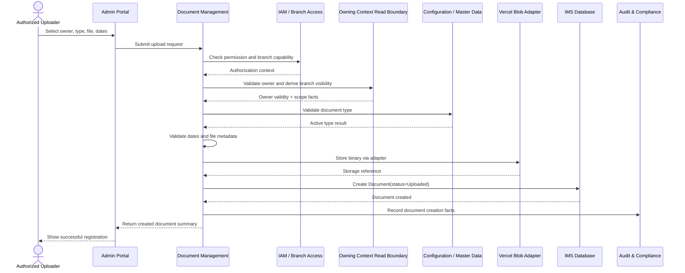
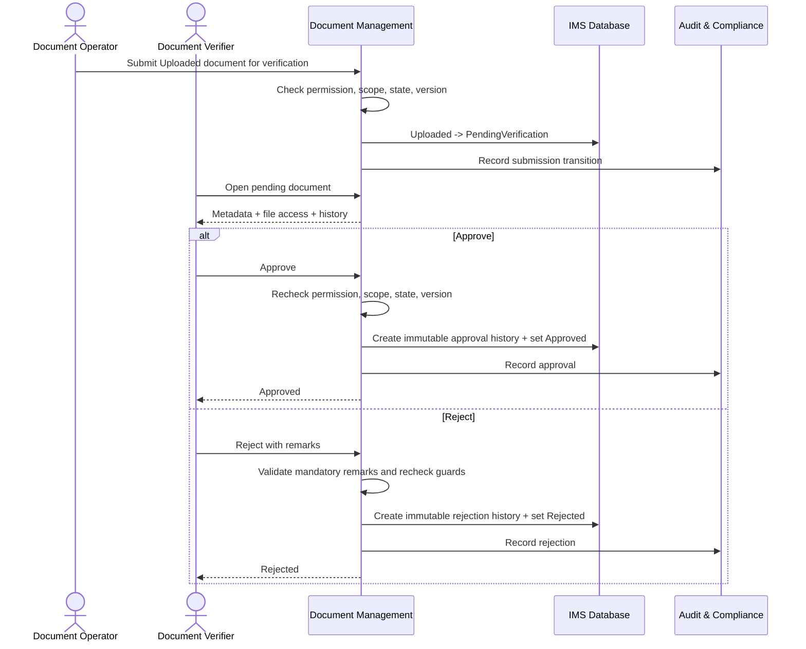
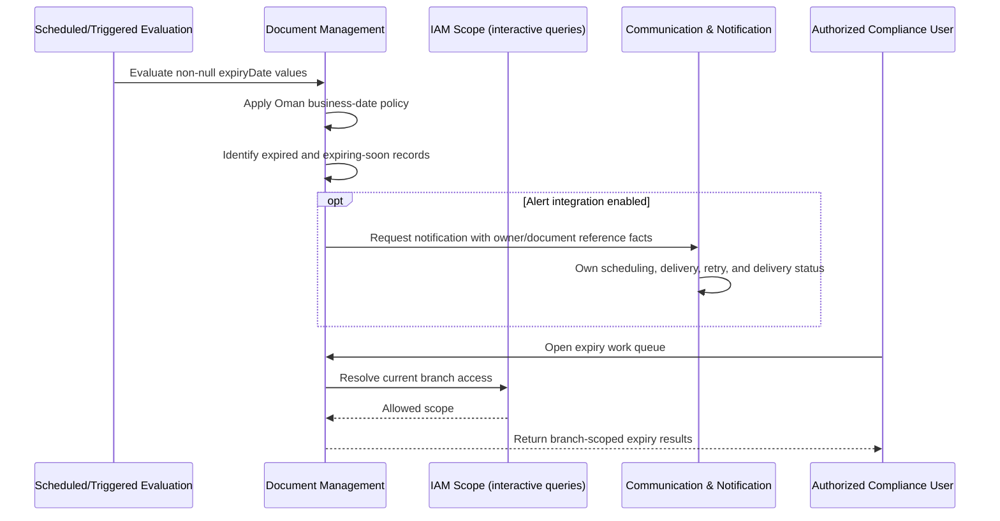
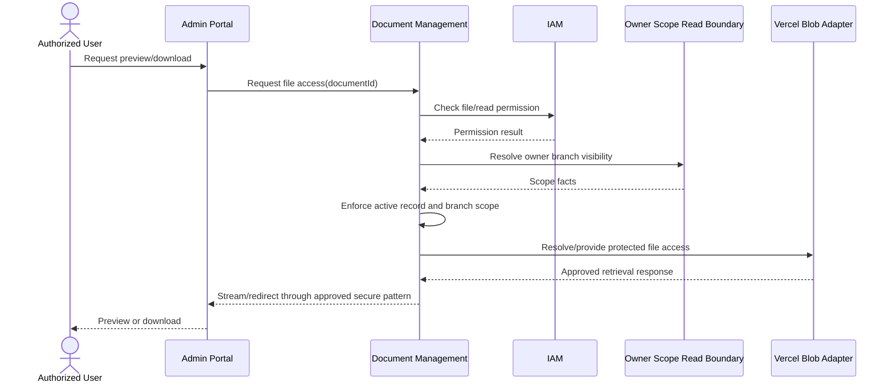
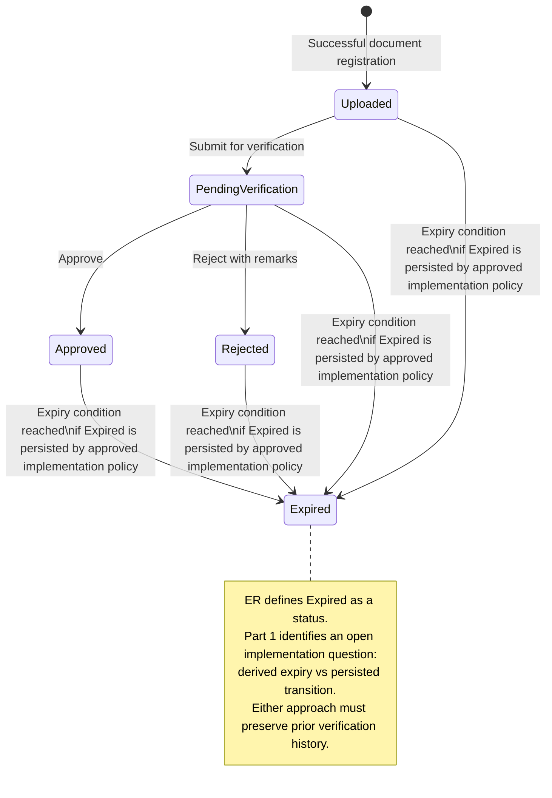
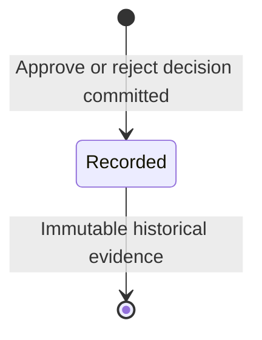
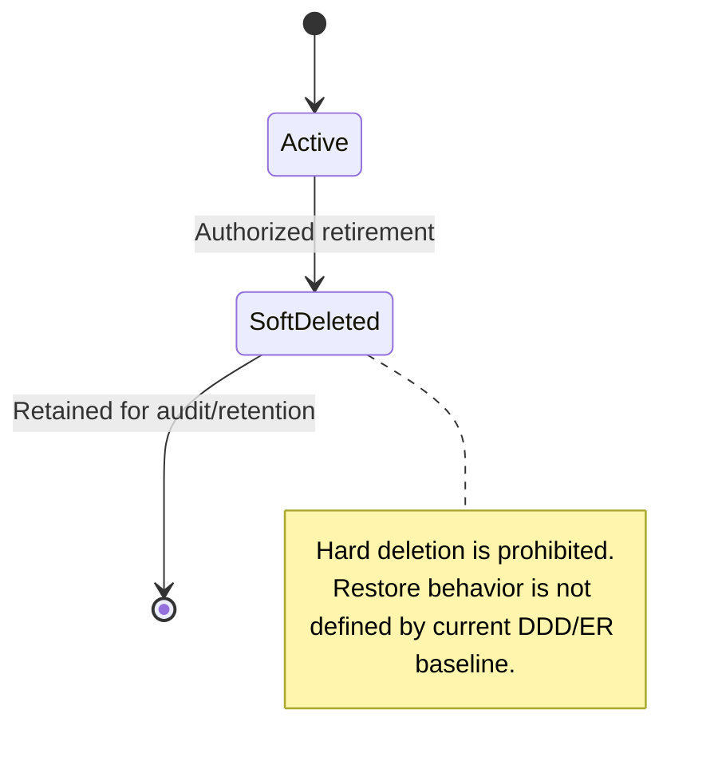

# Part 2 – User Stories, Use Cases, Workflows, State Machines

## Module 13 - Document Management

## 1. Purpose of This Part

This document translates the Module 13 Document Management business requirements into actor-centered user stories, executable acceptance criteria, operational use cases, business workflows, and lifecycle state machines.

It is intentionally constrained by the previously approved Module 13 overview and Part 1 requirements. It does not introduce a new aggregate, owner type, approval workflow, storage ownership model, or verification status beyond the DDD Context Map and ER Model baseline.

### Source alignment principles

- `Document` and `DocumentVerification` belong to the Document Management bounded context.
- Student, Trainer, Corporate, and Person master data remain owned by their source contexts.
- Employee document workflow is deferred until HRMS provides the owning employee reference.
- Vercel Blob stores file binaries; IMS database records remain the source of truth for document metadata and lifecycle state.
- Branch access is enforced server-side by deriving visibility from the document owner and IAM branch-access rules.
- `Document.verificationStatus` represents current state.
- `DocumentVerification` preserves immutable verification-decision history.
- Soft delete/retirement is allowed; hard deletion of Document metadata is prohibited.
- Certificate, Finance, and Completion lifecycle responsibilities remain outside this context.

---

# 2. User Stories

## US-DOC-001 - Upload a Document for an Accessible Owner

**Priority:** Must Have  
**Primary actors:** Document Administrator, Admission Officer, Trainer Coordinator, Corporate Account Coordinator  
**Traceability:** FR-DOC-001, FR-DOC-002, FR-DOC-003, FR-DOC-004, FR-DOC-005, FR-DOC-006, FR-DOC-018, FR-DOC-019, FR-DOC-029, FR-DOC-030

**Story**  
As an authorized operational user, I want to upload a document against an accessible Student, Trainer, Corporate, or Person owner, so that ASTI can retain the required evidence without duplicating the owner's master data.

### Acceptance criteria

```gherkin
Feature: Upload a document for a supported owner

  Scenario: Upload a valid document successfully
    Given I am authenticated
    And I have the "document.create" permission
    And the target owner exists and is not soft deleted
    And I have branch access to the target owner
    And the selected document type is active
    And the file satisfies configured upload validation
    When I submit the document upload with valid metadata
    Then the binary is stored through the Vercel Blob storage adapter
    And a Document record is created in the IMS database
    And the Document references exactly one owner using ownerType and ownerId
    And the file reference is stored in the document metadata
    And the uploader is derived from my authenticated identity
    And the current verification status is "Uploaded"
    And a creation audit event is recorded

  Scenario: Reject upload for an inaccessible branch owner
    Given I have "document.create" permission
    And the owner exists in a branch outside my allowed branch scope
    When I attempt to upload a document for that owner
    Then the request is rejected
    And no active Document record is created
    And no file access or owner-sensitive metadata is disclosed

  Scenario: Reject an unsupported owner type
    Given I have "document.create" permission
    When I submit an ownerType not defined by the current ER owner types
    Then the request is rejected as invalid
    And the system does not create a generic unowned document

  Scenario: Prevent metadata creation when Blob upload fails
    Given the owner, permission, branch scope, type, and metadata are valid
    And the storage operation fails
    When I submit the upload
    Then no active Document record is committed with a broken file reference
    And the failure is observable without logging the binary or storage credentials
```

---

## US-DOC-002 - Search and Filter Accessible Documents

**Priority:** Must Have  
**Primary actors:** Operational User, Branch Manager, Auditor / Compliance Reviewer  
**Traceability:** FR-DOC-007, FR-DOC-008, FR-DOC-015, FR-DOC-016, FR-DOC-018, FR-DOC-025

**Story**  
As an authorized staff member, I want to search and filter documents by owner, type, verification status, and expiry criteria, so that I can quickly find compliance evidence and outstanding work within my authorized branch scope.

### Acceptance criteria

```gherkin
Feature: Search and filter documents

  Scenario: List only accessible documents
    Given I am authenticated
    And I have "document.read" permission
    And I have access to Branch A but not Branch B
    When I list documents without an explicit owner filter
    Then documents derived from owners in Branch A are eligible for the result
    And documents derived from owners in Branch B are excluded
    And soft-deleted documents are excluded from the normal result

  Scenario Outline: Filter accessible documents
    Given I have "document.read" permission
    And accessible documents exist with different metadata
    When I filter by <filter>
    Then only matching documents within my branch scope are returned

    Examples:
      | filter                         |
      | ownerType and ownerId          |
      | documentType                   |
      | verificationStatus             |
      | issue date range               |
      | expiry date range              |
      | expiring-soon date window      |

  Scenario: Stable pagination
    Given more accessible documents exist than one result page can contain
    When I request successive pages using the supported pagination mechanism
    Then records are returned using stable ordering
    And a document is not duplicated or skipped solely because pagination is unstable
```

---

## US-DOC-003 - View Document Details and Verification History

**Priority:** Must Have  
**Primary actors:** Document Administrator, Document Verifier, Auditor / Compliance Reviewer  
**Traceability:** FR-DOC-009, FR-DOC-014, FR-DOC-018, FR-DOC-028, FR-DOC-031

**Story**  
As an authorized reviewer, I want to view document metadata together with its immutable verification history and source-owner display information, so that I can understand the document's context and prior decisions without duplicating owner data.

### Acceptance criteria

```gherkin
Feature: View document detail and verification history

  Scenario: View an accessible document
    Given I have "document.read" permission
    And the document owner is within my branch access scope
    When I open the document detail view
    Then I see the Document metadata
    And I see the current verification status
    And I see DocumentVerification history in chronological order
    And owner display information is resolved from the owning context or an approved read model
    And the Document record is not treated as the source of truth for owner identity

  Scenario: Deny direct-ID access outside branch scope
    Given I know a valid document identifier
    But the document owner is outside my branch scope
    When I request the document detail
    Then access is denied
    And the document metadata and verification history are not disclosed
```

---

## US-DOC-004 - Securely Preview or Download a File

**Priority:** Must Have  
**Primary actors:** Authorized Operational User, Document Verifier, Auditor / Compliance Reviewer  
**Traceability:** FR-DOC-010, FR-DOC-018, FR-DOC-019, FR-DOC-021

**Story**  
As an authorized user, I want to preview or retrieve a document file only after permission and branch checks, so that confidential evidence is not exposed merely because someone knows or obtains a storage URL.

### Acceptance criteria

```gherkin
Feature: Secure document file access

  Scenario: Authorized file access
    Given I am authenticated
    And I have the required document read/file-access permission
    And the document owner is within my branch scope
    And the Document record is active
    When I request to preview or download the file
    Then the server validates authorization before granting access
    And the file is retrieved using the approved storage access pattern
    And storage credentials are not exposed to me

  Scenario: URL possession does not bypass authorization
    Given a user possesses a previously observed Blob URL or file reference
    But the user is not authorized for the document owner
    When the user attempts to access the protected business document through the application
    Then access is denied
    And URL possession is not accepted as authorization
```

---

## US-DOC-005 - Submit an Uploaded Document for Verification

**Priority:** Must Have  
**Primary actors:** Document Administrator, Authorized Operational User  
**Traceability:** FR-DOC-011, FR-DOC-017, FR-DOC-018, FR-DOC-019, FR-DOC-021

**Story**  
As an authorized document operator, I want to submit an Uploaded document for verification, so that it enters a controlled review queue and cannot be approved or rejected from an invalid state.

### Acceptance criteria

```gherkin
Feature: Submit document for verification

  Scenario: Submit an Uploaded document
    Given the document status is "Uploaded"
    And I have permission to submit documents for verification
    And I have branch access to the document owner
    When I submit the document for verification
    Then the current status becomes "PendingVerification"
    And the transition is audited
    And the document appears in the eligible pending verification queue

  Scenario: Prevent invalid submission transition
    Given the document status is "Approved"
    When I attempt to submit the document for verification
    Then the transition is rejected
    And the status remains "Approved"

  Scenario: Prevent stale concurrent transition
    Given two users loaded the same current document version
    And the first valid transition is committed
    When the second user submits a transition based on stale state
    Then the second update is rejected or requires reload according to repository concurrency conventions
```

---

## US-DOC-006 - Approve a Pending Document

**Priority:** Must Have  
**Primary actor:** Document Verifier / Compliance Officer  
**Traceability:** FR-DOC-012, FR-DOC-014, FR-DOC-017, FR-DOC-021, FR-DOC-032

**Story**  
As an authorized document verifier, I want to approve a document that is PendingVerification, so that ASTI can treat the evidence as verified while preserving who made the decision and when.

### Acceptance criteria

```gherkin
Feature: Approve pending document verification

  Scenario: Approve a pending document
    Given I have "document.verify.approve" permission
    And the document owner is within my branch scope
    And the document status is "PendingVerification"
    When I approve the document
    Then the Document current status becomes "Approved"
    And a new immutable DocumentVerification decision record is created
    And the decision captures verifier identity and verification time
    And the state update and decision history are committed consistently
    And an audit event is recorded

  Scenario: Reject approval from an invalid state
    Given the document status is "Uploaded"
    When an authorized verifier attempts to approve it directly
    Then the request is rejected
    And no approval history record is created
    And the current status remains "Uploaded"
```

---

## US-DOC-007 - Reject a Pending Document with Remarks

**Priority:** Must Have  
**Primary actor:** Document Verifier / Compliance Officer  
**Traceability:** FR-DOC-013, FR-DOC-014, FR-DOC-017, FR-DOC-021

**Story**  
As an authorized document verifier, I want to reject a pending document with mandatory remarks, so that the rejection reason is explicit, attributable, and available for correction or follow-up.

### Acceptance criteria

```gherkin
Feature: Reject pending document verification

  Scenario: Reject a pending document with valid remarks
    Given I have "document.verify.reject" permission
    And the document owner is within my branch scope
    And the document status is "PendingVerification"
    When I reject the document with a non-empty reason
    Then the Document current status becomes "Rejected"
    And a new immutable DocumentVerification record is created
    And the rejection remarks, verifier, and decision time are preserved
    And an audit event is recorded

  Scenario: Reject a rejection request without remarks
    Given the document status is "PendingVerification"
    When I attempt to reject the document without meaningful remarks
    Then the request is rejected by validation
    And the status remains "PendingVerification"
    And no rejection decision record is created
```

---

## US-DOC-008 - Monitor Expiring and Expired Documents

**Priority:** Must Have  
**Primary actors:** Document Administrator, Compliance Officer, Branch Manager  
**Traceability:** FR-DOC-006, FR-DOC-015, FR-DOC-016, FR-DOC-025, FR-DOC-027, FR-DOC-033

**Story**  
As a compliance or branch operations user, I want to identify documents that are expiring soon or already expired, so that ASTI can follow up before or after compliance evidence becomes invalid.

### Acceptance criteria

```gherkin
Feature: Expiry monitoring

  Scenario: Identify a document as expired
    Given a document has a non-null expiryDate
    And the expiryDate is before the effective Oman business date
    When expiry status is evaluated
    Then the document is treated as expired according to the approved implementation policy
    And prior verification history is preserved

  Scenario: Document without expiry remains non-expiring
    Given a document has no expiryDate
    When expiry monitoring runs or a user opens an expiry work queue
    Then the document is not classified as expired solely because time has passed

  Scenario: List documents expiring within a date window
    Given I have permission to view expiry work queues
    And multiple accessible documents have different expiry dates
    When I request documents expiring within the selected date window
    Then only documents in that window and within my branch scope are returned

  Scenario: Request notification without transferring ownership
    Given an expiry alert integration is enabled
    When Document Management identifies an alert-eligible expiry condition
    Then it may request Communication & Notification to deliver a message
    And Communication owns delivery status
    And Document Management remains the owner of document expiry facts
```

---

## US-DOC-009 - Update Metadata Without Destroying Verification History

**Priority:** Should Have  
**Primary actor:** Document Administrator  
**Traceability:** FR-DOC-005, FR-DOC-021, FR-DOC-028, FR-DOC-032

**Story**  
As a document administrator, I want to correct permitted document metadata without overwriting verification history, so that operational errors can be corrected while preserving governance evidence.

### Acceptance criteria

```gherkin
Feature: Update document metadata safely

  Scenario: Update permitted metadata
    Given I have document update permission
    And the owner is within my branch scope
    And the document is active
    When I update permitted metadata with valid values
    Then the Document metadata is updated
    And existing DocumentVerification records remain unchanged
    And old and new values are auditable for sensitive changes

  Scenario: Reject invalid date correction
    Given a document has an issueDate
    When I set expiryDate earlier than issueDate
    Then the update is rejected
    And existing metadata remains unchanged

  Scenario: Do not silently retain approval for changed evidence
    Given a document is Approved
    When replacement of the underlying file evidence is requested
    Then the system does not silently keep the approval for different evidence
    And the operation follows the explicitly approved resubmission policy
```

---

## US-DOC-010 - Soft Delete or Retire a Document

**Priority:** Should Have  
**Primary actor:** Document Administrator  
**Traceability:** FR-DOC-020, FR-DOC-021

**Story**  
As an authorized document administrator, I want to retire a document using soft-delete conventions, so that invalid or obsolete records leave normal operations without destroying audit or retention evidence.

### Acceptance criteria

```gherkin
Feature: Retire a document

  Scenario: Soft-delete an active document
    Given I have the required document retirement permission
    And the document owner is within my branch scope
    And the document is not already soft deleted
    When I retire the document with any required reason
    Then deletedAt is populated according to repository conventions
    And the document is excluded from normal operational queries
    And an audit event is recorded
    And the Blob object is not automatically destroyed merely because metadata is retired

  Scenario: Prevent hard delete
    Given a Document record exists
    When a normal business operation requests permanent database deletion
    Then the operation is rejected or unavailable
    And the Document record remains recoverable according to soft-delete conventions
```

---

## US-DOC-011 - Review Pending Verification Queue

**Priority:** Must Have  
**Primary actor:** Document Verifier / Compliance Officer  
**Traceability:** FR-DOC-024, FR-DOC-018, FR-DOC-019

**Story**  
As a document verifier, I want a branch-scoped queue of documents awaiting verification, so that I can process review work efficiently without seeing documents outside my authorization scope.

### Acceptance criteria

```gherkin
Feature: Pending verification queue

  Scenario: View eligible pending documents
    Given I have permission to access the pending verification queue
    And I have access to Branch A
    When I open the queue
    Then only documents with status "PendingVerification" are returned
    And only documents whose owners are visible through my branch access are included
    And I can sort or filter the queue using supported metadata criteria

  Scenario: Queue visibility does not imply decision permission
    Given I may view the pending queue
    But I do not have approval or rejection permission
    When I open a pending document
    Then I can view only what my read permissions permit
    And approve and reject actions are unavailable and rejected server-side if attempted directly
```

---

## US-DOC-012 - Audit Document Lifecycle Actions

**Priority:** Must Have  
**Primary actors:** Auditor / Compliance Reviewer; system-generated audit integration  
**Traceability:** FR-DOC-021, FR-DOC-026, FR-DOC-035

**Story**  
As an auditor, I want sensitive document lifecycle actions to be traceable to actor, time, changed values, and reason where required, so that ASTI can reconstruct document governance decisions.

### Acceptance criteria

```gherkin
Feature: Audit document lifecycle actions

  Scenario Outline: Record critical document action
    Given an authorized user performs a valid <action>
    When the business operation commits successfully
    Then an audit fact is supplied to the Audit & Compliance context
    And the audit evidence identifies the entity, action, actor, and time
    And old and new values are captured where applicable
    And reason is preserved where the action requires one

    Examples:
      | action                     |
      | document creation          |
      | sensitive metadata update  |
      | submit for verification    |
      | approve                    |
      | reject                     |
      | persisted expiry change    |
      | retirement / soft delete   |

  Scenario: Reporting cannot mutate document state
    Given a reporting consumer can read a document reporting projection
    When the reporting context processes document data
    Then it does not modify Document or DocumentVerification state
```

---

# 3. Primary Use Cases

## UC-DOC-001 - Register and Upload a Document

**Primary actor:** Authorized Operational User  
**Supporting actors:** IAM, Configuration / Master Data, Owner Context, Vercel Blob Adapter, Audit & Compliance

### Preconditions

1. Actor is authenticated.
2. Actor has `document.create` or equivalent capability permission.
3. Owner type is supported in the current phase.
4. Owner exists and is not soft deleted.
5. Actor has branch access to the owner.
6. Document type is valid and active.
7. File satisfies configured validation rules.

### Main success scenario

1. Actor selects an owner type and owner.
2. System resolves the owner from its owning context or approved internal read boundary.
3. System derives owner branch visibility and verifies actor scope.
4. Actor selects a valid document type.
5. Actor selects a file and enters issue/expiry metadata where applicable.
6. System validates request schema, dates, file constraints, permission, owner, branch scope, and document type.
7. System uploads the binary through the Vercel Blob storage adapter.
8. Storage adapter returns a successful file reference.
9. System creates Document metadata with `ownerType`, `ownerId`, `documentType`, `fileName`, `fileUrl`, dates, authenticated `uploadedBy`, and current status `Uploaded`.
10. System records/supplies the creation audit event.
11. System returns the created Document summary.

### Alternative flows

- **A1 - Invalid owner:** Reject before storage upload; no Document created.
- **A2 - Unsupported owner type:** Reject; do not map to a generic owner.
- **A3 - Cross-branch owner:** Reject without exposing owner-sensitive information.
- **A4 - Inactive document type:** Reject before persistence.
- **A5 - Invalid date range:** Reject when `expiryDate < issueDate`.
- **A6 - Blob upload fails:** Do not create an active Document with broken reference.
- **A7 - Blob succeeds but DB persistence fails:** Trigger compensation or reconciliation handling defined by architecture/runbook; do not report successful business registration.
- **A8 - Concurrent duplicate user action:** Handle according to request idempotency/repository conventions without inventing a new aggregate rule.

### Postconditions

- A valid Document record exists and references one supported owner.
- Blob binary exists and its reference is stored.
- Current state is `Uploaded` unless a separately approved workflow permits otherwise.
- Creation is auditable.

---

## UC-DOC-002 - Search and List Documents

**Primary actor:** Authorized Document Reader

### Preconditions

1. Actor is authenticated.
2. Actor has `document.read` permission.
3. Branch access context is available from IAM.

### Main success scenario

1. Actor opens the document list or submits search filters.
2. System builds owner-derived branch scope from IAM access.
3. System applies filters for owner, document type, current status, date range, or expiry window.
4. System excludes soft-deleted documents from normal operations.
5. System applies stable sort and pagination.
6. System returns only accessible Document metadata.

### Alternative flows

- **A1 - No matching data:** Return an empty result set, not a cross-scope fallback.
- **A2 - Invalid filter:** Return validation error.
- **A3 - User lacks read permission:** Deny request.
- **A4 - Consolidated view requested without IAM consolidated capability:** Deny or constrain to permitted branch scope.

### Postconditions

- No document state changes.
- Result set is permission and branch scoped.

---

## UC-DOC-003 - View Document Detail and File

**Primary actor:** Authorized Document Reader

### Preconditions

1. Actor is authenticated.
2. Actor has required read/file-access permission.
3. Document exists and is visible through owner-derived branch scope.

### Main success scenario

1. Actor opens Document detail.
2. System checks permission and owner-derived branch scope.
3. System loads Document metadata.
4. System loads immutable DocumentVerification history.
5. System resolves owner display information from the owning context/read model.
6. Actor requests preview/download.
7. System revalidates required access for file retrieval.
8. System provides access through the approved protected storage delivery pattern.

### Alternative flows

- **A1 - Document out of scope:** Deny access.
- **A2 - Soft-deleted document:** Exclude from normal view unless a specifically authorized administrative recovery/audit path exists.
- **A3 - Storage object missing:** Return controlled storage inconsistency error and surface the condition for reconciliation; do not rewrite business history.

### Postconditions

- No Document state change.
- Access action is handled according to audit/access logging conventions.

---

## UC-DOC-004 - Submit Document for Verification

**Primary actor:** Authorized Document Operator

### Preconditions

1. Actor has submit-for-verification permission.
2. Document is accessible by branch scope.
3. Document current state is `Uploaded`.
4. Document is active and not soft deleted.

### Main success scenario

1. Actor opens the Uploaded document.
2. Actor selects Submit for Verification.
3. System rechecks permission, branch scope, current state, and concurrency version where supported.
4. System transitions current status to `PendingVerification`.
5. System records the sensitive transition through audit conventions.
6. Document becomes eligible for the pending verification queue.

### Alternative flows

- **A1 - Current state not Uploaded:** Reject invalid transition.
- **A2 - Stale version:** Reject or require reload according to repository convention.
- **A3 - Access changed since page load:** Reject based on current server-side authorization.

### Postconditions

- Current status is `PendingVerification`.
- Verification decision history is not fabricated at submission time unless the actual schema/convention explicitly records a separate submission event elsewhere.

---

## UC-DOC-005 - Approve Pending Document

**Primary actor:** Document Verifier / Compliance Officer

### Preconditions

1. Actor has `document.verify.approve` permission.
2. Document is within owner-derived branch scope.
3. Current state is `PendingVerification`.
4. Actor is acting on the current version/state.

### Main success scenario

1. Verifier reviews metadata, owner context, file evidence, and previous verification history.
2. Verifier selects Approve.
3. System revalidates permission, branch access, state, and concurrency.
4. System creates a new DocumentVerification record capturing approval decision, verifier, remarks if supplied, and verification time.
5. System updates Document current status to `Approved` in the same consistency boundary/transaction where supported.
6. System records the critical action through Audit & Compliance conventions.
7. System returns the approved state.

### Alternative flows

- **A1 - State changed concurrently:** Reject stale decision.
- **A2 - Document not PendingVerification:** Reject transition.
- **A3 - Permission revoked:** Reject current request.
- **A4 - Persistence failure:** Do not leave current status and verification history inconsistent; roll back transaction where applicable.

### Postconditions

- Document status is `Approved`.
- Immutable approval decision history exists.
- Audit evidence exists.

---

## UC-DOC-006 - Reject Pending Document

**Primary actor:** Document Verifier / Compliance Officer

### Preconditions

1. Actor has `document.verify.reject` permission.
2. Document is in scope.
3. Current state is `PendingVerification`.

### Main success scenario

1. Verifier reviews evidence.
2. Verifier selects Reject.
3. Verifier enters mandatory meaningful remarks.
4. System validates permission, branch scope, state, concurrency, and remarks.
5. System creates a new immutable DocumentVerification rejection record.
6. System updates Document current status to `Rejected` consistently with history creation.
7. System records the rejection audit event.

### Alternative flows

- **A1 - Empty remarks:** Reject validation; no state change.
- **A2 - Invalid current state:** Reject transition.
- **A3 - Concurrent decision already committed:** Reject stale action.

### Postconditions

- Current status is `Rejected`.
- Rejection reason, actor, and time remain preserved in immutable history.

---

## UC-DOC-007 - Monitor Expiry

**Primary actor:** Compliance Officer / Branch Manager  
**Supporting actor:** Communication & Notification, when configured

### Preconditions

1. Documents exist with optional expiry dates.
2. Actor has required read/work-queue permission.
3. Oman business date/time policy is available.

### Main success scenario

1. System or actor evaluates documents with non-null expiry dates.
2. System compares expiryDate using approved date-only and Oman business-date rules.
3. System identifies expired documents and documents expiring within requested window.
4. User views only records within authorized branch scope.
5. When alert integration is enabled, Document Management supplies an alert request/fact to Communication & Notification.
6. Communication & Notification owns delivery attempt and delivery status.

### Alternative flows

- **A1 - expiryDate is null:** Document is not treated as expired.
- **A2 - notification delivery fails:** Document expiry truth remains unchanged; delivery failure belongs to Communication & Notification.
- **A3 - Expired representation not finalized in schema implementation:** Apply the approved architecture decision for derived vs persisted `Expired`; do not destroy previous verification history.

### Postconditions

- Expiry work queues are available.
- Prior verification history is preserved.
- Notification ownership remains separated.

---

## UC-DOC-008 - Update Document Metadata

**Primary actor:** Document Administrator

### Preconditions

1. Actor has update permission.
2. Document is active and in branch scope.
3. Requested fields are permitted to change.

### Main success scenario

1. Actor opens document metadata edit action.
2. System loads current state/version.
3. Actor modifies permitted metadata.
4. System validates type, dates, authorization, scope, and concurrency.
5. System persists metadata changes.
6. Existing DocumentVerification rows remain unchanged.
7. Sensitive old/new values are auditable.

### Alternative flows

- **A1 - Invalid date range:** Reject.
- **A2 - File evidence replacement requested for Approved/Rejected evidence:** Route through explicit resubmission/replacement policy; do not silently preserve approval for changed evidence.
- **A3 - Stale version:** Reject or require reload.

### Postconditions

- Permitted metadata reflects the update.
- Verification history is unchanged.

---

## UC-DOC-009 - Retire a Document

**Primary actor:** Document Administrator

### Preconditions

1. Actor has retirement/soft-delete permission.
2. Document is accessible and not already soft deleted.

### Main success scenario

1. Actor selects retire/soft delete.
2. System verifies permission and branch scope.
3. System applies repository soft-delete conventions (`deletedAt`, and related base-field behavior as defined by repository standard).
4. System records audit evidence and reason where required.
5. System excludes the record from normal operational queries.
6. Blob evidence is retained unless an explicit retention policy separately authorizes destruction.

### Alternative flows

- **A1 - Hard delete requested:** Reject/unavailable.
- **A2 - Already retired:** Return idempotent or conflict response according to API convention without destroying history.

### Postconditions

- Document is absent from normal operational lists.
- Metadata and audit history are preserved.

---

## UC-DOC-010 - Reconcile Blob/Database Inconsistency

**Primary actor:** System Administrator / Operations  
**Supporting actor:** Vercel Blob Adapter

### Preconditions

1. An inconsistency is detected, such as successful Blob upload followed by failed metadata persistence, or missing Blob object for active metadata.
2. Actor has operational permissions where manual intervention is required.

### Main success scenario

1. Operations identifies the inconsistent correlation/reference from structured operational evidence.
2. System determines whether the orphan is a Blob-only object or active metadata with missing storage evidence.
3. For Blob-only orphan, compensation/reconciliation follows the approved retention and storage runbook.
4. For missing binary referenced by active metadata, system preserves business history, marks/surfaces operational failure through approved mechanisms, and restores or reconciles according to backup/storage runbook.
5. Resolution is auditable where business metadata is changed.

### Alternative flows

- **A1 - No safe automated compensation:** Escalate to manual runbook; do not fabricate a successful Document registration.
- **A2 - Retention policy prevents Blob removal:** Preserve object and record reconciliation outcome.

### Postconditions

- Inconsistency is resolved or explicitly recorded for further operations.
- Business history is not silently rewritten.

---

# 4. Core Business Workflows

## 4.1 Upload and Registration Workflow



### Failure rules

1. Authorization, owner, branch, type, and metadata validation should occur before committing business registration.
2. Blob failure must not create active metadata with a broken reference.
3. Blob success followed by database failure must not be reported as successful registration; compensation or reconciliation is required.
4. Credentials, binary content, and access tokens must not be logged.

---

## 4.2 Verification Workflow



### Workflow invariants

- Only `Uploaded` may enter `PendingVerification` under the baseline flow.
- Only `PendingVerification` may transition to `Approved` or `Rejected`.
- Approval and rejection must create immutable decision history.
- Current state and decision-history creation must remain consistent.
- Direct `Uploaded -> Approved` and `Uploaded -> Rejected` transitions are forbidden.

---

## 4.3 Expiry Monitoring and Alert Boundary



### Boundary rules

- Document Management owns expiry facts and dates.
- Communication & Notification owns delivery attempts and delivery status.
- Expiry evaluation must not erase or rewrite verification history.
- The exact scheduling cadence belongs to architecture/NFR design, not the Document aggregate.

---

## 4.4 Secure File Retrieval Workflow



### Security rule

A storage URL or file reference is not an authorization token. Authorization is evaluated from authenticated identity, permission, active document record, and owner-derived branch scope.

---

## 4.5 Metadata Correction Workflow

```text
Open Document
   |
   v
Check update permission + owner branch scope
   |
   v
Load current state/version
   |
   v
Edit permitted metadata
   |
   v
Validate document type and date rules
   |
   +---- invalid ----> Reject; preserve old metadata/history
   |
   v
Concurrency check
   |
   +---- stale ----> Reject/reload according to repository convention
   |
   v
Persist permitted metadata changes
   |
   v
Preserve all DocumentVerification history unchanged
   |
   v
Audit sensitive old/new values
```

Evidence replacement after approval or rejection is not treated as a simple metadata correction. It must follow an explicitly approved resubmission/replacement rule because an approval must not silently remain valid for different file evidence.

---

## 4.6 Retirement / Soft Delete Workflow

```text
Authorized retire request
        |
        v
Permission and owner-derived branch check
        |
        v
Current record active?
   | yes              | no
   v                  v
Apply soft delete     Idempotent/conflict response per API convention
   |
   v
Record audit evidence
   |
   v
Exclude from normal operational queries
   |
   v
Retain Blob object unless explicit retention policy authorizes destruction
```

---

# 5. State Machines

## 5.1 Document Verification Lifecycle

The ER model exposes the current document lifecycle through `Document.verificationStatus` with the values:

- `Uploaded`
- `PendingVerification`
- `Approved`
- `Rejected`
- `Expired`

The baseline verification workflow is:



### Important modeling note

`Expired` is defined by the ER model as a Document status, while Part 1 identified a legitimate implementation gap about whether expiry is derived at read/evaluation time or persisted as a state transition. This Part 2 therefore:

1. recognizes `Expired` as an ER-aligned lifecycle value;
2. does not invent a recovery/renewal transition from `Expired`;
3. permits transition-to-Expired rows below only when the approved implementation persists expiry;
4. requires prior `DocumentVerification` history to remain immutable regardless of whether expiry is derived or persisted.

A future replacement or renewal document should be represented according to the approved document replacement policy; this Part does not invent `Expired -> Uploaded` because that transition is not defined by the current DDD or ER baseline.

---

## 5.2 Document Transition Rules Matrix

| From State          | To State               | Trigger                                                        | Required Permission / Capability                              | Additional Guards                                                                                                                        | Audit Requirement                                           | Allowed?                              |
| ------------------- | ---------------------- | -------------------------------------------------------------- | ------------------------------------------------------------- | ---------------------------------------------------------------------------------------------------------------------------------------- | ----------------------------------------------------------- | ------------------------------------- |
| New / none          | Uploaded               | Successful registration after storage and metadata persistence | `document.create`                                             | Valid supported owner; owner exists; branch access; active document type; valid file/date metadata; Blob success; DB persistence success | Create audit event                                          | Yes                                   |
| Uploaded            | PendingVerification    | Submit for verification                                        | `document.verify.submit` or repository-equivalent capability  | Active record; owner branch scope; current version/state                                                                                 | Audit transition                                            | Yes                                   |
| PendingVerification | Approved               | Approve verification                                           | `document.verify.approve`                                     | Branch scope; current state; current version; decision history and current-state update remain consistent                                | Approval audit + immutable DocumentVerification record      | Yes                                   |
| PendingVerification | Rejected               | Reject verification                                            | `document.verify.reject`                                      | Branch scope; current state; current version; mandatory meaningful remarks                                                               | Rejection audit + immutable DocumentVerification record     | Yes                                   |
| Uploaded            | Approved               | Direct approval attempt                                        | Any                                                           | Baseline workflow requires PendingVerification first                                                                                     | Rejected action may be security/audit logged per convention | No                                    |
| Uploaded            | Rejected               | Direct rejection attempt                                       | Any                                                           | Baseline workflow requires PendingVerification first                                                                                     | Rejected action may be security/audit logged per convention | No                                    |
| Approved            | PendingVerification    | Resubmission                                                   | Not defined                                                   | Requires an explicit evidence replacement/resubmission policy not present in DDD/ER baseline                                             | N/A until gap resolved                                      | Not defined / gap                     |
| Rejected            | PendingVerification    | Resubmission                                                   | Not defined                                                   | Requires explicit resubmission semantics; must not overwrite prior history                                                               | N/A until gap resolved                                      | Not defined / gap                     |
| Uploaded            | Expired                | Expiry evaluation                                              | System capability; read permission for interactive visibility | `expiryDate` non-null and before effective business date; only a state transition if persisted-expiry policy is approved                 | Audit if persisted as a critical state change               | Conditional                           |
| PendingVerification | Expired                | Expiry evaluation                                              | System capability                                             | Same as above; preserve pending/decision history facts                                                                                   | Audit if persisted                                          | Conditional                           |
| Approved            | Expired                | Expiry evaluation                                              | System capability                                             | Same as above; preserve approval history                                                                                                 | Audit if persisted                                          | Conditional                           |
| Rejected            | Expired                | Expiry evaluation                                              | System capability                                             | Same as above; preserve rejection history                                                                                                | Audit if persisted                                          | Conditional                           |
| Expired             | Uploaded               | Renewal/reset                                                  | Not defined                                                   | No current DDD/ER rule authorizes reuse/reset of an expired record                                                                       | N/A                                                         | No / gap                              |
| Expired             | PendingVerification    | Renewal submission                                             | Not defined                                                   | Requires explicit renewal/replacement model                                                                                              | N/A                                                         | No / gap                              |
| Any active state    | Soft Deleted / Retired | Authorized retirement                                          | `document.retire` or repository-equivalent                    | Branch scope; active record; reason if policy requires                                                                                   | Mandatory retirement audit                                  | Yes, orthogonal soft-delete lifecycle |
| Soft Deleted        | Any operational state  | Restore                                                        | Not defined                                                   | Restore semantics are not defined in current DDD/ER baseline                                                                             | N/A                                                         | Not defined / gap                     |

> Permission codes in this matrix are capability-oriented names. Exact seed codes must match the IAM permission catalog and Prisma implementation. Role names must not be embedded in domain transition logic.

---

## 5.3 DocumentVerification History Lifecycle

`DocumentVerification` is not modeled here as a mutable workflow entity. It is an immutable decision-history record.



### Rules

1. A new approval or rejection decision creates a new history record.
2. A prior verification history record must not be overwritten to represent a later decision.
3. Verifier identity, decision status, remarks, and verification time must remain attributable.
4. Metadata correction must not mutate prior decision history.
5. Expiry evaluation must not delete or rewrite verification history.

---

## 5.4 Soft-Delete Lifecycle

Soft delete is orthogonal to verification status. A Document may be retired from normal operations regardless of its current verification status, subject to authorization and business policy.



### Soft-delete transition matrix

| From        | To          | Trigger          | Required Permission             | Rules                                                                                                                     |
| ----------- | ----------- | ---------------- | ------------------------------- | ------------------------------------------------------------------------------------------------------------------------- |
| Active      | SoftDeleted | Retire document  | `document.retire` or equivalent | Server-side branch check; audit; `deletedAt` set; exclude from normal queries; do not automatically destroy Blob evidence |
| SoftDeleted | Active      | Restore          | Not defined                     | Requires an explicit business rule/API contract before implementation                                                     |
| SoftDeleted | HardDeleted | Permanent delete | None                            | Prohibited by current project principles                                                                                  |

---

# 6. Cross-Context Workflow Boundaries

| Workflow Step                    | Owning Context                          | Document Management Responsibility            | Boundary Rule                                                                 |
| -------------------------------- | --------------------------------------- | --------------------------------------------- | ----------------------------------------------------------------------------- |
| Authenticate user                | Identity & Access                       | Consume authenticated identity                | Document module does not own credentials.                                     |
| Evaluate action permission       | Identity & Access                       | Enforce capability result server-side         | Menu visibility is not authorization.                                         |
| Resolve branch access            | Identity & Access + owner context facts | Apply owner-derived scope                     | Do not invent independent document branch hierarchy.                          |
| Resolve Student owner            | Admission & Enrollment                  | Reference valid StudentProfile owner          | Do not duplicate Student master data.                                         |
| Resolve Trainer owner            | Faculty / Trainer Management            | Reference valid TrainerProfile owner          | Do not duplicate trainer profile data.                                        |
| Resolve Corporate owner          | Corporate Training                      | Reference valid CorporateAccount owner        | Do not own corporate master lifecycle.                                        |
| Resolve Person owner             | Shared Party / Person model             | Reference canonical Person                    | Do not create parallel identity record.                                       |
| Validate document type           | Configuration / Master Data             | Consume configured type                       | Do not hardcode business-critical types where configuration owns them.        |
| Store binary                     | Infrastructure / Vercel Blob adapter    | Invoke adapter and persist reference          | Blob does not own Document lifecycle.                                         |
| Verify document                  | Document Management                     | Own current verification state and history    | Audit receives action facts; it does not decide document verification.        |
| Track expiry                     | Document Management                     | Own expiry date/fact and work queues          | Communication only owns notification delivery.                                |
| Send expiry alert                | Communication & Notification            | Request notification when integration enabled | Do not store message delivery status in Document.                             |
| Record critical audit            | Audit & Compliance                      | Supply entity/action/change facts             | AuditLog remains Audit context-owned.                                         |
| Produce reports                  | Reporting & Dashboards                  | Expose read data/projection                   | Reporting cannot mutate Document state.                                       |
| Generate/verify certificates     | Certificate Management                  | No ownership                                  | Document module must not absorb certificate lifecycle.                        |
| Invoice/receipt/refund lifecycle | Finance & Receivables                   | No ownership                                  | File URLs on finance records do not transfer finance ownership.               |
| Completion approval              | Exam, Result & Completion               | No ownership                                  | Document evidence may be referenced but completion decision remains external. |

---

# 7. DDD and ER Consistency Check

## 7.1 DDD alignment

This Part 2 remains aligned with the DDD Context Map by:

1. keeping Document metadata, verification, and expiry inside Document Management;
2. referencing, rather than recreating, Student, Trainer, Corporate, and Person owners;
3. leaving Employee document workflow deferred until HRMS exists;
4. leaving notification delivery state to Communication & Notification;
5. leaving AuditLog ownership to Audit & Compliance;
6. leaving report consumption read-only;
7. not moving Certificate, Finance, or Completion business decisions into Document Management;
8. using a modular-monolith interaction model rather than introducing a document microservice, broker, CQRS, or Event Sourcing.

## 7.2 ER model alignment

This Part uses the ER-defined Document fields and concepts:

```text
Document
- ownerType
- ownerId
- documentType
- fileName
- fileUrl
- issueDate
- expiryDate
- verificationStatus
- uploadedBy
- verifiedBy
- verifiedAt
```

and the ER-defined verification-history structure:

```text
DocumentVerification
- documentId
- status
- remarks
- verifiedBy
- verifiedAt
```

The lifecycle values used in the state machine are exactly the ER baseline values:

```text
Uploaded
PendingVerification
Approved
Rejected
Expired
```

## 7.3 Consistency with Module Overview and Part 1

| Area                         | Part 2 Decision                                                           | Consistency Result        |
| ---------------------------- | ------------------------------------------------------------------------- | ------------------------- |
| Storage                      | Vercel Blob binary + IMS metadata                                         | Consistent                |
| Owner types                  | Student, Trainer, Corporate, Person; Employee deferred                    | Consistent                |
| Verification flow            | Uploaded -> PendingVerification -> Approved/Rejected                      | Consistent                |
| Rejection remarks            | Mandatory                                                                 | Consistent                |
| Verification history         | Immutable                                                                 | Consistent                |
| Branch isolation             | Owner-derived, server-side                                                | Consistent                |
| Expiry                       | ER `Expired` recognized; derived-vs-persisted policy remains explicit gap | Consistent; gap preserved |
| Soft delete                  | Orthogonal lifecycle; no hard delete                                      | Consistent                |
| Reporting                    | Read-only consumer                                                        | Consistent                |
| Notifications                | Delivery owned by Communication                                           | Consistent                |
| Resubmission after rejection | Not invented                                                              | Consistent; gap preserved |
| Restore after soft delete    | Not invented                                                              | Consistent; gap preserved |

---

# 8. Explicit Gaps Carried Forward

The following points require later architecture, schema, or product decisions and are intentionally not invented in this Part:

1. **Expiry persistence policy:** ER includes `Expired`, but the implementation must decide whether expiry is persisted as a state transition or derived from `expiryDate` at evaluation time.
2. **Resubmission policy:** The DDD/ER baseline does not define whether a Rejected document is edited and resubmitted, replaced by a new Document, or linked to a replacement chain.
3. **Approved evidence replacement:** Replacing an approved file must not silently retain approval, but the exact reset/resubmission model is not defined.
4. **Soft-delete restoration:** Restore behavior is not defined.
5. **Explicit Document branch relation:** ER Document has no `branchId`; branch scope must be owner-derived unless schema architecture later adds an approved denormalized/reference field.
6. **Blob operational metadata:** The ER baseline contains `fileName` and `fileUrl`; additional provider-specific storage fields require schema review.
7. **Prisma validation:** Exact model names, enum representations, relation mappings, indexes, and version/concurrency implementation must be validated against `packages/database/prisma/schema.prisma` when that schema is supplied in the active source set.

---

# 9. Part 2 Conclusion

Part 2 defines the actor behavior and operational lifecycle for Document Management without expanding domain ownership beyond the source documents. The core controlled flow is:

```text
Valid Owner + Permission + Branch Scope
                |
                v
        Upload Binary to Blob
                |
                v
       Register Document Metadata
                |
                v
             Uploaded
                |
                v
      PendingVerification
           /          \
          v            v
      Approved       Rejected
          \            /
           \          /
            v        v
          Expiry evaluation
                |
                v
       Expired condition/state
```

Verification history remains immutable, soft deletion remains non-destructive, branch access remains server-enforced, and all cross-context interactions preserve DDD ownership boundaries.
