# Part 2 – User Stories, Use Cases, Workflows, State Machines

## Module 14 – Corporate Training Management

## Document Control

| Field | Value |
|---|---|
| Module | Module 14 – Corporate Training Management |
| Module Code | CTM |
| Owning Bounded Context | Corporate Training Management |
| Architecture Style | Next.js monorepo modular monolith |
| Primary Aggregate | `CorporateAccount` |
| CTM-Owned Operational Entities | `CorporateAccount`, `CorporateContact`, `CorporateContract`, `CorporateParticipant`, `CorporateEnrollment` |
| Central Downstream Aggregate | `Enrollment`, owned by Admission & Enrollment Management |
| Source Baselines | DDD Context Map v3.0; ER Model v3.0; ASTI ERP Registration & Training Management Process; Module 14 Overview; Part 1 |
| Status | Draft for review |

---

# 1. Purpose and Part 2 Design Position

This document translates the Corporate Training Management business scope into actor-oriented user stories, primary use cases, operational workflows, and explicit lifecycle state models.

The design preserves the following architectural rules:

1. Corporate Training owns corporate accounts, contacts, contracts, participants, and the corporate-to-enrollment linkage.
2. `Enrollment` remains the central learning transaction and is owned by Admission & Enrollment Management.
3. A `CorporateParticipant` is not a parallel student identity. Enrollment must resolve or create a `StudentProfile` for the same shared `Person` identity.
4. Course, pricing, discounts, and completion-rule definitions are owned by Course Catalog.
5. Batch, session, capacity, and delivery status are owned by Training Delivery.
6. Timetable, trainer/classroom conflict detection, holidays, and venue blocks are owned by Scheduling & Calendar.
7. Credit calculation, invoices, payments, receipts, refunds, and receivables are owned by Finance.
8. Attendance, completion, certificates, documents, notifications, reporting definitions, and audit logs remain owned by their respective bounded contexts.
9. Branch isolation and permissions are enforced server-side.
10. Workflow concepts that do not have a clean DDD/ER owner—such as a persisted nomination aggregate, corporate training project/program aggregate, equipment allocation, travel/accommodation, costing, project closure, and GIVT specialization—are treated as explicit architecture gaps and are not silently modeled in this document.

---

# 2. User Stories

## US-CTM-001 – Create and Maintain a Corporate Account

**Priority:** Must

**User Story**  
As a **Corporate Training Administrator**, I want to create and maintain a corporate account linked to the correct Organization Party, so that ASTI has one authoritative operational customer record for contracts, participants, enrollments, billing references, and reporting.

### Acceptance Criteria

```gherkin
Feature: Corporate account management

  Scenario: Create a corporate account for an existing organization
    Given I am authenticated with "corporate-training.account.create" permission
    And the Organization Party exists and is within my authorized scope
    And no conflicting active CorporateAccount exists for that organization relationship
    When I submit a valid corporate account request
    Then the system creates the CorporateAccount
    And links it to the existing Organization
    And records the acting user, timestamp, and audit correlation identifier
    And returns the created account summary

  Scenario: Reject a duplicate account code
    Given an active CorporateAccount already uses account code "CORP-00125"
    When I attempt to create another CorporateAccount with account code "CORP-00125"
    Then the request is rejected with a deterministic duplicate-code validation error
    And no CorporateAccount is created

  Scenario: Prevent unauthorized branch access
    Given I have access only to Branch A
    And the target corporate account is visible only through Branch B operational scope
    When I request that account
    Then the system denies access or returns not found according to the security policy
    And no account data is disclosed
```

---

## US-CTM-002 – Manage Corporate Contacts Without Duplicating Person Identity

**Priority:** Must

**User Story**  
As a **Corporate Account Manager**, I want to add and maintain corporate contacts by resolving the shared Person identity first, so that contact information can be reused safely without creating duplicate people.

### Acceptance Criteria

```gherkin
Feature: Corporate contact identity reuse

  Scenario: Link an existing person as a corporate contact
    Given I have contact-create permission
    And the corporate account is active and in scope
    And a Person matching the approved identity-resolution criteria already exists
    When I add the person as a CorporateContact
    Then the system reuses the existing Person record
    And creates only the CorporateContact relationship
    And does not create a duplicate Person

  Scenario: Reject duplicate active contact relationship
    Given the Person is already an active CorporateContact for the same CorporateAccount
    When I attempt to add the same relationship again
    Then the request is rejected
    And the existing relationship remains unchanged

  Scenario: Mark a primary contact transactionally
    Given a corporate account already has a primary operational contact
    And another active contact belongs to the same account
    When I mark the second contact as primary
    Then the primary-contact rule is enforced transactionally
    And the previous conflicting primary designation is cleared according to policy
    And the change is audited
```

---

## US-CTM-003 – Create and Control Corporate Contracts

**Priority:** Must

**User Story**  
As a **Corporate Training Administrator**, I want to create and manage corporate contracts with validity dates, billing model, value, and payment terms, so that participant enrollment and billing coordination follow approved commercial terms.

### Acceptance Criteria

```gherkin
Feature: Corporate contract management

  Scenario: Create a valid contract
    Given I have contract-create permission
    And the corporate account is active and in scope
    When I submit a unique contract number
    And a start date not later than the end date
    And a supported billing model
    Then the CorporateContract is created
    And linked to the CorporateAccount
    And its initial lifecycle status is recorded
    And creation is audited

  Scenario: Reject invalid effective dates
    Given I am creating or updating a corporate contract
    When the end date is earlier than the start date
    Then the request is rejected
    And no invalid contract state is persisted

  Scenario: Prevent an ineligible contract from being used for enrollment
    Given a contract is expired, inactive, terminated, or not yet effective
    When an enrollment request references that contract
    Then contract applicability validation fails
    And the corporate enrollment orchestration does not proceed
```

---

## US-CTM-004 – Register Corporate Participants With Employer-Specific Context

**Priority:** Must

**User Story**  
As a **Corporate Training Coordinator**, I want to register participants under a corporate account while preserving a single Person identity, so that employee code, department, designation, and employer relationship are tracked without duplicating the individual.

### Acceptance Criteria

```gherkin
Feature: Corporate participant registration

  Scenario: Register a new corporate participant for an existing person
    Given the target CorporateAccount is active and in scope
    And an existing Person is resolved
    And the Person is not already an active participant for this account under a conflicting rule
    When I submit employee code, department, designation, and participant status
    Then the system creates a CorporateParticipant linked to the Person and CorporateAccount
    And preserves the shared Person identity

  Scenario: Preserve history after employer change
    Given a Person has historical corporate participation under Company A
    And the same Person is now nominated by Company B
    When an authorized user registers the person under Company B
    Then a new CorporateParticipant relationship is created for Company B
    And Company A historical participation and enrollments remain unchanged
    And the Person record is reused

  Scenario: Prevent hard deletion of a participant with history
    Given a CorporateParticipant has one or more historical CorporateEnrollment links
    When an authorized user requests removal
    Then the participant is deactivated or soft-deleted according to repository convention
    And historical enrollment linkage remains queryable for authorized reporting
```

---

## US-CTM-005 – Import and Validate a Corporate Participant List

**Priority:** Must

**User Story**  
As a **Corporate Training Coordinator**, I want to upload a participant list and receive row-level validation results, so that large corporate rosters can be processed quickly without silently importing invalid or duplicate records.

### Acceptance Criteria

```gherkin
Feature: Bulk corporate participant import

  Scenario: Validate a mixed-quality participant import
    Given I have participant-import permission
    And the corporate account is active and in scope
    When I upload a file containing valid, invalid, and duplicate rows
    Then every row receives a deterministic validation result
    And duplicates inside the file are identified before commit
    And identity conflicts are reported without creating duplicate Person records
    And invalid rows are not silently discarded

  Scenario: Commit validated participant rows
    Given an import batch has valid rows and unresolved invalid rows
    When I commit only the valid rows according to import policy
    Then valid participants are created or linked idempotently
    And invalid rows remain available for correction
    And the result includes created, linked, rejected, and duplicate counts

  Scenario: Reject out-of-scope account import
    Given I do not have access to the target corporate account scope
    When I attempt a participant import
    Then the operation is denied before file rows are committed
```

---

## US-CTM-006 – Enroll a Corporate Participant Into a Course and Batch

**Priority:** Must

**User Story**  
As a **Corporate Training Coordinator**, I want to enroll an eligible corporate participant into a valid course and batch, so that the participant enters ASTI's standard Enrollment lifecycle while corporate linkage is preserved.

### Acceptance Criteria

```gherkin
Feature: Single corporate enrollment orchestration

  Scenario: Successfully create a corporate enrollment
    Given the participant belongs to the selected CorporateAccount
    And the selected contract is applicable
    And the selected course is eligible
    And the selected batch belongs to the course and has capacity
    And scheduling feasibility checks pass where required
    And Finance returns a passing credit validation or a non-blocking exceeded result
    When I confirm corporate enrollment
    Then Admission and Enrollment creates or links the StudentProfile for the same Person
    And creates the central Enrollment linked to Course and Batch
    And CTM creates the CorporateEnrollment linkage only after Enrollment succeeds
    And the CorporateParticipant is linked to the correct StudentProfile
    And a correlated audit trail is produced

  Scenario: Block enrollment on blocking credit failure
    Given Finance reports that the credit limit is exceeded
    And blockOnCreditLimit is true
    When I attempt to confirm enrollment
    Then the enrollment is blocked
    And no CorporateEnrollment link is created
    And the validation failure is returned to the user

  Scenario: Do not create CTM linkage when Enrollment creation fails
    Given all CTM validations have passed
    But Admission and Enrollment fails to create the Enrollment
    When the orchestration completes
    Then no CorporateEnrollment is created
    And the operation returns a failed result with correlation information
```

---

## US-CTM-007 – Perform Bulk Corporate Enrollment With Per-Participant Outcomes

**Priority:** Must

**User Story**  
As a **Corporate Training Coordinator**, I want to enroll multiple corporate participants in a controlled bulk operation, so that I can process company nominations efficiently while understanding the outcome for every participant.

### Acceptance Criteria

```gherkin
Feature: Bulk corporate enrollment

  Scenario: Return deterministic row-level results
    Given I submit ten eligible and ineligible participants in one bulk request
    When the system processes the request
    Then exactly one outcome is returned for each requested participant
    And each outcome is classified as success, validation failure, blocked, duplicate/idempotent replay, or recoverable reconciliation condition
    And successful enrollments preserve central Enrollment ownership

  Scenario: Idempotent retry of bulk request
    Given a bulk enrollment request was previously committed using idempotency key "BULK-2026-0007"
    When the same command is retried with the same semantic payload and key
    Then no duplicate Enrollment is created
    And no duplicate CorporateEnrollment is created
    And the prior deterministic outcomes are returned or reconstructed

  Scenario: Handle partial business validation failure
    Given some participants pass all validations
    And others fail identity, account, contract, capacity, or credit validation
    When the bulk request is processed according to the approved per-row transaction policy
    Then every row has an explicit result
    And failures are not silently omitted
    And committed rows remain auditable
```

---

## US-CTM-008 – View Corporate Training Operational Status

**Priority:** Must

**User Story**  
As a **Corporate Account Manager**, I want to view a corporate participant roster with training, attendance, completion, certificate, document, and finance status, so that I can support the client without duplicating source-of-truth records.

### Acceptance Criteria

```gherkin
Feature: Corporate operational status view

  Scenario: View authorized participant roster
    Given I have roster-read permission
    And the account is within my scope
    When I filter by contract, course, batch, branch, or participant status
    Then the system returns CTM-owned participant and linkage data
    And composes authorized read-only projections from owner contexts
    And does not copy source transactions into CTM tables

  Scenario: Hide finance data without finance permission
    Given I can view the corporate roster
    But I do not have finance-status permission
    When I open the corporate account 360 view
    Then participant and training information is returned
    But invoice, payment, and receivable details are suppressed

  Scenario: Enforce consolidated access
    Given I have report permission but not consolidated branch access
    When I request a multi-branch consolidated view
    Then the system denies the consolidated query
```

---

## US-CTM-009 – Coordinate Corporate Training Notifications

**Priority:** Should

**User Story**  
As a **Corporate Training Coordinator**, I want the module to request appropriate participant and corporate-contact notifications, so that stakeholders receive operational communication while Communication Management remains the delivery owner.

### Acceptance Criteria

```gherkin
Feature: Corporate training notification request

  Scenario: Request a notification after a successful business action
    Given a notification-triggering CTM action has committed successfully
    And an approved template and recipient channel are available
    When CTM submits a NotificationRequest
    Then Communication Management owns delivery and logging
    And the CTM transaction remains committed even if message delivery later fails

  Scenario: Do not treat portal eligibility as IAM access
    Given a CorporateContact has portalAccessEnabled set to true
    When the flag is saved
    Then no User account is automatically created
    And no IAM permission or role is granted by CTM
```

---

## US-CTM-010 – View and Export Corporate Training Reports

**Priority:** Should

**User Story**  
As a **Branch Manager or Management Viewer**, I want filtered corporate training reports and authorized exports, so that I can monitor client participation and delivery performance while respecting branch and data permissions.

### Acceptance Criteria

```gherkin
Feature: Corporate training reporting

  Scenario: Export scoped report data
    Given I have the report permission and access to Branch A
    When I export the corporate participant report for Branch A
    Then the export contains only records allowed by my server-side scope
    And soft-deleted records are excluded unless the report explicitly supports authorized history

  Scenario: Consolidated report requires dual authorization
    Given I have consolidated branch access
    But I do not have the requested report permission
    When I request a consolidated corporate training report
    Then the request is denied

  Scenario: Reporting remains read-only
    Given a reporting projection shows an attendance or certificate status
    When a CTM report is generated
    Then CTM does not mutate Attendance or Certificate source records
```

---

## US-CTM-011 – Suspend or Close a Corporate Account Safely

**Priority:** Must

**User Story**  
As a **Corporate Training Administrator**, I want to suspend or close a corporate account using controlled lifecycle rules, so that new operations can be stopped without losing historical contracts, participants, enrollments, and financial traceability.

### Acceptance Criteria

```gherkin
Feature: Corporate account lifecycle control

  Scenario: Suspend an active account
    Given I have account-status-change permission
    And the account is Active
    When I submit a valid suspension reason
    Then the account status becomes Suspended
    And new participant enrollment operations are blocked according to transition policy
    And historical views remain available to authorized users
    And the transition is audited

  Scenario: Reject hard delete
    Given the corporate account has historical business records
    When a delete request is made
    Then the system uses only approved soft-delete or closure behavior
    And historical relationships are preserved
```

---

## US-CTM-012 – Preserve Cross-Context Consistency During Enrollment

**Priority:** Must

**User Story**  
As a **System Operator**, I want corporate enrollment orchestration to expose and reconcile cross-context consistency failures, so that a successfully created Enrollment is never hidden by an untracked failed CTM linkage.

### Acceptance Criteria

```gherkin
Feature: Enrollment linkage consistency

  Scenario: Enrollment succeeds but CTM linkage fails
    Given Admission and Enrollment successfully created the Enrollment
    But CTM fails before CorporateEnrollment linkage is committed
    When the operation returns
    Then the system surfaces a recoverable reconciliation condition
    And records the Enrollment identifier and correlation identifier securely
    And retrying the linkage operation is idempotent
    And duplicate Enrollment creation is not attempted

  Scenario: Correlated troubleshooting data
    Given an enrollment flow crosses CTM, Course Catalog, Training Delivery, Finance, and Admission and Enrollment boundaries
    When the operation is logged and audited
    Then a common correlation identifier is preserved across the participating application calls
```

---

## US-CTM-013 – Validate Training Feasibility Without Taking Ownership of Scheduling

**Priority:** Should

**User Story**  
As a **Corporate Training Coordinator**, I want to see course, batch, trainer, classroom, and schedule feasibility before confirming enrollment, so that selected delivery arrangements are operationally feasible without CTM becoming the scheduling owner.

### Acceptance Criteria

```gherkin
Feature: Corporate training feasibility checks

  Scenario: Validate batch and capacity
    Given a course and batch are selected
    When CTM requests validation from Training Delivery
    Then the owner context confirms the batch-course relationship, status, and capacity
    And CTM does not update authoritative batch capacity fields directly

  Scenario: Reject schedule conflict
    Given Scheduling reports a trainer, classroom, batch, holiday, or venue-block conflict
    When enrollment preparation is validated
    Then the user is informed that the selection is not feasible
    And CTM does not bypass the owner-context conflict rule
```

---

## US-CTM-014 – Maintain Participant Identity Across Multiple Corporate Engagements

**Priority:** Must

**User Story**  
As a **Data Steward**, I want the same person's identity to be reused across separate employer relationships and course enrollments, so that ASTI maintains a clean Person/Party master while preserving corporate billing and reporting history.

### Acceptance Criteria

```gherkin
Feature: Person reuse across corporate relationships

  Scenario: Same Civil ID under a new employer
    Given a Person with the submitted Civil ID already exists
    And that Person historically participated under another CorporateAccount
    When a new employer nominates the Person
    Then the existing Person is reused
    And a separate CorporateParticipant relationship is created for the new CorporateAccount
    And historical CorporateEnrollment links remain attached to their original account relationship

  Scenario: StudentProfile linkage must match Person identity
    Given a CorporateParticipant references Person P1
    When enrollment orchestration resolves a StudentProfile
    Then the linked StudentProfile must belong to Person P1
    And a StudentProfile belonging to another Person cannot be linked
```

---

# 3. Primary Use Cases

## UC-CTM-001 – Create Corporate Account

**Primary Actor:** Corporate Training Administrator

**Supporting Actors/Systems:** Organization/Party owner boundary, IAM, Audit & Compliance

### Preconditions

1. Actor is authenticated.
2. Actor has account-create permission.
3. Actor's server-side scope is resolved.
4. Organization identity resolution can be performed.

### Main Success Scenario

1. Actor opens the corporate account creation function.
2. Actor searches for an existing Organization using approved identity fields.
3. System returns scoped Organization matches.
4. Actor selects the correct Organization or invokes the approved Organization creation workflow if authorized.
5. Actor enters account code, account name, industry, billing cycle, status, and permitted credit-control references.
6. System validates required fields and account-code uniqueness.
7. System checks for conflicting CorporateAccount relationships.
8. System creates `CorporateAccount` linked to `Organization`.
9. System records audit data and correlation identifier.
10. System returns the new account summary.

### Alternative Flows

- **A1 – Organization already has conflicting account relationship:** reject creation and return the existing account reference allowed by scope.
- **A2 – Duplicate account code:** reject with duplicate-code error.
- **A3 – Organization out of scope:** do not disclose unauthorized details; deny operation.
- **A4 – Invalid billing cycle/status value:** reject validation.
- **A5 – Concurrent duplicate creation:** unique constraint or transactional guard rejects one request deterministically.

### Postconditions

- A valid CorporateAccount exists and references an Organization.
- Audit information exists.
- No duplicate Person/Organization record is introduced by CTM.

---

## UC-CTM-002 – Add Corporate Contact

**Primary Actor:** Corporate Account Manager

### Preconditions

1. CorporateAccount exists, is operationally eligible, and is in scope.
2. Actor has contact-create permission.

### Main Success Scenario

1. Actor opens account contacts.
2. Actor enters or searches person identity/contact details.
3. System performs Person resolution through the approved boundary.
4. Actor selects an existing Person or creates a new Person only when no approved match exists and permission permits.
5. Actor enters designation, department, corporate-context email/phone, primary flag, and portal eligibility flag.
6. System checks duplicate CorporateContact relationship.
7. System validates contact fields.
8. System applies the primary-contact rule transactionally.
9. System creates CorporateContact.
10. System audits creation and sensitive access-related flag changes.

### Alternative Flows

- Existing contact relationship found: reject duplicate relationship or reactivate according to approved lifecycle policy.
- Ambiguous Person matches: stop and require data-steward resolution; do not create a speculative duplicate Person.
- Invalid contact channel: reject field validation.
- Portal flag selected: persist eligibility only; do not create IAM User or grant permission.

### Postconditions

- CorporateContact references one CorporateAccount and one Person.
- Person identity remains reusable.

---

## UC-CTM-003 – Create and Activate Corporate Contract

**Primary Actor:** Corporate Training Administrator

**Supporting Actors/Systems:** Corporate Sales & Quotation read/reference boundary, Audit & Compliance

### Preconditions

1. CorporateAccount exists and is in scope.
2. Actor has contract-create permission.
3. Approved commercial reference is available where business process requires it.

### Main Success Scenario

1. Actor starts contract creation from the CorporateAccount.
2. Actor enters contract number, value, start date, end date, billing model, payment terms, and initial status.
3. System validates contract-number uniqueness.
4. System validates date order and billing model.
5. System validates account relationship.
6. System creates CorporateContract.
7. Authorized actor transitions the contract to Active when activation prerequisites are satisfied.
8. System records status transition and audit history.

### Alternative Flows

- Duplicate contract number: reject.
- End date before start date: reject.
- Unsupported billing model: reject.
- Account suspended/closed: reject activation according to policy.
- Actor lacks activation permission: save eligible draft state only or reject direct activation.

### Postconditions

- Contract exists under one CorporateAccount.
- Active contract may be considered during enrollment applicability validation.

---

## UC-CTM-004 – Register Single Corporate Participant

**Primary Actor:** Corporate Training Coordinator

### Preconditions

1. Account is eligible for participant operations.
2. Actor has participant-create permission.
3. Required identity fields are available.

### Main Success Scenario

1. Actor selects CorporateAccount.
2. Actor enters participant identity fields or searches existing Person.
3. System resolves Person identity using approved matching rules.
4. System checks whether an active conflicting CorporateParticipant relationship already exists.
5. Actor enters employee code, department, designation, and participant status.
6. System validates corporate-context fields.
7. System creates CorporateParticipant referencing CorporateAccount and Person.
8. System records audit metadata.

### Alternative Flows

- Existing Person under another employer: reuse Person and create a new account-specific participant relationship.
- Existing participant under same account: reject duplicate relationship or direct actor to existing record.
- Identity conflict: hold operation for resolution; do not duplicate Person.
- Account not eligible: reject operation.

### Postconditions

- Participant is available for corporate enrollment selection.
- Historical employer relationships remain intact.

---

## UC-CTM-005 – Bulk Import Corporate Participants

**Primary Actor:** Corporate Training Coordinator

### Preconditions

1. Actor has import permission.
2. Account is in scope and eligible.
3. Input format and maximum limits comply with import policy.

### Main Success Scenario

1. Actor uploads the participant file.
2. System validates file structure, required columns, type formats, and size limits.
3. System normalizes values safely.
4. System detects duplicate rows inside the import set.
5. System performs Person identity resolution for each row.
6. System checks existing participant relationships.
7. System validates employee code, department, designation, and status values.
8. System returns row-level validation outcomes.
9. Actor corrects invalid rows or elects to commit eligible rows according to policy.
10. System creates/links participants idempotently.
11. System returns aggregate and row-level results.
12. Sensitive import action is audited.

### Alternative Flows

- Unsupported format: reject before row processing.
- Entire file exceeds limit: reject.
- Ambiguous identity match: mark row unresolved.
- Duplicate within file: mark duplicate rows explicitly.
- Partial commit disabled by policy: no rows commit until all blocking errors are resolved.

### Postconditions

- Every input row has a known outcome.
- No silent row loss occurs.
- No duplicate Person creation occurs for resolved identities.

---

## UC-CTM-006 – Create Single Corporate Enrollment

**Primary Actor:** Corporate Training Coordinator

**Supporting Systems:** Course Catalog, Training Delivery, Scheduling & Calendar, Finance, Admission & Enrollment, Audit & Compliance

### Preconditions

1. Participant and CorporateAccount are active/eligible.
2. Participant belongs to the selected CorporateAccount.
3. Actor has enrollment-create permission and branch scope.
4. Course and Batch selection data are available from owner-context read interfaces.

### Main Success Scenario

1. Actor selects participant, contract, course, batch, and branch.
2. CTM validates participant-to-account relationship.
3. CTM validates contract ownership and applicability.
4. Course Catalog confirms course eligibility and returns authoritative pricing/discount resolution references as required by the enrollment flow.
5. Training Delivery validates batch-course relationship, status, and capacity.
6. Scheduling validates feasibility when required.
7. Finance validates corporate credit according to the configured rule.
8. CTM requests Admission & Enrollment to resolve/create StudentProfile for the participant's Person.
9. Admission & Enrollment creates the central Enrollment linked to StudentProfile, Course, Batch, and Branch.
10. CTM creates CorporateEnrollment linking CorporateAccount, CorporateParticipant, Enrollment, Contract, and billing status.
11. CTM links CorporateParticipant to the matching StudentProfile when not already linked.
12. System records correlation and audit information.
13. System optionally requests communication side effects after successful commit.

### Alternative Flows

- Participant does not belong to account: reject.
- Contract not applicable: reject before Enrollment creation.
- Course unavailable/ineligible: reject.
- Batch-course mismatch or no capacity: reject.
- Schedule conflict: reject or require alternate selection.
- Blocking credit failure: reject.
- Non-blocking credit exceeded: proceed and record validation result/reference.
- Enrollment creation fails: do not create CorporateEnrollment.
- Enrollment succeeds but CTM linkage fails: create recoverable reconciliation condition; do not create another Enrollment on retry.

### Postconditions

- Success: central Enrollment and CorporateEnrollment linkage exist and are mutually traceable.
- Failure before Enrollment creation: no CorporateEnrollment exists.
- Partial cross-context failure after Enrollment creation: recoverable condition is visible and idempotently repairable.

---

## UC-CTM-007 – Bulk Corporate Enrollment

**Primary Actor:** Corporate Training Coordinator

### Preconditions

- Same common eligibility checks as single enrollment.
- Actor has bulk-enrollment permission.
- A unique idempotency key is supplied.

### Main Success Scenario

1. Actor selects account, eligible contract, course, batch, and participants.
2. System validates request-level fields.
3. System detects duplicate participant rows.
4. System validates each participant-to-account relationship.
5. Shared course/batch/contract validations are executed efficiently but owner authority is preserved.
6. Participant-specific identity/student-profile and credit-dependent checks are completed.
7. Eligible rows invoke central Enrollment creation.
8. Successful Enrollment rows create CorporateEnrollment linkages idempotently.
9. System returns exactly one outcome per input participant.
10. System records bulk audit/correlation information.

### Alternative Flows

- Duplicate idempotency key with same payload: return prior result/no duplicate write.
- Duplicate key with semantically different payload: reject conflict.
- Row-specific business failure: return explicit row failure.
- Owner-context transient failure: return retryable result where safe.
- Enrollment/linkage split failure: return reconciliation condition.

### Postconditions

- Deterministic row results exist.
- No duplicate Enrollment or CorporateEnrollment is caused by retry.

---

## UC-CTM-008 – View Corporate Account 360

**Primary Actor:** Corporate Account Manager

### Preconditions

1. Account is within actor scope.
2. Actor has account-read permission.
3. Sensitive sections require their own permissions.

### Main Success Scenario

1. Actor opens CorporateAccount detail.
2. System loads CTM-owned account, contacts, contracts, participants, and corporate-enrollment linkage summaries.
3. System requests authorized projections from Corporate Sales, Enrollment, Training Delivery, Attendance, Completion, Certificate, Finance, and Document contexts.
4. System suppresses sections the actor cannot access.
5. System returns a composed read DTO.

### Alternative Flows

- One noncritical projection unavailable: return permitted partial view with explicit degraded-data indication according to NFR policy.
- Finance permission missing: omit finance section.
- Account out of scope: deny access.

### Postconditions

- No source transaction is mutated.
- No ownership is transferred to CTM.

---

## UC-CTM-009 – Change Corporate Account Status

**Primary Actor:** Corporate Training Administrator

### Preconditions

1. Actor has status-change permission.
2. Account exists and is in scope.
3. Expected version matches current version.

### Main Success Scenario

1. Actor selects target status and supplies reason.
2. System validates allowed transition.
3. System checks dependencies relevant to closing or suspension.
4. System updates status and version.
5. System audits old status, new status, reason, actor, and time.
6. System enforces resulting operational restrictions.

### Alternative Flows

- Invalid transition: reject.
- Active dependency blocks closure: reject and return dependency summary.
- Stale version: return optimistic-concurrency conflict.
- Actor lacks permission: deny.

### Postconditions

- Account is in the new valid state.
- Historical data remains preserved.

---

## UC-CTM-010 – Deactivate Corporate Participant

**Primary Actor:** Corporate Training Coordinator or CTM Administrator

### Preconditions

- Participant exists and is in scope.
- Actor has deactivation permission.

### Main Success Scenario

1. Actor opens participant record.
2. Actor requests deactivation and supplies reason.
3. System checks active enrollment-related restrictions.
4. System changes participant status to Inactive according to lifecycle rules.
5. System preserves Person, StudentProfile, CorporateEnrollment, and historical relationships.
6. System audits the transition.

### Alternative Flows

- Participant has an operation that policy forbids deactivating mid-flow: reject until resolved.
- Actor requests hard delete: reject; use lifecycle/soft-delete behavior only.

### Postconditions

- Participant is excluded from new enrollment selection.
- Historical reporting remains possible.

---

## UC-CTM-011 – Generate Corporate Training Report/Export

**Primary Actor:** Branch Manager or Management Viewer

### Preconditions

- Actor has report permission.
- Server-side branch scope is available.
- Consolidated query additionally requires consolidated access.

### Main Success Scenario

1. Actor selects report and filters.
2. System validates filter values and report permission.
3. System resolves branch/account scope on the server.
4. System executes approved reporting read model.
5. System applies sorting and pagination for interactive view.
6. For export, the same authorization and filters are applied.
7. System records export audit metadata where sensitive data policy requires it.
8. System returns the report or export artifact reference.

### Alternative Flows

- Consolidated scope missing: deny.
- Unsupported filter/sort field: validation error.
- Export row limit exceeded: reject or require constrained filters according to NFR policy.

### Postconditions

- Report output is scope-safe and read-only.

---

## UC-CTM-012 – Reconcile Missing CorporateEnrollment Linkage

**Primary Actor:** Authorized System Operator / Reconciliation Job

### Preconditions

1. A confirmed central Enrollment exists.
2. Expected CorporateEnrollment linkage is absent because of a recorded cross-context failure.
3. Correlation and source identifiers are available.
4. Reconciliation actor has a narrowly scoped service/application permission.

### Main Success Scenario

1. Reconciliation process loads the recorded failure condition.
2. It verifies the Enrollment exists and matches the expected Person/StudentProfile, Course, Batch, and Branch references.
3. It verifies CorporateParticipant still belongs to the expected CorporateAccount.
4. It verifies no CorporateEnrollment already exists.
5. It creates the missing CorporateEnrollment linkage idempotently.
6. It links the participant to the matching StudentProfile if required and valid.
7. It marks the reconciliation condition resolved.
8. It records audit and operational metrics.

### Alternative Flows

- Linkage already exists: mark request idempotently resolved.
- Enrollment attributes conflict with requested linkage: stop and raise manual investigation; do not rewrite Enrollment.
- Participant/account mismatch: stop and raise integrity incident.

### Postconditions

- Missing valid linkage is restored without duplicate Enrollment creation.

---

# 4. Business Workflows

## 4.1 Corporate Commercial Handoff to Training Operations

This workflow begins only after the commercial owner has an approved business outcome such as an approved quotation, sales order, or contract trigger. CTM does not own the sales pipeline.

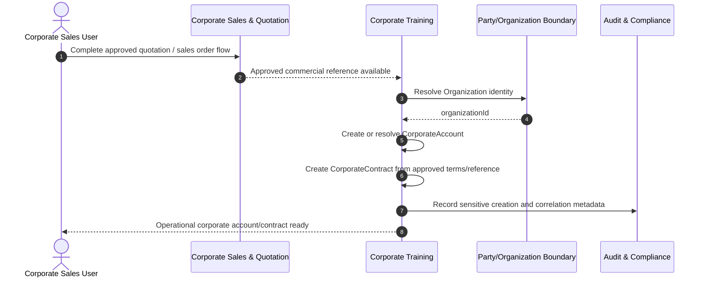

### Ownership Notes

- Quotation and SalesOrder remain Corporate Sales & Quotation data.
- CTM may retain approved foreign identifiers/references needed for traceability, but must not duplicate authoritative quotation or sales-order payloads.
- Invoice creation is not part of this workflow.

---

## 4.2 Participant Registration and Identity Resolution Workflow

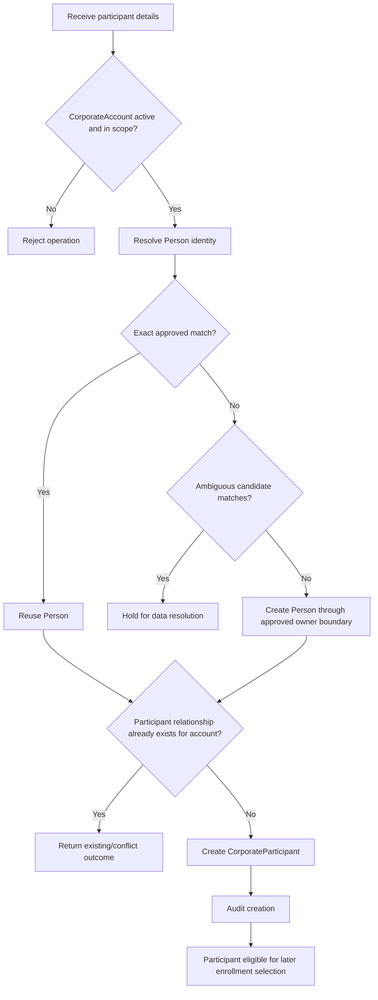

### Critical Rules

- Person identity is shared and must not be duplicated by employer change.
- CorporateParticipant stores corporate-context attributes only.
- Historical account relationships are immutable business history and must not be reassigned to a new employer.

---

## 4.3 Bulk Participant Import Workflow

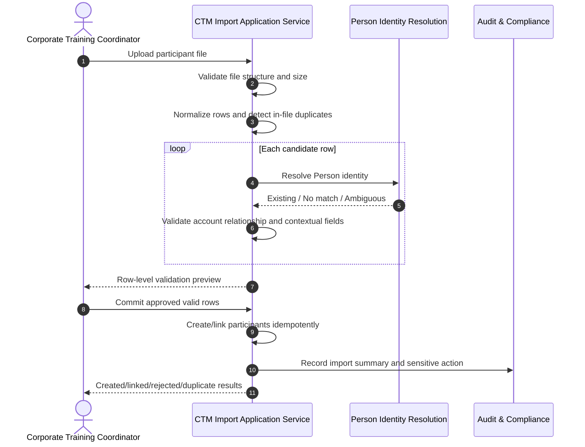

### Workflow Guarantees

1. Every row receives an outcome.
2. Invalid rows are never silently discarded.
3. Duplicate rows within the same import are identified before commit.
4. Ambiguous Person matches must not result in speculative Person creation.
5. Import retry behavior must be idempotent according to the command contract defined later in Part 5.

---

## 4.4 Single Corporate Enrollment Workflow

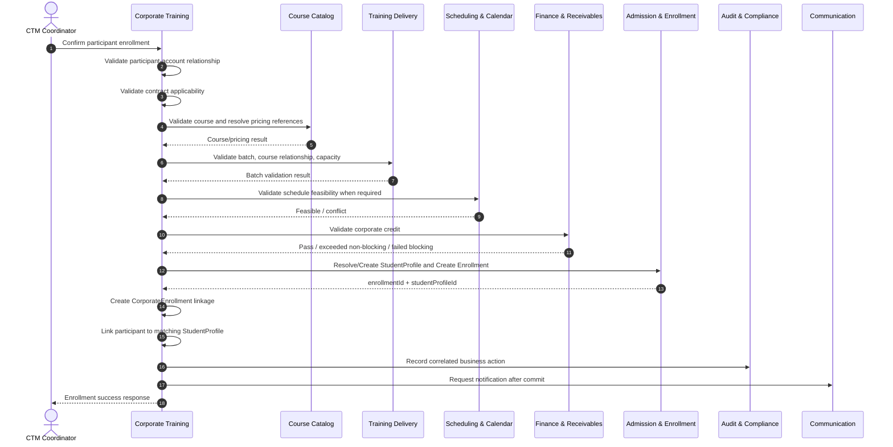

### Failure Boundary Rules

- Failure before central Enrollment creation results in no CorporateEnrollment.
- If Enrollment succeeds and CTM linkage fails, the system must expose a recoverable reconciliation condition.
- Notification failure must not roll back the successful enrollment/linkage transaction.
- Retry must not create duplicate Enrollment or CorporateEnrollment records.

---

## 4.5 Bulk Corporate Enrollment Workflow

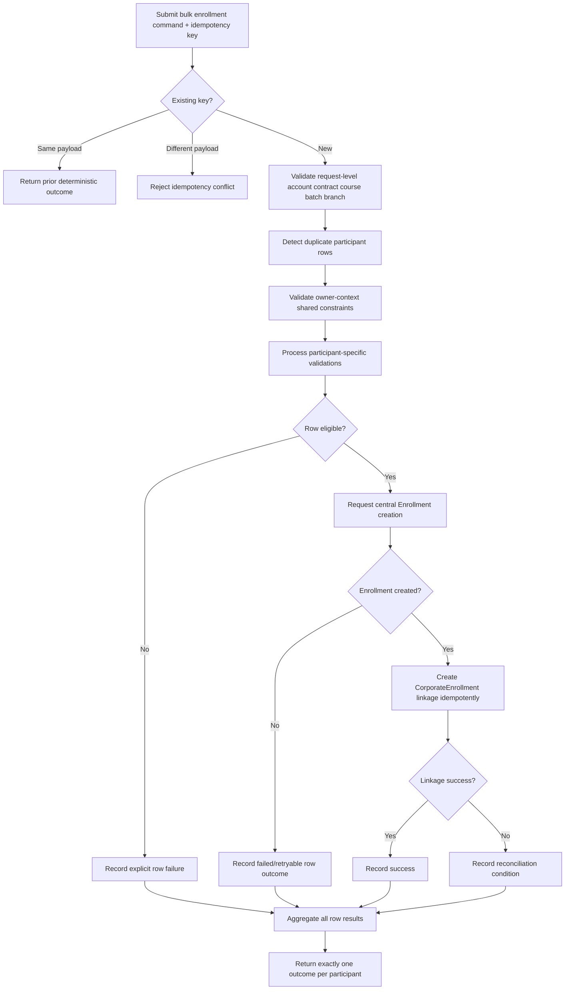

---

## 4.6 Corporate Account 360 Read Workflow

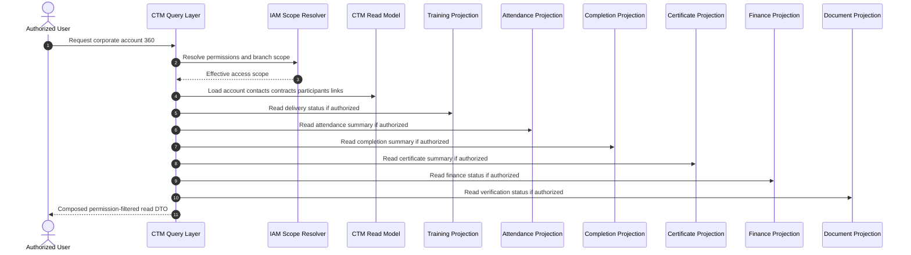

The composed view is a query concern only. It must not create a new source of truth for attendance, finance, completion, certificates, documents, or batch delivery.

---

## 4.7 Account Suspension/Closure Workflow

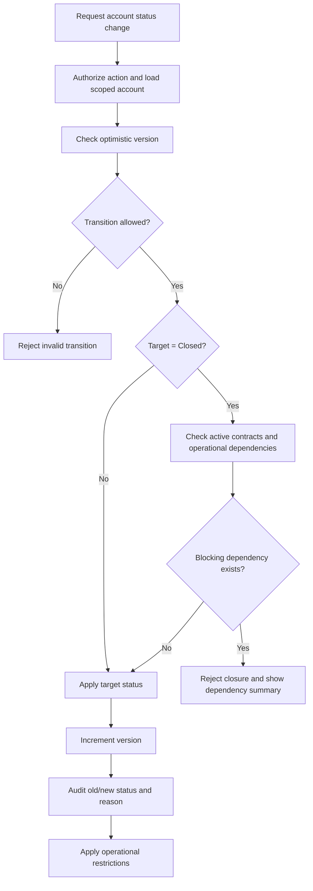

---

## 4.8 Enrollment Linkage Reconciliation Workflow

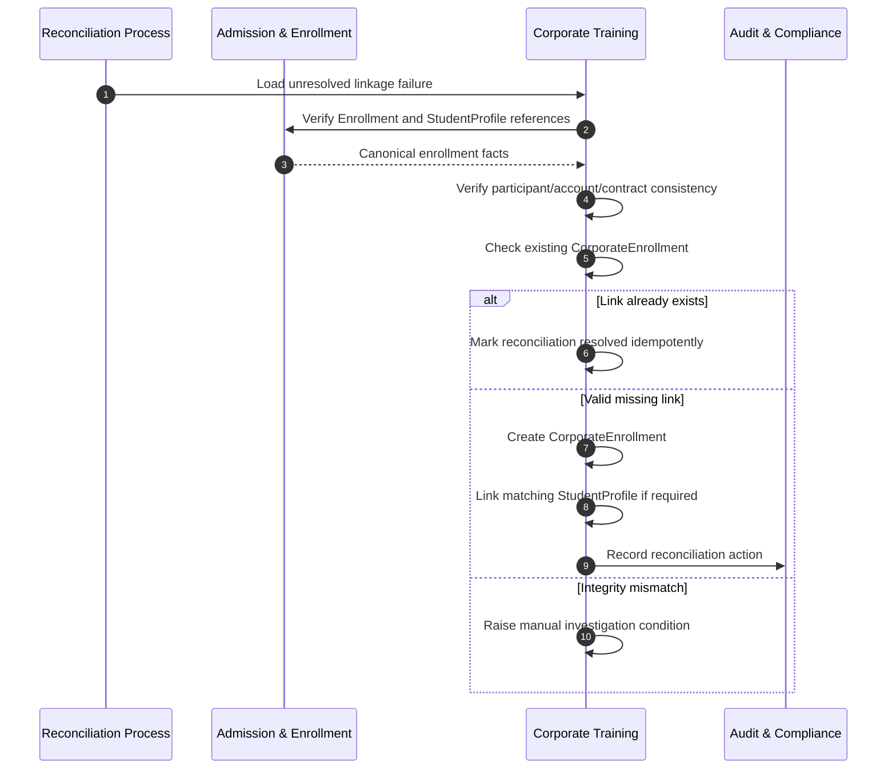

---

# 5. State Machines

## 5.1 State Modeling Principles

Only states with a defensible owner and business meaning are modeled here.

### Modeled

- `CorporateAccount.status`
- `CorporateContract.status`
- `CorporateParticipant.status`
- `CorporateEnrollment.billingStatus`

### Not Modeled as CTM-Owned State Machines

- Central `Enrollment.enrollmentStatus` — Admission & Enrollment owns it.
- Batch/session status — Training Delivery owns it.
- Attendance status — Attendance owns it.
- Completion status — Exam & Completion owns it.
- Certificate status — Certificate Management owns it.
- Invoice/payment/receivable status — Finance owns it.
- Nomination status — valid business capability but no approved ER entity/state model yet.
- Corporate training project/program closure status — workflow requirement exists but no approved CTM aggregate/entity in ER v3.
- GIVT project state — architecture decision pending.

The precise persisted enum names should be reconciled with `schema.prisma` before Part 4/5 implementation. The lifecycle semantics below are the FRD business contract.

---

## 5.2 CorporateAccount State Machine

### States

- `Draft` – account record is being prepared and cannot be used for enrollment.
- `Active` – account is operationally eligible, subject to contract, credit, branch, and other validations.
- `Suspended` – temporarily blocked from new participant/enrollment operations while history remains accessible.
- `Closed` – business relationship is operationally closed; no new contracts or enrollments may be created.
- `SoftDeleted` – repository-level logical deletion for records eligible under policy; historical data remains preserved and excluded from normal selection.

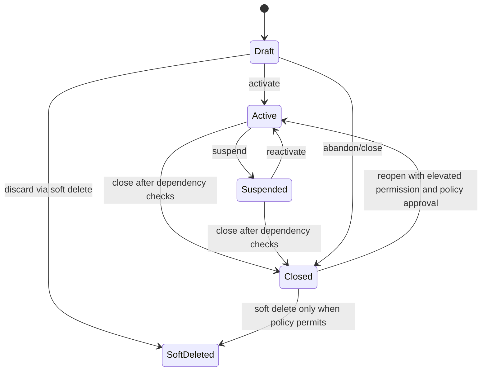

### Transition Rules Matrix – CorporateAccount

| From | To | Allowed | Required Permission | Key Guards / Conditions | Audit |
|---|---|---:|---|---|---|
| New | Draft | Yes | `corporate-training.account.create` | Valid Organization linkage; unique account code | Yes |
| Draft | Active | Yes | `corporate-training.account.activate` | Required account fields complete; no blocking integrity issue | Yes |
| Draft | Closed | Yes | `corporate-training.account.status.change` | Reason required | Yes |
| Draft | SoftDeleted | Yes | `corporate-training.account.delete` | No destructive delete; policy/dependency checks | Yes |
| Active | Suspended | Yes | `corporate-training.account.suspend` | Reason required | Yes |
| Suspended | Active | Yes | `corporate-training.account.reactivate` | Suspension reason resolved; version match | Yes |
| Active | Closed | Yes | `corporate-training.account.close` | Closure dependency checks pass | Yes |
| Suspended | Closed | Yes | `corporate-training.account.close` | Closure dependency checks pass | Yes |
| Closed | Active | Conditional | `corporate-training.account.reopen` | Elevated permission; business reason; policy permits reopening | Yes |
| Closed | SoftDeleted | Conditional | `corporate-training.account.delete` | Retention/dependency policy permits; history retained | Yes |
| Active | SoftDeleted | No | N/A | Must close or follow approved lifecycle first | N/A |
| SoftDeleted | Any operational state | No by default | N/A | Restore workflow not defined in current baseline | N/A |

### Operational Restrictions by State

| State | New Contact | New Contract | New Participant | New Corporate Enrollment | Historical View |
|---|---:|---:|---:|---:|---:|
| Draft | Conditional | Conditional | No | No | Yes |
| Active | Yes | Yes | Yes | Yes, subject to all guards | Yes |
| Suspended | Limited maintenance only | No activation | No | No | Yes |
| Closed | No | No | No | No | Yes |
| SoftDeleted | No | No | No | No | Authorized historical/reporting access only |

---

## 5.3 CorporateContract State Machine

### States

- `Draft`
- `Active`
- `Suspended`
- `Expired`
- `Terminated`
- `Closed`

`Expired` may be derived by date plus lifecycle processing, but the business behavior must be explicit: an expired contract cannot be used for new enrollments.

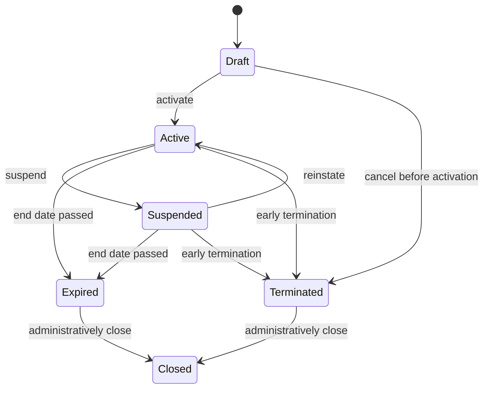

### Transition Rules Matrix – CorporateContract

| From | To | Allowed | Required Permission | Key Guards / Conditions | Enrollment Use After Transition |
|---|---|---:|---|---|---|
| New | Draft | Yes | `corporate-training.contract.create` | Unique contract number; valid account; valid dates; supported billing model | No |
| Draft | Active | Yes | `corporate-training.contract.activate` | Account eligible; current date within approved activation policy; required terms complete | Yes while effective |
| Draft | Terminated | Yes | `corporate-training.contract.terminate` | Reason required | No |
| Active | Suspended | Yes | `corporate-training.contract.suspend` | Reason required | No new enrollment |
| Suspended | Active | Yes | `corporate-training.contract.reinstate` | Contract still within effective period; account eligible | Yes |
| Active | Expired | Yes/System | Application permission or scheduled lifecycle authority | Effective end date elapsed | No |
| Suspended | Expired | Yes/System | Application permission or scheduled lifecycle authority | Effective end date elapsed | No |
| Active | Terminated | Yes | `corporate-training.contract.terminate` | Reason, effective termination date, impact checks | No new enrollment |
| Suspended | Terminated | Yes | `corporate-training.contract.terminate` | Reason required | No |
| Expired | Closed | Yes | `corporate-training.contract.close` | Reconciliation/administrative checks complete | No |
| Terminated | Closed | Yes | `corporate-training.contract.close` | Administrative checks complete | No |
| Expired | Active | No direct transition | N/A | Renewal/amendment strategy requires explicit business policy; do not rewrite history | No |
| Terminated | Active | No | N/A | Create approved replacement/renewal relationship instead | No |

### Contract Applicability Guard

A contract is applicable to a new corporate enrollment only when all of the following are true:

1. contract belongs to the same CorporateAccount as the participant;
2. contract status is `Active`;
3. requested business date falls within `startDate` and `endDate` inclusive according to configured ASTI timezone/business-date handling;
4. account is operationally eligible;
5. relevant commercial terms do not prohibit the enrollment;
6. any required corporate credit validation passes according to Finance rules.

---

## 5.4 CorporateParticipant State Machine

### States

- `Active`
- `Inactive`
- `Suspended`
- `SoftDeleted`

The DDD/ER baseline defines a participant `status` but not the exact enumeration. This FRD proposes the minimum operational lifecycle required by Part 1. Final enum values must be reconciled with Prisma before implementation.

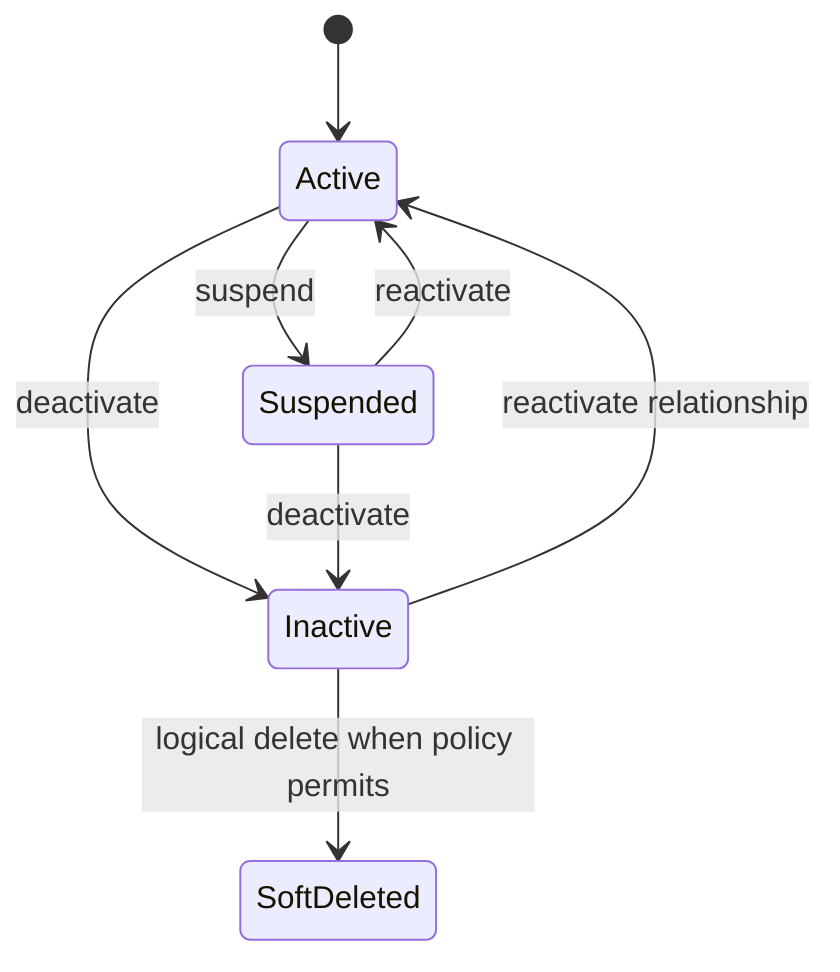

### Transition Rules Matrix – CorporateParticipant

| From | To | Allowed | Required Permission | Key Guards / Conditions | New Enrollment Selection |
|---|---|---:|---|---|---|
| New | Active | Yes | `corporate-training.participant.create` | Valid Person and CorporateAccount; no conflicting active relationship | Yes |
| Active | Suspended | Yes | `corporate-training.participant.suspend` | Reason required | No |
| Suspended | Active | Yes | `corporate-training.participant.reactivate` | Account eligible; reason resolved | Yes |
| Active | Inactive | Yes | `corporate-training.participant.deactivate` | Dependency checks; preserve history | No |
| Suspended | Inactive | Yes | `corporate-training.participant.deactivate` | Preserve history | No |
| Inactive | Active | Conditional | `corporate-training.participant.reactivate` | Same employer relationship remains valid; account eligible | Yes |
| Inactive | SoftDeleted | Conditional | `corporate-training.participant.delete` | Retention/dependency policy permits; no hard delete | No |
| SoftDeleted | Active | No by default | N/A | Restore policy not defined | No |

### Identity Invariant Across States

A participant state transition must never:

- replace `personId` with another person's identity;
- move historical CorporateEnrollment links to a different CorporateAccount;
- break the rule that `linkedStudentProfileId`, when present, belongs to the same Person as the participant.

---

## 5.5 CorporateEnrollment Billing Status State Machine

The ER model gives `CorporateEnrollment.billingStatus` but does not define its enumeration. The state machine below defines the minimum business lifecycle required for CTM-to-Finance coordination. It does **not** replace Finance-owned Invoice, Payment, or Receivable statuses.

### Proposed CTM Coordination States

- `NOT_REQUESTED` – enrollment linkage exists but billing prerequisites/reference are not ready.
- `READY_FOR_BILLING` – CTM has sufficient operational/commercial linkage for Finance to act.
- `BILLING_REQUESTED` – CTM has requested or signaled Finance billing processing.
- `INVOICED` – Finance projection confirms invoice issuance linked to the corporate training relationship.
- `PARTIALLY_SETTLED` – Finance projection confirms partial settlement.
- `SETTLED` – Finance projection confirms settlement according to Finance rules.
- `ON_HOLD` – billing is held due to a business exception or unresolved commercial reference.
- `CANCELLED` – the corporate billing coordination relationship is cancelled according to approved business rules; Finance records are not deleted or rewritten.

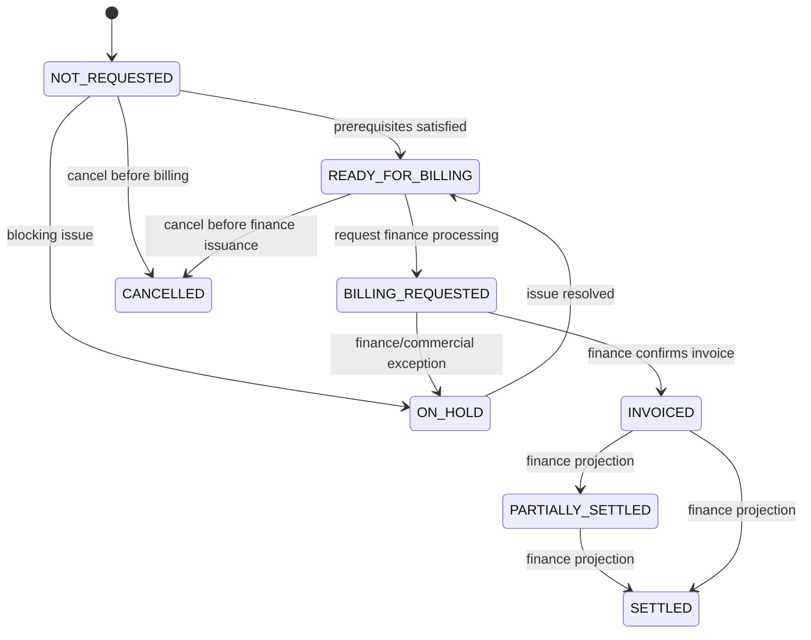

### Transition Rules Matrix – CorporateEnrollment Billing Status

| From | To | Allowed | Required Permission/Authority | Guard / Source of Truth | Notes |
|---|---|---:|---|---|---|
| New | NOT_REQUESTED | Yes | CTM enrollment-link application authority | Valid CorporateEnrollment created | Initial CTM coordination state |
| NOT_REQUESTED | READY_FOR_BILLING | Yes | `corporate-training.billing.prepare` | Required contract/commercial linkage complete | Does not create invoice |
| NOT_REQUESTED | ON_HOLD | Yes | `corporate-training.billing.hold` | Blocking issue and reason recorded | CTM coordination only |
| ON_HOLD | READY_FOR_BILLING | Yes | `corporate-training.billing.release` | Hold reason resolved | Audit required |
| READY_FOR_BILLING | BILLING_REQUESTED | Yes | `corporate-training.billing.request` | Finance request accepted/correlated | Finance owns downstream invoice |
| BILLING_REQUESTED | INVOICED | Yes/System projection authority | Finance confirms invoice linkage | CTM reflects owner-context result |
| BILLING_REQUESTED | ON_HOLD | Yes | Finance integration/application authority | Exception returned | Must preserve reason/reference |
| INVOICED | PARTIALLY_SETTLED | Yes/System projection authority | Finance projection only | CTM must not calculate authoritative paid amount |
| PARTIALLY_SETTLED | SETTLED | Yes/System projection authority | Finance projection only | Finance source of truth |
| INVOICED | SETTLED | Yes/System projection authority | Finance projection only | Supports full settlement in one payment |
| NOT_REQUESTED | CANCELLED | Conditional | `corporate-training.billing.cancel` | No conflicting finance issuance; reason required | Cannot delete Finance history |
| READY_FOR_BILLING | CANCELLED | Conditional | `corporate-training.billing.cancel` | Billing not yet issued; owner checks pass | Audit required |
| INVOICED | CANCELLED | No direct CTM transition | N/A | Invoice correction/credit note belongs to Finance | CTM reflects finance outcome separately |

### Ownership Warning

`billingStatus` must be treated as CTM coordination state or a read-through projection. It must never become an alternative ledger. Authoritative invoice, payment, outstanding, refund, credit note, and receivable states remain in Finance.

---

# 6. Cross-Context Workflow Responsibility Matrix

| Workflow Step | CTM Role | Owning Context | CTM Allowed Action | CTM Prohibited Action |
|---|---|---|---|---|
| Corporate sales opportunity | Consumer/handoff recipient | Corporate Sales & Quotation | Read approved commercial reference | Update sales pipeline directly |
| Quotation | Consumer | Corporate Sales & Quotation | Store approved reference/linkage where required | Own quotation lines or status |
| Organization identity | Consumer | Shared Party/Organization ownership boundary | Resolve and reference Organization | Duplicate Organization data as CTM master |
| Corporate account/contact/contract/participant | Owner | Corporate Training | Full authorized lifecycle operations | N/A outside cross-context rules |
| Course/pricing/discount | Consumer | Course Catalog | Query eligible course and resolution result | Rewrite course price/discount rules |
| Batch/capacity/session | Consumer | Training Delivery | Query/validate and select | Directly modify authoritative capacity/session state |
| Schedule feasibility | Consumer | Scheduling & Calendar | Request validation | Bypass conflict checks |
| Credit validation | Consumer | Finance & Receivables | Request validation and honor result | Independently calculate authoritative outstanding/credit |
| StudentProfile/Enrollment | Orchestrator/consumer | Admission & Enrollment | Request creation/linking | Persist central Enrollment in CTM repository |
| CorporateEnrollment linkage | Owner | Corporate Training | Create after Enrollment success | Create dangling link before Enrollment exists |
| Attendance | Read consumer | Attendance | View authorized projection | Mark/correct attendance via CTM repository |
| Completion | Read consumer | Exam & Completion | View status | Compute eligibility |
| Certificate | Read consumer | Certificate | View/access authorized metadata | Generate certificate directly |
| Documents | Read/request consumer | Document Management | View verification status and invoke approved document use case | Store document truth in CTM tables |
| Notifications | Requester | Communication & Notification | Submit request | Treat delivery as CTM transaction |
| Reports | Data provider/consumer | Reporting & Dashboards | Supply dimensions and read authorized reports | Own enterprise dashboard definitions |
| Audit | Event/source contributor | Audit & Compliance | Emit auditable action information | Own AuditLog repository |

---

# 7. Explicit Gap Handling in Part 2

## GAP-CTM-001 – Nomination Persistence

The business workflow requires corporate nomination lists and the DDD assigns nomination responsibility to Corporate Training, but ER v3 has no `CorporateNomination` or `CorporateNominationLine` entity. Therefore:

- user stories and workflows support participant-list intake and validation;
- no authoritative Nomination state machine is created here;
- Part 4 must not invent nomination tables until the architecture decision is approved.

## GAP-CTM-002 – Corporate Training Program / Project Aggregate

The DDD mentions `CorporateTrainingProgram`, while the operational workflow includes project confirmation, delivery, invoice linkage, and project closure. ER v3 omits a corresponding aggregate/entity. Therefore:

- no CTM Project state machine is defined;
- `CorporateAccount`, `CorporateContract`, and `Enrollment` statuses must not be overloaded to simulate project closure;
- architecture must decide whether the concept is a CTM aggregate, Training Delivery grouping, contract execution unit, or reporting-only dimension.

## GAP-CTM-003 – Equipment Availability

Operational workflow requires equipment availability during batch allocation, but there is no Equipment context or ER owner. CTM must not invent equipment inventory state.

## GAP-CTM-004 – Travel and Accommodation

The workflow explicitly asks for a separate Travel Module, but current DDD/ER v3 has no owner. Part 2 therefore excludes travel booking/cost state machines.

## GAP-CTM-005 – Costing and Profitability

The workflow asks for direct and indirect costing, selling price, profit, and profit percentage. Source cost ownership and allocation rules are undefined. CTM must not become an authoritative profitability ledger until this is resolved.

## GAP-CTM-006 – GIVT Training

The workflow requests a separate GIVT module, while DDD v3 does not define a GIVT bounded context. No duplicate GIVT lifecycle is introduced. Architecture must decide whether GIVT is a corporate program type, contract type, project type, or separate bounded context.

---

# 8. Consistency Check Against Part 1, DDD, and ER Model

| Check | Result | Part 2 Treatment |
|---|---|---|
| Enrollment is central | Aligned | All corporate learning flows create central Enrollment before CorporateEnrollment linkage |
| Course and Batch mandatory | Aligned | Enrollment use cases require both and validate through owner contexts |
| Corporate participant becomes student when enrolled | Aligned | StudentProfile resolution/linking is explicit in UC-CTM-006 and workflows |
| Person/Party identity reuse | Aligned | Contact and participant stories require identity resolution and reuse |
| Corporate linkage preserved | Aligned | Employer history and CorporateEnrollment linkage invariants are explicit |
| Contract controls corporate operation | Aligned | Contract applicability is a mandatory enrollment guard |
| Finance owns credit and ledger states | Aligned | Credit is requested from Finance; CTM billing state is coordination/projection only |
| Branch isolation | Aligned | Stories, use cases, reporting, and account access enforce server-side scope |
| Audit ownership | Aligned | CTM emits auditable action data; Audit & Compliance remains owner |
| Notification ownership | Aligned | CTM requests; delivery failure does not roll back core CTM transactions |
| Nomination aggregate | Gap preserved | Intake workflow included; no invented persisted state machine |
| Corporate project closure | Gap preserved | No Project state introduced on unrelated aggregates |
| Travel/equipment/costing/GIVT | Gap preserved | Not modeled until architecture ownership decisions exist |

---

# 9. Part 2 Completion Summary

This Part 2 defines:

- fourteen detailed user stories with positive, negative, authorization, identity, consistency, and boundary acceptance criteria;
- twelve primary use cases covering account, contact, contract, participant, import, enrollment, bulk enrollment, operational views, lifecycle control, reporting, and reconciliation;
- eight end-to-end business workflows showing modular-monolith context boundaries;
- four CTM-owned lifecycle state models with permission-aware transition matrices;
- explicit exclusion of ownerless workflow concepts from persisted state modeling;
- end-to-end consistency with the enrollment-centric model, Person/Party identity strategy, server-side branch isolation, and DDD ownership boundaries.

The next FRD part should use these stories, use cases, workflows, and lifecycle rules as the behavioral baseline for screen specifications and UI behavior. Any screen that attempts to directly mutate another bounded context's source-of-truth data should be rejected or redesigned as an owner-context action or approved orchestration call.
