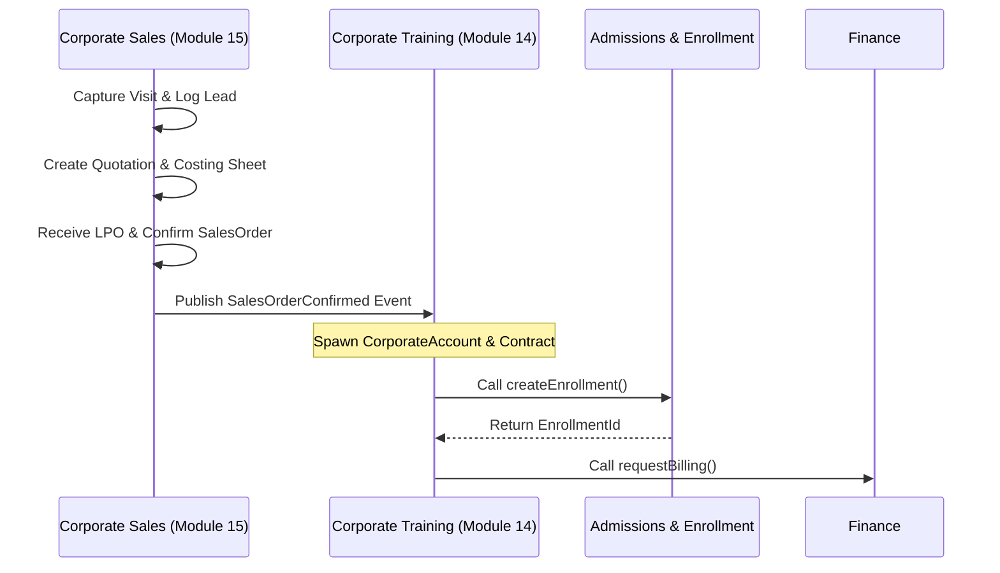

# Module 15 – Corporate Sales & Quotation

## Document Control

| Field | Value |
|---|---|
| Module | Module 15 – Corporate Sales & Quotation |
| Module Code | CSQ |
| Business Domain Classification | Core Domain |
| Owning Bounded Context | Corporate Sales & Quotation |
| Architecture Style | Next.js monorepo, modular monolith |
| Primary Aggregate | `CorporateSalesLead` |
| Handoff Boundary | `CorporateTrainingProject` owned by Corporate Training Management |
| Source Baselines | DDD Context Map v3.0; ER Model v3.0; ASTI ERP Marketing & Sales Workflow Requirement |
| Phase | Phase 2 |
| Application Scope | Single ASTI admin portal first |
| Development Readiness | Ready for schema draft and application service stubbing |

---

# 1. Purpose and Objective

Module 15 – Corporate Sales & Quotation manages the commercial B2B sales lifecycle of the Al Saud Training Institute (ASTI). It tracks prospective clients from the first marketing visit and follow-up reminders, through quotation costing estimation, internal approvals, and final B2B contract confirmation. 

The primary objective is to establish a structured, traceable commercial pipeline that:
1. Records all marketing executive visits and subsequent customer follow-ups.
2. Formulates B2B quotations with distinct items (course fees, trainer charges, equipment, and VAT) without leaking implementation details.
3. Automatically computes commercial costing sheets (direct vs. indirect costs, margins, and profit %).
4. Implements internal manager approval policies before high-value or low-margin quotations are sent to clients.
5. Manages confirmation handoffs (e.g. uploading client LPOs and nomination documents) to create standard sales orders.
6. Automatically initiates training delivery by passing won opportunities to Module 14 (Corporate Training Management) via structured domain events.

---

# 2. Business Goals

| ID | Business Goal |
|---|---|
| BO-CSQ-001 | Capture and audit every marketing visit conducted by ASTI sales representatives, creating a historical log of prospective B2B clients. |
| BO-CSQ-002 | Automate follow-up scheduling and notification alerts to prevent lead stagnation. |
| BO-CSQ-003 | Standardize quotation generation, allowing direct insertion of course quantity, duration, venue, and extra charges (e.g. equipment, certificates). |
| BO-CSQ-004 | Provide a granular costing sheet to evaluate direct trainer/execution costs and indirect administration overheads, guaranteeing margin compliance. |
| BO-CSQ-005 | Enforce internal security policies where low-margin or high-value quotes require senior management approval. |
| BO-CSQ-006 | Support version-controlled quotation revisions, tracking exactly who made changes and why. |
| BO-CSQ-007 | Transition confirmed leads into standard `SalesOrder` entities upon receipt of official LPOs or confirmation emails. |
| BO-CSQ-008 | Maintain end-to-end auditability and traceability from `Lead` -> `Quotation` -> `SalesOrder` -> `LPO` -> CTM `Contract`. |

---

# 3. Scope

## 3.1 Included Scope

- **B2B Lead Tracking**: Managing `CorporateSalesLead` entities and pipeline stages (New, Visit Planned, Under Discussion, Won, Lost).
- **Marketing Visit Log**: Logging meeting date, contacts, notes, and expected candidate count.
- **Follow-up Tasks**: Generating follow-up dates and dashboard alerts.
- **Proposal & Quotation Editor**: Creating, updating, and exporting PDF quotations.
- **Profitability Costing Sheet**: Formulating direct costs (trainer, venue, printing, etc.) and indirect overheads (admin, marketing) to compute profit margins.
- **Approvals & Revisions**: Enforcing margin-based approval routing and tracking versioned quotation history.
- **Confirmation Handoff**: Recording won status, uploading the official LPO/email, generating the `SalesOrder`, and publishing `SalesOrderConfirmed` outbox events.

## 3.2 Excluded Scope

- **Client Invoicing/Payments**: Owned exclusively by the **Finance** context. CSQ does not create invoices or collect cash.
- **Student Profiling and Scheduling**: CSQ reads batch dates and trainer availability, but does not allocate slots or verify room conflicts.
- **Travel Log Execution**: Detailed booking details (hotel reservation, driver logs) are deferred to a generic future Travel context. CSQ only captures costing estimates.
- **GIVT Training Bounded Context**: GIVT is a separate project classification and is excluded from Phase 2 CSQ scope.

---

# 4. Stakeholders & Actors

- **Marketing Executive**: Conducts visits, logs notes, and schedules follow-ups.
- **Sales/Account Manager**: Generates quotations, runs costing sheets, and uploads LPOs.
- **Branch Manager / Approver**: Evaluates costing margins and approves or returns quotes.
- **CTM Admin**: Downstream consumer who receives the confirmed sales order to prepare delivery.
- **System Scheduler**: Background daemon triggering daily follow-up reminders.

---

# 5. Functional Overview

```text
Module 15: Corporate Sales & Quotation
├── Visit Tracking
│   ├── Log Marketing Visit
│   └── Record Contact Metadata
├── Lead & Follow-Up
│   ├── Sales Pipeline Stage Machine
│   └── Follow-Up Reminders & Alerts
├── Commercial Editor
│   ├── Quotation Itemized Line Items
│   ├── Costing Sheet (Direct/Indirect Margins)
│   └── Revision Version History
└── Order Confirmation
    ├── LPO / Email Upload
    └── Handoff Trigger (SalesOrderConfirmed Event)
```

---

# 6. Permission Model Overview

The module enforces dynamic, server-side RBAC scoping using the prefix `corporateSales.*`:
- **Branch Scope (`B`)**: Access is isolated to the user's assigned branch. Sales logs from Muscat cannot be read by Salalah sales executives unless administrative permission is granted.
- **Global Scope (`G`)**: Access across all branches, restricted to directors or central auditors.
- **Self/Owner Scope (`B/A`)**: Sales executives can only edit leads assigned to their ownership code.

Key permission rules:
- `corporateSales.lead.create`: Permission to log leads.
- `corporateSales.quotation.approve`: Elevated permission to bypass margin locks.

---

# 7. Non-Functional Requirements (NFR) Summary

- **Performance**: Costing sheet calculations must execute sub-50ms; quotation PDF rendering must compile within 1.5s at p95.
- **Concurrency**: Optimistic locking (`version` field) on all quotation revisions to prevent two representatives from overwriting the same quote.
- **Security**: Customer contact PII (phones, emails) must be masked in global reports unless the user has export clearance.
- **Audit Compliance**: All LPO uploads and approval actions must write an audit record with details of the approver and the approved margin.

---

# 8. DDD Context & Handoff Boundaries



### Handoff Triggers:
1. **Quotation Accepted**: Spawns `SalesOrder` in CSQ.
2. **SalesOrder Confirmed**: CSQ publishes `SalesOrderConfirmed` event. CTM listens to this to initialize the downstream `CorporateAccount` and `CorporateContract` matching the billing model.
