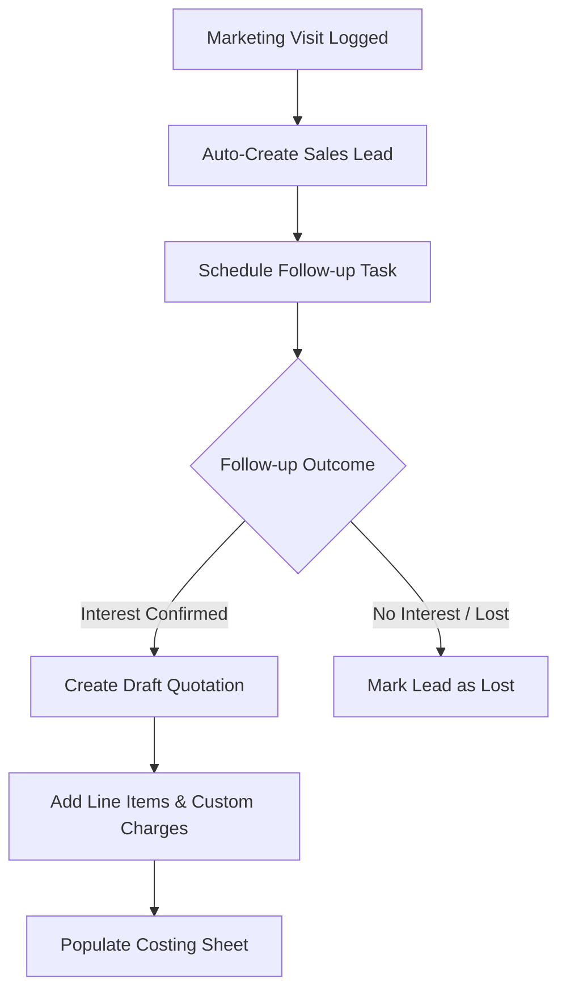
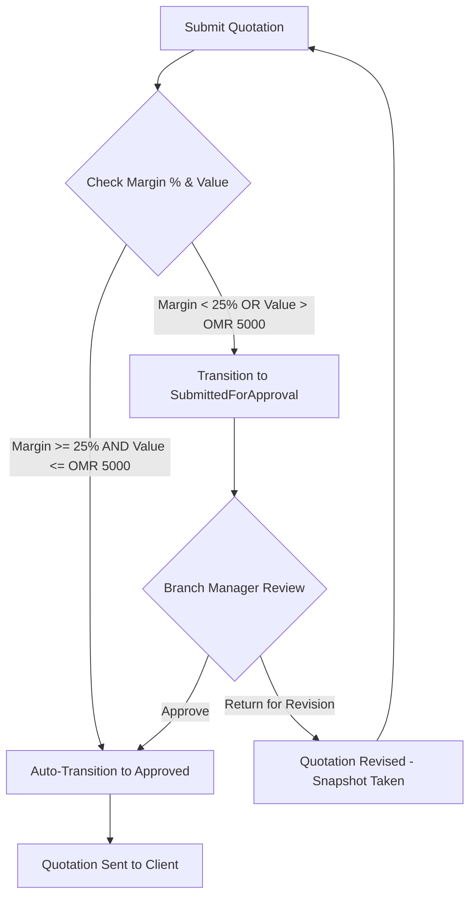
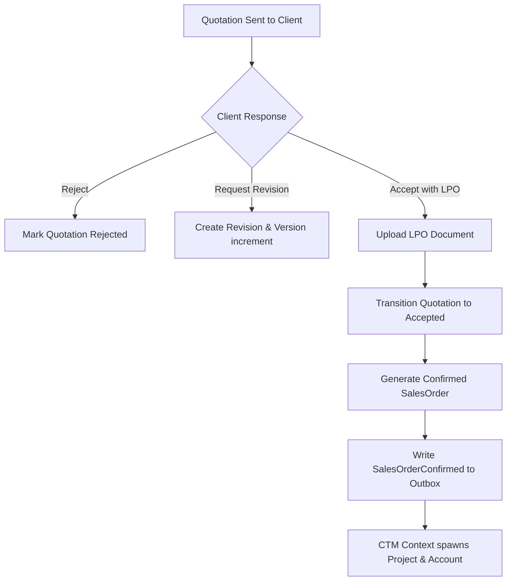

# Part 2 – User Stories, Use Cases, Workflows, State Machines

## Module 15 – Corporate Sales & Quotation

---

# 1. User Stories & Acceptance Criteria

Here are the 12 key user stories covering the B2B sales pipeline, costing, version tracking, approvals, and order handoffs, prioritized using the MoSCoW method.

---

### US-CSQ-001: Log Marketing Visit (Must Have)
As a **Marketing Executive**,  
I want to **log the details of my client visits in the admin portal**,  
So that **ASTI maintains a historical interaction log of prospective B2B accounts**.

*   **Acceptance Criteria (Gherkin)**:
    *   **Scenario: Successfully logging a B2B visit**
        *   Given the executive is logged in and operates within their assigned branch scope
        *   When they submit a visit log specifying `corporateAccountId`, contact details (`contactPersonName`, `contactNumber`, `email`), `meetingDate`, and expected candidate count
        *   Then the system creates the `CorporateMarketingVisit` record, associates it with the branch, and writes an audit log.
    *   **Scenario: Prevent logging visit with empty fields**
        *   Given the executive is on the visit log form
        *   When they attempt to submit with an empty contact person or invalid email format
        *   Then the system rejects the submission and displays validation errors.

---

### US-CSQ-002: Automated Follow-Up Tasks (Must Have)
As a **Marketing Executive**,  
I want the system to **automatically schedule a follow-up task and alert me**,  
So that **I do not forget to contact the client on the expected follow-up date**.

*   **Acceptance Criteria (Gherkin)**:
    *   **Scenario: Auto-scheduling a follow-up after logging a visit**
        *   Given a marketing visit has been successfully logged
        *   When the system processes the visit record
        *   Then it automatically schedules a `CorporateSalesFollowUp` task with a target date 3 days in the future and registers an outbox reminder alert.

---

### US-CSQ-003: Create B2B Quotation (Must Have)
As a **Sales Manager**,  
I want to **create a B2B quotation by selecting courses and quantities**,  
So that **I can provide a professional, itemized proposal to a client**.

*   **Acceptance Criteria (Gherkin)**:
    *   **Scenario: Successfully creating a draft quotation**
        *   Given the sales manager has `corporateSales.quotation.create` permission
        *   When they create a quotation for an active corporate account, selecting a course, entering quantity, unit price, and setting a valid-until date
        *   Then the system calculates subtotals, applies a default 5% Omani VAT rate, and saves the quotation in `DRAFT` status with version `1`.

---

### US-CSQ-004: Quotation Line Items & Custom Charges (Must Have)
As a **Sales Manager**,  
I want to **add custom line items like trainer fees and equipment charges to a quotation**,  
So that **all components of a custom corporate contract are itemized**.

*   **Acceptance Criteria (Gherkin)**:
    *   **Scenario: Adding ancillary charges to a quote**
        *   Given a draft quotation exists
        *   When the sales manager adds line items specifying trainer fees, certificate printing, and logistics costs
        *   Then the system adds these lines, recalculates the subtotal, adds 5% VAT, and updates the total quotation value.

---

### US-CSQ-005: Costing & Profitability Margin Sheet (Must Have)
As a **Sales Manager**,  
I want to **enter direct and indirect costs to calculate quotation profitability**,  
So that **I can ensure ASTI does not bid on a contract below cost**.

*   **Acceptance Criteria (Gherkin)**:
    *   **Scenario: Correctly calculating margins on a costing sheet**
        *   Given a quotation exists with a net selling price of OMR 1,000
        *   When the sales manager records OMR 500 in direct costs (trainer, venue) and OMR 100 in indirect costs (admin)
        *   Then the system calculates total direct cost as OMR 500, total cost as OMR 600, profit as OMR 400, and profit margin as 40.00%.

---

### US-CSQ-006: Margin-Based Approvals Routing (Must Have)
As a **Sales Manager**,  
I want the system to **automatically route quotations to approval queues if margins are low**,  
So that **senior management can audit and authorize low-margin bids**.

*   **Acceptance Criteria (Gherkin)**:
    *   **Scenario: Bypassing approval for high-margin quotes**
        *   Given a costing sheet has a calculated margin of 35%
        *   When the sales manager submits the quotation
        *   Then the system auto-transitions the quotation to `APPROVED` status.
    *   **Scenario: Locking quotes with low margins**
        *   Given a costing sheet has a calculated margin of 18% (below the 25% threshold)
        *   When the sales manager submits the quotation
        *   Then the system transitions the quotation to `SubmittedForApproval`, locks editing, and alerts the Branch Manager.

---

### US-CSQ-007: Version-Controlled Quotation Revisions (Should Have)
As a **Sales Manager**,  
I want to **revise a quotation and retain a history of the previous versions**,  
So that **I can track exactly what changes were negotiated with the client**.

*   **Acceptance Criteria (Gherkin)**:
    *   **Scenario: Creating a quotation revision**
        *   Given a quotation in `Approved` or `Rejected` status needs changes
        *   When the sales manager triggers a revision
        *   Then the system compiles the current quotation details into a JSON snapshot, saves it to the `QuotationRevision` history table, and increments the quotation version to `2` in `DRAFT` status.

---

### US-CSQ-008: LPO & Email Confirmation Upload (Must Have)
As a **Sales Manager**,  
I want to **upload the client's Local Purchase Order (LPO) or confirmation email**,  
So that **I can commercially confirm the sale before training execution**.

*   **Acceptance Criteria (Gherkin)**:
    *   **Scenario: Uploading an LPO document to confirm a quote**
        *   Given a quotation is in `Sent` status
        *   When the sales manager uploads an LPO PDF document
        *   Then the system links the document reference, transitions the quotation to `Accepted`, and writes an audit trail entry.

---

### US-CSQ-009: Sales Order Generation (Must Have)
As a **Sales Manager**,  
I want to **generate a Sales Order upon quotation acceptance**,  
So that **the contract value and commercial terms are officially locked**.

*   **Acceptance Criteria (Gherkin)**:
    *   **Scenario: Generating a confirmed sales order**
        *   Given a quotation has transitioned to `Accepted`
        *   When the system processes the transition
        *   Then it automatically creates a `SalesOrder` record in `Confirmed` status, populating values from the quotation line items.

---

### US-CSQ-010: Outbox Handoff to Corporate Training (Must Have)
As a **CTM Admin**,  
I want the system to **automatically notify my module and create a draft project when a Sales Order is confirmed**,  
So that **I can immediately begin participant nominations and delivery planning**.

*   **Acceptance Criteria (Gherkin)**:
    *   **Scenario: Asynchronous outbox event dispatch**
        *   Given a sales order is confirmed in the database
        *   When the database transaction succeeds
        *   Then the system writes a `SalesOrderConfirmed` event to the `OutboxEvent` table to trigger project instantiation in CTM (Module 14).

---

### US-CSQ-011: Lost Opportunity Tracking (Should Have)
As a **Sales Manager**,  
I want to **mark a sales lead as Lost specifying the reason**,  
So that **ASTI can analyze drop-offs and improve commercial performance**.

*   **Acceptance Criteria (Gherkin)**:
    *   **Scenario: Marking a lead as lost**
        *   Given a sales lead is in `UnderDiscussion` stage
        *   When the manager marks the lead as lost, specifying "Competitor Price" as the reason
        *   Then the system transitions the lead to `Lost` stage and records the loss reason for analytics.

---

### US-CSQ-012: Branch Scoping Filter on Leads (Must Have)
As a **Branch Manager**,  
I want to **only see leads and visits associated with my assigned branch**,  
So that **I do not accidentally access or edit another branch's pipeline data**.

*   **Acceptance Criteria (Gherkin)**:
    *   **Scenario: Branch isolation check**
        *   Given a Branch Manager assigned only to Muscat is logged in
        *   When they query the corporate sales lead list
        *   Then the query enforces `branchId = Muscat` and does not return Salalah branch leads.

---

# 2. Workflows (Mermaid Diagrams)

## 2.1 B2B Lead-to-Quotation Workflow

## 2.2 Costing, Margin Checking & Approval Workflow

## 2.3 Sales Order Confirmation and Handoff

---

# 3. State Machines

## 3.1 CorporateSalesLead.stage

| Source State | Target State | Event | Trigger / Conditions | Required Permission |
| :--- | :--- | :--- | :--- | :--- |
| **New** | **VisitPlanned** | Plan Visit | Visit scheduled with client | `corporateSales.visit.create` |
| **VisitPlanned** | **VisitCompleted** | Log Visit Outcome | Visit logged in admin portal | `corporateSales.visit.create` |
| **VisitCompleted** | **ProposalSent** | Send Quotation | Quotation is approved and emailed | `corporateSales.quotation.send` |
| **ProposalSent** | **UnderDiscussion** | Client Review | Client requests clarifications | `corporateSales.lead.update` |
| **UnderDiscussion** | **Confirmed** | Accept Quote | Quote accepted, LPO uploaded | `corporateSales.salesOrder.confirm` |
| **UnderDiscussion** | **Lost** | Close Lost | Deal dropped; record lost reason | `corporateSales.lead.update` |

## 3.2 Quotation.status

| Source State | Target State | Event | Conditions | Required Permission |
| :--- | :--- | :--- | :--- | :--- |
| **Draft** | **SubmittedForApproval** | Submit Quote | Margin < 25% or Value > OMR 5,000 | `corporateSales.quotation.submit` |
| **Draft** | **Approved** | Submit Quote | Margin >= 25% and Value <= OMR 5,000 | `corporateSales.quotation.submit` |
| **SubmittedForApproval** | **Approved** | Approve BPO | Margin and terms verified | `corporateSales.quotation.approve` |
| **SubmittedForApproval** | **ReturnedForRevision** | Return BPO | Changes requested by manager | `corporateSales.quotation.reject` |
| **Approved** | **Sent** | Dispatch | Sent to client via email/portal | `corporateSales.quotation.send` |
| **Sent** | **Accepted** | Record LPO | LPO document reference uploaded | `corporateSales.quotation.accept` |
| **Sent** | **Expired** | Expiry Date Reached| Current date > validUntil | System daemon |

---

# 4. Use Cases

## 4.1 UC-CSQ-01: Costing Profitability Sheet Calculation
- **Actor**: Sales Manager
- **Description**: Evaluates estimated margins before submitting a quote.
- **Preconditions**: Quotation status is `DRAFT`.
- **Flow of Events**:
  1. Sales Manager opens the Quotation costing screen.
  2. The system retrieves the subtotal value of the quotation.
  3. The Sales Manager inputs estimated direct costs (trainer, travel, venue, materials) and indirect costs (marketing, administrative overhead).
  4. The system aggregates values, calculates margin percentages, and displays real-time calculations.
  5. The Sales Manager clicks "Save Costing".
  6. The system saves the `QuotationCostingSheet` record.
- **Postconditions**: Costing sheet margins are stored and linked to the quotation.

## 4.2 UC-CSQ-02: Manage Quotation Revisions
- **Actor**: Sales Manager
- **Description**: Revises an existing quote while preserving past structures.
- **Preconditions**: Quotation status is `Sent`, `Approved`, or `Rejected`.
- **Flow of Events**:
  1. Sales Manager selects "Revise Quotation" on an approved/sent quote.
  2. The system serializes all current lines, totals, and costing sheet metrics into a JSON snapshot.
  3. The system inserts a `QuotationRevision` record linked to the quotation, containing the version number, snapshot, and date.
  4. The system increments the quotation version column (e.g. from v1 to v2) and transitions the status back to `DRAFT`.
  5. The Sales Manager applies required edits and saves.
- **Postconditions**: Version incremented; old details preserved in history.
