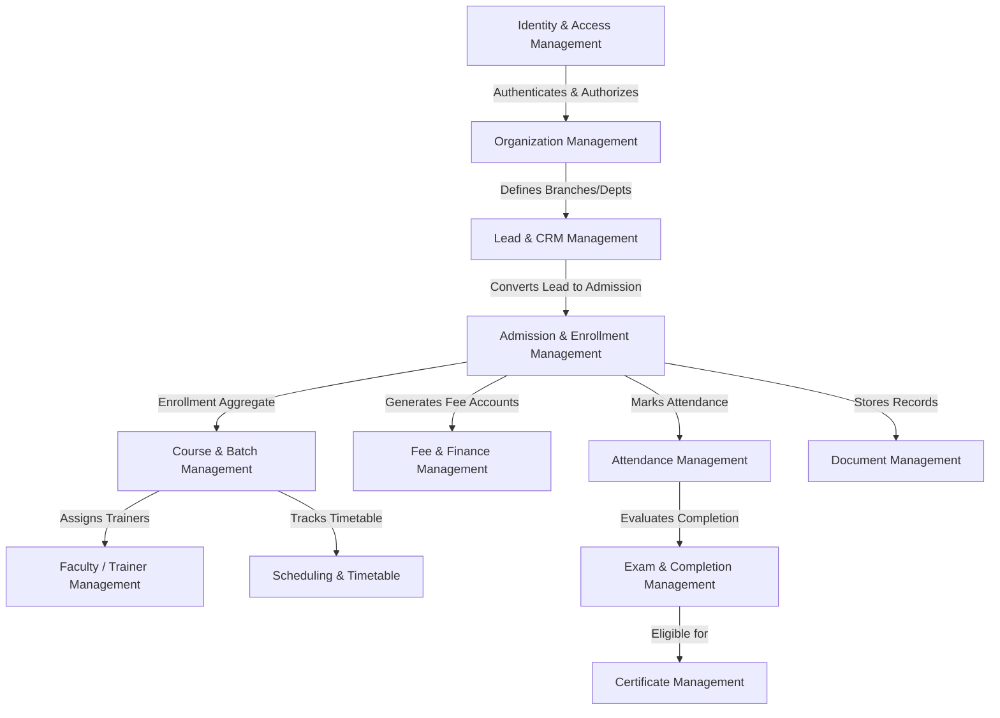
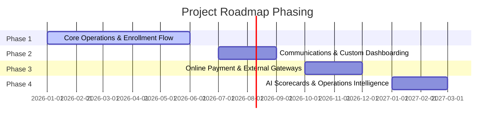

# Product Requirements Document (PRD)

## Institute Management System (IMS) v2.0

---

> [!NOTE]
> This is the Master Product Requirements Document (PRD) for the Institute Management System (IMS) v2.0. It acts as the central index and single source of truth for business goals, domain design, functional specifications, technical architecture, and phase-wise roadmap.

---

## 1. Document Control & Purpose

* **Version:** 2.0
* **Status:** Draft / Active
* **Primary Target Market:** Oman Training & Coaching Institutes
* **Secondary Target Market:** GCC Countries & India (GCC Compliance ready)
* **Scope:** Single-client training institute platform, designed to be modular-monolith first with dynamic RBAC, strict branch-scoping, and transactional outbox event architecture.

This document compiles, aligns, and references the following sub-documents:
* **Business Requirement Document:** [BRD.md](file:///Users/praveenkumar/Documents/Project/Freelance/ims-v2/docs/architecture/brd/BRD.md)
* **Non-Functional Requirements:** [Non-Functional Requirement Document.md](file:///Users/praveenkumar/Documents/Project/Freelance/ims-v2/docs/architecture/nfr/Non-Functional%20Requirement%20Document.md)
* **Database Design:** [Database Design Document.md](file:///Users/praveenkumar/Documents/Project/Freelance/ims-v2/docs/architecture/database/Database%20Design%20Document.md)
* **Technology Stack Recommendation:** [ims-technology-stack-recommendation.md](file:///Users/praveenkumar/Documents/Project/Freelance/ims-v2/docs/ims-technology-stack-recommendation.md)
* **Project Status Tracker:** [project-status.md](file:///Users/praveenkumar/Documents/Project/Freelance/ims-v2/docs/project-status.md)

---

## 2. Business Objectives & Problem Statement

### 2.1 Problem Statement
Coaching and professional training centers rely heavily on fragmented tools (Excel, Google Sheets, WhatsApp, paper registers, and disconnected local accounting databases). This leads to operational bottlenecks such as duplicate student records, missed follow-ups, lost leads, manual attendance errors, weak fee collection tracking, lack of corporate contract visibility, and zero auditable records.

### 2.2 Business Objectives
* **BO-001 (Centralized Operations):** Consolidate lead management, admissions, enrollment, billing, batches, timetables, trainer assignments, and certificates under a single system.
* **BO-002 (Lead-to-Admission Pipeline):** Improve lead tracking and counselor performance to boost enrollment rates.
* **BO-003 (Financial Audit & Control):** Guarantee 100% financial visibility for manual payments, receipt generation, installments, discounts, and refunds with structured approvals.
* **BO-004 (Oman/GCC Legal Readiness):** Support localized receipt tax standards (Oman VAT formatting rules), bilingual English/Arabic certificates, and RTL layout.
* **BO-005 (Corporate & Individual Synergy):** Share a unified **Enrollment** lifecycle model across Individual (Walk-In, Regular) and Corporate training pathways.

---

## 3. Bounded Context Map & DDD Overview

To maintain clean code boundaries and prevent spaghetti code, IMS is structured as a **TypeScript Modular Monolith** where each domain context owns its database tables, aggregate business validation, domain events, application services, and authorization checks.

### 3.1 Domain Ownership Rules
* **The Central Aggregate:** `Enrollment` is the core model connecting Students, Courses, Batches, Branches, and Finance. Direct database mutations on Enrollment by other contexts are prohibited; mutations must go through the Admission & Enrollment Bounded Context.
* **Admission vs. Enrollment:**
  * **Admission:** Becoming a registered student of the institute (represented by student profiles, verification documents, and global status).
  * **Enrollment:** The act of joining a specific Course, Batch, Corporate Program, or Walk-In session.
* **Walk-In Flow:** Walk-in is not a separate entity structure; it is a rapid, same-day orchestration flow over standard Enrollment, Finance (immediate payment), and Exam/Completion (immediate certificate check).

---

## 4. Bounded Context & Functional Specifications Index

Below is the directory of all functional requirements mapped to their respective modules. Each module has a dedicated markdown document detailing its screens, database models, validations, and permissions.

| Bounded Context / Module | Key Purpose & Entities Owned | Detailed Requirement File |
| :--- | :--- | :--- |
| **Module 1: Identity & Access Management** | User registration, password complexity, dynamic RBAC, database sessions, account lockout, self-service password reset. | [Module 1: Identity & Access Management.md](file:///Users/praveenkumar/Documents/Project/Freelance/ims-v2/docs/architecture/frd/Module%201:%20Identity%20&%20Access%20Management.md) |
| **Module 2: Organization Management** | Multi-branch and department scoping, classrooms hierarchy, effective dating rules, branch deactivation deprovisions. | [Module 2: Organization Management.md](file:///Users/praveenkumar/Documents/Project/Freelance/ims-v2/docs/architecture/frd/Module%202:%20Organization%20Management.md) |
| **Module 3: Lead & Inquiry Management** | CRM pipeline, intake source configurability, stages, counselor assignments, next follow-up dates, won/lost reason. | [Module 3: Lead & Inquiry Management.md](file:///Users/praveenkumar/Documents/Project/Freelance/ims-v2/docs/architecture/frd/Module%203:%20Lead%20&%20Inquiry%20Management.md) |
| **Module 4: Admission & Enrollment** | Admission rules, central Enrollment lifecycle, student identity validation, student ID cards. | [Module 4: Admission & Enrollment Management.md](file:///Users/praveenkumar/Documents/Project/Freelance/ims-v2/docs/architecture/frd/Module%204:%20Admission%20&%20Enrollment%20Management.md) |
| **Module 5: Student Management** | Student profiles, emergency contacts, status history (Applied, Active, Completed, Drop, Suspended, Alumni). | [Module 5: Student Management.md](file:///Users/praveenkumar/Documents/Project/Freelance/ims-v2/docs/architecture/frd/Module%205:%20Student%20Management.md) |
| **Module 6: Course & Batch Management** | Course definitions, pricing levels, completion rules, batches, waiting lists, capacity boundaries. | [Module 6: Course & Batch Management.md](file:///Users/praveenkumar/Documents/Project/Freelance/ims-v2/docs/architecture/frd/Module%206:%20Course%20&%20Batch%20Management.md) |
| **Module 7: Scheduling & Timetable** | Session calendars, trainer availability conflicts, classroom conflicts, lab space overlaps. | [Module 7: Scheduling & Timetable Management.md](file:///Users/praveenkumar/Documents/Project/Freelance/ims-v2/docs/architecture/frd/Module%207:%20Scheduling%20&%20Timetable%20Management.md) |
| **Module 8: Attendance Management** | Session-wise attendance rosters, edit locks, trainer corrections, automatic attendance ratios. | [Module 8: Attendance Management.md](file:///Users/praveenkumar/Documents/Project/Freelance/ims-v2/docs/architecture/frd/Module%208:%20Attendance%20Management.md) |
| **Module 9: Fee & Finance Management** | Fee plans, dynamic installments, manual payments, discounts, refunds, tax receipts (OMR currency support). | [Module 9: Fee & Finance Management.md](file:///Users/praveenkumar/Documents/Project/Freelance/ims-v2/docs/architecture/frd/Module%209:%20Fee%20&%20Finance%20Management.md) |
| **Module 10: Faculty / Trainer Management** | Faculty profiles, trainer credentials, hourly trainer logs, assignment calendars. | [Module 10: Faculty Or Trainer Management.md](file:///Users/praveenkumar/Documents/Project/Freelance/ims-v2/docs/architecture/frd/Module%2010:%20Faculty%20Or%20Trainer%20Management.md) |
| **Module 11: Corporate Training** | Corporate contracts, accounts, programs, contract value limits, participant registrations. | [Module 11: Corporate Training Management.md](file:///Users/praveenkumar/Documents/Project/Freelance/ims-v2/docs/architecture/frd/Module%2011:%20Corporate%20Training%20Management.md) |
| **Module 12: Exam & Completion** | Mid-term/final exams, grading criteria, trainer recommendation, academic review, manager approvals. | [Module 12: Exam, Result & Completion Management.md](file:///Users/praveenkumar/Documents/Project/Freelance/ims-v2/docs/architecture/frd/Module%2012:%20Exam,%20Result%20&%20Completion%20Management.md) |
| **Module 13: Certificate Management** | Certificate template designers, auto-generation rules, QR verification tokens, public verify endpoints. | [Module 13: Certificate Management.md](file:///Users/praveenkumar/Documents/Project/Freelance/ims-v2/docs/architecture/frd/Module%2013:%20Certificate%20Management.md) |
| **Module 14: Document Management** | Document uploads, verification status checks, expiry, secure signed-URLs, access auditing. | [Module 14: Document Management.md](file:///Users/praveenkumar/Documents/Project/Freelance/ims-v2/docs/architecture/frd/Module%2014:%20Document%20Management.md) |
| **Module 15: Communication Management** | Notification queue, email templates, SMS templates, delivery status logs. | [Module 15: Communication Management.md](file:///Users/praveenkumar/Documents/Project/Freelance/ims-v2/docs/architecture/frd/Module%2015:%20Communication%20Management.md) |
| **Module 16: Reports & Dashboards** | Counselor metrics, collections dashboards, branch conversion ratios, dashboard exports. | [Module 16: Reports & Dashboard Management.md](file:///Users/praveenkumar/Documents/Project/Freelance/ims-v2/docs/architecture/frd/Module%2016:%20Reports%20&%20Dashboard%20Management.md) |
| **Module 17: Security Control (RBAC)** | Detailed authorization constraints, access policy rules, audit trails. | [Module 17: Identity, Access Control & Security Management (RBAC).md](file:///Users/praveenkumar/Documents/Project/Freelance/ims-v2/docs/architecture/frd/Module%2017:%20Identity,%20Access%20Control%20&%20Security%20Management%20(RBAC).md) |
| **Module 18: Audit & Compliance** | Immutable append-only audit logs, user activity logs, compliance reporting. | [Module 18: Audit, Compliance & Activity Tracking.md](file:///Users/praveenkumar/Documents/Project/Freelance/ims-v2/docs/architecture/frd/Module%2018:%20Audit,%20Compliance%20&%20Activity%20Tracking.md) |
| **Module 19: CRM Management Details** | Configurable CRM pipelines, campaigns, lead filters, counselor scopes. | [Module 19: Lead, Inquiry & CRM Management.md](file:///Users/praveenkumar/Documents/Project/Freelance/ims-v2/docs/architecture/frd/Module%2019:%20Lead,%20Inquiry%20&%20CRM%20Management.md) |

---

## 5. Technical Architecture & Design System

The system is built as a single deployable monorepo but separated internally into isolated TypeScript packages to prepare for future service-level separation if required.

### 5.1 Architecture Stack
* **Monorepo Strategy:** Managed via `pnpm` workspaces and `Turborepo`.
* **Framework:** Next.js (App Router, Server Components as thin wrappers, Server Actions and Route Handlers serving as delivery adapters).
* **Language:** TypeScript (strict mode enabled).
* **Database & ORM:** PostgreSQL system of record, managed via Prisma ORM (`packages/database/prisma/schema.prisma`).
* **Design & Styling:** Custom CSS styling with Tailind CSS.
* **Testing suite:** `Vitest` for domain/unit tests, `Playwright` for E2E user flow tests.
* **Asynchronous reliability:** Database-backed Transactional Outbox pattern for domain events (e.g. `EnrollmentCreated`, `ManualPaymentRecorded`).

### 5.2 Access Control & Security Invariants
* **Dynamic RBAC:** No hardcoded roles. Roles contain lists of granular permissions. Action-level, menu-level, and report-level checks occur strictly server-side.
* **Branch-scoped isolation:** Branch managers, trainers, and accountants are scope-locked to their assigned branch data by default. Cross-branch permissions must be explicitly authorized.
* **Active Dating:** Configuration, pricing rules, roles, and user memberships are date-bound using `effectiveStartDate` and `effectiveEndDate` fields to support scheduling and auditing history.
* **Lockout Policy:** Failed password attempts trigger account lockouts after 5 failed tries, with progressive cooldowns.

---

## 6. Non-Functional Requirements (NFR) Key Metrics

* **Performance SLA:** Standard transitions (Lead, Enrollment, Payment) must process in **≤ 2 seconds** for 95% of queries. General dashboard rendering must complete in **≤ 5 seconds**.
* **Availability Target:** **99.5% uptime** for the operational portals, **99.9% uptime** for the public certificate verification route.
* **Audit Trail:** Append-only log architecture retention of **7 years** for financial actions, attendance corrections, and certificate issuances.
* **Localization:** Bilingual English/Arabic support, right-to-left layout alignment for Arabic clients, localized OMR currency rules.
* **Accessibility:** WCAG 2.1 Level AA compliance target for all student and trainer interface interactions.
* **Data Quality Constraints:** Schema enforces absolute database uniqueness on Student Numbers, Enrollment Numbers, Receipt Numbers, and Certificate Numbers.

---

## 7. Scope Boundaries & Phasing

To manage resource allocation, features are categorized into four logical phases:

### Phase 1: Core Operations (Current Focus)
* Fully functional Admin Portal, Student Shell, Trainer Shell.
* Dynamic RBAC, Branch Scopes, Organization Hierarchy (Branch, Department, Classroom).
* Lead CRM pipeline & Counselor assignments.
* Enrollment aggregate root lifecycle, Student Profiles, Documents intake.
* Courses pricing rules, Batches schedules, trainer allocations.
* Attendance rosters, exams, completion recommendation approvals, certificate issuance, and public QR lookup page.
* Manual finance: installment calendars, discounts, full/partial refunds, and OMR tax invoice generator.
* Append-only Audit logs & Outbox dispatcher framework.

### Phase 2: Engagement & Analytics
* Communication logs: automatic SMS, WhatsApp reminders, email template triggers.
* Reports and dashboards builder, custom dashboard widgets, CSV/XLSX sheet exports.
* Custom RBAC policy management interface in the UI.

### Phase 3: Financial & Third-Party Integrations
* Biometric/RFID scanner integration for attendance automation.
* Online Payment Gateway (stripe, checkout, local GCC merchant payment pages).
* Tally/ERP ledger sync pipeline.
* WhatsApp Business API campaigns.

### Phase 4: AI Capabilities
* Automated counselor leads assistant and predictive conversion scoring.
* Smart class scheduler with trainer/classroom conflict prediction engine.
* Intelligent completion approvals forecasting.

---

## 8. Current Implementation Status

For live completion details, refer to the status sheet: [project-status.md](file:///Users/praveenkumar/Documents/Project/Freelance/ims-v2/docs/project-status.md)

* **Overall Project Completion:** **~10%** (calculated based on completed business rules of the 226 items in the FRD).
* **Completed Foundation Work:**
  * Multi-package monorepo setup, Prisma adapter, Next.js root layout, custom CSS.
  * Shared Observability package (structured logging, context correlation, tracking headers).
  * Identity context: password resets, failed lockouts, active dating user/roles, session revocations, permissions seeding.
  * Organization context: basic branch and department CRUD services, audit tracks.
* **Upcoming High-Priority Change Sequences:**
  1. `complete-organization-foundation` (Classroom management, hierarchy layout, branch policies).
  2. `build-enrollment-aggregate-foundation` (Central aggregate root setup).
  3. `implement-lead-admission-handoff` (CRM to Admissions pipeline).
  4. `implement-course-batch-foundation` (Academics configuration).
  5. `implement-manual-finance-workflow` (Fee tracking & receipts).
  6. `implement-attendance-completion-certificate-chain` (Academics-to-Credentials cycle).
